# Roadmap

**Status:** advisory. This document is **not canon** — it binds nobody and
amends nothing. `docs/specs/`, `docs/policy/` and `docs/adr/` govern; a slice's
own `slice-nnn.md` is the truth about that slice's scope. This file exists to
answer one question: *what is the next slice, and why that one?*

Revise it in place whenever the answer changes. No changelog.

## Where this stands

**2026-09-08.** Slices 001, 002 and 003 are closed. 001 produced SPEC-001 and
the semantic core: canonical protocol types, permissive normalization, pure
schedule resolution, the spawn-per-invocation process transport, and the failure
taxonomy. 002 split the single crate into a workspace of one member per stratum
(ADR-003) and drew the first renderer. 003 gave the host a clock: a resolved
next check now makes it evaluate, in both directions, bounded by a three-second
floor (SPEC-002, ADR-004).

`just check` is **six commands and one column** — the crate split retired the
feature matrix (POL-001). Purity is held by four ADR-001 instruments plus the
domain-vocabulary scan, plus one residue nothing enforces.

The host renders, keeps time, and — since 2026-09-08 — actually launches:
`just demo` starts it against `examples/shell/backend.sh` and a window appears.
That fix was a one-line reordering in `main.rs`, and it was needed because
`slint::set_xdg_app_id` ran before any component existed, so every launch since
002 had failed. Three slices closed green over it, because nothing in the gate
constructs the real platform and nothing in the lifecycle asked a person to run
the thing. The second of those is now closed — `docs/AGENTS.md` §Tiers requires
a person to run the software before a slice closes. The first stands: no
automated check constructs the real Slint platform, and none is planned.

**2026-09-11.** Slice 004 is closed. Something listens: a Unix socket accepts an
opaque event envelope and forwards it into 003's evaluation path, bounded by its
own anchor rather than the scheduled one. It produced **SPEC-003** (host event
ingress) and **ADR-005** (the envelope normalizes in stratum 2), amended
SPEC-002 (R-12, the event bound, and P-E, the principle it and R-4 instance) and
SPEC-001 (R-56, narrowed to evaluations the host originates on its own account,
with `"host"` reserved as a source). One code review over eight rounds, 28
findings, none outstanding; eight durable facts lifted into `docs/memory/`.

**2026-09-14.** Slice 005 is closed. `goad-emit --source S --kind K [--data
JSON]` writes one SPEC-003 §6.2 envelope and exits 0, 1 or 2 by who was wrong,
so nothing hand-writes the envelope any more. Its audit found three defects that
a green gate, an honest criterion set and a working demo had all missed: a wire
narrowing that refused conforming hosts, a command line exiting 0 having sent
nothing, and an unbounded read.

**Then goad started running — and not as a slice.** A personal backend in
`~/satan/goad`, a systemd user unit wanted by `graphical-session.target`, and
both binaries installed with `cargo install --path`. Fourteen booleans a day in
two-hourly slots, one TOML record per day. `goad-emit` found the socket from the
default configuration and worked first try.

That is what re-cut the sequence below. **Use came before the slice that was
meant to enable it**, and the first hour produced nine entries in
`~/satan/goad/field-notes.md` — kept outside this repo, because it is one
person's evidence rather than canon. The old 006 (*daily driver*) turned out to
be half already done and half aimed at the wrong thing; the old 007 (*field
notes*) was never a slice, and is now a file that accumulates continuously.

**2026-09-16.** Slices 007 and 008 are closed. The renderer grew a form, then a
look: boolean fields grouped into blocks, a window that sizes to its content, a
style, cards and panels, tray magnification that survives a present, and a
diagnostic pane that had never been on screen until someone put it there. 007
added **R-57** and **R-58** to SPEC-001 — what a submitted value's JSON type is,
and which fields a `respond` carries.

**009 is open and is the last of the standing hazard slice 002 recorded**: the
renderer draws one of R-16's five field kinds, and this slice draws the other
four. No protocol change. Scoping produced a spike rather than a design
document, because the load-bearing question — whether a form can survive a
present — turned out to be measurable rather than arguable.

**The slices from here are thinner, and most are tier 1** (`docs/AGENTS.md`
§Tiers): capped design surface, design and plan reviewed in one two-round
ledger, code review unchanged. 49,631 lines of slice documentation for 16,891
lines of Rust is the number that prompted it.

## Sequence

Brief §20 suggests eight implementation phases. Slices 001–003 carried its
phases 1–4; the rest are re-cut below, ordered by value per token rather than by
the brief's order.

```mermaid
graph LR
  S1["001 ✔<br/>protocol core<br/>+ process transport"]
  S2["002 ✔<br/>minimal renderer"]
  S3["003 ✔<br/>scheduling"]
  S4["004 ✔<br/>event ingress"]
  S5["005 ✔<br/>goad emit"]
  USE(["daily use<br/><i>not a slice</i>"])
  S6["006<br/>packaging +<br/>the startup surface"]
  S7["007<br/>the renderer<br/>grows a form"]
  S8["008<br/>the renderer<br/>gets a look"]
  S9["009<br/>the rest of<br/>the field kinds"]
  S10["010<br/>socket transport"]
  S11["011<br/>starter experience"]

  T2{{"ADR-002 T2<br/>second binary"}}

  S1 --> S2 --> S3 --> S4 --> S5 --> USE --> S6 --> S7 --> S8 --> S9 --> S10 --> S11
  T2 -.-> S5
  USE -.->|field notes| S7

  classDef done fill:#2d5016,stroke:#4a7c26,color:#fff
  classDef trigger fill:#5c4317,stroke:#8a6620,color:#fff
  classDef use fill:#1f3d5c,stroke:#3a6ea5,color:#fff
  class S1,S2,S3,S4,S5,S7,S8 done
  class T2 trigger
  class USE use
```

| slice | tier | why here |
|---|---|---|
| 004 event ingress ✔ | 2 | 003 built the scheduled evaluation path; an event is a second stimulus into it. Opened tier 1, raised at scoping |
| 005 `goad emit` ✔ | 1 | needs 004's listener to emit into — a CLI with no socket cannot be tested end to end |
| *daily use* | — | not a slice, and not waiting on one. It is where the next two get their scope |
| 006 packaging + the startup surface | 1 | small and bounded, and it removes a class of silent failure from the thing now running every day |
| 007 the renderer grows a form | 2 | the value slice. The *view* needs no protocol change — R-15 already admits it — but the *response* does: nothing says what JSON type a submitted value has |
| 008 the renderer gets a look ✔ | 1 | split out of 007. It follows the form because the form is what makes the window worth looking at, and what makes it uglier first |
| 009 the rest of the field kinds | 2 | the renderer draws one kind of five. Tier 2 on **size**, not canon: no protocol change, and the design must also settle how a form survives a present, which typed input makes urgent |
| 010 socket transport | 2 | touches SPEC-001's transport section, so it is canon-changing by construction |
| 011 starter experience | 1 | documenting for others documents what exists |

Four changes from the old order, all deliberate:

- **Socket transport stays late.** The old roadmap already called it "the
  least user-visible remaining item". Spawn-per-invocation still has not been
  measured as a problem by anyone using goad — but now someone is, so the
  measurement is available rather than hypothetical. Use promotes it if it hurts.
- **The starter experience stays last.** Documentation written earlier
  documents intentions.
- **The look is its own slice, and it is 008.** It was inside 007 until scoping
  split it: a slice that redraws the layout *and* lands a wire contract produces
  a diff in which a layout regression and a protocol regression look alike. It
  sits immediately after the form because the form is what gives it something
  worth laying out — and because 007 will make the window uglier before 008
  makes it better. Socket transport and the starter experience each moved down
  one to make room.
- **006 and 007 swapped meanings.** Running goad daily was 006's whole purpose,
  and it happened without a slice: the XDG default path and the tray were
  already built, and the rest was a systemd unit and a backend. What 006 was
  *actually* going to be useful for — installing the thing so that what runs is
  not whatever the working tree last compiled — survives as the packaging slice.
  The renderer, which nobody had scoped at all, is the one the evidence points
  at.

## The slices

### 002 — minimal renderer ✔

Brief §20 phase 3, §10.1, §11.1. **Closed 2026-09-05.**

A Slint window that draws a `choice` view, collects an option, and shows the
empty and diagnostic states. Host-generated `view_id` reaches the screen.

- **Fires ADR-002 T1.** Slint's build-dependency cannot be feature-gated
  cleanly, so this slice splits the crate into a workspace along the ADR-001
  strata — or supersedes ADR-002 with a decision not to. That split is a
  relocation of files; if it cannot be, ADR-001 was not being honoured, and
  *that* is the slice's first finding.
- **Carries from 001:** diagnostics retention and bounded rendering (F-42,
  F-47). `Outcome` is per-call and forgotten; whatever surfaces it must bound
  what it prints. A discarded `next_check`'s `raw` renders verbatim and
  unbounded, newlines included, and `ConfigError::Duration` both renders its
  fault and chains it as `source()` — a chain-walking logger prints it twice.
- **The standing hazard:** SPEC-001 admits option-scoped fields, richer content
  forms, and natural-language schedules that this renderer will not implement.
  Not implementing them is correct. *Narrowing the protocol to match* is the
  failure this project exists to avoid — CLAUDE.md invariant 3, brief §22.3.

### 003 — scheduling ✔

Brief §20 phase 4, §9. **Closed 2026-09-08.**

`serve` gained a third `select!` arm holding a pinned `tokio::time::Sleep`, so a
resolved next check now makes the host evaluate without being asked. An
instruction from either an `evaluate` or a `respond` moves the wait, in both
directions; an elapsed instant fires once without underflowing or spinning; a
failing backend keeps its cadence and no faster; an unreadable clock loses
neither the schedule nor its liveness. A three-second minimum spacing, anchored
to the previous scheduled firing on the monotonic clock and cleared by nothing,
is the only thing between the host and a backend that instructs the past on
every response. It adjusts nothing the host stores or reports. The next check is
one line in the diagnostic surface, and a scheduled `evaluate` is
distinguishable on the wire as `event.kind` = `"scheduled"`.

It produced **SPEC-002** (the host's scheduling behaviour) and **ADR-004** (the
floor's anchor), and added **R-56** to SPEC-001 — the three event kinds, their
meanings fixed, the set left open and a backend required to tolerate a kind it
does not know. All twelve acceptance criteria met on evidence re-run at audit;
one code review over four rounds, 22 findings, none outstanding.

- **The 001 carry is discharged.** The timer re-resolves nothing: two structural
  scans in `crates/goad-boundary` hold it, one asserting the identifier
  `resolve` names no production line in stratum 3 and one asserting
  `schedule::resolve` is called from exactly two places, both in `host.rs`. The
  busy-loop failure mode F-1, F-34 and F-48 kept raising is bounded by
  SPEC-002/R-4.
- **Nothing persists** — decided by the user at design. SPEC-001 OQ-3 stays
  shut, and SPEC-002/R-11 records the catch-up rule for the slice that changes
  that.
- **Left open:** a scheduled firing can supersede a view a person is
  mid-answering (SPEC-002 OQ-4). Both candidate repairs put domain judgement in
  the host, so the likely answer is a backend affordance and therefore a
  protocol question.

### 004 — event ingress ✔

Brief §20 phase 5, §7, §19. **Closed 2026-09-11**, at tier 2 — it raised
itself, as the entry below predicted it would.

A Unix socket accepts an opaque event envelope and forwards it verbatim into the
evaluation path 003 built. The host interprets nothing past the envelope's four
fields. No CLI — a `socat` one-liner writing to the socket is the test, and 005
is the ergonomic wrapper.

It produced **SPEC-003** (host event ingress) and **ADR-005** (the envelope
normalizes in stratum 2), and amended SPEC-002 and SPEC-001 — see *Where this
stands*.

- **The event got its own bound, and its own anchor.** SPEC-002/R-12 gives an
  ingested evaluation the same three-second spacing on a second anchor that no
  scheduled firing writes or clears, in either direction, which is what ADR-004
  was written to leave room for. P-E is the principle the two are instances of:
  one constant per bounded stimulus class.
- **Liveness is an exclusive advisory lock, never a `connect`.** A `fork`
  duplicates a listening descriptor, so a successful probe says a socket is
  bound, not that a host holds it — the finding cost five rounds of a flaky test
  chase and is `docs/memory/a-connect-is-not-a-liveness-signal.md`.
- **The boundary held.** `kind` and `data` are carried and read into nowhere;
  interpretation, debouncing and filtering stayed the watcher's and the
  backend's, per brief §7.

### 005 — `goad emit` ✔

Brief §19. **Tier 1. Closed 2026-09-14.**

The CLI that writes an envelope to 004's socket, so a cron job, a shell hook, or
another program can prompt an evaluation without knowing the wire format.

**Opened 2026-09-11, closed 2026-09-14.** Four decisions taken at scoping
(`design-log.md`), and all four held: a new member crate `crates/goad-emit` with
its own binary, because `crates/goad` links Slint and a cron job should not;
flags rather than positionals, `--data` optional; three exit codes — 0 accepted,
1 the host refused it, 2 could not send — with the reason token and any
`retry_after_ms` on stderr; and the socket path read from the host's own
configuration, `--socket` overriding.

- **Fires ADR-002 T2** — the second binary in the workspace, under ADR-003's
  rules for what a member is.
- Thin by construction: argument parsing, an envelope, a socket write, an exit
  code that says whether the host took it. If this one needs a 300-line design,
  something is wrong with 004's socket.
- **It stayed tier 1**, and the `goad-boundary` allowlist row (slice OQ-3) was
  deferred rather than answered. It now has a second instance behind it, which
  is a better argument for taking it than either instance alone.
- **The audit is the part worth remembering.** The slice was green by its own
  gate, its own acceptance criteria and a demonstration to a person, and carried
  three defects anyway — all in the contract's encodings and bounds. AC-1 to
  AC-8 were met before the review as well as after: a criterion set can be
  complete and honest and still not reach there.
- **F-17 outlives the slice.** An exception list was completed three times by
  cross-producting hypothesised shapes, and each time a shape outside the
  hypothesis set turned up. An enumerated list is not a checked clause. The
  repair states the boundary generatively, so it cannot go stale the way three
  enumerations did.
- Follow-ups standing: `--timeout`, `--config PATH`, and the stratum-3
  allowlist row.

### 006 — packaging and the startup surface

Brief §20 phases 7–8 in part, §15, §17. **Tier 1.**

Everything between *built* and *running daily*. Small, bounded, and unglamorous
on purpose: it is the slice that stops the daily driver depending on what the
working tree last compiled.

- **A nix package built with crane, alongside `cargo install`.** Both paths work
  from the same `Cargo.toml`, as they do in `~/dev/doctrine`. The asymmetry goad
  has and doctrine does not is that the GUI libraries are `dlopen`'d rather than
  linked, so a cargo-built binary is self-sufficient only inside the devshell.
  `wrapProgram` makes the nix one self-contained anywhere. `flake.nix` already
  has `guiLibs` and `fontsConf` to hand it.
- **The hazard this removes is real and was met in practice.** Installing by
  hand means pairing the binary with `LD_LIBRARY_PATH` *and* `FONTCONFIG_FILE`;
  capturing one and not the other fails as a window that draws no text, found
  whenever a window next happens to draw. A wrapper makes the pair
  unrepresentable.
- **`--version`, carrying the git sha.** There is none today: `goad --version`
  is taken as a config path and fails opening a file called `--version`. Two
  install paths can both put a `goad` on `$PATH` and nothing can say which ran.
- **Startup errors that name the path.** `goad /nonexistent/wat.toml` reports
  `configuration could not be read: No such file or directory (os error 2)` —
  which side was wrong, but not which file it tried. The default path is
  computed from the environment, so the case that most needs the path told to it
  is the one where nobody typed it.
- **The autostart unit, in the repo.** `Restart=on-failure` with
  `RestartPreventExitStatus=2`, because exit 2 is every `StartupError` and none
  of them succeeds on a retry — `Restart=always` turns a refusal into a restart
  loop that ends in systemd's rate limiter.
- **The unit wants a home-manager module, and that is what waits on the
  package.** It is hand-written today, kept in `~/satan/goad/goad.service` and
  symlinked into `~/.config/systemd/user/`, so it is version-controlled but
  nothing rebuilds it from a clean clone. `panopticon-sway.service` is the house
  pattern — a unit from a nix store path. A module can only reference the
  wrapped binary once the wrapped binary exists, so the two land together or not
  at all.

### 007 — the renderer grows a form — **done**

Closed 2026-09-15. SPEC-001 gained **R-57** (a submitted value's JSON type is
fixed by the field's `kind`) and **R-58** (a `respond` carries values for
exactly the fields the host drew of the option answered), each with a §7
verification row, plus a new **OQ-4**. `docs/slices/007/` carries the record and
`slice-007.md` §Follow-ups what 008 inherits. The entries below are the scoping
argument as it stood; they are kept because 008, 009 and OQ-2 still rest on
them.

Brief §10.2, §11.1. **Tier 2** — scoping found the reason, and it was not the
one expected. Not the layout and not the 300-line cap: SPEC-001 never says what
JSON type a submitted field value has (§6.2 shows one example and no rule), and
drawing a field forces the host to state it. `docs/slices/007/canon-delta.md`
carries the entry. The look is split out into its own slice.

One view, one option, and the pending items as **boolean fields grouped by
section**, drawn properly. Scope comes from `~/satan/goad/field-notes.md`, which
accumulates continuously and is not in this repo.

- **The view needs no protocol change; the response does.** R-15 lets an option
  carry fields and R-16 includes `boolean`, so a view with one option and
  fourteen boolean fields conforms today. The renderer did not draw them, and
  R-55 names that a renderer subset that must not narrow the protocol. Drawing
  them **discharged the standing hazard 002 recorded**, rather than adding a
  capability. What survives 007 is the mechanism rather than the gap:
  `Undrawn::FieldForm` (`crates/goad/src/view_model.rs`) now reports the four
  kinds this renderer still does not draw, one per field. The
  answer is the other half, and it is where the tier comes from: the host is the
  only thing that turns a widget into JSON, and the spec never said what type
  it produces.
- **Grouping is presentation, so it is a hint.** `"group": "Morning"` flat on
  the field object. R-18: only the renderer may branch on a hint key, which is
  exactly what it was written for. No spec edit, no ADR.
- **The gap is `field.value`** — no prefill, because that is SPEC-001 OQ-2 and
  unlanded. Avoidable rather than blocking: a backend sends only the items it
  still wants answered. Scoping found the price, which is not nothing: the host
  submits a value for every field it drew, so an unticked box answers `false`
  and the day's list closes early unless the backend reads `false` as *not yet*.
  That reading is domain meaning, so it is the backend's — see
  `docs/slices/007/slice-007.md` §*What the workaround costs*.
- **The ugliness is layout, not widgets, and it is a separate slice.** Material
  is a built-in Slint style in the pinned compiler — no dependency, no licence
  question, selected by `SLINT_STYLE` or `slint_build`'s `with_style()`. It was
  spiked: the buttons change and nothing else does. 007 takes only what drawing
  fields forces — a container per group, and the style line — because a slice
  doing both yields a diff in which a layout regression and a protocol
  regression look alike.
- It is also where **socket transport (009) gets promoted or dropped**: if spawn-per-invocation
  costs something measurable now that someone is using goad, the transport slice
  is next; if it does not, it waits longer.
- Still open from 003, and still a protocol question: SPEC-002 OQ-4, a scheduled
  firing superseding a view a person is mid-answering.

### 008 — the renderer gets a look ✔

Brief §10.1, §11.1. **Tier 1. Closed 2026-09-16**, with the `docs/AGENTS.md`
lifecycle suspended by user instruction — `notes.md` is the whole record, and
`slice-008.md` §Summary the closing argument. Six of nine list items landed.
The window sizes to content (420×159 for two plain options, against 50×65 for
everything before), the surface has a style, cards, panels and a measured tonal
ramp, and magnification landed on the tray and survives a present. The
diagnostic pane was seen for the first time and carried five defects, four on no
list. Five durable facts went to `docs/memory/`. The entry below is the scoping
argument as it stood.

The visual pass 007 deliberately did not do. Layout, spacing, typography, window
sizing, and the idle surface — everything in `ui/app.slint` that is ours rather
than the widget library's.

- **The evidence is already in.** "It looks like ass", and the cheap fix was
  tried and rejected: Material is a built-in Slint style in the pinned compiler,
  and the spike verdict was "same shit with blue and rounded corners", because
  `app.slint` imports only `Button` and `ScrollView`. The ugliness is the layout.
  **This is a design job, not a dependency job.**
- **It waits for 007** for two reasons. A window with two buttons and no fields
  has almost no layout to get right, and 007 lands the containers, the grouping
  and the style selection that a visual pass then works within.
- **"Waiting and dead look the same."** After an answer, nothing is on screen and
  nothing is on the console; the only sign the host is alive is the tray icon and
  its tooltip. The information exists — the tray carries the next check — and
  nothing points at it. The idle surface is this slice's, not 007's.
- **Nothing here is canon**, which is what keeps it tier 1. If a visual decision
  turns out to need a protocol affordance, that is the signal it belongs in a
  different slice.

### 009 — the form grows the rest of its field kinds

Brief §10.2, §11.1. **Tier 2** — on size, not on canon.

The renderer draws one of `SPEC-001/R-16`'s five field kinds. This slice draws
the other four — `text`, `number`, `choice`, `datetime` — so a backend can ask
for a note, a quantity, a selection and an instant and get back what R-57 says
it will. **It adds no protocol**: R-16 already admits every kind and R-57
already types every submission, so this discharges the renderer subset R-55
names rather than adding a capability. It is the last of the standing hazard
slice 002 recorded.

- **It also settles what 007 left open**, because typed input makes it urgent: a
  present rebuilds the whole form. `set_vec` resets the model and clears the
  repeater's instances, which costs a checkbox its focus ring and costs a text
  field every keystroke after the first. A spike (commit `a698217`, deleted by
  its successor) measured the mechanism and a repair — a guarded imperative
  re-assert driven by an epoch — that converges a clicked widget to the draft
  *with the element preserved*. `docs/slices/009/research.md` Thread 3.
- **The tier is size, and the non-goals are what keep it off canon.** `step` on
  a `number` stays a hint at most; SPEC-001/OQ-4 (a date without a time) stays
  shut. If drawing a date picker shows a date-only field cannot be expressed,
  that reopens OQ-4 at no tier cost, because the tier is already 2.
- **The finding with the sharpest planning consequence:** `changed` handlers fire
  nowhere under `init_no_event_loop`, and the whole `tests/renderer/` tier uses
  it — so a case written there asserting the re-assert would be green while
  measuring nothing. `docs/memory/change-handlers-need-an-event-loop.md`.
- **`datetime` is the least-determined kind.** Both pickers are popups, a popup
  cannot be repeated, and R-57 wants an RFC 3339 instant with an offset while
  `DatePickerPopup` yields a bare date.

### 010 — persistent socket transport

Brief §20 phase 6, §6.1, §6.3. **Tier 2** — it amends SPEC-001's transport
section.

JSONL over a configured Unix socket, one request in flight, process fallback
when the socket is absent or unusable, and defined reconnect behaviour. The
semantic protocol is identical across transports — SPEC-001 already says so.

- **Carries from 001:** `BackendError::PipeMissing` and `cleanup_only` are
  reachable by no test (F-15, tolerated at audit). Either a unit test that
  fabricates the state, or removal, when the transport is reworked.
- **Also cheap here:** no end-to-end case exists for a backend that writes
  nothing, or for brief §10.1/§10.2 through a real process. Both are held at
  other tiers today. If this slice rebuilds the failure matrix, add them.

### 011 — starter experience

Brief §20 phase 7, §15, §21. **Tier 1** unless capability declaration lands.

The backend author's guide, minimal backends in several languages, the
interstitial-journal example, and the complete acceptance suite walked end to
end. Discharges brief §21 AC-14 and AC-15 — an agent reads repository-local
material and writes a working backend without touching the host.

- Last on purpose: documentation written earlier documents intentions.
- **Capability declaration (OQ-1)** and **validation feedback (OQ-2)** most
  plausibly land here — see *Open decisions*. Either one makes this tier 2.

## v0.1.0 acceptance coverage

Brief §21. Where each criterion is discharged.

| # | criterion | slice |
|---|---|---|
| 1 | clone and run the native Linux GUI | `just demo` runs it ✔; 006 packages it |
| 2 | configuration points at a trivial scripting backend | 001 ✔ (config + example); observable at 002 |
| 3 | host periodically asks the backend | 003 ✔ |
| 4 | backend returns no view without error | 001 ✔ |
| 5 | simple choice rendered correctly | 002 ✔; 007 draws boolean fields; 009 draws the other four kinds |
| 6 | selection delivers a response to the backend | 002 ✔ |
| 7 | `next_check` from evaluation and from response | 001 ✔ |
| 8 | a later valid `next_check` supersedes an earlier one | 001 ✔ as semantics; 003 ✔ observable over time, in both directions |
| 9 | an external script sends an opaque event | 004 ✔; 005 makes it ergonomic |
| 10 | the event reaches the backend uninterpreted | 004 ✔ |
| 11 | backend may run as a persistent JSONL socket service | 010 |
| 12 | fallback to process invocation when it is unavailable | 010 |
| 13 | crashes, timeouts, invalid JSON do not crash the GUI | 001 ✔ taxonomy; 002 surfaces it |
| 14 | example backend implements the journal with no host change | 011 |
| 15 | an agent implements a backend from repository material alone | 011 |
| 16 | no domain concepts enter the host model | 001 ✔ boundary test; **standing, every slice** |

## Not on the sequence

Carried from slice 001's follow-ups, deliberately unscheduled. Each has a
condition rather than a position.

- **The boundary scanner is a text scan.** A `//` inside a string literal hides
  the rest of its line, `/* */` is not cut, all-caps compounds do not split, and
  path tokens match as substrings. Latent today; the build gate holds the
  stratum property independently. Revisit the first time `src/` acquires one of
  those forms (F-45, F-49).
- **Time-of-day strings no author writes on purpose** — `1:2:3:4:5` and `99:99`
  parse as a time of day, `T1:30` is unparseable where `T18:00` is not, and a
  config `timeout` written as a full datetime is told it is a time of day.
  Recorded, not acted on. A fixture per case if any is ever reported.
- **Slice 001's design drift**, listed in its `audit.md`. Left as written by
  user decision: SPEC-001 is the living truth, and each departure is documented
  at its site in the code.

## Open decisions

- **Where capability declaration (OQ-1) and validation feedback (OQ-2) land.**
  Both are additive fields on a view — `field.value`, `field.error`, a
  form-level message — and slice 001 confirmed neither needs a breaking
  restructure. Both need **a protocol version bump or a capability
  declaration**, because an older host that ignores `field.error` shows a form
  with no sign anything was rejected: tolerating a field is not honouring it
  (F-7 corrected the original analysis, which claimed otherwise). Per-field
  errors are semantics and must be typed fields, never keys in `hints`.
  *Recommendation:* they are their own tier 2 slice, taken when use says a form
  needs to reject an answer — not folded into 010, where they would make a
  documentation slice canon-changing and blow its tier.
  **OQ-2 now has a concrete trigger and a way around it.** An accumulative
  checklist re-presented through the day wants the answers already given to come
  back ticked, which is exactly `field.value`. The way around it costs nothing:
  a backend sends only the items it still wants answered. 007 takes that route,
  so the trigger is recorded rather than fired.

- **Why `datetime` has a wire format nobody asked for (OQ-4).** 007 typed all
  five field kinds — `boolean` a JSON boolean, `text` a string, `number` a
  number, `choice` the alternative's id, and `datetime` an **RFC 3339
  `date-time` string with an offset**. **The format was chosen, not derived.** A
  datetime string has real degrees of freedom — offset, precision, whether a
  date without a time is admissible — and no evidence asked for any of them.
  Two alternatives were written first and both failed. Leaving the form
  undefined put an unconstrained value beside R-58's requirement of a value for
  every field drawn: a contract two backends could disagree about. Forbidding
  the submission instead — no host may answer a `datetime`, report it undrawn —
  failed worse: R-16 admits the kind, so that rule makes a conforming renderer
  that draws `datetime` impossible, which is the protocol taking the shape of
  the one renderer 007 happened to build, and it borrowed R-55's undrawn report
  to carry a prohibition R-55 exists to prevent.
  **So the reasoning to disagree with is this**: where a constraint must be
  picked with no demand to guide it, pick the one that admits more. A format a
  backend can work against beats a prohibition nobody can lift without amending
  canon. A later reader who thinks RFC 3339 is wrong should say what evidence
  arrived, not treat the clause as an oversight.
  *Recommendation:* OQ-4 now carries only the residue — whether a date without a
  time wants its own kind, or a hint on `datetime`. **Slice 009 is the slice that
  first draws a `datetime` field, and it holds OQ-4 shut deliberately**: the
  residue is additive either way, and the drawing is what produces the evidence
  to answer it with rather than the answer itself. The trigger is now specific —
  if a date-only field turns out not to be expressible at all, that reopens it,
  at no tier cost because 009 is already tier 2. Scoping also found the pressure
  the question will arrive under: both pickers are popups, a popup cannot be
  repeated, and `DatePickerPopup` yields a bare `{year, month, day}` where R-57
  requires an instant with an offset.
  (007 design D3; raised as F-14, and the decision reversed under F-21, in that
  slice's design review.)
