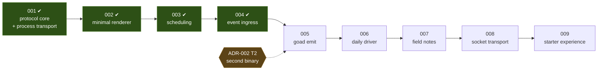

# Roadmap

**Status:** advisory. This document is **not canon** — it binds nobody and
amends nothing. `docs/specs/`, `docs/policy/` and `docs/adr/` govern; a slice's
own `slice-nnn.md` is the truth about that slice's scope. This file exists to
answer one question: *what is the next slice, and why that one?*

Revise it in place whenever the answer changes. No changelog.

## Where this stands

**2026-09-08.** Slices 001, 002 and 003 are closed. 001 produced SPEC-001 and
the semantic core: canonical protocol types, permissive normalization, pure
schedule resolution, the spawn-per-invocation process transport, and the failure
taxonomy. 002 split the single crate into a workspace of one member per stratum
(ADR-003) and drew the first renderer. 003 gave the host a clock: a resolved
next check now makes it evaluate, in both directions, bounded by a three-second
floor (SPEC-002, ADR-004).

`just check` is **six commands and one column** — the crate split retired the
feature matrix (POL-001). Purity is held by four ADR-001 instruments plus the
domain-vocabulary scan, plus one residue nothing enforces.

The host renders, keeps time, and — since 2026-09-08 — actually launches:
`just demo` starts it against `examples/shell/backend.sh` and a window appears.
That fix was a one-line reordering in `main.rs`, and it was needed because
`slint::set_xdg_app_id` ran before any component existed, so every launch since
002 had failed. Three slices closed green over it, because nothing in the gate
constructs the real platform and nothing in the lifecycle asked a person to run
the thing. The second of those is now closed — `docs/AGENTS.md` §Tiers requires
a person to run the software before a slice closes. The first stands: no
automated check constructs the real Slint platform, and none is planned.

**2026-09-11.** Slice 004 is closed. Something listens: a Unix socket accepts an
opaque event envelope and forwards it into 003's evaluation path, bounded by its
own anchor rather than the scheduled one. It produced **SPEC-003** (host event
ingress) and **ADR-005** (the envelope normalizes in stratum 2), amended
SPEC-002 (R-12, the event bound, and P-E, the principle it and R-4 instance) and
SPEC-001 (R-56, narrowed to evaluations the host originates on its own account,
with `"host"` reserved as a source). One code review over eight rounds, 28
findings, none outstanding; eight durable facts lifted into `docs/memory/`.

**Nothing calls it ergonomically**: prompting an evaluation still means a
`socat` one-liner that hand-writes the envelope, which is slice 005.

**The slices from here are thinner, and most are tier 1** (`docs/AGENTS.md`
§Tiers): capped design surface, design and plan reviewed in one two-round
ledger, code review unchanged. The re-cut below puts *you running goad daily* at
006 rather than behind the whole brief. 49,631 lines of slice documentation for
16,891 lines of Rust is the number that prompted it.

## Sequence

Brief §20 suggests eight implementation phases. Slices 001–003 carried its
phases 1–4; the rest are re-cut below, ordered by value per token rather than by
the brief's order.

| slice | tier | why here |
|---|---|---|
| 004 event ingress ✔ | 2 | 003 built the scheduled evaluation path; an event is a second stimulus into it. Opened tier 1, raised at scoping |
| 005 `goad emit` | 1 | needs 004's listener to emit into — a CLI with no socket cannot be tested end to end |
| 006 daily driver | 1 | the point where you run goad every day. Everything after it is informed by having done so |
| 007 field notes | 1 | scope written *after* two weeks of your own use, not before |
| 008 socket transport | 2 | touches SPEC-001's transport section, so it is canon-changing by construction |
| 009 starter experience | 1 | documenting for others documents what exists |

Two changes from the old order, both deliberate:

- **Socket transport moved from 005 to 008.** The old roadmap already said it
  was "the least user-visible remaining item". Spawn-per-invocation has not been
  measured as a problem by anyone using goad, because nobody has been using
  goad. 007 promotes it if use says it hurts.
- **The starter experience moved from 006 to 009**, and old 007's polish
  dissolved: configuration validation, diagnostics and packaging are what *you*
  need to run this daily, so they are 006; the acceptance-suite walk is 009's.

## The slices

### 002 — minimal renderer ✔

Brief §20 phase 3, §10.1, §11.1. **Closed 2026-09-05.**

A Slint window that draws a `choice` view, collects an option, and shows the
empty and diagnostic states. Host-generated `view_id` reaches the screen.

- **Fires ADR-002 T1.** Slint's build-dependency cannot be feature-gated
  cleanly, so this slice splits the crate into a workspace along the ADR-001
  strata — or supersedes ADR-002 with a decision not to. That split is a
  relocation of files; if it cannot be, ADR-001 was not being honoured, and
  *that* is the slice's first finding.
- **Carries from 001:** diagnostics retention and bounded rendering (F-42,
  F-47). `Outcome` is per-call and forgotten; whatever surfaces it must bound
  what it prints. A discarded `next_check`'s `raw` renders verbatim and
  unbounded, newlines included, and `ConfigError::Duration` both renders its
  fault and chains it as `source()` — a chain-walking logger prints it twice.
- **The standing hazard:** SPEC-001 admits option-scoped fields, richer content
  forms, and natural-language schedules that this renderer will not implement.
  Not implementing them is correct. *Narrowing the protocol to match* is the
  failure this project exists to avoid — CLAUDE.md invariant 3, brief §22.3.

### 003 — scheduling ✔

Brief §20 phase 4, §9. **Closed 2026-09-08.**

`serve` gained a third `select!` arm holding a pinned `tokio::time::Sleep`, so a
resolved next check now makes the host evaluate without being asked. An
instruction from either an `evaluate` or a `respond` moves the wait, in both
directions; an elapsed instant fires once without underflowing or spinning; a
failing backend keeps its cadence and no faster; an unreadable clock loses
neither the schedule nor its liveness. A three-second minimum spacing, anchored
to the previous scheduled firing on the monotonic clock and cleared by nothing,
is the only thing between the host and a backend that instructs the past on
every response. It adjusts nothing the host stores or reports. The next check is
one line in the diagnostic surface, and a scheduled `evaluate` is
distinguishable on the wire as `event.kind` = `"scheduled"`.

It produced **SPEC-002** (the host's scheduling behaviour) and **ADR-004** (the
floor's anchor), and added **R-56** to SPEC-001 — the three event kinds, their
meanings fixed, the set left open and a backend required to tolerate a kind it
does not know. All twelve acceptance criteria met on evidence re-run at audit;
one code review over four rounds, 22 findings, none outstanding.

- **The 001 carry is discharged.** The timer re-resolves nothing: two structural
  scans in `crates/goad-boundary` hold it, one asserting the identifier
  `resolve` names no production line in stratum 3 and one asserting
  `schedule::resolve` is called from exactly two places, both in `host.rs`. The
  busy-loop failure mode F-1, F-34 and F-48 kept raising is bounded by
  SPEC-002/R-4.
- **Nothing persists** — decided by the user at design. SPEC-001 OQ-3 stays
  shut, and SPEC-002/R-11 records the catch-up rule for the slice that changes
  that.
- **Left open:** a scheduled firing can supersede a view a person is
  mid-answering (SPEC-002 OQ-4). Both candidate repairs put domain judgement in
  the host, so the likely answer is a backend affordance and therefore a
  protocol question.

### 004 — event ingress ✔

Brief §20 phase 5, §7, §19. **Closed 2026-09-11**, at tier 2 — it raised
itself, as the entry below predicted it would.

A Unix socket accepts an opaque event envelope and forwards it verbatim into the
evaluation path 003 built. The host interprets nothing past the envelope's four
fields. No CLI — a `socat` one-liner writing to the socket is the test, and 005
is the ergonomic wrapper.

It produced **SPEC-003** (host event ingress) and **ADR-005** (the envelope
normalizes in stratum 2), and amended SPEC-002 and SPEC-001 — see *Where this
stands*.

- **The event got its own bound, and its own anchor.** SPEC-002/R-12 gives an
  ingested evaluation the same three-second spacing on a second anchor that no
  scheduled firing writes or clears, in either direction, which is what ADR-004
  was written to leave room for. P-E is the principle the two are instances of:
  one constant per bounded stimulus class.
- **Liveness is an exclusive advisory lock, never a `connect`.** A `fork`
  duplicates a listening descriptor, so a successful probe says a socket is
  bound, not that a host holds it — the finding cost five rounds of a flaky test
  chase and is `docs/memory/a-connect-is-not-a-liveness-signal.md`.
- **The boundary held.** `kind` and `data` are carried and read into nowhere;
  interpretation, debouncing and filtering stayed the watcher's and the
  backend's, per brief §7.

### 005 — `goad emit`

Brief §19. **Tier 1.**

The CLI that writes an envelope to 004's socket, so a cron job, a shell hook, or
another program can prompt an evaluation without knowing the wire format.

**Opened 2026-09-11**, scoped in `docs/slices/005/slice-005.md`. Four decisions
taken at scoping (`design-log.md`): a new member crate `crates/goad-emit` with
its own binary, because `crates/goad` links Slint and a cron job should not;
flags rather than positionals, `--data` optional; three exit codes — 0 accepted,
1 the host refused it, 2 could not send — with the reason token and any
`retry_after_ms` on stderr; and the socket path read from the host's own
configuration, `--socket` overriding.

- **Fires ADR-002 T2** — the second binary in the workspace, under ADR-003's
  rules for what a member is.
- Thin by construction: argument parsing, an envelope, a socket write, an exit
  code that says whether the host took it. If this one needs a 300-line design,
  something is wrong with 004's socket.
- **The one thing that could raise it to tier 2** is the new member's
  `goad-boundary` allowlist row (slice OQ-3): the allowlist fails closed and
  covers two members today, and answering it may amend ADR-001 or POL-001.

### 006 — daily driver

Brief §20 phases 7–8 in part, §15, §17. **Tier 1.**

The slice after which you run goad every day: configuration validation with
errors that say what to fix, the default `$XDG_CONFIG_HOME/goad/config.toml`
path exercised for real, diagnostics reachable from the tray, an autostart unit,
and a quickstart that a person follows from a clean clone.

- **This is the value slice.** 004 and 005 exist to make it worth running.
- Its acceptance is behavioural and personal: goad starts with the session,
  survives a backend that is broken, and tells you which side was wrong.

### 007 — field notes

**Tier 1.** Scope written after 006, not before.

Two weeks of your own use, then a slice that fixes what actually hurt. Its
content is deliberately unwritten here: a slice whose scope is fixed in advance
of the evidence is the brief again, and the brief is what the re-cut is trying
to stop reciting.

- It is also where **008 gets promoted or dropped**: if spawn-per-invocation
  costs something you can feel, the transport slice is next; if it does not, it
  waits longer.
- Likely candidates, on today's guesses only: SPEC-002 OQ-4 (a scheduled firing
  superseding a view you are mid-answering), option-scoped fields in the
  renderer, and whatever the diagnostic surface fails to explain.

### 008 — persistent socket transport

Brief §20 phase 6, §6.1, §6.3. **Tier 2** — it amends SPEC-001's transport
section.

JSONL over a configured Unix socket, one request in flight, process fallback
when the socket is absent or unusable, and defined reconnect behaviour. The
semantic protocol is identical across transports — SPEC-001 already says so.

- **Carries from 001:** `BackendError::PipeMissing` and `cleanup_only` are
  reachable by no test (F-15, tolerated at audit). Either a unit test that
  fabricates the state, or removal, when the transport is reworked.
- **Also cheap here:** no end-to-end case exists for a backend that writes
  nothing, or for brief §10.1/§10.2 through a real process. Both are held at
  other tiers today. If this slice rebuilds the failure matrix, add them.

### 009 — starter experience

Brief §20 phase 7, §15, §21. **Tier 1** unless capability declaration lands.

The backend author's guide, minimal backends in several languages, the
interstitial-journal example, and the complete acceptance suite walked end to
end. Discharges brief §21 AC-14 and AC-15 — an agent reads repository-local
material and writes a working backend without touching the host.

- Last on purpose: documentation written earlier documents intentions.
- **Capability declaration (OQ-1)** and **validation feedback (OQ-2)** most
  plausibly land here — see *Open decisions*. Either one makes this tier 2.

## v0.1.0 acceptance coverage

Brief §21. Where each criterion is discharged.

| # | criterion | slice |
|---|---|---|
| 1 | clone and run the native Linux GUI | `just demo` runs it ✔; 006 packages it |
| 2 | configuration points at a trivial scripting backend | 001 ✔ (config + example); observable at 002 |
| 3 | host periodically asks the backend | 003 ✔ |
| 4 | backend returns no view without error | 001 ✔ |
| 5 | simple choice rendered correctly | 002 |
| 6 | selection delivers a response to the backend | 002 |
| 7 | `next_check` from evaluation and from response | 001 ✔ |
| 8 | a later valid `next_check` supersedes an earlier one | 001 ✔ as semantics; 003 ✔ observable over time, in both directions |
| 9 | an external script sends an opaque event | 004 ✔; 005 makes it ergonomic |
| 10 | the event reaches the backend uninterpreted | 004 ✔ |
| 11 | backend may run as a persistent JSONL socket service | 008 |
| 12 | fallback to process invocation when it is unavailable | 008 |
| 13 | crashes, timeouts, invalid JSON do not crash the GUI | 001 ✔ taxonomy; 002 surfaces it |
| 14 | example backend implements the journal with no host change | 009 |
| 15 | an agent implements a backend from repository material alone | 009 |
| 16 | no domain concepts enter the host model | 001 ✔ boundary test; **standing, every slice** |

## Not on the sequence

Carried from slice 001's follow-ups, deliberately unscheduled. Each has a
condition rather than a position.

- **The boundary scanner is a text scan.** A `//` inside a string literal hides
  the rest of its line, `/* */` is not cut, all-caps compounds do not split, and
  path tokens match as substrings. Latent today; the build gate holds the
  stratum property independently. Revisit the first time `src/` acquires one of
  those forms (F-45, F-49).
- **Time-of-day strings no author writes on purpose** — `1:2:3:4:5` and `99:99`
  parse as a time of day, `T1:30` is unparseable where `T18:00` is not, and a
  config `timeout` written as a full datetime is told it is a time of day.
  Recorded, not acted on. A fixture per case if any is ever reported.
- **Slice 001's design drift**, listed in its `audit.md`. Left as written by
  user decision: SPEC-001 is the living truth, and each departure is documented
  at its site in the code.

## Open decisions

- **Where capability declaration (OQ-1) and validation feedback (OQ-2) land.**
  Both are additive fields on a view — `field.value`, `field.error`, a
  form-level message — and slice 001 confirmed neither needs a breaking
  restructure. Both need **a protocol version bump or a capability
  declaration**, because an older host that ignores `field.error` shows a form
  with no sign anything was rejected: tolerating a field is not honouring it
  (F-7 corrected the original analysis, which claimed otherwise). Per-field
  errors are semantics and must be typed fields, never keys in `hints`.
  *Recommendation:* they are their own tier 2 slice, taken when 007's use says
  a form needs to reject an answer — not folded into 009, where they would make
  a documentation slice canon-changing and blow its tier.
