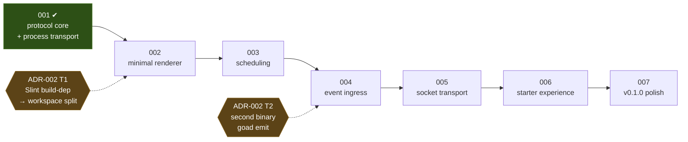

# Roadmap

**Status:** advisory. This document is **not canon** — it binds nobody and
amends nothing. `docs/specs/`, `docs/policy/` and `docs/adr/` govern; a slice's
own `slice-nnn.md` is the truth about that slice's scope. This file exists to
answer one question: *what is the next slice, and why that one?*

Revise it in place whenever the answer changes. No changelog.

## Where this stands

**2026-09-04.** Slice 001 is closed: canonical protocol types, permissive
normalization, pure schedule resolution, the spawn-per-invocation process
transport, and the failure taxonomy. It produced SPEC-001. `just check` is green
in both feature columns.

Nothing renders. Nothing keeps time. Nothing listens. The host cannot yet be run
by a person — only by a test.

## Sequence

Brief §20 suggests eight implementation phases; slices 001–007 carry them, with
§20's phases 1 and 2 both landed by slice 001.

The chain is mostly hard dependency, not preference:

- **002 before 003.** A timer with nothing to show has no observable behaviour,
  so its acceptance criteria would be unwritable.
- **003 before 004.** Ingress is a second stimulus into a scheduled evaluation
  path. Building the second stimulus first means building the path twice.
- **005 anywhere after 001**, in principle — the transport abstraction is
  already in place. It is placed fifth because it is the least user-visible
  remaining item, not because it is blocked.
- **006 last but one.** The starter experience documents what exists. Writing it
  earlier documents intentions.

## The slices

### 002 — minimal renderer

Brief §20 phase 3, §10.1, §11.1.

A Slint window that draws a `choice` view, collects an option, and shows the
empty and diagnostic states. Host-generated `view_id` reaches the screen.

- **Fires ADR-002 T1.** Slint's build-dependency cannot be feature-gated
  cleanly, so this slice splits the crate into a workspace along the ADR-001
  strata — or supersedes ADR-002 with a decision not to. That split is a
  relocation of files; if it cannot be, ADR-001 was not being honoured, and
  *that* is the slice's first finding.
- **Carries from 001:** diagnostics retention and bounded rendering (F-42,
  F-47). `Outcome` is per-call and forgotten; whatever surfaces it must bound
  what it prints. A discarded `next_check`'s `raw` renders verbatim and
  unbounded, newlines included, and `ConfigError::Duration` both renders its
  fault and chains it as `source()` — a chain-walking logger prints it twice.
- **The standing hazard:** SPEC-001 admits option-scoped fields, richer content
  forms, and natural-language schedules that this renderer will not implement.
  Not implementing them is correct. *Narrowing the protocol to match* is the
  failure this project exists to avoid — CLAUDE.md invariant 3, brief §22.3.

### 003 — scheduling

Brief §20 phase 4, §9.

The timer that turns a resolved instant into an evaluation. Default poll,
`next_check` from either direction, latest-valid-wins observable over real time.

- **Carries from 001 — the sharp one.** The timer consumes a resolved instant
  that is **always ahead of the `now` it was resolved at**, on success and on
  failure alike (R-26, R-29). It must not retry a failed exchange faster than
  that instant — where the check had elapsed, the host has already fallen back
  to the default poll — and it must not re-resolve on its own. Raised three
  times at audit (F-1, F-34, F-48). `notes.md:266` names the failure mode: a
  busy-loop the first time a backend fails.
- **May introduce persistence** of operational schedule state (brief §20 phase
  4 says "if required"). If it does, **SPEC-001 OQ-3 reopens** — R-32's
  rejection of a stale `view_id` is scoped to one process lifetime, and that
  scoping is only true while nothing persists.

### 004 — external event ingress

Brief §20 phase 5, §7, §19.

A Unix socket accepting an opaque event envelope, and a `goad emit` CLI. The
event is forwarded verbatim; the host interprets nothing beyond the envelope.

- **Fires ADR-002 T2** (a second binary) if 002 has not already split the crate.
- The whole risk is scope: event *interpretation*, debouncing, and filtering are
  the backend's and the user's watcher's, per brief §7. A host that learns what
  an event means has crossed the boundary.

### 005 — persistent socket transport

Brief §20 phase 6, §6.1, §6.3.

JSONL over a configured Unix socket, one request in flight, process fallback
when the socket is absent or unusable, and defined reconnect behaviour. The
semantic protocol is identical across transports — SPEC-001 already says so.

- **Carries from 001:** `BackendError::PipeMissing` and `cleanup_only` are
  reachable by no test (F-15, tolerated at audit). Either a unit test that
  fabricates the state, or removal, when the transport is reworked.
- **Also cheap here:** no end-to-end case exists for a backend that writes
  nothing, or for brief §10.1/§10.2 through a real process. Both are held at
  other tiers today. If this slice rebuilds the failure matrix, add them.

### 006 — starter experience

Brief §20 phase 7, §15.

`README`, the backend author's guide, minimal backends in several languages, and
the interstitial-journal example. Discharges brief §21 AC-14 and AC-15 — an
agent reads repository-local material and writes a working backend without
touching the host.

This is where **capability declaration (OQ-1)** and **validation feedback
(OQ-2)** most plausibly land — see *Open decisions*.

### 007 — v0.1.0 polish

Brief §20 phase 8, §17.

Configuration validation, diagnostics and logging, Markdown context if cheap,
Linux packaging and run instructions, and the complete acceptance suite walked
end to end.

## v0.1.0 acceptance coverage

Brief §21. Where each criterion is discharged.

| # | criterion | slice |
|---|---|---|
| 1 | clone and run the native Linux GUI | 002 runs it; 007 packages it |
| 2 | configuration points at a trivial scripting backend | 001 ✔ (config + example); observable at 002 |
| 3 | host periodically asks the backend | 003 |
| 4 | backend returns no view without error | 001 ✔ |
| 5 | simple choice rendered correctly | 002 |
| 6 | selection delivers a response to the backend | 002 |
| 7 | `next_check` from evaluation and from response | 001 ✔ |
| 8 | a later valid `next_check` supersedes an earlier one | 001 ✔ as semantics; observable over time at 003 |
| 9 | an external script sends an opaque event | 004 |
| 10 | the event reaches the backend uninterpreted | 004 |
| 11 | backend may run as a persistent JSONL socket service | 005 |
| 12 | fallback to process invocation when it is unavailable | 005 |
| 13 | crashes, timeouts, invalid JSON do not crash the GUI | 001 ✔ taxonomy; 002 surfaces it |
| 14 | example backend implements the journal with no host change | 006 |
| 15 | an agent implements a backend from repository material alone | 006 |
| 16 | no domain concepts enter the host model | 001 ✔ boundary test; **standing, every slice** |

## Not on the sequence

Carried from slice 001's follow-ups, deliberately unscheduled. Each has a
condition rather than a position.

- **The boundary scanner is a text scan.** A `//` inside a string literal hides
  the rest of its line, `/* */` is not cut, all-caps compounds do not split, and
  path tokens match as substrings. Latent today; the build gate holds the
  stratum property independently. Revisit the first time `src/` acquires one of
  those forms (F-45, F-49).
- **Time-of-day strings no author writes on purpose** — `1:2:3:4:5` and `99:99`
  parse as a time of day, `T1:30` is unparseable where `T18:00` is not, and a
  config `timeout` written as a full datetime is told it is a time of day.
  Recorded, not acted on. A fixture per case if any is ever reported.
- **Slice 001's design drift**, listed in its `audit.md`. Left as written by
  user decision: SPEC-001 is the living truth, and each departure is documented
  at its site in the code.

## Open decisions

- **Where capability declaration (OQ-1) and validation feedback (OQ-2) land.**
  Both are additive fields on a view — `field.value`, `field.error`, a
  form-level message — and slice 001 confirmed neither needs a breaking
  restructure. Both need **a protocol version bump or a capability
  declaration**, because an older host that ignores `field.error` shows a form
  with no sign anything was rejected: tolerating a field is not honouring it
  (F-7 corrected the original analysis, which claimed otherwise). Per-field
  errors are semantics and must be typed fields, never keys in `hints`.
  *Recommendation:* slice 006, alongside the field-capable renderer work the
  examples will want. They could equally be their own slice after 002.
- **Whether 003 persists schedule state.** Brief §20 phase 4 leaves it open. The
  answer decides whether OQ-3 reopens in 003 or stays shut until something else
  persists.
