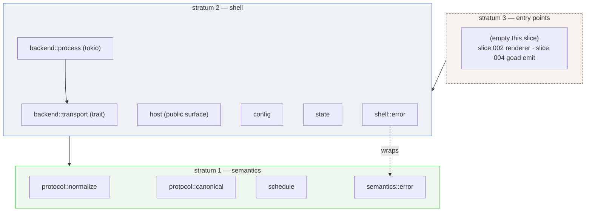
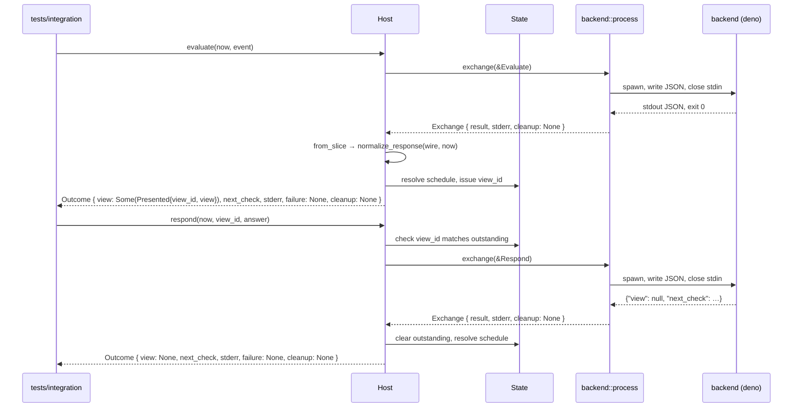
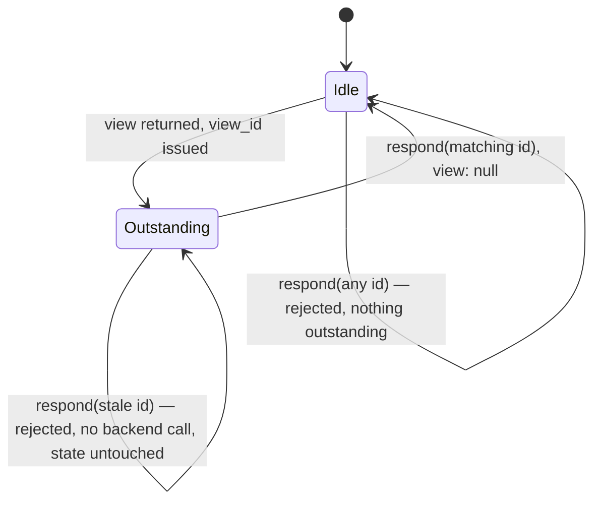

# Design — Slice 001: Protocol core and process backend transport

<!-- The *current* design, not its history. Revision chronology, review
     findings, and dispositions live in `design-log.md`.
     Reference forms: canon by id (`SPEC-003 §4`, `ADR-007`, `POL-002`);
     doc-local refs bare — OQ-1 (§6), D1 (§7), R1 (§8). Ids are immutable. -->

## 1. Design problem

The repository contains no Rust code, no crate manifest, and no canon describing
the protocol. This design settles the internal shape of the host's first code:
the canonical protocol types, the normalization that produces them from
permissive wire input, schedule resolution, and one backend transport that
spawns a user program per invocation.

The thing being designed is a contract, not a feature. The host is defined by
what it refuses to understand: it moves `evaluate`, `respond` and `schedule`
between a renderer and a user-owned backend, and every domain meaning lives on
the backend side of that boundary (brief §3.1, §21.16). So the protocol types
*are* the product surface, and they must admit capabilities no renderer yet
implements — option-scoped fields, richer content forms, natural-language
schedules — without being narrowed to whatever a first renderer happens to need.

Settling that headless is the point of doing it before the GUI. Under fixtures
and integration tests, the contract is decided by the protocol's own
requirements. Once a renderer exists, every unresolved question in the contract
gets answered by what is convenient to draw.

The boundary of this design:

- **In.** Module layout of the three ADR-001 strata inside one crate; the
  canonical type shapes and their normalization from wire forms; the error
  taxonomy and where it splits at the stratum seam; the transport trait and its
  spawn-per-invocation implementation on tokio; host operational state held in
  memory; TOML configuration of three values; the fixture corpus layout and what
  the test suite must demonstrate.
- **Out.** Anything with a window in it (slice 002); anything that wakes on a
  clock (slice 003); anything that ingests an external event (slice 004); the
  persistent socket transport (slice 005). Each constrains this design only in
  that it must not be foreclosed.

This design's own contract is a draft, not canon. Per the OQ-1 decision the
protocol specification is written incrementally in
`docs/slices/001/draft-spec.md` as design, execution and audit settle it, and
promoted to `docs/specs/` at close once it has been reconciled against what
shipped. During execution that draft, the Rust types and the AC-9 fixture corpus
together are the whole contract: the draft is authoritative about intent and the
tests are authoritative about behaviour, and where the two disagree that is a
finding to be dispositioned, not a licence to pick whichever is convenient.

## 2. Current state

There is nothing to change; there is only nothing. `src/` and `tests/` exist and
are empty, and no `Cargo.toml` exists (`research.md` Thread 2, verified). Every
file this slice touches is a new file, so no existing code constrains the design
and no existing code can be cited as precedent.

Canon is nearly as bare. `docs/specs/` and `docs/policy/` are empty;
`docs/adr/` contained nothing when research ran and now holds exactly ADR-001
and ADR-002, both raised by this slice's own scoping.

Root `AGENTS.md` was zero bytes when research ran and is no longer: it now
carries a pointer to the methodology, the canon rule, the dev-shell facts, and
four working principles. AC-10 is therefore additive rather than from-scratch —
what it still needs is the protocol-specific material brief §15.1 asks for: that
the host does not understand the user's domain, the permissive-wire /
canonical-internal rule, the warning against narrowing the protocol to the
current renderer, and the verification commands. `CLAUDE.md` remains a symlink
to it.

What *is* established, and therefore load-bearing here:

- The toolchain works. `cargo 1.99.0-beta.1` from `rust-bin.beta.latest.default`,
  `pkg-config` on PATH, crates.io reachable (`research.md`, verified).
- The GUI stack is de-risked and out of scope. Slint 1.17.1 builds and opens a
  Wayland window in this dev shell with no `flake.nix` change; mechanics are
  harvested in `docs/memory/slint-build-mechanics.md`, and the spike was deleted
  in `c8ab319`. Nothing from it entered `src/`, so ADR-002's T1 has not fired.
- No async runtime is in the tree, so tokio is an addition this design makes
  rather than one it inherits.
- deno is not in `devToolPkgs`. The test suite cannot run a TypeScript backend
  until this slice adds it.

The consequence worth stating plainly, from `research.md`'s cross-thread
finding: the absence of code and the absence of canon coincide, so whatever this
slice does becomes precedent **by default rather than by decision**. That is the
argument for spending design effort on module placement and error-type shape
here, where they cost nothing to choose, rather than in slice 002 where they
cost a refactor.

## 3. Forces & constraints

**Canon that binds.**

- **ADR-001** — three strata, dependencies downward only. Stratum 1 (protocol
  types, normalization, schedule resolution) must build and test with no
  renderer and no async runtime in its graph. This is the single strongest
  constraint on §5.1 and it decides the error taxonomy's shape in §5.2.
- **ADR-002** — one crate until a trigger fires. Its Verification section
  requires the triggers to be checked and the answer recorded in the design of
  any slice that adds a dependency or a binary. This slice adds dependencies, so:
  **T1** (a dependency required that stratum 1 must not need *in order to
  build*) — does not fire, **but only because tokio is optional**; see below.
  **T2** (a second binary) — does not fire; at most one binary. **T3** (renderer
  build dominating test wall-clock) — does not fire; there is no renderer.
  **Verdict: one crate, strata as modules, with the runtime behind a feature.**

  An earlier draft of this section answered T1 with "tokio is a stratum 2
  dependency and stratum 1 does not link it". That was false, and F-51 is the
  finding. Cargo resolves dependencies per *crate target*, not per module: in a
  single crate with a plain `tokio` dependency, `cargo test` builds one graph
  containing tokio, and `semantics/` has no separately selectable graph at all.
  ADR-001's Decision — stratum 1 "must remain buildable and testable with no
  renderer and no runtime in its dependency graph" — was therefore not merely
  unenforced, it was **untrue**, and AC-15's source-level grep proved only the
  weaker claim that `semantics/` contains no `tokio` token.

  The repair is one line of manifest, and it makes the constraint hold rather
  than restating it: tokio is an **optional** dependency behind a `shell`
  feature, and `shell/` is `#[cfg(feature = "shell")]`. Verified by building it —
  `cargo tree --no-default-features` contains no tokio, and
  `cargo test --no-default-features` compiles and runs stratum 1 against serde,
  serde_json and jiff and nothing else. That converts ADR-001 from a review gate
  into a build gate, which is what CD-1 was written to record, and it is why T1's
  answer is now "does not fire" for a checkable reason rather than an asserted
  one: with the feature off, nothing stratum 1 must not need is required in order
  to build it.

  Two consequences worth stating. ADR-002 names Slint as "the first such
  dependency"; tokio arrived first and was admitted only by making it optional,
  so that sentence needs a canon-delta line (§10). And ADR-002 rejected "a single
  crate permanently, with the renderer behind a Cargo feature" as the *standing
  position* — this is not that. The feature is how one slice keeps a binding
  constraint true; the workspace split still happens when T1 genuinely fires,
  which ADR-002 expects in slice 002, because a Slint **build**-dependency with a
  conditional `build.rs` is not made clean by a feature in the way an optional
  runtime is.

**From the brief, as intent rather than canon.**

- §3.3, liberal grammar and strict canonical semantics. The permissive/canonical
  seam is a *type* boundary, not a validation pass: after normalization there
  must be no way to hold an unnormalized value. Ambiguity fails; it is never
  guessed.
- §13 failure taxonomy, §12 `view_id` discipline, §9 latest-valid-wins with an
  invalid instruction preserving rather than disabling, §6.2 the process
  transport's shape.
- §14, decisive for tone throughout: backends are **trusted user programs, not
  sandboxed plugins**. Nothing in the code, the config, the example or its
  comments may imply isolation. deno runs with `-A` for exactly this reason, and
  that must be stated where a reader would otherwise mistake default-deny
  permissions for a security model.
- §3.7 and §15, agents are the intended editors. This is why a convention that
  exists only in prose is weak, and why `AGENTS.md` (AC-10) is a deliverable
  rather than a courtesy.

**Technical and cost.**

- tokio with `process`, `time`, `rt`, `io-util` resolves 14 unique dependencies;
  the smol family for the same job needs 31 (`research.md`, verified). `macros`
  joins them for the `select!` §5.4 needs, and costs no additional crate. `net`
  waits for slice 005.
- Slint's 411 dependencies and ~19s clean debug build are the number T1 will be
  paid in next slice. It constrains nothing today, but it is why module
  boundaries must stay *relocatable* — ADR-002 requires the split to be a file
  move, not a redesign.
- Hermeticity: `cargo test` must be able to spawn a backend with no build step
  and no `node_modules`. This is why deno, and it is a constraint on the example
  as much as on the fixtures.
- AC-1 sets the verification floor: build, test, lint at zero warnings, and
  format check, all from a clean clone in the dev shell.

**House style.** The one precedent that exists is documentary: `flake.nix`
comments explain *why* a non-obvious thing was done, at length, rather than
restating what the code does (`research.md`). Rust comments here follow that —
sparse, but expansive where the reason is not visible from the code.

## 4. Guiding principles

**P1 — Canonical is a type, not a promise.**
After normalization there must be no way to *hold* an unnormalized value. Not a
validated field, not a `String` that everyone agrees is an RFC 3339 timestamp —
a distinct type that cannot be constructed except by normalization succeeding.
Brief §3.3 draws this line and ADR-001 puts a stratum boundary on it; P1 is what
makes the line checkable by the compiler instead of by review.

*Scope.* P1 governs the values the host **interprets** — instants, numeric
bounds, identifiers, kind discriminants: anything the host reads in order to
decide something. It does not govern payloads the host only carries:
`Content::Uri`, `hints`, `Event.data`, and the `values` map of a user response.
Those are opaque by design — brief §3.4 hands `hints` to the renderer, and §14
makes the backend a trusted user program rather than a sandboxed plugin.
Extending P1 to them would have the host parse a URI it never dereferences, to
satisfy a principle whose purpose is protecting decisions the host does not
make. The boundary is not permanent: the moment the host starts interpreting one
of them, that value comes under P1. Raised as F-9 in `review-design.md`.

*What this loses:* the single-struct-with-optional-fields design, which is fewer
types and less mapping code. It also loses the convenience of reaching for the
raw wire value later, downstream of the seam, when it would be handy. The
scoping above additionally loses uniformity — a reader must ask which side of
the interpret/carry line a value falls on, rather than reading one rule off the
type.

**P2 — An invalid value costs the sender its effect, never the host its
function.**
The host reports the failure and continues from the state it already had. A
malformed `next_check` loses that instruction; it does not disable scheduling
(brief §9). A malformed response loses that response; it does not poison the
transport. A stale `view_id` loses that answer; it does not clear the
outstanding interaction.

This sits in tension with P1 by design, and the tension resolves by scope: P1
governs whether a bad value may be *represented* (it may not), P2 governs how
far its blast radius reaches (as far as the value, no further). Neither licenses
absorbing an error silently — every refusal is a named error and reaches
diagnostics.

*Granularity.* Failure is whole-message by default. A part may be discarded on
its own only when **both** of these hold:

> 1. its absence is already a modelled state with defined semantics, distinct
>    from "we failed to read it"; and
> 2. the **protocol** is what specifies the behaviour in that absence — not the
>    host, and not the renderer.

The second clause is what keeps the rule from licensing invention. Clause 1 says
there is somewhere to land; clause 2 says the destination was chosen by the
contract rather than by whoever wrote the discard path. Without it, every
`Option` field in the canonical types would qualify, because an `Option` always
*has* an absent state — the question is whether that state's meaning was
specified or improvised. (Raised as F-4 in `review-design.md`: the one-clause
rule admitted `body`, which was never intended.)

`next_check` satisfies both. An absent `next_check` is a real state with a
defined meaning, and brief §9 is the thing that defines it — "retain an existing
valid scheduled check, else use the configured default poll interval" — so
discarding the field lands the host in a state the protocol already told it how
to occupy. Brief §13 corroborates by listing "invalid scheduling value" as a
failure mode *distinct from* "protocol-invalid response"; the entry would be
redundant if a bad `next_check` invalidated the message.

`body` satisfies clause 1 and fails clause 2. An absent body is modelled — the
field is optional and a view with no body is ordinary. But nothing in the brief
says what a renderer does with a body that *was* sent and could not be read.
Dropping it silently renders a view the backend did not author; substituting
placeholder text invents content. Either way the host is choosing, so the whole
message is rejected instead.

`view` fails clause 1. Its only absent-view state is an explicit `view: null`,
and per brief §11 that is a positive assertion — "nothing to show right now".
Degrading an unreadable view to `null` would have the host assert on the
backend's behalf that there is nothing to show, when the truth is that it could
not tell. That is the invented semantics brief §3.3 forbids. This is also why
`view` is a **required** field — see F-5 and §5.2: a message that omits it
entirely has failed to say anything about the view, which is not the same claim
as saying there is none, and the two must not normalize to one value.

Applied to this slice:

| part invalid | outcome |
|---|---|
| `next_check` | discarded; §9 fallback applies; typed error to diagnostics; rest of the message accepted |
| envelope or protocol version | whole message rejected |
| `view` absent entirely | whole message rejected — `MissingField { field: "view" }` |
| `view` explicitly `null` | accepted; nothing to show (brief §11) |
| `view` or `choice` structure | whole message rejected |
| `body` present but unreadable | whole message rejected — fails granularity clause 2 |
| unsupported required primitive | whole message rejected — brief §13, "fail clearly" |
| option-scoped field no renderer implements | not a normalization failure at all; admitted by the types, unimplemented downstream (brief §22.3) |

This costs P1 nothing. The canonical response holds `schedule:
Option<CanonicalInstant>` where `None` means "no instruction supplied"; an
invalid value normalizes to `None` **plus** a reported error, and the error
travels alongside the canonical value rather than inside it. So normalization
remains a total function into a genuinely canonical type — see §5.2, where its
result carries a discard list rather than being a bare `Result`.

*What this loses:* the simpler, louder discipline of failing hard on bad input.
The code carries a "keep the previous value" path a fail-fast design would not
have, and that path needs its own tests. The discard list is also a shape every
caller must handle, where a bare `Result` would have been ignorable.

**P3 — Shape the seams for the second implementation the brief already names,
and no further.**
The transport is a trait now, with one implementor, because brief §6 specifies
two transports and slice 005 builds the other; the trait's shape must not
presume spawn-per-invocation. The protocol types admit option-scoped fields and
richer content forms because brief §22.3 says a later renderer implements them.

The bound is the second half. A seam is justified by a named future
implementation, not by imagining one. Where the brief names nothing, this slice
builds the concrete thing — configuration is a struct with three fields, not a
provider abstraction; host state is a struct in memory, not a persistence trait
awaiting a backend.

*What this loses:* both directions. Against "do not abstract until you need it",
it accepts a trait with one implementor. Against "make it all pluggable", it
refuses abstractions for futures the brief has not committed to.

## 5. Proposed design

### 5.1 System model

One crate, three strata as ADR-001 defines them, **grouped by stratum at the top
level of `src/`** and named with the ADR's own words:

```
src/
  lib.rs              # stratum wiring and the crate's public surface
  semantics/          # STRATUM 1 — pure. No I/O, no async, no tokio.
    protocol/
      wire.rs         #   permissive deserialization targets
      canonical.rs    #   canonical types; constructible only via normalize
      normalize.rs    #   wire -> Normalized<canonical>
    schedule.rs       #   pure resolution: latest-valid-wins
    error.rs          #   parse and validation errors
  shell/              # STRATUM 2 — I/O. #[cfg(feature = "shell")] — F-51.
    backend/
      transport.rs    #   the trait (async at its boundary)
      process.rs      #   spawn-per-invocation on tokio
    config.rs         #   TOML: command, timeout, default poll interval
    state.rs          #   outstanding view_id, resolved schedule (in memory)
    host.rs           #   composition: transport -> normalize -> resolve -> state
    error.rs          #   transport errors, wrapping semantics::Error
tests/
  protocol/main.rs    # fixture-driven, stratum 1 only (AC-9). One cargo target
  integration/main.rs # round trip through the process transport (AC-7). One
                      #   cargo target, `required-features = ["shell"]`
  backends/           # the deliberately-misbehaving fixtures + the bash guard;
                      #   scripts and data, not a cargo target
examples/
  typescript/         # the showcase backend, deno
```



**The runtime is optional, and that is what makes ADR-001 true rather than
aspirational — F-51.**

```toml
[dependencies]
serde      = { version = "1", features = ["derive"] }
serde_json = "1"
jiff       = { version = "0.2", default-features = false }
tokio      = { version = "1", optional = true,
               features = ["process", "time", "rt", "io-util", "macros"] }

[features]
default = ["shell"]
shell   = ["dep:tokio"]

# Test targets are declared, not discovered, because one of them must be
# feature-gated and `required-features` has nowhere else to live.
[[test]]
name = "protocol"
path = "tests/protocol/main.rs"

[[test]]
name = "integration"
path = "tests/integration/main.rs"
required-features = ["shell"]
```

With `#[cfg(feature = "shell")] pub mod shell;` in `lib.rs`. Cargo resolves
dependencies per crate target, so without this a single crate cannot give
stratum 1 a graph of its own at all, however the modules are arranged: ADR-001's
"no runtime in its dependency graph" would be false rather than merely
unenforced. With it, `cargo test --no-default-features` builds and runs stratum
1 against serde, serde_json and jiff and nothing else — verified by building it,
including `cargo tree --no-default-features` showing no tokio node.

**The gate needs the test targets gated too, or it does not hold.** A feature
selects dependencies; it does not stop `cargo test --no-default-features` from
*building every test target in the package*. The integration tier spawns
processes on tokio, so without `required-features = ["shell"]` that command
fails to compile and the build gate is unrunnable the moment that tier exists —
the F-51 probe passed only because the crate it ran in had no integration tests
yet. With the gate declared, cargo skips the target whose features are unmet and
the protocol tier runs alone, which is the property AC-15 is actually asserting.
`autotests = false` sits in `[package]` beside them so these two targets are the
only ones, rather than being configured here and discovered again as well.

This is the difference between AC-15 proving `semantics/` contains no `tokio`
token and the build proving stratum 1 does not depend on tokio. The first is a
grep and can be defeated by a re-export; the second is Cargo's own resolution.
AC-15 stays — it catches the upward `use crate::shell::…` that a feature flag
cannot — but it is no longer carrying the constraint alone.

**Why grouped by stratum rather than by topic.** Two reasons, both about the
weakness ADR-002 admits — that until the split, ADR-001 has no compiler behind
it for the *direction* of dependencies, whatever the feature does for the
dependency graph.

1. It makes a violation visible in the import line itself. `use crate::shell::…`
   inside `src/semantics/` is wrong on sight, without the reader needing to know
   which topic belongs to which stratum. Brief §3.7 makes agents the editors,
   and an agent reads the line in front of it.
2. ADR-002 requires the eventual split to be a file move. Grouped this way it
   literally is: `git mv src/semantics crates/goad-semantics/src`. Grouped by
   topic, the split first requires deciding which topic is which stratum — which
   is the redesign ADR-002 says must not be necessary.

The names are lifted verbatim from ADR-001 ("pure semantic core", "I/O shell")
so the path leads a reader to the governing document.

**Stratum 3 is declared and empty.** This slice ships a library with no binary.
No acceptance criterion needs one, and P3 says build the concrete thing only
where the brief names it — the brief names a renderer (slice 002) and `goad
emit` (slice 004), neither of which is here. A debug binary for manual poking
would be unrequested scope. Side benefit: the integration tests can only reach
the crate through its public API, so the library surface is forced to be usable
by something other than itself.

**Mechanical enforcement of the boundary (AC-15).** ADR-002 names its own whole
risk as ADR-001 having no compiler behind it during the one-crate period. That
is partly fixable here for very little: a test that reads the files under
`src/semantics/` and asserts none of them mentions `crate::shell`, `crate::bin`
or `tokio`, failing if it finds no files to inspect so that a rename cannot pass
it vacuously. Crude — it is a string search over source text — but it catches
the actual failure mode, which is an agent writing an upward `use`. AC-11 already
establishes grep-checkable structure as acceptable here, so this is the same
instrument aimed at the other invariant.

**What this half does and does not promote.** ADR-001's Verification section
calls itself a review gate, and D49 has already moved *half* of it: the
dependency-graph claim is now a build gate, held by the feature and checked by
`cargo test --no-default-features`. This test is the **other** half — direction —
and it does not promote that half. It checks three known tokens, so it catches
the common case and not the class: a re-export that flattens the boundary, a
downward type leak, or `std::fs` under `semantics/` all pass it. For direction,
the ADR's statement that this is a review gate until the strata become crates
stands as written. CD-1 records the split explicitly, so audit disposes of both
halves deliberately rather than discovering them.

### 5.2 Interfaces & contracts

**Wire and canonical are separate type families, and only inbound data has
both.** Requests are host-authored, so there is one type and it is canonical;
nothing untrusted arrives on that path. Responses arrive from user code, so they
have a permissive wire twin. This halves the type count relative to mirroring
everything, and the asymmetry is principled — we control what we emit.

#### Inbound: wire types

```rust
// semantics/protocol/wire.rs
#[derive(Deserialize)]
pub struct WireResponse {
  #[serde(default)] pub protocol: Option<u32>,

  /// Outer `Option`: was the field present at all. Inner: was it `null`.
  /// `None` => omitted, `Some(None)` => explicit null, `Some(Some(v))` => a view.
  #[serde(default, deserialize_with = "present")]
  pub view: Option<Option<WireView>>,

  #[serde(default)] pub next_check: Option<serde_json::Value>,
}

/// serde maps both an absent field and an explicit `null` to `None`, so the
/// outer layer has to be supplied rather than inferred from nesting.
fn present<'de, T, D>(de: D) -> Result<Option<T>, D::Error>
where T: Deserialize<'de>, D: Deserializer<'de>
{ T::deserialize(de).map(Some) }
```

Three deliberate choices here:

- **No `deny_unknown_fields`, anywhere inbound.** Brief §13: unknown optional
  fields are ignored.
- **`view` is required, and absent is distinguished from `null`.** These are
  different claims: `null` asserts "nothing to show" (brief §11), while omission
  asserts nothing at all. Collapsing them would have the host manufacture the
  positive assertion on the backend's behalf — the invention P2's granularity
  rule exists to prevent. An omitted `view` therefore yields
  `MissingField { field: "view" }` and rejects the message. This was F-5.
  The double-`Option` shape is load-bearing and was verified, not assumed: with
  a bare `#[serde(default)] Option<Option<T>>`, serde returns `None` for `null`
  as well as for absence, and the distinction is silently lost.
- **`next_check` is typed `serde_json::Value`, not `Option<String>`.** This is
  the one place the wire type is looser than the JSON we expect, and P2 is the
  reason: if it were `Option<String>`, then `"next_check": 45` would be a serde
  failure that kills the whole message — violating the granularity rule, which
  requires that field to be discardable on its own. A loose wire type is what
  makes a precise error possible.

Note what the first and second bullets do *together*: unknown fields are ignored,
but a known-and-required field's absence is a named error rather than a serde
message. Permissiveness is about fields we do not model, not about fields we do.

**One rule governs `null` everywhere, and stating it was F-50.** For every
modelled field, **an explicit `null` means exactly what omission means — except
where the protocol defines a distinct meaning for `null`, which is `view` and
only `view`.** That is not a description of what serde happens to do; it is the
reason `view` needs a presence-preserving deserializer and the other fields do
not.

The review raised this as a defect, on the grounds that `{"next_check": null}`
reaches `None` silently while `{"next_check": 45}` produces a reported
`NotAString` discard — two non-string values, two treatments. The observation is
exact and was verified: `{}` and `{"next_check": null}` both deserialize to
`None`, as do `{}` and `{"protocol": null}`. The disposition is that the
behaviour is right and the *silence about it* was the defect. Serializers in the
languages backends will be written in emit `null` for an absent optional
constantly — Python's `json.dumps({"next_check": None})` is the normal output of
ordinary code — so treating it as an invalid value would report a discard against
a backend doing nothing wrong, on most messages. `45` is different in kind: it is
a value the backend meant, in a type the protocol cannot use.

`view` is the exception because `null` there is a *positive assertion the
protocol defines* — "there is nothing to show" (brief §11) — which omission does
not make. Nowhere else does the protocol give `null` a meaning that differs from
absence, so nowhere else is there anything to lose. If a later field needs one,
the presence-preserving deserializer is how it says so, and this paragraph is the
test it has to pass first.

**The rest of the inbound wire shape is fixed by the brief's own examples**, and
this is F-31 and F-38. Those examples are what a backend author copies, so a wire
type that rejects one is wrong regardless of how clean it reads.

```rust
// semantics/protocol/wire.rs
#[derive(Deserialize)]
pub struct WireField {
  pub id:    String,
  pub kind:  String,
  pub label: String,
  #[serde(default)] pub min:     Option<f64>,
  #[serde(default)] pub max:     Option<f64>,
  #[serde(default)] pub options: Option<serde_json::Value>,

  /// Every other key on the field object. Brief §10.2 writes `multiline` flat,
  /// alongside `id` and `kind` — hints are not a nested member on the wire.
  #[serde(flatten)] pub hints: BTreeMap<String, serde_json::Value>,
}

/// A **view's** option. The only wire type carrying `fields`.
#[derive(Deserialize)]
pub struct WireOpt {
  pub id: String,
  pub label: String,
  #[serde(default)] pub fields: Option<Vec<WireField>>,
}

#[derive(Deserialize)]
pub struct WireChoice {
  pub title: String,
  /// A bare string or a tagged object. Left untyped and dispatched in
  /// `normalize`, so an unrecognised `kind` keeps its own named error.
  #[serde(default)] pub body:    Option<serde_json::Value>,
  #[serde(default)] pub options: Option<Vec<WireOpt>>,
}
```

Two shapes, both verified by running them:

- **`hints` is flattened, not nested.** Brief §10.2's field example is
  `{"id":"notes","kind":"text","label":"Anything notable?","multiline":true}` —
  `multiline` sits flat. With a nested `hints` member that key is unmodelled, so
  the no-`deny_unknown_fields` rule *silently discards* it: the brief's own
  example loses its presentation information and reports nothing, which is the
  worst available outcome. Flattening makes "everything else on the field" the
  definition of a hint, which is also the honest reading of brief §10.2's "likely
  presentation hints over time".

  The cost, stated precisely rather than as a worry: a misspelled **optional**
  key (`minn` for `min`) becomes a hint instead of being noticed. A misspelled
  **required** key still fails — `{"id":"x","kind":"text","labell":"typo"}`
  errors with `missing field 'label'`, because the declared field is still
  required after flattening. So the exposure is narrower than flattening usually
  implies, and it is bounded by which keys are optional.

  Rejected: accepting both a nested `hints` object and flat keys. Two spellings
  for one thing is exactly the ambiguity brief §3.3 says must fail rather than be
  guessed at, and it doubles the normalization paths for no gain.

- **`body` is `serde_json::Value`, for the same reason `next_check` is.** Brief
  §10.1's required v0 example is `"body": "Optional context"` — a bare string —
  while §11.1's richer forms are tagged objects. A string-or-object type is the
  contract, and the tempting encoding, `#[serde(untagged)]`, is wrong here: it
  collapses every failure into "data did not match any variant", which destroys
  F-6's `UnsupportedPrimitive { kind, at }`. So the wire stays untyped and
  `normalize` dispatches: a string becomes `Content::Text`; an object is read for
  its `kind`; an unrecognised `kind` is the named error with its path; anything
  else is a typed shape error. A loose wire type is again what makes a precise
  error possible.

**A modelled key the field's kind does not admit is rejected, not absorbed —
F-45.** `WireField` declares `min`, `max` and `options` for every kind, because
one struct deserializes all five and the discriminant is only read afterwards.
That is fine for deserialization and wrong for meaning: serde consumes those keys
*before* `kind` is dispatched, so a `min` on a text field can no longer fall
through to `hints` and simply vanishes. Silently absorbing a value the sender
meant is the one outcome brief §3.3 and R-47 both forbid. Normalization therefore
checks applicability — `min`/`max` only on `number`, `options` only on `choice` —
and raises `InapplicableKey { key, kind, at }`, carrying the path for the same
reason `UnsupportedPrimitive` does.

Treating them as hints instead was the alternative, and it is worse. D37's whole
basis is that unknown keys are presentation and *known* keys are contract; a known
key appearing where its kind gives it no meaning is a contradiction, not a
decoration. This is also the flatten decision's cost paid rather than deferred:
the narrow exposure D37 claimed — misspelled *optional* keys — is only narrow if
*misplaced modelled* keys are caught, and before F-45 they were not.

The protocol version is handled asymmetrically, because the two directions have
different authorship. The host always **writes** `"protocol": 1` on requests. On
a response it **accepts** the field's absence — brief §8.2's own examples omit
it, so requiring it would reject every backend written against the brief — but
**rejects** a response declaring a version the host does not know, since
proceeding would be guessing at semantics. Brief §13's "versioned from day one"
is satisfied by the envelope carrying the field, not by both sides being
compelled to send it.

#### Inbound: canonical types

```rust
// semantics/protocol/canonical.rs
//
// Every field below is `pub(super)`: writable from within `semantics::protocol`,
// which is where normalization lives, and read-only to everything else through
// the accessors. Outside this module a canonical value can only have come out of
// `normalize_response`. That is P1 with a compiler behind it rather than a
// comment. Accessors are elided here for length; each field has one returning a
// borrow, and the types derive `Debug`, `Clone`, `PartialEq`.

// The scalar newtypes every type below is written in terms of. Each is a
// newtype rather than a bare `String` so that a view id, an option id and a
// field id cannot be passed for one another — they are addresses in three
// different namespaces (I15) and the compiler is the cheapest place to say so.
pub struct ViewId(String);        // `{now}#{seq}` — D13
pub struct OptionId(String);      // names a *view's* option; `UserResponse.option`
pub struct AlternativeId(String); // a value a `choice` field may take — F-61
pub struct FieldId(String);       // keys `UserResponse.values`
pub struct Timestamp(jiff::Timestamp);   // an instant, always supplied as `now`
pub struct Hints(BTreeMap<String, serde_json::Value>);  // opaque, never branched on (I7)

pub struct Response { pub(super) view: Option<View>, pub(super) schedule: Option<Timestamp> }
//                                     ^ None = nothing to show   ^ None = no instruction supplied

pub enum View { Choice(Choice) }

pub struct Choice {
  pub(super) title:   String,
  pub(super) body:    Option<Content>,
  pub(super) options: Options,            // newtype: >= 1, ids unique
}

pub struct Opt { pub(super) id: OptionId, pub(super) label: String, pub(super) fields: Fields }

pub enum Content { Text(String), Markdown(String), Html(String), Uri(String) }

pub struct Field {
  pub(super) id:    FieldId,
  pub(super) kind:  FieldKind,
  pub(super) label: String,
  pub(super) hints: Hints,
}

pub enum FieldKind {
  Text, Boolean, DateTime,
  Number(NumberRange),
  /// Not `Options`: an alternative is a value, not an action, and carries no
  /// fields of its own. F-54.
  Choice { alternatives: Alternatives },
}

/// A value a `choice` field may take. Deliberately id and label only, and
/// deliberately **not** an `OptionId`: a view's option is *selected* — it is what
/// `UserResponse.option` names — while an alternative is *submitted*, as the
/// value at `values[field_id]`. Two namespaces, so two types. F-61.
pub struct Alternative { pub(super) id: AlternativeId, pub(super) label: String }

// Newtypes with checked constructors, all three for the same reason: >= 1
// element, and ids unique within the collection.
pub struct Options(Vec<Opt>);
pub struct Alternatives(Vec<Alternative>);
pub struct Fields(Vec<Field>);

/// Checked: each bound finite, and `min <= max` when both are present.
pub struct NumberRange { min: Option<f64>, max: Option<f64> }

impl NumberRange {
  pub fn new(min: Option<f64>, max: Option<f64>) -> Result<Self, BoundsError>;
  pub fn min(&self) -> Option<f64>;
  pub fn max(&self) -> Option<f64>;
}
```

`Options` is a newtype with a checked constructor, not a bare `Vec`: a choice
with zero options is unrenderable, and duplicate option ids make a later
`respond` ambiguous about which option it names. Both are §3.3 ambiguities, so
both are rejected at normalization rather than tolerated. P1 says the canonical
type should not be *able* to hold either.

**`Fields` is the same newtype for the same reason, and its absence was F-52.**
`UserResponse.values` is a `BTreeMap<FieldId, Value>`, so two fields in one
option sharing an id have exactly one response key between them and cannot be
answered independently — the identical defect to duplicate option ids, one level
down, in a design that had already made the argument once and then used a bare
`Vec<Field>`. The rule generalises and is worth stating as a rule rather than as
three cases: **every identifier a response names must be unique within the scope
that response names it in.** `Options`, `Fields` and `Alternatives` are that rule
with a constructor behind it.

The three do not all fail the same way, and the rule has to be stated over
*naming* rather than over keys or it would only carry two of them. An option id
and a field id are **keys**: `UserResponse.option` selects one, and
`UserResponse.values` is keyed by the other, so a duplicate leaves the response
unable to address one of the pair. An alternative id is a **value** — the answer
to a `choice` field is that id, submitted as `values[field_id]` — so a duplicate
does not collide a key; it makes the submitted value ambiguous about which
alternative the user picked, which is the same defect arriving from the other
side. "Unique within the scope that names it" covers both; "unique as a key"
would have left `Alternatives` a newtype with no rule behind it.

**That distinction is a type, not a remark — F-61.** If a selected id and a
submitted id are different enough to need two clauses in the rule, they are
different enough that the compiler should refuse to swap them, and `Alternative`
originally carried an `OptionId`. It now carries an `AlternativeId`. The scalar
newtypes exist precisely so that three namespaces cannot be passed for one
another, so reusing one across two of them contradicted the reason they exist —
and the design said so in a comment while doing the opposite. Two consequences
fall out and are taken rather than argued around: `DuplicateAlternativeId` and
`EmptyAlternatives` join the taxonomy, because `DuplicateOptionId` raised against
an alternative asserts that the id *is* an option id, which is the F-48 naming
mistake — a variant whose name states something the path never establishes.

**A `choice` field's options are read as `Alternative`, and `fields` there is
rejected rather than ignored — F-55.** `WireField.options` is
`serde_json::Value` (see the wire types above), so normalization dispatches it
rather than serde binding it, and the dispatch checks for `fields` explicitly.
The first version of this repair said the key would be "ignored as unmodelled
under I10", which confused two layers: whether a key is modelled is a fact about
the *wire* type, and `fields` is a protocol key wherever the protocol admits it —
just not here. Ignoring it would have been the F-45 defect reintroduced by the
F-54 repair, on the same page that repairs F-45. R-53's "MUST NOT carry fields"
needs an error behind it or it is unenforceable prose.

**A `choice` field's alternatives are not `Options`, and this is F-54.** Reusing
`Options` there let a choice field's option carry `fields` of its own,
recursively — while `UserResponse` is one option id and one flat map, so there is
no way to say *which* nested option was chosen, and a nested field's id shares a
namespace with every outer field's id. That is admitted surface no requirement
asked for and no response can express: brief §10.2 shows fields on a view's
options, never on a field's. `Alternative` is therefore id and label only, which
deletes the recursion rather than documenting it. F-20 examined this reuse and
found no defect, having looked only at the view side; the response side is where
it fails, which is the same lesson as F-31 — check the shape against the message
that has to carry it, not against itself.

**`BoundsError::NotFinite` cannot be reached from the wire, and is kept anyway.**
This is F-36. JSON has no `NaN` or infinity literal: verified, `{"min": NaN}` fails
in serde_json with `expected value` and `{"min": 1e400}` with `number out of
range`, both before any bounds check runs. So the only reachable wire failures are
`Inverted` and a plain `Protocol(Json)`. The variant stays because
`NumberRange::new` is public API and P1's claim is about what the *type* can hold,
not about which caller supplied it — a guard that costs one comparison is cheaper
than an argument in a later slice about whether the invariant really holds. What
changes is the claim: §9's fixture asserts `Protocol(Json)` for a NaN literal, not
`NotFinite`, because asserting the unreachable variant would be a test that cannot
fail.

`NumberRange` exists for the same reason, and it is the second half of F-9.
`min: Option<f64>` admits `NaN` and it admits `min: 10, max: 1` — both of which
the host *interprets*, since bounds are semantics under brief §3.4 and constrain
what answer is valid. An inverted range makes every answer invalid, and `NaN`
makes every comparison false; neither is a state the protocol has any meaning
for, so neither may be representable. Rejecting them costs the sender the
message, per P2 — bounds are not a discardable part.

Note the asymmetry this creates with `hints`, `Content::Uri`, `Event.data` and
the response `values` map, which stay `serde_json::Value` and `String`. That is
P1's scope in §4 doing its job: the host constrains what it reads, and carries
what it does not.

**The line between `FieldKind` and `hints` is brief §3.4's line**: "the backend
expresses semantics, the renderer chooses widgets". Bounds on a number are
semantics — they constrain valid answers — so they live in `FieldKind`.
`multiline`, `placeholder`, `units`, `suggestions` are presentation, so they live
in `hints`, which is an open map the host does not interpret. That matters
because brief §10.2 calls its hint list "likely presentation hints **over
time**": fixing them into a struct now would narrow the protocol to today's
guesses, while an open map admits new hints with no version bump. The host must
never branch on a hint key — if it needs to, the thing was semantics and belongs
in `FieldKind`.

All four `Content` variants and all `FieldKind`s are **admitted and rendered by
nobody** in this slice. That is P3 with brief §11.1 and §22.3 naming the future
implementor.

**Any unrecognised `kind` discriminant, at any depth, produces
`ProtocolError::UnsupportedPrimitive`** carrying both the offending string and
the path at which it appeared — not a generic deserialization failure. AC-6
requires the distinct error and brief §13 wants it debuggable. The rule is stated
over the whole document rather than over `view.kind` because there are three
discriminant sites, not one: the view, each field, and each content block. A
future primitive is at least as likely to arrive as a new `FieldKind` as a new
view type, and a backend that sends one deserves the same clear refusal wherever
it put it. This was F-6.

The path is what makes the error usable at depth: `unsupported primitive
"slider"` is a puzzle in a view with nine fields, and
`unsupported primitive "slider" at view.options[1].fields[2].kind` is not. It is
a diagnostic string, not an interpreted value, so P1's scope leaves it a
`String`; how normalization accumulates it is implementation.

The serde encoding that achieves all this (a fallback variant, or reading `kind`
before dispatching) is likewise left to implementation. The contract is the named
error, the retained string, and the path.

#### Outbound: requests

```rust
// semantics/protocol/canonical.rs
pub enum Request { Evaluate(Evaluate), Respond(Respond) }
//  serialized with "protocol": 1 and "type": "evaluate" | "respond"

pub struct Evaluate { pub now: Timestamp, pub event: Event }
pub struct Respond  { pub view_id: ViewId, pub now: Timestamp, pub response: UserResponse }

pub struct Event {
  pub source: String, pub kind: String,
  pub timestamp: Timestamp, pub data: serde_json::Value,   // opaque, brief §7
}
pub struct UserResponse { pub option: OptionId, pub values: BTreeMap<FieldId, serde_json::Value> }
```

#### Normalization

```rust
// semantics/protocol/normalize.rs
pub fn normalize_response(wire: WireResponse, now: Timestamp)
  -> Result<Normalized<Response>, ProtocolError>;

pub struct Normalized<T> { pub value: T, pub discarded: Vec<Discarded> }

pub enum Discarded {
  Schedule { raw: serde_json::Value, reason: ScheduleError },
}
```

`now` is a parameter, not a clock read — that is how relative durations resolve
without stratum 1 acquiring I/O, and it makes every normalization test
deterministic with no injected clock abstraction.

`Discarded` is a closed enum with one variant on purpose. P2's eligibility test
is meant to be applied deliberately, so adding a second variant is exactly the
moment someone has to justify it against that test. A `Vec<(String, Error)>`
would let a discard slip in without the argument.

#### Errors — the AC-6 taxonomy, split at the stratum seam

```rust
// semantics/error.rs  — stratum 1: parse and validation
pub enum ProtocolError {
  Json(serde_json::Error),
  UnsupportedProtocolVersion { found: u32 },
  UnsupportedPrimitive { kind: String, at: String },   // path, per F-6
  InapplicableKey { key: &'static str, kind: String, at: String },   // F-45
  MissingField { field: &'static str },
  EmptyOptions { at: String },
  DuplicateOptionId      { id: String, at: String },
  DuplicateFieldId       { id: String, at: String },   // F-52
  DuplicateAlternativeId { id: String, at: String },   // F-61
  EmptyAlternatives      { at: String },               // F-61
  Bounds(BoundsError),
  Schedule(ScheduleError),
}

pub enum BoundsError {
  NotFinite { bound: &'static str, found: f64 },   // unreachable from JSON — see below
  Inverted  { min: f64, max: f64 },                // min > max
}

pub enum ScheduleError {
  NotAString   { found: &'static str },   // "next_check": 45
  MissingOffset{ raw: String },           // 2026-08-22T18:00:00
  CalendarUnit { raw: String },           // "1 month" — length is not fixed
  OutOfRange   { raw: String },           // parses, but now + span leaves the representable range
  Unparseable  { raw: String },           // "tomorrow morning"
}

// shell/error.rs  — stratum 2: transport and host state, wrapping the above
pub enum BackendError {
  Spawn(std::io::Error),                        // command not found
  Timeout { after: Duration },
  ExitStatus { code: Option<i32> },
  OutputTooLarge { limit: usize },               // stdout cap exceeded — §5.4, F-2
  PipeMissing,                                   // stdio handle absent post-spawn — F-35
  Io(std::io::Error),
  Protocol(semantics::ProtocolError),
}

/// Cleanup is a **second dimension**, not another `BackendError`. What the
/// backend did and whether the host disposed of it are independent facts, and
/// D42's mistake was forcing them into one precedence contest. F-48, F-53.
pub enum CleanupFailure {
  TimedOut { after: Duration },   // kill, reap and stderr drain did not finish
  Io(std::io::Error),             // start_kill or wait failed outright
}

/// Refusals that arise from host state rather than from the backend or the wire.
/// Separate from `BackendError` because the backend did nothing wrong: the
/// *caller* named an interaction the host is not holding.
pub enum StateError {
  NoOutstandingView { named: ViewId },
  StaleViewId { named: ViewId, outstanding: ViewId },
}
```

`EmptyOptions`, `EmptyAlternatives`, `DuplicateOptionId`, `DuplicateAlternativeId`
and `DuplicateFieldId` all carry a path, for
the reason F-6 gave `UnsupportedPrimitive` one: once `Alternatives` and `Fields`
exist there are several sites a duplicate can occur at, and "duplicate option id
'later'" is a puzzle in a view that has options at two depths.

`MissingOffset` is broken out from `Unparseable` because an offset-less
timestamp is the single most likely backend mistake, and "you omitted the
offset" is a debuggable message where "unparseable" is not. Brief §13 asks for
enough information to debug the backend.

`CalendarUnit` and `OutOfRange` are the F-10 additions, and they are behavioural
rather than cosmetic — see §5.4 for what the schedule grammar actually accepts
and why days resolve while months do not.

**Stderr is not on the error, it is on the `Outcome`.** An earlier draft hung
`stderr: String` off `Timeout` and `ExitStatus`, which made it reachable on
exactly the two paths that already explain themselves and unreachable on the one
that does not — a zero exit with an unparseable body. F-24 is that observation.
Stderr now travels on `Exchange` and then on `Outcome`, uniformly, so no error
variant carries a diagnostic that every path produces.

`StateError` is what AC-8 was missing (F-8, F-15). AC-8 requires a stale
`view_id` to be *rejected*, and there was no error in the taxonomy for it: the
only candidate was `BackendError`, which would have blamed a backend that had not
been consulted yet. Two variants rather than one because the diagnostics differ —
"there is no interaction open" and "you answered the previous one" are different
mistakes with different fixes. It sits in `shell/` and not `semantics/` because
staleness is a fact about host state, not about the message: the same bytes are
valid or stale depending on what the host is holding, so stratum 1 cannot
adjudicate it.

**One thing AC-6 needs stated plainly:** an invalid scheduling value is a
distinct typed error (`ScheduleError`) but it does **not** arrive as an `Err`.
It arrives inside `Normalized::discarded` on an otherwise successful parse.
AC-6's "maps to a distinct typed error" is satisfied; "the call returns an
error" was never what it said, and P2 forbids it.

#### Transport

```rust
// shell/backend/transport.rs
pub trait Backend {
  fn exchange(&mut self, request: &Request) -> impl Future<Output = Exchange> + Send;
}

/// A completed exchange. `result` is the response body, or the reason there is
/// none; `stderr` is diagnostic and is carried either way; `cleanup` says
/// whether the host disposed of the child. Note there is no outer `Result`: the
/// exchange itself always completes.
pub struct Exchange {
  pub result:  Result<Vec<u8>, BackendError>,
  pub stderr:  Captured,
  /// `Some` = the host could not establish that the child was killed, reaped
  /// and its stderr drained within `CLEANUP_LIMIT`. Independent of `result`.
  pub cleanup: Option<CleanupFailure>,
}

impl Exchange {
  /// A failure with nothing captured and nothing to dispose of — only for the
  /// paths where no process ever ran, so no stderr exists to have captured and
  /// `cleanup` is `None` because there was never a child to clean up after.
  fn failed(error: BackendError) -> Self { /* stderr: default, cleanup: None */ }
}

/// The other constructor §5.4 reaches for: a child exists but the exchange
/// cannot proceed — a missing stdio handle post-spawn. It runs the same bounded
/// disposal as the normal path and reports it on the same channel, which is why
/// it is a function rather than a second `Exchange::failed`: the whole point of
/// I13 is that a child, once spawned, is disposed of on *every* returning path.
async fn cleanup_only(child: &mut Child, error: BackendError) -> Exchange;

/// Bounded capture. `truncated` is the flag AC-5's cap needs somewhere to live.
#[derive(Default)]
pub struct Captured { pub bytes: Vec<u8>, pub truncated: bool }
```

- **`&mut self`, even though the process transport does not need it.** The
  process transport is stateless — it spawns per exchange — so `&self` was
  sufficient and was what this design originally specified. It was wrong anyway:
  slice 005's socket transport holds a connection, and a connection is mutable
  state that an exchange advances. `&self` would have forced that implementation
  into interior mutability (a `Mutex` around the stream to satisfy a signature,
  guarding against concurrency brief §12 says does not exist) or into changing
  the trait — in the slice where two implementors already depend on it. Today the
  change is one keyword. This was F-1, and P3 is the reason it counts: a seam
  justified by a named future implementation has to fit that implementation.
- **The trait owns framing, not just transmission.** It takes a canonical
  `Request` and serializes internally, because the two implementations differ in
  exactly that respect — one JSON body per process, versus one JSONL line per
  exchange on a persistent socket (brief §6). A trait taking pre-serialized
  bytes would have baked the process transport's framing into the seam, which is
  the P3 mistake.
- **Returns `Exchange`, not bare bytes — F-24 — and returns it unconditionally,
  which is F-39.** A `Vec<u8>` return could only carry stderr by attaching it to
  an error, so stderr was reachable for `Timeout` and `ExitStatus` and
  unreachable everywhere else, including the case that most needs it: the backend
  exits zero, writes something unparseable, and has already explained itself on
  stderr. It also left D27's truncation flag with nowhere to live. `Exchange`
  fixed that at one level and reintroduced it at the next, because
  `Result<Exchange, BackendError>` puts the capture on the `Ok` side and so loses
  it on **every** `Err` — which is to say on exactly the paths stderr exists for.
  That is D23's argument verbatim, one layer down: a value every path produces
  must not live on the success branch. This design stated the rule for `Outcome`
  and then failed to apply it to the type `Outcome` is built from. So the failure
  travels *beside* the capture rather than around it. Three changes to one seam
  in a single review, each because it was shaped to the process transport's
  happy path.
- **`stdout` is `Vec<u8>`, not `String`.** Invalid UTF-8 then becomes a
  `Protocol(Json)` error via `from_slice` rather than a lossy replacement. No
  silent mangling of backend output.
- **Async fn in trait, static dispatch.** Rust 1.99 makes AFIT stable, so no
  `async_trait` dependency and no `Box::pin` on every call; the host is generic
  over `B: Backend`, and tests instantiate it with a fake. Cost, stated because
  it is real: AFIT traits are not `dyn`-compatible, so slice 005's socket-first,
  process-fallback selection will need an enum over the two concrete
  implementations rather than a `Box<dyn Backend>`. That is the cheaper side of
  the trade and it is slice 005's to pay.

#### Host — the crate's public surface

```rust
// shell/host.rs
pub struct Host<B: Backend> { backend: B, config: Config, state: State }

impl<B: Backend> Host<B> {
  pub async fn evaluate(&mut self, now: Timestamp, event: Event) -> Outcome;
  pub async fn respond(&mut self, now: Timestamp, view_id: ViewId, answer: UserResponse) -> Outcome;
}
```

```rust
// shell/host.rs — Outcome is stratum 2 (F-15): it mixes canonical views from
// stratum 1 with transport and host-state diagnostics that only exist up here.
pub struct Outcome {
  /// `Some` = render this, and answer it with the `view_id` inside.
  /// `None` = nothing to show: either the backend's explicit `view: null` or a
  /// failed exchange. `failure` says which.
  pub view:       Option<Presented>,
  /// Always concrete — brief §9 resolves in every case, including failure.
  pub next_check: Timestamp,
  /// Parts the message lost without losing the message. P2's discard list.
  pub discarded:  Vec<Discarded>,
  /// Whatever the backend wrote to stderr, whether or not the exchange worked.
  pub stderr:     Captured,
  /// `Some` = the host took no action on this exchange beyond reporting it.
  /// It does **not** mean nothing happened: see below.
  pub failure:    Option<Failure>,
  /// `Some` = the host could not establish that it disposed of the backend
  /// process. A *host* condition, orthogonal to `failure`, which is the
  /// *backend's* outcome. F-48, F-53.
  pub cleanup:    Option<CleanupFailure>,
}

/// A view and the identity minted for it, inseparable by construction.
pub struct Presented { pub view_id: ViewId, pub view: View }

pub enum Failure { Backend(BackendError), State(StateError) }
```

This is the composition point — transport, then `serde_json::from_slice`, then
`normalize_response`, then schedule resolution and state update — and it is what
`tests/integration/` drives for AC-7.

`Outcome` is a struct with a `failure` field rather than a
`Result<Success, Failure>` because **every** call resolves a `next_check`, failed
ones included. Brief §9's fallback is not conditional on the exchange working; a
backend that times out must still leave the host with a concrete next wake, or
the first failure ends polling forever. A `Result` would have put that instant on
the success side and made the caller reconstruct it on the error path — the
mistake P2 exists to prevent, expressed as a type. `view: None` with
`failure: Some(_)` is precisely "we could not tell", which is the state §4 argues
must stay distinguishable from "there is nothing to show".

**`Presented` pairs the view with its `view_id`, and that is F-23.** The first
draft of this struct listed `view: Option<View>` and kept the id private in
`State`, which left a renderer holding a view it had no way to answer — AC-7
requires exactly that round trip and brief §8.3 requires the answer to carry the
id. Pairing them rather than adding a second `Option<ViewId>` field is the same
move as `Options` and `NumberRange`: the invalid combination — a view with no id,
an id with no view — is not representable, so no caller has to check for it.

**`failure: Some(_)` says the host did nothing, not that nothing happened.** This
is F-32, and the distinction matters because getting it wrong invites a retry.
Brief §8.3 lets a backend perform arbitrary side effects while handling a
response, and brief §14 gives it the user's own authority; a backend can write to
a file, send a message, and *then* time out. So a failure means the host took no
action and recorded no state change — it is not a statement about the backend's
effects, and nothing may treat it as one. This is also why there is no retry
(below): the host cannot know what a failed exchange already did.

#### Config

```toml
[backend]
command = ["deno", "run", "-A", "./backend.ts"]
timeout = "5s"

[schedule]
default_poll = "30m"
```

```rust
// shell/config.rs — the parsed form. Durations resolve at load, so nothing
// downstream carries an unparsed string, and `Config` is the type §5.4's
// sketch means by `config.timeout`.
pub struct Config { pub backend: BackendConfig, pub schedule: ScheduleConfig }
pub struct BackendConfig { pub command: Vec<String>, pub timeout: Duration }
pub struct ScheduleConfig { pub default_poll: Duration }
```

Section and key names are brief §5's, minus `socket` and `logging` per the OQ-4
decision. Durations are strings parsed with jiff, the same grammar as
`next_check` — one duration syntax across the product, and no
seconds-versus-milliseconds ambiguity. `command` is an argv array, never a shell
string: no quoting rules, no shell injection surface, and it is what makes
AC-12's `["bash", "./backend.sh"]` work without a shebang.

### 5.3 Data, state & ownership

Nothing is written to disk. Per the OQ-6 decision all host operational state is
in memory, so the state space is one process lifetime wide.

```rust
// shell/state.rs
pub struct State {
  outstanding:    Option<Outstanding>,
  resolved_check: Timestamp,       // always concrete — see below
  next_seq:       u64,
}

struct Outstanding { view_id: ViewId, issued_at: Timestamp }
```

**Three owners, and only one writer.**

| datum | owner | written by | lifetime |
|---|---|---|---|
| `Config` | `Host` | loaded once at construction, immutable after | process |
| `State` | `Host`, private | `Host::evaluate` / `Host::respond` only | process |
| backend `B` | `Host` | `Host::evaluate` / `Host::respond`, via `&mut` on `exchange` | process |
| diagnostics | nobody | returned in `Outcome`, not retained | one call |

No hot reload of config, and no shared mutability — `State` is a plain struct
behind `&mut self`, not an `Arc<Mutex<…>>`. Brief §12 serializes backend
exchanges and allows one outstanding interaction, so there is no concurrency to
protect against. Adding a lock now would be inventing a state space the brief
explicitly says to avoid.

**`resolved_check` is not an `Option`.** Brief §9 resolves to a concrete instant
in every case — the new valid instruction, else the retained one, else `now +
default_poll` — so there is no "unresolved" state to represent or handle.
`Host::new` takes `now` and seeds it. That keeps the clock out of this slice
entirely: `now` is a parameter on every entry point, and whoever owns real time
is slice 003's timer.

**Diagnostics are per-call, not accumulated.** `Outcome` carries the discards
and errors from that exchange and the host forgets them. Brief §13 wants a
"discoverable diagnostic state", but discovering it requires somewhere to
surface it, and this slice has no renderer and — per OQ-4 — no log file. Holding
a history nothing can display would be building the wrong half. Retention is
slice 002's, and the shape of `Outcome` is what makes it cheap then.

**One outstanding interaction, replaced not queued.** When a response yields a
new view while one is already outstanding, the new `view_id` replaces the old and
the old immediately becomes stale — which is what AC-8 rejects. Brief §12 says
only one may be active; replacement is the only reading that does not require a
queue, and a queue is the general concurrency semantics §12 tells us not to
introduce.

**`view_id` generation is stratum 2, its type is stratum 1.** ADR-001's own
Negative section calls this exact distinction out as one someone must make
deliberately, so: `ViewId` is a newtype in `semantics/protocol/canonical.rs`;
`State::issue` mints one in `shell/`.

The value is `{now, RFC 3339}#{seq}` — for example `2026-08-23T04:12:00Z#3`.
Four reasons over a UUID:

1. No new dependency. `uuid` v4 needs `getrandom`, for a value nothing
   authenticates with.
2. Readable in a log, which is precisely what brief §13 asks of diagnostics.
   `2026-08-23T04:12:00Z#3` tells you when the interaction was issued; a v4
   UUID tells you nothing.
3. Deterministic under a fixed `now`, so fixtures can assert exact ids instead
   of capturing whatever came out.
4. Unique where it needs to be. The counter separates ids minted from the same
   `now`; a differing `now` separates them across restarts. Brief §12's
   one-outstanding-interaction rule means there is never more than one live id
   to collide with.

Not a security consideration either way: backends are trusted user programs
(brief §14), and nothing is authorised by holding a `view_id`.

### 5.4 Lifecycle & dynamics

**Startup.** Load TOML, construct the transport from `backend.command`, then
`Host::new(config, backend, now)` seeds `resolved_check` to
`now + schedule.default_poll`. A malformed or missing config is **fatal at
construction** — there is no backend to run without it, and guessing a command
is not available to us. A backend that cannot be spawned is *not* fatal; that
failure is per-exchange, per brief §13.

**One exchange, in order.** The process transport's five steps, each of which
has a specific way of going wrong:

1. **Spawn** with all three streams piped, and `Command::kill_on_drop(true)` set
   at spawn time.
2. **Write** the serialized request to stdin, then **drop the stdin handle.** The
   close is load-bearing: a backend that reads to EOF — which is the obvious way
   to write one — hangs forever if the host holds stdin open, and the symptom is
   a timeout on every call that looks like a slow backend rather than a host bug.
3. **Drain stdout and stderr concurrently, into bounded buffers.** Reading them
   in sequence deadlocks whenever a backend writes more than a pipe buffer
   (64 KiB on Linux) to the stream we are not yet reading, and it deadlocks only
   for chatty backends, which is the worst possible failure distribution.
   `child.wait_with_output()` drains concurrently and would have been the whole
   of this step, but it is unbounded and its buffers are unreachable on the
   timeout path — see below.
4. **Await exit, and read the status.** Not "the read finished" — a non-zero
   exit discards a body that parsed (D15, R-40), so the status has to be
   observed before the body is trusted, and before anything kills the child.
5. Steps 1–4 inside **one `tokio::time::timeout`**, which bounds the backend's
   opportunity to respond — not just the read. Disposal cannot sit inside it:
   killing the child and reaping it necessarily happen *after* the timeout that
   gave up on it. So on elapse — and on every other returning path — the kill,
   the reap and the drain's completion run under a **second** bound,
   `CLEANUP_LIMIT`, and a call waits at most the sum. F-53, D48.

**Why not `wait_with_output()`.** It loses on both counts that brief §13 cares
about, and it loses them together:

- Its read is **unbounded**, so a backend stuck in a print loop exhausts host
  memory. Brief §13 says "a backend failure must not take down the host"; an OOM
  is the host going down.
- Its buffers are **owned by the future**, so when the timeout drops that future
  the partial stderr goes with it. A timeout is the failure mode with the least
  obvious cause, and this hands it the least diagnostic information. AC-5 asks
  for stderr capture and AC-6 for a distinct timeout error, and the combination —
  a timeout that says why — is what a person debugging a backend actually needs.

Both were originally accepted as one deferred follow-up (D18, D19) on the grounds
that they are a single refactor and neither AC demanded them at once. That was
optimising slice size against a stated requirement, and F-2 and F-3 in
`review-design.md` are the same objection from the outside. The refactor is done
here instead. It remains one refactor — that argument was sound, only its
conclusion was wrong.

```rust
// shell/backend/process.rs — the shape, not the implementation. This structure
// was built and run before being written down; §9 lists what the run showed.
// The two readers, whose difference is D34 and whose signatures are the reason
// the borrow structure below works: `read_capped` owns nothing past the call,
// while `drain_capped` writes into a buffer the caller owns and outlives it.
async fn read_capped(r: &mut impl AsyncRead, limit: usize) -> Result<Vec<u8>, BackendError>;
async fn drain_capped(r: impl AsyncRead, limit: usize, into: &mut Captured);

const STDOUT_LIMIT:  usize    = 8 * 1024 * 1024;
const STDERR_LIMIT:  usize    =      256 * 1024;
const CLEANUP_LIMIT: Duration = Duration::from_millis(500);

// No `?` past the spawn: once a child exists every return must clean up after
// it, and `?` would quietly hand that job to `kill_on_drop` (F-41).
let mut child = match cmd.spawn() {                          // kill_on_drop(true)
  Ok(child) => child,
  Err(e) => return Exchange::failed(BackendError::Spawn(e)),   // nothing spawned
};
let (Some(mut stdin), Some(mut stdout), Some(stderr)) =
  (child.stdin.take(), child.stdout.take(), child.stderr.take()) else {
    return cleanup_only(&mut child, BackendError::PipeMissing).await;
  };

let mut seen = Captured::default();
let (result, cleanup) = {
  // The drain is a sub-future of *this* task, not a `tokio::spawn` — F-49. It
  // borrows the caller's buffer, so no `Arc<Mutex<…>>`; and if the whole
  // exchange is cancelled it is dropped with everything else, where a spawned
  // task would have been detached and left running.
  let drain = drain_capped(stderr, STDERR_LIMIT, &mut seen);
  tokio::pin!(drain);

  // Both make progress for the whole window. The `if !drained` guard is load-
  // bearing: `select!` must not poll a future that has already completed.
  let mut drained = false;
  let raced = {
    // `body` ends at **exit**, not at EOF on stdout — F-59. It therefore holds
    // `&mut child`, which is why it lives in an inner scope: the borrow has to
    // be released before the cleanup budget below can take `&mut child` again.
    let body = async {
      /* write stdin, drop it, read stdout capped */
      let bytes  = read_capped(&mut stdout, STDOUT_LIMIT).await?;
      let status = child.wait().await.map_err(BackendError::Io)?;
      Ok::<_, BackendError>((bytes, status))
    };
    tokio::pin!(body);

    tokio::time::timeout(config.timeout, async {
      loop {
        tokio::select! {
          r = &mut body      => break r,
          _ = &mut drain, if !drained => { drained = true; }
        }
      }
    }).await
  };  // `body` dropped here, releasing `&mut child`

  // A non-zero status discards the body it came with — D15, R-40. The status is
  // read *before* the bytes are trusted, so there is no path on which a parsed
  // response outlives the exit code that disclaimed it.
  let result = match raced {
    Ok(Ok((bytes, st))) if st.success() => Ok(bytes),
    Ok(Ok((_, st)))                     => Err(BackendError::ExitStatus { code: st.code() }),
    Ok(Err(e))                          => Err(e),           // cap or I/O error
    Err(_)                              => Err(BackendError::Timeout { after: config.timeout }),
  };

  // ONE cleanup budget covering kill, reap and finishing the drain. Bounded
  // because `wait` on a pathological child can block indefinitely, and a host
  // that blocks is the host going down (brief §13).
  let cleanup = tokio::time::timeout(CLEANUP_LIMIT, async {
    child.start_kill().map_err(CleanupFailure::Io)?;
    child.wait().await.map_err(CleanupFailure::Io)?;
    if !drained { (&mut drain).await; }
    Ok::<(), CleanupFailure>(())
  }).await;

  (result, match cleanup {
    Ok(Ok(()))  => None,
    Ok(Err(e))  => Some(e),
    Err(_)      => Some(CleanupFailure::TimedOut { after: CLEANUP_LIMIT }),
  })
};  // `drain` dropped here, releasing the borrow of `seen`

Exchange { result, stderr: seen, cleanup }
```

**The two dimensions, and why they are two.** An exchange now reports what the
*backend* did and what the *host* managed to do about it, separately:

| `result` | `cleanup` | meaning |
|---|---|---|
| `Ok` | `None` | normal success |
| `Err` | `None` | the backend failed; the host recovered fully |
| `Ok` | `Some` | the response is good, but a process may still be about |
| `Err` | `Some` | the backend failed **and** the host could not dispose of it |

An earlier repair (D42) made these one channel and ranked them: a cleanup
failure was dropped whenever the exchange had already failed, on the argument
that "we also could not kill it" is a consequence of the timeout that explains
it. F-48 is why that is wrong. A timeout says *this invocation failed*; a
cleanup failure says *this invocation may still have consequences after the call
returns*. The second outlives the first, and the first will recur on the next
poll anyway. Once the reap is bounded — which F-53 forces — the case is
reachable, and a precedence rule that hides it is actively misleading rather
than merely lossy. Two dimensions make the whole precedence question disappear,
which is the tell that it was the wrong shape and not the wrong ranking.

**`CleanupFailure::TimedOut`, not `Orphaned`.** The name matters because the failure path
does not establish what it would be claiming. When the cleanup budget elapses
the child may be alive, dying, exited-but-unreaped, or perfectly fine with only
its stderr held open by a grandchild — and the last of those is the case that
actually occurs. Running it: a backend that answers correctly and leaves
`(sleep 30) >/dev/null &` holding **stderr** delivers its response, the child
exits and is reaped, and only the drain stalls — `result` is `Ok` and `cleanup`
is `TimedOut`. A variant named `Orphaned` would have been a false statement about
the most common way it fires.

**Two grandchild cases, not one — F-63.** Which descriptor the grandchild
inherits changes the outcome, and the design previously described one case while
measuring the other:

| the grandchild holds | `result` | `cleanup` | why |
|---|---|---|---|
| stderr only | `Ok(response)` | `TimedOut` | stdout reaches EOF, so the body completes and the response is delivered; only the drain is stuck |
| stdout as well | `Err(Timeout)` | `TimedOut` | stdout never reaches EOF, so the body cannot complete — the host never sees a response the backend did write |

Both were run. The second is the `Err` + `Some` row of the table above, which
until now was a combination the design called meaningful without having observed
one. It is also the honest reading of a limitation: **a host cannot distinguish
"the backend is still writing" from "the backend exited and something else holds
the pipe"**, because both look like a pipe with no EOF on it. `config.timeout` is
the only answer available, and it is the right one — the alternative is to stop
reading at the end of the first JSON document, which would silently accept a
truncated response as complete.

**Cancellation is where the two obligations part company — F-60.** Everything
above concerns paths that *return*. On cancellation nothing here runs at all: the
exchange future is dropped, and what the host holds goes with it — no task, no
buffer, no descriptor, structurally, because after F-49 there is nothing to
detach. The **child** is a different claim and a weaker one. Its disposal falls to
`kill_on_drop`, which two bullets above is called a backstop precisely because
tokio documents it as best-effort and needing a live runtime to reap. So AC-5
says the narrow thing rather than the satisfying one: on cancellation, disposal is
attempted and not observed.

Making it observed would need a supervisor outside the exchange to reap
abandoned children — which is the detached task F-49 deleted, arriving back
wearing a different hat — or killing the process group, which brief §14 refuses
because backends are trusted user programs. Both are worse than the gap. The gap
is bounded in practice by `kill_on_drop` firing on the common path and by there
being exactly one cancellation source in this slice, which is the caller
dropping a future it owns; it is stated here so that slice 003, which introduces
a timer that can cancel, meets it written down rather than discovers it.

**Total time is bounded and stated, which is F-53.** `config.timeout` bounds the
backend's opportunity to respond; `CLEANUP_LIMIT` bounds the disposal. A call
waits at most the sum, and R-41 now says so instead of claiming the configured
timeout covers everything — which it cannot, since killing a child and reaping it
necessarily happen *after* the timeout that gave up on it. Measured on the worse grandchild case —
the one where stdout is held too, so the exchange pays the full timeout and then
the full cleanup budget: 902 ms against a stated 900 ms bound, the remainder
being scheduling rather than waiting. The stderr-only case pays the cleanup
budget alone, and the normal path pays neither. The requirement bounds what the host waits for,
not what a machine guarantees.

What this makes explicit:

- **The caps are asymmetric, because the streams are.** Over-long stdout is
  `OutputTooLarge` and fails the exchange: the host cannot act on a response it
  refused to finish reading, and truncated JSON would parse as malformed, naming
  the wrong fault. Over-long stderr is **truncated and flagged**, not fatal:
  stderr is diagnostic, and a chatty backend that works is not a broken one.
- **The caps are constants, not config.** Brief §5 does not list them, and P3's
  second half says do not add configuration for a future nobody has asked for.
  8 MiB is orders of magnitude above any legitimate view — a view is prose and a
  handful of fields — and failing at a stated limit beats swapping.
- **The timed region ends at exit, not at EOF on stdout — F-59.** The step above
  is `wait`, not "the read finished", and the distinction is the whole of D15 and
  R-40: a backend may write a perfectly good response and then exit non-zero to
  disclaim it, and the host that has already committed to `Ok` cannot honour the
  disclaimer. An earlier draft of this sketch — the one F-53 produced, by pulling
  `wait` out of the timed region and into the cleanup budget — dropped the status
  on the floor, which made `BackendError::ExitStatus` unreachable and R-40's own
  fixture unpassable, while the prose four paragraphs above still listed "await
  exit" as step 4. Two consequences worth stating, because the shape is easy to
  get wrong twice:

  - Cleanup **kills**, and a kill before the status is observed destroys it. So
    the observation cannot live there. It belongs in the region that is bounded
    by `config.timeout`, which is also where it belongs on the merits: waiting
    for a backend to exit is the backend's opportunity to respond, not the
    host's disposal of it. D48's total, `timeout + CLEANUP_LIMIT`, is unchanged.
  - `body` therefore holds `&mut child`, and the cleanup budget needs it back.
    Hence the inner scope: the borrow ends when `body` is dropped, which is
    exactly where the timed region ends. `drain` stays pinned outside it because
    it borrows `seen`, not `child`, and must survive into cleanup.

- **`start_kill` then `wait`, rather than relying on `kill_on_drop`.** This is
  F-14. `kill_on_drop` is a backstop, not a guarantee: tokio's own documentation
  is explicit that the process is killed on a best-effort basis and that reaping
  requires the runtime to still be alive to poll it, so a drop during shutdown
  can leave a zombie. Killing and awaiting on the path we know about turns a
  best-effort claim into an observed one. `kill_on_drop(true)` stays set, for the
  panic and cancellation paths that do not run this code.
- **`reap` runs on every path, not only the timeout — F-26.** The first version of
  this design killed explicitly in the timeout arm and let `Ok(res) => res` carry
  the cap-exceeded and I/O-error paths straight out, which left those paths
  relying on precisely the mechanism the previous bullet says not to rely on. A
  design that names a weak mechanism and then still uses it on three paths out of
  four has not fixed anything. Cleanup is therefore unconditional, and idempotent
  — verified: tokio's `start_kill` and `wait` both return `Ok` against a child
  that has already exited and been waited on, because tokio caches the status. So
  running it on the success path costs nothing and needs no "did we already?"
  flag.
- **A `?` after the spawn is a bug, and the rule is stated over the region rather
  than the line — F-41.** `child.stderr.take().ok_or(PipeMissing)?` returned after
  the child existed and before the unconditional reap, which is the previous
  bullet's mechanism quietly reintroduced by punctuation. The sketch uses
  `let … else` and reaps first; the only return that skips the reap is the spawn
  failure, where there is no child to reap. **No `?` past the spawn** is the rule,
  because the next person to add a fallible step here will reach for one.
- **Cleanup is bounded, and that is what makes its failure reachable — F-53.**
  `wait` is not guaranteed to return. A child wedged in uninterruptible sleep
  will not die on `SIGKILL` until it leaves that state, and a host blocking
  forever inside an exchange is the host going down, which brief §13 forbids as
  squarely as an OOM does. So the disposal gets its own budget. That is also
  what turns "we could not reap it" from a near-unreachable error return into an
  outcome the design has to have an answer for — and the answer is the second
  dimension above, not a precedence rule.
- **The two readers behave differently, because the two streams do — F-25.**
  `read_capped` (stdout) stops at the limit and drops the handle: the exchange is
  already failing, and closing the pipe is what makes the flood stop rather than
  merely making our buffer stop growing. `drain_capped` (stderr) retains the first
  256 KiB, sets `truncated`, and **keeps consuming to EOF**. That difference is the
  whole point: a chatty-but-working backend blocks forever on a full pipe nobody
  is reading, so "truncate" has to mean "stop storing", never "stop reading".
  Collapsing both into one `read_capped` — which the previous draft did — turns
  D27's "over-long stderr is not a failure" into a deadlock.
- **Hitting the stdout cap kills the backend, and does so by itself.** Verified by
  building and running this design against a `yes`-style flooding backend: when
  the capped reader returns early it drops the stdout handle, the pipe closes, the
  flooding process takes `SIGPIPE`, and `wait()` returns immediately with a
  signal status. So the cap bounds the *work*, not merely the buffer — the host
  does not sit waiting on a process whose output it has already refused. A backend
  that ignores `SIGPIPE` would keep going, and the exchange timeout is what covers
  that; on the cap path we therefore kill explicitly rather than rely on it, for
  the same reason as F-14. The same run confirmed the borrow structure above, that
  stderr survives the timeout path, and that a backend reading stdin to EOF
  completes.
- **Where this can still stall, and why there is no task to abandon — F-27,
  F-40, F-49.** If the backend spawned a grandchild that inherited the stderr fd,
  killing the backend does not close the pipe and the drain never reaches EOF.
  If it inherited **stdout** as well, the body cannot complete either and the
  exchange times out before any of this — the two cases and their different
  outcomes are tabulated above, per F-63.
  The cleanup budget is what stops the host waiting on a process it does not
  manage, and the stderr **is not lost**: the buffer belongs to the caller's
  stack frame, so every byte already read survives the drain being dropped.

  This design previously ran the drain as a `tokio::spawn`, which required an
  `Arc<Mutex<Captured>>` to get the bytes back out (F-27) and then an explicit
  `abort()` so the task did not outlive the exchange (F-40) — and still leaked on
  the one path that runs no code of ours, cancellation, because dropping a
  `JoinHandle` detaches rather than cancels (F-49). Three repairs to one mistake.
  The mistake was spawning at all: the drain only ever needed to make progress
  *concurrently*, which `select!` inside a single task does exactly as well.
  Verified by building both — a sub-future is dropped the instant its parent is
  cancelled, where a spawned task keeps running — and by draining 4000 stderr
  lines past the 64 KiB pipe buffer with the body still reading stdout, which is
  the deadlock the concurrency exists to avoid.

  So the repair is a deletion: no `tokio::spawn`, no `Arc`, no `Mutex`, no
  `abort`, no join handle, and a plain `&mut Captured`. D36's claim that this was
  "the one place a lock is right" was true of a structure that did not need to
  exist — there are not two tasks contending for a buffer; there was never a
  reason for a second task. D14 refused a lock for `State` on the grounds that
  brief §12 gives the host no concurrency to protect against, and the honest
  reading is that the same answer applied here and this design talked itself out
  of it.

  We do not kill process groups: brief §14 makes backends trusted user programs,
  and reaching past the process we spawned is a bigger claim over the user's
  machine than this slice should make.



Note that `respond` checks `view_id` against `State` **before** touching the
transport. A stale answer must not reach the backend at all — forwarding it and
letting the backend sort it out would make every backend author responsible for
ordering, which is what brief §12 puts in the host.



**Failure does not move the schedule.** Every failure path leaves
`resolved_check` exactly as it was. That is P2 at the lifecycle level: a backend
that fails every invocation still gets polled on its existing cadence, because
the alternative — a failed exchange clearing or extending the schedule — turns a
broken backend into a silent host.

**No retry.** Nothing in the brief asks for one, and P3 forbids building the
seam for it. A failed exchange returns a diagnostic `Outcome` and the next
scheduled evaluation is the retry.

**Non-zero exit beats parseable stdout.** If a backend exits non-zero but wrote
valid JSON, the host reports `ExitStatus` and discards the output. The backend
told us it failed; trusting output it disclaimed would be the host deciding it
knows better.

**Every outcome yields whatever stderr the backend produced**, timeouts and
successes alike, carried on `Outcome::stderr` rather than hung off particular
error variants (F-24) — and the transport's own return type puts the failure
*beside* the capture rather than around it, so there is no path on which the two
can come apart (F-39, D40). `cleanup` rides in the same position for the same
reason: it is a fact any path can produce, so it cannot live inside the result of
one of them. For a timeout that is the diagnostic that makes it
debuggable; for a zero exit with an unparseable body it is often the only
explanation there is. Do not let a later reader "simplify" this back into
`wait_with_output()`; the caller-owned buffer, the differing readers and the
unconditional reap are all load-bearing, and §5.4 says why for each.

**Two things stated because they are lifecycle behaviour, not code detail:** the
timeout is per exchange rather than per byte, so a backend that streams slowly
but steadily still dies at the deadline; and there is no keep-alive, warm
process, or connection reuse — a fresh process per invocation is the whole
transport, which is why slice 005 exists.

### 5.5 Invariants, assumptions & edge cases

**Invariants.**

| id | invariant | held by |
|---|---|---|
| I1 | No canonical type can hold an unnormalized value | P1; `pub(super)` fields plus checked constructors (D30) — outside `semantics::protocol`, values come only from `normalize_response` |
| I2 | No file in `semantics/` names `crate::shell`, `crate::bin` or `tokio` | AC-15 test |
| I3 | Stratum 1 never reads a clock, filesystem or network, and spawns nothing. `now` is always a parameter | ADR-001; jiff with default features off |
| I4 | `resolved_check` always holds a concrete instant | non-`Option` field |
| I5 | At most one outstanding interaction | `Option<Outstanding>` |
| I6 | Only one exchange in flight | `&mut self` — compiler-enforced, not convention |
| I7 | Nothing in `semantics/` or `shell/` branches on a `hints` key. The renderer may, and is the only thing that may | review; brief §3.4, §10.2. Corrected per F-33 |
| I8 | No domain vocabulary in types or module names | AC-11 grep |
| I9 | No path panics on backend-derived data — no `unwrap`, `expect` or slicing on anything a backend produced | AC-6; `unwrap_used`, `expect_used` and `indexing_slicing` crate-wide in `[lints.clippy]` under `allow_attributes_without_reason = "deny"`, plus module-level `#![deny(clippy::arithmetic_side_effects)]` on the modules handling backend-derived data — restriction lints, so `-D warnings` alone does not enable them. Crate-wide stops at the test targets, carved out in `clippy.toml`; I9 is about run-time paths handling backend-derived data, and a test is not one (§9, F-62, F-14, D53 as amended) |
| I10 | No inbound wire type is a closed contract: no `deny_unknown_fields`, and the absence of an *unmodelled* field never means more than "not supplied" | review; see the validation-feedback analysis below |
| I11 | No backend can cause unbounded host resource growth: every stream read from a backend is capped; reaching the **stderr** cap stops storing but never stops reading; and an exchange spawns no task that could outlive it. Qualified per F-43, extended per F-40, made structural per F-49. **Scope, per F-60:** this invariant is about what the *host* holds, and it holds on the cancellation path too. It says nothing about the child process there, which no host code disposes of — I13 owns that, and concedes it | D27, D34, **D44** — the drain is a sub-future, so there is no task to outlive anything (D41, which held this by aborting one, is superseded); the stdout- and stderr-flood integration tests |
| I12 | Every `Outcome`, including every failure, carries a concrete `next_check` | D23; non-`Option` field |
| I13 | Every returning path initiates termination and waits for reaping and drain completion for a **bounded** interval; a failure to observe cleanup within it is reported as a distinct host-lifecycle outcome, never silently. On the paths where the host runs no code at all — cancellation, unwinding — `kill_on_drop` is the backstop and is named as one. Restated per F-48, F-53 | D35, **D47, D48** (D42, which held this by ranking the two failures, is reversed); cleanup is unconditional past the spawn, no `?` short-circuits it, and `Outcome::cleanup` is the report |
| I14 | A view never reaches a caller without the `view_id` that answers it | D32; `Presented` |
| I15 | Every identifier a response names — as a key it addresses by, or as a value it submits — is unique within the scope that names it | D45; `Options`, `Fields` and `Alternatives` are checked constructors. F-52, scope corrected per F-58 |
| I16 | Every field the protocol admits into a view can be expressed in the response that answers it | D46; a choice field's alternatives carry no fields. F-54 |

**Assumptions.** Each is a place this design can break.

- **A1 — stale-`view_id` rejection is scoped to one process lifetime.** From the
  OQ-6 in-memory decision: a restart *forgets* the outstanding interaction rather
  than rejecting a response to it. So AC-8 holds within a process and is silent
  across one. Nothing in this slice can answer an interaction that predates the
  process, because nothing renders one — the assumption becomes load-bearing in
  slice 002, when a user can be looking at a prompt when the host restarts.
- **A2 — modules respect the strata in the *directions* the build cannot see.**
  Narrowed per F-51. The dependency-graph half is no longer an assumption: D49's
  feature gate makes `cargo test --no-default-features` fail if stratum 1
  acquires a runtime dependency. What remains assumed is direction — AC-15's test
  catches an upward `use` naming `shell`, but not a downward type leak, a
  re-export that flattens the boundary, or `std::fs` in `semantics/`. If that
  discipline slips, ADR-002's split becomes a redesign rather than a file move,
  which ADR-002 says would itself be the finding. Carried as a risk in §8.
- **A3 — jiff's friendly duration grammar is stable across 0.2.x.** It is
  pre-1.0. `"45 minutes"`, `"1h 30m"`, `"2 hours"` and `PT45M` were verified
  against 0.2.35 by running them, as were the rejections of `"1 month"` and of
  offset-less timestamps and the exact resolution of days and weeks under
  `SpanRelativeTo::days_are_24_hours()`. If the grammar changes under a patch
  bump, what `next_check` accepts changes with it. Mitigated by the AC-9 fixture corpus
  pinning the accepted and rejected forms as tests.
- **A4 — the brief is intent, not canon, and three of its ambiguities were
  resolved by choice**: the protocol-version asymmetry, non-zero exit taking
  precedence over parseable stdout, and replacement rather than queueing for a
  second outstanding view. Each is defensible and each could be wrong; all three
  are in §7 so a reader knows they were chosen rather than derived.

**Edge cases.**

| case | behaviour |
|---|---|
| `view: null` answering an **`evaluate`** | nothing to show; schedule updates; an outstanding interaction is left exactly as it was — the backend was asked whether it had anything new, not whether the open question still stands |
| `view: null` answering an accepted **`respond`** | the interaction closes and the host returns to idle; the answer was taken and there is nothing further to show. F-46: the unqualified form of this row contradicted the state diagram |
| scheduled evaluate fires while an interaction is outstanding | permitted; a returned view replaces the outstanding one. *Whether* to poll while a prompt is unanswered is policy, and belongs to slice 003 |
| `next_check` in the past, incl. `"-45 minutes"` | parses; stored **as given**, not clamped. A past instant means the next wake is due, which slice 003's timer expresses by firing immediately. Clamping would have the host silently rewrite the backend's instruction — F-13 |
| `"next_check": "1 month"` | `ScheduleError::CalendarUnit`, discarded, message accepted. A month has no fixed length without a calendar, and stratum 1 has no time zone database by construction (§5.2, D4) |
| `"next_check": "1 day"` / `"1 week"` / `"1d 2h"` | accepted; resolved as exactly 24h / 168h / 26h. Verified against jiff 0.2.35 — F-10 |
| `next_check` that parses but overflows the instant range | `ScheduleError::OutOfRange`, discarded, message accepted |
| `"next_check": 45` | `ScheduleError::NotAString`, discarded, message accepted |
| `"next_check": null` | treated exactly as omission: no instruction supplied, so the existing or default schedule stands. Not a discard, and nothing is reported — the deliberate rule, F-50 |
| `"protocol": null` | treated exactly as omission, which R-2 already permits. F-50 |
| `"view": null` | **not** omission: the one field where `null` carries a meaning of its own. F-5, F-50 |
| `"next_check": "2026-08-22T18:00:00"` | `MissingOffset`, discarded, message accepted |
| `options: []` | `EmptyOptions { at }` — whole message rejected |
| duplicate option ids | `DuplicateOptionId { id, at }` — whole message rejected |
| duplicate field ids within one option | `DuplicateFieldId { id, at }` — whole message rejected. The response is a map keyed by field id, so two such fields cannot be answered separately. F-52 |
| a `choice` field whose options carry `fields` | `InapplicableKey { key: "fields", kind: "choice", at }` — whole message rejected. `fields` is a protocol key everywhere it is admitted, so a choice field's option is the wrong *place* for it, not an unknown key. F-54, F-55 |
| a `choice` field with no options, or duplicate alternative ids | `EmptyAlternatives { at }` / `DuplicateAlternativeId { id, at }` — the same rule as a view's options and **not** the same error, because after F-61 an alternative id is not an option id and an error that says otherwise asserts something false |
| empty stdout, exit 0 | `Protocol(Json)` — unexpected EOF |
| two JSON documents on stdout | `Protocol(Json)` on trailing content. Strictness is correct here: framing is the transport's job and this transport's frame is "one document" |
| `command = []` in config | rejected at load — nothing to spawn |
| `timeout = "0s"` or `default_poll = "0s"` | rejected at load. A zero timeout fails every exchange; a zero poll is a busy loop |
| backend emits more than 8 MiB on stdout | `OutputTooLarge`; reader closes, child reaped; message rejected |
| backend emits more than 256 KiB on stderr | first 256 KiB retained, `truncated` set, **pipe drained to EOF**; the exchange succeeds normally |
| backend answers correctly, then leaves a grandchild holding **stderr** | response delivered, `failure` is `None`, `Outcome::cleanup` is `CleanupFailure::TimedOut`; whatever stderr was read survives. Observed — the child itself exits and is reaped, which is why the variant is not called `Orphaned`. F-48, F-53, F-63 |
| the same, but the grandchild holds **stdout** too | `BackendError::Timeout` **and** `cleanup` is `CleanupFailure::TimedOut` — both dimensions failing, the only case observed to do so. Stdout never reaches EOF, so the response the backend wrote is never read. F-63 |
| backend wedged so `wait` cannot return | cleanup budget elapses; `CleanupFailure::TimedOut` reported and the exchange returns. A host that waits forever is the host going down |
| backend exits 0, writes unparseable stdout, explains itself on stderr | `Protocol(Json)`, and `Outcome::stderr` carries the explanation — F-24 |
| `"body": "Optional context"` (brief §10.1's own example) | accepted as `Content::Text` |
| `{"id":"n","kind":"text","label":"L","multiline":true}` (brief §10.2's own example) | accepted; `multiline` becomes a hint |
| `{"min": NaN}` or `{"min": 1e400}` | `Protocol(Json)` — JSON cannot express either, so bounds validation never runs. F-36 |
| field object misspells an optional key (`minn`) | becomes a hint, silently. The stated cost of D37 |
| field object misspells a required key (`labell`) | rejected — the declared field is still required after flattening |
| `{"kind":"text","min":1}` — a modelled key its kind does not admit | `InapplicableKey { key: "min", kind: "text", at }` — whole message rejected. Serde consumes it before dispatch, so the alternative is losing it silently. F-45 |
| `{"kind":"number","options":[…]}` / `{"kind":"choice","min":1}` | likewise `InapplicableKey` |

**Schedule resolution is where jiff's grammar has to be pinned, not assumed.**
`"1 month"` and `"45 minutes"` both parse to a jiff `Span`, and only one of them
can be converted to a duration without a calendar: months and years have no fixed
length, and resolving them needs a time zone, which is the I/O stratum 1 does not
have (D4 turns jiff's default features off precisely so this is impossible rather
than merely avoided). Resolution therefore converts through
`SpanRelativeTo::days_are_24_hours()`, which resolves days and weeks exactly and
rejects calendar units cleanly — verified by running it, not read off the docs.
A `Span` that converts but then leaves the representable instant range is
`OutOfRange`. Both are `ScheduleError`s, so both are discards under P2 rather
than message failures, and both are in the AC-9 corpus. This was F-10; the
original design said only "parses with jiff", which quietly assumed a total
function that does not exist.

**The host does not validate answers; the backend does.** `respond` checks the
`view_id` and nothing else. It does not verify that the answer names an option
the view offered, and it does not inspect field values at all. Field values pass
through opaque.

That decision is only safe if the eventual validation-feedback round trip — the
backend rejecting a submission, and the user seeing which fields were wrong and
why — can be added **without restructuring the protocol**. Checked here, while it
is free, because brief §22.3 asks exactly this: *are we narrowing the protocol to
match the current v0 renderer?* It needs no restructuring, and three decisions
already made are what keep it so:

1. **`UserResponse.values` is opaque.** The host can retain and echo submitted
   values without understanding any of them, so retention is a mechanical copy
   rather than domain knowledge — it does not cross brief §22.5's boundary.
   Whether the host retains them or the backend echoes them back in the
   re-presented view is a mechanism choice for that slice; neither is foreclosed.
2. **A returned view replaces the outstanding one and takes a fresh `view_id`**
   (§5.4). A validation rejection is therefore just another view, one that
   happens to resemble its predecessor. The host never needs a notion of "this is
   a retry of that", which is the expensive version of the feature. Everything it
   needs becomes additive fields on a view the host already carries: `field.value`
   for prefill or for a backend-corrected replacement, `field.error` for the
   per-field message, and a form-level message on the choice.
3. **No `deny_unknown_fields` inbound**, so an older host does not *reject* a
   backend already sending those fields, and a newer host reads them. I10 exists
   to keep this true.

**One claim here was wrong and is worth keeping visible.** This analysis
originally concluded "no protocol version bump", and F-7 refuted it. Tolerating
an unknown field is not the same as honouring it: an older host silently ignoring
`field.error` shows the user a form with no indication that anything was rejected,
which is worse than refusing the message. Additive *at the wire* is not additive
*in meaning*, and the second is what matters to the person looking at the screen.

So the real conclusion is narrower and still sufficient: validation feedback
needs **no breaking restructure** — no change to how a view is shaped, how
responses are addressed, or how values are carried — and it will need either a
protocol version bump or a capability declaration so a backend can tell whether
the host it is talking to will honour the fields it sends. That is exactly what
the versioned envelope (§5.2, D7) is for, and it is why the version is carried
from day one rather than added when first needed. Slice 001's job was to avoid
foreclosing the feature, not to ship it version-free.

One thing is deliberately settled in advance, because the tempting shortcut is
wrong: **per-field validation errors are semantics, not hints.** A renderer may
ignore `placeholder`; it must not be free to ignore a validation error. So they
belong in typed fields, never as keys in the open `hints` map.

## 6. Open questions

**None open.** OQ-1 through OQ-10 are answered in `slice-001.md`, each struck
through with its answer; OQ-8 was raised by OQ-3's answer during design and
closed in the same stage. OQ-1's answer was subsequently revised — the protocol
spec is drafted in the slice folder and promoted at close rather than written at
audit (AC-13, AC-14).

Two items are deliberately left to implementation rather than being open design
questions:

- The serde encoding that makes an unrecognised `kind` — at any of the three
  discriminant sites — produce `UnsupportedPrimitive { kind, at }` rather than a
  generic deserialization error, and how the `at` path is accumulated. The
  contract is fixed in §5.2; the mechanism is not. One encoding is known to work
  and is offered rather than mandated: read the discriminant with
  `struct WireView { kind: String, #[serde(flatten)] rest: serde_json::Value }`
  and dispatch on `kind`, which was run against nested fields, a bare-string
  `body`, a nested choice field carrying its own `options`, and both the absent
  and explicit-null forms of `view`. It confirmed that `flatten` at depth does not
  disturb the `deserialize_with` on `view` above it — the interaction worth
  checking before relying on either.
- Whether `Hints` is a `BTreeMap<String, serde_json::Value>` or a thinner
  newtype over it. No behaviour depends on the answer.

One item is deferred *work*, not an open question, and is recorded as a follow-up
in `slice-001.md`: the validation-feedback round trip. The bounded/drained pipe
refactor was also a follow-up and no longer is — it is in this slice, per F-2 and
F-3.

## 7. Decisions, rationale & alternatives

Full rationale for each is in `design-log.md`, dated. This is the index a later
reader needs so they do not reverse one by accident.

| id | decision | rejected | why |
|---|---|---|---|
| D1 | `src/` grouped by stratum (`semantics/`, `shell/`) | grouping by topic | an upward `use` is wrong on sight; ADR-002's split becomes a literal `git mv` |
| D2 | library only, stratum 3 empty | a debug binary | no AC needs one; P3. Forces the public API to be usable by the tests |
| D3 | tokio, features `process`/`time`/`rt`/`io-util`/`macros`, **optional, behind a `shell` feature** | smol family; a non-optional dependency | 14 deps vs 31, measured; `tokio::process` has the mature child-reaping path. Optional because a plain dependency makes ADR-001's dependency-graph rule false in a single crate — F-51 |
| D4 | jiff, `default-features = false` | chrono, time | parses `"45 minutes"` natively; defaults would pull tzdb, i.e. I/O into stratum 1 |
| D5 | wire/canonical duality **inbound only** | mirroring both directions | requests are host-authored; nothing untrusted arrives on that path |
| D6 | `next_check` typed `serde_json::Value` at the wire | `Option<String>` | a wrong-typed value must be *discardable*, not fatal — P2 |
| D7 | protocol version asymmetric: always written, optional inbound, unknown-declared rejected | required inbound; ignored inbound | requiring it rejects backends written against brief §8.2; ignoring it is guessing |
| D8 | unrecognised `kind` at **any** depth → `UnsupportedPrimitive { kind, at }` | the same error for `view.kind` only | AC-6 wants a distinct error; brief §13 wants it debuggable, and at depth that needs the path. Revised per F-6 |
| D9 | semantics in `FieldKind`, presentation in an open `hints` map | one flat struct of hints | brief §3.4's line. §10.2 calls its hint list provisional, so fixing it in a struct narrows the protocol |
| D10 | `Discarded` is a closed enum | `Vec<(String, Error)>` | adding a variant is the moment P2's eligibility test must be argued |
| D11 | AFIT trait, static dispatch, generic `Host<B>` | `async_trait` + `Box<dyn>` | no dependency, no per-call boxing. Cost: slice 005 needs an enum, not `dyn` |
| D12 | the response **body** is `Vec<u8>`, not `String` | `String` | invalid UTF-8 becomes a JSON error, not a lossy replacement. The body sits inside `Exchange` — see D33 and D40. Corrected per F-47 |
| D13 | `view_id` = `{now}#{seq}` | uuid v4 | no dep; readable in diagnostics; deterministic in fixtures; nothing authenticates with it |
| D14 | `State` behind `&mut self`, no lock | `Arc<Mutex<…>>` | brief §12 serializes exchanges; a lock invents a state space §12 says to avoid |
| D15 | non-zero exit beats parseable stdout | trust the output | the backend disclaimed it; trusting it anyway is the host overruling the backend |
| D16 | a second view replaces the outstanding one | queueing | brief §12 allows one active interaction; a queue is the concurrency it forbids |
| D17 | host validates `view_id` only; the backend validates answers | retain the view, check option ids | user decision. Validation feedback needs no breaking restructure, but does need a version bump or capability declaration — §5.5, corrected per F-7 and F-34 |
| ~~D18~~ | ~~accept: no stderr on timeout~~ | — | **reversed**, F-3. Stderr drains in its own task into a caller-owned buffer, and the `Exchange` carries it on the timeout path like every other. `BackendError::Timeout` itself carries nothing — D33 is why. Corrected per F-47 |
| ~~D19~~ | ~~accept: unbounded stdout read~~ | — | **reversed**, F-2. Bounded manual drain; brief §13 forbids a backend taking down the host |
| D20 | draft spec in the slice folder, promoted at close | spec written at audit | gives execution a prose contract without making it canon early |
| ~~D21~~ | ~~`kill_on_drop` as the reaping mechanism~~ | — | **superseded by D26**, F-14. `kill_on_drop` stays set as a backstop but is not what we rely on |
| D22 | `exchange(&mut self, …)` | `&self` | slice 005's socket holds mutable connection state; `&self` would force interior mutability or a trait change with two implementors. F-1 |
| D23 | `Outcome` is a struct with an `Option<Failure>`, not a `Result` | `Result<Success, Failure>` | every call resolves a `next_check`, failures included; a `Result` puts it on the wrong side. F-8 |
| D24 | `StateError` in `shell/`, two variants | reuse `BackendError`; one variant | staleness is a fact about host state, not the message; and "nothing open" ≠ "you answered the previous one". F-8, F-15 |
| D25 | `view` is required; absent ≠ `null` | `#[serde(default)]`, both → `None` | omission asserts nothing; `null` asserts "nothing to show". Collapsing them invents the assertion. F-5 |
| D26 | explicit `start_kill` + `wait` on the timeout path | rely on `kill_on_drop` | tokio's kill-on-drop is best-effort and needs a live runtime to reap. F-14 |
| D27 | stdout capped at 8 MiB (fatal), stderr at 256 KiB (truncated) | one cap; caps in config | asymmetric because the streams are: truncated stdout misnames the fault, truncated stderr is still useful. Brief §5 names no such keys. F-2 |
| D28 | schedule spans resolved via `SpanRelativeTo::days_are_24_hours()`; calendar units rejected | accept `"1 month"` | months need a time zone, i.e. the I/O stratum 1 does not have. Verified empirically. F-10 |
| D29 | a past `next_check` is stored as given, not clamped to `now` | clamp to `now` | clamping rewrites the backend's instruction; "due now" is the timer's business. F-13 |
| D30 | canonical fields are `pub(super)` with accessors; `NumberRange` is checked | `pub` fields | outside `semantics::protocol`, a canonical value can only come from normalization — P1 with a compiler behind it. F-9 |
| D31 | P1 scoped to values the host interprets, not payloads it carries | P1 over every field | otherwise P1 demands a URI parser for a string nothing dereferences. User decision, F-9 |
| D32 | `Outcome::view` is `Option<Presented>`, pairing view and `view_id` | a separate `Option<ViewId>` field | a view with no id, or an id with no view, is not representable — so no caller checks for it. F-23 |
| D33 | the transport returns `Exchange`, carrying stderr as a `Captured` beside the body | `Vec<u8>`, stderr hung off error variants | stderr must reach the caller on the zero-exit-unparseable-body path too, and the truncation flag needs a home. F-24, refined by D40 |
| D34 | two readers: stdout stops-and-closes, stderr truncates but drains to EOF | one `read_capped` for both | "truncate" must mean stop *storing*, never stop *reading*, or a chatty backend deadlocks. F-25 |
| D35 | `reap` on every path, idempotent | explicit kill only on timeout | naming `kill_on_drop` as too weak and then using it on three paths out of four fixes nothing. F-26 |
| ~~D36~~ | ~~stderr accumulates in a caller-owned `Arc<Mutex<Captured>>`~~ | — | **superseded by D44**, F-49. The lock existed only to serve a spawned task; with no task there is no sharing, and a `&mut Captured` does the job |
| D37 | wire `hints` are `#[serde(flatten)]`, not a nested member | nested `hints` object; or accept both | brief §10.2 writes `multiline` flat, so a nested member silently discards the brief's own example. Both spellings would be the §3.3 ambiguity. User decision, F-38 |
| D38 | wire `body` is `serde_json::Value`, dispatched in normalize | `#[serde(untagged)]` enum | brief §10.1's `"body": "Optional context"` is a bare string; `untagged` would collapse every failure into "matched no variant" and destroy F-6's named error. F-31 |
| D39 | keep `BoundsError::NotFinite` though JSON cannot express it | drop the variant | `NumberRange::new` is public API and P1 is about the type, not the caller. The fixture asserts `Protocol(Json)` instead. User decision, F-36 |
| D40 | `exchange` returns a bare `Exchange { result, stderr, cleanup }`, with no outer `Result` | `Result<Exchange, BackendError>` | an outer `Result` puts the capture on the `Ok` side, losing stderr on exactly the paths it exists for. D23's own argument, applied one level down. F-39 |
| ~~D41~~ | ~~the abandoned stderr drain is **aborted** after its grace timeout~~ | — | **superseded by D44**, F-49. Abort fixed the returning paths and not cancellation; deleting the task fixes both |
| ~~D42~~ | ~~a reap failure is reported only when the exchange has no other failure~~ | — | **reversed by D47**, F-48. A precedence contest was the wrong shape: cleanup outlives the exchange, so it is a second dimension, not a lower-ranked error |
| D43 | a modelled key its kind does not admit is rejected as `InapplicableKey`, not treated as a hint | ignore it; make it a hint | serde consumes it before `kind` is dispatched, so "ignore" means *silently lost*. D37's basis is that unknown keys are presentation and known keys are contract — a known key in the wrong place is a contradiction. User decision, F-45 |
| D44 | the stderr drain is a **sub-future of the exchange task**, not a `tokio::spawn` | spawn plus `Arc<Mutex>` plus `abort` (D36, D41) | a sub-future is cancelled with its parent; a spawned task is detached. Deletes the lock, the abort and the leak together. Verified by building both. F-49 |
| D45 | `Options`, `Fields` and `Alternatives` are all checked newtypes: non-empty, ids unique | a bare `Vec<Field>` | every identifier a response names must be unique in the scope that names it — option and field ids as keys it addresses by, alternative ids as the value it submits. The argument was already made for options and not carried down. F-52, F-58 |
| D46 | a `choice` field's options are `Alternative { id, label }`, carrying no fields | reuse `Options` | reuse admitted recursive fields the flat `UserResponse` cannot express. Deleting the recursion beats documenting it. User decision, F-54 |
| D47 | cleanup is a **second dimension** on `Exchange` and `Outcome`, not an error competing for one channel | precedence between reap and exchange errors (D42); a recursive `cause` | what the backend did and whether the host disposed of it are independent facts. Reviewer's formulation, adopted. F-48 |
| D48 | one `CLEANUP_LIMIT` covers kill, reap and drain completion; total wait is `timeout + CLEANUP_LIMIT`, stated | unbounded `wait`; two separate hidden graces | `wait` can block indefinitely and a blocked host is a downed host. The bound must be in the stated contract, not hidden behind the configured timeout. F-53 |
| D49 | tokio optional behind a `shell` feature; `shell/` is `#[cfg(feature)]` | plain dependency plus AC-15's grep; a workspace split now | Cargo resolves per crate target, so without this ADR-001's rule is false, not merely unenforced. Makes it a build gate. User decision, F-51 |
| D51 | the exit status is observed **inside** `config.timeout`, and a non-zero status discards the body it came with | read stdout to EOF and return; wait only in cleanup | cleanup *kills*, so a status observed there does not exist; and waiting for a backend to exit is its opportunity to respond, not the host's disposal of it. Made `ExitStatus` reachable again — it was not. Verified by running it. F-59 |
| D52 | `Alternative` carries an `AlternativeId`, with `DuplicateAlternativeId` and `EmptyAlternatives` behind it | reuse `OptionId` and its errors | an option id is *selected* and an alternative id is *submitted*; the scalar newtypes exist so namespaces cannot be swapped, and reusing one across two contradicted their reason for existing. An error named `DuplicateOptionId` for an alternative asserts what F-48 forbade a name to assert. F-61 |
| D53 | the no-panic lints are split by cost: `unwrap_used`, `expect_used` and `indexing_slicing` crate-wide in `[lints.clippy]`; `arithmetic_side_effects` module-level `#![deny(...)]` on the modules handling backend-derived data. **Amended 2026-08-27**; the original decision put all four per-module | `-D warnings` alone; all four per-module (D53 as first written); all four crate-wide | they are restriction lints and allow-by-default, so `-D warnings` never enabled them and I9 rested on nothing. Per-module was to stop F-35's case — an `unwrap` on a host-created value — being `#[allow]`ed away silently; `allow_attributes_without_reason = "deny"` answers that with a mechanism, so the three cheap lints go blanket. `arithmetic_side_effects` stays scoped because crate-wide it fires on every loop counter. F-62; user decision 2026-08-27 |
| D54 | on cancellation the host claims only what it can hold to: no task, buffer or descriptor, and `kill_on_drop` for the child | AC-5's unqualified "leaves nothing behind"; a supervisor task; process-group kill | no host code runs on that path, so the child claim cannot be made true — and the two mechanisms that would make it true are the detached task F-49 deleted and a process-group kill brief §14 refuses. User decision, F-60 |
| D50 | explicit `null` means what omission means, except for `view` | report `null` as an invalid value; or say nothing | serializers emit `null` for absent optionals constantly; `view` is the one field where `null` asserts something omission does not. User decision, F-50 |

## 8. Risks & mitigations

| id | risk | l/i | mitigation | signal it is happening |
|---|---|---|---|---|
| R1 | ADR-001's one-way rule has no compiler behind it for *direction* (A2), so the strata erode and ADR-002's split becomes a redesign | low / high | **reduced by D49**: the dependency-graph half is now a build gate — `cargo test --no-default-features` fails if `semantics/` acquires a runtime dependency. Direction is still AC-15's grep plus D1's stratum-visible paths and review | a `use crate::shell::…` under `semantics/`, `std::fs` there, or slice 002 finding the split hard |
| R2 | jiff is pre-1.0; its friendly duration grammar could shift under a patch bump (A3) | low / med | AC-9 fixtures pin the accepted *and* rejected forms as tests | a dependency bump turns fixtures red |
| R3 | ~~unbounded stdout exhausts host memory~~ — **closed** by D27's cap | — | fixed, not mitigated | — |
| R9 | a grandchild inheriting stderr keeps the pipe open after the backend is killed, so the drain stalls — and if it inherited stdout too, the response is never read and the exchange times out as well (F-63) | low / low | the cleanup budget bounds it and `CleanupFailure::TimedOut` reports it (D48); the buffer is the caller's stack frame, so the bytes read before the stall are still reported — this degrades the capture rather than losing it (D44). Corrected per F-47, restated per F-49 | `Outcome::cleanup` appearing against a backend that otherwise works |
| R11 | the cleanup dimension is ignored by callers, because nothing renders it yet and `failure: None` reads as "fine" | med / med | `Outcome::cleanup` is a separate field rather than a variant, so a caller must actively not look at it; §5.4's table states all four combinations | slice 002 surfacing `failure` and not `cleanup` |
| R10 | `pub(super)` fields plus accessors is boilerplate, and the pressure under deadline is to widen them back to `pub` | med / med | D30 states the reason on the type; AC-15's boundary tier is the place to add a visibility assertion if it recurs | a `pub` field appearing in `canonical.rs`, or an accessor returning `&mut` |
| R4 | **the protocol gets narrowed to the first renderer anyway** — the failure this slice exists to prevent | med / high | fields and all `Content` variants admitted now; validation feedback shown to need no breaking restructure (though it does need version or capability negotiation — F-7); the wire shape checked against the brief's own examples rather than against our types (F-31, F-38); AC-10 puts the warning in `AGENTS.md` | slice 002 needing a protocol change, not just a renderer, to display something |
| R5 | the draft spec drifts from the code and is promoted as intent — the exact risk OQ-1's original answer avoided | med / med | AC-14: reconcile before promotion, divergences dispositioned per `docs/AGENTS.md` | audit finding the draft easier to believe than the code |
| R6 | the suite proves only that deno works, not that any command works | low / med | AC-12's bash backend | — mitigated by construction |
| R7 | the field and content type surface is the largest chunk here and nothing renders it, inviting gold-plating | med / low | only brief-named vocabulary; P3's second half | a `FieldKind` or hint the brief never mentions |
| R8 | a hang is misdiagnosed as a slow backend | low / low | reduced by D18's reversal — a timed-out exchange now returns whatever stderr had accumulated, on the `Exchange` rather than on the error (D33, D40); §5.4 also names the stdin-close trap explicitly, which is the usual cause. Corrected per F-47 | repeated timeouts against a backend that works when run by hand |

## 9. Validation

**Verification commands** (AC-1). This block is **canonical**; `justfile`
mirrors it, and `AGENTS.md` names the `just` recipes per AC-10 — user decision
2026-08-27. Change this block first, then the recipes.

```
cargo build
cargo test
cargo test   --no-default-features                      # stratum 1 alone
cargo clippy --all-targets -- -D warnings
cargo clippy --all-targets --no-default-features -- \
  -D warnings -A dead_code -A unreachable_pub          # see the dead-code note
cargo fmt --check
```

Six, and two of them are the same command run under a second feature set. That
is deliberate: **a feature-gated crate has a build matrix, and a matrix checked
in one column is unchecked.**

- **`just` is the canonical runner.** `just check` is the phase gate and runs
  exactly these six, in this order; `build`, `test`, `test-stratum1`, `lint` and
  `fmt-check` are the individual recipes, `lint` holding both clippy columns.
  `just` is in `flake.nix` `devToolPkgs`, so AC-1's "clean clone in the dev
  shell" holds. The mirroring is checkable rather than asserted: `just -n check`
  prints the command list, and it must be the **same commands with the same
  arguments in the same order** as this block. Not the same characters — this
  block carries inline comments and wraps the second clippy line across two
  physical lines, and `just -n` prints neither, so a literal comparison fails on
  a correct justfile (review finding F-13).

- `cargo test --no-default-features` is the mechanical form of ADR-001's
  dependency rule (D49, F-51): it fails to compile if anything under
  `semantics/` acquires a runtime dependency, which no grep can guarantee.
  `cargo tree --no-default-features` is the diagnostic when it does fail. It
  only runs at all because the integration target declares
  `required-features = ["shell"]` (§5.1) and is therefore skipped rather than
  built.
- The **second clippy line** exists because `--all-targets` alone lints only the
  default feature set. Without it, every `#[cfg(not(feature = "shell"))]` path —
  and stratum 1 compiled without the shell above it — is never linted, and AC-1's
  "zero warnings" would be a claim about one column of two.
- **The second clippy line allows `dead_code` and `unreachable_pub`, and only
  the second one does.** In the `--no-default-features` column `shell` is gone,
  so every `semantics/` item whose only caller lives in stratum 2 is genuinely
  unused there. That is ADR-001's feature gate working as designed, not a
  defect, and denying it would mean scattering
  `#[cfg_attr(not(feature = "shell"), expect(dead_code, …))]` through stratum 1
  to buy nothing. The first line stays strict, so dead code still fails a phase
  gate — the carve-out is exactly the structural case and no wider. Measured:
  with the carve-out that column still fails on `unused_imports`,
  `unused_mut` and the rest of the `unused` group.
- **`[lints]` does not set `warnings = "deny"`, and that is why `-D warnings`
  stays on these lines.** rustc applies the `warnings` pseudo-group over an
  explicit per-lint `--warn` whatever the order, so with it set in the manifest
  `warn` stops being a reachable level and `dead_code` could only be denied or
  hidden. Leaving it off puts the strictness at the gate rather than in every
  `cargo check`: sloppiness the manifest names explicitly (`unused_imports`,
  `unused_mut`, the clippy list) still hard-errors in the inner loop; dead code
  warns there and blocks here.
- **`-D warnings` does not reach the lints I9 depends on — F-62.**
  `clippy::unwrap_used`, `expect_used`, `indexing_slicing` and the panicking
  arithmetic lints are all *restriction* lints and allow-by-default; denying
  warnings does not enable them, so neither command above was checking the thing
  I9 named clippy as holding. They are turned on in **two** places, split by
  whether the blanket form costs anything — D53, amended 2026-08-27.

  **Crate-wide, in `[lints.clippy]`:** `unwrap_used`, `expect_used`,
  `indexing_slicing`. Cheap everywhere, and — with `allow_attributes = "deny"`
  alongside it — `clippy::allow_attributes_without_reason = "deny"` prices an
  allow back at a written reason. That is what answers R-46's drift argument
  rather than dodging it. The original objection was that a restriction lint
  applied where it does not belong gets `#[allow]`ed at the first inconvenience,
  and an allow-by-default lint that has been allowed back is indistinguishable
  from one that was never on. Under `allow_attributes_without_reason` it is
  distinguishable: the allow is an `#[expect(…, reason = …)]`, greppable and
  countable, and F-35's case — `child.stdin.take()`, a value the *host* created,
  where an `unwrap` is a statement about our own code and not about anything a
  backend sent — gets written down at the site instead of avoided by scoping.

  **Tests are carved out, in `clippy.toml`, not by scope.**
  `allow-unwrap-in-tests`, `allow-expect-in-tests`, `allow-panic-in-tests` and
  `allow-indexing-slicing-in-tests` are all `true`. Crate-wide includes both test
  targets, and without them ordinary test code — `unwrap()` on a fixture, `v[0]`
  on a known vector, `panic!` in a should-not-reach arm — fails the gate, with an
  `#[expect(…, reason = …)]` on every asserting test as the only way out.
  Measured: a scratch crate carrying this lint table fails with five errors
  across a `#[cfg(test)]` module and a `tests/` target, and exits 0 with the four
  keys present (2026-08-27). Nothing is given up — I9 is about paths handling
  backend-derived data at run time, a test is not one, and a test that unwraps is
  asserting. `unwrap_in_result = "deny"` is **not** scoped away and still catches
  the case worth catching.

  **Module-level `#![deny(…)]`, on each module handling backend-derived data:**
  `arithmetic_side_effects`, and only it. Crate-wide it fires on every loop
  counter, which is the case R-46 was right about and which no reason-carrying
  allow makes tolerable — the allows would outnumber the catches.

  ```rust
  #![deny(clippy::arithmetic_side_effects)]
  ```

**Three test tiers, with different dependency reach:**

| tier | location | reaches | drives |
|---|---|---|---|
| protocol | `tests/protocol/` | stratum 1 only — no tokio, no subprocess, and this is now enforced by building it without the `shell` feature rather than asserted | the AC-9 fixture corpus, table-driven |
| boundary | `tests/protocol/` | source text | AC-15 |
| integration | `tests/integration/` | full stack, spawns deno and bash. Declares `required-features = ["shell"]`, without which it would break the tier above it — §5.1 | AC-7, AC-5, AC-6, AC-12 |

**Fixtures are data files, not Rust literals**, walked by a table-driven runner —
AC-9 calls for a corpus, and a corpus in `.json` files is reviewable by someone
reading the protocol rather than the tests, which matters for the draft spec.

**AC coverage map the plan must preserve:**

| AC | discharged by |
|---|---|
| AC-1 | `just check` — the six commands above, from a clean clone in the dev shell, both feature columns and not just the default one |
| AC-2 | protocol tier: version present, unknown optional ignored, unknown required rejected |
| AC-3 | protocol tier: RFC 3339 and relative forms → one instant; `MissingOffset`, `Unparseable` rejected |
| AC-4 | protocol tier: pure resolution over (existing, incoming, default), latest-valid-wins, invalid preserves |
| AC-5 | integration: stdin write, stdout read, timeout, stderr captured on **every** path including timeout and zero-exit-unparseable (F-3, F-24, F-39); both reads bounded, the stdout bound ending its read and the stderr bound not (F-43); a stderr flood that succeeds with `truncated` set (F-25); no child, task or descriptor outliving a **returning** exchange (F-40, F-41); a non-zero exit discarding a body that parsed (F-59); and on **cancellation** the narrower assertion AC-5 now makes — nothing the host holds survives, the child left to `kill_on_drop` (F-60) |
| AC-6 | integration + protocol: each failure mode to its own variant; `ScheduleError` via `discarded`, not `Err`; `StateError` for stale ids (F-8); `InapplicableKey` for a modelled key its kind does not admit (F-45); `DuplicateFieldId` (F-52); `DuplicateAlternativeId` and `EmptyAlternatives` (F-61); `ExitStatus` reachable at all, which needs the status observed inside the timed region (F-59); and `CleanupFailure` on its own channel rather than as a `BackendError` (F-48). No-panic is held by restriction lints — three crate-wide, `arithmetic_side_effects` per-module — not by `-D warnings` (F-62, D53 as amended) |
| AC-7 | integration: `view: null` → choice → `view_id` taken from `Outcome::view`'s `Presented` → respond → accepted (F-23) |
| AC-8 | integration: stale and unknown `view_id` rejected as `StateError::StaleViewId` / `NoOutstandingView`, no backend spawn |
| AC-9 | the corpus itself |
| AC-10 | review against brief §15.1's list |
| AC-11 | grep over `src/` for the named vocabulary |
| AC-12 | integration: the bash backend completes a round trip |
| AC-13 | the draft exists, `R-N` ids present, every requirement in its §7 |
| AC-14 | at close: reconciled, endorsed, promoted |
| AC-15 | the boundary test, **plus** `cargo test --no-default-features` as the dependency-graph half (F-51) |

**Deliberately misbehaving backends** the integration tier needs: sleeps past the
timeout; sleeps past the timeout **after writing to stderr** (F-3 — the assertion
is that the stderr survives); floods stdout past the cap (F-2); exits non-zero
after writing valid JSON; writes malformed JSON; writes nothing; declares an
unknown protocol version; returns `options: []`; returns duplicate option ids;
returns an unknown `kind` **nested inside a field** (F-6, asserting the `at`
path); omits `view` entirely (F-5); returns `"next_check": 45`; returns
`"next_check": "1 month"` (F-10); returns `min: 10, max: 1` (F-9); floods stderr
past its cap **and then succeeds**, asserting `truncated` and no deadlock (F-25);
returns a text field carrying `min` and a number field carrying `options`,
asserting `InapplicableKey` with the offending key, kind and path (F-45);
returns two fields in one option sharing an id, asserting `DuplicateFieldId`
with its path (F-52); returns `"next_check": null` and `"protocol": null`,
asserting the schedule is untouched and **nothing is discarded** (F-50);
answers correctly but leaves a grandchild holding **stderr only**, asserting
`Outcome::cleanup` is `CleanupFailure::TimedOut` while `failure` is `None` and the
response is still delivered (F-48, F-53, F-63); the same backend leaving a
grandchild holding **stdout as well**, asserting both dimensions fail — a
`Timeout` *and* a `CleanupFailure::TimedOut` — since stdout never reaches EOF
(F-63); one that writes a valid response and then **exits non-zero**, asserting
`ExitStatus { code: Some(1) }` with the parsed body discarded and the stderr kept
(D15, R-40, F-59);
exits 0 with unparseable stdout after writing to stderr, asserting the stderr
arrives (F-24); and the brief's own §10.1 and §10.2 examples verbatim, asserting
they are accepted rather than merely not crashing (F-31, F-38).
Command-not-found needs no fixture, only a path that does not exist.

**A review step, not a test — the restatement sweep.** Six of the nine findings
in review round 3 were one defect wearing six faces: a §5 contract repaired at
its primary site and left standing in a restatement (F-43, F-44, F-46, F-47, and
F-39's failure to carry D23's rule down a level). That is not a lapse more care
fixes; it is a property of a document that deliberately states each contract in
several places so a later reader meets it wherever they enter. The redundancy is
worth keeping and it has a price, which is that it must be paid on every change.

So: **before any repair batch is claimed complete, re-read** §5.5's invariant and
edge tables, §7's decision index, §8's risks, §9's AC map and misbehaving-backend
list, `draft-spec.md` §4's requirements and §6's examples, and the affected AC
text in `slice-001.md`. This belongs to review rather than to CI because no test
can observe that two English sentences disagree.

The trigger is the **batch**, not the change, and that wording is F-56. Stated as
"after any change to §5" this step failed against round 4 — a batch of eight
repairs, none of whose individual changes was the one that obviously demanded the
sweep, and nine sites were left stating contracts those repairs had replaced. A
per-change obligation is one each change can plausibly disclaim; a per-batch one
has a single owner and a single moment.

Two checks belong to the same sweep, because both have now produced findings:
every **struck or superseded** decision id must be chased to whatever cites it as
holding an invariant (F-56 found D41 and D42 still cited), and every type or
function **named** in §5 must be defined in §5 (F-55 found `WireOpt`, F-56 found
`cleanup_only`). Both are mechanical enough to be worth doing as greps rather
than as reading.

**Built before being written, and what that showed.** §5.4's structure was
compiled and run against seven backends — a normal exchange, a stderr flood past
the pipe buffer, a hang past the timeout, a grandchild holding both pipes, a
grandchild holding stderr only, a valid response followed by `exit 1`, and a
plain success as a regression check.
The run is what established that a `select!` sub-future drains concurrently
without deadlock where a sequential read would block; that cancelling the parent
drops a sub-future but *not* a `tokio::spawn`, which is F-49's whole substance;
that the grandchild case fires `CleanupFailure::TimedOut` with the child itself exited and
reaped, which is why that variant is not called `Orphaned`; and that total
elapsed time on the worst case was 902 ms against a stated 900 ms bound.

The last three runs were added at round 5 and two of them changed the design
again. `exit 1` after a valid response returns `ExitStatus { code: Some(1) }`
with the body discarded, which is F-59's repair executed rather than asserted —
and the run also compiles the borrow structure that repair needs, where `body`
holds `&mut child` inside an inner scope so the cleanup budget can take it back.
The plain-success regression returns in 2.5 ms, confirming the cleanup budget is
not paid on the normal path. And the stderr-only grandchild — the case the design
had described in four places while measuring a different one — returns the
response with `cleanup` set, in 303 ms rather than 902. That was F-63. Five of
the seven runs have now changed the design. The general point, now four rounds old:
where a claim can be executed, executing it has been worth more than reasoning
about it every single time.

**Not validated here, and named so nobody assumes otherwise:** nothing renders,
nothing wakes on a clock, no socket transport, and no cross-restart behaviour.

## 10. Canon impact

| canon | impact | settles how |
|---|---|---|
| ADR-001 | **decision unchanged; the record needs a line.** Its Verification section calls itself "a review gate, not a build gate"; half of it is now a build gate — the dependency-graph claim, held by D49's feature and checked by `cargo test --no-default-features`. Direction stays a review gate | `canon-delta.md` CD-1. Per `docs/AGENTS.md` an ADR's *decision* is fixed while its record is kept accurate, so this is a delta entry, not a supersession — the one-way rule is untouched, only what verifies it. The delta states which half is which, and what AC-15's direction test does *not* cover: three known tokens, so the common case rather than the class. F-51 |
| ADR-002 | **decision unchanged; the record needs a line.** Triggers checked and recorded in §3, all three negative — but T1 only because tokio is optional (D49). ADR-002 names Slint as "the first such dependency"; tokio arrived a slice earlier and was admitted only by gating it, which the ADR's own rejected-alternatives section did not anticipate for a *runtime* as distinct from a renderer | `canon-delta.md` CD-2. A delta, not a supersession: the trigger set and the standing position are untouched, only the claim about which dependency comes first. F-51 |
| protocol spec | **new canon, owed.** Drafted at `docs/slices/001/draft-spec.md`, promoted to `docs/specs/NNN-slug.md` with `Status: active` during audit | AC-13, AC-14. Promotion needs explicit user endorsement, and `docs/AGENTS.md` is explicit that a slice does not close holding an unpromoted draft |
| `canon-delta.md` | **exists** at `docs/slices/001/canon-delta.md`, two entries — CD-1 and CD-2 — each carrying the document, the section, the replacement text and why. What remains outstanding is its *application*, not its authorship | applied during reconciliation, with endorsement. F-37 |
| `docs/policy/` | none created. Nothing here is a policy rather than a decision | — |
| root `AGENTS.md` | not canon by `docs/AGENTS.md`'s definition, but a deliverable, and now additive rather than from-scratch | AC-10 |

**Design drift not reconciled:** empty. Audit fills this in; an entry here means
the implementation departed and the design stands as written.
