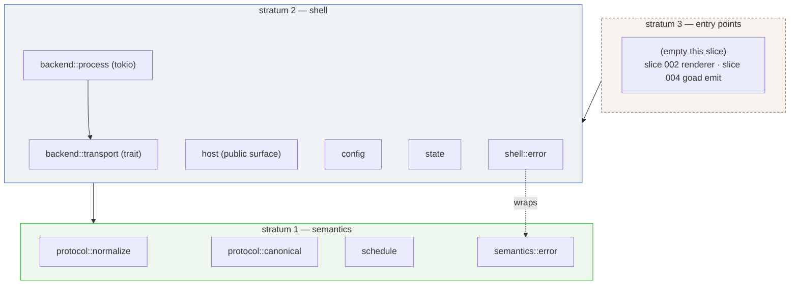
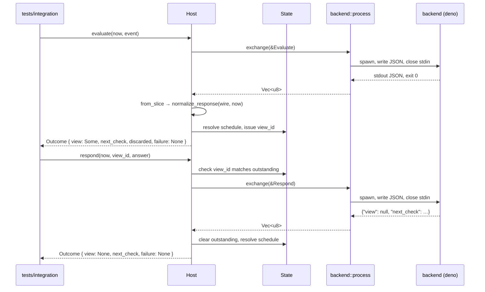
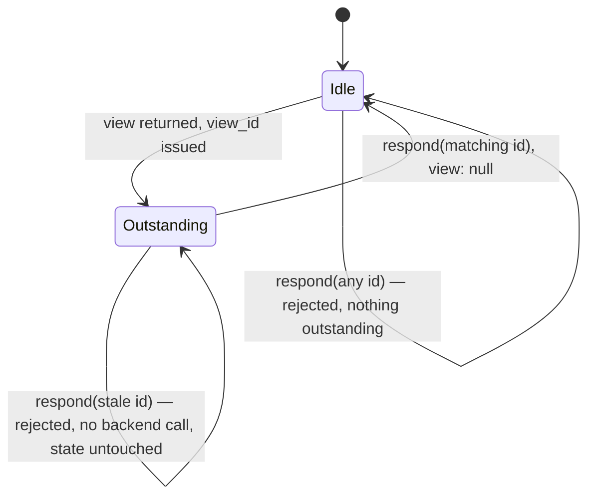

# Design — Slice 001: Protocol core and process backend transport

<!-- The *current* design, not its history. Revision chronology, review
     findings, and dispositions live in `design-log.md`.
     Reference forms: canon by id (`SPEC-003 §4`, `ADR-007`, `POL-002`);
     doc-local refs bare — OQ-1 (§6), D1 (§7), R1 (§8). Ids are immutable. -->

## 1. Design problem

The repository contains no Rust code, no crate manifest, and no canon describing
the protocol. This design settles the internal shape of the host's first code:
the canonical protocol types, the normalization that produces them from
permissive wire input, schedule resolution, and one backend transport that
spawns a user program per invocation.

The thing being designed is a contract, not a feature. The host is defined by
what it refuses to understand: it moves `evaluate`, `respond` and `schedule`
between a renderer and a user-owned backend, and every domain meaning lives on
the backend side of that boundary (brief §3.1, §21.16). So the protocol types
*are* the product surface, and they must admit capabilities no renderer yet
implements — option-scoped fields, richer content forms, natural-language
schedules — without being narrowed to whatever a first renderer happens to need.

Settling that headless is the point of doing it before the GUI. Under fixtures
and integration tests, the contract is decided by the protocol's own
requirements. Once a renderer exists, every unresolved question in the contract
gets answered by what is convenient to draw.

The boundary of this design:

- **In.** Module layout of the three ADR-001 strata inside one crate; the
  canonical type shapes and their normalization from wire forms; the error
  taxonomy and where it splits at the stratum seam; the transport trait and its
  spawn-per-invocation implementation on tokio; host operational state held in
  memory; TOML configuration of three values; the fixture corpus layout and what
  the test suite must demonstrate.
- **Out.** Anything with a window in it (slice 002); anything that wakes on a
  clock (slice 003); anything that ingests an external event (slice 004); the
  persistent socket transport (slice 005). Each constrains this design only in
  that it must not be foreclosed.

This design's own contract is a draft, not canon. Per the OQ-1 decision the
protocol specification is written incrementally in
`docs/slices/001/draft-spec.md` as design, execution and audit settle it, and
promoted to `docs/specs/` at close once it has been reconciled against what
shipped. During execution that draft, the Rust types and the AC-9 fixture corpus
together are the whole contract: the draft is authoritative about intent and the
tests are authoritative about behaviour, and where the two disagree that is a
finding to be dispositioned, not a licence to pick whichever is convenient.

## 2. Current state

There is nothing to change; there is only nothing. `src/` and `tests/` exist and
are empty, and no `Cargo.toml` exists (`research.md` Thread 2, verified). Every
file this slice touches is a new file, so no existing code constrains the design
and no existing code can be cited as precedent.

Canon is nearly as bare. `docs/specs/` and `docs/policy/` are empty;
`docs/adr/` contained nothing when research ran and now holds exactly ADR-001
and ADR-002, both raised by this slice's own scoping.

Root `AGENTS.md` was zero bytes when research ran and is no longer: it now
carries a pointer to the methodology, the canon rule, the dev-shell facts, and
four working principles. AC-10 is therefore additive rather than from-scratch —
what it still needs is the protocol-specific material brief §15.1 asks for: that
the host does not understand the user's domain, the permissive-wire /
canonical-internal rule, the warning against narrowing the protocol to the
current renderer, and the verification commands. `CLAUDE.md` remains a symlink
to it.

What *is* established, and therefore load-bearing here:

- The toolchain works. `cargo 1.99.0-beta.1` from `rust-bin.beta.latest.default`,
  `pkg-config` on PATH, crates.io reachable (`research.md`, verified).
- The GUI stack is de-risked and out of scope. Slint 1.17.1 builds and opens a
  Wayland window in this dev shell with no `flake.nix` change; mechanics are
  harvested in `docs/memory/slint-build-mechanics.md`, and the spike was deleted
  in `c8ab319`. Nothing from it entered `src/`, so ADR-002's T1 has not fired.
- No async runtime is in the tree, so tokio is an addition this design makes
  rather than one it inherits.
- deno is not in `devToolPkgs`. The test suite cannot run a TypeScript backend
  until this slice adds it.

The consequence worth stating plainly, from `research.md`'s cross-thread
finding: the absence of code and the absence of canon coincide, so whatever this
slice does becomes precedent **by default rather than by decision**. That is the
argument for spending design effort on module placement and error-type shape
here, where they cost nothing to choose, rather than in slice 002 where they
cost a refactor.

## 3. Forces & constraints

**Canon that binds.**

- **ADR-001** — three strata, dependencies downward only. Stratum 1 (protocol
  types, normalization, schedule resolution) must build and test with no
  renderer and no async runtime in its graph. This is the single strongest
  constraint on §5.1 and it decides the error taxonomy's shape in §5.2.
- **ADR-002** — one crate until a trigger fires. Its Verification section
  requires the triggers to be checked and the answer recorded in the design of
  any slice that adds a dependency or a binary. This slice adds dependencies, so:
  **T1** (a dependency stratum 1 must not need) — does not fire; tokio is a
  stratum 2 dependency and stratum 1 does not link it. **T2** (a second binary)
  — does not fire; at most one binary. **T3** (renderer build dominating test
  wall-clock) — does not fire; there is no renderer. **Verdict: one crate,
  strata as modules.**

**From the brief, as intent rather than canon.**

- §3.3, liberal grammar and strict canonical semantics. The permissive/canonical
  seam is a *type* boundary, not a validation pass: after normalization there
  must be no way to hold an unnormalized value. Ambiguity fails; it is never
  guessed.
- §13 failure taxonomy, §12 `view_id` discipline, §9 latest-valid-wins with an
  invalid instruction preserving rather than disabling, §6.2 the process
  transport's shape.
- §14, decisive for tone throughout: backends are **trusted user programs, not
  sandboxed plugins**. Nothing in the code, the config, the example or its
  comments may imply isolation. deno runs with `-A` for exactly this reason, and
  that must be stated where a reader would otherwise mistake default-deny
  permissions for a security model.
- §3.7 and §15, agents are the intended editors. This is why a convention that
  exists only in prose is weak, and why `AGENTS.md` (AC-10) is a deliverable
  rather than a courtesy.

**Technical and cost.**

- tokio with `process`, `time`, `rt`, `io-util` resolves 14 unique dependencies;
  the smol family for the same job needs 31 (`research.md`, verified). `net`
  waits for slice 005.
- Slint's 411 dependencies and ~19s clean debug build are the number T1 will be
  paid in next slice. It constrains nothing today, but it is why module
  boundaries must stay *relocatable* — ADR-002 requires the split to be a file
  move, not a redesign.
- Hermeticity: `cargo test` must be able to spawn a backend with no build step
  and no `node_modules`. This is why deno, and it is a constraint on the example
  as much as on the fixtures.
- AC-1 sets the verification floor: build, test, lint at zero warnings, and
  format check, all from a clean clone in the dev shell.

**House style.** The one precedent that exists is documentary: `flake.nix`
comments explain *why* a non-obvious thing was done, at length, rather than
restating what the code does (`research.md`). Rust comments here follow that —
sparse, but expansive where the reason is not visible from the code.

## 4. Guiding principles

**P1 — Canonical is a type, not a promise.**
After normalization there must be no way to *hold* an unnormalized value. Not a
validated field, not a `String` that everyone agrees is an RFC 3339 timestamp —
a distinct type that cannot be constructed except by normalization succeeding.
Brief §3.3 draws this line and ADR-001 puts a stratum boundary on it; P1 is what
makes the line checkable by the compiler instead of by review.

*Scope.* P1 governs the values the host **interprets** — instants, numeric
bounds, identifiers, kind discriminants: anything the host reads in order to
decide something. It does not govern payloads the host only carries:
`Content::Uri`, `hints`, `Event.data`, and the `values` map of a user response.
Those are opaque by design — brief §3.4 hands `hints` to the renderer, and §14
makes the backend a trusted user program rather than a sandboxed plugin.
Extending P1 to them would have the host parse a URI it never dereferences, to
satisfy a principle whose purpose is protecting decisions the host does not
make. The boundary is not permanent: the moment the host starts interpreting one
of them, that value comes under P1. Raised as F-9 in `review-design.md`.

*What this loses:* the single-struct-with-optional-fields design, which is fewer
types and less mapping code. It also loses the convenience of reaching for the
raw wire value later, downstream of the seam, when it would be handy. The
scoping above additionally loses uniformity — a reader must ask which side of
the interpret/carry line a value falls on, rather than reading one rule off the
type.

**P2 — An invalid value costs the sender its effect, never the host its
function.**
The host reports the failure and continues from the state it already had. A
malformed `next_check` loses that instruction; it does not disable scheduling
(brief §9). A malformed response loses that response; it does not poison the
transport. A stale `view_id` loses that answer; it does not clear the
outstanding interaction.

This sits in tension with P1 by design, and the tension resolves by scope: P1
governs whether a bad value may be *represented* (it may not), P2 governs how
far its blast radius reaches (as far as the value, no further). Neither licenses
absorbing an error silently — every refusal is a named error and reaches
diagnostics.

*Granularity.* Failure is whole-message by default. A part may be discarded on
its own only when **both** of these hold:

> 1. its absence is already a modelled state with defined semantics, distinct
>    from "we failed to read it"; and
> 2. the **protocol** is what specifies the behaviour in that absence — not the
>    host, and not the renderer.

The second clause is what keeps the rule from licensing invention. Clause 1 says
there is somewhere to land; clause 2 says the destination was chosen by the
contract rather than by whoever wrote the discard path. Without it, every
`Option` field in the canonical types would qualify, because an `Option` always
*has* an absent state — the question is whether that state's meaning was
specified or improvised. (Raised as F-4 in `review-design.md`: the one-clause
rule admitted `body`, which was never intended.)

`next_check` satisfies both. An absent `next_check` is a real state with a
defined meaning, and brief §9 is the thing that defines it — "retain an existing
valid scheduled check, else use the configured default poll interval" — so
discarding the field lands the host in a state the protocol already told it how
to occupy. Brief §13 corroborates by listing "invalid scheduling value" as a
failure mode *distinct from* "protocol-invalid response"; the entry would be
redundant if a bad `next_check` invalidated the message.

`body` satisfies clause 1 and fails clause 2. An absent body is modelled — the
field is optional and a view with no body is ordinary. But nothing in the brief
says what a renderer does with a body that *was* sent and could not be read.
Dropping it silently renders a view the backend did not author; substituting
placeholder text invents content. Either way the host is choosing, so the whole
message is rejected instead.

`view` fails clause 1. Its only absent-view state is an explicit `view: null`,
and per brief §11 that is a positive assertion — "nothing to show right now".
Degrading an unreadable view to `null` would have the host assert on the
backend's behalf that there is nothing to show, when the truth is that it could
not tell. That is the invented semantics brief §3.3 forbids. This is also why
`view` is a **required** field — see F-5 and §5.2: a message that omits it
entirely has failed to say anything about the view, which is not the same claim
as saying there is none, and the two must not normalize to one value.

Applied to this slice:

| part invalid | outcome |
|---|---|
| `next_check` | discarded; §9 fallback applies; typed error to diagnostics; rest of the message accepted |
| envelope or protocol version | whole message rejected |
| `view` absent entirely | whole message rejected — `MissingField { field: "view" }` |
| `view` explicitly `null` | accepted; nothing to show (brief §11) |
| `view` or `choice` structure | whole message rejected |
| `body` present but unreadable | whole message rejected — fails granularity clause 2 |
| unsupported required primitive | whole message rejected — brief §13, "fail clearly" |
| option-scoped field no renderer implements | not a normalization failure at all; admitted by the types, unimplemented downstream (brief §22.3) |

This costs P1 nothing. The canonical response holds `schedule:
Option<CanonicalInstant>` where `None` means "no instruction supplied"; an
invalid value normalizes to `None` **plus** a reported error, and the error
travels alongside the canonical value rather than inside it. So normalization
remains a total function into a genuinely canonical type — see §5.2, where its
result carries a discard list rather than being a bare `Result`.

*What this loses:* the simpler, louder discipline of failing hard on bad input.
The code carries a "keep the previous value" path a fail-fast design would not
have, and that path needs its own tests. The discard list is also a shape every
caller must handle, where a bare `Result` would have been ignorable.

**P3 — Shape the seams for the second implementation the brief already names,
and no further.**
The transport is a trait now, with one implementor, because brief §6 specifies
two transports and slice 005 builds the other; the trait's shape must not
presume spawn-per-invocation. The protocol types admit option-scoped fields and
richer content forms because brief §22.3 says a later renderer implements them.

The bound is the second half. A seam is justified by a named future
implementation, not by imagining one. Where the brief names nothing, this slice
builds the concrete thing — configuration is a struct with three fields, not a
provider abstraction; host state is a struct in memory, not a persistence trait
awaiting a backend.

*What this loses:* both directions. Against "do not abstract until you need it",
it accepts a trait with one implementor. Against "make it all pluggable", it
refuses abstractions for futures the brief has not committed to.

## 5. Proposed design

### 5.1 System model

One crate, three strata as ADR-001 defines them, **grouped by stratum at the top
level of `src/`** and named with the ADR's own words:

```
src/
  lib.rs              # stratum wiring and the crate's public surface
  semantics/          # STRATUM 1 — pure. No I/O, no async, no tokio.
    protocol/
      wire.rs         #   permissive deserialization targets
      canonical.rs    #   canonical types; constructible only via normalize
      normalize.rs    #   wire -> Normalized<canonical>
    schedule.rs       #   pure resolution: latest-valid-wins
    error.rs          #   parse and validation errors
  shell/              # STRATUM 2 — I/O. May use semantics. Never uses bin.
    backend/
      transport.rs    #   the trait (async at its boundary)
      process.rs      #   spawn-per-invocation on tokio
    config.rs         #   TOML: command, timeout, default poll interval
    state.rs          #   outstanding view_id, resolved schedule (in memory)
    host.rs           #   composition: transport -> normalize -> resolve -> state
    error.rs          #   transport errors, wrapping semantics::Error
tests/
  protocol/           # fixture-driven, stratum 1 only (AC-9)
  integration/        # round trip through the process transport (AC-7)
  backends/           # the deliberately-misbehaving fixtures + the bash guard
examples/
  typescript/         # the showcase backend, deno
```



**Why grouped by stratum rather than by topic.** Two reasons, both about the
weakness ADR-002 admits — that until the split, ADR-001 has no compiler behind
it.

1. It makes a violation visible in the import line itself. `use crate::shell::…`
   inside `src/semantics/` is wrong on sight, without the reader needing to know
   which topic belongs to which stratum. Brief §3.7 makes agents the editors,
   and an agent reads the line in front of it.
2. ADR-002 requires the eventual split to be a file move. Grouped this way it
   literally is: `git mv src/semantics crates/goad-semantics/src`. Grouped by
   topic, the split first requires deciding which topic is which stratum — which
   is the redesign ADR-002 says must not be necessary.

The names are lifted verbatim from ADR-001 ("pure semantic core", "I/O shell")
so the path leads a reader to the governing document.

**Stratum 3 is declared and empty.** This slice ships a library with no binary.
No acceptance criterion needs one, and P3 says build the concrete thing only
where the brief names it — the brief names a renderer (slice 002) and `goad
emit` (slice 004), neither of which is here. A debug binary for manual poking
would be unrequested scope. Side benefit: the integration tests can only reach
the crate through its public API, so the library surface is forced to be usable
by something other than itself.

**Mechanical enforcement of the boundary (AC-15).** ADR-002 names its own whole
risk as ADR-001 having no compiler behind it during the one-crate period. That
is partly fixable here for very little: a test that reads the files under
`src/semantics/` and asserts none of them mentions `crate::shell`, `crate::bin`
or `tokio`, failing if it finds no files to inspect so that a rename cannot pass
it vacuously. Crude — it is a string search over source text — but it catches
the actual failure mode, which is an agent writing an upward `use`. It also
gives the no-tokio-in-stratum-1 constraint a check it could not otherwise have,
since `cargo tree` cannot see a boundary inside a single crate. AC-11 already
establishes grep-checkable structure as acceptable here, so this is the same
instrument aimed at the other invariant.

This does **not** promote ADR-001's verification from review gate to build gate.
It checks three known tokens, so it catches the common case, not the class; the
ADR's own statement that this is a review gate until the strata become crates
stands as written. Recorded in §10 so audit disposes of it deliberately rather
than discovering it.

### 5.2 Interfaces & contracts

**Wire and canonical are separate type families, and only inbound data has
both.** Requests are host-authored, so there is one type and it is canonical;
nothing untrusted arrives on that path. Responses arrive from user code, so they
have a permissive wire twin. This halves the type count relative to mirroring
everything, and the asymmetry is principled — we control what we emit.

#### Inbound: wire types

```rust
// semantics/protocol/wire.rs
#[derive(Deserialize)]
pub struct WireResponse {
  #[serde(default)] pub protocol: Option<u32>,

  /// Outer `Option`: was the field present at all. Inner: was it `null`.
  /// `None` => omitted, `Some(None)` => explicit null, `Some(Some(v))` => a view.
  #[serde(default, deserialize_with = "present")]
  pub view: Option<Option<WireView>>,

  #[serde(default)] pub next_check: Option<serde_json::Value>,
}

/// serde maps both an absent field and an explicit `null` to `None`, so the
/// outer layer has to be supplied rather than inferred from nesting.
fn present<'de, T, D>(de: D) -> Result<Option<T>, D::Error>
where T: Deserialize<'de>, D: Deserializer<'de>
{ T::deserialize(de).map(Some) }
```

Three deliberate choices here:

- **No `deny_unknown_fields`, anywhere inbound.** Brief §13: unknown optional
  fields are ignored.
- **`view` is required, and absent is distinguished from `null`.** These are
  different claims: `null` asserts "nothing to show" (brief §11), while omission
  asserts nothing at all. Collapsing them would have the host manufacture the
  positive assertion on the backend's behalf — the invention P2's granularity
  rule exists to prevent. An omitted `view` therefore yields
  `MissingField { field: "view" }` and rejects the message. This was F-5.
  The double-`Option` shape is load-bearing and was verified, not assumed: with
  a bare `#[serde(default)] Option<Option<T>>`, serde returns `None` for `null`
  as well as for absence, and the distinction is silently lost.
- **`next_check` is typed `serde_json::Value`, not `Option<String>`.** This is
  the one place the wire type is looser than the JSON we expect, and P2 is the
  reason: if it were `Option<String>`, then `"next_check": 45` would be a serde
  failure that kills the whole message — violating the granularity rule, which
  requires that field to be discardable on its own. A loose wire type is what
  makes a precise error possible.

Note what the first and second bullets do *together*: unknown fields are ignored,
but a known-and-required field's absence is a named error rather than a serde
message. Permissiveness is about fields we do not model, not about fields we do.

**The rest of the inbound wire shape is fixed by the brief's own examples**, and
this is F-31 and F-38. Those examples are what a backend author copies, so a wire
type that rejects one is wrong regardless of how clean it reads.

```rust
// semantics/protocol/wire.rs
#[derive(Deserialize)]
pub struct WireField {
  pub id:    String,
  pub kind:  String,
  pub label: String,
  #[serde(default)] pub min:     Option<f64>,
  #[serde(default)] pub max:     Option<f64>,
  #[serde(default)] pub options: Option<serde_json::Value>,

  /// Every other key on the field object. Brief §10.2 writes `multiline` flat,
  /// alongside `id` and `kind` — hints are not a nested member on the wire.
  #[serde(flatten)] pub hints: BTreeMap<String, serde_json::Value>,
}

#[derive(Deserialize)]
pub struct WireChoice {
  pub title: String,
  /// A bare string or a tagged object. Left untyped and dispatched in
  /// `normalize`, so an unrecognised `kind` keeps its own named error.
  #[serde(default)] pub body:    Option<serde_json::Value>,
  #[serde(default)] pub options: Option<Vec<WireOpt>>,
}
```

Two shapes, both verified by running them:

- **`hints` is flattened, not nested.** Brief §10.2's field example is
  `{"id":"notes","kind":"text","label":"Anything notable?","multiline":true}` —
  `multiline` sits flat. With a nested `hints` member that key is unmodelled, so
  the no-`deny_unknown_fields` rule *silently discards* it: the brief's own
  example loses its presentation information and reports nothing, which is the
  worst available outcome. Flattening makes "everything else on the field" the
  definition of a hint, which is also the honest reading of brief §10.2's "likely
  presentation hints over time".

  The cost, stated precisely rather than as a worry: a misspelled **optional**
  key (`minn` for `min`) becomes a hint instead of being noticed. A misspelled
  **required** key still fails — `{"id":"x","kind":"text","labell":"typo"}`
  errors with `missing field 'label'`, because the declared field is still
  required after flattening. So the exposure is narrower than flattening usually
  implies, and it is bounded by which keys are optional.

  Rejected: accepting both a nested `hints` object and flat keys. Two spellings
  for one thing is exactly the ambiguity brief §3.3 says must fail rather than be
  guessed at, and it doubles the normalization paths for no gain.

- **`body` is `serde_json::Value`, for the same reason `next_check` is.** Brief
  §10.1's required v0 example is `"body": "Optional context"` — a bare string —
  while §11.1's richer forms are tagged objects. A string-or-object type is the
  contract, and the tempting encoding, `#[serde(untagged)]`, is wrong here: it
  collapses every failure into "data did not match any variant", which destroys
  F-6's `UnsupportedPrimitive { kind, at }`. So the wire stays untyped and
  `normalize` dispatches: a string becomes `Content::Text`; an object is read for
  its `kind`; an unrecognised `kind` is the named error with its path; anything
  else is a typed shape error. A loose wire type is again what makes a precise
  error possible.

The protocol version is handled asymmetrically, because the two directions have
different authorship. The host always **writes** `"protocol": 1` on requests. On
a response it **accepts** the field's absence — brief §8.2's own examples omit
it, so requiring it would reject every backend written against the brief — but
**rejects** a response declaring a version the host does not know, since
proceeding would be guessing at semantics. Brief §13's "versioned from day one"
is satisfied by the envelope carrying the field, not by both sides being
compelled to send it.

#### Inbound: canonical types

```rust
// semantics/protocol/canonical.rs
//
// Every field below is `pub(super)`: writable from within `semantics::protocol`,
// which is where normalization lives, and read-only to everything else through
// the accessors. Outside this module a canonical value can only have come out of
// `normalize_response`. That is P1 with a compiler behind it rather than a
// comment. Accessors are elided here for length; each field has one returning a
// borrow, and the types derive `Debug`, `Clone`, `PartialEq`.

pub struct Response { pub(super) view: Option<View>, pub(super) schedule: Option<Timestamp> }
//                                     ^ None = nothing to show   ^ None = no instruction supplied

pub enum View { Choice(Choice) }

pub struct Choice {
  pub(super) title:   String,
  pub(super) body:    Option<Content>,
  pub(super) options: Options,            // newtype: >= 1, ids unique
}

pub struct Opt { pub(super) id: OptionId, pub(super) label: String, pub(super) fields: Vec<Field> }

pub enum Content { Text(String), Markdown(String), Html(String), Uri(String) }

pub struct Field {
  pub(super) id:    FieldId,
  pub(super) kind:  FieldKind,
  pub(super) label: String,
  pub(super) hints: Hints,
}

pub enum FieldKind {
  Text, Boolean, DateTime,
  Number(NumberRange),
  Choice { options: Options },
}

/// Checked: each bound finite, and `min <= max` when both are present.
pub struct NumberRange { min: Option<f64>, max: Option<f64> }

impl NumberRange {
  pub fn new(min: Option<f64>, max: Option<f64>) -> Result<Self, BoundsError>;
  pub fn min(&self) -> Option<f64>;
  pub fn max(&self) -> Option<f64>;
}
```

`Options` is a newtype with a checked constructor, not a bare `Vec`: a choice
with zero options is unrenderable, and duplicate option ids make a later
`respond` ambiguous about which option it names. Both are §3.3 ambiguities, so
both are rejected at normalization rather than tolerated. P1 says the canonical
type should not be *able* to hold either.

`NumberRange` exists for the same reason, and it is the second half of F-9.
`min: Option<f64>` admits `NaN` and it admits `min: 10, max: 1` — both of which
the host *interprets*, since bounds are semantics under brief §3.4 and constrain
what answer is valid. An inverted range makes every answer invalid, and `NaN`
makes every comparison false; neither is a state the protocol has any meaning
for, so neither may be representable. Rejecting them costs the sender the
message, per P2 — bounds are not a discardable part.

Note the asymmetry this creates with `hints`, `Content::Uri`, `Event.data` and
the response `values` map, which stay `serde_json::Value` and `String`. That is
P1's scope in §4 doing its job: the host constrains what it reads, and carries
what it does not.

**The line between `FieldKind` and `hints` is brief §3.4's line**: "the backend
expresses semantics, the renderer chooses widgets". Bounds on a number are
semantics — they constrain valid answers — so they live in `FieldKind`.
`multiline`, `placeholder`, `units`, `suggestions` are presentation, so they live
in `hints`, which is an open map the host does not interpret. That matters
because brief §10.2 calls its hint list "likely presentation hints **over
time**": fixing them into a struct now would narrow the protocol to today's
guesses, while an open map admits new hints with no version bump. The host must
never branch on a hint key — if it needs to, the thing was semantics and belongs
in `FieldKind`.

All four `Content` variants and all `FieldKind`s are **admitted and rendered by
nobody** in this slice. That is P3 with brief §11.1 and §22.3 naming the future
implementor.

**Any unrecognised `kind` discriminant, at any depth, produces
`ProtocolError::UnsupportedPrimitive`** carrying both the offending string and
the path at which it appeared — not a generic deserialization failure. AC-6
requires the distinct error and brief §13 wants it debuggable. The rule is stated
over the whole document rather than over `view.kind` because there are three
discriminant sites, not one: the view, each field, and each content block. A
future primitive is at least as likely to arrive as a new `FieldKind` as a new
view type, and a backend that sends one deserves the same clear refusal wherever
it put it. This was F-6.

The path is what makes the error usable at depth: `unsupported primitive
"slider"` is a puzzle in a view with nine fields, and
`unsupported primitive "slider" at view.options[1].fields[2].kind` is not. It is
a diagnostic string, not an interpreted value, so P1's scope leaves it a
`String`; how normalization accumulates it is implementation.

The serde encoding that achieves all this (a fallback variant, or reading `kind`
before dispatching) is likewise left to implementation. The contract is the named
error, the retained string, and the path.

#### Outbound: requests

```rust
// semantics/protocol/canonical.rs
pub enum Request { Evaluate(Evaluate), Respond(Respond) }
//  serialized with "protocol": 1 and "type": "evaluate" | "respond"

pub struct Evaluate { pub now: Timestamp, pub event: Event }
pub struct Respond  { pub view_id: ViewId, pub now: Timestamp, pub response: UserResponse }

pub struct Event {
  pub source: String, pub kind: String,
  pub timestamp: Timestamp, pub data: serde_json::Value,   // opaque, brief §7
}
pub struct UserResponse { pub option: OptionId, pub values: BTreeMap<FieldId, serde_json::Value> }
```

#### Normalization

```rust
// semantics/protocol/normalize.rs
pub fn normalize_response(wire: WireResponse, now: Timestamp)
  -> Result<Normalized<Response>, ProtocolError>;

pub struct Normalized<T> { pub value: T, pub discarded: Vec<Discarded> }

pub enum Discarded {
  Schedule { raw: serde_json::Value, reason: ScheduleError },
}
```

`now` is a parameter, not a clock read — that is how relative durations resolve
without stratum 1 acquiring I/O, and it makes every normalization test
deterministic with no injected clock abstraction.

`Discarded` is a closed enum with one variant on purpose. P2's eligibility test
is meant to be applied deliberately, so adding a second variant is exactly the
moment someone has to justify it against that test. A `Vec<(String, Error)>`
would let a discard slip in without the argument.

#### Errors — the AC-6 taxonomy, split at the stratum seam

```rust
// semantics/error.rs  — stratum 1: parse and validation
pub enum ProtocolError {
  Json(serde_json::Error),
  UnsupportedProtocolVersion { found: u32 },
  UnsupportedPrimitive { kind: String, at: String },   // path, per F-6
  MissingField { field: &'static str },
  EmptyOptions,
  DuplicateOptionId { id: String },
  Bounds(BoundsError),
  Schedule(ScheduleError),
}

pub enum BoundsError {
  NotFinite { bound: &'static str, found: f64 },   // NaN, +inf, -inf
  Inverted  { min: f64, max: f64 },                // min > max
}

pub enum ScheduleError {
  NotAString   { found: &'static str },   // "next_check": 45
  MissingOffset{ raw: String },           // 2026-08-22T18:00:00
  CalendarUnit { raw: String },           // "1 month" — length is not fixed
  OutOfRange   { raw: String },           // parses, but now + span leaves the representable range
  Unparseable  { raw: String },           // "tomorrow morning"
}

// shell/error.rs  — stratum 2: transport and host state, wrapping the above
pub enum BackendError {
  Spawn(std::io::Error),                        // command not found
  Timeout { after: Duration, stderr: String },   // partial stderr survives — §5.4, F-3
  ExitStatus { code: Option<i32>, stderr: String },
  OutputTooLarge { limit: usize },               // stdout cap exceeded — §5.4, F-2
  Io(std::io::Error),
  Protocol(semantics::ProtocolError),
}

/// Refusals that arise from host state rather than from the backend or the wire.
/// Separate from `BackendError` because the backend did nothing wrong: the
/// *caller* named an interaction the host is not holding.
pub enum StateError {
  NoOutstandingView { named: ViewId },
  StaleViewId { named: ViewId, outstanding: ViewId },
}
```

`MissingOffset` is broken out from `Unparseable` because an offset-less
timestamp is the single most likely backend mistake, and "you omitted the
offset" is a debuggable message where "unparseable" is not. Brief §13 asks for
enough information to debug the backend.

`CalendarUnit` and `OutOfRange` are the F-10 additions, and they are behavioural
rather than cosmetic — see §5.4 for what the schedule grammar actually accepts
and why days resolve while months do not.

`StateError` is what AC-8 was missing (F-8, F-15). AC-8 requires a stale
`view_id` to be *rejected*, and there was no error in the taxonomy for it: the
only candidate was `BackendError`, which would have blamed a backend that had not
been consulted yet. Two variants rather than one because the diagnostics differ —
"there is no interaction open" and "you answered the previous one" are different
mistakes with different fixes. It sits in `shell/` and not `semantics/` because
staleness is a fact about host state, not about the message: the same bytes are
valid or stale depending on what the host is holding, so stratum 1 cannot
adjudicate it.

**One thing AC-6 needs stated plainly:** an invalid scheduling value is a
distinct typed error (`ScheduleError`) but it does **not** arrive as an `Err`.
It arrives inside `Normalized::discarded` on an otherwise successful parse.
AC-6's "maps to a distinct typed error" is satisfied; "the call returns an
error" was never what it said, and P2 forbids it.

#### Transport

```rust
// shell/backend/transport.rs
pub trait Backend {
  fn exchange(&mut self, request: &Request)
    -> impl Future<Output = Result<Vec<u8>, BackendError>> + Send;
}
```

- **`&mut self`, even though the process transport does not need it.** The
  process transport is stateless — it spawns per exchange — so `&self` was
  sufficient and was what this design originally specified. It was wrong anyway:
  slice 005's socket transport holds a connection, and a connection is mutable
  state that an exchange advances. `&self` would have forced that implementation
  into interior mutability (a `Mutex` around the stream to satisfy a signature,
  guarding against concurrency brief §12 says does not exist) or into changing
  the trait — in the slice where two implementors already depend on it. Today the
  change is one keyword. This was F-1, and P3 is the reason it counts: a seam
  justified by a named future implementation has to fit that implementation.
- **The trait owns framing, not just transmission.** It takes a canonical
  `Request` and serializes internally, because the two implementations differ in
  exactly that respect — one JSON body per process, versus one JSONL line per
  exchange on a persistent socket (brief §6). A trait taking pre-serialized
  bytes would have baked the process transport's framing into the seam, which is
  the P3 mistake.
- **Returns `Vec<u8>`, not `String`.** Invalid UTF-8 then becomes a
  `Protocol(Json)` error via `from_slice` rather than a lossy replacement. No
  silent mangling of backend output.
- **Async fn in trait, static dispatch.** Rust 1.99 makes AFIT stable, so no
  `async_trait` dependency and no `Box::pin` on every call; the host is generic
  over `B: Backend`, and tests instantiate it with a fake. Cost, stated because
  it is real: AFIT traits are not `dyn`-compatible, so slice 005's socket-first,
  process-fallback selection will need an enum over the two concrete
  implementations rather than a `Box<dyn Backend>`. That is the cheaper side of
  the trade and it is slice 005's to pay.

#### Host — the crate's public surface

```rust
// shell/host.rs
pub struct Host<B: Backend> { backend: B, config: Config, state: State }

impl<B: Backend> Host<B> {
  pub async fn evaluate(&mut self, now: Timestamp, event: Event) -> Outcome;
  pub async fn respond(&mut self, now: Timestamp, view_id: ViewId, answer: UserResponse) -> Outcome;
}
```

```rust
// shell/host.rs — Outcome is stratum 2 (F-15): it mixes canonical views from
// stratum 1 with transport and host-state diagnostics that only exist up here.
pub struct Outcome {
  /// `Some` = render this, and answer it with the `view_id` inside.
  /// `None` = nothing to show: either the backend's explicit `view: null` or a
  /// failed exchange. `failure` says which.
  pub view:       Option<Presented>,
  /// Always concrete — brief §9 resolves in every case, including failure.
  pub next_check: Timestamp,
  /// Parts the message lost without losing the message. P2's discard list.
  pub discarded:  Vec<Discarded>,
  /// Whatever the backend wrote to stderr, whether or not the exchange worked.
  pub stderr:     Captured,
  /// `Some` = the host took no action on this exchange beyond reporting it.
  /// It does **not** mean nothing happened: see below.
  pub failure:    Option<Failure>,
}

/// A view and the identity minted for it, inseparable by construction.
pub struct Presented { pub view_id: ViewId, pub view: View }

pub enum Failure { Backend(BackendError), State(StateError) }
```

This is the composition point — transport, then `serde_json::from_slice`, then
`normalize_response`, then schedule resolution and state update — and it is what
`tests/integration/` drives for AC-7.

`Outcome` is a struct with a `failure` field rather than a
`Result<Success, Failure>` because **every** call resolves a `next_check`, failed
ones included. Brief §9's fallback is not conditional on the exchange working; a
backend that times out must still leave the host with a concrete next wake, or
the first failure ends polling forever. A `Result` would have put that instant on
the success side and made the caller reconstruct it on the error path — the
mistake P2 exists to prevent, expressed as a type. `view: None` with
`failure: Some(_)` is precisely "we could not tell", which is the state §4 argues
must stay distinguishable from "there is nothing to show".

**`Presented` pairs the view with its `view_id`, and that is F-23.** The first
draft of this struct listed `view: Option<View>` and kept the id private in
`State`, which left a renderer holding a view it had no way to answer — AC-7
requires exactly that round trip and brief §8.3 requires the answer to carry the
id. Pairing them rather than adding a second `Option<ViewId>` field is the same
move as `Options` and `NumberRange`: the invalid combination — a view with no id,
an id with no view — is not representable, so no caller has to check for it.

**`failure: Some(_)` says the host did nothing, not that nothing happened.** This
is F-32, and the distinction matters because getting it wrong invites a retry.
Brief §8.3 lets a backend perform arbitrary side effects while handling a
response, and brief §14 gives it the user's own authority; a backend can write to
a file, send a message, and *then* time out. So a failure means the host took no
action and recorded no state change — it is not a statement about the backend's
effects, and nothing may treat it as one. This is also why there is no retry
(below): the host cannot know what a failed exchange already did.

#### Config

```toml
[backend]
command = ["deno", "run", "-A", "./backend.ts"]
timeout = "5s"

[schedule]
default_poll = "30m"
```

Section and key names are brief §5's, minus `socket` and `logging` per the OQ-4
decision. Durations are strings parsed with jiff, the same grammar as
`next_check` — one duration syntax across the product, and no
seconds-versus-milliseconds ambiguity. `command` is an argv array, never a shell
string: no quoting rules, no shell injection surface, and it is what makes
AC-12's `["bash", "./backend.sh"]` work without a shebang.

### 5.3 Data, state & ownership

Nothing is written to disk. Per the OQ-6 decision all host operational state is
in memory, so the state space is one process lifetime wide.

```rust
// shell/state.rs
pub struct State {
  outstanding:    Option<Outstanding>,
  resolved_check: Timestamp,       // always concrete — see below
  next_seq:       u64,
}

struct Outstanding { view_id: ViewId, issued_at: Timestamp }
```

**Three owners, and only one writer.**

| datum | owner | written by | lifetime |
|---|---|---|---|
| `Config` | `Host` | loaded once at construction, immutable after | process |
| `State` | `Host`, private | `Host::evaluate` / `Host::respond` only | process |
| backend `B` | `Host` | `Host::evaluate` / `Host::respond`, via `&mut` on `exchange` | process |
| diagnostics | nobody | returned in `Outcome`, not retained | one call |

No hot reload of config, and no shared mutability — `State` is a plain struct
behind `&mut self`, not an `Arc<Mutex<…>>`. Brief §12 serializes backend
exchanges and allows one outstanding interaction, so there is no concurrency to
protect against. Adding a lock now would be inventing a state space the brief
explicitly says to avoid.

**`resolved_check` is not an `Option`.** Brief §9 resolves to a concrete instant
in every case — the new valid instruction, else the retained one, else `now +
default_poll` — so there is no "unresolved" state to represent or handle.
`Host::new` takes `now` and seeds it. That keeps the clock out of this slice
entirely: `now` is a parameter on every entry point, and whoever owns real time
is slice 003's timer.

**Diagnostics are per-call, not accumulated.** `Outcome` carries the discards
and errors from that exchange and the host forgets them. Brief §13 wants a
"discoverable diagnostic state", but discovering it requires somewhere to
surface it, and this slice has no renderer and — per OQ-4 — no log file. Holding
a history nothing can display would be building the wrong half. Retention is
slice 002's, and the shape of `Outcome` is what makes it cheap then.

**One outstanding interaction, replaced not queued.** When a response yields a
new view while one is already outstanding, the new `view_id` replaces the old and
the old immediately becomes stale — which is what AC-8 rejects. Brief §12 says
only one may be active; replacement is the only reading that does not require a
queue, and a queue is the general concurrency semantics §12 tells us not to
introduce.

**`view_id` generation is stratum 2, its type is stratum 1.** ADR-001's own
Negative section calls this exact distinction out as one someone must make
deliberately, so: `ViewId` is a newtype in `semantics/protocol/canonical.rs`;
`State::issue` mints one in `shell/`.

The value is `{now, RFC 3339}#{seq}` — for example `2026-08-23T04:12:00Z#3`.
Four reasons over a UUID:

1. No new dependency. `uuid` v4 needs `getrandom`, for a value nothing
   authenticates with.
2. Readable in a log, which is precisely what brief §13 asks of diagnostics.
   `2026-08-23T04:12:00Z#3` tells you when the interaction was issued; a v4
   UUID tells you nothing.
3. Deterministic under a fixed `now`, so fixtures can assert exact ids instead
   of capturing whatever came out.
4. Unique where it needs to be. The counter separates ids minted from the same
   `now`; a differing `now` separates them across restarts. Brief §12's
   one-outstanding-interaction rule means there is never more than one live id
   to collide with.

Not a security consideration either way: backends are trusted user programs
(brief §14), and nothing is authorised by holding a `view_id`.

### 5.4 Lifecycle & dynamics

**Startup.** Load TOML, construct the transport from `backend.command`, then
`Host::new(config, backend, now)` seeds `resolved_check` to
`now + schedule.default_poll`. A malformed or missing config is **fatal at
construction** — there is no backend to run without it, and guessing a command
is not available to us. A backend that cannot be spawned is *not* fatal; that
failure is per-exchange, per brief §13.

**One exchange, in order.** The process transport's five steps, each of which
has a specific way of going wrong:

1. **Spawn** with all three streams piped, and `Command::kill_on_drop(true)` set
   at spawn time.
2. **Write** the serialized request to stdin, then **drop the stdin handle.** The
   close is load-bearing: a backend that reads to EOF — which is the obvious way
   to write one — hangs forever if the host holds stdin open, and the symptom is
   a timeout on every call that looks like a slow backend rather than a host bug.
3. **Drain stdout and stderr concurrently, into bounded buffers.** Reading them
   in sequence deadlocks whenever a backend writes more than a pipe buffer
   (64 KiB on Linux) to the stream we are not yet reading, and it deadlocks only
   for chatty backends, which is the worst possible failure distribution.
   `child.wait_with_output()` drains concurrently and would have been the whole
   of this step, but it is unbounded and its buffers are unreachable on the
   timeout path — see below.
4. **Await exit.**
5. All of the above inside **one `tokio::time::timeout`** covering the whole
   exchange, not just the read. On elapse, kill the child explicitly and await
   it.

**Why not `wait_with_output()`.** It loses on both counts that brief §13 cares
about, and it loses them together:

- Its read is **unbounded**, so a backend stuck in a print loop exhausts host
  memory. Brief §13 says "a backend failure must not take down the host"; an OOM
  is the host going down.
- Its buffers are **owned by the future**, so when the timeout drops that future
  the partial stderr goes with it. A timeout is the failure mode with the least
  obvious cause, and this hands it the least diagnostic information. AC-5 asks
  for stderr capture and AC-6 for a distinct timeout error, and the combination —
  a timeout that says why — is what a person debugging a backend actually needs.

Both were originally accepted as one deferred follow-up (D18, D19) on the grounds
that they are a single refactor and neither AC demanded them at once. That was
optimising slice size against a stated requirement, and F-2 and F-3 in
`review-design.md` are the same objection from the outside. The refactor is done
here instead. It remains one refactor — that argument was sound, only its
conclusion was wrong.

```rust
// shell/backend/process.rs — the shape, not the implementation
const STDOUT_LIMIT: usize = 8 * 1024 * 1024;
const STDERR_LIMIT: usize =      256 * 1024;

let mut child  = cmd.spawn().map_err(BackendError::Spawn)?;   // kill_on_drop(true)
let     stderr = child.stderr.take().expect("piped at spawn");

// Stderr drains in its own task, so the buffer outlives a timeout on the
// exchange future. Killing the child closes the pipe, the task sees EOF, and
// the partial buffer arrives through the join handle.
let draining_stderr = tokio::spawn(read_capped(stderr, STDERR_LIMIT));

// Bound before the match, not inside its scrutinee: `exchange` holds `&mut child`,
// and a temporary in a match scrutinee lives to the end of the match — so the
// borrow would still be live in the arms that need `child`.
let exchange = async { /* write stdin, drop it, read stdout capped, child.wait() */ };
let result = tokio::time::timeout(config.timeout, exchange).await;

match result {
  Ok(res) => res,                       // stderr joined on the paths that need it
  Err(_)  => {
    child.start_kill()?;                // SIGKILL; uncatchable, so the pipe closes
    let _ = child.wait().await;         // reap, deliberately, not via Drop
    Err(BackendError::Timeout { after: config.timeout, stderr: draining_stderr.await? })
  }
}
```

Four things this makes explicit:

- **The caps are asymmetric, because the streams are.** Over-long stdout is
  `OutputTooLarge` and fails the exchange: the host cannot act on a response it
  refused to finish reading, and truncated JSON would parse as malformed, naming
  the wrong fault. Over-long stderr is **truncated and flagged**, not fatal:
  stderr is diagnostic, and a chatty backend that works is not a broken one.
- **The caps are constants, not config.** Brief §5 does not list them, and P3's
  second half says do not add configuration for a future nobody has asked for.
  8 MiB is orders of magnitude above any legitimate view — a view is prose and a
  handful of fields — and failing at a stated limit beats swapping.
- **`start_kill` then `wait`, rather than relying on `kill_on_drop`.** This is
  F-14. `kill_on_drop` is a backstop, not a guarantee: tokio's own documentation
  is explicit that the process is killed on a best-effort basis and that reaping
  requires the runtime to still be alive to poll it, so a drop during shutdown
  can leave a zombie. Killing and awaiting on the path we know about turns a
  best-effort claim into an observed one. `kill_on_drop(true)` stays set, for the
  panic and cancellation paths that do not run this code.
- **Hitting the stdout cap kills the backend, and does so by itself.** Verified by
  building and running this design against a `yes`-style flooding backend: when
  the capped reader returns early it drops the stdout handle, the pipe closes, the
  flooding process takes `SIGPIPE`, and `wait()` returns immediately with a
  signal status. So the cap bounds the *work*, not merely the buffer — the host
  does not sit waiting on a process whose output it has already refused. A backend
  that ignores `SIGPIPE` would keep going, and the exchange timeout is what covers
  that; on the cap path we therefore kill explicitly rather than rely on it, for
  the same reason as F-14. The same run confirmed the borrow structure above, that
  stderr survives the timeout path, and that a backend reading stdin to EOF
  completes.
- **Where this can still stall.** If the backend spawned a grandchild that
  inherited the stderr fd, killing the backend does not close the pipe, and the
  drain task does not reach EOF. The join therefore takes a short grace timeout
  of its own, after which the host reports the timeout with no stderr rather than
  waiting on a process it does not manage. We do not kill process groups: brief
  §14 makes backends trusted user programs, and reaching past the process we
  spawned is a bigger claim over the user's machine than this slice should make.



Note that `respond` checks `view_id` against `State` **before** touching the
transport. A stale answer must not reach the backend at all — forwarding it and
letting the backend sort it out would make every backend author responsible for
ordering, which is what brief §12 puts in the host.



**Failure does not move the schedule.** Every failure path leaves
`resolved_check` exactly as it was. That is P2 at the lifecycle level: a backend
that fails every invocation still gets polled on its existing cadence, because
the alternative — a failed exchange clearing or extending the schedule — turns a
broken backend into a silent host.

**No retry.** Nothing in the brief asks for one, and P3 forbids building the
seam for it. A failed exchange returns a diagnostic `Outcome` and the next
scheduled evaluation is the retry.

**Non-zero exit beats parseable stdout.** If a backend exits non-zero but wrote
valid JSON, the host reports `ExitStatus` and discards the output. The backend
told us it failed; trusting output it disclaimed would be the host deciding it
knows better.

**A timed-out backend yields whatever stderr it had produced.** That is the
point of draining it in a separate task, and it is the diagnostic that makes a
timeout debuggable. `BackendError::Timeout` therefore carries `stderr` alongside
`after`. Do not let a later reader "simplify" this back into
`wait_with_output()`; the drain task and the explicit kill are load-bearing, and
§5.4 above says why.

**Two things stated because they are lifecycle behaviour, not code detail:** the
timeout is per exchange rather than per byte, so a backend that streams slowly
but steadily still dies at the deadline; and there is no keep-alive, warm
process, or connection reuse — a fresh process per invocation is the whole
transport, which is why slice 005 exists.

### 5.5 Invariants, assumptions & edge cases

**Invariants.**

| id | invariant | held by |
|---|---|---|
| I1 | No canonical type can hold an unnormalized value | P1; `pub(super)` fields plus checked constructors (D30) — outside `semantics::protocol`, values come only from `normalize_response` |
| I2 | No file in `semantics/` names `crate::shell`, `crate::bin` or `tokio` | AC-15 test |
| I3 | Stratum 1 never reads a clock, filesystem or network, and spawns nothing. `now` is always a parameter | ADR-001; jiff with default features off |
| I4 | `resolved_check` always holds a concrete instant | non-`Option` field |
| I5 | At most one outstanding interaction | `Option<Outstanding>` |
| I6 | Only one exchange in flight | `&mut self` — compiler-enforced, not convention |
| I7 | The host never branches on a `hints` key | review; brief §3.4 |
| I8 | No domain vocabulary in types or module names | AC-11 grep |
| I9 | No path panics on backend-derived data — no `unwrap`, `expect` or slicing on anything a backend produced | AC-6; clippy lints |
| I10 | No inbound wire type is a closed contract: no `deny_unknown_fields`, and the absence of an *unmodelled* field never means more than "not supplied" | review; see the validation-feedback analysis below |
| I11 | No backend can cause unbounded host memory growth: every stream read from a backend is capped | D27; the stdout-flood integration test |
| I12 | Every `Outcome`, including every failure, carries a concrete `next_check` | D23; non-`Option` field |

**Assumptions.** Each is a place this design can break.

- **A1 — stale-`view_id` rejection is scoped to one process lifetime.** From the
  OQ-6 in-memory decision: a restart *forgets* the outstanding interaction rather
  than rejecting a response to it. So AC-8 holds within a process and is silent
  across one. Nothing in this slice can answer an interaction that predates the
  process, because nothing renders one — the assumption becomes load-bearing in
  slice 002, when a user can be looking at a prompt when the host restarts.
- **A2 — modules respect the strata beyond the three tokens AC-15 checks.** The
  test catches an upward `use` naming `shell`; it does not catch a downward type
  leak, a re-export that flattens the boundary, or `std::fs` in `semantics/`. If
  discipline slips, ADR-002's split becomes a redesign rather than a file move,
  which ADR-002 says would itself be the finding. Carried as a risk in §8.
- **A3 — jiff's friendly duration grammar is stable across 0.2.x.** It is
  pre-1.0. `"45 minutes"`, `"1h 30m"`, `"2 hours"` and `PT45M` were verified
  against 0.2.35 by running them, as were the rejections of `"1 month"` and of
  offset-less timestamps and the exact resolution of days and weeks under
  `SpanRelativeTo::days_are_24_hours()`. If the grammar changes under a patch
  bump, what `next_check` accepts changes with it. Mitigated by the AC-9 fixture corpus
  pinning the accepted and rejected forms as tests.
- **A4 — the brief is intent, not canon, and three of its ambiguities were
  resolved by choice**: the protocol-version asymmetry, non-zero exit taking
  precedence over parseable stdout, and replacement rather than queueing for a
  second outstanding view. Each is defensible and each could be wrong; all three
  are in §7 so a reader knows they were chosen rather than derived.

**Edge cases.**

| case | behaviour |
|---|---|
| `view: null` with a valid `next_check` | nothing to show; schedule updates; any outstanding interaction is left alone |
| scheduled evaluate fires while an interaction is outstanding | permitted; a returned view replaces the outstanding one. *Whether* to poll while a prompt is unanswered is policy, and belongs to slice 003 |
| `next_check` in the past, incl. `"-45 minutes"` | parses; stored **as given**, not clamped. A past instant means the next wake is due, which slice 003's timer expresses by firing immediately. Clamping would have the host silently rewrite the backend's instruction — F-13 |
| `"next_check": "1 month"` | `ScheduleError::CalendarUnit`, discarded, message accepted. A month has no fixed length without a calendar, and stratum 1 has no time zone database by construction (§5.2, D4) |
| `"next_check": "1 day"` / `"1 week"` / `"1d 2h"` | accepted; resolved as exactly 24h / 168h / 26h. Verified against jiff 0.2.35 — F-10 |
| `next_check` that parses but overflows the instant range | `ScheduleError::OutOfRange`, discarded, message accepted |
| `"next_check": 45` | `ScheduleError::NotAString`, discarded, message accepted |
| `"next_check": "2026-08-22T18:00:00"` | `MissingOffset`, discarded, message accepted |
| `options: []` | `EmptyOptions` — whole message rejected |
| duplicate option ids | `DuplicateOptionId` — whole message rejected |
| empty stdout, exit 0 | `Protocol(Json)` — unexpected EOF |
| two JSON documents on stdout | `Protocol(Json)` on trailing content. Strictness is correct here: framing is the transport's job and this transport's frame is "one document" |
| `command = []` in config | rejected at load — nothing to spawn |
| `timeout = "0s"` or `default_poll = "0s"` | rejected at load. A zero timeout fails every exchange; a zero poll is a busy loop |
| backend emits more than 8 MiB on stdout | `OutputTooLarge`; child killed; message rejected |
| backend emits more than 256 KiB on stderr | truncated and flagged; not a failure in itself |

**Schedule resolution is where jiff's grammar has to be pinned, not assumed.**
`"1 month"` and `"45 minutes"` both parse to a jiff `Span`, and only one of them
can be converted to a duration without a calendar: months and years have no fixed
length, and resolving them needs a time zone, which is the I/O stratum 1 does not
have (D4 turns jiff's default features off precisely so this is impossible rather
than merely avoided). Resolution therefore converts through
`SpanRelativeTo::days_are_24_hours()`, which resolves days and weeks exactly and
rejects calendar units cleanly — verified by running it, not read off the docs.
A `Span` that converts but then leaves the representable instant range is
`OutOfRange`. Both are `ScheduleError`s, so both are discards under P2 rather
than message failures, and both are in the AC-9 corpus. This was F-10; the
original design said only "parses with jiff", which quietly assumed a total
function that does not exist.

**The host does not validate answers; the backend does.** `respond` checks the
`view_id` and nothing else. It does not verify that the answer names an option
the view offered, and it does not inspect field values at all. Field values pass
through opaque.

That decision is only safe if the eventual validation-feedback round trip — the
backend rejecting a submission, and the user seeing which fields were wrong and
why — can be added **without restructuring the protocol**. Checked here, while it
is free, because brief §22.3 asks exactly this: *are we narrowing the protocol to
match the current v0 renderer?* It needs no restructuring, and three decisions
already made are what keep it so:

1. **`UserResponse.values` is opaque.** The host can retain and echo submitted
   values without understanding any of them, so retention is a mechanical copy
   rather than domain knowledge — it does not cross brief §22.5's boundary.
   Whether the host retains them or the backend echoes them back in the
   re-presented view is a mechanism choice for that slice; neither is foreclosed.
2. **A returned view replaces the outstanding one and takes a fresh `view_id`**
   (§5.4). A validation rejection is therefore just another view, one that
   happens to resemble its predecessor. The host never needs a notion of "this is
   a retry of that", which is the expensive version of the feature. Everything it
   needs becomes additive fields on a view the host already carries: `field.value`
   for prefill or for a backend-corrected replacement, `field.error` for the
   per-field message, and a form-level message on the choice.
3. **No `deny_unknown_fields` inbound**, so an older host does not *reject* a
   backend already sending those fields, and a newer host reads them. I10 exists
   to keep this true.

**One claim here was wrong and is worth keeping visible.** This analysis
originally concluded "no protocol version bump", and F-7 refuted it. Tolerating
an unknown field is not the same as honouring it: an older host silently ignoring
`field.error` shows the user a form with no indication that anything was rejected,
which is worse than refusing the message. Additive *at the wire* is not additive
*in meaning*, and the second is what matters to the person looking at the screen.

So the real conclusion is narrower and still sufficient: validation feedback
needs **no breaking restructure** — no change to how a view is shaped, how
responses are addressed, or how values are carried — and it will need either a
protocol version bump or a capability declaration so a backend can tell whether
the host it is talking to will honour the fields it sends. That is exactly what
the versioned envelope (§5.2, D7) is for, and it is why the version is carried
from day one rather than added when first needed. Slice 001's job was to avoid
foreclosing the feature, not to ship it version-free.

One thing is deliberately settled in advance, because the tempting shortcut is
wrong: **per-field validation errors are semantics, not hints.** A renderer may
ignore `placeholder`; it must not be free to ignore a validation error. So they
belong in typed fields, never as keys in the open `hints` map.

## 6. Open questions

**None open.** OQ-1 through OQ-10 are answered in `slice-001.md`, each struck
through with its answer; OQ-8 was raised by OQ-3's answer during design and
closed in the same stage. OQ-1's answer was subsequently revised — the protocol
spec is drafted in the slice folder and promoted at close rather than written at
audit (AC-13, AC-14).

Two items are deliberately left to implementation rather than being open design
questions:

- The serde encoding that makes an unrecognised `kind` — at any of the three
  discriminant sites — produce `UnsupportedPrimitive { kind, at }` rather than a
  generic deserialization error, and how the `at` path is accumulated. The
  contract is fixed in §5.2; the mechanism is not.
- Whether `Hints` is a `BTreeMap<String, serde_json::Value>` or a thinner
  newtype over it. No behaviour depends on the answer.

One item is deferred *work*, not an open question, and is recorded as a follow-up
in `slice-001.md`: the validation-feedback round trip. The bounded/drained pipe
refactor was also a follow-up and no longer is — it is in this slice, per F-2 and
F-3.

## 7. Decisions, rationale & alternatives

Full rationale for each is in `design-log.md`, dated. This is the index a later
reader needs so they do not reverse one by accident.

| id | decision | rejected | why |
|---|---|---|---|
| D1 | `src/` grouped by stratum (`semantics/`, `shell/`) | grouping by topic | an upward `use` is wrong on sight; ADR-002's split becomes a literal `git mv` |
| D2 | library only, stratum 3 empty | a debug binary | no AC needs one; P3. Forces the public API to be usable by the tests |
| D3 | tokio, features `process`/`time`/`rt`/`io-util` | smol family | 14 deps vs 31, measured; `tokio::process` has the mature child-reaping path |
| D4 | jiff, `default-features = false` | chrono, time | parses `"45 minutes"` natively; defaults would pull tzdb, i.e. I/O into stratum 1 |
| D5 | wire/canonical duality **inbound only** | mirroring both directions | requests are host-authored; nothing untrusted arrives on that path |
| D6 | `next_check` typed `serde_json::Value` at the wire | `Option<String>` | a wrong-typed value must be *discardable*, not fatal — P2 |
| D7 | protocol version asymmetric: always written, optional inbound, unknown-declared rejected | required inbound; ignored inbound | requiring it rejects backends written against brief §8.2; ignoring it is guessing |
| D8 | unrecognised `kind` at **any** depth → `UnsupportedPrimitive { kind, at }` | the same error for `view.kind` only | AC-6 wants a distinct error; brief §13 wants it debuggable, and at depth that needs the path. Revised per F-6 |
| D9 | semantics in `FieldKind`, presentation in an open `hints` map | one flat struct of hints | brief §3.4's line. §10.2 calls its hint list provisional, so fixing it in a struct narrows the protocol |
| D10 | `Discarded` is a closed enum | `Vec<(String, Error)>` | adding a variant is the moment P2's eligibility test must be argued |
| D11 | AFIT trait, static dispatch, generic `Host<B>` | `async_trait` + `Box<dyn>` | no dependency, no per-call boxing. Cost: slice 005 needs an enum, not `dyn` |
| D12 | transport returns `Vec<u8>` | `String` | invalid UTF-8 becomes a JSON error, not a lossy replacement |
| D13 | `view_id` = `{now}#{seq}` | uuid v4 | no dep; readable in diagnostics; deterministic in fixtures; nothing authenticates with it |
| D14 | `State` behind `&mut self`, no lock | `Arc<Mutex<…>>` | brief §12 serializes exchanges; a lock invents a state space §12 says to avoid |
| D15 | non-zero exit beats parseable stdout | trust the output | the backend disclaimed it; trusting it anyway is the host overruling the backend |
| D16 | a second view replaces the outstanding one | queueing | brief §12 allows one active interaction; a queue is the concurrency it forbids |
| D17 | host validates `view_id` only; the backend validates answers | retain the view, check option ids | user decision. Validation feedback confirmed additive, §5.5 |
| ~~D18~~ | ~~accept: no stderr on timeout~~ | — | **reversed**, F-3. Stderr drains in its own task and `Timeout` carries it |
| ~~D19~~ | ~~accept: unbounded stdout read~~ | — | **reversed**, F-2. Bounded manual drain; brief §13 forbids a backend taking down the host |
| D20 | draft spec in the slice folder, promoted at close | spec written at audit | gives execution a prose contract without making it canon early |
| ~~D21~~ | ~~`kill_on_drop` as the reaping mechanism~~ | — | **superseded by D26**, F-14. `kill_on_drop` stays set as a backstop but is not what we rely on |
| D22 | `exchange(&mut self, …)` | `&self` | slice 005's socket holds mutable connection state; `&self` would force interior mutability or a trait change with two implementors. F-1 |
| D23 | `Outcome` is a struct with an `Option<Failure>`, not a `Result` | `Result<Success, Failure>` | every call resolves a `next_check`, failures included; a `Result` puts it on the wrong side. F-8 |
| D24 | `StateError` in `shell/`, two variants | reuse `BackendError`; one variant | staleness is a fact about host state, not the message; and "nothing open" ≠ "you answered the previous one". F-8, F-15 |
| D25 | `view` is required; absent ≠ `null` | `#[serde(default)]`, both → `None` | omission asserts nothing; `null` asserts "nothing to show". Collapsing them invents the assertion. F-5 |
| D26 | explicit `start_kill` + `wait` on the timeout path | rely on `kill_on_drop` | tokio's kill-on-drop is best-effort and needs a live runtime to reap. F-14 |
| D27 | stdout capped at 8 MiB (fatal), stderr at 256 KiB (truncated) | one cap; caps in config | asymmetric because the streams are: truncated stdout misnames the fault, truncated stderr is still useful. Brief §5 names no such keys. F-2 |
| D28 | schedule spans resolved via `SpanRelativeTo::days_are_24_hours()`; calendar units rejected | accept `"1 month"` | months need a time zone, i.e. the I/O stratum 1 does not have. Verified empirically. F-10 |
| D29 | a past `next_check` is stored as given, not clamped to `now` | clamp to `now` | clamping rewrites the backend's instruction; "due now" is the timer's business. F-13 |
| D30 | canonical fields are `pub(super)` with accessors; `NumberRange` is checked | `pub` fields | outside `semantics::protocol`, a canonical value can only come from normalization — P1 with a compiler behind it. F-9 |
| D31 | P1 scoped to values the host interprets, not payloads it carries | P1 over every field | otherwise P1 demands a URI parser for a string nothing dereferences. User decision, F-9 |

## 8. Risks & mitigations

| id | risk | l/i | mitigation | signal it is happening |
|---|---|---|---|---|
| R1 | ADR-001's one-way rule has no compiler behind it (A2), so the strata erode and ADR-002's split becomes a redesign | med / high | AC-15 test on the three strongest tokens; D1's stratum-visible paths; review | a `use crate::shell::…` under `semantics/`, `std::fs` there, or slice 002 finding the split hard |
| R2 | jiff is pre-1.0; its friendly duration grammar could shift under a patch bump (A3) | low / med | AC-9 fixtures pin the accepted *and* rejected forms as tests | a dependency bump turns fixtures red |
| R3 | ~~unbounded stdout exhausts host memory~~ — **closed** by D27's cap | — | fixed, not mitigated | — |
| R9 | a grandchild inheriting stderr keeps the pipe open after the backend is killed, so the stderr join stalls | low / low | grace timeout on the join; report the timeout without stderr rather than block (§5.4) | a timeout that itself takes longer than the timeout |
| R10 | `pub(super)` fields plus accessors is boilerplate, and the pressure under deadline is to widen them back to `pub` | med / med | D30 states the reason on the type; AC-15's boundary tier is the place to add a visibility assertion if it recurs | a `pub` field appearing in `canonical.rs`, or an accessor returning `&mut` |
| R4 | **the protocol gets narrowed to the first renderer anyway** — the failure this slice exists to prevent | med / high | fields and all `Content` variants admitted now; validation feedback proved additive; AC-10 puts the warning in `AGENTS.md` | slice 002 needing a protocol change, not just a renderer, to display something |
| R5 | the draft spec drifts from the code and is promoted as intent — the exact risk OQ-1's original answer avoided | med / med | AC-14: reconcile before promotion, divergences dispositioned per `docs/AGENTS.md` | audit finding the draft easier to believe than the code |
| R6 | the suite proves only that deno works, not that any command works | low / med | AC-12's bash backend | — mitigated by construction |
| R7 | the field and content type surface is the largest chunk here and nothing renders it, inviting gold-plating | med / low | only brief-named vocabulary; P3's second half | a `FieldKind` or hint the brief never mentions |
| R8 | a hang is misdiagnosed as a slow backend | low / low | reduced by D18's reversal — the timeout now carries stderr; §5.4 also names the stdin-close trap explicitly, which is the usual cause | repeated timeouts against a backend that works when run by hand |

## 9. Validation

**Verification commands** (AC-1, and named in `AGENTS.md` per AC-10):

```
cargo build
cargo test
cargo clippy --all-targets -- -D warnings
cargo fmt --check
```

**Three test tiers, with different dependency reach:**

| tier | location | reaches | drives |
|---|---|---|---|
| protocol | `tests/protocol/` | stratum 1 only — no tokio, no subprocess | the AC-9 fixture corpus, table-driven |
| boundary | `tests/protocol/` | source text | AC-15 |
| integration | `tests/integration/` | full stack, spawns deno and bash | AC-7, AC-5, AC-6, AC-12 |

**Fixtures are data files, not Rust literals**, walked by a table-driven runner —
AC-9 calls for a corpus, and a corpus in `.json` files is reviewable by someone
reading the protocol rather than the tests, which matters for the draft spec.

**AC coverage map the plan must preserve:**

| AC | discharged by |
|---|---|
| AC-1 | the four commands above, from a clean clone |
| AC-2 | protocol tier: version present, unknown optional ignored, unknown required rejected |
| AC-3 | protocol tier: RFC 3339 and relative forms → one instant; `MissingOffset`, `Unparseable` rejected |
| AC-4 | protocol tier: pure resolution over (existing, incoming, default), latest-valid-wins, invalid preserves |
| AC-5 | integration: stdin write, stdout read, timeout, stderr captured — **including on the timeout path** (F-3) |
| AC-6 | integration + protocol: each failure mode to its own variant; `ScheduleError` via `discarded`, not `Err`; `StateError` for stale ids (F-8) |
| AC-7 | integration: `view: null` → choice → `view_id` → respond → accepted |
| AC-8 | integration: stale and unknown `view_id` rejected as `StateError::StaleViewId` / `NoOutstandingView`, no backend spawn |
| AC-9 | the corpus itself |
| AC-10 | review against brief §15.1's list |
| AC-11 | grep over `src/` for the named vocabulary |
| AC-12 | integration: the bash backend completes a round trip |
| AC-13 | the draft exists, `R-N` ids present, every requirement in its §7 |
| AC-14 | at close: reconciled, endorsed, promoted |
| AC-15 | the boundary test |

**Deliberately misbehaving backends** the integration tier needs: sleeps past the
timeout; sleeps past the timeout **after writing to stderr** (F-3 — the assertion
is that the stderr survives); floods stdout past the cap (F-2); exits non-zero
after writing valid JSON; writes malformed JSON; writes nothing; declares an
unknown protocol version; returns `options: []`; returns duplicate option ids;
returns an unknown `kind` **nested inside a field** (F-6, asserting the `at`
path); omits `view` entirely (F-5); returns `"next_check": 45`; returns
`"next_check": "1 month"` (F-10); returns `min: 10, max: 1` (F-9).
Command-not-found needs no fixture, only a path that does not exist.

**Not validated here, and named so nobody assumes otherwise:** nothing renders,
nothing wakes on a clock, no socket transport, and no cross-restart behaviour.

## 10. Canon impact

| canon | impact | settles how |
|---|---|---|
| ADR-001 | **decision unchanged; the record needs a line.** AC-15 mechanises part of what its Verification section calls "a review gate, not a build gate" | `canon-delta.md`. Per `docs/AGENTS.md` an ADR's *decision* is fixed while its record is kept accurate, so this is a delta entry, not a supersession — the one-way rule is untouched, only what verifies it. The delta must also state what AC-15 does *not* cover: three known tokens, so the common case rather than the class |
| ADR-002 | **no change.** Its Verification requires the triggers be checked and recorded in the design of any slice adding a dependency or binary; done in §3, all three negative | nothing to settle |
| protocol spec | **new canon, owed.** Drafted at `docs/slices/001/draft-spec.md`, promoted to `docs/specs/NNN-slug.md` with `Status: active` during audit | AC-13, AC-14. Promotion needs explicit user endorsement, and `docs/AGENTS.md` is explicit that a slice does not close holding an unpromoted draft |
| `canon-delta.md` | **owed**, for the ADR-001 record line above. One entry: the document, the section, the change as it will be stated, and why | applied during reconciliation, with endorsement |
| `docs/policy/` | none created. Nothing here is a policy rather than a decision | — |
| root `AGENTS.md` | not canon by `docs/AGENTS.md`'s definition, but a deliverable, and now additive rather than from-scratch | AC-10 |

**Design drift not reconciled:** empty. Audit fills this in; an entry here means
the implementation departed and the design stands as written.
