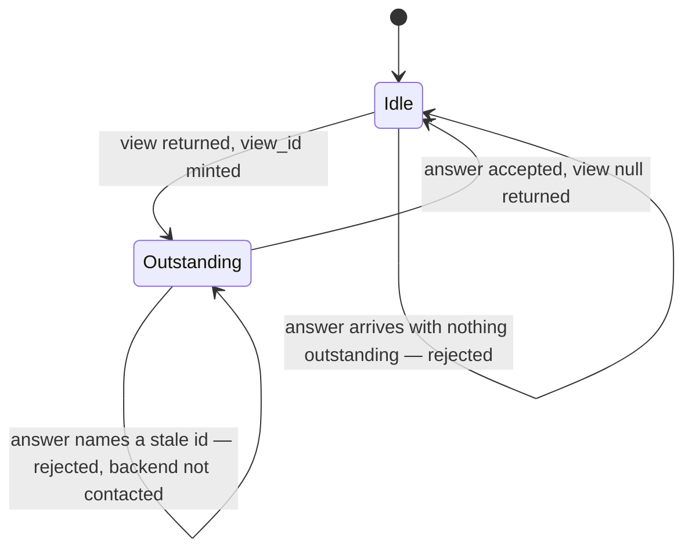

# SPEC-NNN: The host/backend interaction protocol

**Status:** draft
**Kind:** technical
**Owns:** the wire contract between the goad host and a backend program, and the
host-side behaviour that contract implies.

> **This is not canon.** It is a draft held in `docs/slices/001/`, carrying no
> SPEC id, and nothing may cite it as one. It becomes canon only when it is
> reconciled against what shipped and promoted into `docs/specs/` with the user's
> explicit endorsement (AC-13, AC-14). Until then it is authoritative about
> *intent* and the tests are authoritative about *behaviour*; where the two
> disagree, that is a finding to be dispositioned, not a licence to believe
> whichever is convenient.

<!-- Requirement ids are already immutable: append, never renumber. -->

## 1. Intent

goad's host owns interaction and nothing else. It renders prompts, accepts
answers, keeps time, and runs a program the user supplies. Every question of what
to ask, when to ask it, and what an answer means belongs to that program. This
spec is the seam: it says exactly what crosses it, in what shape, and what the
host does when what arrives is not that shape.

The problem it solves is that such a seam decays by default. A host with a
renderer in front of it drifts toward accepting whatever that renderer can draw,
and a protocol that grows by accretion ends up describing one implementation
rather than a contract. So the wire format is written down before the second
implementation exists, and the requirements below are stated as things that can
be falsified rather than as intentions.

Once this exists, a backend author can write a program in any language that can
read stdin and write stdout, run it against a published contract, and know from
the error they get back which side was wrong.

## 2. Scope

**In scope:** the request and response message formats; the protocol envelope and
its version; the interaction primitives the protocol admits; scheduling
instructions and how they resolve; the identity and lifetime of an outstanding
interaction; the process transport; and the failure taxonomy for every way an
exchange can go wrong.

**Out of scope:** how a view is drawn; the timer that decides when to evaluate;
persistence of anything across host restarts; the socket transport; the
`goad emit` command line; any means by which a backend learns what a host can
render.

**Boundaries:** the renderer abuts this spec at the canonical view — it consumes
one and produces a user response, and it may not see wire types. The timer abuts
it at the resolved next-check instant — it consumes one and calls `evaluate`.
The backend abuts it at the process boundary. A future socket transport replaces
§6.4 and nothing else.

## 3. Principles

**P-A — The host understands interaction, not intent.** No requirement here may
oblige the host to interpret a domain value. Where the host must read something
in order to decide what to do, that thing is protocol; everything else passes
through opaque, and the host may not branch on it.

**P-B — Liberal grammar, strict canonical semantics.** Input is accepted
permissively at the wire and is canonical immediately after normalization. An
ambiguous message MUST fail; it MUST NOT be guessed at. Permissiveness is about
fields the host does not model, never about the meaning of fields it does.

**P-C — An invalid value costs the sender its effect, never the host its
function.** A backend failure of any kind, including a malformed message, MUST
leave the host running and MUST leave it able to run the backend again.

## 4. Requirements

### Envelope and versioning

| id | requirement | verified by |
|----|-------------|-------------|
| R-1 | Every request the host emits MUST carry `"protocol": 1`. | §7 |
| R-2 | The host MUST accept a response that omits `protocol`. | §7 |
| R-3 | The host MUST reject, with a distinct error naming the version found, a response declaring a `protocol` value it does not implement. | §7 |
| R-4 | The host MUST ignore fields it does not model on any inbound message. | §7 |
| R-5 | The host MUST NOT reject a message solely because it carries an unmodelled field. | §7 |

### Requests

| id | requirement | verified by |
|----|-------------|-------------|
| R-6 | Requests are of exactly two kinds, `evaluate` and `respond`, discriminated by a `type` field. | §7 |
| R-7 | An `evaluate` request MUST carry the host's current instant and an event with a source, a kind, a timestamp and a data payload. | §7 |
| R-8 | A `respond` request MUST carry the `view_id` being answered, the host's current instant, the chosen option id, and a map of field id to submitted value. | §7 |
| R-9 | The host MUST NOT interpret an event's data payload or a submitted field value. It carries both verbatim. | §7 |

### Responses: views

| id | requirement | verified by |
|----|-------------|-------------|
| R-10 | A response MUST carry a `view` field. Its absence is an error naming the missing field. | §7 |
| R-11 | `"view": null` means there is nothing to show. The host MUST treat it as a positive assertion by the backend, distinct from a failure to read a view. | §7 |
| R-12 | An unrecognised `kind` discriminant, at any depth, MUST produce a distinct error carrying both the offending string and the path at which it appeared, and MUST reject the whole message. | §7 |
| R-13 | A `choice` view MUST carry a title and at least one option, and MAY carry a body. A choice with zero options MUST be rejected. | §7 |
| R-14 | Option ids MUST be unique within a choice. Duplicates MUST be rejected. | §7 |
| R-15 | An option MAY carry fields. Each field MUST carry an id, a kind and a label, and MAY carry hints. | §7 |
| R-16 | Field kinds are `text`, `boolean`, `datetime`, `number` and `choice`. | §7 |
| R-17 | A `number` field's bounds MUST each be finite, and its minimum MUST NOT exceed its maximum. A violation rejects the message. | §7 |
| R-18 | Hints are an open map. The host MUST NOT branch on any hint key. Anything the host must read is protocol, not a hint. | §7 |
| R-19 | Content forms are `text`, `markdown`, `html` and `uri`. The host MUST NOT dereference a `uri`. | §7 |
| R-20 | A view part that the host cannot read MUST NOT be silently dropped. A part may be discarded on its own only where the protocol itself specifies the behaviour in its absence. | §7 |

### Responses: scheduling

| id | requirement | verified by |
|----|-------------|-------------|
| R-21 | A response MAY carry `next_check`: either an absolute instant or a relative span, expressed as a string. | §7 |
| R-22 | An absolute instant MUST carry an explicit UTC offset. One without an offset MUST be rejected with an error distinct from a general parse failure. | §7 |
| R-23 | A relative span in calendar units — months, years — MUST be rejected with a distinct error. Their length is not fixed without a calendar, and the host resolves instants without one. | §7 |
| R-24 | A relative span in days or weeks resolves as exactly 24 and 168 hours respectively. | §7 |
| R-25 | An invalid `next_check` MUST be discarded and reported, and the rest of the message MUST be accepted. | §7 |
| R-26 | The next check resolves to the latest **valid** instruction; failing that, to a previously resolved value; failing that, to the current instant plus the configured default poll interval. | §7 |
| R-27 | The resolved next check is always a concrete instant. There is no unresolved state. | §7 |
| R-28 | A `next_check` in the past MUST be stored as given. The host MUST NOT adjust a backend's instruction to a value it prefers. | §7 |
| R-29 | A failed exchange MUST NOT alter the resolved next check. | §7 |

### Interaction identity

| id | requirement | verified by |
|----|-------------|-------------|
| R-30 | The host mints every `view_id`. A backend MUST NOT supply one, and the host MUST NOT accept one if it does. | §7 |
| R-31 | At most one interaction is outstanding at a time. | §7 |
| R-32 | A `respond` naming a `view_id` that is not the outstanding one MUST be rejected, and the backend MUST NOT be contacted. | §7 |
| R-33 | A view returned while an interaction is outstanding replaces it. The replaced `view_id` becomes stale immediately. | §7 |
| R-34 | Rejecting a stale response MUST NOT clear the outstanding interaction. | §7 |
| R-35 | The host MUST NOT validate a submitted answer beyond its `view_id`. Whether an answer is acceptable is the backend's judgement. | §7 |

### Process transport

| id | requirement | verified by |
|----|-------------|-------------|
| R-36 | The backend command is an argument vector. The host MUST NOT interpose a shell. | §7 |
| R-37 | One request is written to the backend's stdin per process invocation, and the host MUST close stdin after writing it. | §7 |
| R-38 | The host MUST read exactly one JSON document from stdout. Trailing content is an error. | §7 |
| R-39 | The host MUST drain stdout and stderr concurrently. | §7 |
| R-40 | A non-zero exit status MUST be reported as a failure and its stdout discarded, even if that stdout was valid. | §7 |
| R-41 | A configured timeout covers the whole exchange. On elapse the host MUST terminate the child and reap it. | §7 |
| R-42 | The host MUST capture stderr, including on the timeout path, and report it with the failure. | §7 |
| R-43 | Every read from a backend MUST be bounded. Exceeding the stdout bound is a failure; exceeding the stderr bound truncates the diagnostic and is not itself a failure. | §7 |

### Failure

| id | requirement | verified by |
|----|-------------|-------------|
| R-44 | Each of these MUST map to its own distinct error: command not spawnable; timeout; non-zero exit; malformed JSON; a protocol-invalid message; an invalid scheduling value; an unsupported required primitive; an answer naming an unknown or stale interaction. | §7 |
| R-45 | No backend failure may terminate the host, and none may leave it unable to invoke the backend again. | §7 |
| R-46 | The host MUST NOT panic on any value derived from a backend. | §7 |
| R-47 | Every refusal MUST be reported. The host MUST NOT absorb an invalid value silently. | §7 |

## 5. Behaviour

**The normal exchange.** The host resolves that a check is due, or a user answers
a prompt. It serializes one request, invokes the backend, reads one response,
normalizes it, resolves the next check, and updates its interaction state. A
response carrying a view leaves an interaction outstanding; one carrying
`view: null` does not.



**Partial failure.** Exactly one part of a response is discardable on its own:
`next_check`. Its absence is a state the protocol already defines a behaviour for
(R-26), which is what makes discarding it safe — the host lands somewhere the
contract chose, not somewhere it invented. Everything else fails the whole
message. In particular an unreadable body is not dropped: nothing specifies what
a renderer shows in place of a body that was sent, so dropping it would render a
view the backend did not author.

**Ambiguity is failure.** Zero options, duplicate option ids, an inverted numeric
range, an unknown primitive, two JSON documents on stdout: each of these has more
than one defensible reading, and the host takes none of them.

**Absent is not null.** A response that omits `view` has said nothing about the
view; a response with `"view": null` has said there is nothing to show. The first
is an error, the second is ordinary. Collapsing them would have the host
manufacture the backend's assertion.

**A broken backend is polled on its existing cadence.** Failures do not move the
schedule (R-29), so a backend that fails every invocation keeps being tried. The
alternative — a failure clearing or extending the schedule — converts a broken
backend into a silent host, which is the failure mode the user notices last.

## 6. Interfaces & contracts

### 6.1 Request messages

```json
{ "protocol": 1, "type": "evaluate", "now": "2026-08-23T04:12:00Z",
  "event": { "source": "timer", "kind": "scheduled",
             "timestamp": "2026-08-23T04:12:00Z", "data": {} } }
```

```json
{ "protocol": 1, "type": "respond", "now": "2026-08-23T04:14:31Z",
  "view_id": "2026-08-23T04:12:00Z#3",
  "response": { "option": "later", "values": { "minutes": 20 } } }
```

`now` and `event.timestamp` are RFC 3339 with an explicit offset. `event.data`
and `response.values` are opaque to the host (R-9).

### 6.2 Response messages

```json
{ "view": { "kind": "choice", "title": "Take a break?",
            "body": { "kind": "markdown", "value": "You have been at it **2h**." },
            "options": [
              { "id": "yes", "label": "Now" },
              { "id": "later", "label": "In a bit",
                "fields": [ { "id": "minutes", "kind": "number", "label": "Minutes",
                              "min": 5, "max": 120, "hints": { "units": "min" } } ] }
            ] },
  "next_check": "45 minutes" }
```

```json
{ "view": null, "next_check": "2026-08-23T09:00:00+10:00" }
```

### 6.3 What the host owns versus uses

The host owns: `view_id` minting and lifetime, the resolved next check, the
default poll interval, the timeout, and the read bounds. It uses, without
interpreting: event payloads, submitted values, hint keys and values, and URI
content.

### 6.4 Process transport

One process per exchange. Request on stdin, stdin then closed (R-37). Exactly one
JSON document on stdout (R-38). Stderr is diagnostic and is captured whatever the
outcome (R-42). The command is an argv vector (R-36). Nothing is inherited from a
previous exchange: there is no warm process, no connection reuse and no retry.

A backend is a **trusted user program**, not a sandboxed plugin. Nothing in this
transport constitutes isolation, and no requirement here may be read as implying
any.

## 7. Verification

| requirements | verified by |
|---|---|
| R-1, R-2, R-3 | protocol tier: a request snapshot asserts the emitted version; fixtures for absent, known and unknown inbound versions |
| R-4, R-5 | protocol-tier fixtures carrying unmodelled fields at each level |
| R-6, R-7, R-8 | request serialization snapshots for both kinds |
| R-9, R-18, R-19 | source-level check that no host code reads a hint key, a data payload or a URI; review against P-A |
| R-10, R-11 | fixtures: `view` omitted (error naming the field), `view: null` (accepted) |
| R-12 | fixtures: unknown kind at the view, at a field, and inside content — each asserting the reported path |
| R-13, R-14, R-16, R-17 | fixtures: empty options, duplicate ids, each field kind, `NaN` and inverted bounds |
| R-15 | fixtures: an option with and without fields |
| R-20 | review of every discard site against the two-clause test in §5; the discard type admits one variant, so a second requires the argument to be made |
| R-21, R-22, R-23, R-24, R-25 | the scheduling fixture corpus: absolute with and without offset, spans in minutes/hours/days/weeks, calendar units, out-of-range, and wrong-typed values — each asserting its own variant |
| R-26, R-27 | pure resolution tests over the triple (retained, incoming, default), including latest-valid-wins and invalid-preserves-existing |
| R-28 | fixture: a past instant and a negative span, asserting the stored value is unchanged |
| R-29 | integration: schedule asserted identical across timeout, non-zero exit and malformed-JSON exchanges |
| R-30 | source check that no inbound type has a `view_id` field |
| R-31, R-33, R-34 | integration: a second view replaces the first; the replaced id is then rejected; the outstanding interaction survives the rejection |
| R-32 | integration: stale and unknown ids rejected with no process spawned — asserted by a backend that would fail if run |
| R-35 | integration: an answer naming an option the view did not offer reaches the backend unchanged |
| R-36 | integration: a backend invoked as `["bash", "./backend.sh"]`, with no shebang |
| R-37 | integration: a backend that reads stdin to EOF completes an exchange |
| R-38 | fixtures: empty stdout, and two documents on stdout |
| R-39 | integration: a backend writing more than one pipe buffer to stderr before its response completes |
| R-40 | integration: exit 1 after writing valid JSON |
| R-41 | integration: a backend sleeping past the timeout; the process is confirmed gone afterwards |
| R-42 | integration: a backend that writes to stderr and then sleeps past the timeout; the failure carries the stderr |
| R-43 | integration: a backend flooding stdout past the bound; and one flooding stderr, which succeeds with a truncation flag |
| R-44 | one test per named failure mode, each asserting the specific variant |
| R-45 | the whole integration tier runs every misbehaving backend against one host instance and asserts a later exchange still succeeds |
| R-46 | clippy denying `unwrap_used` and `expect_used` outside tests |
| R-47 | every fixture asserts a reported error or discard, never a bare acceptance |

Nothing here is marked unverified.

## 8. Open questions

- **OQ-1.** How a backend learns what the host can render. R-12 rejects an
  unsupported primitive clearly, which is enough for a person debugging but not
  enough for a backend that wants to degrade gracefully. A capability
  declaration would answer it; nothing here needs one yet.
- **OQ-2.** Validation feedback. R-35 puts validation in the backend, but a
  rejection the user can act on needs per-field errors and retained values on the
  re-presented view. Those are additive fields, and honouring them is a version
  or capability question — see OQ-1.
- **OQ-3.** Whether a stale `view_id` survives a host restart. R-32's rejection
  is scoped to one process lifetime while nothing persists.

## 9. References

- `docs/brief.md` §3.3, §3.4, §5–§14, §22.3.
- ADR-001 (one-way strata), ADR-002 (single crate until triggered).
- `docs/slices/001/design.md` — the design this draft was written alongside;
  §5.2 for the type-level expression of §6, §7 for the decisions behind the
  choices §4 states as requirements.
- `docs/slices/001/review-design.md` — F-4 through F-13, several of which are
  the reason a requirement here is stated the way it is.
