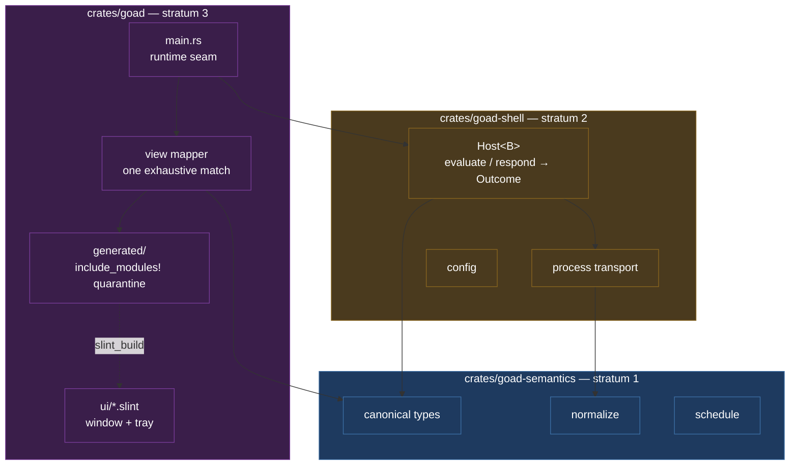

# Design — Slice 002: The workspace split, and the first renderer

<!-- The *current* design, not its history. Revision chronology, review
     findings, and dispositions live in `design-log.md`. -->

## 1. Design problem

Slice 001 built a contract and proved it against fixtures. This slice builds the
first consumer of that contract that a person can see, and in doing so it puts
two invariants under load for the first time.

The first is CLAUDE.md's third: *do not narrow wire compatibility merely because
the current renderer implements only a subset of admitted protocol
capabilities.* Until now that has been an argument. A renderer exists to draw
some of what the protocol admits and not the rest; the moment it exists, every
pressure runs toward trimming the contract to fit it. The design's job is to
make the subset explicit and structural, so that a future renderer grows into
the contract rather than the contract shrinking into the renderer.

The second is brief §13's: *a backend failure must not take the host down.*
Slice 001 discharged that headless, where "the host" is a struct. With a window
and an event loop, "does not take the host down" acquires new failure modes — a
loop that exits when the last window hides, a child process that outlives its
parent, a runtime that panics on thread affinity. Two of the three were found by
building them (`research.md` Thread 4).

The boundary of this design: everything from the canonical types outward to the
glass, plus the workspace split that must precede it. It does not design the
clock (slice 003), ingress (004), or the socket transport (005).

## 2. Current state

Cited from `research.md`; not restated here.

- **The code.** One crate, 3,939 lines of `src/`, 5,545 of `tests/`, 102 tests,
  no renderer and no binary that does anything. Thread 2.
- **The contract.** SPEC-001, 425 lines, 54 requirements. §2 puts drawing
  explicitly out of scope, which is the gap this slice's canon delta closes.
  Thread 1.
- **The gate.** `just check` runs seven commands in two feature columns. Its
  canonical source is `docs/slices/001/design.md` §9 — a closed slice's design,
  which this slice changes. Thread 1, amendment candidate 4.
- **The trigger.** ADR-002's T1 fires, on grounds ADR-002 did not name. Its
  stated reason — that a build-dependency with a conditional `build.rs` cannot
  be gated cleanly — is measurably false, verified three ways. Thread 6.
- **The renderer's feasibility.** Settled by three spikes, all confirmed, none
  refuted. Headless testing works with zero sockets opened; the tokio/Slint
  architecture runs end-to-end against the real slice-001 API; the split is a
  relocation. Threads 3, 4, 6.

## 3. Forces & constraints

**Canon.**

- **ADR-001** — stratum 1 is pure and never names stratum 2. The renderer is
  stratum 3: it may name both, and neither may name it.
- **ADR-002** — superseded by this slice. Its Verification section obliges an
  explicit trigger check recorded in the design; §5.6 is that record.
- **SPEC-001 §2** — drawing is out of scope, so no requirement reaches the
  glass directly. R-9, R-12, R-14, R-19, R-20 and R-32 constrain the renderer at
  one remove, and the gap R-20 leaves at the glass is a canon debt (§10).

**Technical limits, all verified in `research.md`.**

- **Wayland refuses three things.** Placement, always-on-top and focus-stealing
  are empty no-ops in winit's Wayland backend. Getting a prompt in front of a
  person is compositor policy, not host code.
- **`hide()` destroys a window** rather than unmapping it; `show()` recreates
  it. Reliable over 8 cycles, but it means no state may live in a Slint property
  that dies with the surface.
- **`run_event_loop()` returns when no visible top-level component remains.**
  With no tray that is the last window, which is goad's steady state; a visible
  tray icon keeps the loop alive with no window at all. Both were measured, and
  conflating them is F-12.
- **Markdown is parse-or-fail, not parse-and-degrade.** Headings, block quotes,
  images, horizontal rules, fenced code and every HTML form return `Err` from
  `StyledText::from_markdown`. All are legal SPEC-001.
- **Slint's generated code trips twelve of goad's restriction lints**, and
  Slint's own blanket allow covers no restriction lint.
- **`StyledText` has no `wrap` and no `overflow`**; `Text` has no links and no
  inline styling; selectable text needs a third element. The three capability
  sets are disjoint.
- **The test tier needs a font.** With an empty fontconfig every test panics at
  construction, inside the font stack, naming nothing useful.

**Prior commitments.**

- F-42 and F-47, inherited from slice 001's audit: a discarded scheduling
  instruction's `raw` renders verbatim and unbounded, newlines included, and
  `ConfigError::Duration` renders its fault *and* chains it as `source()`, so a
  chain-walking logger prints it twice. Both land at the glass, which is here.
- `docs/memory/a-bound-is-not-tested-at-the-bound.md` — the house rule this
  slice's absence-shaped assertions are a fresh instance of.

## 4. Guiding principles

Three rules settle the arguments below.

**1. The mapper is lossy toward the renderer and never toward the protocol.**
Anything the renderer cannot draw is still received, still normalized, still
answerable, and still reported when it is dropped. A view is never refused
because part of it cannot be drawn. This is invariant 3 made operational: the
subset lives in the mapper, where it is one exhaustive `match`, and nowhere else.

**2. Rust owns every value; the markup owns none.** The model, the identity of
the outstanding interaction, and every value a response carries live in Rust for
the process lifetime. Nothing a response submits is read back out of a Slint
property. This follows from R-9 — a value must go back as it came — and from the
window being destroyed on hide.

**3. An assertion that cannot fail is a lie.** Every absence-shaped assertion is
paired with a presence-shaped one, and each is demonstrated against a broken
implementation before it is trusted. Three separate mechanisms in this stack
make "nothing is showing" pass against a broken UI (§5.5, A-3).

## 5. Proposed design

### 5.1 System model

The split first, alone, on a tree with no renderer in it. Then the renderer, as
a third crate that both existing strata are unaware of.



Direction is one-way, and the split moves *part* of its enforcement from a grep
to the compiler: a stratum 1 source file naming `goad_shell` or `tokio` is now
`error[E0433]`, not a test failure. The claim stops there, and the boundary of it
matters (F-6). Adding `tokio.workspace = true` to stratum 1's **manifest** still
builds clean — the fact moved out of the source and into the manifest, where no
compiler objects. So `boundary.rs`'s `tokio` grep is retired as the wrong
instrument and replaced by a test that reads stratum 1's `[dependencies]`, and
the domain-vocabulary scan is not redundant at all: no compiler objects to a type
called `Habit` either.

**Crate names.** `goad-semantics`, `goad-shell`, `goad`. The bare name goes to
stratum 3 because that is the binary the user runs and the name they type.

**Why the renderer is a crate and not a feature.** Two independent reasons, both
measured (`research.md` Threads 3 and 6): Cargo forbids optional
dev-dependencies, so the Slint testing harness cannot be gated and ADR-001's own
`--no-default-features` column goes 16 → 223 crates; and `include_modules!()`
splices generated code into the crate's module tree, tripping twelve of goad's
restriction lints, which a single crate can only answer with a blanket
suppression inside the crate whose lint discipline is the point. As a separate
crate the renderer owns its own laxer `[lints]`, and stratum 1 never sees any of
it.
### 5.2 Interfaces & contracts

**Two row types, not one.** This is the seam where a canonical value becomes a
displayable one, and conflating the two sides of it does not compile: a `.slint`
struct generates its own Rust struct over `SharedString`, so a
`VecModel<PresentationOption>` cannot be handed to a setter expecting
`ModelRc<OptionRow>` (F-3).

| layer | type | owner |
|---|---|---|
| canonical, retained | `PresentationOption { id: OptionId, label: String }` | the host task |
| generated, displayed | `OptionRow { id: SharedString, label: SharedString }` | the `VecModel` |

The `VecModel` holds the **generated** row. The canonical rows are retained
beside it by the host task, and a `chosen(SharedString)` callback is resolved
against them to recover an `OptionId` the host already owns. Nothing mints an
id: `OptionId`'s constructor is `pub(super)` by deliberate decision
(`canonical.rs:36-40`), and the design does not want the constructor it does not
have.

**The mapper.** One function, one direction, no `_ =>` arm, returning plain Rust
so it is testable without instantiating a component:

```rust
// crates/goad/src/view_model.rs — stratum 3
pub fn present(view: &View) -> Presentation

pub struct Presentation {
  pub title: String,
  pub body: Body,
  pub options: Vec<PresentationOption>,
  /// Everything the protocol carried that this renderer did not draw.
  /// Never silently empty: if it is non-empty, the diagnostic surface says so.
  pub undrawn: Vec<Undrawn>,
}

pub struct PresentationOption {
  pub id: OptionId,   // never the label, never an AlternativeId
  pub label: String,
}

pub enum Body {
  None,
  /// Rendered with `from_plain_text`.
  Plain(String),
  /// Markdown that parsed. Rendered with `from_markdown`.
  Rich(String),
}

pub enum Undrawn {
  /// `Opt::fields()` was non-empty and this renderer draws no fields.
  OptionFields { option: OptionId, count: usize },
  /// `Content::Markdown` that `StyledText::from_markdown` rejected.
  MarkdownUnsupported { detail: String },
  /// `Content::Html` or `Content::Uri` — admitted by the protocol, and shown
  /// as literal text because no element draws the *form*.
  ContentForm { form: ContentForm },
}
```

`match view { View::Choice(c) => … }` with no wildcard. `View` has one variant
today; when SPEC-001 gains a second, this is a compile error naming the file,
not a blank window at runtime.

**The content mapping, exhaustively** (F-10). Three earlier statements of this
rule had drifted apart; it is tabulated once and cited from everywhere else.

| `Choice::body()` | rendered as | `Undrawn` |
|---|---|---|
| `None` | nothing | none |
| `Content::Text(s)` | `Body::Plain(s)` → `from_plain_text` | none |
| `Content::Markdown(s)`, accepted | `Body::Rich(s)` → `from_markdown` | none |
| `Content::Markdown(s)`, rejected | `Body::Plain(s)` → `from_plain_text` | `MarkdownUnsupported { detail }` |
| `Content::Html(s)` | `Body::Plain(s)` | `ContentForm { form: Html }` |
| `Content::Uri(s)` | `Body::Plain(s)` | `ContentForm { form: Uri }` |

Two things this table settles. **Nothing is omitted:** a body the backend
authored always reaches the glass, because omitting it is the silent drop R-20
forbids at normalization and CD-3 forbids at the glass. What is undrawn is the
content *form* — the markup, the fetch, the layout — never the bytes. And
**`Text` and `Markdown` take different paths deliberately:** the implicit
`.slint` string coercion is `from_plain_text`, which is right for one and
silently wrong for the other.

`Opt::fields()` returns `&Fields`, so the mapper counts them without needing an
accessor `canonical.rs` does not grant.

**The markup surface.** Two top-level components. They do **not** share globals
— each gets its own copy — so nothing passes between them that way.

```slint
export struct OptionRow { id: string, label: string }

export component PromptWindow inherits Window {
  in property <string> heading;
  in property <styled-text> body;        // the Slint type is `styled-text` (F-11)
  in property <[OptionRow]> options;
  in property <bool> body-degraded;
  callback chosen(string);               // carries OptionId.as_str()
  callback dismissed();
}

export component Tray inherits SystemTrayIcon {
  in property <image> icon;
  in property <string> tooltip;
  in property <bool> visible;            // a binding, not a constant — §5.5 E-4
  callback check-now();
  callback show-diagnostics();
  callback quit();
}
```

**Accessibility properties are the test surface**, not decoration. Every
interactive element declares `accessible-role`, `accessible-label`,
`accessible-description`, `accessible-action-default`, and
`accessible-item-count` on the options container. A bare `Rectangle` is invisible
to every query the tests use. The accessibility story arrives as a by-product.

**Selection is by `accessible_description`, carrying the `OptionId`** — never by
label, and never by component-type-plus-label. SPEC-001 R-14 permits two options
to share a label, so a label is not an identity. Where the testing API's
affordances and the spec disagree, the spec wins.

**The generated-code quarantine.** One module, `#![expect(...)]` over the twelve
lints, wrapping `include_modules!()` and re-exporting. `expect` over `allow`
because it self-cleans: when a Slint upgrade stops emitting one of the twelve,
the build fails and the list is corrected, rather than the list silently rotting.
The wrapper works because `clippy::allow_attributes` does not fire on inner
module attributes — a standing hole, not a Slint-specific concession, and it is
recorded as such because it is load-bearing.

**`build.rs`** returns `Result` — the gate rejects `.unwrap()` and `.expect()` in
build scripts — and passes
`CompilerConfiguration::new().with_debug_info(true)`. Without debug info the
element query API returns empty and every test passes vacuously. Debug info stays
on in release; it costs +0.05%.

### 5.3 Data, state & ownership

**The bridge, which is the load-bearing part.** A Slint callback is a `'static`
synchronous closure. It cannot capture `&mut Host`, build a future that borrows
it, and leave that future pending after it returns — and both `Host` entry points
take `&mut self` across the whole exchange (`host.rs:137`, `:152`). So callbacks
do not touch the host at all. They send (F-5):

```rust
enum Command {
  Evaluate(Stimulus),   // Stimulus::Startup | Stimulus::TrayAction
  Choose(SharedString), // the OptionId as the markup saw it
  Shutdown,
}
```

One bounded `tokio::sync::mpsc` channel. One `slint::spawn_local` future owns the
`Host`, the retained `Vec<PresentationOption>`, and the receiver; it loops on
`recv()` and performs one exchange at a time, which is also what SPEC-001's
one-outstanding-interaction rule wants. Every callback owns a sender clone and
nothing else.

- **A full channel** means an exchange is already running. `try_send` failing is
  not dropped silently: the UI reports that it is busy. Silently discarding a
  person's click is the failure mode this rule exists to prevent.
- **A closed channel** means the host task has ended. The callback stops sending
  and the loop is asked to quit; it does not panic.
- **`Choose` resolves against the retained rows.** The task matches the incoming
  string to a `PresentationOption` and clones *its* `OptionId`. No id is minted
  from a string, and an unmatched string is a bug in the renderer rather than an
  answer — it is reported, not sent.

**Ownership.**

| what | owner | lifetime |
|---|---|---|
| `Host<Process>` | the single `spawn_local` task | process |
| `Vec<PresentationOption>` for the shown view | the same task | until replaced |
| `mpsc::Sender<Command>` clones | each Slint callback | with the component |
| `Rc<VecModel<OptionRow>>` | Rust, created once at startup | process |
| the outstanding `ViewId` | `Host`'s `State` (slice 001, unchanged) | until closed |
| the reduced `Diagnostics` | the same task | until replaced |
| `PromptWindow` properties | Slint | **until the window hides** |

The last row is the constraint that shapes the rest. `hide()` destroys the window
on Wayland; `show()` recreates it. Any value living only in a Slint property is
gone at the next empty state. So the model is created once and `set_options` is
called once; each new view calls `set_vec` on the same `VecModel`.

Nothing is read back out of a property to build a response. This is R-9 at the
glass: a value must return as it was sent, and a round trip through a Slint
property is not identity-preserving — `f32` versus `f64` is the concrete case,
and it is why no field value will ever be read back either.

### 5.4 Lifecycle & dynamics

**The runtime seam**, verified end-to-end against the real slice-001 API
(`research.md` Thread 4):

```
  main
   ├─ read the config path (§6, OQ-7) → Config::load
   ├─ tokio::runtime::Builder::new_multi_thread().build()
   ├─ let _guard = rt.enter();          ← outlives the loop. Without it:
   │                                      exit 101 on the first backend call.
   ├─ slint::set_xdg_app_id("…")        ← before any show; the icon comes from
   │                                      the app id, the `icon` property is
   │                                      silently dropped
   ├─ Tray::new()?  → visible = true
   ├─ mpsc::channel(1)                  ← the bridge, §5.3
   ├─ slint::spawn_local(host_task)     ← owns Host, the retained rows, the rx
   └─ slint::run_event_loop_until_quit()
```

`run_event_loop_until_quit()`, not `ComponentHandle::run()` and not
`run_event_loop()`. The reason is *not* that the loop would otherwise die with
the last window — with a visible tray it would not (F-12). It is that process
lifetime should depend on an explicit quit rather than on the incidental
visibility of any component, which stays true if the tray ever becomes hideable.

`MainWindow::new()` returns `Err` when there is no display. That is reported in
the host's own voice and exits non-zero — it is not a panic, and it is never
asserted by a test (§5.5, E-6).

**The reducer.** What the renderer does with an `Outcome` depends on *which
command produced it*, because `Host`'s state machine distinguishes four cases
where a naive reading sees two (F-1). `evaluate` returning `view: null` leaves
the interaction outstanding; `respond` returning `view: null` closes it; and a
failure closes nothing at all (`host.rs:98-108`, `:139`, `:169`, `:191`;
`state.rs:102`).

| command | outcome | presentation | window |
|---|---|---|---|
| either | `failure.is_some()`, or cleanup-only | **retained unchanged** | **unchanged** |
| either | `view: Some` | replaced | shown |
| `evaluate` | `view: None`, no failure | **retained** | unchanged |
| `respond` | `view: None`, no failure | cleared | hidden |

Row 1 is the one the design previously got wrong, and it is AC-7: a failed
`respond` leaves an interaction `Host` still considers live, so hiding the window
would remove the only means of answering it. The person's answer failed to
deliver; the question did not go away.

**One exchange:**

```mermaid
sequenceDiagram
  participant U as user
  participant T as tray
  participant C as callback
  participant H as host task
  participant B as backend

  T->>C: check-now()
  C->>H: Command::Evaluate  (mpsc; full ⇒ "busy", never dropped)
  H->>B: evaluate (async, off the loop)
  Note over C: loop stays responsive
  B-->>H: Outcome
  H->>H: reduce by (command, outcome)
  alt view: Some
    H->>H: set_vec, retain rows, show
    U->>C: activate an option
    C->>H: Command::Choose(id string)
    H->>H: resolve against retained rows → OptionId
    H->>B: respond(view_id, option)
    B-->>H: Outcome
    H->>H: reduce — hide only on success with view: None
  end
  H->>T: Diagnostics::from_outcome
```

**Shutdown is cancellation, not draining** (F-4). The verified shutdown drops the
in-flight exchange future; it does not await a returned `Outcome`, and the
transport's `kill_on_drop` is what disposes of the child
(`process.rs:70`). So `on_close_requested` sends `Command::Shutdown`, the host
task drops whatever exchange is in flight and ends, and only then does the loop
quit. The observable is that no backend child outlives the process — without this
path the process exits 0 and the child **survives it**, which is worse than
SPEC-001's documented cancellation gap, where disposal is at least attempted.

**The diagnostic surface** is a pure function, because `Outcome` is not `Clone`
and something must choose the consumption point (F-7):

```rust
pub fn from_outcome(outcome: Outcome) -> Diagnostics
```

It consumes the `Outcome` and yields a `Diagnostics` the task retains. Being pure
and total, it is tested directly, and its rendering is asserted once rather than
per channel. What it must decide, and the design decides here:

- **Bound.** 4 KiB of stderr and 1 KiB of a discarded `raw`, at the glass —
  *display* bounds, unrelated to the transport's 256 KiB capture cap
  (`process.rs:23`), which is about memory rather than legibility.
- **Non-UTF-8.** `Captured` holds arbitrary bytes. Decoded lossily; the
  replacement character is left as it falls.
- **Truncation.** One marker, appended, naming the elided byte count. The
  transport's own `truncated` flag is reported separately and not conflated with
  the display bound — two different truncations, two different statements.
- **Newlines.** Escaped for display rather than laid out, so a hostile `raw`
  cannot restructure the surface. `StyledText` has no `overflow` property, which
  is why this is bounding rather than clipping.
- **Ordering**, deterministic when several coexist: `failure`, then `cleanup`,
  then `undrawn`, then `discarded`, then `stderr`. Most-decisive first.
- **Retention.** A later outcome replaces the diagnostics wholesale. A clean
  outcome clears them. A successful `view: null` is **not** a diagnostic — it is
  the ordinary quiet case, and reporting it would make the surface noise.
- **Once, exactly.** `Discarded`'s `Display` already names the raw value for
  every reason but `NotAString` (`normalize.rs:59-63`), and
  `ConfigError::Duration` renders its fault *and* chains it as `source()`. The
  reducer renders `Display` and does **not** walk `source()` chains. That is F-42
  and F-47 discharged, and being a rule about what the code must *not* do, it
  needs a test that fails when someone adds the walk back.

**What the surface says.** Two tray states — idle and fault — with the icon
generated at build time from a single glyph and two colours, so the assets are a
rule rather than two binaries nobody can regenerate. The tooltip is one line
naming the current state. A tray menu action opens the existing window in
diagnostic mode: one window, two modes, not a second window.

### 5.5 Invariants, assumptions & edge cases

**Invariants.**

- **I-1.** No legal view is refused because part of it cannot be drawn. The
  mapper degrades and records; it never returns an error.
- **I-2.** Every `Undrawn` reaches the diagnostic surface. A silent subset is
  indistinguishable from a narrowed protocol.
- **I-3.** No value a response carries is read back out of a Slint property.
- **I-4.** No failure in SPEC-001's taxonomy ends the event loop, leaves the
  backend uninvocable, or hides a view the host still considers outstanding
  (§5.4's reducer, row 1).
- **I-5.** No domain vocabulary in any crate, module, type, component,
  accessible label, or user-visible string — now including `.slint` sources.

**Assumptions.** Each is a place the design can break.

- **A-1.** Slint's twelve-lint list for generated code is complete for goad's
  markup. It is empirical against three `.slint` files. If a larger UI emits a
  thirteenth, the build fails loudly and the list is corrected — `expect` makes
  that the failure mode rather than silent drift.
- **A-2.** goad's full lint table accepts hand-written renderer code. Only the
  five async lints were proven against the runtime shape; `pedantic`,
  `needless_pass_by_value`, `shadow_unrelated` and ~75 others are unproven.
  Settled by running both clippy columns on the first renderer commit, before
  the phase commits to a shape.
- **A-3.** `with_debug_info` is `#[doc(hidden)]` and depended on. The
  environment-variable fallback is worse, not safer. If it disappears in a Slint
  upgrade, the guard test (below) fails rather than the suite going quiet.
- **A-4.** `just check` stays tolerable with 411 crates in the tree. Nobody has
  run it in the goad tree; the spike's own gate was 36 s wall, 4m28s user, and
  clippy re-checks the Slint tree in a separate cache column. This is ADR-002's
  T3 and it is currently borderline.

**Edge cases.**

- **E-1. Three mechanisms make "nothing is showing" pass against a broken UI.**
  Missing debug info empties every query; a stale `match_type_name` after a
  `.slint` rename matches nothing; and viewport virtualisation means a scrolling
  list of 100 options returns 5 from `find_all()`. Only the first has a guard.
  So: every absence assertion is paired with a presence assertion, counts come
  from `accessible-item-count` and never from `find_all().len()`, and a **guard
  test** asserts a known element *is* found so a `build.rs` regression fails
  loudly. `docs/memory/a-bound-is-not-tested-at-the-bound.md`, in a new costume.
- **E-2. The options list scrolls.** A backend may send more options than fit,
  and nothing in SPEC-001 bounds the count. It scrolls, and every count
  assertion reads `accessible-item-count`.
- **E-3. Markdown that does not parse.** Rendered via `from_plain_text` and
  reported as `Undrawn::MarkdownUnsupported` — §5.2's table, which is the single
  statement of this rule. `Content::Text` goes through `from_plain_text` and
  `Content::Markdown` through `from_markdown` explicitly: the implicit `.slint`
  string coercion is `from_plain_text`, which is right for one and silently wrong
  for the other.
- **E-4. `SystemTrayIcon::hide()` panics** — "Constant property being changed" —
  unless `visible` carries a binding. The tray is never hidden in this slice, but
  the binding is declared anyway, because the panic is a constant-folding trap
  rather than a rule, and others of its shape are unaudited.
- **E-5. A link inside a rendered body.** `StyledText` fires `link-clicked` with
  the URL verbatim; `from_markdown` accepts `javascript:`, `file:///…` and
  argument-injection-shaped URLs, and Slint's `webbrowser` dependency filters no
  scheme. **This slice does not open URLs.** `link-clicked` is handled and
  ignored. Opening one needs a scheme policy, and a scheme policy is a decision,
  not an implementation detail — it is a follow-up. SPEC-001 R-19 already forbids
  the host dereferencing a `uri`; this is the adjacent case it does not name.
- **E-6. No display.** `MainWindow::new()` returns `Err`. Reported and exited
  non-zero. **No test asserts this**, because such a test is coupled to the
  absence of a display and breaks `just test` on a developer machine.
- **E-7. A string containing U+E541** — Slint's private-use interpolation
  placeholder — makes `from_markdown` error with "Argument index 0 out of
  range". It is a backend-authored string, so it is reachable, and it lands in
  the same degrade-and-report path as E-3.
### 5.6 The ADR-002 trigger check, and the gate the split leaves

ADR-002's Verification section requires each slice adding a dependency or a
binary to check the three triggers explicitly and record the answer in its
design. This is that record.

| trigger | fires? | evidence |
|---|---|---|
| **T1** — a dependency stratum 1 must not need to build | **yes** | The `slint` **dev**-dependency for the test harness cannot be made optional (Cargo forbids optional dev-dependencies), so ADR-001's own `--no-default-features` column goes 16 → 223 crates. Separately, `include_modules!()` trips twelve restriction lints inside the crate whose lint discipline is the point. |
| **T2** — a second binary | no | `goad emit` is slice 004's. |
| **T3** — headless test wall-clock dominated by renderer build time | **borderline, unmeasured in-tree** | A-4. Measured in the spike at 36 s wall / 4m28s user, with clippy re-checking the Slint tree in a separate cache column. |

**ADR-002's stated reason for expecting T1 is false**, verified three ways: an
optional `[build-dependencies]` entry plus `#[cfg(feature = "ui")]` inside
`fn main()` resolves the `--no-default-features` normal+build graph to **one
node — the crate itself** (537 with the feature on), and `cargo build
--no-default-features` compiles no Slint crate at all. Build-dependencies gate
exactly as cleanly as normal ones. The trigger fires on the dev-dependency and
the lints instead. The superseding ADR must say so; leaving the false reason
standing would let a future slice reason from it.

**The split deletes the feature matrix** (F-6). This is the consequence the
design most easily gets wrong, because every existing document describes a
two-column gate. `tokio` and `toml` become unconditional dependencies of
stratum 2 and absent from stratum 1, so the `shell` feature has nothing left to
gate and `--no-default-features` stops being a distinct column. The second clippy
column goes with it, along with its `-A dead_code -A unreachable_pub` carve-out —
which was already inert against today's code.

The gate becomes five commands, plus one the research kept beside it and this
design puts **inside** it:

```
cargo build --workspace
cargo test --workspace
cargo test -p goad-semantics        # the successor to the --no-default-features column
deno check examples/typescript/backend.ts
cargo clippy --workspace --all-targets -- -D warnings
cargo fmt --all --check
```

`cargo test -p goad-semantics` is in the gate, not beside it as a diagnostic. It
is the only remaining executable statement that stratum 1 stands up without the
runtime, and a purity claim that is not run is not a claim. It costs 2.6 s from
an empty `target/`.

Two enforcement residues, both named rather than assumed away:

- **The manifest test.** `boundary.rs`'s three forbidden tokens for stratum 1
  become: two compile errors (`crate::shell`, `crate::bin` → `goad_shell`), and
  one that is no longer a source fact at all. `tokio` in stratum 1's manifest
  builds clean, so a new test reads `[dependencies]` from that manifest and
  fails on a runtime, a renderer, or anything filesystem-shaped.
- **One `Scan` per member.** The domain-vocabulary walk needs configuring per
  workspace member, with a residual risk the design records rather than solves:
  nothing forces a *new* member to acquire one. That is a follow-up, not a
  blocker, and it is written down so the next member's author meets it.

`docs/slices/001/design.md` §9 is the canonical source of this command block and
this slice changes it — which is CD-5, and why the block is being promoted out of
a closed slice's design and into canon of its own.

## 6. Open questions

Carried from `slice-002.md`. None remains open at design acceptance.

- **OQ-4 — What a rejected `markdown` body does.** *Answered:* rendered as plain
  text and reported as `Undrawn::MarkdownUnsupported` (§5.2's table, E-3). The
  alternative — refusing the view — is precisely the failure CLAUDE.md invariant
  3 names, and it would be the renderer deciding what the protocol may carry.
  The report channel is the renderer's own diagnostic surface, **not** an
  extension of `Discarded`: a render degradation is a stratum 3 fact about the
  glass, and `Discarded` is a stratum 1 fact about normalization. Conflating them
  would put a renderer concern inside the pure crate. What this *does* owe canon
  is the rule itself — SPEC-001 §2 puts drawing out of scope, so R-20's
  no-silent-dropping guarantee stops before the glass (§10, C-3).
- **OQ-5 — Whether the choice view scrolls.** *Answered:* yes (E-2). Nothing in
  SPEC-001 bounds the option count, so a non-scrolling list would be the renderer
  imposing a limit the protocol does not have. Consequence: counts come from
  `accessible-item-count`.
- **OQ-6 — Whether activating a link counts as dereferencing a `uri` under
  R-19.** *Answered:* the question does not arise in this slice, because no URL
  is opened (E-5). R-19 forbids the host dereferencing a `uri` **it was sent**; a
  link inside a body activated by a person is the adjacent case, and it needs a
  scheme policy before it needs an answer. Deferred as a follow-up, in writing,
  rather than settled by an implementation nobody decided.
- **OQ-7 — What stimulus drives an evaluation with no clock.** *Answered:* two,
  and the answer has to reach the level of values an agent can write (F-2).

  **Reading a clock is not owning a schedule.** Slice 003 owns the schedule —
  when to evaluate, how `next_check` is consumed, what happens on failure. Every
  caller of `Host::evaluate` has always had to supply a `Timestamp`, including
  slice 001's tests. Stratum 3 therefore carries a wall-clock adapter, one
  function wide, whose only job is to stamp a call. It is not a timer, and D15
  says so, so that slice 003 does not inherit it as one.

  - **Config path.** A positional argument if given; otherwise
    `$XDG_CONFIG_HOME/goad/config.toml`, falling back to
    `~/.config/goad/config.toml`. `Config::load` takes the path
    (`config.rs:115`); nothing else about discovery exists yet, so this is where
    it is decided.
  - **Startup event:** `Event { source: "host", kind: "startup", timestamp: now,
    data: Value::Null }`.
  - **Tray event:** `Event { source: "host", kind: "requested", timestamp: now,
    data: Value::Null }`.
    Both vocabularies are the host's own and name a *stimulus*, never a domain.
    `Event`'s fields are all `pub` (`canonical.rs:489-495`), so both are
    constructible without an accessor the crate does not grant.
  - **Startup failure.** A missing or invalid config, or a display that will not
    open, is reported in the host's voice on stderr and exits non-zero — before
    the tray exists, because a tray reporting that it cannot start is worse than
    a message.
  - **`Outcome::next_check` is received and ignored**, at a call site that says
    so, so it reads as deliberate rather than forgotten. Slice 003 fills that
    seam; it does not have to first empty it.
- **OQ-8 — What the diagnostic surface says.** *Answered:* §5.4's
  `from_outcome` reducer — named bounds, lossy decoding, one truncation marker,
  escaped newlines, deterministic ordering, wholesale replacement, and a
  successful `view: null` explicitly not a diagnostic. Two tray states, an icon
  generated from one glyph and two colours, a one-line tooltip, and a menu action
  opening the existing window in diagnostic mode.

## 7. Decisions, rationale & alternatives

- **D1 — The crate splits, and the split lands first, alone.** *Rejected:* a
  single crate with a lint quarantine (leaves ADR-001's gate column at 223
  crates, and keeps the stratum pure by vigilance rather than by the compiler);
  and splitting inside the renderer change (puts the split's failures and the
  renderer's failures in one diff with no way to tell them apart, when every
  measurement was taken on a tree with no renderer). `design-log.md` 2026-09-05.
- **D2 — `goad-semantics`, `goad-shell`, `goad`.** The bare name goes to
  stratum 3 — the binary a person runs. *Rejected:* `goad-core` for stratum 1,
  which says nothing about purity and invites the crate to accumulate; and
  `goad-ui` for stratum 3, which would leave the bare name unowned.
- **D3 — The renderer is a crate, not a Cargo feature.** Two independent measured
  grounds, §5.1. *Rejected:* ADR-002's own retained fallback, on the evidence it
  was written before.
- **D4 — Two row types with an explicit adapter.** `PresentationOption` is
  canonical and retained; the generated `OptionRow` is displayed. *Rejected:* one
  type — it does not compile, since the generated struct is over `SharedString`
  (F-3); and mapping straight into generated types, which would couple every
  mapper test to `build.rs`.
- **D5 — The row is a struct from v0, in both layers.** *Rejected:* parallel
  `[string]` arrays, which are simpler today and dead-end option-scoped fields
  tomorrow. This is the cheapest available defence of invariant 3, and it costs
  nothing.
- **D6 — Degrade and report; never refuse; never omit.** §5.2's table. *Rejected:*
  refusing the view; silently dropping the part; and omitting an HTML or URI body
  while reporting it, which is a silent drop wearing a report.
- **D7 — Tray icon plus a prompt window.** `design-log.md` 2026-09-05.
  *Rejected:* a hidden window with no tray (brief §13's "discoverable" has
  nowhere to live), and an always-visible window (wrong for a shell whose steady
  state is silence).
- **D8 — `expect`, not `allow`, for the generated-code quarantine.** It
  self-cleans; a Slint bump that changes the lint set fails the build instead of
  rotting the list. *Rejected:* `allow`, which is stable and silently drifts.
- **D9 — Two test tiers, with the boundary stated.** The cheap
  `init_no_event_loop()` tier carries the mapper, the renderer and ordinary
  Host-to-view wiring, bridging async with `block_on` in **one** `[[test]]`
  target — a tokio current-thread runtime and the testing platform share a
  thread, so a real `tokio::process::Command` is awaited and the element tree
  read inside the same `block_on`. One **additional** `[[test]]` target uses
  `init_integration_test_*` and carries the shutdown seam and nothing else,
  because `spawn_local` returns `Err(NoEventLoopProvider)` in the cheap tier and
  shutdown is defined by `spawn_local` (F-4). *Rejected:* one tier for everything
  — the cheap tier cannot reach AC-12, and a per-test target tier multiplies link
  time for cases that do not need it. This resolves `research.md` cross-thread
  finding 5, which two producers left contradicting each other.
- **D10 — Selection by `accessible_description` carrying the `OptionId`.**
  *Rejected:* selection by label (R-14 permits duplicates) and by component type
  plus label (breaks on a `.slint` rename, silently).
- **D11 — No URL is opened.** OQ-6. *Rejected:* wiring `link-clicked` to the
  platform opener, which would ship an unfiltered scheme surface —
  `javascript:` and `file:///` both parse — on a decision nobody took.
- **D12 — The devshell supplies a font.** `design-log.md` 2026-09-05.
  *Rejected:* documenting the dependency and leaving the clean-clone guarantee
  false.
- **D13 — `boundary.rs` gains an extension set, a string-literal-aware comment
  cut, and one `Scan` per workspace member.** The file's header prescribes
  extending configuration rather than the walk, but `Scan` has no extension field
  and the walk hard-codes `.rs` (`boundary.rs:13-20`, `:116`), so the walk
  changes **once**, to consult a configured set. The comment cut becomes
  string-literal aware for both languages, which discharges slice 001's tolerated
  follow-up rather than deferring it again: `code_of` truncates at the first `//`
  (`:181`), tolerable while nothing in `src/` contained one, and reachable the
  moment markup contains a URL — hiding every user-visible string after it on
  that line (F-8). *Rejected:* a second scanner for markup (two walks, one rule,
  guaranteed to diverge), and narrowing CLAUDE.md's invariant-1 claim instead.
- **D14 — Callbacks send on a bounded `mpsc`; one `spawn_local` task owns the
  host.** §5.3. *Rejected:* callbacks holding the `Host` (does not compile —
  `&mut self` across an await inside a `'static` synchronous closure), and a
  `Mutex` around the host (serialises the same work while adding a lock the
  runtime seam does not need).
- **D15 — Stratum 3 carries a wall-clock adapter, and it is not a timer.**
  OQ-7. Every `Host` call has always required a caller-supplied `Timestamp`;
  supplying one is not owning a schedule. *Rejected:* threading a clock down from
  slice 003 that does not exist yet, and hard-coding a timestamp, which would
  make every diagnostic lie about when it happened.
- **D16 — The diagnostic reducer is a pure consuming function.** §5.4.
  *Rejected:* rendering directly from a retained `Outcome` — it is not `Clone`
  (`host.rs:69`), so the consumption point has to be chosen, and choosing it at
  the reducer makes the whole surface testable without a component.

## 8. Risks & mitigations

- **R1 — The lint table rejects hand-written renderer code** (A-2). *Likelihood
  medium, impact medium:* a phase spent satisfying ~75 unproven lints instead of
  building. *Mitigation:* run the clippy command on the first renderer commit,
  before committing to a shape. *Signal:* the first `just check` after the
  renderer crate exists.
- **R2 — `just check` becomes intolerable** (A-4, ADR-002 T3). *Likelihood
  medium, impact medium.* *Mitigation:* measure in a worktree immediately after
  the dependency lands, and record the number; T3 firing is a decision, not a
  surprise. *Signal:* wall-clock on the first post-Slint gate run.
- **R3 — A vacuous test tier.** Three mechanisms produce it (E-1), and this
  project has twice found vacuous assertions in its own suite. *Likelihood high
  if unguarded, impact high:* a green suite that proves nothing, which is worse
  than no suite. *Mitigation:* the guard test, presence-plus-absence pairing, and
  break-and-revert on every absence assertion. *Signal:* an assertion that passes
  against a deliberately broken implementation.
- **R4 — The split turns out to be a redesign.** *Likelihood low* — dry-run says
  111 renames, 91 byte-identical, one substantive change. *Impact high:* ADR-002
  says that outcome is itself the finding, and it would mean ADR-001 was not
  being honoured. *Mitigation:* AC-2 names every content change. *Signal:* a
  content change beyond import paths and manifest entries.
- **R5 — `with_debug_info` disappears** (A-3). *Likelihood low, impact high:*
  every query returns empty and the suite goes quiet. *Mitigation:* the guard
  test converts it from silence into a failure. *Signal:* the guard test.
- **R6 — Scope creep through the tray.** A tray with a menu invites status
  detail, history, and settings — all of which are either domain knowledge or
  slice 003's. *Likelihood medium, impact medium.* *Mitigation:* the menu has
  three actions and the design names them; a fourth is a scope question, not an
  implementation detail. *Signal:* a menu item that needs to know what a view
  meant.
- **R7 — A new workspace member arrives with no domain-vocabulary `Scan`.**
  *Likelihood medium* — slice 004 adds a binary. *Impact medium:* invariant 1
  silently stops covering part of the tree. *Mitigation:* recorded here and in
  the slice's follow-ups; the honest fix is a test that enumerates members and
  fails on one with no scan, which is slice 004's to write when there is a second
  member to enumerate. *Signal:* a new `crates/` entry.

## 9. Validation

What the plan must produce. Each maps to an acceptance criterion in
`slice-002.md`.

**At the split, before Slint:**

1. The five-command gate exits 0, from a clean clone under `nix develop`
   (AC-1). The commands are §5.6's, verbatim — not the pre-split seven.
2. A recorded list of every file moved and every file whose content changed, with
   a reason for each content change (AC-2).
3. `cargo test -p goad-semantics` passes **inside** the gate, and stratum 1's
   manifest is read by a test that fails on a runtime, renderer or
   filesystem-shaped dependency (AC-3). The retired `tokio` source grep is
   removed in the same change, so the claim is never carried by two mechanisms of
   different strength.

**Mapper, without a component:**

4. `present` over every row of §5.2's content table — absent, text, accepted
   markdown, rejected markdown, HTML, URI — asserting both what is rendered and
   what `undrawn` names. Plus a non-empty `Opt::fields()` yielding
   `Undrawn::OptionFields` with the right count (AC-9, I-2).
5. A markdown corpus covering the parse/reject boundary — the accepting forms and
   the rejecting ones — asserting reject degrades rather than refuses, and that
   a rejected body still reaches the glass.

**Renderer, headless, cheap tier:**

6. A guard test asserting a known element *is* found (AC-10, R5).
7. Title, body and one control per option, in order, with `accessible-item-count`
   matching the model (AC-4, E-2).
8. Activating a control fires `chosen` with the right `OptionId`, including the
   case where two options share a label (AC-5, R-14, D10).
9. The empty state, asserted by presence *and* absence (AC-6, AC-11, E-1).
10. Every absence assertion demonstrated against a deliberately broken
    implementation (AC-11, R3).

**Wiring, cheap tier, one `[[test]]` target, `block_on` (D9):**

11. **The four reducer transitions** of §5.4's table, each through a real
    `tokio::process::Command` backend and then read from the element tree in the
    same `block_on` (AC-7, F-1). The failed-`respond` row is the one that matters:
    the window stays, and a retry on the same `ViewId` then succeeds.
12. **A failure case table**, filled by the plan, not by the executing agent: one
    row per SPEC-001 R-44 case, naming its fixture or script, the expected Rust
    variant, the expected diagnostic text, and whether it contacts a process.
    Separate rows for cleanup-only and for cleanup-plus-exchange failure. State
    failures and unreachable transport-internal safeguards are exempt from the
    real-process requirement and say so. Every case runs through **one retained
    `Host`**, and a successful exchange after the sequence is asserted — which is
    AC-7 as written, not the weaker one-rendering-per-failure paraphrase. Slice
    001 already established this shape with nineteen failures through one host
    (SPEC-001 §7).
13. `Diagnostics::from_outcome` tested directly as a pure function — bounds,
    lossy decoding, the truncation marker, escaped newlines, ordering, and
    clearing — plus one test asserting each fact renders exactly once, which
    fails if a `source()` walk is added (AC-8, F-42, F-47).

**Wiring, event-loop tier, one dedicated `[[test]]` target (D9):**

14. Shutdown: request quit, the in-flight exchange is cancelled and dropped, the
    host task ends, the loop quits, and no backend child outlives the process
    (AC-12). This is the only case that needs `init_integration_test_*`, and it
    is why the target exists.

**Boundary:**

15. `boundary.rs` scans `.slint` and `.rs` across every workspace member, with
    positive controls planting a forbidden word in a component name, an
    accessible label, an ordinary string, and a string *after* a URL on the same
    line (AC-13, AC-14, D13).

## 10. Canon impact

Every entry is a debt reconciliation must settle. All are drafted in
`canon-delta.md` during the slice and promoted at audit with explicit
endorsement; none is written into `docs/` mid-slice.

- **C-1 — ADR-002 is superseded**, not amended. ADR-002 says so itself. The new
  ADR records the split as taken, names the real trigger ground, and states the
  crate names, the workspace layout, the fixture location and the gate shape
  that ADR-002 deliberately left undecided. **Endorsed** 2026-09-05.
- **C-2 — ADR-002's stated reason for T1 is measurably false** (§5.6). The
  superseding ADR corrects it. Leaving it standing would let a future slice
  reason from a false premise.
- **C-3 — SPEC-001 has no rule at the glass.** R-20 forbids silently dropping a
  view part *at normalization* and gives the reason — dropping it would render a
  view the backend did not author — but §2 puts drawing out of scope, so the
  guarantee stops before the renderer. This slice's D6 is the missing rule, and
  it belongs in the spec rather than in one renderer's design: *a renderer must
  not refuse a legal view because it cannot draw part of it; it renders what it
  can, and reports what it did not.* This is CLAUDE.md invariant 3 with
  something to enforce it.
- **C-4 — SPEC-001 §7 names the fixture directory normatively.** The split moves
  it. A file move on disk; a canon change on paper.
- **C-5 — The gate's canonical command block lives in a closed slice's design**
  (`docs/slices/001/design.md` §9), and this slice changes the gate. AGENTS.md
  otherwise forbids retro-fitting a closed design. Promoting §9 into canon — a
  policy under the currently-empty `docs/policy/` — is a canon creation, and it
  is the honest fix. The block it carries is §5.6's six commands, with no
  feature matrix.
- **C-7 — `CLAUDE.md` describes a feature matrix the split deletes.** "Clippy in
  both feature columns" and "a matrix checked in one column is unchecked" both
  become false, and nothing fails when they do — they quietly instruct every
  future agent to check something that cannot be checked. Replaced by a pointer
  to C-5's policy and a statement of what holds stratum 1's purity instead.
- **C-6 — CLAUDE.md invariant 1 claims a boundary test greps for domain
  vocabulary.** True today for `.rs`, false for `.slint` the day this lands
  unless D13 is implemented. Either the test grows or the claim narrows; the
  design chooses the test.
