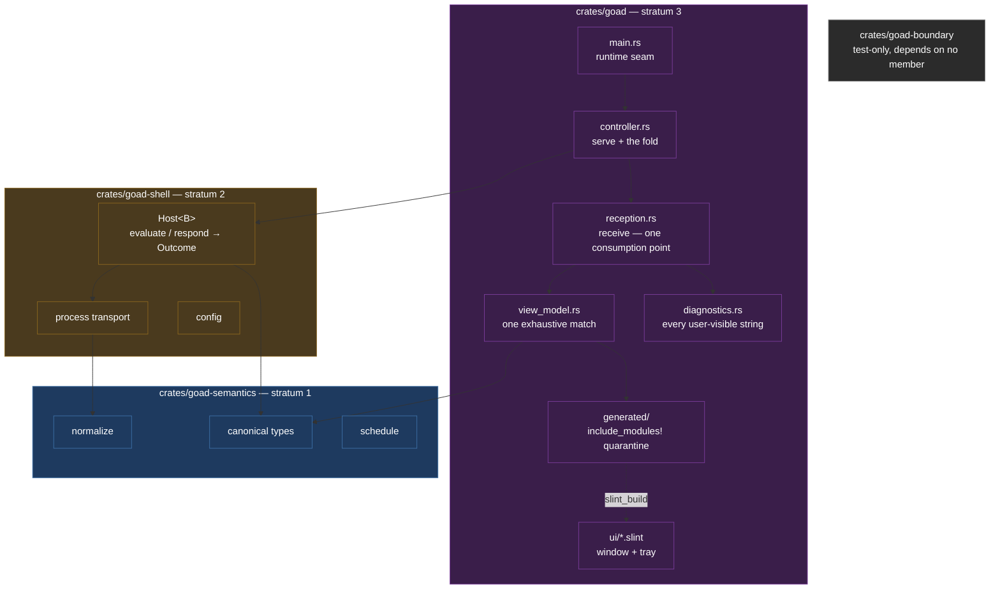
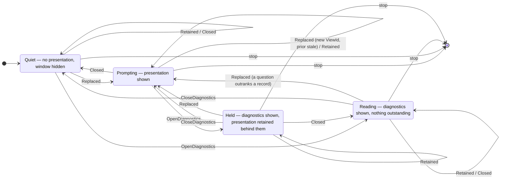

# Design — Slice 002: The workspace split, and the first renderer

<!-- The *current* design, not its history. Revision chronology, review
     findings, and dispositions live in `design-log.md`. -->

## 1. Design problem

Slice 001 built a contract and proved it against fixtures. This slice builds the
first consumer of that contract that a person can see, and in doing so it puts
two invariants under load for the first time.

The first is CLAUDE.md's third: *do not narrow wire compatibility merely because
the current renderer implements only a subset of admitted protocol
capabilities.* Until now that has been an argument. A renderer exists to draw
some of what the protocol admits and not the rest; the moment it exists, every
pressure runs toward trimming the contract to fit it. The design's job is to
make the subset explicit and structural, so that a future renderer grows into
the contract rather than the contract shrinking into the renderer.

The second is brief §13's: *a backend failure must not take the host down.*
Slice 001 discharged that headless, where "the host" is a struct. With a window
and an event loop, "does not take the host down" acquires new failure modes — a
loop that exits when the last window hides, a child process that outlives its
parent, a runtime that panics on thread affinity, a stop request that cannot be
heard because the loop is awaiting the very exchange it wants to abandon. Three
of the four were found by building them (`research.md` Thread 4).

The boundary of this design: everything from the canonical types outward to the
glass, plus the workspace split that must precede it. It does not design
**scheduling** (slice 003), ingress (004), or the socket transport (005). It
*does* read a wall clock, because every `Host` entry point has always required a
caller-supplied `Timestamp` and something has to supply it; reading a clock and
owning a schedule are different jobs, and D15 keeps them apart so slice 003 does
not inherit a timer that was never built (F-23).

## 2. Current state

Cited from `research.md`; not restated here.

- **The code.** One crate, 3,939 lines of `src/`, 5,545 of `tests/`, 102 tests,
  no renderer and no binary that does anything. Thread 2.
- **The contract.** SPEC-001, 425 lines, 54 requirements. §2 puts drawing
  explicitly out of scope, which is the gap this slice's canon delta closes.
  Thread 1.
- **The gate.** `just check` runs seven commands in two feature columns. Its
  canonical source is `docs/slices/001/design.md` §9 — a closed slice's design,
  which this slice changes. Thread 1, amendment candidate 4.
- **The trigger.** ADR-002's T1 fires, on grounds ADR-002 did not name. Its
  stated reason — that a build-dependency with a conditional `build.rs` cannot
  be gated cleanly — is measurably false, verified three ways. Thread 6.
- **The renderer's feasibility.** Settled by three spikes, all confirmed, none
  refuted. Headless testing works with zero sockets opened; the tokio/Slint
  architecture runs end-to-end against the real slice-001 API; the split is a
  relocation. Threads 3, 4, 6.

## 3. Forces & constraints

**Canon.**

- **ADR-001** — stratum 1 is pure and never names stratum 2. The renderer is
  stratum 3: it may name both, and neither may name it.
- **ADR-002** — superseded by this slice. Its Verification section obliges an
  explicit trigger check recorded in the design; §5.6 is that record.
- **SPEC-001 §2** — drawing is out of scope, so no requirement reaches the
  glass directly. R-9, R-12, R-14, R-19, R-20, R-32, R-33, R-34, R-42, R-48 and
  R-54 constrain the renderer at one remove, and the gap R-20 leaves at the
  glass is a canon debt (§10).

**Technical limits, all verified in `research.md`.**

- **Wayland refuses three things.** Placement, always-on-top and focus-stealing
  are empty no-ops in winit's Wayland backend. Getting a prompt in front of a
  person is compositor policy, not host code.
- **`hide()` destroys a window** rather than unmapping it; `show()` recreates
  it (`research.md:701-706`). Reliable over 8 cycles, but it means no state may
  live in a Slint property that dies with the surface.
- **`run_event_loop()` returns when no visible top-level component remains.**
  With no tray that is the last window, which is goad's steady state; a visible
  tray icon keeps the loop alive with no window at all. Both were measured, and
  conflating them is F-12.
- **A `spawn_local` future is never polled again once the loop returns**
  (`research.md:500-510`). `JoinHandle::abort()` cannot take effect and dropping
  the handle does not drop the future, so `kill_on_drop` never fires: measured,
  the process exits 0 and a 30 s child *survives it*. Cancellation must happen
  inside the loop, before the quit.
- **Markdown is parse-or-fail, not parse-and-degrade.** Headings, block quotes,
  images, horizontal rules, fenced code and every HTML form return `Err` from
  `StyledText::from_markdown`. All are legal SPEC-001.
- **Slint's generated code trips twelve of goad's restriction lints**
  (`research.md:395-425`), and Slint's own blanket allow covers no restriction
  lint.
- **`StyledText` has no `wrap` and no `overflow`**; `Text` has no links and no
  inline styling; selectable text needs a third element. The three capability
  sets are disjoint.
- **Slint's `int` is `i32` and its `float` is `f32`**, while SPEC-001's bounds
  are `f64` and goad's lint table refuses the `as` that would bridge them
  (`research.md:599-609`). No number the host owns may round-trip through a
  Slint property — which is why every selector in this design is a string
  matched against retained state.
- **The test tier needs a font.** With an empty fontconfig every test panics at
  construction, inside the font stack, naming nothing useful.

**Prior commitments.**

- F-42 and F-47, inherited from slice 001's audit: a discarded scheduling
  instruction's `raw` renders verbatim and unbounded, newlines included, and
  `ConfigError::Duration` renders its fault *and* chains it as `source()`, so a
  chain-walking logger prints it twice. Both land at the glass, which is here.
- `docs/memory/a-bound-is-not-tested-at-the-bound.md` — the house rule this
  slice's absence-shaped assertions are a fresh instance of.

## 4. Guiding principles

Four rules settle the arguments below.

**1. The mapper is lossy toward the renderer and never toward the protocol.**
Anything the renderer cannot draw is still received, still normalized, still
answerable, and still reported when it is dropped. A view is never refused
because part of it cannot be drawn. This is invariant 3 made operational: the
subset lives in the mapper, where it is one exhaustive `match`, and nowhere else.

**2. Rust owns every value; the markup owns none.** The model, the identity of
the outstanding interaction, and every value a response carries live in Rust for
the process lifetime. Nothing a response submits is read back out of a Slint
property. What travels outward and back is a *selector* — a string matched
against retained state, never parsed into a value. This follows from R-9 — a
value must go back as it came — and from the window being destroyed on hide.

**3. An assertion that cannot fail is a lie.** Every absence-shaped assertion is
paired with a presence-shaped one, and each is demonstrated against a broken
implementation before it is trusted. Three separate mechanisms in this stack
make "nothing is showing" pass against a broken UI (§5.5, A-3).

**4. Every fact has one renderer and one place.** A value is displayed by
exactly one piece of code, in exactly one location on the surface. This is F-42
and F-47 generalised from two inherited defects into the rule that prevents
their class: no `source()` walk, no marker that repeats the reason it marks, no
second statement of a number one module already owns.

## 5. Proposed design

### 5.1 System model

The split first, alone, on a tree with no renderer in it. Then the renderer, as
a third crate that both existing strata are unaware of.



Direction is one-way, and the split moves *part* of its enforcement from a grep
to the compiler. **Four** mechanisms now hold what one grep held. They are not
interchangeable, and their sum is not "purity, enforced" — the overstatement
F-6 has now been raised on three times. Each row's third column is the
load-bearing one:

| what it holds | instrument | where it stops |
|---|---|---|
| a stratum 1 **source file** naming `goad_shell` or `tokio` | Cargo resolution — `error[E0433]`, confirmed by negative control (`research.md` Thread 6) | crate edges only |
| a runtime, renderer or filesystem-shaped **dependency entry** in a stratum 1 or 2 manifest | the manifest allowlist test, §5.6 | names, not versions or features |
| a **direct `std` reach** for the filesystem, a process, a socket, a thread, the environment or a clock, in stratum 1's sources | the stratum 1 purity scan, §5.6 | the spellings a line-based scan sees |
| a **domain word** anywhere in any member's sources | the vocabulary scan, §5.6 | line-based lexing, D13 |

Two boundaries the design has repeatedly overstated, stated once here and
repeated nowhere.

**The compiler's half is crate edges, and nothing else.** Adding
`tokio.workspace = true` to stratum 1's **manifest** still builds clean
(`research.md:806`) — the fact moved out of the source and into the manifest,
where no compiler objects. That is why `boundary.rs`'s `tokio` grep is retired
as the wrong instrument and replaced by a test that reads stratum 1's dependency
tables.

**A manifest cannot see `std`.** ADR-001 asks for more than the absence of a
dependency: "No I/O and no async runtime." `std::fs::read_to_string`,
`std::process::Command`, `std::net::TcpStream`, `std::thread::spawn`,
`std::env::var` and `SystemTime::now` all need no manifest entry at all, so the
allowlist test is blind to every one of them and the compiler has no opinion.
That is the half the third instrument holds — and it holds it the only way
available, by reading the source. It is a **tripwire over the obvious
spellings**, not a proof: `use std::{fs, process};`, an alias, and I/O performed
on stratum 1's behalf by a permitted dependency all pass it. §5.6 says so, and
D25 records why a weak instrument in the gate beats an unwritten rule.

And the domain-vocabulary scan is not made redundant by any of the three,
because no compiler objects to a type called `Habit` either.

**Crate names.** `goad-semantics`, `goad-shell`, `goad`, and `goad-boundary`.
The bare name goes to stratum 3 because that is the binary the user runs and the
name they type. `goad-boundary` is not a stratum: it is the test-only member that
owns the two workspace-wide checks above (D17).

**Why the renderer is a crate and not a feature.** Two independent reasons, both
measured (`research.md` Threads 3 and 6): Cargo forbids optional
dev-dependencies, so the Slint testing harness cannot be gated and ADR-001's own
`--no-default-features` column goes 16 → 223 crates; and `include_modules!()`
splices generated code into the crate's module tree, tripping twelve of goad's
restriction lints, which a single crate can only answer with a blanket
suppression inside the crate whose lint discipline is the point.

As a separate crate the renderer keeps the generated tree, its ungateable
dev-dependency and its twelve-lint suppression inside a member that contains no
pure code and no protocol code. The renderer does **not** get a laxer lint
table: every member writes `lints.workspace = true`, and the suppression is
scoped to the one module that wraps `include_modules!()` (D8, F-16).

**`crates/goad` is a library plus a thin binary**, and that is a lint decision
before it is a testing one. `unreachable_pub` is `warn` in the table
(`Cargo.toml:104`) and fatal under the gate's `-D warnings`, and it refuses a
`pub` item inside a **private** module — measured, nine errors on the first
compile of the design's own text, one per `pub` item §5.4 declares. The
boundary was measured too: `pub` at the crate root of a binary does not fire;
`pub` below a private `mod` does, in a library exactly as in a binary.

There are therefore two shapes that pass, and only one of them is compatible
with §9. `pub(crate)` on every item satisfies the lint and puts every one of
them out of reach of a `tests/` target — which is where item 11, item 12, item
13 and item 17 all run (D9, §12.8). So: `src/lib.rs` declares the module tree,
each module is a `pub mod`, and every item the design writes `pub` is genuinely
reachable, which is what the lint is asking for. `src/main.rs` holds `main`,
`run` and `start` — the three functions that choose an exit code and construct
the process, which no test drives — and nothing else. Everything a test can
reach, `install` included (item 14e drives it), lives in the library.

The consequence is not free and is not hidden: those items are public API, so
`clippy::missing_errors_doc` (pedantic, `Cargo.toml:123`) fires on every one
that returns `Result`. The `# Errors` sections in §5.4 are obligations, not
courtesies.

### 5.2 Interfaces & contracts

**Two row types, not one.** This is the seam where a canonical value becomes a
displayable one, and conflating the two sides of it does not compile: a `.slint`
struct generates its own Rust struct over `SharedString`, so a
`VecModel<PresentationOption>` cannot be handed to a setter expecting
`ModelRc<OptionRow>` (F-3).

| layer | type | owner |
|---|---|---|
| canonical, retained | `PresentationOption { id: OptionId, label: String }` | the `Controller` |
| generated, displayed | `OptionRow { id, label, view: SharedString }` | the `VecModel` |

The `VecModel` holds the **generated** row. The canonical rows are retained
beside it by the controller, and a `chosen(view, option)` callback is resolved
against them to recover an `OptionId` the host already owns. Nothing mints an
id: `OptionId`'s constructor is `pub(super)` by deliberate decision
(`canonical.rs:57-62`), and the design does not want the constructor it does not
have.

**The mapper.** One function, one direction, no `_ =>` arm, returning plain Rust
so it is testable without instantiating a component:

```rust
// crates/goad/src/view_model.rs — stratum 3
pub fn present(view: &View) -> Presentation

#[derive(Debug)]
pub struct Presentation {
  pub title: String,
  pub body: Body,
  pub options: Vec<PresentationOption>,
  /// Everything the protocol carried that this renderer did not draw.
  /// Never silently empty: if it is non-empty, the diagnostic surface says so,
  /// and `receive` (below) is why that cannot be forgotten.
  pub undrawn: Vec<Undrawn>,
}

#[derive(Debug, Clone, PartialEq, Eq)]
pub struct PresentationOption {
  pub id: OptionId,   // never the label, never an AlternativeId
  pub label: String,
}

#[derive(Debug, Clone, PartialEq)]
pub enum Body {
  None,
  /// The value the backend sent, shown as literal text. Rendered with
  /// `from_plain_text`, which is a total function and takes no decision.
  Plain(String),
  /// `Content::Markdown` that parsed. The **parse is retained**, not repeated:
  /// `from_markdown` is the classifier and the renderer at once, and calling it
  /// a second time at the setter would put the accept/reject decision in two
  /// places — where the second place has no honest answer available, because
  /// the surface has already reported the body as drawn.
  Rich(StyledText),
}

#[derive(Debug, Clone, PartialEq, Eq)]
pub enum Undrawn {
  /// `Opt::fields()` was non-empty and this renderer draws no fields.
  OptionFields { option: OptionId, count: usize },
  /// `Content::Markdown` that `StyledText::from_markdown` rejected.
  MarkdownUnsupported { detail: String },
  /// `Content::Html` or `Content::Uri` — admitted by the protocol, and shown
  /// as literal text because no element draws the *form*.
  ContentForm { form: ContentForm },
}

/// The content forms this renderer shows as literal text because Slint has no
/// element for them (`research.md` Thread 5). Deliberately **not** a mirror of
/// `Content`: it names only the forms that reach the glass undrawn, so a third
/// content form added to SPEC-001 is a compile error in the mapper's `match`
/// rather than a silent omission.
///
/// It carries no payload on purpose. The bytes already reach the glass as the
/// body; carrying them here too would render one value twice (principle 4).
#[derive(Debug, Clone, Copy, PartialEq, Eq)]
pub enum ContentForm {
  Html,
  Uri,
}

impl Presentation {
  /// True when the body reaching the glass is literal text the backend did not
  /// send as text — rejected markdown, HTML, or a URI. Drives the marker beside
  /// the body; the *reason* lives in the diagnostic list and appears nowhere
  /// else (principle 4). Derived from `undrawn`, not stored, so the rule has
  /// one statement. Note what it excludes: `Undrawn::OptionFields` is undrawn
  /// but says nothing about the body.
  pub fn body_is_degraded(&self) -> bool
}
```

`match view { View::Choice(c) => … }` with no wildcard. `View` has one variant
today; when SPEC-001 gains a second, this is a compile error naming the file,
not a blank window at runtime.

`slint::StyledText` derives `Debug, PartialEq, Clone, Default`
(`i-slint-core-1.17.1/styled_text.rs:6-7`), so retaining the parse costs
`Presentation` none of its derives and needs no hand-written impl. It is a value
type, not a component: holding one does not require an event loop, so the mapper
stays testable in the cheap tier.

`ContentForm`'s `Display` yields a noun phrase and nothing else —
`Html => "HTML"`, `Uri => "a URI"` — so it drops into the undrawn sentence
without an article being chosen at the call site. That is its only rendering
(F-19).

**The content mapping, exhaustively** (F-10). Three earlier statements of this
rule had drifted apart; it is tabulated once and cited from everywhere else.

| `Choice::body()` | rendered as | `Undrawn` |
|---|---|---|
| `None` | nothing | none |
| `Content::Text(s)` | `Body::Plain(s)` → `from_plain_text` | none |
| `Content::Markdown(s)`, accepted | `Body::Rich(parsed)` | none |
| `Content::Markdown(s)`, rejected | `Body::Plain(s)` → `from_plain_text` | `MarkdownUnsupported { detail }` |
| `Content::Html(s)` | `Body::Plain(s)` | `ContentForm { form: Html }` |
| `Content::Uri(s)` | `Body::Plain(s)` | `ContentForm { form: Uri }` |

Two things this table settles. **Nothing is omitted:** a body the backend
authored always reaches the glass, because omitting it is the silent drop R-20
forbids at normalization and CD-3 forbids at the glass. What is undrawn is the
content *form* — the markup, the fetch, the layout — never the bytes. And
**`Text` and `Markdown` take different paths deliberately:** the implicit
`.slint` string coercion is `from_plain_text`, which is right for one and
silently wrong for the other.

Showing a `uri` as literal text is not dereferencing it. R-19 forbids the host
fetching what a `uri` names; it does not forbid displaying the string the
backend sent, and displaying it is what R-20's no-silent-drop rule requires.

`Opt::fields()` returns `&Fields`, so the mapper counts them without needing an
accessor `canonical.rs` does not grant.

**The reception seam: one consumption point.** `Outcome` is not `Clone` and has
six owned fields (`host.rs:70-96`), so something must choose where it is taken
apart. That point is one function, and it is the only consumer of an `Outcome`
in the process:

```rust
// crates/goad/src/reception.rs — stratum 3
pub fn receive(outcome: Outcome) -> Received

#[derive(Debug)]
pub struct Received {
  /// The view, already mapped, paired with the identity that answers it. Both
  /// halves or neither — the invalid combination is not representable, the same
  /// move `Presented` makes one stratum down (`host.rs:35-38`).
  pub prepared: Option<Prepared>,
  /// `true` when `Outcome::failure` was `Some`. The **only** bit of the
  /// diagnostic half the presentation reducer reads, and it is deliberately not
  /// `cleanup`: cleanup is orthogonal to success (`host.rs:91-95`) and must
  /// never select a presentation transition (§5.4, F-1).
  pub refused: bool,
  /// Resolved on every outcome, failures included. Received and ignored in this
  /// slice, at a call site that says so (D15, OQ-7).
  pub next_check: Timestamp,
  /// Replaces whatever the surface was holding, wholesale (§5.4).
  pub diagnostics: Diagnostics,
}

/// The interaction the renderer is showing, and the token that answers it.
///
/// `view_id` is copied from `Presented::view_id` (`host.rs:35-38`), which is the
/// public half of the pair `Host` mints. `Host`'s `State` keeps the
/// authoritative copy (`state.rs:22-25`); this one is the token the markup
/// carries and the argument `Host::respond` is given. Two copies, one owner.
#[derive(Debug)]
pub struct Prepared {
  pub view_id: ViewId,
  pub presentation: Presentation,
}
```

`receive` is total, pure and panic-free. It calls `present` itself and hands the
resulting `undrawn` straight to the diagnostic reducer, which is the whole point
of it existing: **I-2 stops being a rule an agent must remember and becomes the
only path the types admit.** A design in which the controller maps the view and
then separately builds diagnostics is a design in which `undrawn` can be
dropped, and the earlier `Diagnostics::from_outcome(Outcome)` was worse than
that — it could not see `undrawn` at all, because `Outcome` has no field for it,
so a successful view with undrawn parts would have read as clean and *cleared*
the surface (F-7).

`receive` also puts the `ViewId` in public reach beside the presentation, which
`Presented` already does at stratum 2 (`host.rs:35-38`); the earlier ownership
table's claim that the only copy lives inside private `Host::State` was wrong
(F-13).

**The markup surface.** Two top-level components, one window with two modes.
They do **not** share globals — each gets its own copy — so nothing passes
between them that way.

```slint
import { Button, ScrollView } from "std-widgets.slint";

export struct OptionRow { id: string, label: string, view: string }

export enum WindowMode { prompt, diagnostic }

export component PromptWindow inherits Window {
  in property <WindowMode> mode;

  // prompt mode
  in property <string> heading;
  in property <styled-text> body;        // the Slint type is `styled-text` (F-11)
  in property <[OptionRow]> options;
  in property <bool> body-degraded;
  in property <bool> busy;               // an exchange is in flight; controls disabled

  // either mode
  in property <string> notice;           // transient, host-authored; "" = none

  // diagnostic mode
  in property <[string]> diagnostic-lines;   // ordered, escaped and bounded in Rust

  callback chosen(string, string);       // (view token, OptionId.as_str())
  callback close-diagnostics();          // leave diagnostic mode

  title: root.mode == WindowMode.prompt ? "goad" : "goad — diagnostics";

  VerticalLayout {
    if root.mode == WindowMode.prompt: VerticalLayout {
      Text { text: root.heading; }
      StyledText {
        text: root.body;
        // E-5: the link is handled and ignored. This slice opens no URL, and an
        // unhandled callback is not the same statement as a handled one.
        link-clicked(link) => { }
      }
      if root.body-degraded: Text { text: "shown as plain text"; }

      ScrollView {
        VerticalLayout {
          accessible-role: list;
          accessible-label: "options";
          accessible-item-count: root.options.length;

          for option[index] in root.options: Button {
            text: option.label;
            enabled: !root.busy;
            // The identity the tests select on, and the only unambiguous one:
            // R-14 permits two options to share a label (D10, T-E).
            accessible-description: option.id;
            accessible-item-index: index;
            clicked => { root.chosen(option.view, option.id); }
          }
        }
      }
    }

    if root.mode == WindowMode.diagnostic: VerticalLayout {
      Text { text: "Diagnostics"; }
      if root.diagnostic-lines.length == 0: Text { text: "Nothing to report."; }
      ScrollView {
        VerticalLayout {
          accessible-role: list;
          accessible-label: "diagnostics";
          accessible-item-count: root.diagnostic-lines.length;
          for line[index] in root.diagnostic-lines: Text {
            text: line;
            accessible-item-index: index;
          }
        }
      }
      Button {
        text: "Close";
        accessible-description: "close-diagnostics";
        clicked => { root.close-diagnostics(); }
      }
    }

    if root.notice != "": Text { text: root.notice; }
  }
}

export component Tray inherits SystemTrayIcon {
  // `icon`, `tooltip` and `visible` are SystemTrayIcon's own. They cannot be
  // redeclared ("Cannot override property") **and** inheriting them exposes no
  // Rust setter, so the values the glass must write get their own properties
  // and the builtins are *bound* to them. Binding is also what stops the
  // compiler folding `visible` into a constant — E-4's panic trap, closed by
  // measurement rather than by belief (F-28).
  in property <image> image;
  in property <string> hover-text;
  in property <bool> shown: true;

  icon: root.image;
  tooltip: root.hover-text;
  visible: root.shown;

  callback check-now();
  callback show-diagnostics();
  callback quit();

  Menu {
    MenuItem { title: "Check now";   activated => { root.check-now(); } }
    MenuItem { title: "Diagnostics"; activated => { root.show-diagnostics(); } }
    MenuSeparator { }
    MenuItem { title: "Quit";        activated => { root.quit(); } }
  }
}
```

Every callback the Rust side installs has a producer above, and every producer
is one the testing tier can drive (F-17). The Slint facts that block rests on are
read from the compiler's own sources rather than inferred:

- **`SystemTrayIcon` takes exactly one `Menu` child**, not inside an `if` or a
  `for`, with `MenuItem`, nested `Menu` and `MenuSeparator` as its entries;
  `MenuItem` carries `title`, `enabled`, `checkable`, `checked`, `icon` and one
  `activated()` callback (`i-slint-compiler-1.17.1/builtins.slint:1296-1319`,
  `:3121-3134`). A `shortcut` on a tray `MenuItem` is ignored, so none is set.
- **`SystemTrayIcon` already declares `icon`, `tooltip` and `visible`**
  (`builtins.slint:3241-3252`), and neither redeclaring nor merely *setting*
  them works: redeclaring is `error: Cannot override property`, and a plain
  literal binding is folded to a constant with **no Rust setter generated at
  all**. Both measured (`research.md` Thread 8). So `Tray` declares three
  properties of its own and binds the builtins to them, which yields
  `set_image`, `set_hover_text` and `set_shown` and leaves `visible` unfolded.
  `builtins.slint` also states the fact the glass depends on: *"the tray icon is
  only created once a non-empty image has been assigned"* — which is why
  `SlintGlass::new` writes the icon and tooltip before the loop runs, rather
  than leaving the first write to the loop's first `present`.
- **`Button` already declares `accessible-role: button`,
  `accessible-label: root.text`, `accessible-enabled` and
  `accessible-action-default`, and its inner `Text` declares
  `accessible-role: none`** (`widgets/fluent/button.slint:29-34`, `:86`). That
  is what makes it addressable by one handle rather than two — T-E's ambiguity
  is a property of hand-rolled controls, and the stock widget has already
  answered it. It also wraps a `FocusScope` and activates on `" "` or `"\n"`
  (`:104-117`), so keyboard operation is free rather than owed to a per-option
  `FocusScope` (T-D).
- **`accessible-description` and `accessible-item-index` / `-count` are
  reserved properties settable on any element that has a role**
  (`i-slint-compiler-1.17.1/typeregister.rs:256-283`) — and settable on a
  *component instance* only when that component's own root declares a role,
  which `Button` does and a bare `Rectangle` does not
  (`tests/syntax/accessibility/accessible_properties.slint:24-41`). `list` is a
  real `AccessibleRole` (`i-slint-common-1.17.1/enums.rs:475-486`).
- **`accessible-item-count` is an `int`**, and `options.length` is one, so the
  count crosses without a numeric conversion — I-3 is untouched, and E-2's
  virtualisation-proof count has a source.
- **The title is a conditional over `mode`**, which is an ordinary Slint
  expression rather than the enum binding A-6 was unsure of; if the compiler
  refuses it, A-6's fallback moves the two literals into `diagnostics.rs`.
- **`StyledText`'s property is `text`, of type `styled-text`, and it carries
  `link-clicked(link)`** (`builtins.slint:731-755`). It declares **no**
  accessible role, and `accessible-label` takes a `string`, so the body's value
  is *not* addressable through the accessibility tree the way a `Text`'s is
  (`:599-600`). That decides where the body is asserted: its **content** is
  asserted on `Presentation` in the mapper tier (§9 items 4, 5, 13l), and the
  element tree asserts only that a `StyledText` is present in prompt mode. The
  alternative — a second `body-text: string` property carrying a plain copy for
  the label — would render one value twice, which principle 4 forbids, and would
  put a second statement of the body one property away from the first.

Eight things about that block are load-bearing.

**`chosen` carries two strings, and the first is the view token.** Without it a
delayed click answers whichever interaction happens to be outstanding when it is
dequeued (F-13, §5.3). `OptionRow` carries the token as a third column so the
control has it to send.

**`dismissed()` is gone.** It was declared with no producer and no transition
because it had no meaning: under SPEC-001 a view cannot be withdrawn — it is
answered, or replaced, or it stands. Closing the window is `on_close_requested`,
a built-in, and it quits (§5.4). `close-diagnostics()` is the return path out of
diagnostic mode, and it has both a producer and a transition (F-17).

**`diagnostic-lines` is `[string]`, already finished.** Escaping and bounding
happen in Rust, before the value crosses. Nothing about a hostile backend's
bytes is left to markup, and the strings a test asserts on are the strings the
reducer produced.

**`heading` is not reused for the diagnostic mode's title.** Diagnostic mode
shows the literal `"Diagnostics"` from the markup. A mode must not overwrite a
retained value: the prompt's heading has to survive a trip through diagnostic
mode and back (DT-4).

**The window title is a conditional on `mode` in markup**, `"goad"` in prompt
mode and `"goad — diagnostics"` in diagnostic mode. Both are constants, not
values, so principle 2 is untouched. If Slint 1.17.1 turns out not to permit the
conditional, the two literals move into `diagnostics.rs` beside the other
user-visible strings, which is where they would rather be anyway (§5.5, A-6).

**`notice` is not a diagnostic.** It is one transient host-authored line — the
busy message of §5.3 is its only producer in this slice — shown in either mode.
It does not enter `Diagnostics` and does not touch the tray, and it is the one
property `Glass::present` does not read from the frame (§5.3).

**Accessibility properties are the test surface**, not decoration. Every
interactive element carries `accessible-role`, `accessible-label`,
`accessible-description` and `accessible-action-default`, and each list
container carries `accessible-item-count` with `accessible-item-index` on its
rows. Stock `Button` and `Text` supply role, label and default action
themselves; what the markup adds is the description that carries the identity,
the index, and the count. A bare `Rectangle` is invisible to every query the
tests use. The accessibility story arrives as a by-product.

**Selection is by `accessible_description`, carrying the `OptionId`** — never by
label, and never by component-type-plus-label. SPEC-001 R-14 permits two options
to share a label, so a label is not an identity. Where the testing API's
affordances and the spec disagree, the spec wins.

**The generated-code quarantine.** One module, `#![expect(...)]` over the twelve
lints, wrapping `include_modules!()` and re-exporting. `expect` over `allow`
because it self-cleans: when a Slint upgrade stops emitting one of the twelve,
the build fails and the list is corrected, rather than the list silently rotting.
The wrapper works because `clippy::allow_attributes` does not fire on inner
module attributes — a standing hole, not a Slint-specific concession, and it is
recorded as such because it is load-bearing.

**`build.rs`** returns `Result` — the gate rejects `.unwrap()` and `.expect()` in
build scripts — and passes
`CompilerConfiguration::new().with_debug_info(true)`. Without debug info the
element query API returns empty and every test passes vacuously. Debug info stays
on in release; it costs +0.05%.

### 5.3 Data, state & ownership

**The bridge, which is the load-bearing part.** A Slint callback is a `'static`
synchronous closure. It cannot capture `&mut Host`, build a future that borrows
it, and leave that future pending after it returns — and both `Host` entry points
take `&mut self` across the whole exchange (`host.rs:137`, `:152`). So callbacks
do not touch the host at all. They enqueue:

```rust
// crates/goad/src/controller.rs — stratum 3, and it names no Slint type.

/// What a person did. There is deliberately **no** `Shutdown` variant: stopping
/// is a decision, not a queue position, and it travels out of band (§5.4, F-4).
#[derive(Debug, Clone, PartialEq, Eq)]
pub enum Command {
  Evaluate(Stimulus),
  /// Both strings are opaque **selectors**, matched against retained state and
  /// never parsed back into a value. `view` is the `ViewId` the markup was
  /// given; without it a delayed click answers whichever interaction happens to
  /// be outstanding when it is dequeued (F-13).
  Choose { view: String, option: String },
  OpenDiagnostics,
  CloseDiagnostics,
}

/// Why an evaluation is being asked for. The variants are the `Event.kind`
/// strings one for one (§6, OQ-7): `"startup"`, `"requested"`.
#[derive(Debug, Clone, Copy, PartialEq, Eq)]
pub enum Stimulus { Startup, Requested }

impl Stimulus {
  /// `"startup"` | `"requested"`. The host's own vocabulary, naming a stimulus
  /// and never a domain.
  fn kind(self) -> &'static str;

  /// The whole envelope, so the loop builds no `Event` by hand: `Event {
  /// source: "host", kind: self.kind(), timestamp: now, data: Value::Null }`.
  /// Every field is `pub` (`canonical.rs:490-497`), so no accessor is owed.
  pub fn event(self, now: Timestamp) -> Event;
}
```

`Choose` carrying its view token is the whole of F-13's repair, and it is worth
stating why a token is needed at all. During a slow exchange a second command can
queue. If an intervening `evaluate` returns a view, `Host` replaces the
outstanding interaction and mints a new `ViewId` (`host.rs:231-237`,
`state.rs:64-81`); the option ids in the new view may legally repeat the old
ones. `Host::respond` validates the `view_id` it is handed but has no way to know
the option came from a different view (`host.rs:152-172`), so a bare option id
would be delivered as an answer to a question nobody asked. The token closes it
locally, before any backend is contacted.

The token is a `String`, not a number and not a reconstructed `ViewId`. Slint's
`int` is `i32`, so a generation counter truncates — precisely the numeric round
trip I-3 exists to forbid. The controller compares the incoming string to the
retained `Prepared::view_id.as_str()` and, on a match, answers with the
**retained** `ViewId`. `ViewId::new` is never called from a callback. This is the
treatment the option id already gets, so it is one rule rather than two. Ids are
unique by construction — `{now}#{seq}`, `state.rs:76` — so a match cannot be
accidental.

**What a callback holds.** Not a sender. A sender clone cannot report that the
host is busy and cannot ask the loop to quit, and both are required (F-5):

```rust
/// Everything a Slint callback may touch. Cloned into each one.
///
/// The window handle is **weak**: the component owns the callback, so a strong
/// capture is a reference cycle that leaks the window. `Debug` is hand-written
/// — not "hand-written if": `slint::Weak` implements no `Debug` in 1.17.1, by
/// derive or by impl, anywhere in `i-slint-core` or `slint`, and
/// `missing_debug_implementations` is `deny` (`Cargo.toml:76`). Measured.
#[derive(Clone)]
pub struct Wire {
  commands: mpsc::Sender<Command>,
  cancel: Cancel,
  window: slint::Weak<PromptWindow>,
}

impl Wire {
  /// The one constructor. The fields are private, so `main` cannot assemble a
  /// `Wire` by literal — which is what the earlier entry-point sketch tried to
  /// do with field names that did not exist (F-17).
  pub fn new(
    commands: mpsc::Sender<Command>,
    cancel: Cancel,
    window: slint::Weak<PromptWindow>,
  ) -> Self;

  /// Enqueue, or say why not. A person's action is never discarded in silence.
  ///
  /// `Full` writes `diagnostics::BUSY_NOTICE` to the window's `notice` property
  /// through the weak handle.
  ///
  /// **It is `try_send`, never `send().await`.** A Slint callback is
  /// synchronous and runs on the UI thread; an awaiting send on a full
  /// capacity-1 channel would block that thread against a loop that is not
  /// reading — measured as a deadlock while building the loop spike
  /// (`research.md` Thread 7). `Full` is the case the notice exists for, and it
  /// only exists because the send does not wait.
  ///
  /// **`Closed` does nothing, deliberately** (F-20). It is not reachable while
  /// there is anything to serve: `Wire` holds a `Sender`, so the channel is
  /// closed only when the **receiver** is gone, and the receiver is owned by
  /// `serve` and dropped when `serve` returns — one line before the task's own
  /// `quit_event_loop`. So a `Closed` arm that quit the loop would be a second
  /// call site for a quit that is already in flight, and §5.4 requires exactly
  /// one. The pattern is written out, matched, and commented with that
  /// argument, so that "it does nothing" is a decision on the page rather than
  /// a `_ =>`.
  ///
  /// It shares one arm with `Ok(())`: `Ok(()) | Err(TrySendError::Closed(_))
  /// => ()`. Two arms with identical bodies is `clippy::match_same_arms`
  /// (pedantic, `Cargo.toml:123`) — measured on this exact shape. F-20's
  /// requirement survives intact, because what F-20 asked for is that the
  /// pattern be *named* rather than swept into a wildcard, and it is.
  pub fn send(&self, command: Command);
  /// Trip the stop signal. Every shutdown source is exactly this call (§5.4).
  pub fn stop(&self);
}
```

**`notice` is a separate property from `busy`, and that is not redundancy.**
`busy` is already `true` while an exchange is in flight, so setting it again on a
full channel reports nothing: the controls are already greyed and the person who
just clicked sees no change, which is the silent discard the rule exists to
prevent. `notice` is therefore the report and `busy` the cause, and they are two
properties. `notice` is the **only** property `Glass::present` does not read from
the frame: `present` writes `""` to it unconditionally, so a notice set from a
callback survives exactly until the loop next presents — which is the next moment
the loop can accept work, and precisely how long the statement is true for.

**The queue policy, stated in four parts** — because capacity 1 does *not* mean
"an exchange is already running" (F-5). Once the task takes the current command
the slot is free, so one further command is accepted during an exchange and only
the one after that reports `Full`.

1. **The controls are disabled while an exchange is in flight.** `Frame::busy`
   is written to the window before the first await, so the click mostly does not
   happen.
2. **The channel holds one** (`mpsc::channel(1)`), so at most one command
   survives an exchange. A held-down control cannot queue without limit.
3. **`Full` reports rather than drops.** `Wire::send` sets `notice`.
4. **A survivor is validated, not trusted.** A `Choose` bearing a superseded view
   token is refused locally, with no backend contact.

The token in (4) is the safety mechanism. (1) and (2) only reduce how often a
stale command is produced, and nothing may rest on them.

**What the controller retains.** One value, no Slint types, so it is testable
without a platform and the fold is provable in isolation:

```rust
/// What the person is looking at. One window, three states, **one value** —
/// "is it visible" and "which mode" are not separable facts, and treating them
/// as two is F-15.
#[derive(Debug, Clone, Copy, PartialEq, Eq)]
pub enum Surface { Hidden, Prompt, Diagnostics }

/// Whether the person has asked to read the diagnostics. Set only by
/// `OpenDiagnostics`; cleared by `CloseDiagnostics` and by a fold that replaces
/// the presentation.
#[derive(Debug, Clone, Copy, PartialEq, Eq)]
enum Focus { Automatic, Diagnostics }

#[derive(Debug)]
pub struct Controller {
  shown: Option<Prepared>,
  diagnostics: Diagnostics,
  focus: Focus,
  engaged: bool,
}
```

That is the complete retained state: the presentation and its `ViewId` and its
canonical options (inside `Prepared`), the diagnostics, the window mode and its
visibility (`Surface`, derived — below), and whether an exchange is in flight.
Nothing else is retained anywhere in the renderer.

**`engaged` has exactly one setter and one clearer, and they are one pair.**
`engage()` sets it immediately before the exchange future is built; `absorb()`
clears it as it folds that exchange's outcome, whatever the outcome is. Nothing
else touches it. The consequence is the one the loop rests on: every
top-of-loop `present` carries `busy = false`, and the only frame carrying
`busy = true` is the one written between those two calls. The single path that
sets it and does not clear it is `Ending::Stopped` arriving mid-exchange — and
there `serve` breaks out of the loop and never presents again, so the flag dies
with the `Controller` it is returned inside. Leaving it set would otherwise
disable every control for the rest of the process after the first exchange
(F-21).

**The surface is derived, never stored.** This is what makes F-15's cases total
instead of undefined:

```rust
fn surface(&self) -> Surface {
  match (self.focus, self.shown.is_some()) {
    (Focus::Diagnostics, _)        => Surface::Diagnostics,
    (Focus::Automatic, true)       => Surface::Prompt,
    (Focus::Automatic, false)      => Surface::Hidden,
  }
}
```

Three inputs, three outputs, no combination unnamed. "Window unchanged" never has
to be written down, because there is no independent visibility flag to preserve
or lose.

**The controller's surface.**

```rust
impl Controller {
  /// `clippy::new_without_default` is in `clippy::all` (`Cargo.toml:122`,
  /// `deny`) and fires on any argument-less `new() -> Self`, so this comes
  /// with an `impl Default for Controller` that calls it. Measured. The same
  /// obligation lands on `Cancel::new` (§5.4).
  pub fn new() -> Self;

  /// Fold one completed exchange. The **only** place host state and renderer
  /// state are reconciled, and the function §5.4's table specifies. It calls
  /// `receive` and folds the `Received`, so the `Outcome` is consumed exactly
  /// once, here.
  ///
  /// **It clears `engaged` before it returns**, unconditionally and whatever the
  /// `Shift` — the exchange it is folding is the exchange that has just ended,
  /// and there is no outcome for which the controls should stay disabled. Set in
  /// one method, cleared in one method, and the pair is what makes the next
  /// top-of-loop frame carry `busy = false` (F-21).
  pub fn absorb(&mut self, exchanged: Exchanged, outcome: Outcome) -> Shift;

  /// Fold a refusal the renderer made itself. No backend was contacted, so the
  /// presentation is untouched — the same rule `no_action` follows (R-34).
  pub fn refuse(&mut self, refused: &Refused);

  /// Resolve a click against retained state.
  ///
  /// # Errors
  /// [`Refused::SupersededView`] when `view` is not the retained token;
  /// [`Refused::UnknownOption`] when `option` is not one the retained
  /// presentation carries. Nothing is sent in either case.
  pub fn answer(&self, view: &str, option: &str) -> Result<(ViewId, UserResponse), Refused>;

  pub fn open_diagnostics(&mut self);
  pub fn close_diagnostics(&mut self);

  /// An exchange is starting. Sets `engaged`, which the next frame carries.
  /// `absorb` clears it; nothing else sets or clears it. The two calls are one
  /// pair, in one place — `serve`'s exchange arm — so an exchange cannot leave
  /// the controls disabled for the rest of the process (F-21).
  pub fn engage(&mut self);

  /// Everything the glass needs, borrowed. Total: every property but `notice`
  /// is written from this, every time.
  pub fn frame(&self) -> Frame<'_>;
}

#[derive(Debug, Clone, Copy)]
pub struct Frame<'a> {
  pub surface: Surface,
  pub shown: Option<&'a Prepared>,
  pub diagnostics: &'a Diagnostics,
  pub busy: bool,
}
```

`answer` returns `UserResponse { option, values: BTreeMap::new() }`
(`canonical.rs:499-504`) — this renderer draws no fields, so `values` is empty by
construction rather than by omission.

`Refused` itself lives in `diagnostics.rs`, not here, and §5.4 says why: it is a
host-side refusal with a user-visible rendering, and the precedent is
`StateError`, which lives in `error.rs` rather than in `state.rs` for exactly
that reason.

**The glass is one total method.**

```rust
pub trait Glass {
  /// Write **every** property from the frame, then show the window in the
  /// frame's mode or hide it. Total and idempotent. `notice` is written `""`
  /// here and set from nowhere else in this trait.
  fn present(&mut self, frame: Frame<'_>);
}
```

One method, because a partial update is the bug this seam exists to prevent:
`hide()` destroys the Wayland surface (`research.md:701`), and a renderer that
writes only what changed is correct only if properties survive that. `SlintGlass`
does not care which is true — on every call it `set_vec`s the process-lifetime
`VecModel`, re-hands the `ModelRc`, writes heading, body, degradation, busy,
notice, mode and the diagnostic lines, writes the tray's `image` and
`hover-text` — the two properties `Tray` declares for exactly this, because the
inherited `icon` and `tooltip` generate no setter (F-28) — and
then shows or hides. The component itself is created once at startup and never
recreated, so no callback is ever reinstalled and no `Wire` is ever re-minted.
The design does not rest on properties surviving a hide; a total, idempotent
write is correct under both readings and removes the question from the phase.

**Ownership.**

| what | owner | lifetime |
|---|---|---|
| `Host<ProcessBackend>` | the `serve` future | until it returns, inside the loop |
| `Controller` (presentation, `ViewId`, canonical options, diagnostics, focus) | the same future | the same |
| `mpsc::Receiver<Command>` | the same future | the same |
| `Wire` clones (sender, `Cancel`, weak window) | each Slint callback | with the component |
| `Cancel` | `main`, cloned into the `Wire` and the future | process |
| `Rc<VecModel<OptionRow>>` | `SlintGlass`, created once at startup | process |
| `PromptWindow`, `Tray` | `main`, strong; `SlintGlass` holds strong clones | process |
| the **authoritative** outstanding `ViewId` | `Host`'s `State` (slice 001, unchanged) | until closed |
| the renderer's **copy** of it | `Controller::shown` | until the fold replaces or clears it |
| the tokio `EnterGuard` | `main`'s stack | outlives the event loop |
| `notice` | the `PromptWindow` property alone | until the next `present` |

Nothing is read back out of a property to build a response. This is R-9 at the
glass: a value must return as it was sent, and a round trip through a Slint
property is not identity-preserving — `f32` versus `f64` is the concrete case.
The two option strings are the only values that travel outward and back, and
neither is parsed: both are matched against retained state, and the retained
value is what is used.

### 5.4 Lifecycle & dynamics

**The entry point, in full.** Written as Rust rather than as a numbered
sequence, because the sequence was where F-17 hid twice: an ordered list can
omit a construction and still read complete. Every failure before the loop
starts is reported on stderr in the host's own voice and exits **2** — one code
for every startup failure, kept distinct from a future non-zero meaning "ran,
then failed".

```rust
// crates/goad/src/main.rs — stratum 3

fn main() -> ExitCode {
  match run() {
    Ok(()) => ExitCode::SUCCESS,
    Err(error) => {
      diagnostics::report_startup(&error);   // "goad: {error}" on stderr
      ExitCode::from(2)
    }
  }
}

/// `main` cannot use `?`, because it returns `ExitCode`. This is the fallible
/// half, and it is the only place a `StartupError` is produced.
fn run() -> Result<(), StartupError> {
  // The environment is passed in, not reached for, because `arguments` is pure
  // over both (§9 item 17). The closure is not redundant and cannot be replaced
  // by `&std::env::var_os`: `var_os` is generic over `K: AsRef<OsStr>`, and a
  // generic fn item does not coerce to `&dyn Fn(&str) -> Option<OsString>`.
  // Measured — as was the arity, which the earlier one-argument call site got
  // wrong against its own two-argument signature (`research.md` Thread 10).
  match arguments(std::env::args_os(), &|name| std::env::var_os(name))? {
    Launch::Help => {
      diagnostics::print_usage();            // stdout, and `run` returns Ok
      Ok(())
    }
    Launch::Config(path) => start(&path),
  }
}

fn start(path: &Path) -> Result<(), StartupError> {
  // 1. The host, complete, before any UI exists. This is `harness::host_from`'s
  //    composition (`tests/integration/harness.rs:249-254`) and nothing else:
  //    the command and timeout are cloned out of the config, the transport is
  //    built from them, and the config is then *moved* into the host.
  let config = Config::load(path).map_err(StartupError::Config)?;
  let now = clock::wall_clock().map_err(StartupError::Clock)?;
  let backend = ProcessBackend::new(config.backend.command.clone(), config.backend.timeout);
  let host = Host::new(config, backend, now);

  // 2. The runtime, entered for the whole of the loop's life. Without the guard
  //    the first poll of a `tokio::process` future on the Slint thread panics
  //    with *there is no reactor running* (`research.md:481-487`).
  let runtime = tokio::runtime::Builder::new_multi_thread()
    .enable_all()
    .build()
    .map_err(StartupError::Runtime)?;
  let _entered = runtime.enter();            // dropped after the loop returns

  // 3. The components. The app id is set before anything is shown, because the
  //    app icon comes from it and the `icon` property is silently dropped
  //    (`research.md:696-697`).
  slint::set_xdg_app_id("goad").map_err(StartupError::Platform)?;
  let window = PromptWindow::new().map_err(StartupError::Platform)?;
  let tray = Tray::new().map_err(StartupError::Platform)?;

  // 4. The bridge. One `Wire`, cloned into each callback and nowhere else.
  let (tx, rx) = mpsc::channel::<Command>(1);
  let cancel = Cancel::new();
  let wire = Wire::new(tx.clone(), cancel.clone(), window.as_weak());
  install(&window, &tray, &wire);            // the callback table, below

  // 5. The glass. The `VecModel` is created once and lives for the process;
  //    `present` re-hands its `ModelRc` on every call, so no property has to
  //    survive a hide. `new` also writes the initial tray icon and tooltip,
  //    because the tray registers nothing until a non-empty image is assigned
  //    (`builtins.slint:3241-3244`) and the loop's first `present` happens
  //    after the event loop starts.
  let glass = SlintGlass::new(
    window.clone_strong(),
    tray.clone_strong(),
    Rc::new(VecModel::<OptionRow>::default()),
  );

  // 6. The first evaluation enters through the ordinary channel, so item 11
  //    exercises the real path. The channel is empty and holds one, so this
  //    cannot fail; an `Err` is still reported rather than unwrapped.
  //    The binding is named, not `|_|`: `clippy::map_err_ignore` is `deny`
  //    (`Cargo.toml:152`) and fires on the wildcard. `TrySendError` hands the
  //    command back and carries nothing this surface renders, so the discard is
  //    deliberate and the name says so.
  tx.try_send(Command::Evaluate(Stimulus::Startup))
    .map_err(|_returned| StartupError::Enqueue)?;

  // 7. One task, one loop, one quit. The `JoinHandle` is bound and dropped:
  //    dropping it does not drop the future (`research.md:500-510`), which is
  //    why nothing is retained.
  let _task = slint::spawn_local(async move {
    let _served = serve(host, Controller::new(), rx, cancel, clock::wall_clock, glass).await;
    // The crate's ONLY `quit_event_loop` call site (F-20). Its `Err` says only
    // that the loop is already gone, and is matched rather than discarded
    // because `let _ =` trips `let_underscore_must_use` (`Cargo.toml:153`).
    match slint::quit_event_loop() {
      Ok(()) | Err(_) => (),
    }
  })
  .map_err(StartupError::EventLoop)?;

  slint::run_event_loop_until_quit().map_err(StartupError::Platform)?;
  Ok(())
}
```

Seven things this settles, beyond simply being constructible.

- **`Host<ProcessBackend>` is constructed here, and this is the composition
  slice 001 already wrote.** `ProcessBackend::new` takes the command and the
  timeout (`process.rs:46-49`) and `Host::new` takes the `Config` by value
  (`host.rs:119-133`), so the command must be **cloned** before the config
  moves — `config::Command` derives `Clone` (`config.rs:47-51`). The earlier
  sequence passed an undefined `host` into `serve` and never built one (F-17,
  second raising).
- **`Wire` is constructed through `Wire::new`, not through a field literal.**
  Its fields are private and its field names are `commands`, `cancel`, `window`
  (§5.3); the earlier literal named none of them and would not compile.
- **`main` returns `ExitCode`, so nothing in it uses `?`.** The fallible work is
  `run`/`start`, and the one place an exit code is chosen is `main`. `--help`
  returns `Ok(())` and therefore exits 0 without a second exit path.
- **`StartupError` is one enum, and it is the `{error}` §5.4's startup line
  interpolates.** Its variants are exactly the failures above —
  `Usage`, `NoConfigPath`, `Config(ConfigError)`, `Clock(ClockError)`,
  `Runtime(io::Error)`, `Platform(slint::PlatformError)`,
  `EventLoop(slint::EventLoopError)`, `Enqueue` — eight, and each renders once,
  with no `source()` walk (F-26, §5.4's "The exact strings").
- **The `EnterGuard` outlives the loop.** `_entered` is a named binding with a
  leading underscore, not `_`: `let _ = …` would drop the guard immediately, and
  `let_underscore_must_use` refuses it anyway.
- **`run_event_loop_until_quit()`**, so process lifetime depends on an explicit
  quit rather than on the incidental visibility of any component. With a visible
  tray the loop would not die with the last window (F-12); the reason is the
  stronger one, and it survives the tray becoming hideable.
- **`quit_event_loop` has exactly one call site in the crate** — the task's
  completion path, above. "The host task ends, and only then does the loop quit"
  is structural, not a comment. There is **no exception**: `Wire::send`'s
  `Closed` arm does nothing (§5.3, F-20), which is what makes the source-level
  count of one in validation item 14f a check that can actually pass.

**Installing the callbacks, exactly.** One function, six installations, each
owning its own `Wire` clone and nothing else. The `.slint` side of every one of
them — the control that produces the event — is in §5.2's markup, so the pair
can be read together rather than assumed to exist (F-17).

```rust
fn install(window: &PromptWindow, tray: &Tray, wire: &Wire) {
  let chosen = wire.clone();
  window.on_chosen(move |view, option| {
    chosen.send(Command::Choose { view: view.into(), option: option.into() });
  });

  let closing = wire.clone();
  window.on_close_diagnostics(move || closing.send(Command::CloseDiagnostics));

  // A built-in, not one of ours: closing the window quits, in either mode, and
  // the window is kept shown because the quit path is `serve` returning.
  let quitting = wire.clone();
  window.window().on_close_requested(move || {
    quitting.stop();
    CloseRequestResponse::KeepWindowShown
  });

  let checking = wire.clone();
  tray.on_check_now(move || checking.send(Command::Evaluate(Stimulus::Requested)));

  let showing = wire.clone();
  tray.on_show_diagnostics(move || showing.send(Command::OpenDiagnostics));

  let stopping = wire.clone();
  tray.on_quit(move || stopping.stop());
}
```

Six distinct binding names rather than six `let wire = wire.clone()`, **and the
reason is readability, not the lint table.** The earlier text said
`shadow_unrelated` refused the rebinding; measured, it does not. A clone whose
initialiser reads the binding it shadows is `clippy::shadow_reuse`, a
restriction lint this table does not enable, and `let wire = wire.clone();`
compiles clean under goad's own `Cargo.toml` — confirmed under
`-W clippy::shadow_reuse`, which reports it and names that lint. The six names
stay because naming each clone after the callback it feeds says which callback
owns which handle, and six identically-named bindings say nothing. Written down
because a repair that rests on a false lint claim invites the next reader to
"simplify" it and be right.

`shadow_unrelated` (`deny`, `Cargo.toml:205`) is a real constraint on this
renderer, just not here: it fires on a **loop** binding that reuses the name of
the thing it iterates, which is `Diagnostics::of`'s shape (§5.4's *shapes*
table, rule 7).

`SharedString` → `String` is `.into()`, and it is the only conversion at this
seam: both strings are opaque selectors matched against retained state, never
parsed (I-3).

**Closing the window quits goad, in either mode.** The alternative — close means
hide — would leave an interaction `Host` still considers outstanding with no way
on screen to answer it, which is the shape I-4 forbids for failures and is no
better here. SPEC-001 has no withdrawal: a view cannot be made to go away except
by being answered or replaced. So the only honest local meaning of closing the
one window is quitting. One window, one close semantics; a close that meant
"quit" in one mode and "go back" in the other is a gesture nobody can predict.
The way back from diagnostic mode is the explicit control, `close-diagnostics()`.

**The loop, and the one function both tiers call.**

```rust
// crates/goad/src/controller.rs

/// Which entry point produced an `Outcome`. The reducer needs it because `Host`
/// treats `view: None` differently for the two (`host.rs:100-109`).
#[derive(Debug, Clone, Copy, PartialEq, Eq)]
pub enum Exchanged { Evaluation, Answer }

/// Why the loop stopped.
#[derive(Debug, Clone, Copy, PartialEq, Eq)]
pub enum Ending {
  /// The stop signal was tripped.
  Stopped,
  /// Every sender was dropped. Only reachable at teardown.
  Closed,
}

/// The loop, and everything it owned, handed back.
#[derive(Debug)]
pub struct Served<B: Backend, G: Glass> {
  pub ending: Ending,
  pub host: Host<B>,
  pub controller: Controller,
  pub glass: G,
}

/// Serve commands until stopped. **This is the production controller**: the
/// `spawn_local` block is one line around it, and the cheap test tier drives
/// the identical call under `block_on` (D9). There is no second implementation
/// of the loop and no test-only harness for it.
///
/// An ordinary `async fn`, carrying **no** attribute at all. The
/// plain-`fn`-returning-`impl Future` shape an earlier draft chose to dodge
/// `clippy::future_not_send` does not dodge it and costs a second denied lint —
/// `clippy::manual_async_fn`, from `clippy::all` (`Cargo.toml:122`) — which is
/// why the shape is an `async fn` (A-5, F-27).
///
/// The `#[expect(clippy::future_not_send, …)]` an earlier repair put here is
/// **deleted**, and that too is measured: `future_not_send` does not fire on
/// **this** signature. It deliberately drops `Send` obligations that mention a
/// type parameter at the top level, and `serve`'s future is `!Send` only
/// through `B` and `G`; everything else it holds across an await is `Send`,
/// `slint::StyledText` included (`SharedVector`-backed,
/// `i-slint-core-1.17.1/sharedvector.rs:97`). The earlier spike measured a
/// **concrete** `Rc`-bearing glass, and the negative here is not vacuous: the
/// same loop non-generic over a concrete `Rc`-bearing glass, and the same loop
/// generic with one concrete `Rc` local, both fire. An unfulfilled `#[expect]`
/// is `unfulfilled_lint_expectations` under the gate's `-D warnings`, so the
/// attribute would have failed the gate for the opposite reason (§5.5, A-5).
///
/// Everything is taken by value because `slint::spawn_local` needs a `'static`
/// future, and handed back in `Served` so a test can read what it did.
pub async fn serve<B, G>(
  host: Host<B>,
  controller: Controller,
  commands: mpsc::Receiver<Command>,
  cancel: Cancel,
  clock: Clock,
  glass: G,
) -> Served<B, G>
where
  B: Backend + 'static,
  G: Glass + 'static;
```

**What is pending, as a value.** The loop's central future cannot be written as
a comment: `evaluate` and `respond` take different arguments and have distinct
opaque future types while both borrow `&mut Host`, so *how* the two are joined
decides borrowing, cancellation and which future `select!` actually drops
(F-22). It is one enum and one `async` block:

```rust
/// One exchange, resolved but not yet started: the arguments a `Host` entry
/// point needs, and nothing else. It exists so that the loop has **one** future
/// to select against the stop signal rather than two duplicated `select!`s, and
/// so that the thing cancellation drops is the exchange itself rather than a
/// wrapper around it.
#[derive(Debug)]
enum Pending {
  Evaluate { now: Timestamp, event: Event },
  Respond { now: Timestamp, view_id: ViewId, answer: UserResponse },
}

impl Pending {
  /// Which entry point this is, for the reducer. Derived rather than carried,
  /// so the two cannot disagree.
  fn exchanged(&self) -> Exchanged {
    match self {
      Self::Evaluate { .. } => Exchanged::Evaluation,
      Self::Respond { .. } => Exchanged::Answer,
    }
  }
}
```

Its body, exactly:

```rust
let ending = loop {
  glass.present(controller.frame());          // busy = false here
  let command = select! { biased;
    () = cancel.stopped()       => break Ending::Stopped,
    received = commands.recv()  => match received {
      None          => break Ending::Closed,
      Some(command) => command,
    },
  };

  // Exhaustive, no `_` arm, and every refusal path `continue`s to the top —
  // which presents with `busy = false` and clears `notice` in the same call.
  // Identity is checked before the clock: a superseded click is refused for the
  // reason that is true of it, and a broken clock does not relabel it.
  let pending = match command {
    Command::OpenDiagnostics => { controller.open_diagnostics(); continue; }
    Command::CloseDiagnostics => { controller.close_diagnostics(); continue; }
    Command::Evaluate(stimulus) => match stamp(clock) {
      Ok(now) => Pending::Evaluate { now, event: stimulus.event(now) },
      Err(refused) => { controller.refuse(&refused); continue; }
    },
    Command::Choose { view, option } => match controller.answer(&view, &option) {
      Err(refused) => { controller.refuse(&refused); continue; }
      Ok((view_id, answer)) => match stamp(clock) {
        Ok(now) => Pending::Respond { now, view_id, answer },
        Err(refused) => { controller.refuse(&refused); continue; }
      },
    },
  };
  let exchanged = pending.exchanged();

  controller.engage();
  glass.present(controller.frame());          // busy = true, controls disabled

  // One future, built from the enum. `host` is borrowed mutably for exactly as
  // long as this block lives, which is this iteration; `break` in the other arm
  // drops it, which is what releases the borrow before `Served` hands `host`
  // back.
  let call = async {
    match pending {
      Pending::Evaluate { now, event } => host.evaluate(now, event).await,
      Pending::Respond { now, view_id, answer } => host.respond(now, view_id, answer).await,
    }
  };

  select! { biased;
    () = cancel.stopped() => break Ending::Stopped,   // ← `call` is DROPPED here,
                                                      //   and `call` *is* the
                                                      //   exchange future
    outcome = call        => { controller.absorb(exchanged, outcome); },
  }
};
Served { ending, host, controller, glass }
```

**All of this is measured, not reasoned.** The shape above — a `Cancel` over
`watch`, an `mpsc::Receiver`, this `Pending` enum, and an `Rc`-bearing glass
presented across the loop — was built as a standalone crate and run
(`research.md` Thread 7). Three properties hold: the `async` block's mutable
borrow of `host` is released by `break`, so `Served { host, .. }` after the loop
compiles; tripping `Cancel` mid-exchange returns `Served` with nothing folded, in
under 9 ms against a 10 ms exchange, so the exchange future is dropped rather
than awaited; and a `Cancel` tripped *before* the first `stopped()` await still
ends the loop, which is the level-held property.

Three things about that shape, each a choice the placeholder left to the
implementer (F-22).

- **One future, not two branches.** Duplicating the cancellation `select!` per
  entry point would state the cancellation contract twice, and the second copy
  is the one that rots. Boxing the future (`Pin<Box<dyn Future>>`) would add an
  allocation and, worse, put a wrapper between `select!` and the exchange —
  making "the exchange future is dropped" a claim about the wrapper.
- **The `async` block borrows, and that is why nothing is `Send`.** `host` is a
  local of `serve`; the block borrows it mutably. Combined with the
  `Rc`-bearing glass, the whole `serve` future is `!Send` by construction, which
  is A-5's subject.
- **`exchanged` is read off `Pending` before the block consumes it**, so the
  reducer's key and the call that produced it cannot diverge — the failure mode
  a separately-tracked `Exchanged` variable would have.

The one helper the dispatch needs, so that the clock's error becomes a refusal
in one place rather than in two arms:

```rust
/// A stamp, or the refusal that says why there is none. `Refused::NoClock`
/// renders `ClockError`'s `Display` once, at the one site that has it.
fn stamp(clock: Clock) -> Result<Timestamp, Refused> {
  clock().map_err(|error| Refused::NoClock { detail: error.to_string() })
}
```

Every `continue` returns to the top, which presents with `busy = false` — so a
refusal is on the glass before the loop waits again, and `notice` is cleared by
the same call.

Three properties fall out of that shape, and all three matter.

- **`recv()` is polled in exactly one place** — the idle select, where a command
  can actually be handled. No message is ever taken and discarded. During an
  exchange `recv()` is not polled at all, so a queued command stays queued, and
  a queued `OpenDiagnostics` is handled on the next turn rather than lost.
- **On `Stopped`, the receiver is dropped with its buffer unread**, deliberately.
  Draining one more exchange after a decision to stop would delay the quit past
  the very timeout AC-12 exists to avoid. `mpsc::Recv` is cancel-safe, so the
  un-polled branch loses nothing either way.
- **`select!` drops the losing branch's future.** That is the mechanism by which
  an in-flight exchange is abandoned rather than awaited, and it happens inside
  the task, inside the loop, with the runtime guard still alive — the condition
  `kill_on_drop` needs to fire at all (`process.rs:64-72`).

**Cancellation, concretely.**

```rust
/// The stop signal. Level-held over `tokio::sync::watch::<bool>`: once tripped
/// it stays tripped, so a waiter arriving after the trip still completes — the
/// failure mode a bare `Notify` has.
#[derive(Debug, Clone)]
pub struct Cancel {
  tx: watch::Sender<bool>,
  rx: watch::Receiver<bool>,
}

impl Cancel {
  /// With an `impl Default for Cancel` beside it, for
  /// `clippy::new_without_default`'s sake — the same obligation `Controller`
  /// carries (§5.3).
  pub fn new() -> Self;              // watch::channel(false), both halves kept
  /// Trip it. Synchronous, idempotent, callable from a Slint callback.
  /// `send` cannot fail: `self` holds a receiver, so one always exists.
  pub fn stop(&self);
  /// Resolves once tripped, and **immediately if it already is** — `wait_for`
  /// tests the current value before it waits, which is the whole of the
  /// level-held property. Clones the receiver internally, so this takes `&self`
  /// and can be called from both `select!` arms of one loop.
  pub fn stopped(&self) -> impl Future<Output = ()> + use<>;
}
```

`biased` makes the tie deterministic: a stop request in the same poll as a ready
command wins. Nothing new enters the dependency graph — `watch` and `mpsc` come
from tokio's `sync` feature, which the runtime seam adds alongside
`rt-multi-thread` (`research.md:548`); `select!` comes from `macros`, already in
the manifest (`Cargo.toml:25-26`).

**Shutdown is cancellation, not draining (F-4).** Four sources, one path:

| source | what it does |
|---|---|
| the window close, either mode | `wire.stop()`, then `KeepWindowShown` |
| tray `quit()` | `wire.stop()` |
| a closed command channel | `Ending::Closed` — every sender gone, only at teardown |
| a startup failure | before the loop and before the tray exist: stderr, exit 2 |

`stop()` trips the level-held signal, both `select!`s see it, and the one awaiting
an exchange **drops** that future rather than awaiting it. Only then does `serve`
return and `quit_event_loop` run. Without this path the process exits 0 and the
child survives it, measured (`research.md:500-510`).

A `Shutdown` command was the shape round 1 left behind, and round 2 was right to
reject it: the loop cannot receive a queued message while it is awaiting an
exchange, so the one thing that must be heard mid-exchange is the one thing a
queue cannot deliver.

#### The reducer, derived from the code

What the renderer does with an `Outcome` is a total function of three things:
which entry point produced it, whether it carries a view, and whether it carries
a failure. **`cleanup` is not one of them.** It enters at `host.rs:185-189` and
is copied through `accept` (`:246-253`) and `no_action` (`:291-298`) untouched;
no state writer takes it — `State::issue`, `State::close` and `State::verify` are
the only three (`state.rs:64-113`). A cleanup failure is a statement about the
host's disposal of a child, orthogonal to the interaction by construction (R-54,
`error.rs:48-58`), and it selects nothing. It is diagnostic metadata, and F-1's
four-row table — whose first row keyed on "failure, **or cleanup-only**" — was
not disjoint: a successful `evaluate` with a view and a cleanup failure matched
both "retain" and "replace", and a successful `respond` with `view: None` and a
cleanup failure closed the interaction while the table said retain.

```rust
/// What a fold did to the outstanding interaction.
#[derive(Debug, Clone, Copy, PartialEq, Eq)]
pub enum Shift { Replaced, Retained, Closed }
```

| # | `Exchanged` | view | failure | what `Host` did | `Shift` | the view the renderer was showing |
|---|---|---|---|---|---|---|
| 1 | either | `Some` | `None` | `State::issue` replaced the outstanding interaction and minted a new `ViewId`; the previous one is stale immediately — R-33 (`host.rs:231-237`, `state.rs:64-81`) | `Replaced` | **dropped whole**, with its options and its token |
| 2 | `Evaluation` | `None` | `None` | nothing — `LeaveOutstanding` (`host.rs:240`) | `Retained` | stays on the glass |
| 3 | `Answer` | `None` | `None` | `State::close` (`host.rs:241`, `state.rs:85-87`) | `Closed` | cleared |
| 4 | `Evaluation` | `None` | `Some(_)` | nothing — `no_action` (`host.rs:282-299`) | `Retained` | stays |
| 5 | `Answer` | `None` | `Some(Failure::State(_))` | nothing, **and no backend was contacted**: `verify` refused before the transport (`host.rs:158-162`, `state.rs:102-112`) | `Retained` | stays |
| 6 | `Answer` | `None` | `Some(Failure::Backend(_))` | nothing (`host.rs:193-206`) | `Retained` | stays |
| 7 | either | `Some` | `Some(_)` | **unreachable** — `accept` is the only minting path and writes `failure: None` (`:246-253`) | `Replaced` | dropped |

Disjoint and total: the key is `(Exchanged, prepared.is_some(), refused)`, eight
combinations. Rows 1 and 7 take all four with a view; rows 2 and 4 take
`Evaluation` without one; rows 3, 5 and 6 take `Answer` without one, with 5 and 6
splitting one combination by the failure's stratum. That split changes only the
*diagnostics*, never the `Shift` — which is why `Received::refused` is a `bool`
and the stratum never leaves `diagnostics.rs`.

Row 7 is written as `Replaced` rather than as `unreachable!()`: a `Prepared`
exists only because `State::issue` ran, so a view in hand is the newest fact
about host state whatever else is reported — and the arm can never become a panic
on a value the host itself produced. *Rejected:* treating `(Some, Some)` as a
failure, which would hide an interaction `Host` considers outstanding and break
I-4.

Rows 5 and 6 are one `Shift` and two tests, because the diagnostics differ and
item 11 must show both. Row 5 is not reachable *through the controller*: the
renderer's token and `Host`'s state are written in the same fold, so they cannot
diverge. It is reached by handing `absorb` an outcome carrying `Failure::State` —
still production code, and slice 001 already covers the `Host` side
(`state.rs:166-204`).

**Row 1 is R-33, and it is the row with an observable of its own.** When an
`evaluate` returns a new view mid-conversation, the previous `ViewId` goes stale
inside `Host` the instant `issue` returns. The renderer's copy goes with it: the
whole `Prepared` is replaced, and a `Choose` still in the queue bearing the old
token is refused as `Refused::SupersededView` with no backend contact. The person
sees the new question; the old answer does not silently become an answer to it.
Validation item 11 must prove the staleness, not merely the redraw.

#### The window mode is part of the fold, not beside it

`Surface` is derived from `(focus, shown)` (§5.3), and `Focus::Diagnostics` is
cleared by a `Replaced` fold — a new question outranks a record the person asked
to read. Each of F-15's cases therefore has one answer and no undefined corner:



The five cases F-15 named, read off it, are DT-1 … DT-5 below; they are the same
transitions stated from the diagnostics' side, and the two statements are
required to agree.

**One exchange:**

```mermaid
sequenceDiagram
  participant U as user
  participant C as callback (Wire)
  participant S as serve
  participant B as backend

  U->>C: activate an option
  C->>S: Choose { view, option }   (try_send; Full ⇒ notice, never dropped)
  S->>S: answer() — token matched against retained Prepared
  Note over S: mismatch ⇒ Refused::SupersededView, no backend contact
  S->>S: engage(); present(busy = true)
  S->>B: respond(view_id, option)  (select! biased over the stop signal)
  Note over C: loop stays responsive; stop is pollable throughout
  B-->>S: Outcome
  S->>S: absorb(Answer, outcome) → receive(outcome) → Shift
  S->>S: present(frame) — every property, then show or hide
```

**What AC-12 can honestly observe.** Not "no backend child outlives the process".
Once the exchange future is dropped no host code runs, and `kill_on_drop` cannot
await a reap — SPEC-001 R-48 concedes exactly this for the dropped path and
requires instead that the exchange leave behind no task or handle a drop would
fail to cancel; SPEC-001 §7 records the same concession for slice 001's
`a_cancelled_exchange_leaves_nothing_of_the_host_behind`. The four host-side facts
that *are* observable:

1. With an exchange in flight against a backend that will not answer, the stop
   request ends the task well inside the configured timeout — cancellation, not
   completion. (Measured at 17 ms against a 2 s timeout, `research.md:500-510`;
   the assertion is a bound far below the timeout, and it fails if shutdown ever
   waits.)
2. `serve` **returns** a `Served`, so the exchange future was dropped rather than
   abandoned unpolled — the leak `research.md:500` measured.
3. The renderer holds no `tokio::spawn` handle and no task other than the one
   `slint::spawn_local` future: structural, mirroring slice 001's
   `the_only_spawn_is_the_child`.
4. `quit_event_loop` is called from one place, after (2).

Disposal of the child past that drop is `kill_on_drop`'s, which R-48 concedes is
best-effort and which no test asserts. An assertion that the child is gone would
be a race, and a flaky gate is worse than an honest one.

**The wall clock, one function wide (D15).**

```rust
// crates/goad/src/clock.rs — stratum 3

/// A wall clock. Not a timer: slice 003 owns the schedule.
pub type Clock = fn() -> Result<Timestamp, ClockError>;

#[derive(Debug)]
pub enum ClockError {
  /// The system clock reads before the Unix epoch.
  /// Displays: `the system clock reads before 1970-01-01T00:00:00Z`
  BeforeEpoch,
  /// The instant is outside the range jiff represents.
  /// Displays: `the system clock is outside the range this host represents: {0}`
  OutOfRange(jiff::Error),
}

/// `SystemTime::now().duration_since(UNIX_EPOCH)`, then
/// `jiff::Timestamp::from_nanosecond`. **Not** `jiff::Timestamp::now()`, which
/// needs jiff's `std` feature — and enabling it in stratum 3 unifies it into
/// stratum 1's build, weakening the purity claim in a way the manifest test
/// cannot see (`Cargo.toml:23`).
///
/// The `SystemTimeError` `duration_since` returns is discarded with a **named**
/// binding, `.map_err(|_negative| ClockError::BeforeEpoch)?`: it carries only
/// the size of the negative offset, `BeforeEpoch`'s sentence already says
/// everything a reader needs, and `clippy::map_err_ignore` (`Cargo.toml:152`)
/// refuses the wildcard. Two sites in this crate need this, and they take the
/// same shape — the other is the entry point's `Enqueue`.
///
/// # Errors
/// [`ClockError::BeforeEpoch`] when the system clock reads before the Unix
/// epoch; [`ClockError::OutOfRange`] when the instant is outside jiff's range.
pub fn wall_clock() -> Result<Timestamp, ClockError>;
```

A `fn` pointer, so it is `Copy`, `Send`, needs no trait and no lifetime, and a
test supplies a fixed instant in one line. `Result`, so a clock outside jiff's
range cannot become a panic. `ClockError` carries a `Display`, which is what both
outlets render. Failure before the loop is a startup failure; failure inside it
is `Refused::NoClock` — no request can be stamped, so none is sent, the
presentation is retained, and the reason is on the diagnostic surface.

**The events, and `next_check`.** `Stimulus::Startup` and `Stimulus::Requested`
build `Event { source: "host", kind: "startup" | "requested", timestamp: now,
data: Value::Null }` (`canonical.rs:490-497`; all fields are `pub`). Both
vocabularies are the host's own and name a stimulus, never a domain.
`Received::next_check` is destructured and dropped at a named site inside
`absorb`, with the comment saying slice 003 fills that seam — so it reads as
deliberate rather than forgotten.

**Config discovery, exactly.** `Config::load` takes a path and nothing else
(`config.rs:115`), so discovery is decided here. Everything is read with
`args_os` and `var_os`: a non-Unicode argument or variable is carried as an
`OsString` and never decoded, so there is no case to handle.

```rust
/// What the arguments asked for. Two outcomes, and `--help` is one of them
/// rather than an early `exit` hidden inside argument parsing — so `main` keeps
/// its single exit-code decision (§5.4's entry point).
#[derive(Debug, PartialEq, Eq)]
pub enum Launch {
  Help,
  Config(PathBuf),
}

/// Pure over the arguments and the environment it is handed, so the table below
/// is a test rather than a claim (§9 item 17).
///
/// `argv` is `std::env::args_os()` **whole**, program name included: the skip
/// lives here, inside the function the table tests, rather than at a call site
/// no test covers. The rows below count what is left after it. Nothing said
/// this before, and every row of the table was off by one for it
/// (`research.md` Thread 10).
///
/// # Errors
/// [`StartupError::Usage`] for two or more positional arguments;
/// [`StartupError::NoConfigPath`] when none is given and neither variable
/// names a directory.
pub fn arguments(
  argv: impl Iterator<Item = OsString>,
  env: &dyn Fn(&str) -> Option<OsString>,
) -> Result<Launch, StartupError>;
```

| arguments | behaviour |
|---|---|
| none | `$XDG_CONFIG_HOME/goad/config.toml` when that variable is set and **absolute**; otherwise `$HOME/.config/goad/config.toml`. `HOME` unset or empty ⇒ `StartupError::NoConfigPath`, whose text names both variables. |
| `-h` or `--help` | the usage block on stdout, exit 0 — its text is §5.4's, and `--help` is its only destination |
| exactly one, anything else | that path, verbatim; `$XDG_CONFIG_HOME` is not consulted |
| two or more | `StartupError::Usage` on stderr, exit 2 — the host does not guess which was meant |

Unset, empty and relative all fall back, which is the XDG basedir rule as
written rather than an invention. The rule is **one** test, not three: an empty
path is not absolute, so `is_absolute` subsumes non-emptiness. The usage block
still says "unset, empty, or not absolute", because those are the three
environments a person actually has.

`HOME` is used as given and is **not** required to be absolute. The basedir
spec states the absoluteness rule for `XDG_CONFIG_HOME` and states nothing of
the kind for `HOME`; a relative `HOME` is a broken environment the host cannot
repair and should not silently reinterpret. Written down because the asymmetry
looks like an oversight and is not.

A file literally named `--help` is reachable as `./--help`; there is no `--`
escape, and no other flag exists — a flag set is a decision per flag.

**The xdg app id is `"goad"`**, set before any component is constructed,
because the app icon comes from the app id and the `icon` property is silently
dropped (`research.md:696-697`). It equals the binary name so it stays stable
when a `.desktop` file arrives; there is no owned domain to reverse. goad cannot
place, raise or focus a window on Wayland — all three are verified no-ops
(`research.md:936-944`) — so the recommended compositor window rule keyed on that
id is documented in `crates/goad/README.md`, beside the thing it configures, and
harvested to `docs/memory/` at close.

#### The diagnostic surface

Everything a person reads, in one module, so that principle 4 has a place to
hold.

```rust
// crates/goad/src/diagnostics.rs — stratum 3
#![deny(clippy::arithmetic_side_effects)]

/// Everything an exchange produced that is not the view. Built by `receive` and
/// by nothing else, so no caller can assemble a partial one.
#[derive(Debug)]
pub struct Reported {
  pub failure: Option<Failure>,
  pub cleanup: Option<CleanupFailure>,
  pub discarded: Vec<Discarded>,
  pub stderr: Captured,
}

/// Something the renderer refused before any backend was contacted.
///
/// It lives here rather than in `controller.rs` for the reason `StateError`
/// lives in `error.rs` rather than in `state.rs`: it is a refusal with a
/// user-visible rendering, and every user-visible string in this renderer is in
/// one file. The controller names it; it does not own it.
#[derive(Debug, Clone, PartialEq, Eq)]
pub enum Refused {
  /// The click named a presentation that is no longer outstanding (F-13).
  SupersededView { named: String },
  /// The click named an option the retained presentation does not carry. A
  /// renderer bug rather than an answer: reported, never sent.
  UnknownOption { named: String },
  /// The wall clock could not be read, so no request can be stamped.
  NoClock { detail: String },
}

#[derive(Debug, Clone, Default, PartialEq, Eq)]
pub struct Diagnostics {
  lines: Vec<String>,
  fault: bool,
}

impl Diagnostics {
  /// The reducer. Consuming, because `Outcome`'s parts are owned and not
  /// `Clone`; total, because every field of every input has a rendering.
  /// `undrawn` is a **separate argument** rather than a field of `Reported`
  /// because it is the mapper's fact and `Outcome` has no field for it
  /// (`host.rs:70-96`) — and it is passed by the one function that has both in
  /// hand, so it cannot be forgotten (F-7).
  ///
  /// `reported` is by value and the body **destructures it in the first
  /// statement**. A body that only reads a by-value parameter is
  /// `clippy::needless_pass_by_value` (`Cargo.toml:191`, `deny`) — measured on
  /// this signature — and consuming it is what the design wants anyway: an
  /// `Outcome`'s parts are owned and not `Clone`.
  pub fn of(reported: Reported, undrawn: &[Undrawn]) -> Self;

  /// A refusal the host made with no backend involved, so there is no `Outcome`
  /// to reduce. One line, with the same prefix as any other refusal, because it
  /// is the same fact: the host took no action and is saying so (brief §13).
  pub fn refused(refused: &Refused) -> Self;

  pub fn is_clear(&self) -> bool;
  pub fn lines(&self) -> &[String];
  pub fn state(&self) -> TrayState;
}

/// Composed here, with the other user-visible strings, rather than in the
/// controller — the controller supplies the one bit it owns.
pub fn tooltip(diagnostics: &Diagnostics, waiting: bool) -> String;

/// The transient back-pressure line. `Wire::send` is its only writer (§5.3).
pub const BUSY_NOTICE: &str = "still working on the last request — try again in a moment";

#[derive(Debug, Clone, Copy, PartialEq, Eq)]
pub enum TrayState { Idle, Fault }
```

The module carries `#![deny(clippy::arithmetic_side_effects)]` and every count it
computes uses `saturating_sub`. It computes over lengths a backend chose, which
is exactly what D53 puts the lint on, and it is the same reason `process.rs` and
`normalize.rs` carry it.

**One pipeline, three limits.** Every line is produced the same way, in this
order, and the order is the contract:

1. **Compose.** `format!` the prefix and the owning type's `Display`.
2. **Decode**, for stderr only. `String::from_utf8_lossy` over
   `Captured::bytes`; the replacement character is left where it falls.
3. **Escape.** `\` → `\\`, U+000A → `\n`, U+000D → `\r`, U+0009 → `\t`, and
   every other `char::is_control()` — C0, DEL and C1 — → `\u{…}` in Rust's own
   lowercase-hex form. Everything else passes verbatim, including non-Latin
   text, which `str::escape_debug` would have mangled by escaping combining
   marks. **It is a `Display` adapter, not a `String` accumulator**, and that is
   a lint result rather than a preference — §5.4's *shapes* table, rule 8.
   Escaping is not optional decoration: a hostile `raw` with newlines
   would otherwise restructure the surface, `StyledText` has no `overflow`
   property to clip it with, and `StyledTextFromMarkdownError` joins multiple
   parse errors **with `\n`** (`i-slint-core-1.17.1/styled_text.rs:24-27`), so a
   multi-line line arrives on the ordinary path, not only the hostile one.
4. **Bound**, last. `chars().count()`; if it exceeds the limit, keep the first
   *limit* chars and append the marker.

**Bounding after escaping, and by characters, is the decision.** Bounding the
bytes first would let escaping re-expand the result past the budget — one 0x0A
byte becomes two characters, one invalid byte becomes a three-byte U+FFFD — and
truncating arbitrary bytes before a lossy decode can split a codepoint and
manufacture a replacement character the backend never wrote. Counting `char`s
makes a split codepoint unrepresentable: `chars()` yields whole scalar values and
the cut is always on a boundary. A grapheme cluster can still split; avoiding
that needs a segmentation dependency, which is a stop, and the failure is
cosmetic.

| what | limit | why |
|---|---|---|
| the stderr line | **4096 characters** | the only line whose whole value is diagnostic prose a person reads |
| every other line | **1024 characters** | enough for a serde message quoting a document, an OS error, or a discarded `raw` |
| the tray tooltip | **120 characters** | one line in a panel |

The unit is characters, not KiB, and it changed with the ordering. These are
*display* bounds and have nothing to do with the transport's 256 KiB capture cap
(`process.rs:26`), which is about memory.

**The exact strings.** Every user-visible string the surface produces. One
prefix, then `": "`, then one sentence; clauses inside a sentence join with
`"; "`.

*Refusals — `failure`, and host-side refusals with no backend involved.*

```
no action taken: {failure}
no action taken: the host could not match that control to the question it is holding
no action taken: that answer belongs to a question that has since been replaced
no action taken: the system clock could not be read, so no request could be stamped ({detail})
```

`{failure}` is `Failure`'s own `Display`, which already delegates to the leaf
(`host.rs:53-60`) — "backend did not respond within 3000ms", "no interaction is
outstanding, so 2026-08-23T04:12:00Z#0 answers nothing". The prefix is *not*
"exchange failed", because `Failure::State` never reached a backend: it is
`Outcome::failure`'s own stated meaning — the host took no action beyond
reporting it (`host.rs:77-91`).

The last three are `Refused::UnknownOption`, `Refused::SupersededView` and
`Refused::NoClock`, produced by `Diagnostics::refused`. All three mean nothing
was sent, and all three say so.

*Cleanup.*

```
cleanup unverified: {cleanup}
```

→ "cleanup unverified: backend was not disposed of within 500ms". A *host*
condition, named as one, and never merged into the refusal line: R-54 requires
all four combinations to be distinguishable and a cleanup failure never to be
suppressed by an exchange failure.

*Undrawn — what the mapper could not draw.*

```
not drawn: option {id} carries {count} field{s}; this renderer draws options and their labels only
shown as plain text: this body's markdown was not understood ({detail})
shown as plain text: this body is {form}, and nothing here draws that form
```

`{s}` is empty for a count of one and `"s"` otherwise. `{detail}` is
`StyledTextFromMarkdownError`'s message, parenthesised so a foreign message's
capitalisation does not read as a broken sentence, and quoted verbatim because
the reason belongs to the parser, not to us. `{form}` is `ContentForm`'s
`Display` — "HTML" or "a URI".

Each says what *did* reach the glass as well as what did not. That is D6 in the
strings themselves: nothing was refused and nothing was omitted.

*Discards — no prefix.*

```
{discarded}
```

`Discarded`'s `Display` already renders a complete, self-naming sentence —
"next_check discarded: schedule has no UTC offset: 2026-08-22T18:00:00" — and
already carries the raw value for every reason but `NotAString`, where it adds it
(`normalize.rs:64-74`). Any prefix we added would be the second statement of
"this was discarded" that principle 4 forbids. The list is ordered, not
labelled; the tooltip names the count.

*Stderr — two lines, and they are two different truncations.*

```
stderr was cut at the host's capture limit; the backend wrote more than the host kept
stderr: {text}
```

The capture line appears only when `Captured::truncated` is set
(`transport.rs:73-77`), and immediately **before** the stderr line, so the reader
learns the outer fact first. It names no number: `STDERR_LIMIT` is a private const
in stratum 2 (`process.rs:26`), and copying its value to the glass would create a
second statement of one fact that can drift. The stderr line appears only when
the capture is non-empty.

*The display-bound marker*, appended to whichever line the bound cut, after
escaping and never escaped itself:

```
 [{n} more characters not shown]
```

Two truncations, two statements, and they cannot be confused: "capture limit"
against "characters not shown". Both can be true of the same stderr at once, and
then both lines appear.

*The tooltip*, composed by `tooltip(diagnostics, waiting)`:

```
goad — nothing to show
goad — waiting for an answer
goad — {summary}
goad — {summary} (+{n} more)
```

`{summary}` is line 0 re-bounded to 120 characters with the same marker — a
projection of the string the reducer already produced, never re-derived from the
`Outcome`, so it is not a second rendering of the fact. `{n}` is the count of
lines after the first. `waiting` is the one bit the controller supplies: whether
an interaction is outstanding. That is controller state, and the strings live
here so that every user-visible string in the surface is in one file.

*The window.*

```
goad                          — window title, prompt mode
goad — diagnostics            — window title, diagnostic mode
Diagnostics                   — heading, diagnostic mode
Nothing to report.            — diagnostic mode with no lines
shown as plain text           — the marker beside a degraded body
```

The body marker states the *state*; the reason is one of the undrawn lines and
appears nowhere else. That split is principle 4 applied to a case that is not an
error type: the marker is beside the thing, the reason is in the list, and
neither repeats the other.

*The transient notice*, `BUSY_NOTICE`, the only producer of `notice` in this
slice:

```
still working on the last request — try again in a moment
```

Back-pressure, not a fault: it does not enter `Diagnostics` and does not touch
the tray. Discarding a person's click silently is the failure the bounded channel
exists to prevent, and this is what "never dropped" means at the glass.

*Startup, the surface's other outlet, before a tray or a window exists* (OQ-7).
Every string of it is written out here, because an implementer who has to author
the wording is authoring user-facing policy during execution (F-26).

**The two outlets, and how they are written.** `print_stdout` and `print_stderr`
are both `deny` (`Cargo.toml:147-148`), so neither `println!` nor `eprintln!` is
available; both go through `writeln!` on a locked handle. Nine spellings of the
discard were compiled against the real table before one was chosen
(`research.md` Thread 10), and the losing four are recorded so that nobody walks
the same road:

| spelling | lint |
|---|---|
| `eprintln!` / `println!` | `clippy::print_stderr` / `clippy::print_stdout` |
| `let _ = writeln!(..);` | `clippy::let_underscore_must_use` |
| `let _: io::Result<()> = writeln!(..);` | `clippy::let_underscore_must_use` — the annotation does not help |
| `writeln!(..);` | `unused_must_use`, via `unused` |
| `writeln!(..).ok();` | **none** |
| `drop(writeln!(..));` | **none** |
| `match writeln!(..) { Ok(()) \| Err(_) => () }` | **none** — chosen |

`.ok();` is clean, and the earlier text's claim that it trips `unused_must_use`
is false: `Result::ok` is not `#[must_use]` and `Option` is not a must-use type,
so the lint has nothing to fire on. The `match` is chosen over it on one ground
and it is not a lint: `.ok()` and `drop(..)` both say *discard*, and only the
`match` says *both outcomes were considered and both are nothing*. That is the
difference between a line a reviewer has to trust and a line a reviewer can
read. It is written here rather than left implicit because `.ok();` is shorter
and will otherwise be offered as a simplification — correctly, if the design
still claimed a lint forbade it.

`std::io::Write` is **not** imported. The `impl std::io::Write` bound supplies
`write_fmt`, and the import an implementer reaches for trips `unused_imports`
(`deny`, via `unused`, `Cargo.toml:99`).

```rust
// crates/goad/src/diagnostics.rs
fn line_to(mut sink: impl std::io::Write, line: &str) {
  // Best effort: if the handle cannot be written there is nowhere left to
  // report that, and the exit code still carries the fact.
  match writeln!(sink, "{line}") {
    Ok(()) | Err(_) => (),
  }
}

/// stdout, exit 0. The only caller is `--help`.
pub fn print_usage() {
  line_to(std::io::stdout().lock(), USAGE);
}

/// stderr, and `main` returns `ExitCode::from(2)`.
pub fn report_startup(error: &StartupError) {
  line_to(std::io::stderr().lock(), &format!("goad: {error}"));
}
```

The usage block is a `const` with no trailing newline; `line_to`'s `writeln!`
supplies the one. Two sources of that newline would be a fact stated twice.

*The usage block*, on **stdout**, one trailing newline, exit 0. It is one
`const`, and it has exactly one destination — `--help`. A usage error does not
reprint it; it names the flag instead, which keeps one fact in one place
(principle 4):

```
usage: goad [<config-path>]
       goad -h | --help

With no argument the configuration is read from
$XDG_CONFIG_HOME/goad/config.toml, and from $HOME/.config/goad/config.toml when
XDG_CONFIG_HOME is unset, empty, or not absolute.
```

*The startup failure line*, on **stderr**, exit code **2**:

```
goad: {error}
```

`{error}` is `StartupError`'s `Display`, one rendering, no `source()` walk — the
same rule as every line above. This is where F-47's `ConfigError::Duration`
instance actually lands: `Duration` renders its fault *and* chains it as
`source()` (`error.rs:160-165`, `:182`), so a chain-walking reporter prints it
twice. `StartupError` implements `std::error::Error` with the **default**
`source()`, returning `None`, so nothing downstream can walk into a chain this
surface has already rendered.

The eight variants, and their exact text. Two come from argument and environment
handling, six from the steps after it.

All eight must be *constructed* in the phase that lands them. `dead_code` is
`warn` in the table (`Cargo.toml:100`) and fatal under the gate's `-D warnings`,
so a variant whose call site arrives a phase later fails the gate on the day it
is written. That is a constraint on where the phase boundary falls, not a
detail — it bit twice while this enum was being built (`research.md` Thread 10).

| variant | `Display` |
|---|---|
| `NoConfigPath` | `neither XDG_CONFIG_HOME nor HOME names a directory, so there is no configuration path; pass one as the single argument` |
| `Usage` | `too many arguments: goad takes at most one, the path of the configuration file; run \`goad --help\` for usage` |
| `Config(ConfigError)` | `{ConfigError}` — stratum 2's own, unwrapped and unprefixed (`error.rs:154-172`) |
| `Clock(ClockError)` | `{ClockError}` — below |
| `Runtime(std::io::Error)` | `the async runtime could not be started: {io error}` |
| `Platform(slint::PlatformError)` | `the display could not be opened: {platform error}` |
| `EventLoop(slint::EventLoopError)` | `the event loop would not accept the host task: {event loop error}` |
| `Enqueue` | `the first request could not be enqueued` |

`NoConfigPath` is a variant of its own rather than a shade of `Usage`: the two
are different faults with different fixes — one is about the arguments given,
the other about the environment they were given in — and one sentence naming
both would be true of neither.

**`Platform` covers four sites and its sentence names none of them.**
`set_xdg_app_id`, `PromptWindow::new`, `Tray::new` and
`run_event_loop_until_quit` all return `slint::PlatformError`, and a message
saying "the window could not be created" would be false at three of the four.
`slint::PlatformError`'s own `Display` is what distinguishes them, and it is
carried verbatim — the same rule every other line on this surface follows.

One honest edge, named rather than glossed: `run_event_loop_until_quit`'s `Err`
is the one `Platform` site that is **not** a startup failure — the loop ran and
then failed — and it still exits 2. That is the code's stated meaning stretched
by one case, and the alternative (a ninth variant and a second non-zero code)
buys a distinction nothing consumes: a person reading `goad: the display could
not be opened: …` on stderr is told what happened either way. Recorded here so
that a future slice adding "ran, then failed" as a code knows this case is
sitting in the wrong bucket by decision.

*`ClockError`'s two renderings*, used identically at startup and inside the loop
(where they are wrapped by `Refused::NoClock`'s sentence):

```
the system clock reads before 1970-01-01T00:00:00Z
the system clock is outside the range this host represents: {jiff error}
```

`ClockError` implements `Display` and `std::error::Error` with the default
`source()` for the same reason `StartupError` does: `OutOfRange` already names
`jiff`'s message inside its own sentence, and a `source()` that returned the
`jiff::Error` would let a chain-walker print it twice — F-47's defect, avoided
rather than inherited. Both `None`-returning `source()` impls were asserted
against the real `Error` trait, and `ConfigError`'s own real `source()` chain
(`src/shell/error.rs:177-186`) was confirmed not to leak through
`StartupError::Config`.

No string above contains domain vocabulary. `boundary.rs`'s successor scans
`.slint` as well as `.rs` after D13, so the markup literals are covered by the
same test as the Rust ones.

**Ordering, severity and retention.**

*Order*, deterministic when several coexist, most-decisive first:

1. `failure`
2. `cleanup`
3. `undrawn`, in the order the mapper produced them
4. `discarded`, in the order `Outcome::discarded` holds them
5. the stderr capture line, then the stderr line

*Severity.* `TrayState::Fault` iff the diagnostics carry anything other than
stderr alone: a `failure`, a `cleanup` failure, any `discarded`, any `undrawn`,
or a `Refused`. **Stderr alone reports without raising fault.** The other five
are the host refusing, losing, or failing to draw something — an event the person
may need to act on. Stderr is output the backend author chose to write and
asserts nothing about anything having gone wrong; R-42 requires it be carried
with *every* outcome, successful ones included, so a backend that logs a line per
run would otherwise hold the tray red forever — the surface becoming noise, which
is the same argument that keeps a successful `view: null` off it.

A renderer refusal raises fault like any other refusal. Carving it out would have
said that `Failure::State` — "you answered a question that is not outstanding" —
is worth a fault light while `Refused::SupersededView` — the same sentence, one
stratum up — is not.

So there are three surface conditions, not two: nothing to say; something to read
with nothing wrong; something wrong. The icon has two states and the tooltip
distinguishes the first two.

*Retention.* A later outcome replaces the diagnostics wholesale — `receive`
returns a fresh `Diagnostics` and the controller assigns it. A clean outcome
therefore clears them. A successful `view: null` is not a diagnostic; it is the
ordinary quiet case.

**Once, exactly.** Every fact has one renderer and one place (principle 4).

| fact | rendered by | where | never |
|---|---|---|---|
| `Failure` | its own `Display` | one `no action taken:` line | via `source()`; never merged with cleanup |
| `CleanupFailure` | its own `Display` | one `cleanup unverified:` line | via `source()`; never suppressed by a failure |
| `Refused` | `diagnostics.rs` | one `no action taken:` line | anywhere else |
| each `Undrawn` | `diagnostics.rs` | one line | at the body marker, which states only the state |
| each `Discarded` | its own `Display` | one unprefixed line | its `raw` rendered separately |
| stderr bytes | decode → escape → bound | one `stderr:` line | in the tooltip except as the line-0 projection |
| `Captured::truncated` | a fixed sentence | its own line | merged into the stderr line |
| a display truncation | the marker | appended to the line it cut | as a separate line |
| `ConfigError` at startup | its own `Display`, inside `StartupError`'s | one stderr line | via `source()` |
| `ClockError` | its own `Display` | one stderr line at startup, or one `no action taken:` line inside the loop | via `source()`, which is `None` by construction |
| the usage block | one `const` | stdout, on `--help`, and nowhere else | reprinted beside a usage error |

**The reducer renders `Display` and does not walk `source()` chains.** Being a
rule about what the code must *not* do, it needs a test that fails when someone
adds the walk back (§9 item 13g).

**The tray icon: a rule, with no artefact.** There is no icon file, no build-time
generator and no image decoder. One pure function:

```rust
// crates/goad/src/tray_icon.rs — stratum 3
/// Physical pixels. StatusNotifierItem consumers scale what they are given; 32
/// is the smallest edge that still reads as a disc after a panel's downscale.
const ICON_EDGE: u32 = 32;
/// Idle: a ring. Slate, readable on a light or a dark panel.
const IDLE: Rgba8Pixel = Rgba8Pixel { r: 0x5A, g: 0x6B, b: 0x7D, a: 0xFF };
/// Fault: a filled disc. Brick.
const FAULT: Rgba8Pixel = Rgba8Pixel { r: 0xC0, g: 0x39, b: 0x2B, a: 0xFF };

pub fn tray_icon(state: TrayState) -> slint::Image
```

It fills a `SharedPixelBuffer<Rgba8Pixel>` and returns `Image::from_rgba8(buffer)`
— straight alpha, not premultiplied, because the antialiased edge composites over
a panel background the host does not know. All three types are stable public API
(`i-slint-core-1.17.1/api.rs:20-21`, `graphics/image.rs:122`, `:154`, `:803`).

The two states differ in **form as well as hue**: idle is an annulus, fault is a
filled disc. One rasteriser, one parameter — the inner radius, zero for the disc.
That is what makes the pair survive a colour-blind viewer and a monochrome panel
theme, and it is why the design does not rest on the colours alone.

**The geometry, pinned.** "A rule that regenerates the exact asset" is only true
if the rule has numbers in it, and the earlier text fixed the edge, the colours,
the form, the supersampling and the alpha arithmetic while leaving the centre,
the radii and the sample grid unstated — so many visibly different rasterisers
conformed (F-25). All of it is integer, in **eighth-of-a-pixel units**, chosen
so that a 4×4 sample grid has integral sample centres:

| quantity | value (⅛ px) | in pixels |
|---|---|---|
| centre, both axes | `128` | 16.0 |
| outer radius, squared — `OUTER_SQ` | `14_400` | 15.0 |
| inner radius, squared, `Idle` — `INNER_SQ` | `5_184` | 9.0 |
| inner radius, squared, `Fault` | `0` | 0.0 |

For pixel `(x, y)` with `x, y` in `0..32`, sample `(i, j)` with `i, j` in `0..4`
sits at `(8x + 2i + 1, 8y + 2j + 1)`. With `dx` and `dy` the offsets from the
centre and `d2 = dx² + dy²`, a sample is **covered** iff
`d2 <= OUTER_SQ && d2 >= inner_sq`. Both comparisons are inclusive: a sample
exactly on either boundary is inside, stated so that two implementations cannot
differ by one sample on the rim. `covered` counts 0…16, and the pixel is the
state's RGB with

```rust
let alpha = u8::try_from(covered.saturating_mul(255).checked_div(16).unwrap_or(0))
  .unwrap_or(u8::MAX);
```

an uncovered pixel is that same RGB with `alpha = 0`, so no colour is
manufactured at the edge.

**Not one bare arithmetic operator appears in this module**, and the earlier
text's `covered * 255 / 16` was two denied lints in one expression —
`clippy::integer_division` (`Cargo.toml:140`, crate-wide `deny`) and
`clippy::arithmetic_side_effects`, the module's own. Measured: eight errors
across the sample-grid arithmetic. So every product and sum is `saturating_mul`
/ `saturating_add` / `saturating_sub`, and the one division is
`checked_div(16).unwrap_or(0)` because division has no saturating form. The
module already promised `saturating_` operations and then wrote `*` and `/`;
this is that promise made literal. `unwrap_or` is not `unwrap` and is untouched
by `unwrap_used`.

The rewrite is value-preserving where it matters, and that was asserted rather
than argued: with the saturating spelling, pixel `(16, 16)` is still fully
transparent for `Idle` (`covered = 0`) and fully opaque for `Fault`
(`covered = 16` ⇒ `4080 / 16 = 255`).

The consequence the tests turn on falls out of the numbers rather than out of a
description: pixel `(16, 16)`'s samples all have `d2 <= 98`, which is below
`Idle`'s `INNER_SQ` and at or above `Fault`'s `0`, so the centre pixel is
**fully transparent for `Idle` and fully opaque for `Fault`** (§9 item 16).

All arithmetic is integer and no expression uses `as`: goad's table refuses
`as_conversions` and `cast_possible_truncation`, the same lint that made
`range.min() as f32` fail in `research.md` Thread 5. Widths are chosen so the
products cannot overflow — the largest `d2` is `2 × 127²` — so the saturating
spelling never actually saturates; it is there because the lint is, and because
the day a radius changes is the day the claim would otherwise need re-checking.
The module carries `#![deny(clippy::arithmetic_side_effects)]` for the same
reason `process.rs` and `diagnostics.rs` do.

`TrayState` is derived, not stored: the glass reads `Diagnostics::state()` on
every `present`. The **initial** icon and tooltip are written by
`SlintGlass::new`, before the event loop runs, because the tray registers
nothing until a non-empty image is assigned (`builtins.slint:3241-3244`) and the
loop's first `present` happens after the loop has started.

*Rejected:* two checked-in PNGs — the two binaries nobody can regenerate that
this repair exists to remove. A build-time generator emitting PNG — it needs an
image encoder, which is a dependency stop, and it puts an artefact under
`target/` that every test must then locate. SVG assets — Slint's SVG path is a
cargo feature this design has not measured, and betting the one image the host
must show on an unverified rendering path is a poor trade for a filled circle.

**Diagnostic-mode transitions.** The five cases F-15 named, stated from the
diagnostics' side. They are the same transitions the `Surface` state machine
above draws, and the two statements are required to agree.

- **DT-1 — a clean outcome while diagnostic mode is visible.** Diagnostics clear,
  the tray returns to idle immediately, and the window **stays open**, showing
  `Nothing to report.` `Focus::Diagnostics` is untouched by a `Retained` or a
  `Closed` fold. Clearing never closes a window a person opened: auto-closing
  would destroy the record at the moment the next quiet exchange succeeded, so
  the surface could never say "there was a fault, and it is now clear".
- **DT-2 — a new view while diagnostic mode is visible.** A `Replaced` fold
  clears `Focus`, so the mode returns to prompt and the presentation is replaced.
  An interaction the person must answer outranks a record they can reopen;
  holding the window in diagnostic mode against an incoming view would hide the
  only means of answering it, which is AC-7's failure arriving by a different
  route. The diagnostics are retained and the menu action reaches them again.
- **DT-3 — a failure while the prompt window is visible.** `Focus` is
  `Automatic` and the fold is `Retained`, so the mode does not change: the
  question stays (reducer rows 4–6), the tray goes to fault, and the lines are
  reachable from the menu. Nothing about the question changes, because the
  question did not go away.
- **DT-4 — leaving diagnostic mode.** `close-diagnostics()` sets `Focus` back to
  `Automatic`, which returns to prompt mode when a presentation is retained and
  hides the window otherwise. This is why diagnostic mode uses its own literal
  heading rather than overwriting `heading`: a retained prompt must come back
  intact.
- **DT-5 — severity while the window is open.** The tray reports *now* and
  changes with every outcome; the window reports *what happened* and changes only
  when the person or an incoming view moves it. They are allowed to disagree, and
  DT-1 is the case where they do.

#### The shapes the lint table requires

Nine rules, each one a lint that fires on this design's own text under
`cargo clippy --all-targets -- -D warnings`. They are here rather than in a
phase sheet because they are properties of the code the design specifies, and a
phase that meets them costs nothing while a phase that discovers them costs a
compile each. **Every one is a code shape; none needs an `#[expect]`** — which
is why A-2's expectation budget is now unspent (§5.5).

The evidence is a scratch crate carrying `Cargo.toml`'s `[lints.rust]` and
`[lints.clippy]` blocks verbatim, plus `clippy.toml` and `rustfmt.toml`, into
which §5.2's, §5.3's and §5.4's own text was transcribed as written. It failed
with **thirteen errors across nine lints**, and the rasteriser with eight more
(`research.md` Thread 11).

| # | shape | the lint that forces it |
|---|---|---|
| 1 | `serve` carries **no** `#[expect]`. Its future is `!Send` only through its type parameters, which `future_not_send` ignores | `unfulfilled_lint_expectations`, under `-D warnings` |
| 2 | every argument-less `new() -> Self` has an `impl Default` beside it — `Controller::new`, `Cancel::new` | `clippy::new_without_default`, in `clippy::all` |
| 3 | `Wire::send` writes `Ok(()) \| Err(TrySendError::Closed(_)) => ()` as **one** arm. F-20 is satisfied: the pattern is still written out, and only the body is shared | `clippy::match_same_arms`, pedantic |
| 4 | a discarded error is named, never `_`: `.map_err(\|_returned\| StartupError::Enqueue)`, `.map_err(\|_negative\| ClockError::BeforeEpoch)` | `clippy::map_err_ignore` |
| 5 | every exported fn returning `Result` carries a `# Errors` section — `arguments`, `Controller::answer`, `wall_clock`. Measured firing in a lib target and a bin target alike | `clippy::missing_errors_doc`, pedantic |
| 6 | `Diagnostics::of` destructures `Reported` by value in its first statement. A body that only reads it makes the by-value parameter a lint | `clippy::needless_pass_by_value` |
| 7 | a loop binding never reuses the name of the thing it iterates: `for part in undrawn`, not `for undrawn in undrawn` | `clippy::shadow_unrelated` |
| 8 | the escape step is a `Display` adapter, not a `String` accumulator | `clippy::format_push_string`, then `clippy::let_underscore_must_use` |
| 9 | the rasteriser has no bare arithmetic operator at all | `clippy::integer_division`; `clippy::arithmetic_side_effects`, the module's own |

**Rule 8 is the one with a trap in it, so it is written out.** The accumulating
spellings are both denied and each is the other's suggested repair:
`out.push_str(&format!(…))` is `clippy::format_push_string` (pedantic), clippy
suggests `let _ = write!(out, …)`, and that is `clippy::let_underscore_must_use`
(`Cargo.toml:153`), whose own suggestion is the first. Two spellings do pass —
`match write!(out, …) { Ok(()) | Err(_) => () }` with `use std::fmt::Write as _`,
measured clean; and a `Display` adapter, a struct wrapping the source `&str`
whose `fmt` writes each escaped char into the formatter and propagates
`fmt::Result` with `?`, from which the line is materialised once. The adapter is
chosen, because it discards **nothing**: writing into a `String` cannot fail, so
the `match` spelling asks a reader to reason about an arm that cannot occur, and
the outlets' `match` (which discards a real I/O error) then means two different
things in two places. Every expected string in §9 item 12 depends on this step
existing, which is why the constraint is recorded at design time rather than
rediscovered at the phase.

Two rules further govern the **test** targets this slice adds, and they are
stated once, in §9's preamble.

Two things this settles that the design had written as conditionals, both
now measured and both stated at their own sites: `Wire`'s hand-written `Debug`
is required, not conditional (§5.3), and the six distinct clone bindings in
`install` stay for readability rather than for `shadow_unrelated`, which does
not fire on them (§5.4, *Installing the callbacks*).

### 5.5 Invariants, assumptions & edge cases

**Invariants.**

- **I-1.** No legal view is refused because part of it cannot be drawn. The
  mapper degrades and records; it never returns an error.
- **I-2.** Every `Undrawn` reaches the diagnostic surface. A silent subset is
  indistinguishable from a narrowed protocol. Held structurally, not by
  vigilance: `receive` is the only consumer of an `Outcome` and it hands the
  mapper's `undrawn` to `Diagnostics::of` in the same expression (§5.2).
- **I-3.** No value a response carries is read back out of a Slint property.
  What crosses the boundary and returns is a selector, matched against retained
  state.
- **I-4.** No failure in SPEC-001's taxonomy ends the event loop, leaves the
  backend uninvocable, or hides a view the host still considers outstanding
  (§5.4's reducer, rows 4–6, and the derived `Surface`).
- **I-5.** No domain vocabulary in any crate, module, type, component,
  accessible label, or user-visible string — now including `.slint` sources.

**Assumptions.** Each is a place the design can break.

- **A-1.** Slint's twelve-lint list for generated code is complete for goad's
  markup. It is empirical against three `.slint` files. If a larger UI emits a
  thirteenth, the build fails loudly and the list is corrected — `expect` makes
  that the failure mode rather than silent drift. The converse also holds: a real
  UI that trips only eleven fails via `unfulfilled_lint_expectations`, so the
  list is corrected on the first renderer commit rather than taken from
  `research.md` unchanged.
- **A-2 is measured, not assumed**, for every passage of hand-written renderer
  code a scratch crate can reach without Slint. The design's own text for
  `install`, `Wire`, `Cancel`, `Controller`, `Diagnostics`, the mapper,
  `receive`, `arguments`, the two startup outlets, `wall_clock`, `serve` and the
  tray rasteriser was transcribed into a crate carrying `Cargo.toml`'s
  `[lints.rust]` and `[lints.clippy]` blocks verbatim, plus `clippy.toml` and
  `rustfmt.toml`, and checked with `cargo clippy --all-targets -- -D warnings`.
  **As written it failed with thirteen errors across nine lints**, and the
  rasteriser with eight more (`research.md` Thread 11). Every one is a code
  change. **No expectation is needed anywhere, and the budget is therefore
  unspent: three remain.** The shapes are stated in §5.4's *The shapes the lint
  table requires*, so a phase applies them rather than rediscovering them one
  compile at a time.

  What is still unproven is only what needs Slint in the dependency graph:
  `SlintGlass`, the `include_modules!()` quarantine (A-1), the
  `slint::spawn_local` call site, `Image` and `SharedPixelBuffer`, and `start`'s
  body. Those settle on the first renderer commit, under the same command.

  If a hand-written file genuinely cannot satisfy a lint, the answer is
  `#[expect(lint, reason = …)]` at the narrowest scope that works, argued in the
  phase sheet — never `allow`, and never a crate-level `[lints]` override (D8).
  **Stop rule, unchanged:** the third distinct lint needing an `expect` outside
  the generated-code quarantine is not an implementation detail; it is the table
  being wrong for this stratum, and it stops the phase.
- **A-3.** `with_debug_info` is `#[doc(hidden)]` and depended on. The
  environment-variable fallback is worse, not safer. If it disappears in a Slint
  upgrade, the guard test (below) fails rather than the suite going quiet.
- **A-4.** `just check` stays tolerable with 411 crates in the tree. Nobody has
  run it in the goad tree; the spike's own gate was 36 s wall, 4m28s user. The
  six-command gate now runs clippy over the Slint tree in one column instead of
  two, which helps. This is ADR-002's T3 and it is currently borderline.
- **A-5 is no longer an assumption. It is measured, and it came out the other
  way** (F-27). `clippy::future_not_send` **does** reach `serve`, and the
  plain-`fn`-returning-`impl Future` shape does not dodge it. Measured on a
  standalone crate of exactly this shape — a `Cancel` over `watch`, an
  `mpsc::Receiver`, a `Pending` enum, an `Rc`-bearing glass held across the
  awaits, under `deny(clippy::all)` and `deny(clippy::future_not_send)`:

  | shape | result |
  |---|---|
  | `fn serve(..) -> impl Future`, future **is** `Send` | clean — which is why the earlier reading looked settled: the lint had nothing to fire on |
  | `fn serve(..) -> impl Future`, future `!Send` | **two errors** — `future_not_send` *and* `manual_async_fn`, the latter from `clippy::all` |
  | `async fn serve(..) -> Served` + one `#[expect(future_not_send, reason)]` | clean, and the expectation is **fulfilled** — but only for the spike's **concrete** glass; see below |

  So `serve` is an ordinary `async fn` — and it carries **no** expectation. The
  third row above does not transfer to the design's signature, and that was
  measured too: the spike held a **concrete** `Rc`-bearing glass, while `serve`
  is generic over `B: Backend` and `G: Glass`, and `clippy::future_not_send`
  deliberately drops `Send` obligations that mention a type parameter at the top
  level. Every other value the future holds across an await is `Send` —
  `Controller`, `Cancel`, the `mpsc::Receiver`, the `fn`-pointer clock — and
  `slint::StyledText` is `Send` as well, being `SharedVector`-backed
  (`i-slint-core-1.17.1/sharedvector.rs:97`), so `Controller` does not make the
  future `!Send` either. The lint does not fire, an `#[expect]` there is
  *unfulfilled*, and `unfulfilled_lint_expectations` is an error under the
  gate's `-D warnings`: **the attribute F-27's repair added would have failed
  the gate for the opposite reason.** Two controls prove the negative is real
  rather than vacuous — the same loop non-generic over a concrete `Rc`-bearing
  glass, and the same loop generic with one concrete `Rc` local, both fire
  (`research.md` Thread 11).

  A crate-level `[lints]` override remains unavailable: D8 requires
  `lints.workspace = true` and nothing else in every member, and A-2 forbids a
  crate table in the same breath — the wording that pointed at one was F-16's
  second raising. `Cancel::stopped` keeps its `-> impl Future` shape and trips
  nothing, because `manual_async_fn` fires only when the body is a single
  `async` block and `stopped` clones its receiver first.
- **A-6 is discharged, not assumed.** `Window.title` bound to a conditional over
  a `WindowMode` property compiles (`research.md` Thread 8). The fallback — the
  two literals moving into `diagnostics.rs` — is no longer needed and is not
  carried.
- **A-7 is discharged, not assumed — and discharging it found a defect.**
  §5.2's markup was extracted verbatim, compiled through
  `slint_build::compile_with_config(.., with_debug_info(true))`, and the
  generated Rust read back (`research.md` Thread 8). It compiles; the negative
  control (a bad `accessible-role`) fails the build script, so the check is not
  vacuous; and the generated API is exactly what §5.3 and §5.4 assume —
  `set_mode`, `set_heading`, `set_body`, `set_options`, `set_body_degraded`,
  `set_busy`, `set_notice`, `set_diagnostic_lines`, `on_chosen`,
  `on_close_diagnostics`, and the tray's `on_check_now`, `on_show_diagnostics`,
  `on_quit`. What it found is F-28: the tray exposed **no** icon or tooltip
  setter, which no amount of reading `builtins.slint` had revealed. The
  first-phase compile F-11's repair put in the plan stays, as a regression check
  rather than as this block's only proof.

**Edge cases.**

- **E-1. Three mechanisms make "nothing is showing" pass against a broken UI.**
  Missing debug info empties every query; a stale `match_type_name` after a
  `.slint` rename matches nothing; and viewport virtualisation means a scrolling
  list of 100 options returns 5 from `find_all()`. Only the first has a guard.
  So: every absence assertion is paired with a presence assertion, counts come
  from `accessible-item-count` and never from `find_all().len()`, and a **guard
  test** asserts a known element *is* found so a `build.rs` regression fails
  loudly. `docs/memory/a-bound-is-not-tested-at-the-bound.md`, in a new costume.
- **E-2. The options list scrolls.** A backend may send more options than fit,
  and nothing in SPEC-001 bounds the count. It scrolls, and every count
  assertion reads `accessible-item-count`.
- **E-3. Markdown that does not parse.** Rendered via `from_plain_text` and
  reported as `Undrawn::MarkdownUnsupported` — §5.2's table, which is the single
  statement of this rule. `Content::Text` goes through `from_plain_text` and
  `Content::Markdown` through `from_markdown` explicitly: the implicit `.slint`
  string coercion is `from_plain_text`, which is right for one and silently wrong
  for the other. The parse result is retained in `Body::Rich`, so the decision is
  taken once.
- **E-4. `SystemTrayIcon::hide()` panics** — "Constant property being changed" —
  unless `visible` carries a binding, and **`visible: true` is not one**: a
  literal is constant-folded, verified in the generated code (`research.md`
  Thread 8, F-28). `Tray` therefore binds `visible: root.shown` to a declared
  property, which the generated code confirms is not folded. The tray is never
  hidden in this slice; the binding is there because the panic is a
  constant-folding trap rather than a rule, and others of its shape are
  unaudited — this one was found by reading the generated code rather than by
  hitting it.
- **E-5. A link inside a rendered body.** `StyledText` fires `link-clicked` with
  the URL verbatim; `from_markdown` accepts `javascript:`, `file:///…` and
  argument-injection-shaped URLs, and Slint's `webbrowser` dependency filters no
  scheme. **This slice does not open URLs.** `link-clicked` is handled and
  ignored. Opening one needs a scheme policy, and a scheme policy is a decision,
  not an implementation detail — it is a follow-up. SPEC-001 R-19 already forbids
  the host dereferencing a `uri`; this is the adjacent case it does not name.
- **E-6. No display.** `PromptWindow::new()` returns `Err`
  (`research.md:527-530`). Reported on stderr in the host's own voice and exited
  2, like every other startup failure. **No test asserts this**, because such a
  test is coupled to the absence of a display and breaks `just test` on a
  developer machine.
- **E-7. A string containing U+E541** — Slint's private-use interpolation
  placeholder — makes `from_markdown` error with "Argument index 0 out of
  range". It is a backend-authored string, so it is reachable, and it lands in
  the same degrade-and-report path as E-3.
- **E-8. A command arrives while an exchange is in flight.** `recv()` is not
  polled during an exchange, so it stays in the channel and is handled on the
  next turn — including `OpenDiagnostics`, which is therefore delayed but never
  lost. The second such command finds the channel full and gets `BUSY_NOTICE`
  instead of vanishing (§5.3).
- **E-9. A queued `Choose` outlives the view it came from.** Its view token no
  longer matches the retained one, so it is refused as
  `Refused::SupersededView` with no backend contact. This is F-13's whole
  repair, and the reducer's row 1 is where the staleness is created.

### 5.6 The ADR-002 trigger check, and the gate the split leaves

ADR-002's Verification section requires each slice adding a dependency or a
binary to check the three triggers explicitly and record the answer in its
design. This is that record.

| trigger | fires? | evidence |
|---|---|---|
| **T1** — a dependency stratum 1 must not need to build | **yes** | The `slint` **dev**-dependency for the test harness cannot be made optional (Cargo forbids optional dev-dependencies), so ADR-001's own `--no-default-features` column goes 16 → 223 crates. Separately, `include_modules!()` trips twelve restriction lints inside the crate whose lint discipline is the point. |
| **T2** — a second binary | no | `goad emit` is slice 004's. |
| **T3** — headless test wall-clock dominated by renderer build time | **borderline, unmeasured in-tree** | A-4. Measured in the spike at 36 s wall / 4m28s user, with clippy re-checking the Slint tree in a separate cache column. |

**ADR-002's stated reason for expecting T1 is false**, verified three ways: an
optional `[build-dependencies]` entry plus `#[cfg(feature = "ui")]` inside
`fn main()` resolves the `--no-default-features` normal+build graph to **one
node — the crate itself** (537 with the feature on), and `cargo build
--no-default-features` compiles no Slint crate at all. Build-dependencies gate
exactly as cleanly as normal ones. The trigger fires on the dev-dependency and
the lints instead. The superseding ADR must say so; leaving the false reason
standing would let a future slice reason from it.

**The split deletes the feature matrix** (F-6). This is the consequence the
design most easily gets wrong, because every existing document describes a
two-column gate. `tokio` and `toml` become unconditional dependencies of
stratum 2 and absent from stratum 1, so the `shell` feature has nothing left to
gate and `--no-default-features` stops being a distinct column. The second clippy
column goes with it, along with its `-A dead_code -A unreachable_pub` carve-out —
which was already inert against today's code. **The renderer adds no column
back**: it is a workspace member, built and linted by the same `--workspace`
commands as every other.

#### The gate is six commands

```
cargo build --workspace
cargo test --workspace
cargo test -p goad-semantics
deno check examples/typescript/backend.ts
cargo clippy --workspace --all-targets -- -D warnings
cargo fmt --all --check
```

Six, said the same way here, in §9 item 1, in `slice-002.md` AC-1 and in
`canon-delta.md` CD-5. The `justfile` recipe names are unchanged — `build`,
`test`, `test-stratum1`, `typecheck`, `lint`, `fmt-check` — and `lint` loses its
second line.

**What the third command is for, in one sentence, and what it is not.** `cargo
test --workspace` unifies Cargo features across every member it builds, so
stratum 1 is compiled *there* with whatever features stratum 2 and stratum 3
switch on in shared dependencies; `cargo test -p goad-semantics` is the only
command in the gate that builds and runs stratum 1 with exactly the features its
own manifest asks for.

Measured, because the first draft of this section asserted it. Two members, `a`
depending on `serde` with `default-features = false` and deriving `Serialize`,
`b` depending on `serde` with `features = ["derive"]`:

```
cargo build --workspace   → Finished
cargo build -p a          → error[E0433]: use of unresolved module serde::Serialize
cargo test  -p a          → error: could not compile `a` (lib test)
```

It is **not** a purity check, and the earlier claim that it "holds purity" is
withdrawn (F-6, round 2): a `tokio` entry in stratum 1's manifest passes it
cleanly. It rejects **nothing**; what it does is *build* stratum 1 in isolation,
so that the other instruments are checking a configuration that actually
compiles on its own. The manifest test and the purity scan below are what hold
the rest, each within the boundary stated for it.

#### The three enforcement residues, made concrete

**The manifest allowlist test.** `boundary.rs`'s three forbidden tokens for
stratum 1 become two compile errors (`crate::shell`, `crate::bin` →
`goad_shell`) and one fact that is no longer in the source at all. Its
replacement is an **allowlist**, not a denylist: a denylist of runtime, renderer
and filesystem crate names requires classifying an unbounded universe and lets a
new dependency through by not being on it. The allowlist fails closed, and
"runtime, renderer or filesystem-shaped" becomes the *reason* recorded beside a
rejection rather than the test's decision procedure.

| member | permitted | reason |
|---|---|---|
| `goad-semantics` | `jiff`, `serde`, `serde_json` | calendar arithmetic and serialization. No clock read, no filesystem, no subprocess, no runtime. |
| `goad-shell` | the above, plus `goad-semantics`, `tokio`, `toml` | the stratum that is allowed a runtime and a filesystem. No `slint`, and never `goad`. |

`goad` is unconstrained — stratum 3 may name both strata below it — and
`goad-boundary` has no allowlist, because it is not a stratum.

Shape, in `crates/goad-boundary/src/`:

```rust
pub fn unpermitted(
  manifest: &Path,          // for the message only
  text: &str,               // so a control can pass a literal
  permitted: &[&str],
) -> Result<usize, Vec<Breach>>;   // Ok(n) = dependency entries inspected
```

Rules it applies, each closing a way past it:

- Every table named `dependencies`, `dev-dependencies` or `build-dependencies`
  **at any depth**, so `[target.'cfg(unix)'.dependencies]` cannot slip by. A
  runtime in stratum 1's dev-dependencies is still a runtime in stratum 1's test
  build, which is the gate ADR-001 actually names.
- A renamed entry — `clock = { package = "tokio" }` — is checked by its
  `package` value as well as by its key.
- `Ok(0)` is impossible: zero dependency entries across all tables is a
  `Breach::Vacuous`, the same guard `Scan::run` already carries
  (`boundary.rs:81-85`).

Positive controls, each a literal manifest through the same function: `tokio` in
`[dependencies]`; in `[dev-dependencies]`; in `[build-dependencies]`; in
`[target.'cfg(unix)'.dependencies]`; renamed behind `package`; a manifest with
no dependency table at all (`Vacuous`); and the real stratum 1 manifest, clean.
Reading the manifests needs `toml`, taken from `[workspace.dependencies]` — an
entry that already exists in this tree (`Cargo.toml:36`), not a new dependency.

**The stratum 1 purity scan.** ADR-001 asks for "no I/O and no async runtime",
and neither the compiler nor the manifest test can see a direct `std` reach: it
needs no dependency entry and it is not a crate edge (F-6, third raising). The
only instrument available is a source scan, and one already exists — so this is
**one more configured `Scan`**, not a new program:

```
root:       crates/goad-semantics/src
extensions: ["rs"]
forbidden:  ["std::fs", "std::process", "std::net", "std::os", "std::env",
             "std::thread", "std::io", "std::time::SystemTime",
             "std::time::Instant"]
```

`mentions` already matches a token containing `::` as a **substring** rather
than as a word (`boundary.rs:166-176`, F-45), which is exactly the shape these
are, so the machinery is unchanged. `code_of` cuts comments, including doc
comments, which is why the tree's one existing occurrence —
`schedule.rs:215`'s `` `std::time::` `` inside a doc comment — is not a hit
today. `std::time::Duration` is deliberately **not** forbidden: a duration is a
quantity, not a clock, and blocking it would refuse a pure value.

Its limits are named rather than assumed away, because a scan that is trusted
past its reach is worse than one that is not trusted at all:

- `use std::{fs, process};` contains neither token, and passes.
- `use std::fs as f;` is caught at the `use`, but a later alias introduced any
  other way is not.
- I/O performed on stratum 1's behalf by a permitted dependency is invisible to
  it; that is the allowlist's job, and the allowlist reads names only.
- It is a **regression tripwire**, and the design says so wherever it is cited.

Positive controls: each forbidden token planted in a stratum 1 source, and one
planted inside a comment to prove the cut still applies; the vacuity guard is
the one `Scan` already carries.

**And the residue that no instrument holds: dependency features.** `cargo test
--workspace` unifies features across members, so a feature switched on by
stratum 2 or 3 in a shared dependency is compiled into stratum 1 — and nothing
above rejects it. The concrete instance is already known and already avoided:
`jiff::Timestamp::now()` needs jiff's `std` feature, and enabling it in stratum 3
would unify it into stratum 1's build, which is why §5.4's clock does not call it
(`Cargo.toml:23`). The **rule** is therefore stated even though nothing enforces
it: a dependency shared with stratum 1 is declared `default-features = false`
where it already is, and adding a feature to one is a design decision argued in
the slice that takes it, never an incidental manifest edit. That is a review
obligation, and it is written down as one rather than folded into a claim that
the gate holds purity (D25).

**One scan per member, enumerated rather than listed.** The vocabulary walk is
not configured per member by hand. It reads `workspace.members` from the root
manifest and applies one scan template to every entry, so a new member cannot
arrive unscanned — which retires R7 in this slice rather than deferring it to
slice 004. A member with no scannable source fails the vacuity guard naming
itself; a glob entry in `workspace.members` fails the test, because a glob hides
from a reader exactly what this check exists to make visible.

`docs/slices/001/design.md` §9 is the canonical source of this command block and
this slice changes it — which is CD-5, and why the block is being promoted out of
a closed slice's design and into canon of its own.

## 6. Open questions

Carried from `slice-002.md`. None remains open at design acceptance.

- **OQ-4 — What a rejected `markdown` body does.** *Answered:* rendered as plain
  text and reported as `Undrawn::MarkdownUnsupported` (§5.2's table, E-3). The
  alternative — refusing the view — is precisely the failure CLAUDE.md invariant
  3 names, and it would be the renderer deciding what the protocol may carry.
  The report channel is the renderer's own diagnostic surface, **not** an
  extension of `Discarded`: a render degradation is a stratum 3 fact about the
  glass, and `Discarded` is a stratum 1 fact about normalization. Conflating them
  would put a renderer concern inside the pure crate. What this *does* owe canon
  is the rule itself — SPEC-001 §2 puts drawing out of scope, so R-20's
  no-silent-dropping guarantee stops before the glass (§10, C-3).
- **OQ-5 — Whether the choice view scrolls.** *Answered:* yes (E-2). Nothing in
  SPEC-001 bounds the option count, so a non-scrolling list would be the renderer
  imposing a limit the protocol does not have. Consequence: counts come from
  `accessible-item-count`.
- **OQ-6 — Whether activating a link counts as dereferencing a `uri` under
  R-19.** *Answered:* the question does not arise in this slice, because no URL
  is opened (E-5). R-19 forbids the host dereferencing a `uri` **it was sent**; a
  link inside a body activated by a person is the adjacent case, and it needs a
  scheme policy before it needs an answer. Deferred as a follow-up, in writing,
  rather than settled by an implementation nobody decided.
- **OQ-7 — What stimulus drives an evaluation with no *schedule*.** *Answered:*
  two, and the answer has to reach the level of values an agent can write (F-2).
  The question was originally asked "with no clock", which was the wrong framing
  and produced the non-goal F-23 caught: slice 003 owns **scheduling and
  timers**, and this slice reads wall time solely to stamp the calls it makes.

  **Reading a clock is not owning a schedule.** Slice 003 owns the schedule —
  when to evaluate, how `next_check` is consumed, what happens on failure. Every
  caller of `Host::evaluate` has always had to supply a `Timestamp`, including
  slice 001's tests. Stratum 3 therefore carries a wall-clock adapter, one
  function wide, whose only job is to stamp a call. It is not a timer, and D15
  says so, so that slice 003 does not inherit it as one.

  - **Config path.** §5.4's table: zero arguments → `$XDG_CONFIG_HOME` when set
    and absolute (which subsumes non-empty), else `$HOME/.config`, with `HOME`
    used as given; one argument → that path verbatim; `-h`/`--help` → usage,
    exit 0; two or more → usage error, exit 2. The counts are of arguments
    **after** the program name, which `arguments` skips itself. Read with
    `args_os`/`var_os`, so non-Unicode is never decoded.
    `Config::load` takes the path (`config.rs:115`); nothing else about discovery
    exists yet, so this is where it is decided.
  - **The clock.** `pub type Clock = fn() -> Result<Timestamp, ClockError>`,
    production `wall_clock()`. `Result`, not a panic, and **not**
    `jiff::Timestamp::now()`, which would need jiff's `std` feature and unify it
    into stratum 1's build (§5.4, D15).
  - **Startup event:** `Event { source: "host", kind: "startup", timestamp: now,
    data: Value::Null }`, from `Stimulus::Startup`.
  - **Tray event:** `Event { source: "host", kind: "requested", timestamp: now,
    data: Value::Null }`, from `Stimulus::Requested`.
    Both vocabularies are the host's own and name a *stimulus*, never a domain.
    `Event`'s fields are all `pub` (`canonical.rs:490-497`), so both are
    constructible without an accessor the crate does not grant.
  - **Startup failure.** A missing or invalid config, an unreadable clock, or a
    display that will not open is reported in the host's voice on stderr as
    `goad: {error}` and exits 2 — before the tray exists, because a tray
    reporting that it cannot start is worse than a message.
  - **A clock failure *inside* the loop** is `Refused::NoClock`: no request can
    be stamped, so none is sent, the presentation is retained, and the reason is
    on the diagnostic surface.
  - **`Outcome::next_check` is received and ignored**, at a call site that says
    so, so it reads as deliberate rather than forgotten. Slice 003 fills that
    seam; it does not have to first empty it.
- **OQ-8 — What the diagnostic surface says.** *Answered:* §5.4's "The
  diagnostic surface" — `Diagnostics::of(Reported, &[Undrawn])`, reached only
  through `receive`; three character-counted display bounds applied after
  escaping; lossy decoding; two distinguishable truncations; deterministic
  ordering; wholesale replacement; a successful `view: null` explicitly not a
  diagnostic; and every user-visible string written out literally. Two tray
  states drawn by a pure function rather than shipped as assets, a four-form
  tooltip, and a menu action opening the existing window in diagnostic mode.

## 7. Decisions, rationale & alternatives

- **D1 — The crate splits, and the split lands first, alone.** *Rejected:* a
  single crate with a lint quarantine (leaves ADR-001's gate column at 223
  crates, and keeps the stratum pure by vigilance rather than by the compiler);
  and splitting inside the renderer change (puts the split's failures and the
  renderer's failures in one diff with no way to tell them apart, when every
  measurement was taken on a tree with no renderer). `design-log.md` 2026-09-05.
- **D2 — `goad-semantics`, `goad-shell`, `goad`.** The bare name goes to
  stratum 3 — the binary a person runs. *Rejected:* `goad-core` for stratum 1,
  which says nothing about purity and invites the crate to accumulate; and
  `goad-ui` for stratum 3, which would leave the bare name unowned.
- **D3 — The renderer is a crate, not a Cargo feature.** Two independent measured
  grounds, §5.1. *Rejected:* ADR-002's own retained fallback, on the evidence it
  was written before.
- **D4 — Two row types with an explicit adapter.** `PresentationOption` is
  canonical and retained; the generated `OptionRow` is displayed. *Rejected:* one
  type — it does not compile, since the generated struct is over `SharedString`
  (F-3); and mapping straight into generated types, which would couple every
  mapper test to `build.rs`.
- **D5 — The row is a struct from v0, in both layers.** *Rejected:* parallel
  `[string]` arrays, which are simpler today and dead-end option-scoped fields
  tomorrow. This is the cheapest available defence of invariant 3, and it costs
  nothing. The row gains a third column in this design — the view token — which
  a parallel-array shape could not have carried without a fourth array.
- **D6 — Degrade and report; never refuse; never omit.** §5.2's table. *Rejected:*
  refusing the view; silently dropping the part; and omitting an HTML or URI body
  while reporting it, which is a silent drop wearing a report.
- **D7 — Tray icon plus a prompt window.** `design-log.md` 2026-09-05.
  *Rejected:* a hidden window with no tray (brief §13's "discoverable" has
  nowhere to live), and an always-visible window (wrong for a shell whose steady
  state is silence).
- **D8 — The renderer inherits `[workspace.lints]` unchanged; the quarantine is
  one module, and it uses `expect`.** `crates/goad/Cargo.toml` carries
  `lints.workspace = true` and nothing else, identical to every other member
  (F-16). The twelve lints `include_modules!()` trips
  (`research.md:395-425` — `as_conversions`, `unwrap_used`, `shadow_unrelated`,
  `same_name_method`, `panic`, `indexing_slicing`, `let_underscore_must_use`,
  `clone_on_ref_ptr`, `todo`, `pub_use`, plus rustc's `unreachable_pub` and
  `missing_debug_implementations`) are suppressed by one `#![expect(…, reason =
  …)]` inner attribute on the single module that wraps the include and
  re-exports from it — which is also why `pub_use` is in the list. `expect`
  rather than `allow` because it self-cleans: a Slint bump that stops emitting
  one of the twelve fails the build via `unfulfilled_lint_expectations` instead
  of leaving a rotting list. The wrapper works because `clippy::allow_attributes`
  does not fire on **inner** module attributes — a standing hole, not a
  Slint-specific concession, recorded because it is load-bearing. *Rejected:* a
  laxer crate-level `[lints]` for `crates/goad`, which would extend a suppression
  earned by generated code across every hand-written renderer file — the largest
  body of new code in the slice; `allow`, which is stable and silently drifts;
  and crate-level inherit-with-exceptions, since an exception with no site has no
  reviewer.
- **D9 — Two test tiers, with the boundary stated.** The cheap
  `init_no_event_loop()` tier carries the mapper, the renderer, `receive`, the
  diagnostic reducer, and **everything `serve` does** — bridging async with
  `block_on` in **one** `[[test]]` target, because a tokio current-thread runtime
  and the testing platform share a thread, so a real `tokio::process::Command` is
  awaited and the element tree read inside the same `block_on`
  (`research.md:888-900`). One **additional** `[[test]]` target uses
  `init_integration_test_*` and carries only what exists nowhere else: the wiring
  from a real window-close gesture through `Wire::stop` to `serve` returning,
  `quit_event_loop` running, and `run_event_loop_until_quit` returning
  — because `spawn_local` returns `Err(NoEventLoopProvider)` in the cheap tier.
  Cancellation *itself* is cheap-tier work now that `serve` is one function
  (D18), so the expensive tier holds one case rather than a class. *Rejected:*
  one tier for everything (the cheap tier cannot create an event loop), and a
  per-test target tier (multiplies link time for cases that do not need it).
  This resolves `research.md` cross-thread finding 5, which two producers left
  contradicting each other.
- **D10 — Selection by `accessible_description` carrying the `OptionId`.**
  *Rejected:* selection by label (R-14 permits duplicates) and by component type
  plus label (breaks on a `.slint` rename, silently).
- **D11 — No URL is opened.** OQ-6. *Rejected:* wiring `link-clicked` to the
  platform opener, which would ship an unfiltered scheme surface —
  `javascript:` and `file:///` both parse — on a decision nobody took.
- **D12 — The devshell supplies a font.** `design-log.md` 2026-09-05.
  *Rejected:* documenting the dependency and leaving the clean-clone guarantee
  false.
- **D13 — The vocabulary scan gains an extension set, a string-aware comment cut,
  and members it enumerates for itself.** The file's header prescribes extending
  configuration rather than the walk, but `Scan` has no extension field and the
  walk hard-codes `.rs` (`boundary.rs:13-20`, `:119`), so the walk changes
  **once**, to consult configuration:

  ```rust
  pub struct Scan {
    pub root: PathBuf,                          // a workspace member directory
    pub extensions: &'static [&'static str],    // ["rs", "slint"]
    pub excluded_dirs: &'static [&'static str], // ["tests", "target"]
    pub forbidden: &'static [&'static str],
  }
  ```

  `tests/` is excluded deliberately and not by accident: the positive controls and
  the token list must be free to name the domain, and production sources must not.
  Excluding by directory rather than enumerating `src/` + `ui/` + `build.rs` means
  a member with a new layout is covered without an edit.

  **The comment cut becomes string-literal aware, and stays line-based.**
  `code_of` truncates at the first `//` (`boundary.rs:182-184`) — tolerable while
  nothing in `src/` contained one, reachable the moment markup contains a URL,
  which hides every user-visible string after it on that line (F-8). It becomes a
  per-line state machine over three states, restarted at every line:

  | state | transitions |
  |---|---|
  | `Code` | `"` → `Str{0}`; `r` + *n* `#` + `"` → `Str{n}`; `//` → the line's code ends here; `/*` → `Block` |
  | `Str{0}` | `\` skips one byte (an escaped quote does not close); `"` → `Code` |
  | `Str{n>0}` | no escapes; `"` followed by *n* `#` → `Code` |
  | `Block` | `*/` → `Code`; end of line → the code ended where `/*` began |

  Ending a line in `Str` returns the line intact — an unterminated string is
  content, and content is scanned. `'` is never a delimiter, because in Rust it
  opens a lifetime (`&'static str`) as often as a char. String **contents** are
  scanned throughout: a label is exactly where domain vocabulary hides, so the cut
  removes comments only.

  Four costs, named rather than assumed away:

  1. A Rust string literal spanning lines is not tracked across the break: line
     two starts in `Code`, so a `//` inside that continued string is read as a
     comment and hides the rest of the line. The one surviving false negative,
     and it needs a multi-line literal containing `//` followed by domain
     vocabulary.
  2. A `/* */` block spanning lines cuts line one at `/*` and scans the rest as
     code — a false positive in the safe direction, unchanged from today, where
     `/* */` is not cut at all. The fix for one is to reword the comment.
  3. `r"` is recognised in `.slint` too, where the construct does not exist. Inert
     there, and one cut for both languages beats two that diverge — the same
     argument that rejects a second scanner.
  4. All-caps compounds (`SITEID`) still have no boundary to split on (F-49,
     unchanged).

  **Members are enumerated, not listed.** See §5.6. *Rejected:* a second scanner
  for markup (two walks, one rule, guaranteed to diverge); a hand-written list of
  scans (the thing that gets forgotten — R7 in a new costume); a multi-line lexer
  (a different program, for a defect that is not the reachable one); and
  narrowing CLAUDE.md's invariant-1 claim instead.
- **D14 — Callbacks hold a `Wire`, not a sender; one `serve` future owns the
  host.** §5.3. A sender clone cannot report a full channel and cannot ask the
  loop to quit, and both are required, so the callback's whole capability is one
  named cloneable value the ownership table can state. *Rejected:* callbacks
  holding the `Host` (does not compile — `&mut self` across an await inside a
  `'static` synchronous closure); a `Mutex` around the host (serialises the same
  work while adding a lock the runtime seam does not need); and a bare
  `mpsc::Sender` clone (F-5: it can do neither job, and "the UI reports that it
  is busy" was prose with nothing behind it).
- **D15 — Stratum 3 carries a wall-clock adapter, and it is not a timer.**
  OQ-7. Every `Host` call has always required a caller-supplied `Timestamp`;
  supplying one is not owning a schedule. A `fn` pointer returning `Result`:
  `Copy`, `Send`, no trait, no lifetime, and a test supplies a fixed instant in
  one line. *Rejected:* threading a clock down from slice 003 that does not exist
  yet; hard-coding a timestamp, which would make every diagnostic lie about when
  it happened; and `jiff::Timestamp::now()`, which needs jiff's `std` feature and
  would unify it into stratum 1's build, weakening the purity claim in a way the
  manifest test cannot see.
- **D16 — There is exactly one consumption point for an `Outcome`, and it is
  `receive`.** §5.2. `Outcome` is not `Clone` (`host.rs:70-96`), so the point has
  to be chosen; choosing it at a function that also runs the mapper is what makes
  I-2 structural rather than remembered. *Rejected:*
  `Diagnostics::from_outcome(Outcome)` — it cannot see `undrawn`, so a successful
  view with undrawn parts reads as clean and *clears* the surface (F-7); a
  four-argument free function — it leaves the mapper's output and the outcome's
  residue joinable by a caller who can forget one of them; and letting the
  controller assemble `Reported` itself — the same hazard, one layer up.
- **D17 — The workspace-wide invariant checks get their own member.**
  `crates/goad-boundary` is a fourth workspace member, test-only, depending on no
  other member. `src/` holds the machinery — the walk, `mentions`, `code_of`, the
  members reader, `unpermitted` — with no domain token in it, because `src/` is
  itself scanned. `tests/` holds the token list, the two allowlists, the
  configured scans and every control. *Rejected:* `crates/goad` (running the
  workspace's invariants would require compiling Slint, and the rules would be
  owned by the least stable member); `crates/goad-shell` (a stratum-2 test target
  scanning stratum 3's markup — the upward reach the split exposed,
  `research.md:798-804`); `crates/goad-semantics` (the same defect, worse); a root
  package beside the workspace table (works, but a named member is legible where
  a root package is not).
- **D18 — Shutdown leaves the command channel, and `serve` is one function both
  tiers call.** A level-held `Cancel` over `tokio::sync::watch::<bool>` is
  separately pollable, so the loop selects on it both while idle and while
  awaiting an exchange; `Command` therefore has no `Shutdown` variant. `serve`
  holds the whole loop and takes everything by value, so production wraps it in
  one `spawn_local` block and the cheap tier drives the identical call under
  `block_on`. It is an ordinary `async fn` carrying **no**
  attribute: the plain-`fn`-returning-`impl Future` shape chosen to avoid
  `clippy::future_not_send` does not avoid it and costs a second denied lint
  (A-5, F-27) — and the lint does not reach this signature anyway, because
  `future_not_send` drops `Send` obligations that mention a type parameter and
  `serve` is generic over `B` and `G` (F-29). *Rejected:* `Shutdown` as a queued command (the loop cannot receive
  it while awaiting an exchange, which is the one moment it must be heard — F-4);
  a bare `Notify` (a waiter arriving after the trip never completes);
  `tokio_util::sync::CancellationToken` (a new dependency — a hard stop); a loop
  body written inline in the `spawn_local` block (item 11 could then only
  duplicate the logic); and a test-only harness replicating the loop (a second
  implementation of the thing under test).
- **D19 — `Command::Choose` carries the view token, and the presentation
  transition is a total function of `(entry point, view, failure)`.** Cleanup
  appears in no row: it is diagnostic metadata, and reading it as a selector was
  reading a host-disposal fact as an interaction fact, which R-54 forbids in
  words and the code forbids by construction (§5.4). *Rejected:* the four-row
  table keyed on "failure, or cleanup-only", which is not disjoint (F-1); a
  numeric generation counter (Slint's `int` is `i32`, so a `u64` counter
  truncates — the numeric identity loss I-3 exists to prevent); and the bare
  option id (F-13: two views may legally reuse a backend-authored option id, so a
  delayed click answers the wrong question).
- **D20 — The window has one mode value, and it is derived.** `Surface` is a
  function of `(focus, shown)`, so "is it visible" and "which mode" cannot
  disagree and no combination is unnamed (F-15). A `Replaced` fold clears
  `Focus`, because a question the person must answer outranks a record they can
  reopen. *Rejected:* separate visibility and mode fields ("window unchanged" then
  has two meanings and the five F-15 cases are undefined); auto-closing the
  diagnostic window when diagnostics clear (it destroys the record at the moment
  the next quiet exchange succeeds, so the surface can never say "there was a
  fault and it is now clear"); and letting diagnostic mode hold the window
  against an incoming view (that hides the only means of answering an outstanding
  interaction — AC-7's failure by another route).
- **D21 — The tray icon is a rule, not an asset.** One pure function rasterising
  a 32×32 RGBA8 disc, integer arithmetic throughout, the two states differing in
  form as well as hue. A rule with no artefact cannot rot. *Rejected:* two
  checked-in PNGs (two binaries nobody can regenerate); a build-time generator
  emitting PNG (needs an image encoder — a dependency stop — and puts an artefact
  in `target/` the tests must then locate); and SVG assets (Slint's SVG path is a
  cargo feature this design has not measured).
- **D22 — Display bounds are applied last, and counted in characters.** Compose,
  decode, escape, then bound. *Rejected:* bounding bytes first — escaping
  re-expands the result past the budget, and truncating arbitrary bytes before a
  lossy decode can split a codepoint and manufacture a replacement character the
  backend never wrote; and bounding by grapheme cluster — it needs a segmentation
  dependency, which is a stop, and the failure it prevents is cosmetic.
- **D23 — The transport's capture truncation and the display bound are two
  statements in two places.** `Captured::truncated` gets its own line before the
  stderr line; the display bound appends its marker to the line it cut.
  *Rejected:* one combined sentence (it asserts one cause for two independent
  events, and both can be true at once); and naming `STDERR_LIMIT`'s value at the
  glass (a second statement of a private stratum-2 const, which can drift).
- **D24 — `busy` and `notice` are two properties.** `busy` is the cause and
  disables the controls; `notice` is the report and is the only property
  `present` does not read from the frame. *Rejected:* reporting a full channel by
  setting `busy` — it is already set during an exchange, so the person who
  clicked sees nothing change, which is the silent discard the bounded channel
  exists to prevent; and putting the busy line into `Diagnostics` — back-pressure
  is not a fault and must not colour the tray.
- **D25 — ADR-001's stratum 1 rule is held by four instruments, each with a
  stated boundary, and the residue is written down rather than covered.** §5.1,
  §5.6. The addition is the **stratum 1 purity scan**: a direct `std::fs` call
  needs no manifest entry and is not a crate edge, so neither of the two
  instruments already present can see it, and a source scan is the only one that
  can. It reuses the existing `Scan` and the existing `mentions` path-token
  matching (`boundary.rs:166-176`) rather than adding a program. *Rejected:*
  saying "purity is enforced" and letting three instruments carry a fourth
  instrument's claim, which is the overstatement F-6 was raised on three times;
  leaving the direct-`std` half as an unwritten review rule, since an unwritten
  rule catches nothing and a weak tripwire in the gate catches the regression
  everyone actually makes; and a denylist of `std` modules dressed up as a proof,
  which is the same overclaim in a new costume — the scan's three misses are
  named beside it. The **feature residue** stays residue: nothing in the gate
  rejects a feature switched on by stratum 2 or 3 in a shared dependency, so the
  design states the rule (`default-features = false` where it already is; a new
  feature on a shared dependency is a slice decision) and states that nothing
  enforces it. *Rejected:* claiming `cargo test -p goad-semantics` covers it —
  it rejects nothing — and inventing a feature-graph test, which is a program
  this slice has not measured and would be a fifth instrument arriving on
  argument rather than on evidence.
- **D26 — every startup string is written out, and both outlets go through
  `writeln!`.** §5.4. `print_stdout` and `print_stderr` are `deny`
  (`Cargo.toml:147-148`), so the outlet spelling is not a free choice. Nine
  spellings of the discard were then compiled against the real table, and three
  pass: `.ok();`, `drop(..)`, and the `match`. The `match` is chosen on
  **explicitness** — it is the only one that says both outcomes were considered
  — and not because the table refuses the other two, which is what an earlier
  draft of this entry claimed of `.ok();` and which is measurably false. The
  usage block is one `const` with one destination — `--help` — and a usage error
  names the flag instead of reprinting it.
  *Rejected:* leaving the wording to execution, which is authoring user-facing
  policy inside a phase (F-26); reprinting usage beside every usage error, which
  is the same fact in two places (principle 4); and a `source()` chain on
  `StartupError` or `ClockError`, which is F-47's defect re-introduced at the one
  outlet that has no window to lose.
- **D27 — the loop's pending exchange is a value, not a comment.** `Pending`
  carries the arguments of whichever `Host` entry point is about to be called, so
  the loop has **one** future to select the stop signal against, and that future
  *is* the exchange rather than a wrapper around it. *Rejected:* two duplicated
  cancellation `select!`s, one per entry point (the cancellation contract stated
  twice, and the second copy rots); boxing the future (an allocation, and a
  wrapper between `select!` and the exchange, which weakens "the exchange future
  is dropped" into a claim about the box); and leaving the choice to the
  implementer, which is what F-22 found — it decides borrowing, cancellation and
  `future_not_send` all at once, and is therefore a design decision.
- **D28 — `crates/goad` is a library plus a thin binary.** §5.1, F-30.
  `unreachable_pub` refuses a `pub` item inside a private module, and nine of
  them fired on the design's own text; two shapes answer it, and only one is
  compatible with §9 running four validation items in `tests/…` targets of this
  crate. So `src/lib.rs` declares the module tree, each module is a `pub mod`,
  and `src/main.rs` holds `main`, `run` and `start` — the three functions that
  choose an exit code and construct the process — and nothing else. *Rejected:*
  `pub(crate)` on every item, which is what the scratch crate that found the
  defect prescribed and which locks items 11, 12, 13 and 17 out of the crate
  they test; and moving the cheap tier into `#[cfg(test)]` modules under `src/`
  to make that work, which contradicts D9 and §12.8 to satisfy a lint that a
  `pub mod` satisfies for free. ADR-002's T2 is untouched: a library target is
  not a second binary.

## 8. Risks & mitigations

- **R1 — The lint table rejects hand-written renderer code** (A-2, A-5).
  *Likelihood, revised: low for everything a scratch crate can reach, and
  measured rather than guessed.* Nine lints fired on the design's own text and
  all nine are answered by a code shape §5.4 now writes down; no expectation is
  needed and the budget is unspent. What remains is the Slint-dependent half —
  `SlintGlass`, the quarantine, `spawn_local`, the image types, `start`'s body.
  *Mitigation:* apply §5.4's *shapes* table rather than rediscovering it; run
  the clippy command on the first renderer commit for the rest; A-2's stop rule
  turns the third `expect` into a phase stop rather than a habit. *Signal:* the
  first `just check` after the renderer crate exists.
- **R2 — `just check` becomes intolerable** (A-4, ADR-002 T3). *Likelihood
  medium, impact medium.* *Mitigation:* measure in a worktree immediately after
  the dependency lands, and record the number; T3 firing is a decision, not a
  surprise. *Signal:* wall-clock on the first post-Slint gate run.
- **R3 — A vacuous test tier.** Three mechanisms produce it (E-1), and this
  project has twice found vacuous assertions in its own suite. *Likelihood high
  if unguarded, impact high:* a green suite that proves nothing, which is worse
  than no suite. *Mitigation:* the guard test, presence-plus-absence pairing, and
  break-and-revert on every absence assertion. *Signal:* an assertion that passes
  against a deliberately broken implementation.
- **R4 — The split turns out to be a redesign.** *Likelihood low* — dry-run says
  111 renames, 91 byte-identical, one substantive change. *Impact high:* ADR-002
  says that outcome is itself the finding, and it would mean ADR-001 was not
  being honoured. *Mitigation:* AC-2 names every content change. *Signal:* a
  content change beyond import paths and manifest entries.
- **R5 — `with_debug_info` disappears** (A-3). *Likelihood low, impact high:*
  every query returns empty and the suite goes quiet. *Mitigation:* the guard
  test converts it from silence into a failure. *Signal:* the guard test.
- **R6 — Scope creep through the tray.** A tray with a menu invites status
  detail, history, and settings — all of which are either domain knowledge or
  slice 003's. *Likelihood medium, impact medium.* *Mitigation:* the menu has
  three actions and the design names them; a fourth is a scope question, not an
  implementation detail. *Signal:* a menu item that needs to know what a view
  meant.

R7 — "a new workspace member arrives with no domain-vocabulary `Scan`" — is
**retired**, not deferred. There is no longer a per-member `Scan` to be missing:
the scan template is applied to every entry in `workspace.members` (§5.6, D13),
so the failure mode is removed rather than detected. Slice 004 does not inherit
it.

## 9. Validation

What the plan must produce. Each maps to an acceptance criterion in
`slice-002.md`.

**Two lint rules govern every test target this slice adds**, both measured
against the real table and both cheap to meet and expensive to discover
(`research.md` Threads 9 and 11):

- **A `tests/…` target is a `main.rs` with `#[cfg(test)]` module declarations**,
  never a bare `tests/thing.rs` holding `#[test]` functions at its root.
  `clippy::tests_outside_test_module` is `deny` (`Cargo.toml:201`) and fires on
  every one of them — measured, nine diagnostics from one file.
  `tests/integration/main.rs:6-24` already carries this arrangement and states
  the reason: a `tests/` target is always built with `--test`, so the `cfg` is
  never off. A `#[path]`-included shared helper needs the attribute too.
- **A `#[test]` returning `Result` must actually use `?`.**
  `clippy::unnecessary_wraps` is pedantic and `deny`, and it refuses a `Result`
  return with nothing fallible under it — measured, six diagnostics in one
  file. This is in tension with the house standard "tests return `Result` and
  use `?`", and the resolution is the standard's own intent: the standard
  exists so that a test never reaches for `.unwrap()`, and a test with nothing
  to unwrap returns `()`. `unwrap_used`, `expect_used` and `unwrap_in_result`
  remain `deny`, so the standard's actual purpose is held by the table.

**At the split, before Slint:**

1. The **six-command** gate exits 0, from a clean clone under `nix develop`
   (AC-1). The commands are §5.6's, verbatim — not the pre-split seven, and not
   five.
2. A recorded list of every file moved and every file whose content changed, with
   a reason for each content change (AC-2).
3. ADR-001's stratum 1 rule is held by **four** instruments in the gate, doing
   four different jobs, and the validation must not merge them or add their
   guarantees together (AC-3, F-6):
   - Cargo resolution — a stratum 1 source naming `goad_shell` or `tokio` does
     not compile. Crate edges only; already demonstrated by negative control
     (`research.md` Thread 6).
   - the manifest allowlist test passes, with its seven controls: `tokio` in
     `[dependencies]`, in `[dev-dependencies]`, in `[build-dependencies]`, in
     `[target.'cfg(unix)'.dependencies]`, renamed behind `package`; a manifest
     with no dependency table (`Vacuous`); and the real stratum 1 manifest,
     clean. **Names only.**
   - the stratum 1 purity scan passes, with one positive control per forbidden
     token planted in a stratum 1 source, one planted inside a comment (to prove
     the cut still applies and the control is therefore not vacuous), and the
     real `crates/goad-semantics/src`, clean. A **tripwire**, whose three named
     misses are recorded beside it in §5.6 and are not claimed as covered.
   - `cargo test -p goad-semantics` passes — the only command that builds stratum
     1 with the features its own manifest asks for, since `--workspace` unifies
     features across members. It rejects nothing; §5.6 says so.

   The retired `tokio` source grep is removed in the same change, so the claim is
   never carried by two mechanisms of different strength. **The feature residue
   is validated by being written down, not by a command:** no test in this slice
   rejects a feature added to a dependency shared with stratum 1, and the
   validation says so rather than leaving a reader to infer coverage (D25).

**Mapper, without a component:**

4. `present` over every row of §5.2's content table — absent, text, accepted
   markdown, rejected markdown, HTML, URI — asserting both what is rendered and
   what `undrawn` names. Plus a non-empty `Opt::fields()` yielding
   `Undrawn::OptionFields` with the right count (AC-9, I-2).
5. A markdown corpus covering the parse/reject boundary — the accepting forms and
   the rejecting ones — asserting reject degrades rather than refuses, that a
   rejected body still reaches the glass, and that the accepted parse is
   **retained** in `Body::Rich` rather than re-run.

**Renderer, headless, cheap tier:**

6. A guard test asserting a known element *is* found (AC-10, R5).
7. Title, body and one control per option, in order, with `accessible-item-count`
   matching the model (AC-4, E-2).
8. Activating a control fires `chosen` with the right `OptionId` **and the right
   view token**, including the case where two options share a label (AC-5, R-14,
   D10, D19).
9. The empty state, asserted by presence *and* absence (AC-6, AC-11, E-1).
10. Every absence assertion demonstrated against a deliberately broken
    implementation (AC-11, R3).

**Wiring, cheap tier, one `[[test]]` target, `block_on` (D9):**

11. **The reducer and the loop, through the production `serve`** (AC-6, AC-7,
    F-1, F-13, F-14, F-15). Not four transitions — seven rows and three
    observables:

    a. **The seven rows of §5.4's table**, each folded through
       `Controller::absorb` and then read from the element tree in the same
       `block_on`. Rows 1–4 and 6 are driven by a real
       `tokio::process::Command` backend; row 5 is reached by handing `absorb`
       an outcome carrying `Failure::State`, because the renderer's token and
       `Host`'s state are written in the same fold and cannot diverge through
       the controller — slice 001 covers the `Host` side (`state.rs:166-204`);
       row 7 is unreachable from a backend and is asserted on a constructed
       `Outcome`, which is what makes the arm total rather than a panic.
    b. **Row 3 is the one AC-6 turns on.** A successful `respond` with
       `view: None` closes the interaction and the window goes away; a
       successful `evaluate` with `view: None` while an interaction is
       outstanding leaves the question on screen. Both, in one test, or AC-6 is
       being asserted in the shape F-14 showed to be wrong.
    c. **The failed-`respond` row keeps its own case:** the window stays, and a
       retry on the same `ViewId` then succeeds.
    d. **R-33 staleness, not merely the redraw.** With a `Choose` bearing view
       **A**'s token queued behind a slow exchange, an intervening `evaluate`
       returning view **B** produces a `Replaced` fold; the queued `Choose` is
       then refused as `Refused::SupersededView`, the invocation log does not
       advance, and the diagnostic line is the superseded-answer one. The
       negative control is the same sequence without the intervening evaluate,
       where the click is answered.
    e. **`Refused::UnknownOption`** for a `Choose` whose option is not in the
       retained presentation, and **`Refused::NoClock`** for a `Clock` that
       returns `Err`: in both, no backend contact, presentation retained, one
       diagnostic line.
    f. **The five DT transitions** of §5.4, read as `Surface` from the frame and
       as the element tree: DT-1 (clean outcome under an open diagnostic window
       leaves it open showing `Nothing to report.`, tray idle), DT-2 (a new view
       returns it to prompt mode), DT-3 (a failure under a prompt changes no
       mode and raises the tray), DT-4 (`close-diagnostics()` returns to the
       retained prompt intact — the heading is the one the prompt had), DT-5
       (tray and window disagree, and that is DT-1).
    g. **Back-pressure.** A second command sent while the channel is full sets
       `notice` to `BUSY_NOTICE` and does not enter `Diagnostics`; the next
       `present` clears it.
    h. **One `serve`, no duplicate.** The test calls `serve` — the same function
       `main` wraps — so a loop-body change cannot pass here and fail in
       production.
    i. **`busy` returns to `false`, on both outcomes** (F-21). After a
       *successful* exchange and after a *failed* one, the next frame the loop
       presents carries `busy = false` and the option controls read
       `accessible_enabled == true` in the element tree. The negative control is
       the one that matters: an `absorb` that does not clear `engaged` leaves
       every control disabled for the rest of the process, and this pair is what
       fails when it does. A refusal path — `SupersededView`, `UnknownOption`,
       `NoClock` — never sets it, and the same assertion holds trivially there.

**Wiring, cheap tier, the failure taxonomy:**

12. **The failure case table**, below in full. Not delegated to the plan.

**The reception seam and the reducer, as pure functions with no component:**

13. `receive` and `Diagnostics`, tested directly:

    a. **The signature holds the invariant.** An `Outcome` carrying a view whose
       body is rejected markdown yields a `Received` whose `diagnostics` are
       **not** clear and whose `prepared` is `Some` — the case the previous
       signature could not represent (F-7). Its converse: a clean view yields
       clear diagnostics.
    b. **Ordering.** One `Outcome` carrying a failure, a cleanup failure, an
       undrawn body, a discard and stderr at once, asserting all six lines in
       the stated order.
    c. **Severity.** Stderr alone leaves `state()` at `Idle` and `is_clear()`
       false; each of failure, cleanup, discard, undrawn and a `Refused` alone
       raises `Fault`.
    d. **The bound, at the bound.** For each of the three limits: *limit − 1*
       untouched, *limit* untouched, *limit + 1* truncated with the marker
       naming exactly one elided character.
       `docs/memory/a-bound-is-not-tested-at-the-bound.md`.
    e. **Escaping and decoding.** Stderr bytes that are not UTF-8 decode lossily;
       a newline becomes `\n` and a backslash `\\`; a multi-line
       `StyledTextFromMarkdownError` message becomes one line; non-Latin text
       and combining marks pass verbatim.
    f. **Ordering of decode, escape and bound.** Stderr whose escaped form
       exceeds the limit while its raw byte length does not is truncated — the
       assertion that fails if the bound is applied to bytes.
    g. **Once, exactly.** A `Discarded::Schedule` whose raw is `"18:00:00"`
       renders that substring exactly once, asserted for both the `NotAString`
       arm and a raw-carrying arm; a `Failure::Backend(BackendError::Io(_))`
       renders the OS message once and not again from `source()`. This is the
       test that fails if a `source()` walk is added (AC-8, F-42, F-47).
    h. **The two truncations are distinguishable.** A `Captured` that is both
       transport-truncated and display-truncated produces the capture line *and*
       the marker, with different text, and the capture line comes first.
    i. **The tooltip.** All four forms, including the `(+n more)` plural and the
       120-character projection of a long line 0.
    j. **`Diagnostics::refused`** produces one line per `Refused` variant, with
       the same prefix as an `Outcome` failure.
    k. **`ContentForm`** renders "HTML" and "a URI", and an HTML body reaches
       `Body::Plain` with the value the backend sent — the assertion that the
       bytes are not dropped (AC-9, I-2, D6).
    l. **Markdown is parsed once.** A rejected body yields `Body::Plain` with the
       source and one `MarkdownUnsupported`; an accepted body yields
       `Body::Rich`, and `Presentation::body_is_degraded()` is false for it and
       for `Content::Text`, true for rejected markdown, HTML and URI.

**Cancellation and shutdown:**

14. **Split across the two tiers by what each can reach** (AC-12). What is asserted is what the host holds; that the child is
    gone is explicitly *not* asserted (§5.4).

    *Cheap tier, with `serve` under `block_on`:*

    a. With an exchange in flight against `@hang` and a 2 s configured timeout,
       tripping `Cancel` ends the task in far less than the timeout — the
       assertion is a bound well below it, and it fails if shutdown ever waits.
    b. `serve` **returns** a `Served`, so the exchange future was dropped rather
       than abandoned unpolled.
    c. A stop request arriving in the same poll as a ready command wins
       (`biased`), and a stop request that arrives *before* `stopped()` is first
       awaited still ends the loop — the level-held property a bare `Notify`
       lacks.
    d. On `Ending::Stopped` the receiver's buffer is left unread: a command
       queued behind the exchange produces no further invocation.

    *Event-loop tier, one dedicated `[[test]]` target:*

    e. The wiring that exists nowhere else: a real close request runs
       `Wire::stop` and returns `KeepWindowShown`, `serve` returns, then
       `quit_event_loop` runs and `run_event_loop_until_quit` returns. This is
       the only case that needs `init_integration_test_*`, and it is why the
       target exists.

    *Structural, in either tier:*

    f. `quit_event_loop` has exactly one call site in `crates/goad/src/`, and the
       renderer holds no `tokio::spawn` handle — mirroring slice 001's
       `the_only_spawn_is_the_child`. The count is **one**, with no exception
       carved out for `Wire::send`'s `Closed` arm, because that arm no longer
       calls it (F-20). A source scan asserting "one" against a design that
       admits two is a check that cannot pass, and that was the contradiction.

**Boundary:**

15. `boundary.rs`'s successor, in `crates/goad-boundary`, scans `.slint` and
    `.rs` across **every member `workspace.members` names**, excluding `tests/`
    and `target/` (AC-13, AC-14, D13, D17). Controls:
    - *positive:* a forbidden word in a `.slint` component name; in an
      `accessible-label`; in an ordinary `.rs` string; in a string after a URL on
      the same line; after an escaped quote (`"a\"b"; let t = "habit";`); and
      after a raw string (`r#"https://x"#; let t = "site";`).
    - *negative:* `// the call sites`; `let x: &'static str = "ok"; // habit`
      (a lifetime does not open a string); `/* habit */ let x = 1;` (a
      same-line block is cut).
    - *vacuity:* a member directory with no `.rs` or `.slint` file fails naming
      itself; a glob in `workspace.members` fails; the scan pointed at a
      renamed-away root fails (`boundary.rs:293-305`, retained).

**The tray:**

16. **The tray icon is a rule, and the rule has numbers.** `tray_icon(Idle)` and
    `tray_icon(Fault)` both return a 32×32 image; and because §5.4 pins the
    centre, both squared radii, the sample grid and the boundary comparison, the
    assertions are values rather than descriptions (F-25):
    - the centre pixel `(16, 16)` has `alpha == 0` for `Idle` and `alpha == 255`
      for `Fault` — form, not hue, so the pair survives a monochrome panel;
    - a pixel on the idle ring — one whose samples straddle neither boundary,
      e.g. `(16, 4)` at 12 px from centre — is fully opaque in **both** states;
    - a corner pixel `(0, 0)` has `alpha == 0` in both;
    - no file under `crates/goad/` is an image (AC-14's neighbour — an asset that
      exists is an asset that can rot).

**The startup surface, as pure functions with no window:**

17. **Every startup string, asserted as text** (F-26, D26). `StartupError`'s
    `Display` for each of its variants, and `ClockError`'s for both of its, are
    asserted verbatim against §5.4's table — the same treatment every other
    user-visible string in this renderer gets, and for the same reason: a string
    nobody pinned is a string an implementer authored. Plus:
    - the usage block is produced by one `const` and is byte-identical wherever
      it appears;
    - a usage error's text does **not** contain the usage block (principle 4);
    - `StartupError::source()` and `ClockError::source()` are both `None`, so a
      chain-walking reporter cannot print an inner message a second time — the
      test that fails if `source()` is implemented later (AC-8, F-47);
    - argument handling: zero arguments with `XDG_CONFIG_HOME` set/unset/empty/
      relative/absolute, `HOME` unset/empty/relative/absolute, one argument,
      `-h`, `--help`, and two arguments, each yielding the `Launch` or the
      `StartupError` §5.4's table names. Every row counts arguments **after**
      the program name, which `arguments` skips itself — so `argv` in a test is
      written the way `std::env::args_os()` actually yields it, program name
      first, and a test that omits it is testing a different function. Reading
      is through `args_os`/`var_os`, so a non-Unicode argument — and a
      non-Unicode `XDG_CONFIG_HOME` — is carried and never decoded.

    **No test asserts the exit code by running the binary.** That would need a
    built binary and a process, and the code is chosen in one `match` in `main`
    over a value these tests already cover.

---

### Item 12 in full — the failure case table

Nothing here is left to the plan: the rows, the vehicle, the sequence, the
expected text and the exemptions are settled (F-9). Every string below was
compiled against the real `Display` impls and the real lint table before this
section was written (`research.md` Thread 9); where the code and an earlier
draft of this table disagreed, the code won.

#### 12.1 The vehicle — slice 001's, unchanged

One `Host<ProcessBackend>` over one command. The command is
`bash <backends>/answers-as-instructed.sh <log> <instruction…>`: the script
counts the lines it has already written to the invocation log and obeys
instruction *n* on invocation *n*, behaving well past the end of the list. An
instruction is either a response body, printed verbatim on stdout, or a sentinel
naming a transport-level misbehaviour quoted from the standalone script that
proves it. `harness::scripted(case, &instructions)` builds the command and the
log; `harness::host(command, deadline, now)` builds the host
(`tests/integration/harness.rs:323-334`, `:245-250`).

This is the only mechanism, because a `Host` is built around one command and
AC-7 requires the whole taxonomy through one retained `Host`: a backend that
varies by invocation is the only shape that admits.

Each row's `Outcome` is folded through **`Controller::absorb`** — the production
reduction, not a copy — and the assertions read
`controller.frame().diagnostics.lines()`. `absorb` calls `receive` and returns
the `Shift`; `receive` alone returns no `Shift`, and an `Outcome` is not `Clone`
(`host.rs:70-96`), so calling both is not available. That is a correction: the
earlier text folded through `receive` here and read a `Shift` off `absorb` two
subsections later, and only one of the two can run. Rows S1 and S2 hand a
fabricated `ViewId` straight to `Host::respond`, which is why this table drives
the `Host` rather than the command channel: `Controller::answer` would refuse a
fabricated token locally and the row would never reach `State::verify`. Item 11
is where the channel is driven.

**Three sentinels are added** to `answers-as-instructed.sh`, quoted from the two
grandchild scripts, whose *absence* of `exec` is the whole fixture — bash running
a script file forks, so `sleep 2 &` is a grandchild that outlives the kill, and
`exec` would destroy the case
(`tests/backends/leaves-a-grandchild-holding-stderr.sh`):

| sentinel | quoted from | body written | `result` | `cleanup` |
|---|---|---|---|---|
| `@lingers` | `leaves-a-grandchild-holding-stderr.sh` | `{"view":null}` | `Ok` | `TimedOut` |
| `@lingers-and-hangs` | `leaves-a-grandchild-holding-stdout-too.sh` | never read | `Err(Timeout)` | `TimedOut` |
| `@lingers-with-a-view` | the first, with a view in the body | a `choice` view | `Ok` | `TimedOut` |

`@lingers-with-a-view` exists for F-1 alone: a successful exchange that mints a
view **and** fails cleanup is the one case that falsifies a reducer treating
cleanup as a selector of the presentation transition. **Its body is pinned
here**, because "the first, with a view in the body" admits bodies that would
break the row: a title, exactly one option, **no fields** and **no body
content**, plus `"next_check": "120 minutes"`. Fields would produce an
`Undrawn::OptionFields` line and a body would risk a degradation line, and C3
states neither; the span is what puts C3's schedule at 06:12:00Z.

**Five sentinels write the child's pid to stderr**, and that is not incidental to
this table. `@hang`, `@flood` and all three `@lingers*` quote scripts whose first
act is `echo "$$" >&2` — R-41 bookkeeping, so a test can confirm the process is
gone independently of the host's own report (`hangs-past-the-timeout.sh:2-4`).
The drain borrows the caller's `Captured` (`process.rs:88-145`), so a drain that
times out still yields what it captured. Rows T2, T4, C1, C2 and C3 therefore
each carry a `stderr:` line whose text is a pid, and 12.4's `Expect::Unpinned`
exists for exactly those five.

**Instruction accounting is the trap in this vehicle.** The script hands out
instructions by *invocation* index, and the two state refusals never invoke it
(R-32). So the instruction list is ordered by the exchanges that reach a
process, and the case ends by asserting `invocations(&log) == instructions.len()`
— one process per exchange and no more, which is also the witness that no
refusal leaked a spawn.

#### 12.2 The sequence, through one retained `Host`

Every exchange is a row of 12.4's array, including the four that carry no
expected line. A sequence half in the array and half in prose beside it is the
defect F-9 was raised on; the only thing left after the loop is the trailing
count.

| # | exchange | why here |
|---|---|---|
| 0 | `respond`, fabricated id, host idle | the only state in which `NoOutstandingView` is reachable. Consumes no instruction; asserts the schedule is still the **seed** |
| 1 | `evaluate` → a view | mints **A** and moves the schedule to 04:57:00Z. Without this the suite cannot tell "unchanged" from "recomputed", and cannot tell one `Host` from thirty |
| 2…n | the taxonomy, in table order | one `evaluate` per row. `respond` with a second fabricated id sits mid-sequence for `StaleViewId` and consumes no instruction |
| n+1 | `respond(A)` → accepted, 05:44:00Z | the view none of the failures closed (R-34), through a backend still invocable (R-45). AC-7's assertion, as written |
| n+2 | `evaluate` → `@lingers-with-a-view`, 06:12:00Z | mints **B** *with* a cleanup failure (F-1). This is row C3 |
| n+3 | `respond(B)` → accepted, 06:44:00Z | ends on a success after a cleanup failure, proving cleanup closed nothing |

The last four are rows of the array like every other, in this order. The earlier
text placed C3 in 12.3 and at n+2 simultaneously while asserting `respond(A)`
"once, after the sequence", and named `respond(B)` nowhere — so a loop in array
order ran C3 before `respond(A)`, contradicting the sequence it was reading.

**`now` is 2026-08-23T04:12:00Z for every `evaluate` and 04:14:00Z for every
`respond`**, for slice 001's reason: a `respond` sharing the evaluate's instant
would let a `next_check` resolved from the wrong one pass unnoticed
(`failure_matrix.rs:47-52`). The seed is `now + default_poll` = 04:42:00Z, with
`DEFAULT_POLL` 30 minutes (`harness.rs:220`) — slice 001's own `seeded_check()`
(`failure_matrix.rs:44-46`). The four accepted instants are reached by the spans
the four accepted bodies carry: `"45 minutes"` from 04:12 ⇒ 04:57, `"90
minutes"` from 04:14 ⇒ 05:44, `"120 minutes"` from 04:12 ⇒ 06:12, `"150
minutes"` from 04:14 ⇒ 06:44. All four are distinct and none is the seed.

The schedule expectation is therefore **per row and not one rule**, which is why
12.4 gives it a field. Exchange 0 stands at the seed — nothing has moved it yet,
and `schedule::resolve(Some(seed), None, poll, now)` returns the retained
instant while it is ahead of `now` (`schedule.rs:221-237`, read). Exchanges 2…n
stand at 04:57:00Z, the instant exchange 1 asked for: that is R-29 and the reuse
witness, because a `Host` reconstructed anywhere in the loop reports the seed
instead. Each accepted exchange moves it to an instant no other body in the file
sets, so a success is distinguishable from another failure that left it alone
(`tests/integration/failure_matrix.rs:510-599`).

#### 12.3 The rows

Columns: the case; its instruction, named by the fixture the body is copied
from *verbatim* (bash has no JSON parser, so bodies are Rust literals beside the
fixture name, as slice 001 does); the expected Rust value; the exact `Display`
text the diagnostics must carry; whether a process is contacted.

Each row asserts the exact `Display` text, on its channel, and asserts that the
channel carries nothing else. It does **not** re-assert the Rust variant, which
slice 001's `failure_matrix.rs` already does: slice 001's four `error.rs` display
tests prove every variant's `Display` names every value it carries
(`src/semantics/error.rs:270-286`), so a distinct rendered line implies a
distinct variant, while a `matches!` on the variant proves nothing about what a
person is shown. AC-7's claim is about the diagnostic surface, not about the
enum. The variant is named in the row as provenance, and asserted directly only
in the three cleanup rows, where slice 001 has no equivalent.

**A. Protocol refusals** — `Failure::Backend(BackendError::Protocol(_))`, so
every line carries the prefix `no action taken: backend response rejected: `
(`diagnostics.rs`'s prefix, then `BackendError`'s own,
`src/shell/error.rs:188-204`). That whole prefix is `Channel::Protocol`'s, and
is written once in the driver, not fifteen times in the table.

| # | instruction / fixture | expected value | diagnostic line (after the prefix) | process |
|---|---|---|---|---|
| P1 | `R-3-protocol-declared-as-a-version-the-host-does-not-implement` | `UnsupportedProtocolVersion { found: 2 }` | `unsupported protocol version 2` | yes |
| P2 | `@garbage` (`exits-zero-with-unparseable-stdout.sh`) | `Json(_)` | `malformed JSON: ` + serde's own message | yes |
| P3 | `R-44-a-title-that-is-not-a-string` | `Shape(_)` | `protocol-invalid message: ` + serde's own message | yes |
| P4 | `R-10-view-omitted` | `MissingField { field: "view" }` | ``missing required field `view` `` | yes |
| P5 | `protocol-text/R-44-a-duplicate-key-on-the-envelope` | `DuplicateKey { key: "next_check" }` | ``duplicate key `next_check` `` | yes |
| P6 | `R-18-a-nested-hints-object` | `NestedHints { at }` | ``hints are the field's own keys, not a nested `hints` key, at view.options[0].fields[0]`` | yes |
| P7 | `R-12-an-unknown-field-kind` | `UnsupportedPrimitive { kind, at }` | ``unsupported primitive `slider` at view.options[1].fields[2].kind`` | yes |
| P8 | `R-50-min-on-a-text-field` | `InapplicableKey { key: "min", … }` | ``key `min` does not apply to a `text` at view.options[0].fields[0]`` | yes |
| P9 | `R-50-options-on-a-number-field` | `InapplicableKey { key: "options", … }` | ``key `options` does not apply to a `number` at view.options[0].fields[0]`` | yes |
| P10 | `R-13-a-choice-with-no-options` | `EmptyOptions { at }` | `no options at view.options` | yes |
| P11 | `R-14-duplicate-option-ids` | `DuplicateOptionId { id, at }` | ``duplicate option id `later` at view.options`` | yes |
| P12 | `R-52-duplicate-field-ids-within-one-option` | `DuplicateFieldId { id, at }` | ``duplicate field id `note` at view.options[0].fields`` | yes |
| P13 | `R-52-duplicate-alternative-ids` | `DuplicateAlternativeId { id, at }` | ``duplicate alternative id `red` at view.options[0].fields[0].options`` | yes |
| P14 | `R-52-a-choice-field-with-no-alternatives` | `EmptyAlternatives { at }` | `no alternatives at view.options[0].fields[0].options` | yes |
| P15 | `R-17-inverted-bounds` | `Bounds(Inverted { min: 10.0, max: 1.0 })` | `invalid bounds: min 10 is above max 1` | yes |

Every one of those fifteen strings was compiled against the real `Display`
impls, `f64` rendering (`10.0` prints as `10`) included, and the three `at`
paths were checked against the fixtures they name.

P2 and P3 carry `Expect::Prefixed`: the text after the colon is `serde_json`'s
and moves with the dependency. They assert the prefix and a non-empty tail, and
they are the pair that makes R-44's "malformed and protocol-invalid are distinct"
observable at the glass — the distinction has no other witness there.

**B. Transport failures.**

| # | instruction | expected value | diagnostic line | process |
|---|---|---|---|---|
| T1 | *its own `Host`*, command `/nonexistent/goad-has-no-such-backend` | `Spawn(_)` | `backend could not be spawned: ` + the OS's message (`Prefixed`) | attempted; nothing spawned |
| T2 | `@hang` (`hangs-past-the-timeout.sh`) | `Timeout { after }` | `backend did not respond within 500ms`, and a pid on stderr (`Unpinned`) | yes |
| T3 | `@exit1` (`answers-then-exits-non-zero.sh`) | `ExitStatus { code: Some(1) }` | `backend exited with status 1`, and stderr `that answer is not to be trusted\n` | yes |
| T4 | `@flood` (`floods-stdout-past-the-cap.sh`) | `OutputTooLarge { limit }` | `backend wrote more than 8388608 bytes to stdout`, and a pid on stderr (`Unpinned`) | yes |

T2's `after` is the suite's configured deadline, 500 ms — short because one
instruction hangs and the suite pays for it once, and long enough that
`@lingers-and-hangs` costs deadline plus the cleanup budget and no more. It is
the same number as `CLEANUP_LIMIT` for an unrelated reason, so the two strings
are separate constants in the driver and neither is derived from the other.

T3 and P2 are the rows that prove **captured stderr travels with a failure**,
and both of their expected strings were wrong before they were compiled. T3's
backend writes `that answer is not to be trusted`; P2's writes `config is
missing, so this is all you get` — not `config is missing`, which is not even a
prefix the row could have matched under `Exact`
(`exits-zero-with-unparseable-stdout.sh:5`, and the `@garbage` arm). Both are
followed by the newline `echo` appends, which §5.4's escape step renders as the
two characters `\n`. So the pinned lines are

```
stderr: that answer is not to be trusted\n
stderr: config is missing, so this is all you get\n
```

— written as Rust literals, `"stderr: that answer is not to be trusted\\n"` and
its pair. The row that omitted the escaped newline is exactly the defect this
measurement existed to find. Each of those two rows carries **two** `Observed`
entries — one on `Channel::Failure` or `Channel::Protocol` and one on
`Channel::Stderr` — and both are asserted, which is R-42 at the glass and is the
assertion a single-line schema could not express (F-9). No sentinel is added for
the stderr *display* bound — that is item 13's, on constructed values.

**Three forms of `Expect`, and who owns each tail.** `Exact` is the default and
covers every line this repository authors. `Prefixed` is for a line whose tail
belongs to something outside it: `serde_json`'s message (P2, P3) and the OS's
(T1). `Unpinned` is for a line whose whole text belongs outside it: the child pid
that `@hang`, `@flood`, `@lingers`, `@lingers-and-hangs` and
`@lingers-with-a-view` write to stderr as R-41 bookkeeping, on rows T2, T4, C1,
C2 and C3. Eight rows in total cannot pin their whole text, and the driver
asserts that list is exactly those eight — a row quietly downgraded from `Exact`
is then a test failure rather than a slackening nobody notices. The earlier
text's "those three are the whole of `Prefixed`; every other row is `Exact`" was
false in both halves.

**C. Cleanup.** `CleanupFailure` is a second channel, never a `Failure`
(`src/shell/error.rs:48-74`). All three lines are
`cleanup unverified: backend was not disposed of within 500ms` — the transport's
private `CLEANUP_LIMIT` (`process.rs:30`), restated once in the shared harness
with the note that a change there invalidates these bounds.

| # | instruction | `refused` | `view` | presentation | why the row exists | process |
|---|---|---|---|---|---|---|
| C1 | `@lingers` | false | `None` | **retained**, window unchanged | cleanup-only: the exchange succeeded and disposal did not | yes |
| C2 | `@lingers-and-hangs` | true (`Timeout`) | `None` | retained, window unchanged | cleanup **and** exchange, both reported, neither suppressing the other (R-54, R-47). Three `Observed` entries — failure, cleanup, pid | yes |
| C3 | `@lingers-with-a-view` (exchange n+2) | false | `Some` | **replaced**, window shown | F-1: cleanup is diagnostic metadata, not a selector of the transition | yes |

All three also carry a pid on stderr. C1 and C3 differ only in the body and
disagree about the presentation transition, which is the whole of F-1's argument.
C2 is the only combination observed to fail both dimensions. `refused` is the
field that carries the old `failure` column: C1 and C3 assert there is no failure
line at all, which a containment-only schema could not say.

**D. Discards — not failures.** An unusable `next_check` is discarded and the
rest of the message accepted (R-25, P2). Every row is `refused: false`, states
exactly one line and states it on `Channel::Discard`, so "exactly one discard and
no failure" is the row rather than prose beside it. The presentation is retained.
The `Display` is `Discarded`'s, which names the raw value for `NotAString` only —
the other five reasons already carry it, and rendering it twice is principle 4
(`src/semantics/protocol/normalize.rs:64-74`).

| # | `next_check` / fixture | expected value | diagnostic line | process |
|---|---|---|---|---|
| D1 | `45` — `R-25-next-check-of-the-wrong-type` | `NotAString { found: "number" }` | `next_check 45 discarded: schedule must be a string, found number` | yes |
| D2 | `"2026-08-22T18:00:00"` — `schedule/R-22-absolute-without-offset` | `MissingOffset { raw }` | `next_check discarded: schedule has no UTC offset: 2026-08-22T18:00:00` | yes |
| D3 | `"18:00:00"` — `schedule/R-21-bare-wall-clock-time` | `TimeOfDay { raw }` | `next_check discarded: schedule is a time of day, which is neither an instant nor a span: 18:00:00` | yes |
| D4 | `"1 month"` — `schedule/R-23-calendar-unit-months` | `CalendarUnit { raw }` | `next_check discarded: schedule uses a calendar unit, which has no fixed length: 1 month` | yes |
| D5 | `"1000000 weeks"` — `schedule/R-25-span-leaving-the-representable-range` | `OutOfRange { raw }` | `next_check discarded: schedule leaves the representable range: 1000000 weeks` | yes |
| D6 | `"tomorrow morning"` — `schedule/R-25-unparseable-prose` | `Unparseable { raw }` | `next_check discarded: unparseable schedule: tomorrow morning` | yes |

Six rows, not one: R-25 requires each form to be its own distinct error, and the
six are the R-44 phrase "an invalid scheduling value, in each of R-25's forms"
enumerated. The body is `{"view":null,"next_check":<value>}`, so each is an
`evaluate` that leaves the interaction outstanding — and leaves the schedule at
04:57:00Z, because a discarded instruction resolves as no instruction at all.

**E. State refusals** — `Failure::State(_)`. Neither contacts a backend (R-32),
and the witness is the invocation log not advancing, which is the one question
the host is not the one answering (`tests/integration/round_trip.rs:200-238`).

| # | exchange | expected value | diagnostic line | process |
|---|---|---|---|---|
| S1 | `respond(ViewId::new("2026-08-23T04:12:00Z#9"))`, host idle | `NoOutstandingView { named }` | `no interaction is outstanding, so 2026-08-23T04:12:00Z#9 answers nothing` | **no** — log unchanged |
| S2 | `respond` with the same fabricated id while **A** is outstanding | `StaleViewId { named, outstanding }` | `2026-08-23T04:12:00Z#9 is superseded; the outstanding interaction is <A>` | **no** — log unchanged |

S2's expectation is *computed* from the id exchange 1 minted, not written as a
literal: the id is `{now}#{seq}` (`state.rs:76`) and hard-coding it would couple
the row to the counter's start. The fabricated id carries a sequence number the
suite cannot mint, so it cannot collide. S1 is exchange 0 and is the one row
whose schedule expectation is `Schedule::Seed`.

#### 12.4 What every row asserts

One loop over one array of rows; the per-row work is data, not code. The schema
has to be able to state every assertion the rows above make, or the loop becomes
a loop plus a pile of special cases outside it — which is the defect F-9 was
raised on twice. This schema was instantiated for all thirty-three rows and
compiled clean under the real lint table before it was written down here:

```rust
/// Which `Host` a row runs against. Not decoration: AC-7's "one retained
/// `Host`" is a claim about a cohort, and one row is honestly outside it.
#[derive(Debug, Clone, Copy, PartialEq, Eq)]
enum Cohort {
  /// The retained `Host` of 12.2, in sequence order.
  Retained,
  /// Its own `Host`. T1 alone, with the reason recorded in 12.6. The driver
  /// runs an `Own` row's turn **twice** and asserts the same `observed` both
  /// times — that rule lives here rather than in a sentence beside the array,
  /// so the loop stays one loop.
  Own { command: &'static str },
}

/// Which prefix the driver writes before a row's text, so no row writes one.
#[derive(Debug, Clone, Copy, PartialEq, Eq)]
enum Channel {
  /// `no action taken: ` — `Outcome::failure`, through `Failure`'s `Display`.
  Failure,
  /// `no action taken: backend response rejected: ` — the same channel, with
  /// `BackendError::Protocol`'s own prefix folded in, so 12.3's fifteen rows
  /// do not write it fifteen times and T1–T4, S1 and S2 do not inherit it.
  Protocol,
  /// `cleanup unverified: `
  Cleanup,
  /// No prefix: `Discarded`'s `Display` is already a whole sentence.
  Discard,
  /// `stderr: `
  Stderr,
}

/// One expected diagnostic line, on one channel.
#[derive(Debug, Clone, Copy)]
struct Observed {
  channel: Channel,
  text: Expect,
}

/// How much of a line is pinned, and who owns the rest.
#[derive(Debug, Clone, Copy, PartialEq, Eq)]
enum Expect {
  /// The whole line after the channel prefix. Every line this repository
  /// authors.
  Exact(&'static str),
  /// The line begins with this and the tail is owned outside this repository:
  /// serde's message (P2, P3) and the OS's (T1).
  Prefixed(&'static str),
  /// The line is there and none of its text is this table's to pin: the child
  /// pid five fixtures write to stderr as R-41 bookkeeping (T2, T4, C1–C3).
  Unpinned,
}

/// Which entry point the row drives, and with which token.
#[derive(Debug, Clone, Copy, PartialEq, Eq)]
enum Turn {
  Evaluate,
  /// The id the suite cannot mint — S1 and S2.
  RespondFabricated,
  /// The token the last `Replaced` fold installed.
  RespondOutstanding,
}

/// What this exchange must leave `next_check` standing at. 12.2 needs three
/// different answers and a fourth for the exempt cohort, so it is a field.
#[derive(Debug, Clone, Copy, PartialEq, Eq)]
enum Schedule {
  /// `now + default_poll`, untouched. Exchange 0 only.
  Seed,
  /// Whatever the last `MovedTo` set — R-29, and the one-`Host` witness.
  Unchanged,
  /// This exchange moved it, to an instant no other row sets.
  MovedTo(&'static str),
  /// The `Own` cohort has its own seed; 12.6 says why.
  NotAsserted,
}

#[derive(Debug, Clone, Copy)]
struct Case {
  /// Names the row in a failure message. Thirty-three rows through one loop,
  /// and a row without a name is reported by index.
  id: &'static str,
  cohort: Cohort,
  /// `None` = this row consumes no instruction from the scripted list: either
  /// it sends no request at all (S1, S2) **or** it runs against its own `Host`
  /// (T1, which does spawn — or tries to).
  instruction: Option<&'static str>,
  turn: Turn,
  /// The **complete** list of lines this row produces, per channel — not a
  /// sample. A channel a row does not name must be empty, and that is how
  /// "no failure" (C1, C3) and "exactly one discard" (D1–D6) are stated at
  /// all. Several rows have more than one thing to say: C2 reports a timeout,
  /// a cleanup failure and a pid; T3 and P2 report a failure and the stderr
  /// their backend wrote. A single `expect` could state none of it (F-9).
  observed: &'static [Observed],
  /// What the fold did to the outstanding interaction.
  shift: Shift,                  // §5.4: Replaced | Retained | Closed
  /// `Outcome::failure.is_some()` — `Received::refused`, the one bit of the
  /// diagnostic half the presentation reducer reads. Carries 12.3's C and D
  /// "no failure" columns.
  refused: bool,
  schedule: Schedule,
  /// How far the invocation log moves across this exchange: 1 for every row
  /// that reaches a process, 0 for S1, S2 and T1's refusal-shaped attempt.
  invocations: usize,
}
```

Every row's whole expectation is inside the array, and every exchange of 12.2 is
a row — including exchange 1, `respond(A)` and `respond(B)`, which state no line
and are rows because a sequence half in the array and half in prose is the thing
F-9 was raised on. The five things each row asserts, in order:

1. **The diagnostics are exactly `observed`, per channel, in order.** Equality,
   not containment: the occurrence count falls out of it — which is what fails
   if a `source()` walk is added (AC-8, F-42, F-47) — and so does the absence of
   any line the row did not name, which containment could never state.
2. `next_check` stands where `schedule` says. `Seed` for exchange 0, `Unchanged`
   for the taxonomy rows (R-29, and the one-`Host` witness), `MovedTo` for the
   four accepted exchanges, and `NotAsserted` for the `Own` cohort, which has its
   own seed and 12.6 says why. The driver checks that no two `MovedTo` instants
   are equal, so an accepted exchange is never mistaken for a failure that left
   the schedule alone.
3. `shift` matches what `Controller::absorb` returned, and the retained
   presentation agrees with it — read as the `ViewId`, which is the only part of
   a `Prepared` that supports `==`: `Presentation` derives `Debug` alone (§5.2),
   so "leaves the previous `Prepared` identical" was not expressible as written.
   `Retained` leaves the previous `view_id` in place, `Replaced` installs a
   different one, `Closed` leaves none.
4. `refused` matches `Received::refused`.
5. `invocations(&log)` advances by exactly `invocations`. For S1 and S2 that is
   zero, and it is the witness that a state refusal reached no process; for T1 it
   is zero for a different reason — nothing was spawned, and against a different
   log — and 12.6 records that the two zeros mean different things.

And once, after the sequence: `invocations(&log) == instructions.len()`. Nothing
else is left outside the loop.

**The channel partition is total, and there is no sixth variant.** The driver
assigns every rendered line to a channel by its prefix and fails the row on a
line it cannot assign. That is deliberate rather than an omission: no row in
this table produces an undrawn line — which is why `@lingers-with-a-view`'s
body is pinned in 12.1 — so a `Channel::Undrawn` would be a variant no row
names, and an undrawn line appearing here is a defect the table should report
rather than absorb. `Channel::prefix()` is the one statement of every prefix in
the driver.

**T1's cohort, and what AC-7 means for it.** `Cohort::Own` exists for exactly
one row, and the exemption is in the data rather than in a sentence beside it. A
`Host` owns one command (`host.rs:119-133`, `process.rs:46-49`), so a command
that cannot be spawned cannot first have succeeded, and no sequence through the
retained `Host` can reach `BackendError::Spawn`. For that row "the backend is
invocable again" is asserted in the only form available, and the driver applies
it to every `Own` row rather than to T1 by name: run the turn **twice** against
the same `Host` and require the same `observed` both times. That proves what AC-7
is actually about — the host neither died nor latched into an unusable state —
and it does not pretend to the stronger claim the other rows make.
`slice-002.md` AC-7 states the exemption; this is where it is executed.

**Four rows also read the element tree**, in the same `block_on` — one per
channel, so each is proved to be *bound* to the surface at all: P4 (a backend
failure), S1 (a state refusal), C1 (a cleanup failure), D4 (a discard). They
share **one** `PromptWindow`, created once and driven into `Surface::Diagnostics`
by `Controller::open_diagnostics`, because the component is created once at
startup and `Glass::present` is total — the same arrangement production uses. The
remaining rows stop at the reduced value. Rendering thirty-three rows onto the
glass exercises one property binding thirty-three times; what varies per row is
the reduction, and that is what every row asserts. Item 11's transitions already
read the tree for the presentation half.

**Division of labour with item 13.** Item 13 asserts the *whole* rendering of
constructed outcomes — bounds, lossy decoding, the truncation marker, escaped
newlines, ordering, clearing. This table asserts that every member of the
taxonomy survives the real journey and arrives on its channel exactly once.
Neither restates the other. The one place they touch is the escape of the
newline `echo` appends to T3's and P2's stderr, which this table pins as text
because a row that omitted it would pass against a reducer that had dropped the
escape step altogether.

#### 12.5 What this table rests on, all of it settled

1. The reducer renders each fact as the `Display` of the underlying value. Rows
   quote `Display` output verbatim, so the channel prefixes and ordering §5.4
   chooses are compatible.
2. `Diagnostics::lines()` exposes the rendered lines to a test without
   instantiating a component. Without that neither the per-channel equality nor
   the count can be written.
3. The reduction is **one function** that production and this table both call —
   `receive`, reached through `Controller::absorb` (§5.2, D16). A table that
   reimplemented the reduction would assert its own copy.
4. Cleanup is a channel of its own and never suppresses, or is suppressed by, a
   failure (R-54). C2 is the row that fails if it is folded in.
5. §5.4's escape step exists and is a `Display` adapter rather than a `String`
   accumulator — a lint result, not a preference, stated once in §5.4's *shapes*
   table as rule 8. Every expected string in 12.3 depends on the step, and two
   of them (T3's and P2's stderr) depend on its exact output, which is why the
   dependency is named here rather than left to be rediscovered at the phase.

#### 12.6 Exemptions, and the reason for each

Exempt from the real-process requirement:

- **S1, S2** — never reach a backend, by R-32. They run through the same
  real-process `Host`; what they are exempt from is *inducing* a process
  behaviour, and the invocation log is what makes the exemption checkable
  rather than assumed. S1 is additionally the one row whose `Schedule` is
  `Seed`: it runs before anything has moved the schedule.
- **T1** — runs a real spawn attempt, but in its own `Host` (`Cohort::Own`),
  because a `Host` owns one command and a command that does not exist cannot
  first succeed. Slice 001 reached the same conclusion and recorded that this row
  alone cannot make the stronger R-29 claim
  (`tests/integration/failure_matrix.rs:420-435`), which is why its `Schedule` is
  `NotAsserted`. Its `invocations` delta is 0 — nothing was spawned, and the log
  it is measured against is the retained cohort's, which it never touches — and
  that zero means something different from S1's and S2's, where a process was
  never attempted: **the two are distinguished by the cohort, not by the count**.
  What T1 asserts in place of the trailing success is the second failing
  `evaluate` `Cohort::Own` obliges the driver to run, which is what "invocable
  again" can honestly mean for a command that does not exist (12.4,
  `slice-002.md` AC-7).

No row at all, because nothing a backend can do reaches them:

- **`BackendError::PipeMissing`** — a stdio handle the host itself configured
  going missing after a successful spawn (`process.rs:85`). Unreachable from
  outside; tolerated at slice 001 audit as its F-15.
- **`BackendError::Io`** — a write failure that is *not* `BrokenPipe` (EPIPE is
  deliberately tolerated: a backend that never reads its request has broken no
  rule), a stdout read failure, or `wait()` failing outright
  (`process.rs:165-176`). None is arrangeable by a script.
- **`CleanupFailure::Io`** — `start_kill` or `wait` failing outright. Same
  ground. `TimedOut` is the reachable half, and rows C1–C3 are it.
- **`BoundsError::NotFinite`** — JSON expresses neither NaN nor infinity, so a
  bound written as one fails at parse and arrives as `Json` (P2's variant). The
  protocol tier asserts exactly this and asserts that *no* fixture claims
  `NotFinite`, because such a fixture could not fail
  (`tests/protocol/normalize.rs:443-447`).
- **`ProtocolError::Schedule(_)` as a failure** — an unusable schedule is a
  discard on an accepted message, never a refusal. Rows D1–D6 are the whole of
  it, and the protocol tier asserts that no fixture names `Schedule` as an error
  (`tests/protocol/normalize.rs:426-432`).
- **`ConfigError`** — not part of the exchange taxonomy. Every variant is fatal
  at construction, before a backend exists (`src/shell/error.rs:107-131`);
  startup failure is E-6's and §5.4's.
- **`Refused`** — the renderer's own refusals reach no backend by construction.
  Item 11e is where they are asserted.

#### 12.7 Which R-44 phrases collapse, and which do not

| R-44 phrase | rows | reason |
|---|---|---|
| command not spawnable | T1 | one, in its own `Host` |
| timeout | T2 | one |
| non-zero exit | T3 | one |
| stdout past its bound | T4 | one |
| malformed JSON | P2 | **collapses.** Empty stdout, two documents and non-JSON bytes are all `Json`; the framing distinctions are the transport's and are pinned at the shell tier (`host.rs::a_body_that_is_not_exactly_one_json_document_is_a_protocol_failure`). At the glass the three render identically but for serde's tail |
| a shape the protocol refuses | P3, P4 | **does not collapse.** A missing required key is `MissingField`; a wrong type and an array-for-object are `Shape`. Two variants, two lines |
| a key repeated, at any depth | P5 | **collapses.** The error carries only `key`, so depth is not observable in the rendering; both depths are pinned by the `protocol-text` fixtures at the parse tier |
| a nested `hints` object | P6 | one |
| an invalid scheduling value, in each of R-25's forms | D1–D6 | **does not collapse.** R-25 requires each form to be its own distinct error, and each renders differently |
| an unsupported required primitive | P7 | **collapses.** An unknown view kind, content kind and field kind are all `UnsupportedPrimitive` differing only in `at`; the nested field kind is the deepest path and the protocol tier pins the other two by fixture. None reaches the mapper — normalization refuses the message first |
| an answer naming an unknown or stale interaction | S1, S2 | **does not collapse.** Different host states, different variants, different fixes |
| *(beyond R-44's prose)* | P1, P8–P15 | AC-7 says *every* failure in the taxonomy, and R-44's prose does not enumerate the identity and applicability rules (R-3, R-13, R-14, R-17, R-50, R-52). Each is one array entry and one expected string |

#### 12.8 Prerequisites: where the driving helpers live, and how the target is declared

The table runs in the cheap tier, which is a test target of `crates/goad`, while
slice 001's helpers are a module of the shell tier's test crate. They are shared
by moving the host-driving half — `scripted` and what it rests on (`backend`,
`marker`, `logging_backend`), `invocations`, `config`, `host`, `instant`,
`quiet_event`, `describe_outcome`, `choice`, `answer_first_option`, `presented`,
and the restated `CLEANUP_LIMIT` — into one file both test crates include by
`#[path]`. The transport-level helpers (`transport`, `describe`,
`describe_cleanup`, `stderr`, `children`, `alive`, `reported_pid`,
`padded_evaluate`, `example`, and the `Outcome` accessors) stay with the shell
tier.

The cut is the intersection of what the two tiers use, and it has to be: an
included helper neither tier calls is dead code, and dead code fails
`clippy --workspace --all-targets -- -D warnings`. The shared file resolves the
script directory as `CARGO_MANIFEST_DIR` joined with `../../tests/…`, uniform
because both members sit at depth two — a test binary's working directory is not
something to rely on, which is `boundary.rs`'s rule and slice 001's.

**The target is a `main.rs` with `#[cfg(test)]` module declarations**, which is
§9's preamble rule applied here: the table's own module and the
`#[path]`-included shared helper each need the attribute, and without it
`clippy::tests_outside_test_module` produces one error per `#[test]` function —
measured, nine from one file. `tests/integration/main.rs:6-24` is the existing
instance and the reason.

`CLEANUP_LIMIT` is restated **once**, in that shared file, with its keep-in-sync
note. `process.rs`'s budget is private and two tiers assert against it; a second
`const` in the glass tier would be a third statement of one number, two of which
nothing updates (D23's rule, applied to a test). The suite's 500 ms *deadline* is
a separate constant even though it is the same number: they are the same by
coincidence, and deriving one from the other would make a change to either
silently rewrite four rows.

## 10. Canon impact

Every entry is a debt reconciliation must settle. All are drafted in
`canon-delta.md` during the slice and promoted at audit with explicit
endorsement; none is written into `docs/` mid-slice.

- **C-1 — ADR-002 is superseded**, not amended. ADR-002 says so itself. The new
  ADR records the split as taken, names the real trigger ground, and states the
  crate names — now four, including the test-only `goad-boundary` — the
  workspace layout, the fixture location and the gate shape that ADR-002
  deliberately left undecided. **Endorsed** 2026-09-05.
- **C-2 — ADR-002's stated reason for T1 is measurably false** (§5.6). The
  superseding ADR corrects it. Leaving it standing would let a future slice
  reason from a false premise.
- **C-3 — SPEC-001 has no rule at the glass.** R-20 forbids silently dropping a
  view part *at normalization* and gives the reason — dropping it would render a
  view the backend did not author — but §2 puts drawing out of scope, so the
  guarantee stops before the renderer. This slice's D6 is the missing rule, and
  it belongs in the spec rather than in one renderer's design: *a renderer must
  not refuse a legal view because it cannot draw part of it; it renders what it
  can, and reports what it did not.* This is CLAUDE.md invariant 3 with
  something to enforce it.
- **C-4 — SPEC-001 §7 names the fixture directory normatively.** The split moves
  it. A file move on disk; a canon change on paper.
- **C-5 — The gate's canonical command block lives in a closed slice's design**
  (`docs/slices/001/design.md` §9), and this slice changes the gate. AGENTS.md
  otherwise forbids retro-fitting a closed design. The honest fix is a policy
  under the currently-empty `docs/policy/`, carrying §5.6's six commands with no
  feature matrix and no column added back by the renderer.

  That is **canon creation**, so it is not drafted in `canon-delta.md`, which
  covers changes to canon that already exists (`docs/AGENTS.md`, "Canon that does
  not exist yet, or must change"; review F-24). It is drafted as
  `docs/slices/002/draft-policy.md`, from `docs/templates/policy.md`, and is the
  slice's working authority for the gate until promotion. `canon-delta.md` CD-5
  is the *other half*: the amendment that repoints `CLAUDE.md` away from the
  closed slice's §9 and at the promoted policy. Two moves, two endorsements, two
  rows in the Reconciliation table; both land or neither does.
- **C-6 — CLAUDE.md invariant 1 claims a boundary test greps for domain
  vocabulary.** True today for `.rs`, false for `.slint` the day this lands
  unless D13 is implemented. Either the test grows or the claim narrows; the
  design chooses the test.
- **C-7 — `CLAUDE.md` describes a feature matrix the split deletes.** "Clippy in
  both feature columns" and "a matrix checked in one column is unchecked" both
  become false, and nothing fails when they do — they quietly instruct every
  future agent to check something that cannot be checked. Replaced by a pointer
  to C-5's policy and a statement of the three mechanisms that replaced the
  matrix, kept separate rather than merged into one sentence that would carry the
  overclaim CD-1 was repaired to remove.
