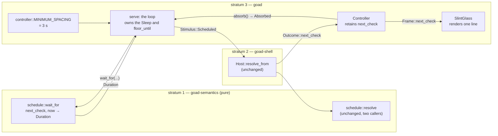

# Design — Slice 003: Scheduling — the timer that turns a resolved instant into an evaluation

<!-- The *current* design, not its history. Revision chronology, review
     findings, and dispositions live in `design-log.md`. -->

## 1. Design problem

goad resolves a next check on every exchange and then throws it away. `Host`
computes it, `Outcome` carries it, `receive` puts it in `Received`, and
`Controller::absorb` destructures it into `_` (`controller.rs:140-143`). Nothing
waits for it. The host asks its backend a question at process start and when a
person picks *Check now*, and at no other moment.

This slice adds the one wire that is missing: a wait, inside `serve`, that
turns a resolved instant into an `evaluate`. Everything the wait needs already
exists — the instant, the clock, the loop, the cancellation signal, the
diagnostic surface. What the design has to settle is *where the waiting
happens*, *what bounds it*, and *how behaviour over real time is asserted
without a flaky test*.

**The boundary.** This design owns the wait, the pure arithmetic behind it, the
third stimulus, and one line on the diagnostic surface. It does not own how a
next check is *resolved* — that is `schedule::resolve`, called from exactly
two sites, both inside `Host`, and this slice adds no third. It does not own
persistence, retry, event ingress, or calendar-aware scheduling.

## 2. Current state

`research.md` is the evidence; this section names only what the design leans
on, and every row below is verified at its cited site.

| fact | site |
|---|---|
| Two `schedule::resolve` **call** sites, both in `Host`: the seed at `host.rs:128`, and the one inside `resolve_from` (the function spans `:258-265`; the call is `:259`); `resolve_from`'s two callers both write what they report | `host.rs:128`, `:259`, called from `:228` and `:289` |
| Three further mentions of the token `schedule::resolve` are doc comments, which `scan::code_of` strips before matching | `host.rs:124`, `state.rs:41`, `config.rs:25` |
| `grep -rn "resolve" crates/goad/src` returns **3** lines: two test function names inside `wire.rs`'s inline test module, and one doc comment | `wire.rs:208`, `:215`, `controller.rs:255` |
| Cut at the file's own `#[cfg(test)]` and passed through `code_of`, `crates/goad/src` has **0** production lines naming `resolve`, over **12** `.rs` files — run, not assumed (F-17) | `wire.rs:185` is the cutoff that excludes both test names |
| Same method over `crates/goad-shell/src`: **2** production lines name `schedule::resolve`, both in `host.rs`, over **8** `.rs` files | `host.rs:128`, `:259` |
| `scan::Scan` strips comments and matches an identifier by word, and fails a walk that inspected nothing — but it has **no** `#[cfg(test)]` cutoff: it excludes directories by name and reads every line of every file it visits | `scan.rs:127-133`, `:175-196`, `:225-234` |
| `structure.rs` already holds the machinery that does cut at `#[cfg(test)]` — `production_lines` and `occurrences_of`, over a recursive `.rs` walk with its own vacuity guard | `structure.rs:60-86`, `:97-125` |
| A `tokio` deadline further out than `MAX_SAFE_MILLIS_DURATION` (roughly two years) is clamped, not overflowed | tokio 1.53.1 `runtime/time/source.rs:28-29` |
| `resolve`'s three arms; arm one returns a backend instruction verbatim, past or future | `schedule.rs:221-236`, prose at `:196-201` |
| `Outcome::next_check` is always a concrete instant, failures included | `host.rs:76` |
| `receive` is the only place an `Outcome` is destructured | `reception.rs:53-88` |
| `absorb` drops `next_check` today, naming this slice in the comment | `controller.rs:140-143` |
| `serve` is one loop, two `biased` `select!`s, cancellation first | `controller.rs:298-397` |
| The command channel is capacity 1 and its producers `try_send` | `main.rs:72`, `wire.rs:122-129` |
| The clock is a `fn` pointer, and `stamp` maps its failure to `Refused::NoClock` | `clock.rs:16`, `controller.rs:249-253` |
| `Stimulus` is two variants, emitted as `event.kind` with `source: "host"` | `wire.rs:37-67` |
| The seeded resolved check has no accessor out of `Host` | `host.rs:127-135`, `state.rs:52` |
| The glass writes the diagnostic surface as a list of strings, every present | `glass.rs:92-100` |
| `Diagnostics` is built only by `of` and `refused`, and carries a fault bit | `diagnostics.rs:64-70`, `:94`, `:140` |
| The cheap tier runs under `init_no_event_loop()`, where Slint timers do not run | `wiring.rs:22`, and the backend's own doc comment |
| `until(bound, predicate)` is the established shape for observing over time | `wiring.rs:135-148` |
| The event-loop tier is one `#[test]` per target, because its init is once per process | `closing.rs:31-35` |
| `tokio::time` is already available; `test-util` is not | `Cargo.toml:36-37`, `crates/goad/Cargo.toml:22` |
| `parse_span` reads `"100ms"` as 100 milliseconds | jiff 0.2.35 `fmt/friendly/parser_label.rs:79` |
| `std::time::Duration` is deliberately permitted in stratum 1 | `purity.rs:17-27` |

## 3. Forces & constraints

**SPEC-001 binds at one remove.** R-26 and R-27 mean the timer is always handed
a concrete instant and never has to represent "no schedule". R-28 means it may
be handed one in the past. R-29 means a failure hands it a correct instant with
no help from the timer. R-45 means no backend failure may leave the host unable
to invoke the backend again. R-48 means whatever the wait is, cancellation must
still drop the exchange. §2 puts the timer out of scope and names the seam:
*"it consumes [a resolved instant] and calls `evaluate`."*

**ADR-001 forbids a clock in stratum 1** and ADR-003 makes the manifest
allowlist and the purity scan the instruments. A `std::time::Duration` is a
quantity, not a clock, and stays permitted (`purity.rs:17-27`). None of the four
instruments sees a *policy constant* placed in stratum 1, so where the floor
lives is held by argument rather than by an instrument (D-14).

**The channel is the wrong road.** Capacity 1, `try_send`, a full channel
reported as a UI notice. A person losing a duplicate click and being told so is
acceptable; a scheduled check evaporating because a click was in flight is a
defect with no symptom. The wait is a `select!` arm, not a `Command` producer.

**The cheap tier has no Slint event loop.** `init_no_event_loop()`'s own
documentation says timers do not work under it. Any timer facility that is
Slint's is unassertable in the tier that holds most of the assertions.

**POL-001 forbids weakening the gate**, which includes making a timing test
conditional or `#[ignore]`d, and forbids a test whose passing depends on
machine load.

**The residual hazard nothing prevents today.** A backend that returns a past
`next_check` on every response drives an exchange loop bounded only by how long
an invocation takes (`research.md` Thread 4, H-1).

## 4. Guiding principles

**P-1 — The timer computes nothing about *when*, only about *how long*.** The
instant is given. The only arithmetic the timer performs is the difference
between that instant and a `now` it already has. There is no second resolution
site, and `schedule::resolve` gains no caller.

**P-2 — The floor bounds the host, never the backend.** What is stored and
reported is what the backend sent (R-28). What is spaced is the host's own
firing. These are different facts and the design keeps them in different
sentences.

**P-2a — The floor is anchored to the thing it bounds.** It is measured from
the previous *scheduled firing*, on the same monotonic clock the deadline
already uses, and nothing that happens in between clears it. It therefore makes
no claim about what other stimuli are or where they come from, which is what
lets a later slice add a stimulus without reopening it (D-3, F-2).

**P-3 — Prove it where it will run, assert it where it is cheap.** The pure
arithmetic is proved exhaustively at zero cost in stratum 1; the loop's
behaviour is proved with real waits in the tens of milliseconds; the topology
is proved once, in the arrangement production uses.

## 5. Proposed design

### 5.1 System model

Three parts: one new pure function, one new stimulus variant, one new host
constant, and one new field carried in two places.



Stratum 2 is untouched. `Host` gains no accessor, no field and no method
(D-4, D-5).

### 5.2 Interfaces & contracts

**Stratum 1 — the arithmetic, and only the arithmetic.** In
`crates/goad-semantics/src/schedule.rs`, beside `resolve`, under the module's
existing `#![deny(clippy::arithmetic_side_effects)]`:

```rust
/// How long to wait for `next_check`, given the instant the request carried.
///
/// `max(next_check - now, 0)`. Total: a `next_check` at or before `now`
/// yields zero rather than underflowing (R-28 admits a past instruction).
pub fn wait_for(next_check: Timestamp, now: Timestamp) -> std::time::Duration {
  let remaining = next_check.instant().duration_since(now.instant());
  std::time::Duration::try_from(remaining).unwrap_or(std::time::Duration::ZERO)
}
```

`duration_since` returns a `SignedDuration` and cannot overflow across jiff's
representable range (jiff 0.2.35 `timestamp.rs:1919`). No `+` or `-` operator
appears, so the module's arithmetic deny is untroubled. The `unwrap_or` is the
total fallback for a negative `SignedDuration`, which is exactly the elapsed
case and the only way this conversion can fail.

**The floor takes no argument here** (D-14, F-12). It is not a parameter of
`wait_for` and not a constant of stratum 1: it is a bound on *firing*, applied
by the loop that fires, against a monotonic instant stratum 1 cannot name. What
stratum 1 keeps is a difference between two instants — a quantity with no
policy in it.

**Stratum 3 — the floor.** In `crates/goad/src/controller.rs`, beside the loop
that applies it:

```rust
/// The host's own floor on how often it evaluates of its own accord (D-2).
/// Not configurable, not visible to a backend, and never applied to anything
/// a person asked for.
const MINIMUM_SPACING: std::time::Duration = std::time::Duration::from_secs(3);
```

**Stratum 3 — the stimulus.** `crates/goad/src/wire.rs`:

```rust
pub enum Stimulus { Startup, Requested, Scheduled }
// kind(): "startup" | "requested" | "scheduled"
```

`Stimulus::event` is unchanged: `source` stays `"host"` for all three. The wire
form of a scheduled evaluation is therefore

```json
{ "protocol": 1, "type": "evaluate", "now": "2026-09-07T04:34:14Z",
  "event": { "source": "host", "kind": "scheduled",
             "timestamp": "2026-09-07T04:34:14Z", "data": null } }
```

SPEC-001 §6.1's illustration uses `"source": "timer"`, which no host build has
ever emitted; brief §8.1 illustrates `"source": "scheduler", "kind": "poll"`.
The spec is the contract, its `"scheduled"` is adopted, and its source is
corrected to what the host emits (`canon-delta.md` CD-2). Because a backend can
only branch on strings the contract fixes, the three kinds become normative
(CD-1, R-56).

**Stratum 3 — the retained instant.** `crates/goad/src/controller.rs`:

```rust
pub struct Controller { shown, diagnostics, focus, engaged, next_check: Option<Timestamp> }
pub struct Frame<'a> { surface, shown, diagnostics, busy, next_check: Option<Timestamp> }

/// What one folded exchange tells the loop. `next_check` is not an `Option`:
/// `Outcome::next_check` is a concrete instant on every outcome, failures
/// included (`host.rs:76`), so an exchange that completed always resolved one.
pub struct Absorbed { pub shift: Shift, pub next_check: Timestamp }

impl Controller { pub fn absorb(&mut self, exchanged: Exchanged, outcome: Outcome) -> Absorbed }
```

`absorb` stops discarding `next_check`: it stores it for `frame()` and returns
it for the loop. That is the whole of the seam the comment at
`controller.rs:140-143` names.

**The loop never unwraps** (D-15, F-4). `Controller.next_check` stays an
`Option` because before the first outcome there genuinely is no instant in
stratum 3, and `frame()` is the only reader of the field. The loop reads the
*return value* instead, which is total by construction, so no `expect` appears
in production code and the workspace's `expect_used = "deny"`
(`Cargo.toml:137`) is satisfied without a suppression. There is no
`Controller::next_check()` accessor: it would exist only to be unwrapped.

**Stratum 3 — the request's instant.** `Pending` gains one accessor beside the
one it has:

```rust
impl Pending { fn now(&self) -> Timestamp }   // beside `exchanged()`
```

The re-arm computes the wait from the `now` the request carried (D-11), and
that value is moved into `Pending` and consumed with it (`controller.rs:335-380`).
`Timestamp` is `Copy` (`canonical.rs:103`), so the loop binds it beside
`exchanged` — `let requested_at = pending.now();` — exactly as it already binds
`let exchanged = pending.exchanged();` (F-14).

**Stratum 3 — the sentence.** `crates/goad/src/diagnostics.rs`, where every
user-visible string in this renderer lives:

```rust
pub fn next_check_line(at: Timestamp) -> String
// "next check (instructed): 2026-09-07T04:34:14Z"
```

Second precision, via `jiff::Timestamp::round(jiff::Unit::Second)` falling back
to the unrounded instant if rounding errors at the edge of representable time.
`glass.rs` appends the line to the model it already builds from
`Diagnostics::lines()`, after the diagnostic lines and before nothing.

**The line says which of the two instants it is** (D-9, F-10). What it renders
is the resolved next check the host *holds and reports* — the value R-28
governs. What the host fires on is the monotonic deadline in the loop, and the
design names three states in which the two differ: the floor raises the
deadline above the instruction; a refused scheduled fire re-arms the deadline
and leaves the instruction alone (E-2); and a suspend detaches the deadline
from wall time (E-4). The deadline itself is not renderable — it is a
`tokio::time::Instant`, a monotonic value with no wall-clock meaning — so the
repair is the parenthetical, not a second field on `Frame`. Reporting lateness
in wall-clock terms would need a second clock read per frame and a conversion
that can fail, which is a new failure path in the renderer; it is recorded as
draft SPEC-002 OQ-3 rather than taken here.

### 5.3 Data, state & ownership

Four facts, four owners, none duplicated. The resolved next check appears
twice because it has two consumers with different lifetimes — the renderer
keeps it until the next exchange, the loop uses it once and discards it — and
`absorb` is the single write that serves both.

| fact | owner | written by | read by |
|---|---|---|---|
| the resolved next check, for display | `Controller.next_check` | `absorb`, from `Received` | `frame()` (to show) |
| the resolved next check, for arming | `Absorbed.next_check`, returned once | `absorb` | `serve`, in the same expression that receives it |
| the pending deadline | a pinned `tokio::time::Sleep`, local to `serve` | `serve`, on every re-arm | `serve`'s `select!` |
| the earliest permitted scheduled firing | `floor_until: tokio::time::Instant`, local to `serve` | `serve`, at exactly one site: the moment the timer arm wins | `serve`, at every re-arm |

The instant is renderer state because the renderer shows it; the deadline and
the floor anchor are loop state because only the loop acts on them. There is no
"a check is pending" flag beside the instant — the sleep is *always* armed, so
the flag would have exactly one value.

`floor_until` replaces the `previous_was_scheduled` bit an earlier draft carried
(F-6). A bit had two plausible write sites with different behaviour, and the
design settled the floor in prose while leaving the mechanism to the phase. An
instant has one: **the timer arm sets `floor_until = Instant::now() +
MINIMUM_SPACING` the moment it wins the `select!`**, before stamping, so a
scheduled firing that is then refused still counts as a firing that happened.
Nothing else writes it, and nothing clears it.

`Received::next_check` is unchanged, and `receive` remains the only place an
`Outcome` is destructured (slice 002 D16).

### 5.4 Lifecycle & dynamics

**The loop.** One new arm in the first `select!`, one anchor, and one re-arm
site per exit from an iteration.

```mermaid
stateDiagram-v2
    [*] --> Armed: sleep armed at MINIMUM_SPACING; floor_until = start (D-5)
    Armed --> Idle: present(frame)
    Idle --> Stopped: cancel.stopped()
    Idle --> Closed: commands.recv() → None
    Idle --> Dispatch: commands.recv() → Some(command)
    Idle --> Fired: sleep elapses — floor_until = now_mono + MINIMUM_SPACING
    Fired --> Dispatch: Evaluate(Scheduled)
    Dispatch --> Refused: stamp / answer refuses
    Refused --> RearmFloor: the refused command came from the timer arm
    Refused --> Armed: any other refusal — deadline untouched
    Dispatch --> InFlight: engage(); present(busy)
    InFlight --> Stopped: cancel.stopped() — the call is DROPPED
    InFlight --> Absorbed: outcome
    Absorbed --> Rearm: absorb() stores and returns next_check
    Rearm --> Armed: reset(max(now_mono + wait_for(next_check, requested_at), floor_until))
    RearmFloor --> Armed: reset(floor_until)
    Stopped --> [*]
    Closed --> [*]
```

Written out, the arm, the anchor and the two re-arms:

```rust
let started = tokio::time::Instant::now();
let mut sleep = Box::pin(tokio::time::sleep_until(started + MINIMUM_SPACING)); // always armed
let mut floor_until = started;  // nothing scheduled has fired yet, so nothing is floored

loop {
  glass.present(controller.frame());
  let fired = select! { biased;
    () = cancel.stopped()      => break Ending::Stopped,
    received = commands.recv() => match received {
      None          => break Ending::Closed,
      Some(command) => Fired::Command(command),
    },
    () = &mut sleep            => {
      floor_until = tokio::time::Instant::now() + MINIMUM_SPACING;   // the one write site
      Fired::Scheduled
    }
  };
  // …build `pending` exactly as today; the scheduled arm builds
  //   Command::Evaluate(Stimulus::Scheduled) and goes through the same `stamp`.
  // On a refusal: refuse, then re-arm iff this iteration came from the timer
  //   arm — `sleep.as_mut().reset(floor_until)` — and continue. Every other
  //   refusal leaves the deadline exactly as it was.
  …
  let requested_at = pending.now();
  let exchanged = pending.exchanged();
  …
  select! { biased;
    () = cancel.stopped() => break Ending::Stopped,
    outcome = call        => {
      let absorbed = controller.absorb(exchanged, outcome);
      let wait = wait_for(absorbed.next_check, requested_at);
      let deadline = std::cmp::max(tokio::time::Instant::now() + wait, floor_until);
      sleep.as_mut().reset(deadline);
    },
  }
}
```

Five properties of that shape, each load-bearing:

1. **`biased` order is cancel, commands, timer.** Cancellation first is
   unchanged (AC-7). A person's queued action is served before a scheduled
   check when both are ready; starvation is impossible because the channel
   holds one and is fed by a human. An elapsed deadline that loses the race is
   not silently dropped: it survives any arm that does not re-arm — the two
   diagnostics arms, which `continue` without touching the sleep
   (`controller.rs:326-333`) — and is *superseded*, not lost, by the two arms
   that do reach `absorb` and re-arm from a freshly resolved instant (F-5).
2. **The timer arm exists only in the *first* `select!`.** A scheduled instant
   arriving mid-exchange does not preempt the exchange; the outcome re-arms
   from a fresher instant anyway. At most one exchange is ever in flight, which
   is what R-31's single outstanding interaction already assumes.
3. **The wait is computed from the `now` the request carried**, not from a
   fresh clock read. That `now` is the very instant `Host` resolved
   `next_check` against, so the two agree by construction; it adds no clock
   read to the loop, adds no failure path, and errs by waiting *longer* than
   instructed, never shorter. The size of the error depends on which kind of
   instruction it was (F-16). For an **absolute** instant the firing lands one
   exchange duration after the instructed instant and the next instruction
   re-anchors, so the error does not accumulate. For a **relative** cadence —
   `resolve`'s third arm, `request_now + default_poll` — there is no anchor to
   return to, so the realised period is `default_poll + exchange` on every
   cycle and lateness against an ideal cadence grows without bound. At the
   2.9 ms exchange S-1 measured against a default poll in minutes that is
   drift of about one part in twenty thousand, and no absolute instruction
   drifts at all.
4. **The sleep is always armed.** There is no disarmed state and no `Option`
   around it, which is what makes the startup path total: if the startup
   evaluation is never dispatched or is refused, the initial arm fires at
   `MINIMUM_SPACING` and the host recovers by itself.
5. **The floor is one instant, not a special case.** `floor_until` is written
   once, where the timer arm wins, and read at every re-arm through a `max`.
   A refused scheduled fire therefore re-arms at `floor_until` — three seconds
   after the firing that was refused — by the same rule that spaces a
   successful one, rather than by a rule of its own. It is still the only
   refusal path that re-arms at all, because it is the only one whose deadline
   has already elapsed and would otherwise spin.

**The floor rule, stated exactly.**

> The host will not **begin a scheduled evaluation** less than
> `MINIMUM_SPACING` after the scheduled evaluation that preceded it, whatever
> else the host did in between. The floor applies to nothing else: an
> evaluation a person asked for, the startup evaluation, and a response are
> never delayed by it.

Four consequences, and one thing the rule deliberately does not say.

A backend returning a past `next_check` on every response can cause **at most
one** unfloored immediate firing — the first, before any scheduled firing has
happened — and every scheduled firing after that is at least three seconds
apart, for as long as the process runs. A person's own actions are never
delayed. The floor bounds self-driven evaluation regardless of what produced
the instant, so a `default_poll` of 100 ms is honoured for the first scheduled
firing and floored thereafter: the hazard is the *rate*, not the source. And a
person acting does **not** clear the floor — a click three seconds into a
scheduled cadence gets its own evaluation immediately, and the scheduled
firing that follows is still spaced from the last scheduled firing.

What the rule does not say is anything about the other stimuli. It makes no
claim that they are human, machine, rate-limited or rare; it simply does not
apply to them. That is deliberate (F-2). An earlier draft spaced a scheduled
firing only when *its predecessor* was itself scheduled, which is equivalent
here but rests on a premise — that every non-scheduled stimulus is a person —
that this slice's own Non-goals retire: slice 004 adds event ingress, and an
event source is not rate-limited by a person. Under the rule as now written,
an event arriving at machine rate cannot clear the floor, because nothing
clears it. **What the floor still does not bound is evaluation driven by that
new stimulus itself**, and slice 004 owns that question: this rule bounds the
host's own due-check firings and says so.

**Why an anchored instant and not a wall-clock one.** The alternative the
earlier draft rejected was a *wall-clock* retained instant, which exposes the
floor to a backwards clock jump and could stall the host for the size of the
jump. `floor_until` is a `tokio::time::Instant` — the same monotonic clock the
deadline is already expressed in — so there is no wall-clock exposure, no
second time source, and no extra clock read. It costs one instant of loop
state where the bit cost one `bool`.

### 5.5 Invariants, assumptions & edge cases

**I-1 — Two resolution sites, both in `Host`; none in stratum 3.**
`goad_semantics::schedule::resolve` is called from `Host::new`'s seeding
(`host.rs:128`) and from `Host::resolve_from` (`host.rs:259`), and nowhere
else. Research's Thread 2 Fact 1 said one; it is two. The token appears three
further times in the tree, all in doc comments (`host.rs:124`, `state.rs:41`,
`config.rs:25`), and `schedule.rs`'s own `#[cfg(test)]` module calls a bare
`resolve(` seven times; both sets are out of the instrument's reach by
construction, not by exception — comments through `code_of`, test modules
through the `#[cfg(test)]` cutoff. The timer's whole input is
`Outcome::next_check`. Held by a scan, not by review (§9, AC-6).

**I-1a — The instrument does not depend on how the call is spelled.** Stratum 3
imports from `goad_semantics::schedule` for the first time in this slice, so
`use goad_semantics::schedule::wait_for;` becomes the natural line and would
grow a brace group at the first second item; adding `resolve` to it gives
stratum 3 a bare `resolve(…)` call and no line containing the token
`schedule::resolve` (F-3). The stratum 3 half of AC-6 therefore forbids the
**identifier**, not the path: an item cannot be called without being named,
either at the call or in the `use`.

**It is scoped to production code, and that is not optional** (F-17). Stratum 3
already has two test function names — `stopped_resolves_immediately_when_
already_tripped` and `stopped_does_not_resolve_until_stop_is_called`
(`wire.rs:208`, `:215`) — that a whole-file identifier scan matches, the first
through the plural strip and the second through the split on `_`. They sit
inside `wire.rs`'s inline `#[cfg(test)]` module (`wire.rs:185`), so cutting
there removes them and leaves the property AC-6 actually states, which is about
production code. Renaming them was the other option and is rejected: it would
buy a green gate at the cost of an instrument forbidding an ordinary English
word in test code, where forbidding it holds nothing.

Two residues, both stated rather than closed. A re-export under another name
from stratum 2 would let stratum 3 call `resolve` without naming it; that needs
stratum 2 complicity, and stratum 2 is declared unchanged by this slice. And
the instrument forbids the *segment*, so a stratum 3 production identifier
containing `resolve` — `resolve_from`, `resolve_at`, `resolves` — fails too.
That is intended, not a false positive: stratum 3 has no business resolving
anything, and a name saying it does is worth a failure.

**I-2 — The sleep is always armed.** Every exit from a loop iteration either
breaks, or re-arms, or leaves a future deadline standing.

**I-3 — The floor never shortens a wait.** The re-arm is
`max(now_mono + wait, floor_until)`, and a maximum can only lengthen. A backend
asking for an hour gets an hour.

**A-1 — Slint's executor completes tokio timers under the `EnterGuard`.**
Measured, not reasoned: spike S-1, `research.md` Thread 5. This is the
assumption the whole design rests on and it is the one that was actually run.

*What S-1 substituted* (F-8). The spike, and the AC-10 target that repeats its
shape, run under `i_slint_backend_testing`'s `TestingBackend`, initialised by
`init_integration_test_with_system_time()` (`timer-probe.local.rs:36`;
`i-slint-backend-testing-1.17.1/lib.rs:67-80`, options `mock_time: false,
threading: true`). Production runs the platform `start` installs. Every other
component of the topology is production's — the multi-thread runtime, the
`EnterGuard`, `slint::spawn_local`, a real `PromptWindow` and `Tray`, the real
`ProcessBackend` against a real child. **What remains unproven is one
component:** that the production platform's own event loop polls a
`spawn_local` future the way the testing platform does. No headless test can
close that, so it is stated rather than searched for.

*What S-1 did not run* (F-15). The spike measured `reset` to a future deadline
on a fresh sleep (B1) and on an already-fired sleep (B2), and an elapsed
deadline on a freshly constructed `sleep_until` (D). The loop's AC-4 path is
the fourth combination: `reset` to an **already-elapsed** deadline on the
long-lived pinned sleep. B2 and D bracket it, and AC-4's own `serve` test is
the measurement — if tokio failed to complete that reset, that test would hang
and fail its bound rather than pass quietly. It is closed by the slice's own
tests, not by the spike.

**A-2 — A `SignedDuration` difference between two representable instants does
not overflow.** jiff's `SignedDuration` spans ~292 billion years against a
`Timestamp` range of ~±9999 years.

**A-3 — The initial arm never fires in a healthy process.** The loop is serial
and `main.rs:91` enqueues the startup evaluation before the loop starts, so the
arm is superseded within milliseconds of the first outcome. It can only elapse
if the loop sits idle at the top for three seconds, which means no startup
evaluation was dispatched. The initial arm is a self-healing default, not a
floor: `floor_until` starts at the loop's own start instant, already in the
past, so the first scheduled firing after startup is not spaced (which is what
lets AC-1 observe a 100 ms `default_poll`).

**E-1 — A past instant.** `wait_for` yields zero, and the re-arm floors that
at `floor_until`. **Each resolved instant fires at most once**: firing does not
re-fire an instant on account of its having elapsed, because every firing is
followed by a resolution that replaces the retained value.

What happens *next* depends on what the backend then instructs, and the design
states both cases rather than the common one (F-1).

- **The instruction was a one-off.** The following resolution has no valid
  `incoming`, the retained value is at or before `now` so it does not stand,
  and the third arm applies `now + default_poll` (`schedule.rs:196-201`,
  `:221-236`). Cadence resumes.
- **The backend instructs the past on every response.** `resolve`'s first arm
  returns a valid `incoming` verbatim, so the consuming arm is never reached:
  the retained value is *replaced*, not consumed, on every exchange. Cadence
  never resumes, and the host fires once per `MINIMUM_SPACING` for as long as
  the backend keeps doing it. **The floor is the only thing that bounds this**
  — it is not belt-and-braces, it is the whole answer to `research.md`
  Thread 4's H-1.

The same partial claim is written into the tree: `schedule.rs:198-201`'s doc
comment reads *"a backend-supplied past instant (R-28) is therefore stored as
given, fires once, and then falls back to cadence"*, which is the one-off case
stated as the general one. The plan corrects that comment in the phase that
adds `wait_for` beside it; it is the same defect as F-1, in the place a future
reader is most likely to meet it.

**E-2 — A broken clock.** `stamp` fails, the refusal is reported, and the
retained instant in the controller is untouched. If the failure was on a
scheduled fire, `floor_until` was already advanced by the timer arm and the
deadline re-arms to it, so the host retries every three seconds and recovers
the moment the clock does. While it is broken the diagnostic line shows an
instant that has already passed; that is the instruction, correctly reported,
and the line says so (§5.2).

**E-3 — Cancellation while waiting.** The cancel arm is first and level-held;
`Cancel::stopped()` completes immediately if already tripped. Dropping the
future drops the pinned sleep with it, and a `Sleep` holds no task and no
handle (R-48).

**E-4 — Suspend.** The deadline is a `tokio::time::Instant`, which is
monotonic; on Linux `CLOCK_MONOTONIC` does not advance across a suspend. A host
suspended for six hours with a thirty-minute wait pending fires thirty minutes
of *awake* time after arming, not on wake. This is a known limitation of D-8's
answer to OQ-5, recorded as R3 (§8) and as a follow-up, not a defect against
any acceptance criterion in this slice.

**E-5 — A `default_poll` below the floor.** Config still accepts it — it is a
valid duration and refusing it would invent a rule R-21's grammar does not
carry — and the floor applies to the firing anyway. The configured value is
honoured for the first scheduled firing of the process, and floored from then
on. `default_poll`'s own doc comment says so, which is the only edit this slice
makes to `config.rs`.

**E-6 — An instruction further out than a timer can hold.** `wait_for` is total
across jiff's range, so an instruction in the year 9999 converts to a
`std::time::Duration` of roughly eight thousand years without failing. tokio
clamps a deadline at `MAX_SAFE_MILLIS_DURATION`, roughly two years
(`runtime/time/source.rs:28-29`), so such a sleep fires early rather than
overflowing or hanging. An early firing resolves the schedule again and re-arms
from the same instruction, so the host idles at roughly two-year intervals
instead of one very long one. Named because it is one more place a claim about
the common path could have been stated as a claim about every path; not
mitigated, because there is nothing to mitigate.

## 6. Open questions

All nine are closed. OQ-1 to OQ-4 by the user, OQ-5 to OQ-9 by the agent under
the standing grant recorded in `design-log.md`. Their answers are D-1 to D-13
below. D-14 to D-16 answer no open question: they are decisions taken in
response to adversarial review round 1, dispositioned under the same grant and
recorded in `design-log.md` citing the finding ids. Nothing remains open at
design acceptance.

## 7. Decisions, rationale & alternatives

| id | decision | rejected | why | log |
|---|---|---|---|---|
| D-1 | Nothing persists. SPEC-001 OQ-3 stays shut. | Persisting the resolved check | It would reopen R-32's staleness across restarts for a value that is cheap to re-seed | OQ-1 |
| D-2 | The floor is **3 seconds**, `controller::MINIMUM_SPACING` (D-14 places it) | 1 s (too close to a hot loop to be a bound); 30 s (refuses cadences the protocol plainly admits) | The smallest number that is unambiguously "a few seconds"; bounds self-driven work at 20 invocations a minute; leaves every plausible configured cadence untouched | OQ-2 |
| D-3 | The floor spaces **a scheduled firing from the previous scheduled firing**, anchored to one monotonic instant (`floor_until`) that nothing clears | Spacing every evaluation, including a person's; spacing only when the *predecessor* was scheduled (a `bool`); measuring from a retained **wall-clock** instant | A person's own action must never be delayed. The predecessor bit is equivalent today but rests on the premise that every other stimulus is human, which slice 004's event ingress retires (F-2); the anchor makes no claim about other stimuli at all. A wall-clock anchor would expose the floor to a backwards jump; a monotonic one is the clock the deadline already uses, and it gives the floor exactly one write site (F-6) | OQ-2, F-2 |
| D-4 | The waiting lives in stratum 3, inside `serve`; the arithmetic in stratum 1 | A stratum 2 waiter | A `Host` that waits owns a runtime, needs the cancel signal, and makes `evaluate` reentrant against R-31 | OQ-6 |
| D-5 | The sleep is always armed, initially at `MINIMUM_SPACING` — as a self-healing default, not as a floor: `floor_until` starts in the past | An accessor on `Host`; recomputing `now + default_poll` in stratum 3 | The accessor exists to be read once and superseded milliseconds later; recomputation restates a stratum 1 rule. Always-armed makes the broken-clock startup self-healing, and starting the anchor in the past keeps the first scheduled firing unfloored | OQ-9 |
| D-6 | `tokio::time::Sleep`, pinned, re-armed with `reset` | `slint::Timer` | Slint timers do not run under `init_no_event_loop()`, which is the cheap tier's harness; and it would be a second time source | OQ-7 |
| D-7 | No mock clock, in either tier | tokio `test-util`; Slint mock time | tokio's auto-advance fires the transport's own timeout instantly against a real child; Slint's clock cannot advance tokio's timers | OQ-8 |
| D-8 | A past instant fires, and does not re-fire on account of having elapsed. Whether cadence resumes is the backend's to determine (E-1); the minimum spacing is what bounds the host when it does not. No wake stimulus, no jump detection | A wake stimulus; discontinuity detection; bounded slices | Keeps one resolution site and adds no state. The monotonic-suspend consequence is stated as R3 rather than hidden | OQ-5, F-1 |
| D-9 | One line on the diagnostic surface, outside `Diagnostics`, naming what it renders: the instruction, not the deadline | A field inside `Diagnostics`; a tray countdown; a second `Frame` field carrying the deadline | `Diagnostics` is an exchange's product and carries a fault bit; a standing schedule is neither. The deadline is a monotonic `tokio::time::Instant` with no wall-clock rendering, so showing it would need a second clock read per frame; the honest cheap repair is for the line to say which instant it is (F-10) | OQ-3, F-10 |
| D-10 | `Stimulus::Scheduled`, `kind` = `"scheduled"`, `source` stays `"host"` | `"poll"` with source `"scheduler"` (brief §8.1); source `"timer"` (SPEC-001 §6.1) | The spec is the contract and already writes `"scheduled"`; the host has always emitted `"host"` as the source, and the spec's example is what is wrong | OQ-4 |
| D-11 | The wait is computed from the `now` the request carried | A fresh clock read after the exchange | No added clock read, no added failure path, and the error is always in the safe direction — later, never sooner | OQ-8 |
| D-12 | AC-10 gets its own `[[test]]` target under `init_integration_test_with_system_time()` | A second `#[test]` in `event_loop` | The testing backend initialises once per process, which is why that target already holds exactly one test | OQ-8 |
| D-13 | SPEC-001 takes a delta (the wire); the timer's own rules become a draft SPEC-002 | Folding everything into SPEC-001 | SPEC-001's subject is a wire contract a second implementation must satisfy; §2's scope line is correct as written | canon shape |
| D-14 | `MINIMUM_SPACING` lives in stratum 3 beside the loop that applies it; `wait_for` takes no floor and stratum 1 holds arithmetic only | The constant in `goad-semantics::schedule`, passed to `wait_for` | Three seconds is a host operational budget, read only by stratum 3, and its siblings (`default_poll`, the backend timeout, the transport's cleanup budget) all live above stratum 1. None of ADR-001's four instruments sees a policy constant placed downward, so placement is held by argument, not by scan (F-12). D-3's anchor makes it forced as well as tidy: the floor is now a `max` against a monotonic instant, a type stratum 1 cannot name | F-12 |
| D-15 | `absorb` returns `Absorbed { shift, next_check }`; the loop reads the total return value, never the `Option` field | `.expect` at the re-arm; an `Option`-returning accessor; a `Controller` method owning the re-arm | `expect_used = "deny"` is workspace-wide and carved out for tests only (`clippy.toml:20-23`), and POL-001 forbids suppressing a lint to make a phase green. `Outcome::next_check` is concrete on every outcome (`host.rs:76`), so a completed exchange always has one — the totality is real, not asserted (F-4) | F-4 |
| D-16 | AC-6 is two instruments, both built on `structure.rs`'s production-code walk (cut at `#[cfg(test)]`, comments stripped): identifier-absence over stratum 3, and a count-by-file over stratum 2. No line numbers | One grep for the path `schedule::resolve` across the tree; a `scan::Scan` for the identifier; renaming the two stratum 3 test functions that trip it | A path grep is defeated by the brace-grouped import this slice makes natural, admits five sites rather than two, and pins lines that move (F-3). An item cannot be called without being named, so forbidding the identifier holds regardless of import style. `Scan` reads every line of every file and has no `#[cfg(test)]` cutoff, so it is red on the tree today (F-17); renaming the test functions would buy a green gate with an instrument that forbids an English word in test code | F-3, F-17 |

## 8. Risks & mitigations

| id | risk | likelihood / impact | mitigation | signal |
|---|---|---|---|---|
| R1 | A timing test becomes flaky under a loaded gate, which POL-001 calls a design defect | medium / high | Two kinds of assertion, and only one is load-sensitive. **Anti-spin** counts invocations inside a window far shorter than the floor: load can only reduce a count, so it cannot fail. **Liveness** through `until(bound, …)` panics when its deadline passes (`wiring.rs:141-146`), so load pushes it *towards* failure — it is one-sided in the wrong direction and is held by margin instead. §9's margin table states the expected time, the bound and the ratio for every timed assertion; the smallest is 19x, against a tier that already spawns real child processes under the same bounds | an intermittent failure in `just check` |
| R2 | The floor silently overrides a configured `default_poll` below 3 s | low / medium | Stated in `draft-spec.md` and in `default_poll`'s own doc comment (`crates/goad-shell/src/config.rs`, documentation only — the sole reason that file is in scope); the first scheduled firing of the process still honours the configured value | a user reports a cadence slower than configured |
| R3 | A suspend does not consume the wait, so a scheduled check is late by the suspend duration | medium / medium | Stated in §5.5 E-4 and carried as a follow-up; alternative (d) in OQ-5's log entry is the cheapest fix | a check that was due during sleep arrives long after wake |
| R4 | The always-armed sleep changes the behaviour of an existing test that idles longer than 3 s | low / low | The plan re-runs the full gate before and after; existing `serve` tests bound at 2 s and dispatch a command immediately | a previously green test in `renderer` gains an invocation |
| R5 | The scheduled arm's `Stimulus::Scheduled` reaches a backend that branches on `kind` and does not know the string | low / low | The three kinds become normative (R-56) and the example backend is unaffected: it does not branch on `kind` | a backend author reports an unrecognised kind |

## 9. Validation

Every acceptance criterion in `slice-003.md`, and where it is discharged.

| AC | discharged by | tier |
|---|---|---|
| AC-1 evaluates unprompted on the default poll | a `serve` test with `default_poll = "100ms"` and a backend returning no `next_check`; the invocation log shows a second invocation, unfloored because no scheduled firing has happened yet (`floor_until` starts in the past) | renderer |
| AC-2 `next_check` from either direction changes the wait | two `serve` tests: an instruction returned by an `evaluate`, and one returned by a `respond`, each observed as the next firing's timing | renderer |
| AC-3 a later valid instruction supersedes, both directions | earlier: a far instruction then a near one, the firing observed inside the liveness bound. Later: a near instruction (100 ms) then a far one (60 s), and **no** firing inside a 300 ms window — a window that must be *longer* than the superseded 100 ms deadline, because the whole content of the test is that that deadline did not survive being replaced. A shorter window would see no firing whether superseding worked or not (F-19). The margin table's *AC-3 later supersedes* row is this same test | renderer |
| AC-4 a past resolved instant fires once and does not re-fire on account of having elapsed; no underflow, no spin | `wait_for` unit tests for a past instant, an instant at `now`, and the edges of representable time, all asserting zero rather than an underflow; a `serve` test whose backend returns a past absolute instant on **every** response, asserting exactly two invocations (startup, then one unfloored scheduled firing) and that the count does not move inside a window well under the floor. That test is also the measurement A-1's residue names: a `reset` to an already-elapsed deadline on the long-lived pinned sleep | stratum 1 + renderer |
| AC-5 (revised) a failing backend is re-invoked unprompted, never faster than the floor | a `serve` test with a backend failing every invocation, asserting the second invocation arrives inside the liveness bound and the count then holds across the anti-spin window | renderer |
| AC-6 the timer never resolves a schedule | **two instruments in `crates/goad-boundary/tests/checks/`, both built on `structure.rs`'s machinery, neither pinned to a line number** (D-16, F-17). Not `scan::Scan`: it reads every line of every file it visits and has no `#[cfg(test)]` cutoff (`scan.rs:127-133`, `:175-196`), and both instruments need one. `structure.rs` already has it — `production_lines` cuts at the file's own `#[cfg(test)]` and passes each line through `code_of`, over a recursive `.rs` walk with its own vacuity guard (`structure.rs:60-86`, `:97-125`). **(a) Absence, over stratum 3:** no production line under `crates/goad/src` names the identifier `resolve`, matched as a word so that a brace-grouped `use` is caught as readily as a call. **Measured: 0 occurrences over 12 files.** **(b) Count, over stratum 2:** the path `schedule::resolve` occurs exactly twice in `crates/goad-shell/src`'s production code, both in `host.rs`. **Measured: 2 occurrences over 8 files, `host.rs:128` and `:259`.** Each instrument asserts its walk inspected a non-zero file count, so neither can pass vacuously. Residues in §5.5 I-1a | boundary |
| AC-7 a timer does not defeat cancellation | the existing cancellation tests, extended with a stop issued while the loop is waiting on the timer arm — a far `default_poll` puts the loop there, and `serve` must return inside `TIMEOUT`. Its failure mode is a hang rather than a late value, which is why it is in the margin table (F-20) | renderer |
| AC-8 a failure does not stop the clock | the AC-5 test is the same evidence, read for liveness rather than for rate | renderer |
| AC-9 (revised) a clock failure disturbs neither the retained instant nor the deadline, and does not spin | **a clock that succeeds once and then fails** (F-18), which is what reaches the criterion's scheduled half. An always-failing clock cannot: no exchange completes, so nothing re-arms, and the only armed deadline is the initial `started + MINIMUM_SPACING` three seconds out — the timer arm never wins inside any window the margin table can afford. Succeed-once traces as: the startup exchange completes and arms ~100 ms; the timer arm wins and advances `floor_until`; `stamp` refuses; the deadline re-arms to `floor_until`, three seconds out. So inside the existing 500 ms window the test asserts one `NoClock` refusal line, the retained instant unchanged, and the invocation count still at one. `Clock` is a `fn` pointer (`clock.rs:16`) and cannot capture, so the fixture is a top-level `fn` over a `static` counter, beside `wiring.rs:44`'s existing `stub_clock` | renderer |
| AC-10 proved in the arrangement it will run in, **minus one component** | a new `[[test]]` target: real window and tray, multi-thread runtime, `EnterGuard`, `init_integration_test_with_system_time()`, production `serve`, real backend script, a watcher task observing the second invocation and then stopping the loop. The one substitution is the Slint platform itself — the testing backend, not the platform `start` installs — and no headless test can close that. AC-10 therefore discharges slice 002's F-5 for every component except the platform, and A-1 says which (F-8) | event loop |
| AC-11 no domain vocabulary | the standing scan in `goad-boundary`; `schedule`, `check`, `poll`, `spacing` are host vocabulary | boundary |
| AC-12 `just check` exits 0, nothing weakened | the gate, unchanged, six commands | gate |

**The pure tier carries the proof, not the timing.** `wait_for`'s unit tests
cover: an instant far ahead; an instant exactly at `now`; an instant in the
past; and instants at both edges of representable time. None of them costs a
millisecond of wall time, and together they are what makes the loop tests able
to assert *that* a firing happened rather than *how long* it took. The floor is
no longer part of this function (D-14); it is a `max` against a monotonic
instant in the loop, and it is held by AC-4's and AC-5's anti-spin windows.

**The margins, stated rather than asserted** (F-7). Every timed assertion in
the slice — all eleven, AC-7's included (F-20) — with its expected time, its
bound and the ratio. Liveness rows are the load-sensitive ones: `until` fails
when its deadline passes, so the margin is what holds them. Anti-spin and
anti-fire rows cannot fail under load, because load can only reduce a count or
delay a firing; they fail only on a genuine spin or a genuine failure to
supersede.

| assertion | kind | expected | bound | margin | wall cost |
|---|---|---|---|---|---|
| AC-1 second invocation, `default_poll = 100ms` | liveness | ~105 ms | `until(2 s)` | 19x | ~0.1 s |
| AC-2 instruction from an `evaluate`, 100 ms | liveness | ~105 ms | `until(2 s)` | 19x | ~0.1 s |
| AC-2 instruction from a `respond`, 100 ms | liveness | ~105 ms | `until(2 s)` | 19x | ~0.1 s |
| AC-3 earlier supersedes: far, then 100 ms | liveness | ~105 ms | `until(2 s)` | 19x | ~0.1 s |
| AC-3 later supersedes: 100 ms, then 60 s | anti-fire | no firing | 300 ms window | **3x** the superseded 100 ms deadline | 0.3 s |
| AC-4 past instant every response | anti-spin | 2 invocations | 500 ms window | 6x under the floor | 0.5 s |
| AC-5 failing backend, second invocation | liveness | ~105 ms | `until(2 s)` | 19x | ~0.1 s |
| AC-5 failing backend, count holds | anti-spin | count unchanged | 500 ms window | 6x under the floor | 0.5 s |
| AC-7 stop while waiting on the timer arm | liveness | `serve` returns at once | `TIMEOUT`, 2 s (`wiring.rs:28`) | ~2000x | ~0 |
| AC-9 refusal after the succeed-once clock fails | liveness | ~105 ms | `until(2 s)` | 19x | ~0.1 s |
| AC-9 invocation count holds after that refusal | anti-spin | count unchanged | 500 ms window | 6x under the floor | 0.5 s |
| AC-10 second invocation under the event loop | liveness | ~105 ms | `until(2 s)` | 19x | ~0.1 s |

**AC-3's 3x is the ratio that matters, and it is the small one.** The window is
measured against the deadline the test proves was cancelled (100 ms), not
against the 60 s instruction that must not fire; 60 s ÷ 300 ms describes
nothing that could go wrong (F-19). 3x is load-safe in the direction that
counts, because load can only delay a firing and so only cause a false pass —
never a false failure.

The anti-spin and anti-fire windows are floors rather than ceilings, so they
are always paid: **about 1.8 s of unavoidable wall time**, plus roughly 0.7 s
of liveness waits that resolve as soon as the firing lands, against the 5.276 s
`just check` measured on the finished slice 002 tree (ADR-003 §Context). These
are estimates from the design's own numbers; the plan re-measures the gate
before and after, and a phase that finds the estimate badly wrong is a finding,
not a rounding error.

**The event-loop tier's shape.** The test body cannot poll while
`run_event_loop_until_quit` is running, so the observation happens inside a
second `slint::spawn_local` task that awaits `tokio::time::sleep` between
polls — the shape spike S-1 ran. S-1 also measured a real `Host::evaluate`
completing in 2.9 ms under that topology, which is the other half of slice
002's F-5.

## 10. Canon impact

- **`canon-delta.md` CD-1** — SPEC-001 §4, new requirement R-56: the host's
  event `source` and the three `kind` values it emits.
- **`canon-delta.md` CD-2** — SPEC-001 §6.1: the illustration's `"source":
  "timer"` corrected to `"host"`.
- **`canon-delta.md` CD-3** — SPEC-001 §2 Boundaries: one sentence pointing at
  SPEC-002 for what the timer does with the instant it consumes.
- **`draft-spec.md`** — SPEC-002, the host's scheduling behaviour: no
  re-resolution, fire-once-on-past, and the floor. Promoted at audit or
  abandoned in writing.
- **No change** to ADR-001, ADR-003 or POL-001 — and the floor constant is
  placed in stratum 3 (D-14) precisely so that no instrument has to be extended
  to hold ADR-001's spirit. No new gate command, no new workspace member, and
  no feature switched on in a dependency shared with stratum 1 — `tokio` is not
  one (POL-001's residue is untouched).
- **SPEC-001 OQ-3 stays shut** (D-1). That is a decision recorded, not an
  amendment.
