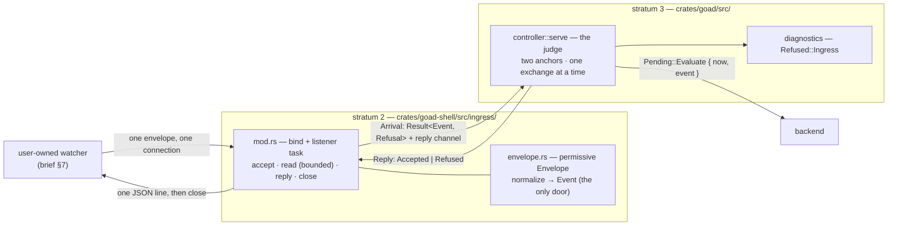
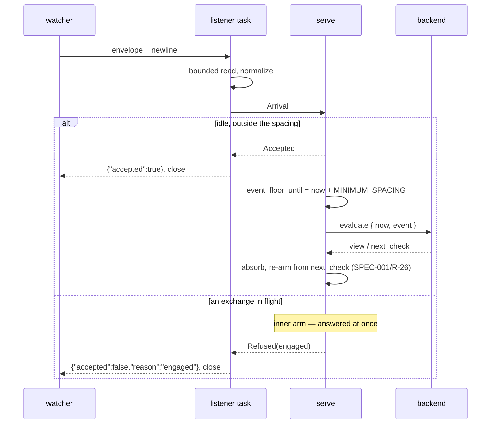

# Design — Slice 004: Event ingress

<!-- The *current* design, not its history. Revision chronology, review
     findings, and dispositions live in `design-log.md`.
     Reference forms: canon by id (`SPEC-003 §4`, `ADR-007`, `POL-002`);
     doc-local refs bare — OQ-1 (§6), D1 (§7), R1 (§8). Ids are immutable. -->

## 1. Design problem

Nothing outside goad can make it ask its backend anything. The host evaluates
when it starts, when a person asks, and when a check comes due, and that is the
whole list.

This slice opens one door: a Unix domain socket that accepts an opaque event
envelope, turns it into an `evaluate` on the path slice 003 built, and answers
the writer. The host learns the envelope's *shape* and nothing else.

The boundary is **the envelope and the socket**. Past the envelope, everything
is carried. Before it, nothing is guessed.

## 2. Current state

`research.md` Thread 2 holds the cited map. Four facts shape this design more
than the rest:

- **F1** — `serve` does not poll its outer `select!` while an exchange is in
  flight (`controller.rs:505`). An ingress arm added there alone could never
  produce AC-4's *engaged* refusal; the connection would wait in the accept
  backlog and be served late.
- **F2** — the scheduled floor has exactly one write site
  (`controller.rs:420`), which is what ADR-004 bought and what this slice must
  not spend.
- **F3** — `Stimulus` *synthesises* an event from a host reason; it cannot
  carry one (`wire.rs:41-70`).
- **F6** — a user-authored format normalizes in stratum 2 (`config.rs`'s
  `File` → `Config`); a backend-authored one normalizes in stratum 1
  (`protocol/normalize.rs`). The watcher is neither party, and F6 is what
  decides which rule it takes.

## 3. Forces & constraints

| force | consequence for this design |
|---|---|
| SPEC-002/R-5 | the new stimulus must be bounded on its own terms; inheriting R-4's bound is forbidden in writing |
| ADR-004 | nothing clears the scheduled anchor — so the event bound is a **second** anchor, not a shared one |
| SPEC-001/R-26 | an ingested exchange resolves the schedule like any other: the deadline moves, the *anchor* does not (§5.4) |
| SPEC-001/R-45, R-46, R-47 | the socket is a second untrusted input. No arrival may take the host down, none may panic it, and none may be refused in silence |
| SPEC-001/R-7, R-9, R-56 | the request carries the host's instant and the watcher's four fields; `data` is never interpreted; `"host"` becomes reserved (CD-2) |
| `CLAUDE.md` invariant 1 | `data` is never read; `source` is compared against exactly one reserved string and never interpreted |
| ADR-001, ADR-003 | listener, envelope and normalization are stratum 2; the loop and both anchors are stratum 3; stratum 1 gains nothing |
| AC-3 | one envelope, one reply, one connection — which settles OQ-3 without design deciding it |
| AC-7 | with the key absent, nothing is bound and nothing behaves differently |

## 4. Guiding principles

**P-1 — The envelope is shape, never meaning.** The host reads four fields'
presence and form. `data` is opaque; `source` is compared against exactly one
reserved string; `kind` and `timestamp` are checked for form and carried. A host
that branches on any of them has crossed the first invariant.

**P-2 — Every envelope is answered by the party that can tell the truth about
it.** Shape refusals need no host state and are the listener's. State refusals —
*engaged*, *too soon* — are knowable only inside the loop and are the loop's. No
party answers a question it had to guess at.

**P-3 — A bounded stimulus owns its anchor.** Each class of stimulus the host
bounds is spaced from the previous firing of *its own class*, on its own
monotonic anchor, and no anchor is written by another's firing. SPEC-002/R-4 is
the scheduled instance; CD-1's new requirement is the ingested one. A third
stimulus adds an anchor, not a number.

## 5. Proposed design

### 5.1 System model

Three parts: a listener that determines **shape**, a loop that judges **state**,
and **one** reply site.

The listener determines shape refusals but does not answer them. It hands every
arrival to the loop, which answers all of them. That is what gives AC-3 —
*exactly one reply per envelope* — a single enforcement site, and what puts a
refusal on the diagnostics surface without inventing a second channel for it
(D-4).



| part | stratum | owns | may not |
|---|---|---|---|
| `ingress::envelope` | 2 | the permissive envelope type, its normalization into `Event`, the `EnvelopeFault` vocabulary | touch a socket, read host state, or interpret a field's value |
| `ingress` (`mod.rs`) | 2 | `bind`, the accept task, the budgets, the reply's bytes, `Ingress` and `Arrival` | decide *engaged* or *too soon* — it cannot see either |
| `controller::serve` | 3 | both anchors, the accept/refuse decision, and **every** reply | know how an envelope was spelled |
| `startup` / `main` | 3 | binding before the loop starts, and the exit code when it cannot | recover from a bind failure — it is fatal |
| `diagnostics` | 3 | the one line a person reads for a refusal | be the writer's answer; the socket already was |

**Two things this model buys.** No host state is shared or duplicated — the loop
stays the only reader of its own anchors, which is what F2 protects. And *no
listener configured* is a **state named in the type**: `Ingress::none()` is a
handle whose arrival future never resolves, so `serve` takes an `Ingress`
unconditionally and AC-7 holds by construction rather than by a branch.

### 5.2 Interfaces & contracts

Four wires and three Rust surfaces. The two wires are normative in
`draft-spec.md` (SPEC-003 on promotion); this section is the design's statement
of the same thing and must not diverge from it.

#### Configuration

```toml
[ingress]
path = "./goad-demo.sock"
```

`Config` gains `ingress: Option<IngressConfig>`, with
`IngressConfig { path: PathBuf }`. The `File` side gains
`ingress: Option<FileIngress>` carrying `deny_unknown_fields` like its siblings,
so the key exists in the canonical form before any config may write it. An empty
path is refused at load — `ConfigError::EmptyPath { key: "ingress.path" }`, on
`EmptyCommand`'s argument: the unusable value is not representable past the
boundary.

Absent means **no listener**, which is today's behaviour exactly (AC-7).

#### The envelope — inbound

```json
{ "source": "reddit-watcher", "kind": "reddit-opened",
  "timestamp": "2026-08-22T17:10:00+10:00", "data": { "count_last_hour": 4 } }
```

**Framing: one envelope per connection, terminated by a newline or by EOF,
whichever comes first.** This is what makes both plausible one-liners work —
`socat` half-closes its write side, `nc` does not. Bytes after the first newline
are never read; the host replies and closes (AC-3).

| field | rule | why |
|---|---|---|
| `source` | string, non-empty, **not `"host"`** | CD-2. The reserved value is the only comparison the host makes on it |
| `kind` | string, non-empty | carried verbatim |
| `timestamp` | RFC 3339 with an **explicit offset** | SPEC-001/R-22's argument, unchanged: an offsetless instant is the most likely mistake and deserves its own diagnostic |
| `data` | any JSON value | opaque (SPEC-001/R-9), and the envelope's extension point |
| any other key | refused, naming it | `data` is where new things go, so a key beside the four is a mistake rather than a newer watcher |

Duplicate keys at any depth are refused, reusing stratum 1's
`reject_duplicate_keys` (`protocol/wire.rs:79`, already `pub`) — no new code, and
the same rule the backend wire follows.

#### The reply — outbound

```json
{"protocol":1,"accepted":true}
{"protocol":1,"accepted":false,"reason":"too_soon","detail":"an event-triggered evaluation began 1.2s ago; the minimum spacing is 3s"}
```

One line, then the host closes. `reason` is a closed set; `detail` is prose for
a person, and nothing may branch on it.

| reason | decided by | when |
|---|---|---|
| `malformed` | listener | the bytes are not one JSON document |
| `invalid_envelope` | listener | a missing, wrong-typed, empty, unknown or duplicated key; a timestamp without an offset or unparseable |
| `reserved_source` | listener | `source == "host"` (CD-2) |
| `too_large` | listener | more than `ENVELOPE_LIMIT` before the envelope ended |
| `timed_out` | listener | nothing complete within `ENVELOPE_DEADLINE` |
| `engaged` | **loop** | an exchange is in flight (SPEC-002/R-9) |
| `too_soon` | **loop** | inside the event spacing (CD-1) |
| `unavailable` | listener | the loop is gone — the host is stopping |

#### Stratum 2 — `crates/goad-shell/src/ingress/`

```rust
pub const ENVELOPE_LIMIT: usize = 64 * 1024;
pub const ENVELOPE_DEADLINE: Duration = Duration::from_millis(500);
pub const SOCKET_MODE: u32 = 0o600;

/// Probe, reclaim, bind, set the mode, spawn the accept task. Synchronous,
/// and called under the runtime guard `main.rs` already holds.
pub fn bind(path: &Path) -> Result<Ingress, IngressError>;

pub struct Ingress { /* Option<mpsc::Receiver<Arrival>> */ }
impl Ingress {
  /// The handle a host with no socket holds.
  pub fn none() -> Self;
  /// Cancel-safe. **Never resolves** when nothing is bound.
  pub async fn arrival(&mut self) -> Arrival;
}

pub struct Arrival { /* Result<Event, Refusal> + a oneshot */ }
impl Arrival {
  /// Both halves, each consumed exactly once by type.
  pub fn into_parts(self) -> (Result<Event, Refusal>, Answer);
}

pub struct Answer(/* oneshot::Sender<Reply> */);
impl Answer {
  pub fn accepted(self);
  pub fn refused(self, refusal: &Refusal);
}
```

A dropped `Answer` is **defined, not a bug**: the listener sees the channel
close and writes `unavailable`. That is the shutdown path.

`Refusal` carries its own payload — `TooSoon { retry_after }`,
`TooLarge { limit }`, `TimedOut { after }`, `InvalidEnvelope(EnvelopeFault)` —
with `reason() -> &'static str` for the wire and `Display` for `detail`.
`EnvelopeFault` is the precise vocabulary behind one wire reason (missing,
wrong-typed, unknown, empty, duplicate, timestamp), which is the same
permissive-in / precise-diagnostic split `ScheduleError` already uses.

`IngressError` is one struct — the path, and a fault naming what was found — so
that every message names the path once: not a socket, in use by a live host,
unprobeable, unlinkable, unbindable, or its mode unsettable.

**One stratum 1 touch:** `json_type_name` is `pub(crate)`
(`goad-semantics/src/error.rs:18`) and the envelope's faults need it. Widening
it to `pub` is a **visibility change, not a dependency** — `goad-semantics`
gains nothing, and AC-11 is untouched.

#### Stratum 3 — `crates/goad/src/`

```rust
pub async fn serve<B, G>(host, controller, commands, cancel, clock, glass,
                         ingress: Ingress) -> Served<B, G>;
```

One added parameter, **23 call sites** across `main.rs`,
`tests/renderer/{wiring,scheduling}.rs`, `tests/event_loop/closing.rs` and
`tests/event_loop_schedule/scheduling.rs`, every one of which passes
`Ingress::none()` and keeps its assertions (AC-7's reading, `design-log.md`
2026-09-08).

`Served` gains `ingress` for symmetry with `host`, `controller` and `glass` —
safe, because every existing test reads a field and none destructures the
struct. `Fired` gains `Ingested(Arrival)`. `StartupError` gains
`Ingress(IngressError)`. `Refused` gains `Ingress { reason, detail }`.

**No unlink on exit, deliberately.** AC-8's reclaim path is then exercised on
every ordinary restart rather than only after a crash: a recovery path that runs
once a year is a broken one.

### 5.3 Data, state & ownership

The whole of the new retained state is **one instant**.

| what | where | written by | read by | lifetime |
|---|---|---|---|---|
| `event_floor_until` | `serve`'s stack | the ingress arm, on an **attempted** ingested evaluation, and nowhere else | the ingress arm | the loop |
| `floor_until` | `serve`'s stack | the timer arm, unchanged (`controller.rs:420`) | the re-arm | the loop |
| the bound listener | the accept task | — | — | the process |
| an `Arrival` in flight | the channel | — | — | one connection |

Two anchors, two write sites, neither reachable from the other. That is P-3, and
it is the whole of AC-6's falsifiable claim.

**What the host deliberately does not keep.** No queue and no pending event; no
per-source rate table; no dedup set; no arrival history; no memory whatsoever
between connections. Each of those is either domain judgement — brief §7 puts
filtering, classification and debouncing in the watcher — or unbounded state the
host has no rule for evicting from.

### 5.4 Lifecycle & dynamics

**Startup.** `bind` goes after the runtime guard `main.rs` already takes and
before `spawn_local`: it needs the reactor, and a bind failure must be fatal
before a window exists.

```
Config::load → clock → backend → Host::new → runtime → runtime.enter()
  → ingress::bind(path)?        ← new, fatal, exit 2, message names the path
  → window/tray → wire → glass → seed startup evaluate
  → spawn_local(serve(…, ingress))
```

**Order of judgement in the ingress arm.** Shape refusals take precedence over
state refusals: a malformed envelope is malformed regardless of timing, and it
is the more actionable thing for its writer to be told.

1. carries a shape refusal → refuse with it
2. inside the event spacing → `too_soon`
3. clock unreadable → `unavailable`, with `detail` naming the clock
4. otherwise → `accepted`, write the anchor, evaluate

`unavailable` therefore means exactly one thing: **the host cannot act on any
envelope right now** — it is stopping, or its clock is unreadable — and `detail`
says which.

**An attempted firing writes the anchor**, exactly as SPEC-002 §5 already says
for the scheduled one. A clock-refused ingested evaluation still writes
`event_floor_until`, so a broken clock produces one refusal per spacing rather
than a spin. A `too_soon` or a shape refusal writes nothing: no evaluation was
attempted.

**Select ordering is load-bearing.** `biased` means an always-ready arm starves
everything below it.

| select | order | why |
|---|---|---|
| outer | cancel → commands → **sleep** → ingress | cancel keeps SPEC-002/R-10's precedence; a person beats a machine; and ingress sits **below the timer** so a watcher emitting at machine rate cannot starve a scheduled firing |
| inner | cancel → **call** → ingress | the exchange the loop is waiting on must not be starved by a flood of arrivals it is only going to refuse |

The listener is sequential and every arrival needs a round trip to the loop, so
a flood cannot in fact make that arm ready on every poll. The ordering is stated
so that correctness does not rest on that.

The inner `select!` becomes a loop, so refusing an arrival resumes waiting on
the same exchange: `call` is pinned across iterations and the outer loop carries
a label for the cancellation break.



**Failure.** An ingested evaluation *is* an evaluation: a backend that fails it
produces the same `Outcome`, the same diagnostics and the same schedule
resolution as any other. Nothing about ingress is special past the point the
event becomes an `Event`.

**Shutdown.** `serve` returns and hands `ingress` back inside `Served`; `main`
drops it; the listener's next send fails and the task exits. An `Answer` already
in flight is dropped, and the listener writes `unavailable` before closing.

### 5.5 Invariants, assumptions & edge cases

#### Invariants

| # | holds | how |
|---|---|---|
| I-1 | every envelope is answered exactly once | `Answer`'s two methods each consume `self`; a **dropped** `Answer` is the defined `unavailable` path, not a leak |
| I-2 | **at most one arrival is outstanding**, so *the host holds no queue* is true by construction | the listener awaits the reply before accepting the next connection; the channel's capacity is irrelevant beyond 1 |
| I-3 | no arrival takes the host down or leaves it unable to invoke the backend | parsing is `serde_json` over an owned buffer, nothing derived from an envelope is unwrapped, and every failure is a `Refusal` (SPEC-001/R-45, R-46) |
| I-4 | the two anchors never cross-write | one write site each, both in `serve`, neither reading the other (P-3, ADR-004) |
| I-5 | the host reads no meaning | `data` is never inspected; `source` is compared against exactly one string; `kind` is checked for emptiness and carried |
| I-6 | stratum 1 gains nothing but a visibility widening | no new dependency and no new module there; the four ADR-001 instruments and the vocabulary scan pass unchanged (AC-11) |

#### Assumptions — each a place this design can break

- **A-1 — `tokio::net::UnixListener` accepts from a `tokio::spawn`ed task while
  the main thread runs Slint's event loop under the runtime guard.** This is
  *weaker* than the case `docs/memory/tokio-time-runs-under-slints-executor.md`
  measured: that one is a future on Slint's own executor; this one is a task on
  the multi-thread runtime. Plausible, unmeasured. **The plan must spike it
  before the phase that depends on it.**
- **A-2 — both plausible one-liners terminate the read.** `socat` half-closes
  its write side (EOF); `nc` does not, and is terminated by the newline. The
  newline-or-EOF framing exists for exactly this, and AC-13's run is one of its
  two witnesses.
- **A-3 — jiff renders a `Timestamp` as RFC 3339 in UTC**, so `+10:00` in, `Z`
  out, the same instant (research C-3). Verify at point of use rather than
  trusting this line.
- **A-4 — `mpsc::Receiver::recv` and `std::future::pending` are cancel-safe in
  `select!`.** `Ingress::arrival` holds nothing across an await, so it inherits
  their safety.
- **A-5 — the mode is set after the bind**, so there is a window in which the
  socket exists with the ambient umask's mode. The containing directory is the
  user's responsibility (`design-log.md` 2026-09-08), so this is stated rather
  than defended.

#### Edge cases

| case | behaviour |
|---|---|
| zero bytes, then EOF | `malformed` — an empty payload is not a JSON document |
| `"data": null` | accepted; `data` is any JSON value |
| a timestamp in 1970 or 3000 | carried, unjudged (OQ-10) |
| `"source": "host"` with everything else valid | `reserved_source` (CD-2) |
| an envelope arriving between `bind` and `serve` starting | it waits for judgement and its writer waits with it. If `serve` never starts — a platform failure in between — the writer gets EOF with no reply when the process exits |
| the writer hangs up before reading its reply | the write fails and is dropped; **an accepted event is not undone because nobody read the answer** |
| a path longer than `sun_path` admits | `bind` fails, and the startup error names the path (AC-9) |
| a symlink at the path | not a socket → startup error. A symlink *to* a socket is ambiguous and is refused rather than followed |
| a second envelope on the same connection | never read; the host replied and closed (AC-3) |
| `accept()` returns an error (`EMFILE`, `ECONNABORTED`) | the task keeps accepting: on a bound Unix listener these are per-connection conditions, and there is no writer to report them to. The task exits **only** when the loop's channel closes, so ingress cannot die silently mid-run (AC-12) |

## 6. Open questions

All ten are dispositioned; one is carried by decision.

| OQ | disposition |
|---|---|
| OQ-1 spacing value / configurability | **answered** — 3 s, one constant, two anchors, not configurable (D-5) |
| OQ-2 reply format / version | **answered** — one versioned JSON line (D-6), normative in `draft-spec.md` |
| OQ-3 one envelope or a stream | **not design's** — AC-3 settled it at scoping: one envelope per connection |
| OQ-4 where normalization lives | **answered** — stratum 2, on `config.rs`'s precedent (D-3) |
| OQ-5 where the reserved-source rule is stated | **answered** — emission in SPEC-001/R-56, refusal in SPEC-003 (D-3) |
| OQ-6 the probe/bind race | **answered by not closing it** (D-10). Stated as a limit; single-instance enforcement becomes a follow-up |
| OQ-7 diagnostics | **answered** — refusals only (D-11) |
| OQ-8 SPEC-002 OQ-4 | **carried, unanswered.** An ingested evaluation can supersede a view a person is mid-answering. This slice raises the rate at which that is reached and resolves nothing about it |
| OQ-9 demo config and the one-liner | **answered** — `examples/demo.toml` listens; `socat` joins the devshell (D-17) |
| OQ-10 the timestamp | **answered** — shape only, offset mandatory, distance from now unjudged (D-7) |

Nothing new is left open. **A-1 (§5.5) is an assumption, not an open question** —
it is measurable, and the plan measures it.

## 7. Decisions, rationale & alternatives

| # | decided | rejected, and why |
|---|---|---|
| D-1 | the ingress contract gets a draft spec, promoted at audit | design-only (slice 005 would read a closed slice's design); extending SPEC-001 (the wrong parties) |
| D-2 | the loop judges every envelope; ingress is watched in **both** selects | a listener reading shared state (duplicates the anchors); `try_send` fullness as the refusal (that is a queue of one) |
| D-3 | the envelope normalizes in stratum 2; the rule splits SPEC-001 (what a host emits) / SPEC-003 (what a host accepts) | stratum 1 — a format no backend ever sees, inside the protocol crate |
| D-4 | the listener *determines* shape refusals; the loop *answers* all of them | the listener answering its own: two reply sites, and refusals invisible to the diagnostics surface |
| D-5 | one `MINIMUM_SPACING`, two anchors, not configurable | a second constant (drift, and no evidence fixes either number); configurable (ADR-004: a bound a misconfiguration can remove is not a bound) |
| D-6 | the reply is one versioned JSON line | unversioned (SPEC-001/R-1's lesson); plain text (slice 005 would parse prose) |
| D-7 | the envelope is strict: four fields, unknown keys refused, offset mandatory, distance unjudged | permissive (silently drops what the writer meant to send, SPEC-001/R-20's case); an optional timestamp (the host would author the originator's own field) |
| D-8 | framing is a newline **or** EOF, whichever comes first | EOF-only (breaks `nc`); newline-only (breaks `socat`) |
| D-9 | sequential accept, 64 KiB and 500 ms per connection | a task per connection (a second concurrency dimension); a byte bound alone (an idle connection stops ingress with no diagnostic) |
| D-10 | the probe/bind race is documented, not closed | an atomic `link`; a lock file. Both are partial single-instance enforcement under another name (`research.md` F15) |
| D-11 | the diagnostics surface shows refusals only | the stimulus behind the current view (stratum-3 plumbing); a ring buffer (retained state in a module that retains nothing) |
| D-12 | `Ingress::none()` parks forever; `serve` takes an `Ingress` unconditionally | `Option<Ingress>` plus a select guard; a second entry point; hanging it off `Host` or `Controller` |
| D-13 | **an ingested evaluation is not a `Stimulus`** — the ingress arm builds `Pending::Evaluate` directly | `Stimulus::Ingested(Event)`: it costs `Copy`, and makes `kind()` return a watcher's domain string from a method documented as the host's own vocabulary. Consistent with the 2026-09-08 finding that an ingested evaluation is not host-originated |
| D-14 | ingress sits **below** the timer arm in the outer select and **below** the exchange in the inner one | a higher position lets a machine-rate watcher starve a scheduled firing |
| D-15 | an **attempted** ingested firing writes the event anchor, one refused for want of a clock included | not writing it lets a broken clock spin. Mirrors SPEC-002 §5 exactly |
| D-16 | no unlink on exit | a `Drop` unlink would leave AC-8's reclaim path exercised only after a crash |
| D-17 | `socat` joins the devshell; `examples/demo.toml` listens in the checkout | a `deno eval` one-liner (a bad advertisement for a socket anything can write to); `/tmp` (depends on a directory this design declines to defend); a second config and a second recipe |
| D-18 | `json_type_name` is widened to `pub` | a second copy of it in stratum 2 |
| D-19 | AC-6 is a claim about the two anchors; AC-7 is about unchanged assertions | `design-log.md`, both 2026-09-08 |

**D-13 has a consequence outside this document.** `slice-004.md` §Scope says
`Command`/`Stimulus` *"must be able to express an evaluation whose `Event` the
host did not author"*. That sentence is revised at design acceptance: it
predates the finding that an ingested evaluation is not host-originated, and
`Pending::Evaluate` — not `Stimulus` — is the vocabulary both paths already
share.

## 8. Risks & mitigations

| # | risk | impact | mitigation | the signal |
|---|---|---|---|---|
| R1 | **A-1 is unmeasured**: accepting from a `tokio::spawn`ed task while Slint owns the main thread | high — the slice does not work at all | the plan spikes it in its first phase, before anything depends on it | the spike itself, or a demo that never sees a connection |
| R2 | `serve` grows a third arm and a nested loop, and it is the most-reviewed function in the repository | medium — a regression here breaks scheduling, not only ingress | the arm's body is short and delegates; the inner loop's only new arm is a refusal; the existing suite's assertions are untouched | `serve` outgrowing review, or a test that has to know the arm order |
| R3 | the refusal vocabulary is closed, and slice 005 is its first real client | medium — a wire break one slice later | SPEC-003 states each reason's meaning; a test asserts the exact tokens | slice 005 wanting a reason that does not exist |
| R4 | timed assertions are the flakiest thing in the suite (`docs/memory/timed-test-margins-are-measured-at-the-bound.md`) | medium | reuse `until`/`within`; measure the margin **at the bound that governs**, under real load | a margin under 10x |
| R5 | a socket file in the checkout | low | `.gitignore`; the boundary scans read `.rs` and `.slint` only | a socket in `git status` |

## 9. Validation

Four tiers, and every acceptance criterion lands in one.

| tier | where | what it holds |
|---|---|---|
| pure unit | `goad-shell/src/ingress/envelope.rs`, `#[cfg(test)] mod tests` | every `EnvelopeFault`, every accepted shape, the reserved source. No socket and no runtime |
| stratum 2 integration | new `goad-shell/tests/integration/ingress.rs` | the listener over a real socket in a tempdir, against a fake judge |
| stratum 3 renderer | `goad/tests/renderer/`, a new case file | production `serve` with a real bound `Ingress` and a scripted backend |
| the gate | `just check` | AC-11's instruments, unchanged |

| AC | verified by |
|---|---|
| AC-1 | renderer: a scripted backend records its request; assert `source`, `kind` and `data` byte-identical, `timestamp` the same **instant** (§5.5 A-3), and `now` the host's own |
| AC-2 | renderer: the view reaches the window and `current_view_token` answers it — the same helper the scheduled tests already use |
| AC-3 | integration: exactly one line, then EOF; plus a dropped `Answer` yielding `unavailable` |
| AC-4 | integration (the five shape reasons) and renderer (`engaged`, `too_soon`); **one test asserts the exact token set**, which is R3's mitigation |
| AC-5 | renderer: a writer emitting flat out; the invocation count is bounded over a window far shorter than the spacing, and the excess replies say `too_soon` |
| AC-6 | renderer, **both directions**: (i) an ingested exchange falling between a short `next_check` and its firing does not push that firing out by the spacing — an ingested firing never writes `floor_until`; (ii) an ingested firing, then a scheduled firing, then a second event inside the ingested spacing is **still** `too_soon` — a scheduled firing never clears the event anchor. This is ADR-004's undischarged debt |
| AC-7 | the existing suite with unchanged assertions, plus: with no key configured, no file is created at any path |
| AC-8 | integration: a socket left behind is unlinked and rebound; a **live** one gives `InUse` naming the path, and the first listener keeps serving |
| AC-9 | integration: a regular file at the path, and a path that cannot be created; the fault names what was found. Stratum 3: `StartupError::Ingress` renders and maps to exit 2 |
| AC-10 | integration: `mode() & 0o777 == 0o600`, under a deliberately permissive umask |
| AC-11 | the gate, unchanged; the vocabulary scan reaches the new module by walking members |
| AC-12 | integration: a malformed envelope produces no `Event` at the judge. Renderer: after a flood of malformed envelopes the host still evaluates |
| AC-13 | a person runs `just demo` and the documented one-liner; recorded in `audit.md` under Evidence, naming what was observed |

**Before any of it, the A-1 spike.** Accepting from a `tokio::spawn`ed task while
Slint owns the main thread is unmeasured, and it is the plan's first phase.
`docs/slices/003/timer-probe.local.rs` is the precedent for how one is run and
kept.

## 10. Canon impact

Three debts, not two.

| # | document | change |
|---|---|---|
| CD-1 | SPEC-002 | a new principle — *each bounded stimulus class is spaced from the previous firing of its own class, on its own monotonic anchor, and no anchor is written by another's firing* — plus **R-12** as its ingested instance at three seconds, a §5 paragraph, the OQ-4 sentence CD-1 already promises, and a §7 verification row. `canon-delta.md` carries the decided value and the principle, which discharges its *open at scoping* clause |
| CD-2 | SPEC-001/R-56 | **the emission clause only**: `"host"` is reserved, and a backend may read `source == "host"` as the host asking on its own account. The *refusal* moves to SPEC-003 (D-3), and `canon-delta.md` is updated to say so |
| **CD-3** | **ADR-004** | **new.** Its Verification section says the anchor is held by review because *"no standing test can distinguish the anchor from the boolean alternative… the case that separates them is the one slice 004 will introduce."* AC-6's two tests **are** that case, so the record is amended at reconciliation to name them. `docs/AGENTS.md` requires an ADR be kept accurate as its consequences are learned; this is the consequence it predicted |
| — | `draft-spec.md` → SPEC-003 | new canon: the socket, the envelope, the reply, the refusal taxonomy, the budgets, and the bind race as a non-normative limit |
| — | POL-001 | **unchanged.** `tokio` gains `net`, which the manifest allowlist does not see (`research.md` F12) and which cannot reach stratum 1 (F11) — argued here, which is what POL-001's residue clause asks of the slice that takes it |
| — | ADR-001, ADR-003 | unamended |

`flake.nix` gaining `socat` is an environment change, not canon.
