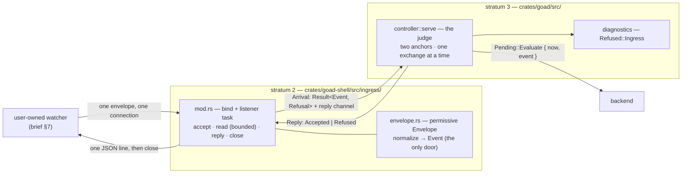
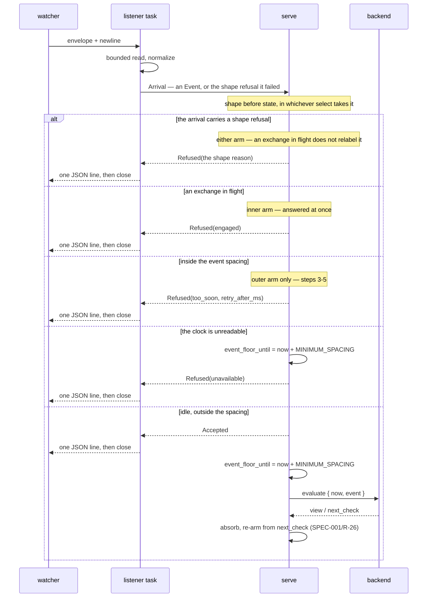

# Design — Slice 004: Event ingress

<!-- The *current* design, not its history. Revision chronology, review
     findings, and dispositions live in `design-log.md`.
     Reference forms: canon by id (`SPEC-003 §4`, `ADR-007`, `POL-002`);
     doc-local refs bare — OQ-1 (§6), D1 (§7), R1 (§8). Ids are immutable. -->

## 1. Design problem

Nothing outside goad can make it ask its backend anything. The host evaluates
when it starts, when a person asks, and when a check comes due, and that is the
whole list.

This slice opens one door: a Unix domain socket that accepts an opaque event
envelope, turns it into an `evaluate` on the path slice 003 built, and answers
the writer. The host learns the envelope's *shape* and nothing else.

The boundary is **the envelope and the socket**. Past the envelope, everything
is carried. Before it, nothing is guessed.

## 2. Current state

`research.md` Thread 2 holds the cited map. Four facts shape this design more
than the rest:

- **F1** — `serve` does not poll its outer `select!` while an exchange is in
  flight (`controller.rs:505`). An ingress arm added there alone could never
  produce AC-4's *engaged* refusal; the connection would wait in the accept
  backlog and be served late.
- **F2** — the scheduled floor has exactly one write site
  (`controller.rs:420`), which is what ADR-004 bought and what this slice must
  not spend.
- **F3** — `Stimulus` *synthesises* an event from a host reason; it cannot
  carry one (`wire.rs:41-70`).
- **F6** — ADR-001 §Decision names *both* sides of this slice's placement
  question: "wire-to-canonical normalization" is stratum 1's, and "event
  ingress" is stratum 2's (`adr/001-one-way-strata.md:34-37`). The envelope is
  both, so the names settle nothing, which is exactly the case §Consequences
  says will arise and must be decided deliberately each time. What decides it:
  **stratum 1's normalization holds one contract — SPEC-001, the host/backend
  protocol — in one place, so a second host implementation is held to the same
  normalization of the same wire.** The envelope is a different contract
  (`draft-spec.md`), with different parties, that no backend ever sees. Putting
  it in stratum 1 would make the protocol crate the home of two unrelated wires
  and give `goad-semantics` a reason to change whenever the socket's contract
  does. Two permissive-in / canonical-out precedents exist —
  `protocol/wire.rs` → `protocol/normalize.rs` and `config.rs`'s
  `File` → `Config` — and the shape is the same in both; the choice is which
  crate owns *this* contract, and it is stratum 2's (D-3).

## 3. Forces & constraints

| force | consequence for this design |
|---|---|
| SPEC-002/R-5 | the new stimulus must be bounded on its own terms; inheriting R-4's bound is forbidden in writing |
| ADR-004 | nothing clears the scheduled anchor — so the event bound is a **second** anchor, not a shared one |
| SPEC-001/R-26 | an ingested exchange resolves the schedule like any other: the deadline moves, the *anchor* does not (§5.4) |
| SPEC-001/R-45, R-46, R-47 | the socket is a second untrusted input. No arrival may take the host down, none may panic it, and none may be refused in silence |
| SPEC-001/R-7, R-9, R-56 | the request carries the host's instant and the watcher's four fields; `data` is never interpreted; `"host"` becomes reserved (CD-2) |
| `CLAUDE.md` invariant 1 | `data` is never read; `source` is compared against exactly one reserved string and never interpreted |
| ADR-001, ADR-003 | listener, envelope and normalization are stratum 2; the loop and both anchors are stratum 3; stratum 1 gains nothing |
| AC-3 | one envelope, one reply, one connection — which settles OQ-3 without design deciding it |
| AC-7 | with the key absent, nothing is bound and nothing behaves differently |

## 4. Guiding principles

**P-1 — The envelope is shape, never meaning.** The host reads four fields'
presence and form. `data` is opaque; `source` is compared against exactly one
reserved string; `kind` and `timestamp` are checked for form and carried. A host
that branches on any of them has crossed the first invariant.

**P-2 — Every envelope is answered by the party that can tell the truth about
it.** Shape refusals need no host state and are the listener's. State refusals —
*engaged*, *too soon* — are knowable only inside the loop and are the loop's. No
party answers a question it had to guess at.

**P-3 — A bounded stimulus owns its anchor.** Each class of stimulus the host
bounds is spaced from the previous firing of *its own class*, on its own
monotonic anchor, and no anchor is written by another's firing. SPEC-002/R-4 is
the scheduled instance; CD-1's new requirement is the ingested one. A third
stimulus adds an anchor, not a number.

## 5. Proposed design

### 5.1 System model

Three parts: a listener that determines **shape**, a loop that judges **state**,
and **one** reply site.

The listener determines shape refusals but does not answer them. It hands every
arrival to the loop, which answers all of them. That is what gives AC-3 —
*exactly one reply per envelope* — a single enforcement site, and what lets a
refusal reach the diagnostics surface at all without inventing a second channel
for it (D-4). It does not put *every* refusal there: the surface is a single
whole value presented between exchanges, so only the refusals the loop decides
while it is idle survive to be presented. `draft-spec.md` R-15 states which, and
`slice-004.md` Follow-ups carries the gap.



| part | stratum | owns | may not |
|---|---|---|---|
| `ingress::envelope` | 2 | the permissive envelope type, its normalization into `Event`, the `EnvelopeFault` vocabulary | touch a socket, read host state, or interpret a field's value |
| `ingress` (`mod.rs`) | 2 | `bind`, the accept task, the budgets, the reply's bytes, `Ingress` and `Arrival` | decide *engaged* or *too soon* — it cannot see either |
| `controller::serve` | 3 | both anchors, the accept/refuse decision, and **every** reply | know how an envelope was spelled |
| `startup` / `main` | 3 | binding before the loop starts, and the exit code when it cannot | recover from a bind failure — it is fatal |
| `diagnostics` | 3 | the one line a person reads for a refusal **the loop decided while idle** (`draft-spec.md` R-15) | be the writer's answer; the socket already was. It is also not a log: one whole value, presented between exchanges, so a refusal decided *inside* an exchange is superseded before any presentation |

**Two things this model buys.** No host state is shared or duplicated — the loop
stays the only reader of its own anchors, which is what F2 protects. And *no
listener configured* is a **state named in the type**: `Ingress::none()` is a
handle whose arrival future never resolves, so `serve` takes an `Ingress`
unconditionally and AC-7 holds by construction rather than by a branch.

**Stratum 2 normalizes into `Event`, and that is not a second door.**
`CLAUDE.md`'s second invariant — *normalization is the only door into the
canonical types* — is a rule about the **protocol's** canonical values: the
chain `protocol/wire.rs` → `protocol/normalize.rs` → `protocol/canonical.rs` is
the sole admission point for anything a backend sends, and this slice does not
touch it. `Event` itself holds no invariant a constructor could enforce. It is a
transparent record of four `pub` fields (`canonical.rs:490-497`): `source` and
`kind` are `String`, `data` is opaque by SPEC-001/R-9, and the one field that
can fail to be canonical is `timestamp`, whose canonicality is carried entirely
by `jiff::Timestamp` — a type stratum 2 may already name (`jiff` is on stratum
2's manifest allowlist, `goad-boundary/tests/checks/allowlist.rs:19-27`).
Constructing an `Event` outside stratum 1 is also **already the status quo**:
`wire.rs:62` (stratum 3) has built one for every host-originated evaluation
since slice 002. So the envelope adds a second *producer* of a transparent
record, not a second gate on a guarded one.

What that argument does owe: the offset rule is now stated twice —
SPEC-001/R-22 for the backend's instant, `draft-spec.md` R-10 for the
envelope's — and two statements of one rule can drift. R-10 is written to mirror
R-22 in terms, and both parse through the same jiff two-step (`research.md` F5).

### 5.2 Interfaces & contracts

Four wires and three Rust surfaces. The two wires are normative in
`draft-spec.md` (SPEC-003 on promotion); this section is the design's statement
of the same thing and must not diverge from it.

#### Configuration

```toml
[ingress]
path = "./goad-demo.sock"
```

`Config` gains `ingress: Option<IngressConfig>`, with
`IngressConfig { path: PathBuf }`. The `File` side gains
`ingress: Option<FileIngress>` carrying `deny_unknown_fields` like its siblings,
so the key exists in the canonical form before any config may write it. An empty
path is refused at load — `ConfigError::EmptyPath { key: "ingress.path" }`, on
`EmptyCommand`'s argument: the unusable value is not representable past the
boundary.

Absent means **no listener**, which is today's behaviour exactly (AC-7).

#### The envelope — inbound

```json
{ "source": "reddit-watcher", "kind": "reddit-opened",
  "timestamp": "2026-08-22T17:10:00+10:00", "data": { "count_last_hour": 4 } }
```

**Framing: one envelope per connection, terminated by a newline or by EOF,
whichever comes first.** This is what makes both plausible one-liners work —
`socat` half-closes its write side, `nc` does not. Bytes after the first newline
are never read; the host replies and closes (AC-3).

| field | rule | why |
|---|---|---|
| `source` | string, non-empty, **not `"host"`** | CD-2. The reserved value is the only comparison the host makes on it |
| `kind` | string, non-empty | carried verbatim |
| `timestamp` | RFC 3339 with an **explicit offset** | SPEC-001/R-22's argument, unchanged: an offsetless instant is the most likely mistake and deserves its own diagnostic |
| `data` | any JSON value | opaque (SPEC-001/R-9), and the envelope's extension point |
| any other key | refused, naming it | `data` is where new things go, so a key beside the four is a mistake rather than a newer watcher |

Duplicate keys at any depth are refused, reusing stratum 1's
`reject_duplicate_keys` (`protocol/wire.rs:79`, already `pub`) — no new code, and
the same rule the backend wire follows.

#### The reply — outbound

```json
{"protocol":1,"accepted":true}
{"protocol":1,"accepted":false,"reason":"too_soon","retry_after_ms":1800,"detail":"an event-triggered evaluation began 1.2s ago; the minimum spacing is 3s"}
```

One line, then the host closes. `reason` is a closed set; `detail` is prose for
a person, and nothing may branch on it. **`retry_after_ms` is the one structured
thing a writer may act on beyond `reason`**, it is present exactly when
`reason` is `too_soon`, and it is **rounded up** to the millisecond so that a
writer waiting exactly that long is outside the spacing rather than one
truncated remainder short of it (`draft-spec.md` R-14).

| reason | decided by | when | reaches a person? |
|---|---|---|---|
| `malformed` | listener | the bytes are not one JSON document | when the loop was idle |
| `invalid_envelope` | listener | the top-level value is not a JSON object; or a missing, wrong-typed, empty, unknown or duplicated key; or a timestamp without an offset or unparseable | when the loop was idle |
| `reserved_source` | listener | `source == "host"` (CD-2) | when the loop was idle |
| `too_large` | listener | more than `ENVELOPE_LIMIT` before the envelope ended | when the loop was idle |
| `timed_out` | listener | nothing complete within `ENVELOPE_DEADLINE` | when the loop was idle |
| `engaged` | **loop** | an exchange is in flight **and the envelope's shape was good** (SPEC-002/R-9); a shape refusal arriving during an exchange is answered as the shape refusal it is (§5.4) | **no** — it is decided only inside an exchange, and `absorb` overwrites it |
| `too_soon` | **loop** | inside the event spacing (CD-1) | yes — decided only while idle |
| `unavailable` | listener **or loop** | the loop is gone, the host is stopping (listener); the clock is unreadable (loop, §5.4 step 4); or **ingress has stopped for the life of the process** (loop, the `None` path above) | the clock case, yes; the ingress-stopped case, when the loop was idle — and that fold is the only report of it there is; the shutdown case **no** — there is no loop left to present |

The last column is a fact about the diagnostics surface, not about the reply:
**every envelope's** refusal is reported to its writer, always (AC-3, I-1). What
the column records is which of them a person who is not the writer can see,
which is what `draft-spec.md` R-15 states and what `slice-004.md` Follow-ups
exists to close. The one row that is not a reply to an envelope at all is the
ingress-stopped `unavailable`: there is no arrival to answer, which is why the
surface is the only place it can appear.

#### Stratum 2 — `crates/goad-shell/src/ingress/`

```rust
pub const ENVELOPE_LIMIT: usize = 64 * 1024;
/// Bounds the **read**, not the connection: the wait for the loop's judgement
/// is unbounded by design (I-2, `draft-spec.md` §6.4).
pub const ENVELOPE_DEADLINE: Duration = Duration::from_millis(500);
pub const SOCKET_MODE: u32 = 0o600;

/// Probe, reclaim, bind, set the mode, spawn the accept task. Synchronous,
/// and called under the runtime guard `main.rs` already holds.
pub fn bind(path: &Path) -> Result<Ingress, IngressError>;

pub struct Ingress { /* Option<mpsc::Receiver<Arrival>> */ }
impl Ingress {
  /// The handle a host with no socket holds.
  pub fn none() -> Self;
  /// Cancel-safe. **Never resolves** when nothing is bound — that is
  /// `none()`'s park, and it is a different state from the one below.
  ///
  /// `None` means a **bound** receiver's senders are all gone: the accept
  /// task has ended for a reason other than this receiver being dropped,
  /// which today means it panicked. The receiver is dropped on the way out,
  /// so the arm parks from then on instead of spinning on a closed channel.
  pub async fn arrival(&mut self) -> Option<Arrival>;
}

pub struct Arrival { /* Result<Event, Refusal> + a oneshot */ }
impl Arrival {
  /// Both halves, each consumed exactly once by type.
  pub fn into_parts(self) -> (Result<Event, Refusal>, Answer);
}

pub struct Answer(/* oneshot::Sender<Reply> */);
impl Answer {
  pub fn accepted(self);
  pub fn refused(self, refusal: &Refusal);
}
```

A dropped `Answer` is **defined, not a bug**: the listener sees the channel
close and writes `unavailable`. That is the shutdown path.

**What the loop does with `None`.** It folds one `Refused::Ingress` onto the
diagnostics surface — reason `unavailable`, detail naming that ingress has
stopped — and parks the arm. That is a refusal in substance: it is the standing
answer to every envelope from then on, and it is the one refusal whose writer
cannot be told directly, because nothing is listening to tell. D-11 is not
widened; the surface still shows refusals only.

**That is `unavailable`'s third cause, and it is the one that does not pass.**
The other two are conditions of the moment — the host is stopping, or its clock
is unreadable. This one is **permanent for the life of the process**: nothing
restarts the accept task, so ingress is over until the host is. The reason token
set stays closed at eight; what widens is `unavailable`'s definition, and the
reply table above, §5.4 and `draft-spec.md` §6.3 all state the three causes
together so that no reader takes "right now" for the whole of it.

`Refusal` carries its own payload — `TooSoon { retry_after }`,
`TooLarge { limit }`, `TimedOut { after }`, `InvalidEnvelope(EnvelopeFault)`,
`Unavailable(UnavailableCause)` — with `reason() -> &'static str` for the wire
and `Display` for `detail`. **The fifth was omitted when this list was written
and is restored at reconciliation** (`audit.md`, `review-code.md` F-a): a unit
`Unavailable` cannot satisfy §5.4's own sentence two paragraphs above — *one
thing about the host and three about why*, with `detail` saying which.
`TooSoon` is the one payload that also reaches the wire as a field of its own,
`retry_after_ms` (`draft-spec.md` R-14); every other payload reaches it
only through `detail`, which nothing may branch on.
`EnvelopeFault` is the precise vocabulary behind one wire reason (not an object,
missing, wrong-typed, unknown, empty, duplicate, timestamp), which is the same
permissive-in / precise-diagnostic split `ScheduleError` already uses.

`IngressError` is one struct — the path, and a fault naming what was found — so
that every message names the path once: not a socket, in use by a live host,
unprobeable, unlinkable, unbindable, or its mode unsettable.

**One stratum 1 touch:** `json_type_name` is `pub(crate)`
(`goad-semantics/src/error.rs:18`) and the envelope's faults need it. Widening
it to `pub` is a **visibility change, not a dependency** — `goad-semantics`
gains nothing, and AC-11 is untouched. It is one of three ways to get the same
six type names into stratum 2, and no ADR-001 instrument sees which was taken;
D-18 states the choice and why it is held by that line alone.

#### Stratum 3 — `crates/goad/src/`

```rust
pub async fn serve<B, G>(host, controller, commands, cancel, clock, glass,
                         ingress: Ingress) -> Served<B, G>;
```

One added parameter, **23 call sites** across `main.rs`,
`tests/renderer/{wiring,scheduling}.rs`, `tests/event_loop/closing.rs` and
`tests/event_loop_schedule/scheduling.rs`, every one of which passes
`Ingress::none()` and keeps its assertions (AC-7's reading, `design-log.md`
2026-09-08).

`Served` gains `ingress` for symmetry with `host`, `controller` and `glass` —
safe, because every existing test reads a field and none destructures the
struct. `Fired` gains `Ingested(Arrival)`. `StartupError` gains
`Ingress(IngressError)`. `Refused` gains `Ingress { reason, detail }`.

**`Fired` never sees a closed channel.** `arrival()` yields `Option<Arrival>`
and `Fired::Ingested(Arrival)` cannot carry the `None`, so each arm disposes of
it **where it observes it, before any `Fired` is built**:

- the **outer** arm folds the one `Refused::Ingress` onto the diagnostics
  surface and `continue`s. The next iteration's `glass.present`
  (`controller.rs:409-410`) is what puts it in front of a person;
- the **inner** arm folds the same refusal and resumes waiting on the exchange.
  It is then a refusal decided *during* an exchange, so `absorb` supersedes it
  and `draft-spec.md` R-15's bound applies to it exactly as to every other one.

Because no `Fired` is constructed on that path, `refusal_re_arms`
(`controller.rs:427`, `matches!(fired, Fired::Scheduled)`) is not reached, the
standing deadline is not reset, and neither anchor is written: a dead accept
task changes nothing about the schedule. No new state is retained either — the
receiver is dropped as `None` is returned, so the arm parks by itself and §5.3's
table still holds the whole of what this slice keeps.

**No unlink on exit, deliberately.** AC-8's reclaim path is then exercised on
every ordinary restart rather than only after a crash: a recovery path that runs
once a year is a broken one.

### 5.3 Data, state & ownership

The whole of the new retained state is **one instant**.

| what | where | written by | read by | lifetime |
|---|---|---|---|---|
| `event_floor_until` | `serve`'s stack | the **outer** ingress arm, on an **attempted** ingested evaluation, and nowhere else (§5.4, steps 4 and 5) | the **outer** ingress arm (§5.4, step 3) | the loop |
| `floor_until` | `serve`'s stack | the timer arm, unchanged (`controller.rs:420`) | the re-arm | the loop |
| the bound listener | the accept task | — | — | the process |
| an `Arrival` in flight | the channel | — | — | one connection |

**Both anchors start already elapsed.** `floor_until` is initialised to
`started` (`controller.rs:407`), and `event_floor_until` is initialised the same
way — which is forced, not chosen. The only other candidate,
`started + MINIMUM_SPACING`, would have the host's own startup evaluation write
the event anchor, and that is precisely what P-3 denies. So the startup
evaluation never makes an envelope `too_soon`, which is the whole of what the
anchor decides: the anchor is §5.4's step **3**, and an envelope arriving
while the startup exchange is still in flight is refused at step **2**,
`engaged`, like any other.

Two anchors, two write sites, neither reachable from the other. That is P-3, and
it is the whole of AC-6's falsifiable claim. There are **two** ingress arms and
only the outer one appears in this table: the inner arm reaches step 2 of §5.4
and stops, so it neither reads nor writes either anchor, which is what keeps
*"and nowhere else"* true and I-4's *one write site each* exact.

**What the host deliberately does not keep.** No queue and no pending event; no
per-source rate table; no dedup set; no arrival history; no memory whatsoever
between connections. Each of those is either domain judgement — brief §7 puts
filtering, classification and debouncing in the watcher — or unbounded state the
host has no rule for evicting from.

### 5.4 Lifecycle & dynamics

**Startup.** `bind` goes after the runtime guard `main.rs` already takes and
before `spawn_local`: it needs the reactor, and a bind failure must be fatal
before a window exists. `Host::new` goes **after** the bind — it *consumes* the
`Config` (`main.rs:54`, `host.rs:115`), which derives no `Clone` and exposes no
accessor, so the bind must read `config.ingress` before the host takes it.

```
Config::load → clock → backend → runtime → runtime.enter()
  → ingress::bind(path)?        ← new, fatal, exit 2, message names the path
  → Host::new                   ← below the bind: it consumes the `Config`
  → window/tray → wire → glass → seed startup evaluate
  → spawn_local(serve(…, ingress))
```

**Order of judgement in the ingress arms.** Shape refusals take precedence over
state refusals, **in both selects**: a malformed envelope is malformed
regardless of timing, and it is the more actionable thing for its writer to be
told.

1. carries a shape refusal → refuse with it. This is the **inner** arm's first
   step as much as the outer's: an exchange being in flight does not turn a
   malformed envelope into `engaged`
2. an exchange is in flight → `engaged` (the inner arm's only state answer)
3. inside the event spacing → `too_soon`
4. clock unreadable → `unavailable`, with `detail` naming the clock
5. otherwise → `accepted`, write the anchor, evaluate

Steps 3–5 belong to the outer arm alone: it is reached only when no exchange is
in flight. Step 1 in the inner arm is what makes `draft-spec.md` R-15's negative
test buildable — a shape refusal decided *during* an exchange, which the
diagnostics surface then does not show.

`unavailable` means one thing about the host and three about why: **the host
cannot act on any envelope** — it is stopping, its clock is unreadable, or its
ingress has stopped for the life of the process (§5.2, the `None` path) — and
`detail` says which. The first two are conditions of the moment, and *wait* is
sound advice for both. The third is not a condition of the moment, and it is
also the one cause no writer is told about — nothing is left to tell it —
so it reaches a person on the diagnostics surface or nowhere.

**An attempted firing writes the anchor**, exactly as SPEC-002 §5 already says
for the scheduled one. A clock-refused ingested evaluation still writes
`event_floor_until`, so a broken clock produces one refusal per spacing rather
than a spin. A `too_soon` or a shape refusal writes nothing: no evaluation was
attempted.

**Select ordering is load-bearing.** `biased` means an always-ready arm starves
everything below it.

| select | order | why |
|---|---|---|
| outer | cancel → commands → **sleep** → ingress | cancel keeps SPEC-002/R-10's precedence; a person beats a machine; and ingress sits **below the timer** so a watcher emitting at machine rate cannot starve a scheduled firing |
| inner | cancel → **call** → ingress | the exchange the loop is waiting on must not be starved by a flood of arrivals it is only going to refuse |

The listener is sequential and every arrival needs a round trip to the loop, so
a flood cannot in fact make that arm ready on every poll. The ordering is stated
so that correctness does not rest on that.

The inner `select!` becomes a loop, so refusing an arrival resumes waiting on
the same exchange: `call` is pinned across iterations and the outer loop carries
a label for the cancellation break.



The five branches are the order of judgement above, in order, and the reply is
drawn **inside** each of them because in a sequence diagram position is time.
The time it leaves is the whole point of the last branch: the writer is answered
**when the arrival is judged, not when the exchange it began completes**. The
loop hands the answer to the listener before it calls the backend, and the
listener's write races the exchange rather than waiting on it — which is what
`draft-spec.md` §5's diagram of the same interaction shows (reply, then
`evaluate`), what I-2 requires if `engaged` is to be reachable at all (the
listener awaits the reply before accepting the next connection, so a reply that
waited for the exchange would mean no second connection could ever arrive during
one), and what §5.5's *writer hangs up* edge case describes.

I-1 is not the reason for the drawing: it says **how many** replies leave — one
per envelope, by the same door in every branch — and says nothing about when.

**Failure.** An ingested evaluation *is* an evaluation: a backend that fails it
produces the same `Outcome`, the same diagnostics and the same schedule
resolution as any other. Nothing about ingress is special past the point the
event becomes an `Event`.

**Shutdown.** `serve` returns and hands `ingress` back inside `Served`; `main`
drops it; the listener's next send fails and the task exits. An `Answer` already
in flight is dropped, and the listener writes `unavailable` before closing.

### 5.5 Invariants, assumptions & edge cases

#### Invariants

| # | holds | how |
|---|---|---|
| I-1 | every envelope is answered exactly once | `Answer`'s two methods each consume `self`; a **dropped** `Answer` is the defined `unavailable` path, not a leak |
| I-2 | **at most one arrival is outstanding**, so *the host holds no queue* is true by construction | the listener awaits the reply before accepting the next connection; the channel's capacity is irrelevant beyond 1. The cost is stated, not hidden: the wait for judgement is **unbounded** — `ENVELOPE_DEADLINE` bounds the read, not the connection — so an unjudged arrival stops all ingress for as long as the main thread is not polling `serve` (`main.rs:102`, `slint::spawn_local`). That is the same main-thread dependency a scheduled firing, a person's click and a backend's answer already have; ingress does not add one, it inherits it (`draft-spec.md` §6.4) |
| I-3 | no arrival takes the host down or leaves it unable to invoke the backend | parsing is `serde_json` over an owned buffer, nothing derived from an envelope is unwrapped, and every failure is a `Refusal` (SPEC-001/R-45, R-46) |
| I-4 | the two anchors never cross-write | one write site each, both in `serve`, neither reading the other (P-3, ADR-004) |
| I-5 | the host reads no meaning | `data` is never inspected; `source` is compared against exactly one string; `kind` is checked for emptiness and carried |
| I-6 | stratum 1 gains nothing but a visibility widening | no new dependency and no new module there; the four ADR-001 instruments and the vocabulary scan pass unchanged (AC-11) |

**What an arrival can still make the host do, and what nothing bounds.** I-3 says
an arrival cannot take the host down. It does not say an arrival cannot make the
host *work*, and after `draft-spec.md` R-15 one thing it can: a refusal the loop
decides while idle is reported by `controller.refuse` and a `continue`, and
`continue` returns to the top of the loop, whose first statement is
`glass.present(controller.frame())` (`controller.rs:409-410`). So **one refused
envelope costs one full presentation** — every window property the frame carries,
both `VecModel` rebuilds, the tray image and the tooltip
(`crates/goad/src/glass.rs:67-120`) — on the main thread, at the writer's pace.
`too_soon` is decided only while idle, so every `too_soon` is one of these.

Ingress is the host's first machine-rate refusal source; before this slice a
refusal came from a person's click or a three-second timer. `ENVELOPE_LIMIT` and
`ENVELOPE_DEADLINE` bound the listener's reads and nothing bounds the
presentations the loop makes on their behalf. This is stated rather than
designed away: the coupling is real, R6 (§8) names it, and AC-5's flat-out
writer is extended to measure it in the phase that builds the arms (§9).

#### Assumptions — each a place this design can break

- **A-1 — `tokio::net::UnixListener` accepts from a `tokio::spawn`ed task while
  the main thread runs Slint's event loop under the runtime guard.** This is
  *weaker* than the case `docs/memory/tokio-time-runs-under-slints-executor.md`
  measured: that one is a future on Slint's own executor; this one is a task on
  the multi-thread runtime. Plausible, unmeasured. **The plan must spike it
  before the phase that depends on it.**
- **A-2 — both plausible one-liners terminate the read.** `socat` half-closes
  its write side (EOF); `nc` does not, and is terminated by the newline. The
  newline-or-EOF framing exists for exactly this, and AC-13's run is one of its
  two witnesses.
- **A-3 — jiff renders a `Timestamp` as RFC 3339 in UTC**, so `+10:00` in, `Z`
  out, the same instant (research C-3). Verify at point of use rather than
  trusting this line.
- **A-4 — `mpsc::Receiver::recv` and `std::future::pending` are cancel-safe in
  `select!`.** `Ingress::arrival` holds nothing across an await, so it inherits
  their safety.
- **A-5 — the mode is set after the bind**, so there is a window in which the
  socket exists with the ambient umask's mode. The containing directory is the
  user's responsibility (`design-log.md` 2026-09-08), so this is stated rather
  than defended.

#### Edge cases

| case | behaviour |
|---|---|
| zero bytes, then EOF | `malformed` — an empty payload is not a JSON document |
| `"data": null` | accepted; `data` is any JSON value |
| a timestamp in 1970 or 3000 | carried, unjudged (OQ-10) |
| `"source": "host"` with everything else valid | `reserved_source` (CD-2) |
| an envelope arriving between `bind` and `serve` starting | it waits for judgement and its writer waits with it. If `serve` never starts — a platform failure in between — the writer gets EOF with no reply when the process exits |
| the writer hangs up before reading its reply | the write fails and is dropped; **an accepted event is not undone because nobody read the answer** |
| a path longer than `sun_path` admits | `bind` fails, and the startup error names the path (AC-9) |
| a symlink at the path | not a socket → startup error. A symlink *to* a socket is ambiguous and is refused rather than followed |
| a second envelope on the same connection | never read; the host replied and closed (AC-3) |
| `accept()` returns an error (`EMFILE`, `ECONNABORTED`) | the task keeps accepting: on a bound Unix listener these are per-connection conditions, and there is no writer to report them to. In the ordinary case the task then exits only when the loop's channel closes |
| the accept task ends for any other reason — a panic inside it | the loop's `arrival()` yields `None`, the loop folds one `Refused::Ingress` (`unavailable`, naming that ingress has stopped) onto the diagnostics surface and parks the arm (§5.2, *`Fired` never sees a closed channel*). **This is what "ingress cannot die silently" actually holds**: the loop can tell a dead task from `Ingress::none()`'s park, and folds it once. Whether a person then sees it is `draft-spec.md` R-15's bound like any other refusal — it survives if the loop was idle when it observed the `None`, and is superseded by `absorb` if it observed it inside an exchange. The stop is permanent for the life of the process, which is why this is `unavailable`'s one cause that is not a condition of the moment (§5.4) |
| the socket is unlinked underneath a live listener — a `rm`, or a second host reclaiming the path under `draft-spec.md` R-3 | **stated residue.** Nothing re-probes the path after `bind`, and D-16 removes the host's own unlink, so the listener keeps a bound fd no `connect` can reach. Every later watcher gets `ECONNREFUSED`/`ENOENT` and the host reports nothing, because from its side nothing arrives. AC-12 survives — the host is up and still evaluating — but the design does not claim this case away, and closing it needs a re-probe or the single-instance work `slice-004.md` Follow-ups carries |

## 6. Open questions

All ten are dispositioned; one is carried by decision.

| OQ | disposition |
|---|---|
| OQ-1 spacing value / configurability | **answered** — 3 s, one constant, two anchors, not configurable (D-5) |
| OQ-2 reply format / version | **answered** — one versioned JSON line (D-6), normative in `draft-spec.md` |
| OQ-3 one envelope or a stream | **not design's** — AC-3 settled it at scoping: one envelope per connection |
| OQ-4 where normalization lives | **answered** — stratum 2, because that is where the contract it serves lives; ADR-001 names both sides and settles neither (§2 F6, D-3) |
| OQ-5 where the reserved-source rule is stated | **answered** — emission in SPEC-001/R-56, refusal in SPEC-003 (D-3) |
| OQ-6 the probe/bind race | **answered by not closing it** (D-10). Stated as a limit; single-instance enforcement becomes a follow-up |
| OQ-7 diagnostics | **answered** — refusals only (D-11) |
| OQ-8 SPEC-002 OQ-4 | **carried, unanswered.** An ingested evaluation can supersede a view a person is mid-answering. This slice raises the rate at which that is reached and resolves nothing about it |
| OQ-9 demo config and the one-liner | **answered** — `examples/demo.toml` listens; `socat` joins the devshell (D-17) |
| OQ-10 the timestamp | **answered** — shape only, offset mandatory, distance from now unjudged (D-7) |

Nothing new is left open. **A-1 (§5.5) is an assumption, not an open question** —
it is measurable, and the plan measures it.

## 7. Decisions, rationale & alternatives

| # | decided | rejected, and why |
|---|---|---|
| D-1 | the ingress contract gets a draft spec, promoted at audit | design-only (slice 005 would read a closed slice's design); extending SPEC-001 (the wrong parties) |
| D-2 | the loop judges every envelope; ingress is watched in **both** selects | a listener reading shared state (duplicates the anchors); `try_send` fullness as the refusal (that is a queue of one) |
| D-3 | the envelope normalizes in **stratum 2**, beside the listener; and the reserved-source rule splits SPEC-001 (what a host emits) / SPEC-003 (what a host accepts) | stratum 1 — it would make the protocol crate the home of a second, unrelated wire contract that no backend ever sees, and give `goad-semantics` a reason to change whenever the socket's contract does. ADR-001 names both sides of the question and settles neither; §2 F6 states what decides it and §5.1 states why normalizing into `Event` from stratum 2 is not a second door into a canonical type. Recorded as an ADR at reconciliation (§10) |
| D-4 | the listener *determines* shape refusals; the loop *answers* all of them | the listener answering its own: two reply sites, and **no** refusal able to reach the diagnostics surface at all. As decided, the ones the loop answers while idle do reach it and the rest do not (`draft-spec.md` R-15) — a strict improvement, not a complete answer, and the remainder is a Follow-up |
| D-5 | one `MINIMUM_SPACING`, two anchors, not configurable | a second constant (drift, and no evidence fixes either number); configurable (ADR-004: a bound a misconfiguration can remove is not a bound) |
| D-6 | the reply is one versioned JSON line | unversioned (SPEC-001/R-1's lesson); plain text (slice 005 would parse prose) |
| D-7 | the envelope is strict: four fields, unknown keys refused, offset mandatory, distance unjudged | permissive (silently drops what the writer meant to send, SPEC-001/R-20's case); an optional timestamp (the host would author the originator's own field) |
| D-8 | framing is a newline **or** EOF, whichever comes first | EOF-only (breaks `nc`); newline-only (breaks `socat`) |
| D-9 | sequential accept, 64 KiB and 500 ms **per read** — the wait for the loop's judgement is deliberately unbounded (I-2, `draft-spec.md` §6.4) | a task per connection (a second concurrency dimension); a byte bound alone (an idle connection stops ingress with no diagnostic); a bound on the wait for judgement (it would mean answering an envelope the host had not judged) |
| D-10 | the probe/bind race is documented, not closed | an atomic `link`; a lock file. Both are partial single-instance enforcement under another name (`research.md` F15) |
| D-11 | the diagnostics surface shows refusals only | the stimulus behind the current view (stratum-3 plumbing); a ring buffer (retained state in a module that retains nothing) |
| D-12 | `Ingress::none()` parks forever; `serve` takes an `Ingress` unconditionally | `Option<Ingress>` plus a select guard; a second entry point; hanging it off `Host` or `Controller` |
| D-13 | **an ingested evaluation is not a `Stimulus`** — the **outer** ingress arm builds `Pending::Evaluate` directly (it is the only one that reaches step 5) | `Stimulus::Ingested(Event)`: it costs `Copy`, and makes `kind()` return a watcher's domain string from a method documented as the host's own vocabulary. Consistent with the 2026-09-08 finding that an ingested evaluation is not host-originated |
| D-14 | ingress sits **below** the timer arm in the outer select and **below** the exchange in the inner one | a higher position lets a machine-rate watcher starve a scheduled firing |
| D-15 | an **attempted** ingested firing writes the event anchor, one refused for want of a clock included | not writing it lets a broken clock spin. Mirrors SPEC-002 §5 exactly |
| D-16 | no unlink on exit | a `Drop` unlink would leave AC-8's reclaim path exercised only after a crash |
| D-17 | `socat` joins the devshell; `examples/demo.toml` listens in the checkout | a `deno eval` one-liner (a bad advertisement for a socket anything can write to); `/tmp` (depends on a directory this design declines to defend); a second config and a second recipe |
| D-18 | `json_type_name` is widened to `pub` | **two alternatives, not one.** A *second copy* in stratum 2: two tables naming the same six JSON types, free to drift, and the function's own comment — "the one such table in the crate" — false across the workspace. A *local match* on `serde_json::Value`'s six discriminants inside `EnvelopeFault`: available, because `serde_json` is on stratum 2's allowlist (`goad-boundary/tests/checks/allowlist.rs:19-27`), and it is the same six arms written a second time under another name. Both duplicate a diagnostic vocabulary a person reads; the widening instead adds a permanent public export to `goad-semantics`. Taken because one table that cannot drift is worth more than a narrow export. **No ADR-001 instrument sees this choice** — crate edges see only crate edges, the manifest allowlist only dependency entries, the purity scan only stratum 1's `std` reaches, and `cargo test -p goad-semantics` rejects nothing (`docs/policy/001-the-phase-gate.md` §Verification). It is held by this line |
| D-19 | AC-6 is a claim about the two anchors; AC-7 is about unchanged assertions | `design-log.md`, both 2026-09-08 |

**D-13 has a consequence outside this document.** `slice-004.md` §Scope says
`Command`/`Stimulus` *"must be able to express an evaluation whose `Event` the
host did not author"*. That sentence is revised at design acceptance: it
predates the finding that an ingested evaluation is not host-originated, and
`Pending::Evaluate` — not `Stimulus` — is the vocabulary both paths already
share.

## 8. Risks & mitigations

| # | risk | impact | mitigation | the signal |
|---|---|---|---|---|
| R1 | **A-1 is unmeasured**: accepting from a `tokio::spawn`ed task while Slint owns the main thread | high — the slice does not work at all | the plan spikes it in its first phase, before anything depends on it | the spike itself, or a demo that never sees a connection |
| R2 | `serve` grows a third arm and a nested loop, and it is the most-reviewed function in the repository | medium — a regression here breaks scheduling, not only ingress | the arm's body is short and delegates; the inner loop's only new arm is a refusal; the existing suite's assertions are untouched | `serve` outgrowing review, or a test that has to know the arm order |
| R3 | the refusal vocabulary is closed, and slice 005 is its first real client | medium — a wire break one slice later | SPEC-003 states each reason's meaning; a test asserts the exact tokens | slice 005 wanting a reason that does not exist |
| R4 | timed assertions are the flakiest thing in the suite (`docs/memory/timed-test-margins-are-measured-at-the-bound.md`) | medium | reuse `until`/`within`; measure the margin **at the bound that governs**, under real load | a margin under 10x |
| R5 | a socket file in the checkout | low | `.gitignore`; the boundary scans read `.rs` and `.slint` only | a socket in `git status` |
| R6 | **an untrusted writer paces the UI thread's work**: R-15 makes every refusal the loop decides while idle reach the diagnostics surface, and the loop's only route there is `refuse` + `continue`, which re-presents the whole frame (`controller.rs:409-410`, `glass.rs:67-120`) | medium — a flat-out writer turns a per-envelope refusal into a per-envelope presentation on the main thread, which is also the thread the timer, the window and the backend call all live on | R-15 is not weakened; the cost is **measured** instead. AC-5's flat-out writer records the presentation count as well as bounding the invocation count, in the phase that builds `serve`'s ingress arms and the anchor (`review-design.md` F-15, `settle-in-code`). What that holds is the cost per refusal, not a ceiling on the writer — a test detects, it does not prevent | the number AC-5 records — presentations per refused envelope, and presentations per second under a flat-out writer — rising above what that phase measured a person can sit in front of; or a visibly unresponsive window while a writer floods the socket. One-for-one is **not** the signal: it is the design (§5.5), and a signal satisfied on the day it is written tells a reader nothing |

## 9. Validation

Four tiers, and every acceptance criterion lands in one.

| tier | where | what it holds |
|---|---|---|
| pure unit | `goad-shell/src/ingress/envelope.rs`, `#[cfg(test)] mod tests` | every `EnvelopeFault`, every accepted shape, the reserved source. No socket and no runtime |
| stratum 2 integration | new `goad-shell/tests/integration/ingress.rs` | the listener over a real socket in a tempdir, against a fake judge |
| stratum 3 renderer | `goad/tests/renderer/`, a new case file | production `serve` with a real bound `Ingress` and a scripted backend |
| the gate | `just check` | AC-11's instruments, unchanged |

| AC | verified by |
|---|---|
| AC-1 | renderer: a scripted backend records its request; assert `source`, `kind` and `data` byte-identical, `timestamp` the same **instant** (§5.5 A-3), and `now` the host's own |
| AC-2 | renderer: the view reaches the window and `current_view_token` answers it — the same helper the scheduled tests already use |
| AC-3 | integration: exactly one line, then EOF; plus a dropped `Answer` yielding `unavailable` |
| AC-4 | integration (the five shape reasons, the non-object top-level among them) and renderer (`engaged`, `too_soon`); **one test asserts the exact token set**, which is R3's mitigation; one asserts `retry_after_ms` is on a `too_soon` reply and on no other, and that its value is rounded **up** — a writer that waits exactly that long is outside the spacing (`draft-spec.md` R-14); and two hold `draft-spec.md` R-15's bound from both sides — a refusal decided while idle reaches the diagnostics surface, and the same refusal decided during an exchange does not |
| AC-5 | renderer: a writer emitting flat out; the invocation count is bounded over a window far shorter than the spacing, and the excess replies say `too_soon`. **Extended, and this is what settles R6**: the same test also **records** the number of presentations over that window and asserts it against the refusals that caused them, so the rate coupling R-15 creates between an untrusted writer and the UI thread is a measured number rather than an argument. The measurement does not remove the coupling — one refusal costs one presentation by construction (§5.5) — it fixes the cost at one, so a change that raised it fails here (§8 R6; `review-design.md` F-15) |
| AC-6 | renderer, **three cases** — one per way the two anchors could cross. (i) *does not delay*: an ingested exchange falling between a short `next_check` and its firing does not push that firing out by the spacing — an ingested firing never writes `floor_until`. (ii) *does not advance*: a **scheduled** firing at T₀, an ingested firing at T₀+ε **whose own exchange resolves to a deadline no later than T₀+1 s**, and a `next_check` due at T₀+1 s — the scheduled evaluation does not reach the backend before T₀+3 s. That clause about the ingested exchange's own deadline is load-bearing, not decoration: every completed exchange re-arms the pending deadline from the instruction *that* exchange's backend returned (`controller.rs:507-512`, SPEC-001/R-26), so the scripted backend must answer the **ingested** evaluation with a `next_check` at least as short as the scheduled one's. Without it the deadline in force at T₀+1 s is whatever the script's default was, the two hypotheses do not disagree about it, and the assertion passes for a reason that would have held under the boolean too. (iii) *the event anchor is not cleared*: an ingested firing, then a scheduled firing, then a second event inside the ingested spacing is **still** `too_soon`. **(ii) is the one that discharges ADR-004's debt** — it is the only case in which the anchor and the boolean alternative ADR-004 rejected disagree, because the boolean would have been cleared by the intervening ingested firing and would fire at T₀+1 s. (i) falsifies the third alternative (an anchor on "the last thing the host did") and (iii) holds CD-1's new rule, on which ADR-004 makes no claim |
| AC-7 | the existing suite with unchanged assertions, plus: with no key configured, no file is created at any path |
| AC-8 | integration: a socket left behind is unlinked and rebound; a **live** one gives `InUse` naming the path, and the first listener keeps serving |
| AC-9 | integration: a regular file at the path, and a path that cannot be created; the fault names what was found. Stratum 3: `StartupError::Ingress` renders, beside its eight siblings. **The exit code itself is held by review, not by a test**: no test target links the binary, and `main`'s single `match run()` maps *every* `Err` to `ExitCode::from(2)`, so a ninth variant reaches exit 2 by the same line the other eight do |
| AC-10 | integration: `mode() & 0o777 == 0o600` after `bind`. The host sets the mode **itself**, with `std::os::unix::fs::set_permissions` — this workspace has no safe umask API, and `umask(2)` is process-global while `cargo test` runs cases in parallel in one process — so the case sets no umask and asserts what the host did rather than what it inherited. §5.5 A-5's `bind`→`set_permissions` window is the residue |
| AC-11 | the gate, unchanged; the vocabulary scan reaches the new module by walking members |
| AC-12 | integration: a malformed envelope produces no `Event` at the judge. Renderer: after a flood of malformed envelopes the host still evaluates |
| AC-13 | a person runs `just demo` and the documented one-liner; recorded in `audit.md` under Evidence, naming what was observed |

**Before any of it, the A-1 spike.** Accepting from a `tokio::spawn`ed task while
Slint owns the main thread is unmeasured, and it is the plan's first phase.
`docs/slices/003/timer-probe.local.rs` is the precedent for how one is run and
kept.

## 10. Canon impact

Three deltas and one new record.

| # | document | change |
|---|---|---|
| CD-1 | SPEC-002 | a new principle — *each bounded stimulus class is spaced from the previous firing of its own class, on its own monotonic anchor, and no anchor is written by another's firing* — plus **SPEC-002/R-12** as its ingested instance at three seconds (qualified because `draft-spec.md` numbers its own ingress-side requirement R-12 too, and neither may be renumbered), a §5 paragraph, the OQ-4 sentence CD-1 already promises, and a §7 verification row. `canon-delta.md` carries the decided value and the principle, which discharges its *open at scoping* clause |
| CD-2 | SPEC-001/R-56 | **the emission clause only**: `"host"` is reserved, and a backend may read `source == "host"` as the host asking on its own account. The *refusal* moves to SPEC-003 (D-3), and `canon-delta.md` is updated to say so |
| **CD-3** | **ADR-004** | **new.** Its Verification section says the anchor is held by review because *"no standing test can distinguish the anchor from the boolean alternative… the case that separates them is the one slice 004 will introduce."* AC-6's **second** test is that case — the *does not advance* direction (§9 (ii)) — and the record is amended at reconciliation to name all three by file and function, saying which one discharges the debt. `docs/AGENTS.md` requires an ADR be kept accurate as its consequences are learned; this is the consequence it predicted |
| — | **a new ADR** | **written at reconciliation:** *the event envelope normalizes in stratum 2.* ADR-001 §Decision names "wire-to-canonical normalization" in stratum 1 and "event ingress" in stratum 2, and the envelope is both; §2 F6 states what decides it and §5.1 states why it opens no second door into a canonical type. It gets a record rather than only a design section because `docs/AGENTS.md` requires one of any decision that could later be reversed by accident, and this one is invisible to every ADR-001 instrument |
| — | `draft-spec.md` → SPEC-003 | new canon: the socket, the envelope, the reply, the refusal taxonomy, the budgets, and the bind race as a non-normative limit |
| — | POL-001 | **unchanged.** `tokio` gains `net`, which the manifest allowlist does not see (`research.md` F12) and which cannot reach stratum 1 (F11) — argued here, which is what POL-001's residue clause asks of the slice that takes it |
| — | ADR-001, ADR-003 | unamended |

`flake.nix` gaining `socat` is an environment change, not canon.
