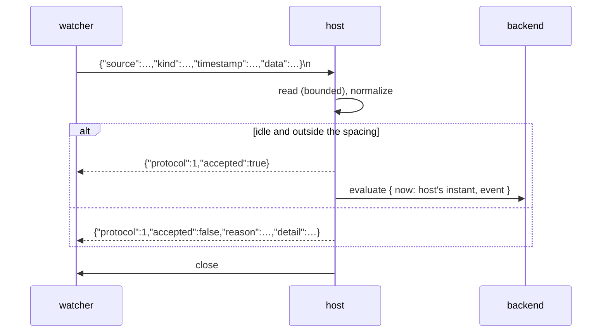

# SPEC-NNN: The host's event ingress contract

**Status:** draft
**Kind:** technical
**Owns:** the local socket a user-owned watcher writes an event to — its
lifecycle, the envelope it accepts, the reply it returns, and the closed set of
reasons an envelope may be refused.

<!-- A spec is evergreen and normative: it describes what is true now, not how
     it came to be true. No changelog, no revision history, no "we used to".
     Amending it requires explicit user endorsement.
     Requirement ids (R-N) are immutable — append, never renumber. Cite another
     spec's requirement qualified: SPEC-003/R-4. -->

> **This is a draft and is not canon.** It is slice 004's working authority
> until it is promoted, with explicit user endorsement, at that slice's audit
> and reconciliation (`docs/AGENTS.md` §*Canon that does not exist yet, or must
> change*). It takes its number at promotion. Nothing outside
> `docs/slices/004/` may cite it.

## 1. Intent

goad evaluates when it starts, when a person asks, and when a check comes due.
Nothing outside the process can make it ask its backend anything, so a
user-owned watcher that has decided *something interesting just happened* has
nowhere to say so. Brief §7 puts that watcher outside the host deliberately: the
host must not subscribe to window-manager, browser or filesystem event streams,
because filtering, classification and debouncing are the user's own code's job.

This document is the door between the two. It says what a watcher writes, what
it gets back, and what the host does with what it was given. The host reads the
envelope's *shape* — four fields, their presence and their form — and nothing
else. `data` is opaque, and `kind` is the watcher's own vocabulary carried
verbatim.

Once this exists, a watcher author can write to a published contract in any
language that can open a Unix socket, and know from the reply whether the host
took the event and, if not, which of a closed set of reasons applied. A second
host implementation can be held to the same contract.

## 2. Scope

**In scope:** the socket's path, mode and lifecycle, including what the host
does when the path is already occupied; the event envelope's wire form and the
rules that admit or refuse it; the reply's wire form; the closed set of refusal
reasons; the bounds on a single connection; and the minimum spacing's
*observable consequence* at the socket.

**Out of scope:** what a backend does with the resulting `evaluate` — that is
SPEC-001's; how the host bounds its own evaluation rate, which is SPEC-002's
subject and only *observed* here; how a next check is resolved; persistence of
an event across host restarts, of which there is none; any command-line client;
peer-credential checks and multi-user hardening; and any interpretation of an
event.

**Boundaries:** this spec abuts SPEC-001 at exactly two points. It **produces**
an `evaluate` whose event SPEC-001/R-7 shapes and whose `data` SPEC-001/R-9
protects, and it **enforces** at ingress what SPEC-001/R-56 reserves at
emission. It abuts SPEC-002 at one point: the spacing SPEC-002 requires of an
ingested evaluation is what R-12 below makes visible at the socket. It reads no
backend response and writes no schedule.

The **backend** transport (brief §6.1) is a different socket, in the other
direction, under a different contract. The two share a word and nothing else.

## 3. Principles

**P-A — The envelope is shape, never meaning.** The host reads four fields'
presence and form. It compares `source` against exactly one reserved string and
otherwise interprets nothing: not `kind`, not `data`, and not how far
`timestamp` is from now. A host that branches on any of them has learned the
user's domain, which is the one thing this product refuses to do.

**P-B — Every envelope is answered, and the answer is true.** There is no
silent acceptance and no silent refusal. A reply that says *accepted* means the
host acted on it; a reply that says *refused* names which of a closed set of
reasons applied. The host holds no queue, so it never answers *accepted* for
something it has merely remembered.

**P-C — The writer decides what to do about a refusal.** Filtering, debouncing
and retry belong to the watcher (brief §7). The host's obligation ends at
telling the truth promptly, and it never delays an envelope in order to avoid
refusing it — a bound expressed as a silent delay is a bound the writer cannot
see.

## 4. Requirements

| id | requirement | verified by |
|----|-------------|-------------|
| R-1 | The host MUST bind a listening Unix domain socket if, and only if, its configuration names a path for one. With no path configured the host MUST bind nothing and MUST behave exactly as a host without this capability. | §7 |
| R-2 | The host MUST set the socket's mode to owner-only itself, and MUST NOT rely on the umask it was started under. | §7 |
| R-3 | A path that is occupied by a socket **no live host holds** MUST be reclaimed: the host unlinks it and binds. A path a **live** host holds MUST be a startup failure naming the path, and the running host MUST keep its socket. | §7 |
| R-4 | A path occupied by anything that is not a socket, and any other failure to bind or to set the mode, MUST be a startup failure naming the path and what was found. The host MUST NOT start without the listener its configuration asked for. | §7 |
| R-5 | The host MUST NOT unlink the socket on exit. Reclamation (R-3) is the one mechanism, so it is exercised on every ordinary restart rather than only after a crash. | §7 |
| R-6 | One connection carries exactly one envelope. The host MUST read until the first newline or until end of input, whichever comes first, and MUST NOT read further on that connection. | §7 |
| R-7 | The host MUST bound every read from a connection in both bytes and time, and both bounds MUST be stated rather than implied. Exceeding either is a refusal, reported before the connection is closed. | §7 |
| R-8 | Every envelope MUST receive exactly one reply on the same connection, after which the host closes it. The only case in which a connection may close unanswered is one in which the host process itself is gone. | §7 |
| R-9 | An envelope MUST be one JSON object carrying exactly four keys: `source`, `kind`, `timestamp` and `data`. A missing key, a key of the wrong type, an empty `source` or `kind`, a key the object repeats at any depth, and any key beside the four MUST each be refused, and the refusal MUST name the key. | §7 |
| R-10 | `timestamp` MUST be an RFC 3339 instant carrying an explicit UTC offset. One without an offset MUST be refused with a reason distinct from a general parse failure, exactly as SPEC-001/R-22 requires of a backend's instant. | §7 |
| R-11 | The host MUST NOT interpret `data`, MUST NOT interpret `kind`, and MUST NOT judge `timestamp` beyond its form. All four fields reach the backend as the event of an `evaluate` (SPEC-001/R-7): `source`, `kind` and `data` byte-for-byte as sent, and `timestamp` as the instant sent. The request's own `now` is the host's instant, not the envelope's. | §7 |
| R-12 | An envelope arriving while an exchange is in flight, or within the minimum spacing after the previous ingested evaluation the host attempted, MUST be refused naming which, and MUST NOT be queued, delayed or coalesced. The host holds no pending event. | §7 |
| R-13 | An envelope naming `source` of `"host"` MUST be refused. That value is reserved to evaluations the host originates (SPEC-001/R-56), and a backend's right to read it as such depends on this refusal. | §7 |
| R-14 | Every refusal MUST carry a machine-readable reason drawn from the closed set in §6.3, and MAY carry human-readable detail. A reader MUST NOT branch on the detail. | §7 |
| R-15 | A refusal MUST also be reported on the host's own diagnostics surface, so that it is visible to a person who is not the writer. | §7 |
| R-16 | No envelope, however malformed, may terminate the host, cause it to panic, or leave it unable to invoke its backend again. A malformed envelope MUST NOT reach the backend. | §7 |

## 5. Behaviour

**The ordinary case.** A watcher connects, writes one envelope terminated by a
newline or by closing its write side, and reads one line. The host normalizes
the envelope, finds itself idle and outside the spacing, answers `accepted`, and
begins an `evaluate` carrying the four fields and its own instant. Whether
anything appears on screen is the backend's decision and no part of this
contract.



**Order of judgement.** A refusal about the envelope's *shape* takes precedence
over one about the host's *state*: a malformed envelope is malformed whatever
the host was doing, and it is the more actionable thing for its writer to be
told.

**What the spacing looks like from outside.** The host bounds how often it
begins an ingested evaluation, and the bound is SPEC-002's. Here it is visible
as a refusal rather than as a delay (P-C): a writer emitting flat out receives
one `accepted` per spacing interval and `too_soon` for everything in between.
**Events are lost under load, by design and visibly.** The watcher decides
whether to retry, because only the watcher knows whether the event still means
anything.

An evaluation the host *attempted* and could not complete — its clock was
unreadable, say — still counts against the spacing, so a broken clock produces
one refusal per interval rather than a spin.

**When the host is stopping.** An envelope in flight when the loop ends is
refused as `unavailable`. Once the process is gone, a connection closes with no
reply; that is the single case R-8 admits.

**What the host never does.** It holds no queue and no pending event; it keeps
no record of what any source has sent; it does not deduplicate; it does not rate
a source differently from any other; and it never asks whether an event is
interesting. Each of those is the watcher's, and a host that took one on would
have to understand the domain to do it.

## 6. Interfaces & contracts

### 6.1 Configuration and the socket

The socket's path comes from the host's configuration and has no default. The
mode is owner-only. **The containing directory is the user's responsibility**: a
directory another user can write lets that user replace the socket, and the mode
does not reach that. This is a stated limit, not a defect.

**Non-normative limit — the bind race.** The check for a live holder and the
bind are not one atomic step. Two hosts starting in the same instant may both
find the path stale and both bind; the second's socket file wins and the first's
listener becomes unreachable. Both hosts continue to run, which is already true
of a host without a listener at all — nothing in this product enforces a single
instance. R-3 is a statement about a path a live host holds, not a claim that
the race is closed.

### 6.2 The envelope

```json
{ "source": "reddit-watcher",
  "kind": "reddit-opened",
  "timestamp": "2026-08-22T17:10:00+10:00",
  "data": { "count_last_hour": 4 } }
```

| field | admits | notes |
|---|---|---|
| `source` | a non-empty string, not `"host"` | the only value the host compares against (R-13) |
| `kind` | a non-empty string | the watcher's vocabulary, carried |
| `timestamp` | RFC 3339 with an explicit offset | the instant is preserved; its **spelling** is not — the host emits the canonical UTC form |
| `data` | any JSON value | opaque (SPEC-001/R-9), and the envelope's extension point |

**There is no version field and none is required.** The envelope's four fields
are fixed by SPEC-001/R-7, and anything a watcher wants to add goes inside
`data`. A key beside the four is therefore a mistake rather than a newer
watcher, and R-9 refuses it by name.

### 6.3 The reply

One JSON object, newline-terminated, then the host closes.

```json
{"protocol":1,"accepted":true}
{"protocol":1,"accepted":false,"reason":"too_soon","detail":"an event-triggered evaluation began 1.2s ago; the minimum spacing is 3s"}
```

`protocol` is this contract's version, not SPEC-001's; no client speaks both.
`accepted` is present on every reply. `reason` is present exactly when
`accepted` is `false`, and is drawn from this closed set:

| reason | means | the writer's fix |
|---|---|---|
| `malformed` | the bytes were not one JSON document | the serializer |
| `invalid_envelope` | a missing, wrong-typed, empty, unknown or duplicated key, or a timestamp the host could not read | the envelope; `detail` names the key |
| `reserved_source` | `source` was `"host"` (R-13) | choose another source |
| `too_large` | the envelope exceeded the byte bound (R-7) | send less, or move bulk elsewhere |
| `timed_out` | nothing complete arrived within the time bound (R-7) | terminate the envelope with a newline, or close the write side |
| `engaged` | an exchange was already in flight (SPEC-002/R-9) | retry, or do not |
| `too_soon` | inside the minimum spacing (R-12) | coalesce in the watcher (brief §7) |
| `unavailable` | the host cannot act on any envelope now — it is stopping, or its clock is unreadable | wait; `detail` says which |

`detail` is prose for a person. **Nothing may branch on it**, and its wording is
not part of this contract.

### 6.4 The bounds

| bound | value | why it is stated |
|---|---|---|
| bytes per connection | 64 KiB | an unbounded read from an untrusted writer is the defect SPEC-001/R-43 names on the other socket |
| time per connection | 500 ms | a connection that never completes an envelope must not hold ingress; the value is the transport's cleanup budget's sibling |

Both are host constants. Neither is configurable, and neither is readable by a
backend or by a watcher.

## 7. Verification

Each row names the kind of verification and the test that discharges it, so the
claim is checkable rather than asserted. Paths are relative to the repository
root. **This table is completed by slice 004's plan and phases**; a row naming
no test is a row this spec may not be promoted holding.

| requirement | verified by |
|---|---|
| R-1 | integration, both arms: a configured path is bound and serves; with no path configured, no file is created and the existing suite passes with unchanged assertions (slice 004 AC-1, AC-7) |
| R-2 | integration: the bound socket's mode is `0600` under a deliberately permissive umask (AC-10) |
| R-3 | integration, both arms: a socket left behind by a dead host is unlinked and rebound; a live host's socket produces a startup failure naming the path, and the first listener keeps serving (AC-8) |
| R-4 | integration: a regular file at the path, and a path that cannot be created, each produce a startup failure naming what was found; stratum 3 maps it to a non-zero exit (AC-9) |
| R-5 | **review, not a test.** The absence of an unlink cannot be asserted without asserting the absence of code; R-3's reclaim test is what makes the absence safe |
| R-6 | integration: an envelope terminated by a newline and one terminated by end of input are both accepted; a second envelope written after the first is not read (AC-3) |
| R-7 | integration: an envelope exceeding the byte bound is refused `too_large`; a connection that writes nothing is refused `timed_out` (AC-4) |
| R-8 | integration: exactly one line is read back per envelope, and the connection then closes; a judge that goes away yields `unavailable` (AC-3) |
| R-9 | unit, one case per clause: missing, wrong-typed, empty, duplicated and unknown keys, each refusal naming the key (AC-4, AC-12) |
| R-10 | unit: an offsetless instant is refused distinctly from an unparseable one (AC-4) |
| R-11 | integration end to end: the backend's recorded request carries `source`, `kind` and `data` byte-for-byte and `timestamp` as the same instant, with `now` the host's own (AC-1) |
| R-12 | integration: a writer emitting flat out produces a bounded number of evaluations over a window far shorter than the spacing, and the excess replies name the bound; an envelope arriving during an exchange is refused `engaged` (AC-5, AC-4) |
| R-13 | unit: an envelope naming `source: "host"` is refused with its own reason, with every other field valid (AC-4) |
| R-14 | integration: one test asserts the **exact token set**, so a reason added or renamed fails here rather than at a client (AC-4) |
| R-15 | renderer: a refusal appears on the diagnostics surface (AC-4) |
| R-16 | integration and renderer: a malformed envelope produces no request at the backend, and a host that has received a flood of them still evaluates (AC-12) |

## 8. Open questions

- **OQ-1.** Whether the reply should say *when* a `too_soon` writer may retry as
  a machine-readable field rather than only in `detail`. Deferred until a client
  wants to act on it; `goad emit` is the first that could.
- **OQ-2.** Whether a watcher should be able to learn the spacing without
  provoking a refusal. Nothing in this contract carries host policy toward a
  writer, and inventing a channel for it here would be the wrong place — the
  same reason SPEC-002/OQ-2 gives for the backend side.
- **OQ-3.** Whether an ingested evaluation should be distinguishable on the
  host's diagnostics surface when it is *accepted*, not only when refused. The
  writer already has its own answer; this is about the person who is not the
  writer.
- **OQ-4.** SPEC-002/OQ-4, carried and not answered here: an ingested evaluation
  can supersede a view a person is mid-answering. A second stimulus raises the
  rate at which that is reached and changes nothing else about it.

## 9. References

- SPEC-001 (the host/backend interaction protocol) — R-7 and R-9, the event this
  contract produces and the opacity it preserves; R-22, the offset rule R-10
  mirrors; R-45, R-46 and R-47, which R-16 restates for a second untrusted
  input; R-56, whose reservation R-13 enforces.
- SPEC-002 (the host's scheduling behaviour) — R-5, which obliged slice 004 to
  bound this stimulus separately; R-9, the one-exchange rule `engaged` reports;
  and the requirement that states the ingested spacing itself.
- ADR-001 (one-way strata) — event ingress is stratum 2's, and the envelope
  normalizes there because it is user-authored.
- ADR-004 (the scheduled anchor) — why an ingested evaluation neither clears the
  scheduled anchor nor is bounded by it.
- `docs/brief.md` §7 (external event ingress and what stays in the watcher),
  §19 (the representative externally-triggered scenario).
- `docs/slices/004/design.md` — the design this contract was written from.
