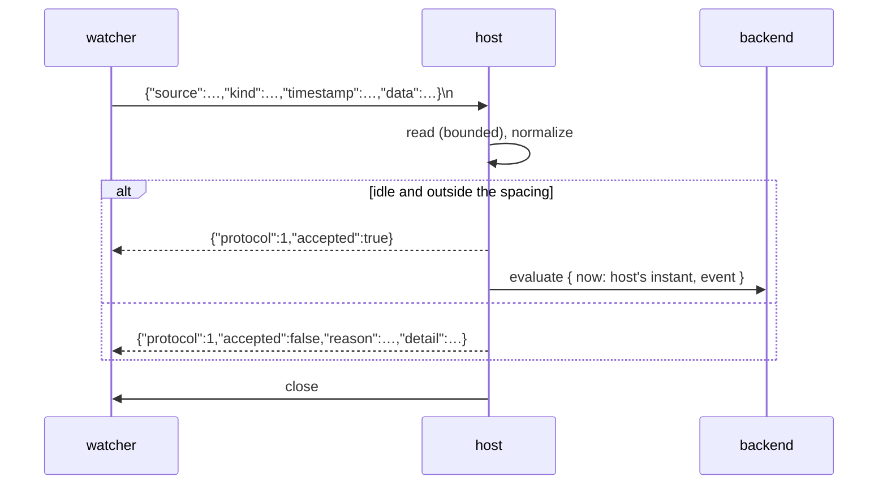

# SPEC-NNN: The host's event ingress contract

**Status:** draft
**Kind:** technical
**Owns:** the local socket a user-owned watcher writes an event to — its
lifecycle, the envelope it accepts, the reply it returns, and the closed set of
reasons an envelope may be refused.

<!-- A spec is evergreen and normative: it describes what is true now, not how
     it came to be true. No changelog, no revision history, no "we used to".
     Amending it requires explicit user endorsement.
     Requirement ids (R-N) are immutable — append, never renumber. Cite another
     spec's requirement qualified: SPEC-003/R-4. -->

> **This is a draft and is not canon.** It is slice 004's working authority
> until it is promoted, with explicit user endorsement, at that slice's audit
> and reconciliation (`docs/AGENTS.md` §*Canon that does not exist yet, or must
> change*). It takes its number at promotion. Nothing outside
> `docs/slices/004/` may cite it.

## 1. Intent

goad evaluates when it starts, when a person asks, and when a check comes due.
Nothing outside the process can make it ask its backend anything, so a
user-owned watcher that has decided *something interesting just happened* has
nowhere to say so. Brief §7 puts that watcher outside the host deliberately: the
host must not subscribe to window-manager, browser or filesystem event streams,
because filtering, classification and debouncing are the user's own code's job.

This document is the door between the two. It says what a watcher writes, what
it gets back, and what the host does with what it was given. The host reads the
envelope's *shape* — four fields, their presence and their form — and nothing
else. `data` is opaque, and `kind` is the watcher's own vocabulary carried
verbatim.

Once this exists, a watcher author can write to a published contract in any
language that can open a Unix socket, and know from the reply whether the host
took the event and, if not, which of a closed set of reasons applied. A second
host implementation can be held to the same contract.

## 2. Scope

**In scope:** the socket's path, mode and lifecycle, including what the host
does when the path is already occupied; the event envelope's wire form and the
rules that admit or refuse it; the reply's wire form; the closed set of refusal
reasons; the bounds on a single connection; and the minimum spacing's
*observable consequence* at the socket.

**Out of scope:** what a backend does with the resulting `evaluate` — that is
SPEC-001's; how the host bounds its own evaluation rate, which is SPEC-002's
subject and only *observed* here; how a next check is resolved; persistence of
an event across host restarts, of which there is none; any command-line client;
peer-credential checks and multi-user hardening; and any interpretation of an
event.

**Boundaries:** this spec abuts SPEC-001 at exactly two points. It **produces**
an `evaluate` whose event SPEC-001/R-7 shapes and whose `data` SPEC-001/R-9
protects, and it **enforces** at ingress what SPEC-001/R-56 reserves at
emission. It abuts SPEC-002 at one point: the spacing **SPEC-002/R-12** requires
of an ingested evaluation is what **this spec's own R-12** (below) makes visible
at the socket. The two are different requirements in different documents that
happen to share a number; every mention of either across a document boundary is
qualified, here and everywhere else. It reads no backend response and writes no
schedule.

The **backend** transport (brief §6.1) is a different socket, in the other
direction, under a different contract. The two share a word and nothing else.

## 3. Principles

**P-A — The envelope is shape, never meaning.** The host reads four fields'
presence and form. It compares `source` against exactly one reserved string and
otherwise interprets nothing: not `kind`, not `data`, and not how far
`timestamp` is from now. A host that branches on any of them has learned the
user's domain, which is the one thing this product refuses to do.

**P-B — Every envelope is answered, and the answer is true.** There is no
silent acceptance and no silent refusal. A reply that says *accepted* means the
host acted on it; a reply that says *refused* names which of a closed set of
reasons applied. The host holds no queue, so it never answers *accepted* for
something it has merely remembered.

**P-C — The writer decides what to do about a refusal.** Filtering, debouncing
and retry belong to the watcher (brief §7). The host's obligation ends at
telling the truth promptly, and it never delays an envelope in order to avoid
refusing it — a bound expressed as a silent delay is a bound the writer cannot
see.

## 4. Requirements

| id | requirement | verified by |
|----|-------------|-------------|
| R-1 | The host MUST bind a listening Unix domain socket if, and only if, its configuration names a path for one. With no path configured the host MUST bind nothing and MUST behave exactly as a host without this capability. | §7 |
| R-2 | The host MUST set the socket's mode to owner-only itself, and MUST NOT rely on the umask it was started under. | §7 |
| R-3 | A path that is occupied by a socket **no live host holds** MUST be reclaimed: the host unlinks it and binds. A path a **live** host holds MUST be a startup failure naming the path, and the running host MUST keep its socket. The path is inspected **without following symbolic links**, so this requirement is about a socket *at* the path and never about one a link at the path points to (R-4). | §7 |
| R-4 | A path occupied by anything that is not a socket, and any other failure to bind or to set the mode, MUST be a startup failure naming the path and what was found. A **symbolic link** at the path is one such thing: it MUST NOT be followed, and MUST be a startup failure naming it as a symlink, whatever it points at — including a socket a live host holds, which is a startup failure as a symlink rather than as R-3's in-use case. Following a link would put the owner-only mode R-2 requires on a file the configuration did not name. The host MUST NOT start without the listener its configuration asked for. | §7 |
| R-5 | The host MUST NOT unlink the socket on exit. Reclamation (R-3) is the one mechanism, so it is exercised on every ordinary restart rather than only after a crash. | §7 |
| R-6 | One connection carries exactly one envelope. The host MUST read until the first newline or until end of input, whichever comes first, and MUST NOT read further on that connection. | §7 |
| R-7 | The host MUST bound every read from a connection in both bytes and time, and both bounds MUST be stated rather than implied. Exceeding either is a refusal, reported before the connection is closed. | §7 |
| R-8 | Every envelope MUST receive exactly one reply on the same connection, after which the host closes it. The only case in which a connection may close unanswered is one in which the host process itself is gone. | §7 |
| R-9 | An envelope MUST be one JSON object carrying exactly four keys: `source`, `kind`, `timestamp` and `data`. A top-level value that is well-formed JSON but is **not an object** MUST be refused, naming the type found. A missing key, a key of the wrong type, an empty `source` or `kind`, a key the object repeats at any depth, and any key beside the four MUST each be refused, and the refusal MUST name the key. | §7 |
| R-10 | `timestamp` MUST be an RFC 3339 instant carrying an explicit UTC offset. One without an offset MUST be refused with a reason distinct from a general parse failure, exactly as SPEC-001/R-22 requires of a backend's instant. | §7 |
| R-11 | The host MUST NOT interpret `data`, MUST NOT interpret `kind`, and MUST NOT judge `timestamp` beyond its form. All four fields reach the backend as the event of an `evaluate` (SPEC-001/R-7): `source` and `kind` as the strings sent, `data` as the **value** sent — carried whole and read into nowhere — and `timestamp` as the instant sent. As with `timestamp` in §6.2, the value is preserved and its *spelling* is not: `data` round-trips through the host's JSON parser, so a key order or a numeric precision the host cannot represent is not a promise this requirement makes. The request's own `now` is the host's instant, not the envelope's. | §7 |
| R-12 | An envelope arriving while an exchange is in flight, or within the minimum spacing **SPEC-002/R-12** sets after the previous ingested evaluation the host attempted, MUST be refused naming which, and MUST NOT be queued, delayed or coalesced. The host holds no pending event. | §7 |
| R-13 | An envelope naming `source` of `"host"` MUST be refused. That value is reserved to evaluations the host originates (SPEC-001/R-56), and a backend's right to read it as such depends on this refusal. | §7 |
| R-14 | Every refusal MUST carry a machine-readable reason drawn from the closed set in §6.3, and MAY carry human-readable detail. A reader MUST NOT branch on the detail. A `too_soon` refusal MUST additionally carry `retry_after_ms`: a whole number of milliseconds, measured at the moment of refusal and **rounded up**, after which the spacing will have elapsed. Rounding up is required rather than incidental — a truncated remainder leaves a writer that waits exactly that long still inside the spacing, which would make this requirement's own sentence false of the host's own field. No other reason carries that field, and a reader MAY act on it. | §7 |
| R-15 | A refusal the host decides **while no exchange is in flight** MUST also be reported on the host's own diagnostics surface, so that it is visible to a person who is not the writer. A refusal decided while an exchange *is* in flight, and one decided after the host's loop has ended, are reported to the writer only. This is a bound on what the surface can hold, not a licence to be silent: **every envelope's** refusal reaches its writer in the reply R-8 requires. The one refusal that reaches no writer is the one that answers no envelope — the ingress-stopped `unavailable` of §6.3, for which this surface is the only report there is. | §7 |
| R-16 | No envelope, however malformed, may terminate the host, cause it to panic, or leave it unable to invoke its backend again. A malformed envelope MUST NOT reach the backend. | §7 |

## 5. Behaviour

**The ordinary case.** A watcher connects, writes one envelope terminated by a
newline or by closing its write side, and reads one line. The host normalizes
the envelope, finds itself idle and outside the spacing, answers `accepted`, and
begins an `evaluate` carrying the four fields and its own instant. Whether
anything appears on screen is the backend's decision and no part of this
contract.



**Order of judgement.** A refusal about the envelope's *shape* takes precedence
over one about the host's *state*: a malformed envelope is malformed whatever
the host was doing, and it is the more actionable thing for its writer to be
told. This holds **while an exchange is in flight as much as while the host is
idle** — a shape refusal is never reported as `engaged` because of timing.

**What the spacing looks like from outside.** The host bounds how often it
begins an ingested evaluation, and the bound is SPEC-002/R-12's. Here it is visible
as a refusal rather than as a delay (P-C): a writer emitting flat out receives
one `accepted` per spacing interval and `too_soon` for everything in between.
**Events are lost under load, by design and visibly.** The watcher decides
whether to retry, because only the watcher knows whether the event still means
anything.

An evaluation the host *attempted* and could not complete — its clock was
unreadable, say — still counts against the spacing, so a broken clock produces
one refusal per interval rather than a spin.

**When the host is stopping.** An envelope in flight when the loop ends is
refused as `unavailable`. Once the process is gone, a connection closes with no
reply; that is the single case R-8 admits.

**When ingress stops but the host does not.** Whatever accepts connections may
end while the host keeps running, and nothing restarts it. The host reports that
once, as `unavailable`, on the surface R-15 names — the only place it can, since
no envelope reaches it afterwards to be refused. This one is unconditional on
the host's state: it is reported whether the loop was idle or mid-exchange when
ingress died, which is the one exception to §6.3's rule that a refusal reaching
a person depends on which side decided it. The host itself is unaffected
and keeps evaluating (R-16).

**What the host never does.** It holds no queue and no pending event; it keeps
no record of what any source has sent; it does not deduplicate; it does not rate
a source differently from any other; and it never asks whether an event is
interesting. Each of those is the watcher's, and a host that took one on would
have to understand the domain to do it.

## 6. Interfaces & contracts

### 6.1 Configuration and the socket

The socket's path comes from the host's configuration and has no default. The
mode is owner-only. **The containing directory is the user's responsibility**: a
directory another user can write lets that user replace the socket, and the mode
does not reach that. This is a stated limit, not a defect.

**Non-normative limit — the bind race.** The check for a live holder and the
bind are not one atomic step. Two hosts starting in the same instant may both
find the path stale and both bind; the second's socket file wins and the first's
listener becomes unreachable. Both hosts continue to run, which is already true
of a host without a listener at all — nothing in this product enforces a single
instance. R-3 is a statement about a path a live host holds, not a claim that
the race is closed.

**Non-normative limit — the path after the bind.** Nothing re-probes the path
once the socket is bound, and R-5 means the host never unlinks it either. A path
unlinked or replaced underneath a live listener — by a `rm`, or by a second host
reclaiming it under R-3 — leaves that listener holding a bound descriptor no
`connect` can reach. Later writers get a connection error, and the host reports
nothing, because from its side nothing arrives. This is a stated residue and not
a defect R-1..R-16 close; the mechanism that would close it is single-instance
enforcement, which this contract does not own.

### 6.2 The envelope

```json
{ "source": "reddit-watcher",
  "kind": "reddit-opened",
  "timestamp": "2026-08-22T17:10:00+10:00",
  "data": { "count_last_hour": 4 } }
```

| field | admits | notes |
|---|---|---|
| `source` | a non-empty string, not `"host"` | the only value the host compares against (R-13) |
| `kind` | a non-empty string | the watcher's vocabulary, carried |
| `timestamp` | RFC 3339 with an explicit offset | the instant is preserved; its **spelling** is not — the host emits the canonical UTC form |
| `data` | any JSON value | opaque (SPEC-001/R-9), and the envelope's extension point; like `timestamp` above, the **value** is preserved and its spelling is not — object key order is normalized and numbers past an IEEE 754 double lose precision |

**There is no version field and none is required.** The envelope's four fields
are fixed by SPEC-001/R-7, and anything a watcher wants to add goes inside
`data`. A key beside the four is therefore a mistake rather than a newer
watcher, and R-9 refuses it by name.

### 6.3 The reply

One JSON object, newline-terminated, then the host closes.

```json
{"protocol":1,"accepted":true}
{"protocol":1,"accepted":false,"reason":"too_soon","retry_after_ms":1800,"detail":"an event-triggered evaluation began 1.2s ago; the minimum spacing is 3s"}
```

`protocol` is this contract's version, not SPEC-001's; no client speaks both.
`accepted` is present on every reply. `reason` is present exactly when
`accepted` is `false`, and is drawn from this closed set:

| reason | means | the writer's fix |
|---|---|---|
| `malformed` | the bytes were not one JSON document | the serializer |
| `invalid_envelope` | the top-level value was not a JSON object; or a missing, wrong-typed, empty, unknown or duplicated key; or a timestamp the host could not read | the envelope; `detail` names the key, or the type found |
| `reserved_source` | `source` was `"host"` (R-13) | choose another source |
| `too_large` | the envelope exceeded the byte bound (R-7) | send less, or move bulk elsewhere |
| `timed_out` | nothing complete arrived within the time bound (R-7) | terminate the envelope with a newline, or close the write side |
| `engaged` | an exchange was already in flight and the envelope's shape was good (SPEC-002/R-9) | retry, or do not |
| `too_soon` | inside the minimum spacing (R-12) | coalesce in the watcher (brief §7), or wait `retry_after_ms` |
| `unavailable` | the host cannot act on this envelope — it is stopping, its clock is unreadable, the connection faulted before the envelope could be read, or its ingress has stopped for the life of the process | `detail` says which; wait, except for the last, where nothing will change |

`detail` is prose for a person. **Nothing may branch on it**, and its wording is
not part of this contract.

**`unavailable` covers four causes, and one of them does not pass.** The host
is stopping, its clock is unreadable, or the connection faulted while the
envelope was being read — all conditions of the moment, and *wait* (or
reconnect) is sound advice for each. A transport fault is deliberately **not**
`malformed`: that reason names the writer's serializer as the thing to fix, and
a writer whose bytes never arrived did not send bad ones. The fourth cause is
that the host's ingress has stopped: whatever accepts connections has ended, and nothing restarts it, so the
condition is **permanent for the life of the process**. A host in that state
takes no further envelope, so that cause never reaches a writer as a reply; the
diagnostics surface is the only report it has, and it is reported there
whichever state the loop was in when ingress died (§5). The reason set remains closed
at the eight above — what this admits is a fourth cause of one of them, not a
ninth token.

`retry_after_ms` is the one structured thing a writer may act on beyond
`reason`. It is present exactly when `reason` is `too_soon`, it is **rounded up**
to the millisecond so that waiting exactly that long is outside the spacing
rather than one truncated remainder short of it (R-14), and it is what
keeps R-14's prohibition on branching on `detail` from leaving a writer with
only two strategies — drop, or retry blind. It is **advice, not a reservation**:
the host holds nothing on the writer's behalf, an envelope sent after it may
still be refused for another reason, and a writer that ignores it is conforming.

**Which refusals a person sees.** Every envelope's refusal reaches its writer,
always (R-8). Only those the host decides while no exchange is in flight also
reach the diagnostics surface a person reads (R-15). **Which of the eight that
is turns on which side decided the refusal**, and it is worth reading that way
rather than reason by reason, because the reason is not what settles it:

- **Decided by whatever accepts connections**, before the host's loop has seen
  the envelope at all — `malformed`, `invalid_envelope`, `reserved_source`,
  `too_large`, `timed_out`, and the `unavailable` of a connection that faulted
  mid-read. These travel to the loop *with* the envelope, so the loop's state on
  arrival is what decides their fate: they reach the surface when it happened to
  be idle, and **not otherwise**. That the negative case exists is what makes
  shape-before-state (§5) a claim rather than a convenience — the host does not
  relabel a bad envelope as `engaged`, and it does not owe a person a report of
  one it was too busy to be idle for.
- **Decided by the host's loop, and only while nothing is in flight** —
  `too_soon`, and the `unavailable` of an unreadable clock. Both are judgements
  the loop makes about its own state (§5.4's steps 3 and 4), reachable only
  when it is idle, so for these two *always* is exact.
- **Decided during an exchange, by definition** — `engaged`. It never reaches
  the surface, because the state that produces it is the state that withholds
  it.
- **Decided with no loop left to present it** — the stopping `unavailable`.
  It never reaches the surface either.
- **Answering no envelope at all** — the ingress-stopped `unavailable`, which
  travels the other way: it reaches a person here or nowhere, because there is
  no envelope left for it to be the reply to. It is reported whichever state
  the loop was in when ingress died.

A clause of this paragraph that says a refusal *always* reaches a person is
therefore making a claim about **who decides it**, not about how important it
is. One that cannot say which side decides is a clause that has not been
checked.

### 6.4 The bounds

| bound | value | why it is stated |
|---|---|---|
| bytes per **read** | 64 KiB | an unbounded read from an untrusted writer is the defect SPEC-001/R-43 names on the other socket |
| time per **read** | 500 ms | a writer that connects and never completes an envelope must not hold ingress; the value is the transport's cleanup budget's sibling |

Both are host constants. Neither is configurable, and neither is readable by a
backend or by a watcher.

**What is not bounded, and why.** These bound the *read*, not the connection. A
connection's life is `accept → read (bounded) → hand the arrival to the host →
await its judgement → reply → close`, and **the wait for judgement has no
bound**: it ends when the host judges, and the host judges on the one thread it
does everything else on. A host that is not making progress therefore delays an
arrival exactly as it delays a due check, a person's click and a backend's
answer — ingress inherits that dependency rather than adding one, and no number
here would change it, because a timeout on the wait would mean answering an
envelope the host had not judged. The consequence is that a host holds **one**
arrival at a time (§5, no queue), so an unjudged arrival stops all ingress for
as long as it lasts, and the writer waits with it rather than being told
something untrue.

**One connection at a time, so the read bound is also a denial bound.** The
host accepts, serves and closes one connection before it accepts the next, so
the per-read bound above is *also* the longest a single writer can hold off
every other. A connection that opens and writes nothing holds ingress for the
full 500 ms; two such connections a second, from any process that can open the
socket, make ingress effectively unavailable to every legitimate watcher. This
is stated because a watcher author cannot derive it from the two numbers above,
and because it is the one way an envelope fails to arrive **without a
refusal**: the stalled connections are answered `timed_out` to *their own*
writers, and a watcher whose envelopes are simply never accepted sees latency
and nothing else. The socket's owner-only mode (§6.1) bounds who can do it to
the user's own uid, which on a desktop is every application the person runs.

## 7. Verification

Each row names the kind of verification and the test that discharges it, so the
claim is checkable rather than asserted. Paths are relative to the repository
root. **This table is completed by slice 004's plan and phases**; a row naming
no test is a row this spec may not be promoted holding.

| requirement | verified by |
|---|---|
| R-1 | integration and renderer, both arms: `ingress::a_well_formed_envelope_reaches_the_judge_as_the_event_it_wrote` (`crates/goad-shell/tests/integration/ingress.rs`) — a configured path is bound and serves; `listener::none_binds_nothing` (`crates/goad/tests/renderer/startup.rs`) — no path, no file created; the pre-existing `renderer`, `event_loop` and `event_loop_schedule` targets, confirmed token-identical to `9d36002` — behaviour with the key absent is unchanged |
| R-2 | integration: `ingress::the_socket_is_owner_only_after_bind` (`crates/goad-shell/tests/integration/ingress.rs`) — the bound socket's mode is `0600` after `bind`. The host sets it **itself**, with `std::os::unix::fs::set_permissions`; no case sets a umask, because this workspace has no safe umask API and `umask(2)` is process-global while cases run in parallel |
| R-3 | integration, both arms: `ingress::a_stale_socket_with_no_listener_is_reclaimed_and_the_new_one_serves`, `ingress::a_live_socket_refuses_a_second_bind_and_keeps_serving` (`crates/goad-shell/tests/integration/ingress.rs`) |
| R-4 | integration: `ingress::a_regular_file_at_the_path_is_refused_naming_what_was_found`, `ingress::a_directory_with_no_write_permission_is_refused_naming_the_path`, `ingress::a_symlink_to_a_live_socket_is_refused_unfollowed_and_the_target_keeps_serving` — the symlink rule, on the one case where it and R-3's letter disagree (all `crates/goad-shell/tests/integration/ingress.rs`); rendered beside its eight siblings by `display_text::ingress_is_unwrapped_and_unprefixed_and_names_the_path` and `stderr_outlets::report_startup_line_renders_ingress_like_its_siblings` (`crates/goad/tests/renderer/startup.rs`). **The non-zero exit is review, not a test**: no test target links the binary, and `main`'s single `match run()` (`crates/goad/src/main.rs:21-29`) maps every `Err` to exit 2 |
| R-5 | **review, not a test.** The absence of an unlink cannot be asserted without asserting the absence of code; R-3's reclaim test is what makes the absence safe |
| R-6 | integration: `ingress::an_envelope_terminated_by_a_newline_is_accepted`, `ingress::an_envelope_terminated_by_closing_the_write_side_is_accepted`, `ingress::a_second_envelope_on_the_same_connection_is_never_read` (`crates/goad-shell/tests/integration/ingress.rs`) |
| R-7 | integration: `ingress::more_than_the_byte_limit_is_refused_too_large_and_the_limit_itself_is_accepted`, `ingress::a_connection_that_writes_nothing_times_out_and_the_listener_serves_next` (`crates/goad-shell/tests/integration/ingress.rs`) |
| R-8 | integration: every case above (R-6) reads exactly one reply line, through the shared `send_with_newline`/`send_half_closed` fixtures, and never a second; `ingress::a_dropped_answer_yields_unavailable_then_a_close` and `ingress::a_connection_accepted_after_the_judge_is_gone_is_answered_unavailable` (`crates/goad-shell/tests/integration/ingress.rs`) — a judge that goes away yields `unavailable` before the close, whether it went before the arrival was sent or after; `ingress::every_reply_is_newline_terminated_before_the_close` (same file) — §6.3's framing, asserted on the raw bytes, which is the one thing a reader that parses cannot see |
| R-9 | unit, one case per clause, all `crates/goad-shell/src/ingress/envelope.rs`: `envelope::tests::a_non_object_top_level_is_refused_naming_the_type_found` (the type found); `each_of_the_four_keys_missing_is_refused_naming_it` (missing); `each_typed_key_wrong_typed_is_refused_naming_it` (wrong-typed); `an_empty_source_or_kind_is_refused_naming_it` (empty); `a_fifth_key_beside_the_four_is_refused_naming_it` (unknown); `a_top_level_duplicate_key_is_refused_naming_it` and `a_duplicate_key_nested_inside_data_is_refused_naming_it` (duplicated, at both depths) |
| R-10 | unit: `envelope::tests::an_offsetless_instant_is_refused_distinctly_from_an_unparseable_one` (`crates/goad-shell/src/ingress/envelope.rs`) |
| R-11 | integration end to end: `ingress::a_well_formed_envelope_produces_one_evaluation_carrying_all_four_fields` (`crates/goad/tests/renderer/ingress.rs`) — the backend's recorded request carries `source` and `kind` as sent, `data` as the same JSON **value** (compared as a value, which is what this requirement claims) and `timestamp` as the same instant, with `now` the host's own |
| R-12 | integration and renderer, all `crates/goad/tests/renderer/ingress.rs` unless noted: `ingress::an_envelope_arriving_during_an_exchange_is_refused_engaged_before_it_completes`; `ingress::a_second_envelope_inside_the_spacing_is_refused_too_soon_and_says_how_long`; `ingress::a_flat_out_writer_raises_no_evaluation_rate_and_costs_one_presentation_per_refusal` — a writer emitting flat out produces a bounded number of evaluations over a window far shorter than the spacing, the excess replies name the bound, and the same test **records** the number of presentations the host makes over that window (measured 845/845, 1.000 per refusal, ~1690/s — F-15's settlement) rather than merely detecting a rate; `tests::a_writer_arriving_exactly_at_the_anchor_is_outside_the_spacing` (`crates/goad/src/controller.rs`) — the spacing's own boundary, refused on `<` and not `<=`. The anchor's independence in **three** directions: `ingress::an_ingested_firing_never_writes_the_scheduled_floor`; `ingress::an_ingested_firing_does_not_advance_the_scheduled_floor` — the case ADR-004 says no standing test could reach, CD-3's discharge — a scheduled firing at T₀, an ingested firing at T₀+ε **whose own exchange resolves to a deadline no later than T₀+1 s**, and a `next_check` due at T₀+1 s do not put a scheduled evaluation at the backend before T₀+3 s; `ingress::a_scheduled_firing_does_not_clear_the_event_floor` |
| R-13 | unit and integration, in two halves: `envelope::tests::a_reserved_source_is_refused_with_every_other_field_valid` (`crates/goad-shell/src/ingress/envelope.rs`) — the `EnvelopeFault`, unit-level; `ingress::the_three_shape_reasons_this_phase_owns_are_read_off_the_wire` (`crates/goad-shell/tests/integration/ingress.rs`) — `reserved_source` as its own wire reason, read off the wire |
| R-14 | integration: `ingress::the_reason_token_set_is_closed_at_eight` — the eight-way mapping, and a token **renamed** or **removed** from `Refusal::reason()`'s match, both held by assertion. A token **added** is held differently and this row says so rather than overclaiming it: the case's own `match` has no `_` arm over `Refusal`'s variants or `UnavailableCause`'s and is the source of the set it compares, so a ninth reason fails to **compile** in that file — the suite is red until someone edits it — but whether the assertion then also fails depends on that author adding a witness beside the arm the compiler made them write. Rust cannot force that without a derive macro or an enumeration crate, neither of which is on this manifest. **A second implementation should read the added direction as compile gate plus review, not as an assertion.** The three measured results are in the case's doc comment; `ingress::a_too_soon_reply_carries_retry_after_ms_rounded_up` and `ingress::retry_after_ms_is_absent_from_every_reason_but_too_soon` — the field, present on `too_soon` alone, and the rounding (both `crates/goad-shell/tests/integration/ingress.rs`); `tests::a_writer_arriving_exactly_at_the_anchor_is_outside_the_spacing` (`crates/goad/src/controller.rs`) — the other side of the same equation: rounding up is only true *of the host* if the spacing check refuses on `<`, so a writer that waits exactly `retry_after_ms` is accepted |
| R-15 | renderer, both `crates/goad/tests/renderer/ingress.rs`: `ingress::a_too_soon_refusal_decided_while_idle_reaches_the_diagnostics_surface` (positive) and `ingress::a_shape_refusal_decided_during_an_exchange_does_not_reach_the_diagnostics_surface` (negative — what makes the bound a claim rather than an excuse); `ingress::a_dead_accept_task_is_folded_once_parks_the_arm_and_leaves_the_host_evaluating` and `ingress::ingress_stopping_during_an_exchange_still_reaches_the_diagnostics_surface` (same file) — the last clause from both sides: the ingress-stopped `unavailable` is the one refusal that answers no envelope, and it reaches the surface whether the loop was idle or mid-exchange when ingress died |
| R-16 | integration and renderer: `ingress::a_malformed_envelope_reaches_no_event_and_the_listener_stays_up` (`crates/goad-shell/tests/integration/ingress.rs`); `ingress::after_a_flood_of_malformed_envelopes_the_host_still_evaluates`, `ingress::a_dead_accept_task_is_folded_once_parks_the_arm_and_leaves_the_host_evaluating` (`crates/goad/tests/renderer/ingress.rs`) |

## 8. Open questions

- **OQ-1. Answered, and no longer open.** The reply says when a `too_soon`
  writer may retry, as `retry_after_ms` (R-14, §6.3). The host computes the
  value at the moment of refusal whatever it does with it, and putting it on the
  wire later would be a change to a versioned contract whose first real client
  is one slice away. What stays out is any reservation or fairness guarantee
  attached to it — see P-C.
- **OQ-2.** Whether a watcher should be able to learn the spacing without
  provoking a refusal. Nothing in this contract carries host policy toward a
  writer, and inventing a channel for it here would be the wrong place — the
  same reason SPEC-002/OQ-2 gives for the backend side.
- **OQ-3.** Whether an ingested evaluation should be distinguishable on the
  host's diagnostics surface when it is *accepted*, not only when refused. The
  writer already has its own answer; this is about the person who is not the
  writer.
- **OQ-4.** SPEC-002/OQ-4, carried and not answered here: an ingested evaluation
  can supersede a view a person is mid-answering. A second stimulus raises the
  rate at which that is reached and changes nothing else about it.

## 9. References

- SPEC-001 (the host/backend interaction protocol) — R-7 and R-9, the event this
  contract produces and the opacity it preserves; R-22, the offset rule R-10
  mirrors; R-45, R-46 and R-47, which R-16 restates for a second untrusted
  input; R-56, whose reservation R-13 enforces.
- SPEC-002 (the host's scheduling behaviour) — R-5, which obliged slice 004 to
  bound this stimulus separately; R-9, the one-exchange rule `engaged` reports;
  and **SPEC-002/R-12**, the requirement that states the ingested spacing
  itself. Qualified deliberately: this spec has an R-12 of its own, and the two
  are the two sides of one seam rather than one requirement cited twice.
- ADR-001 (one-way strata) — event ingress is stratum 2's by name. It names
  wire-to-canonical normalization as stratum 1's, and the envelope is both, so
  the placement is a decision ADR-001 §Consequences requires be made
  deliberately: the envelope normalizes beside the listener because that is
  where *this* contract lives, while stratum 1's normalization holds SPEC-001's.
  The record of that decision is the ADR slice 004 writes at reconciliation.
- ADR-004 (the scheduled anchor) — why an ingested evaluation neither clears the
  scheduled anchor nor is bounded by it.
- `docs/brief.md` §7 (external event ingress and what stays in the watcher),
  §19 (the representative externally-triggered scenario).
- `docs/slices/004/design.md` — the design this contract was written from.
