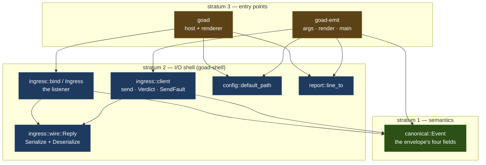
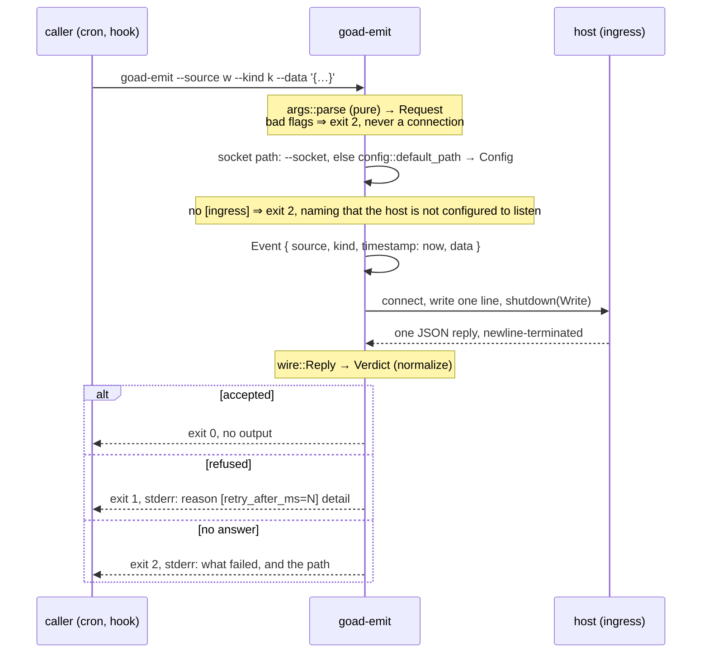

# Design — Slice 005: `goad emit`

## 1. Design problem

004 gave the host a listening socket and wrote SPEC-003 to say exactly what may
arrive on it and what comes back. Nothing writes to it but a hand-rolled `socat`
line. This slice adds the writer: one command that builds an envelope, sends it,
reads the one reply, and turns that reply into an exit code.

The boundary of this design is **the client half of a contract that already
exists**. No wire format is invented here, no reason token is added, nothing
about the host's judgement changes. If this design finds itself arguing about
what the host should do, it has wandered.

## 2. Current state

- The listener, the envelope's normalization, the refusal vocabulary and the
  reply writer are all in `crates/goad-shell/src/ingress/` (`research.md` is
  thin by design here — slice 004's `notes.md` Harvest is the record).
- The reply's wire form is `ingress::mod::Wire`, **private**, `Serialize` only,
  built by the private `reply(accepted, refusal)` at `ingress/mod.rs:592`.
- `goad_semantics::protocol::canonical::Event` already *is* the envelope's four
  fields — `source`, `kind`, `timestamp`, `data` — and derives `Serialize`.
  `Timestamp`'s `Serialize` is `collect_str` over jiff's `Display`, which is the
  RFC 3339 form SPEC-003/R-10 requires, offset included.
- The configuration-path rule lives inside `crates/goad/src/startup.rs::arguments`,
  in a stratum-3 crate that links Slint.
- `crates/goad` writes to stderr through a pure `*_line` function plus a private
  `line_to(sink, line)` (`diagnostics.rs:312`), because `clippy::print_stdout`
  and `print_stderr` are denied workspace-wide.
- `clippy.toml` disallows `std::env::var` and `std::process::exit`; `main`
  returns `ExitCode`, and env is read through an injected closure.

## 3. Forces & constraints

- **SPEC-003 §6.2, §6.3, R-6, R-8, R-10, R-13, R-14** bind the bytes in both
  directions. R-14 in particular: a reader **may** act on `retry_after_ms` and
  **must not** branch on `detail`.
- **ADR-001.** The new member is stratum 3, which that ADR names in terms:
  *entry points — the Slint renderer, command-line binaries*. It may name both
  strata below it; nothing may name it.
- **ADR-005's reasoning**, not just its decision: what places a normalization is
  **which contract it holds, not which shape it has**.
- **POL-001.** `just check` is unchanged and gains no column. No new gate
  instrument (slice OQ-3).
- **CLAUDE.md invariant 2.** Permissive on the wire, canonical inside. A reply
  from a newer host with a field emit does not model is not an error; a reply
  that is *ambiguous* about whether the host accepted the envelope is.

## 4. Guiding principles

1. **The CLI is wiring.** Anything that can be a pure function over its inputs
   is one, and it lives below the binary. `main` is the only place that reads a
   clock, an environment, a file or a socket.
2. **One definition per wire field.** The host writes the reply and emit reads
   it; if those are two structs, they will disagree. Same for the envelope,
   which is `Event` on both sides.
3. **Exit codes are about who was wrong.** 1 means the host refused it — the
   caller's envelope or timing. 2 means emit could not get an answer at all.
   Nothing collapses the two, because a retry wrapper branches on exactly that.

## 5. Proposed design

### 5.1 System model



The load-bearing choice: **`WIRE` has one definition with both directions on
it**, and `CLIENT` sits beside `LISTEN` rather than inside the binary. That is
ADR-005's reasoning applied to the contract's other half, and it is what lets
every client behaviour be tested against the **real** listener in one process,
with no binary and no second machine.

### 5.2 Interfaces & contracts

**`goad-shell`, new or changed:**

```rust
// config.rs — the rule, lifted from crates/goad/src/startup.rs
pub fn default_path(env: &dyn Fn(&str) -> Option<OsString>) -> Option<PathBuf>;

// report.rs — lifted verbatim from crates/goad/src/diagnostics.rs
pub fn line_to(sink: impl std::io::Write, line: &str);

// ingress/wire.rs — was the private `Wire`, now shared and both ways
#[derive(Serialize, Deserialize)]
pub struct Reply {
  pub protocol: u8,
  pub accepted: bool,
  #[serde(default, skip_serializing_if = "Option::is_none")] pub reason: Option<String>,
  #[serde(default, skip_serializing_if = "Option::is_none")] pub retry_after_ms: Option<u64>,
  #[serde(default, skip_serializing_if = "Option::is_none")] pub detail: Option<String>,
}

// ingress/client.rs — the client half of SPEC-003
pub fn send(socket: &Path, event: &Event) -> Result<Verdict, SendFault>;

pub enum Verdict {
  Accepted,
  Refused { reason: String, retry_after_ms: Option<u64>, detail: Option<String> },
}

pub enum SendFault {
  Unreachable(io::Error),   // no socket at the path, or connect refused
  Faulted(io::Error),       // the connection broke mid-exchange
  NoReply,                  // closed with nothing on it — R-8 says this is the host being gone
  Unreadable(serde_json::Error), // bytes arrived, not one JSON object
  Ambiguous(&'static str),  // parsed, but says nothing usable — see 5.5
}
```

**The CLI surface**, with one doc-table row per behaviour, as
`startup::arguments` does:

```
goad-emit --source S --kind K [--data JSON] [--socket PATH]
goad-emit -h | --help
goad-emit --version
```

`--source` and `--kind` are required and non-empty. `--data` defaults to JSON
`null` and is parsed locally. `--socket` overrides configuration and consults no
configuration at all.

**`goad-emit`, all of it:**

```rust
// args.rs — pure
pub fn parse(argv: impl Iterator<Item=OsString>) -> Result<Invocation, UsageError>;
pub enum Invocation { Send(Request), Help, Version }
pub struct Request { source: String, kind: String, data: serde_json::Value, socket: Option<PathBuf> }

// render.rs — pure; every line the binary can print, with no sink
pub fn accepted_line() -> Option<String>;          // None: silence is the success report
pub fn refused_line(verdict: &Verdict) -> String;
pub fn fault_line(fault: &SendFault, path: &Path) -> String;
pub fn usage_error_line(error: &UsageError) -> String;

// main.rs — the only impure file: env, clock, config read, socket, exit code
```

### 5.3 Data, state & ownership

Nothing is stored and nothing persists. One invocation owns one `Request`, one
`Event` built from it plus the clock, one connection, one `Verdict`. The socket
path is either the `--socket` argument or `config.ingress.path` read once. The
host owns every judgement; emit owns only the exit code it derives from one.

### 5.4 Lifecycle & dynamics



Connect, write, read, exit. No retry, no timeout of emit's own — the host bounds
its side (R-7), and a caller that wants a deadline has `timeout(1)`.

### 5.5 Invariants, assumptions & edge cases

- **Ambiguity fails; ignorance does not.** A reply object with an unknown field
  is fine. A reply that is valid JSON but carries no `accepted`, or carries
  `accepted: false` with no `reason`, is `SendFault::Ambiguous` and exit 2 — emit
  never guesses whether an envelope was taken.
- **An unknown reason token prints verbatim** and is still exit 1. The set is
  closed at eight today; a ninth from a newer host is a refusal emit can report
  without understanding.
- **`retry_after_ms` is reported, never obeyed.** SPEC-003 calls it advice, not
  a reservation, and obeying it would make emit the retry loop it is not.
- **`source: "host"` is not pre-empted.** Emit sends it and reports the host's
  `reserved_source` refusal (AC-5), because duplicating R-13 client-side would
  leave the host's own rule untested from the only side that exercises it.
- **Assumption:** `Event`'s `Serialize` output is exactly SPEC-003 §6.2's four
  keys, no more. If a field is ever added to `Event` for SPEC-001's benefit, it
  silently widens this envelope — a test pins the serialized key set.
- **Assumption:** one blocking `UnixStream` needs no runtime. Emit therefore
  carries no `tokio`; `goad-shell` already does, for the listener.
- **Edge:** a `--data` value that is valid JSON but enormous is the host's to
  refuse (`too_large`, R-7). Emit does not second-guess the byte bound.

## 6. Open questions

None. OQ-1..OQ-7 are struck in `slice-005.md` with their answers and dates; the
one that could have raised the tier (OQ-3, the allowlist row) is answered *no*,
with the gap it leaves recorded under Follow-ups as stratum 3's rather than this
crate's.

## 7. Decisions, rationale & alternatives

| id | decision | rejected | why |
|----|----------|----------|-----|
| D-1 | The client lives in `goad-shell`, beside the listener | client code inside `goad-emit` | ADR-005's reasoning: the reply is half a contract stratum 2 owns. It also puts every client case within reach of the real listener in one process |
| D-2 | One `wire::Reply`, `Serialize` + `Deserialize` | a separate client-side struct | two definitions of one wire object drift, and nothing would fail when they did |
| D-3 | `Event` is the envelope, serialized directly | a client-side envelope struct | it is already exactly the four fields; a second struct is D-2's mistake in the other direction |
| D-4 | Three exit codes: 0, 1 refused, 2 could not send | one non-zero; a code per reason | a wrapper must distinguish *refused* from *unreachable* without parsing prose (R-14 forbids branching on `detail`); a code per reason couples the CLI to a set SPEC-003 may extend |
| D-5 | `--data` parsed locally, defaulting to `null` | send the bytes verbatim | emit serializes with `serde_json` anyway, so the parse is free and turns a round trip into a local message. Re-serialization normalizes spelling, which §6.2 already declines to promise |
| D-6 | Hand-rolled argument parsing | `clap` | four flags; `startup::arguments` is the prior art; a dependency no stratum needs is paid for in every gate run |
| D-7 | Success is silent | a line on stdout | a cron job that prints on success trains its owner to ignore its output. The exit code is the report |
| D-8 | No allowlist row for stratum 3 (slice OQ-3) | a row for `goad-emit` | it would extend POL-001's instrument to a stratum it never covered — new policy, tier 2 — to prevent something the crate edge already prevents |

## 8. Risks & mitigations

| id | risk | mitigation | signal |
|----|------|------------|--------|
| R-1 | The `Wire` → `wire::Reply` change breaks the host's reply bytes | the existing 004 reply tests (`ingress.rs`) are the regression net, unchanged; the type's fields and skip attributes are preserved exactly | a 004 ingress test goes red in PHASE-01 |
| R-2 | Moving `line_to` and the config rule perturbs `crates/goad` | both are lifts, not rewrites; the existing `startup.rs` and `diagnostics.rs` tests stay and must pass untouched | any assertion in those files needs editing — which means it was not a lift |
| R-3 | A test asserts a proxy for "the envelope arrived intact" | AC-6 is phrased as what a test can see, and the case reads the **normalized `Event`** the listener produces, not emit's own bytes | reviewing the case, ask: would it still pass if `--data` were dropped on the floor? |
| R-4 | Emit grows a feature — retry, watching, a config of its own | the non-goals are in `slice-005.md`, and 007 is where use, not speculation, reopens them | a phase sheet that needs a new flag |

## 9. Validation

- **Pure units:** `args::parse` one case per doc-table row, including both
  missing-required flags, an empty `--source`, an unparseable `--data`, and
  `--socket` with `--data` absent. `render::*` asserted as strings.
- **Against the real listener** (`goad-shell` integration tier, reusing 004's
  `judge` fixture): accepted, each refusal shape, `retry_after_ms` surviving the
  round trip, an unknown reason token, a reply with an unknown field, an
  ambiguous reply, a path with nothing listening, and a listener that closes
  with no reply.
- **The built binary** (`goad-emit` integration tier, `CARGO_BIN_EXE_goad-emit`):
  exit 0 / 1 / 2, one case each, plus the AC-6 case that reads the `Event` the
  listener normalized out of what the binary actually sent.
- **A person** (AC-8): `just demo`, an `emit` from another terminal, the view
  changes.

## 10. Canon impact

**None.** SPEC-003 already specifies both halves of this exchange; this slice
implements the half nothing implemented. No spec, policy or ADR is amended, and
no gate instrument is added or changed. If any phase finds itself writing a
normative sentence, that is the signal to stop and raise the tier.
