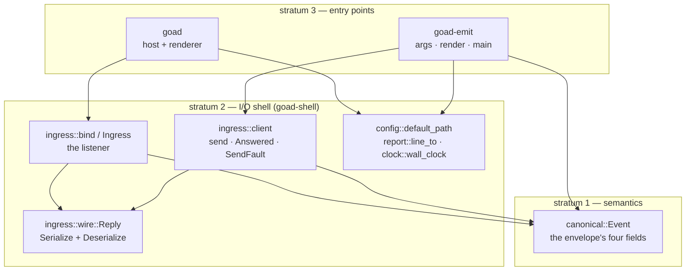
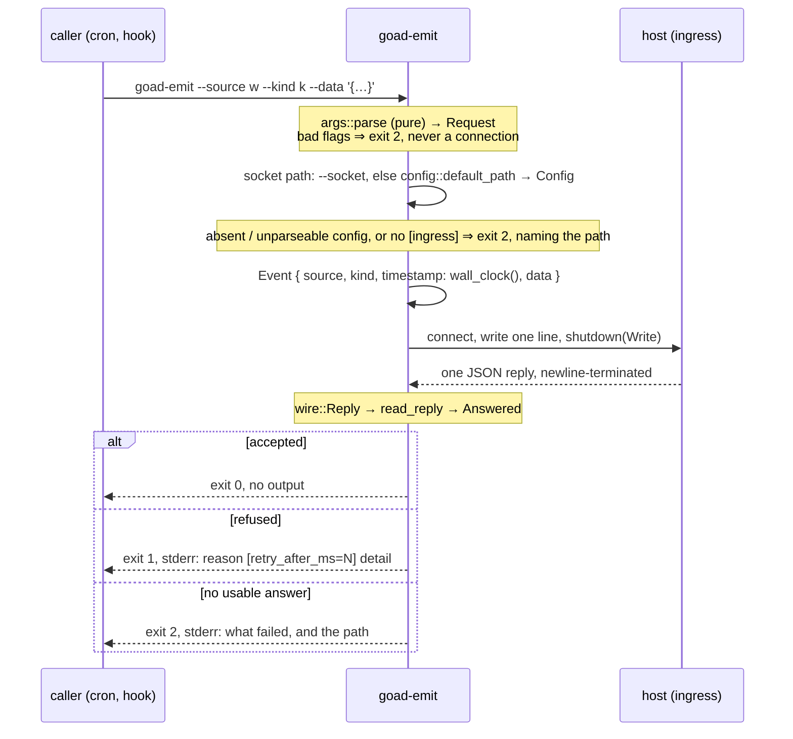

# Design — Slice 005: `goad emit`

## 1. Design problem

004 gave the host a listening socket and wrote SPEC-003 to say exactly what may
arrive on it and what comes back. Nothing writes to it but a hand-rolled `socat`
line. This slice adds the writer: one command that builds an envelope, sends it,
reads the one reply, and turns that reply into an exit code.

The boundary is **the client half of a contract that already exists**: no wire
format is invented, no reason token added, nothing about the host's judgement
changed. If this design argues about what the host should do, it has wandered.

## 2. Current state

- The listener, the envelope's normalization, the refusal vocabulary and the reply
  writer are all in `crates/goad-shell/src/ingress/`. `bind` needs a Tokio runtime
  (`mod.rs:155-166`); `envelope::normalize` is public and pure (`envelope.rs:95`).
- The reply's wire form is `ingress::mod::Wire` — **private**, `Serialize` only,
  built by `reply(accepted, refusal)` (`mod.rs:592`).
- `canonical::Event` already *is* the envelope's four fields and derives
  `Serialize`; `Timestamp`'s `Serialize` is `collect_str` over jiff's `Display`,
  the RFC 3339 form R-10 wants.
- Three things the CLI needs live in `crates/goad`, which links Slint: the
  configuration-path rule inside `startup::arguments`; the sink
  `diagnostics::line_to:312`; and **`clock::wall_clock`**, which exists because
  `jiff::Timestamp::now()` is unavailable — jiff is `default-features = false`
  workspace-wide and enabling `std` in stratum 3 unifies into stratum 1's build
  (`clock.rs:43-47`, POL-001's residue).
- `clippy.toml` disallows `std::env::var` and `std::process::exit`;
  `print_stdout`/`print_stderr` and `missing_debug_implementations` are denied.

## 3. Forces & constraints

- **SPEC-003 §6.2, §6.3, §6.4, R-6, R-8, R-10, R-13, R-14** bind the bytes both
  ways, and §6.4 binds what a writer may expect about *time*.
- **ADR-001.** The new member is stratum 3 — *entry points — the Slint renderer,
  command-line binaries*. It may name both strata below; nothing may name it.
- **ADR-003 §Consequences/Negative** says a new member needs its own manifest
  allowlist entry; D-8 disposes of that sentence explicitly. **ADR-005's
  reasoning:** what places a normalization is which contract it holds, not which
  shape it has.
- **CLAUDE.md invariant 2.** Permissive wire, canonical inside; an *ambiguous*
  message fails rather than being guessed at. A field emit does not model is not
  an error — including `protocol`.

## 4. Guiding principles

1. **The CLI is wiring.** Anything that can be a pure function over its inputs is
   one, and lives below the binary; `main` alone reads a clock, an environment, a
   file or a socket.
2. **One definition per wire field.** The host writes the reply and emit reads
   it; two structs would drift. Same for the envelope, which is `Event` on both
   sides.
3. **Exit codes are about who was wrong.** 1 means the host refused it — the
   caller's envelope or timing, with a reason token to branch on. 2 means emit
   got no usable answer, *including* a reply the host should not have sent.

## 5. Proposed design

### 5.1 System model



The load-bearing choice: **`WIRE` has one definition with both directions on it**
and `CLIENT` sits beside `LISTEN`, not inside the binary — ADR-005's reasoning
applied to the contract's other half, and what lets every client behaviour be
tested against the **real** listener in one process.

### 5.2 Interfaces & contracts

**`goad-shell`, new or changed** — the first three are lifts, not rewrites:

```rust
pub fn config::default_path(env: &dyn Fn(&str) -> Option<OsString>) -> Option<PathBuf>;
pub fn report::line_to(sink: impl std::io::Write, line: &str);
pub fn clock::wall_clock() -> Result<Timestamp, ClockError>;   // with ClockError

// ingress/wire.rs — was the private `Wire`, now shared and both ways
#[derive(Debug, PartialEq, Serialize, Deserialize)]
pub struct Reply {
  pub protocol: Option<u8>,          // optional on READ (invariant 2); always written
  pub accepted: Option<bool>,        // likewise; absence is the host's breach, not a guess
  #[serde(default, skip_serializing_if = "Option::is_none")] pub reason: Option<String>,
  #[serde(default, skip_serializing_if = "Option::is_none")] pub retry_after_ms: Option<u64>,
  #[serde(default, skip_serializing_if = "Option::is_none")] pub detail: Option<String>,
}

// ingress/client.rs — the client half of SPEC-003
pub fn send(socket: &Path, event: &Event) -> Result<Answered, SendFault>;
pub fn read_reply(reply: Reply) -> Result<Answered, SendFault>;   // pure; no socket

pub enum Answered {
  Accepted,
  Refused { reason: String, retry_after_ms: Option<u64>, detail: Option<String> },
}

pub enum SendFault {
  Unreachable(io::Error),        // nothing listening at the path, or connect refused
  Faulted(io::Error),            // the connection broke mid-exchange
  NoReply,                       // closed with nothing on it — R-8 says the host is gone
  Unreadable(serde_json::Error), // bytes arrived, not one JSON object: `[1,2]`, `not json`
  NonConforming(&'static str),   // parsed, but breaches §6.3 — see 5.5
}
```

`Answered`, not `Verdict`: the integration tier's fake judge already owns
`Verdict` for the other end of the same exchange (F-7).

**The CLI surface**, one doc-table row per behaviour, as `startup::arguments` has:

```
goad-emit --source S --kind K [--data JSON] [--socket PATH]
goad-emit -h | --help
goad-emit --version
```

`--source` and `--kind` are required and non-empty. `--data` defaults to JSON
`null` and is parsed locally. `--socket` overrides configuration and consults no
configuration at all.

**`goad-emit`, all of it:**

```rust
// args.rs — pure
pub fn parse(argv: impl Iterator<Item=OsString>) -> Result<Invocation, UsageError>;
pub enum Invocation { Send(Request), Help, Version }
pub struct Request { source: String, kind: String, data: serde_json::Value, socket: Option<PathBuf> }

// render.rs — pure; every line the binary can print, with no sink
pub fn refused_line(answered: &Answered) -> String;
pub fn fault_line(fault: &SendFault, path: &Path) -> String;
pub fn usage_error_line(error: &UsageError) -> String;
pub fn startup_error_line(error: &StartupFault) -> String;   // config absent, unparseable, no [ingress]

// main.rs — the only impure file: env, clock, config read, socket, exit code
```

### 5.3 Data, state & ownership

Nothing is stored and nothing persists. One invocation owns one `Request`, one
`Event`, one connection, one `Answered`; the socket path is `--socket` or
`config.ingress.path`, read once. The host owns every judgement; emit owns only
the exit code it derives from one.

### 5.4 Lifecycle & dynamics



**The wait for judgement has no bound, and that is the contract, not a defect.**
R-7 bounds *reads*, not the connection; SPEC-003 §6.4 states that a host not
making progress delays an arrival as it delays a due check, and *"the writer
waits with it rather than being told something untrue."* One connection is served
at a time, so an unjudged arrival stops all ingress while it lasts. Emit
therefore **blocks indefinitely by design**; a caller needing a deadline wraps it
(`timeout 5 goad-emit …`). A `--timeout` of emit's own is a Follow-up — its
absence is D-10, not oversight.

### 5.5 Invariants, assumptions & edge cases

- **A breach of §6.3 is exit 2, named as the host's.** A reply with no
  `accepted`, or `accepted: false` with no `reason`, is `NonConforming`: emit
  cannot report a reason token a wrapper may branch on, so exit 1 would be the
  untruth. **`{}` is one of these**, not a parse failure — every field is
  `Option`, so it deserializes and then breaches §6.3 by carrying no `accepted`
  (measured, F-13). `Unreadable` is for bytes that are not one JSON object at
  all: `[1,2]`, `not json`.
- **`protocol` is optional on read.** Requiring it would narrow what emit accepts
  from a conforming-enough host for a field emit does not use (invariant 2). The
  host still writes it on every reply.
- **An unknown reason token prints verbatim** and is still exit 1. The set is
  closed at eight today; a ninth from a newer host is a refusal emit can report
  without understanding.
- **`retry_after_ms` is reported, never obeyed** — §6.3 calls it advice.
- **`source: "host"` is not pre-empted.** Emit sends it and reports the host's
  `reserved_source` refusal (AC-5); duplicating R-13 client-side would leave the
  host's own rule untested from the only side that exercises it.
- **Discovery covers the host's *default* path only.** The host also accepts a
  configuration path as a positional argument, and emit has no equivalent — so a
  host started on an explicit configuration (`just demo` is one) is reached with
  `--socket`. A `--config` flag is a Follow-up (F-6).
- **Assumption:** `Event`'s `Serialize` output is exactly §6.2's four keys.
  Verified today; a field added to `Event` for SPEC-001's benefit would silently
  widen this envelope, so a test pins the key set.
- **Edge:** a `--data` value that is valid JSON but enormous is the host's to
  refuse (`too_large`, R-7). **Emit does not second-guess the byte bound**, for
  the reason it does not pre-empt R-13: a client that duplicated a host rule
  would leave that rule untested from the only side that exercises it. Nothing
  in this slice holds R-7 — 004's listener cases do (F-15).
- **Assumption:** one blocking `UnixStream` needs no runtime, so emit carries no
  `tokio` — and, after the clock lift, no `jiff` either.

## 6. Open questions

None. OQ-1..OQ-7 are struck in `slice-005.md` with their answers and dates; OQ-6's
reasoning about `jiff::Timestamp::now()` was wrong and is corrected there (F-1),
and OQ-3's tier argument is completed by D-8 (F-3).

## 7. Decisions, rationale & alternatives

| id | decision | rejected | why |
|----|----------|----------|-----|
| D-1 | The client lives in `goad-shell`, beside the listener | client code inside `goad-emit` | ADR-005's reasoning: the reply is half a contract stratum 2 owns. It also puts every client case within reach of the real listener in one process |
| D-2 | One `wire::Reply`, `Serialize` + `Deserialize` | a separate client-side struct | two definitions of one wire object drift, and nothing fails when they do |
| D-3 | `Event` is the envelope, serialized directly | a client-side envelope struct | it is already exactly the four fields |
| D-4 | Three exit codes: 0, 1 refused, 2 no usable answer | one non-zero; a code per reason | a wrapper must distinguish *refused* from *could not get an answer* without parsing prose (R-14); a code per reason couples the CLI to a set SPEC-003 may extend |
| D-5 | `--data` parsed locally, defaulting to `null` | send the bytes verbatim | emit serializes with `serde_json` anyway; the parse turns a round trip into a local message. Re-serialization normalizes spelling, which §6.2 already declines to promise |
| D-6 | Hand-rolled argument parsing | `clap` | four flags; `startup::arguments` is the prior art; a dependency no stratum needs is paid for in every gate run |
| D-7 | Success is silent | a line on stdout | a cron job that prints on success trains its owner to ignore its output |
| D-8 | No allowlist row for stratum 3 | a row for `goad-emit` | POL-001 §Verification scopes the instrument to *"a stratum 1 or 2 manifest"*; `allowlist.rs:8-11` exempts `goad` as unconstrained stratum 3. **ADR-003 §Consequences/Negative says a new member needs one** — a sentence already untrue of `crates/goad`, so it states a review obligation over-broadly, and this slice discharges it by deciding in the open rather than by silence. A row would extend the instrument to a stratum it never covered: new policy, tier 2, to prevent what the crate edge already prevents (AC-7). Stratum 3's unbilled manifest is a Follow-up, and it is `goad`'s as much as emit's |
| D-9 | `clock::wall_clock` moves to stratum 2 | `jiff::Timestamp::now()` in emit; copying `wall_clock` | `Timestamp::now` needs jiff's `std`, which unifies into stratum 1's build — `clock.rs:43-47` refused it already, and POL-001's residue makes enabling it a decision this slice has no reason to take. Copying duplicates a judgement, which OQ-4 refused for four lines and would refuse harder here. After the lift, emit needs no `jiff` at all |
| D-10 | No deadline of emit's own | `--timeout SECS`; a default timeout | §6.4 makes the unbounded wait the contract; a deadline makes emit report *no answer* about an envelope the host may be mid-judging, which is the untruth §6.4 exists to avoid. `timeout 5 goad-emit …` is one word in a cron line |
| D-11 | `protocol` and `accepted` optional on read | required fields | invariant 2: emit must not narrow what it accepts for a field it does not use. Absence of `accepted` is a *named breach*, not a parse failure |

## 8. Risks & mitigations

| id | risk | mitigation | signal |
|----|------|------------|--------|
| R-1 | The `Wire` → `wire::Reply` change alters the host's reply bytes | 004's reply tests are the regression net, unchanged; field order and skip attributes preserved; only `reason`'s ownership changes | a 004 ingress test goes red in PHASE-01 |
| R-2 | The four lifts perturb `crates/goad` | all are moves; existing `startup.rs`, `diagnostics.rs`, `clock.rs` tests stay and must pass untouched | an assertion in those files needs editing — which means it was not a lift |
| R-3 | A test asserts a proxy for "the envelope arrived intact" | AC-6's case reads the `Event` produced by the **real** `envelope::normalize` over the bytes the binary sent | ask of the case: would it pass if `--data` were dropped on the floor? |
| R-4 | A wedged host hangs an unattended caller indefinitely (§6.4) | documented in `--help` and D-10; `timeout(1)` is the answer; `--timeout` is a Follow-up if use gets bitten | a cron job that never returns |
| R-5 | Emit grows a feature — retry, watching, a config of its own | the non-goals are in `slice-005.md`; 007 reopens them on use, not speculation | a phase sheet that needs a new flag |

## 9. Validation

Four tiers. The cases are `plan.md`'s Coverage table and its VT ids; restating
them here would put one list in two homes.

- **Pure units** — `args::parse`, `read_reply` over every `Reply` shape,
  `render::*` as strings.
- **The real listener** (`goad-shell` tier, extending 004's `judge`) — the
  exchange, every refusal shape, `reserved_source` from a real `"host"` envelope,
  an unknown token, an unknown field. **This tier holds R-6's framing**: a client
  that framed wrongly draws `timed_out` and reds the case.
- **The built binary** (`goad-emit` tier) — three exit codes and the bytes it
  sends, against a blocking `std` fake, asserted through the real
  `envelope::normalize`. **R-7's bounds are held nowhere in this slice**: 004's
  listener cases hold them, and emit does not second-guess them (F-15).
- **A person** (AC-8) — `just demo`, then `goad-emit --socket ./goad-demo.sock …`.
  The backend leg is here or nowhere.

## 10. Canon impact

**None.** SPEC-003 specifies both halves of this exchange; this slice implements
the half nothing implemented. No spec, policy or ADR is amended, and no gate
instrument is added or changed. D-8 records the one canon sentence that pulls the
other way and why it is not followed. If any phase finds itself writing a
normative sentence, that is the signal to stop and raise the tier.
