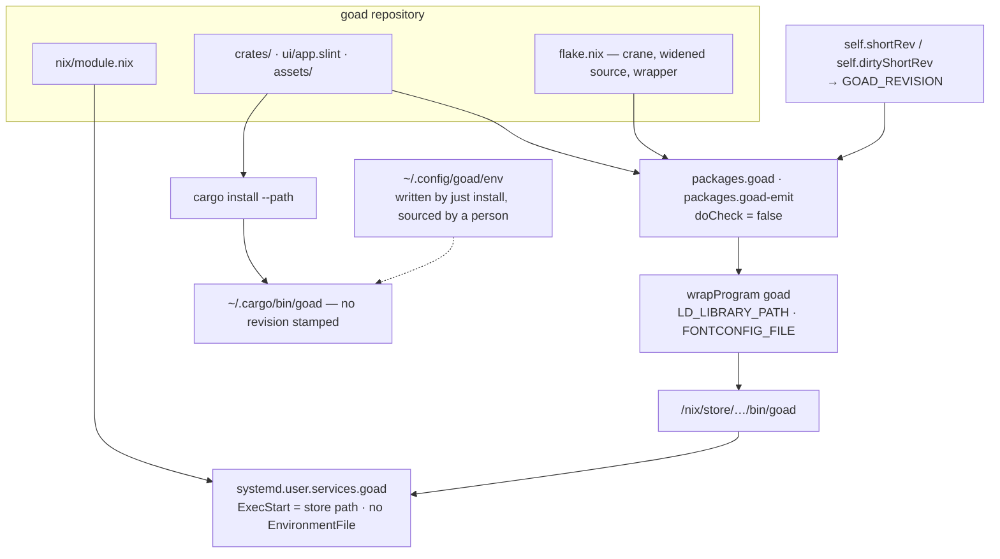

# Design — Slice 006: packaging and the startup surface

<!-- The *current* design, not its history. Revision chronology, review
     findings, and dispositions live in `design-log.md`.
     Reference forms: canon by id (`SPEC-003 §4`, `ADR-007`, `POL-002`);
     doc-local refs bare — OQ-1 (§6), D1 (§7), R1 (§8). Ids are immutable. -->

**Tier 1, 46 lines over the cap, by explicit decision.** `docs/AGENTS.md`
§Tiers caps a tier 1 design at 300 lines and prescribes splitting the slice
above it. The surface here is eight contracts across four files, two crates and
two languages (§5.2); the alternatives — splitting, or raising to tier 2 — were
put to the user and declined (`design-log.md`, 2026-09-20). Everything else
about tier 1 is unchanged, the two-round bound on the shared design-and-plan
ledger included.

## 1. Design problem

Two surfaces, one question.

**The install surface.** A `goad` binary and the environment it needs are two
things that must arrive together: the GUI libraries are `dlopen`'d, so `ldd`
resolves clean on a binary that opens no window, and fontconfig finds fonts
through a configuration file, so its absence is a window that draws no text.
`just install` captures both into `~/.config/goad/env` and a hand-written unit
outside the repository reads them back. Nothing notices when only one half
arrives, and two installs can both put a `goad` on `$PATH` with neither able to
say which is running.

**The startup surface.** `goad --version` is read as a configuration path and
fails opening a file called `--version`. `goad /nonexistent/wat.toml` prints
*configuration could not be read: No such file or directory (os error 2)* — and
so does `goad --version`, character for character (`research.md` Thread 3 S-4).
A mistyped flag and a missing file are indistinguishable: one defect seen twice.

The two halves are one slice because they are the same question — *which file
did it mean?* — asked at install and asked at startup.

**Boundary.** `slice-006.md` §Non-goals holds entire: `cargo install` is not
retired, the backend is not packaged, there is no NixOS module and no darwin, no
`--config PATH` flag, no release and no CI. `goad-emit`'s startup diagnostics
are untouched; its `--version` is in scope, by OQ-7 (§6).

## 2. Current state

Cited in `research.md` rather than restated here. Five facts carry this design:

- `flake.nix` has no `crane` input and no package for either binary, and already
  binds `guiLibs` and `fontsConf` — exactly what a wrapper needs (Thread 2).
- `StartupError` has **nine** variants, of which exactly one holds a path and
  does not name it: `Config`. Its doc comment says eight (Thread 2, re-verified
  at design).
- `goad-emit` already wraps `ConfigError` with a path **at stratum 3**, from the
  same seam position `main::start` occupies (Thread 2; Cross-thread 1).
- A crane package over this workspace builds, wraps, and runs from an empty
  environment. The measurements are Thread 3 S-1 to S-5.
- `goad` has no binary test target and `goad-emit` does; `autotests = false` in
  both manifests makes every target explicit.

## 3. Forces & constraints

| force | consequence |
|---|---|
| **POL-001** — the gate is six commands, policy first and recipe second | nothing here joins it (OQ-2). `just package` sits outside the block and amends no canon (OQ-2b). |
| **ADR-001** — one-way strata | `goad_shell` is stratum 2, `crates/goad` stratum 3. Either could carry the path; stratum 3 is chosen on cohesion, not direction (OQ-3). |
| **SPEC-003** R-3, R-4 | `StartupError::Ingress` names its path and what was found. Untouched here, and AC-6 must not weaken it. |
| **the vocabulary invariant** | binds `nix/module.nix` and the unit it writes. **No instrument reads `.nix`** — POL-001 §Verification's *residue* category (Cross-thread 4). |
| crane parses every manifest with `builtins.fromTOML`, which is TOML 1.0 | `Cargo.toml`'s two-line `tokio` entry must be joined before anything evaluates. A precondition, not a preference (S-1). |
| `cleanCargoSource` keeps `.rs`, `.toml`, `.lock` | `ui/app.slint` and the faces it imports must be re-admitted or `build.rs` fails (S-2). |
| the nix sandbox has no tzdb, no session bus, no writable font cache | `doCheck = false` (S-3, OQ-5). |
| the repository root holds `goad-demo.sock`; `.claude/worktrees/` holds six gitignored worktrees | the flake reference is the bare git form. `path:` refuses the socket and would copy the worktrees. |
| tier 1 | this document is capped at 300 lines. |

## 4. Guiding principles

Three. They settle every argument in §7.

1. **The binary carries its environment.** Wrapping is what retires the pair
   that had to travel together. Anything reintroducing a second thing to install
   is the defect returning under another name.
2. **Say only what is known.** A stamped revision is printed; an absent one is
   not guessed at, labelled, or apologised for.
3. **No third convention.** Every string, error shape, option surface and test
   target here is a transcription of one already in this tree. Where two
   spellings exist, one is chosen; a new one is not invented.

## 5. Proposed design

### 5.1 System model

One repository, two install paths, and a binary that can say which one it came
from.



Who owns what:

- **`flake.nix`** owns the source filter, the toolchain, `doCheck`, the wrapper
  and the revision. It is the only place that knows `LD_LIBRARY_PATH` and
  `FONTCONFIG_FILE` on the nix path.
- **`nix/module.nix`** owns the unit and only the unit. It takes a `package` and
  asserts nothing about how it was built.
- **`crates/goad`** owns what `--version` says and what a startup failure says.
  It reads `GOAD_REVISION` at compile time and never at run time.
- **`justfile`** owns the cargo path, unchanged.

### 5.2 Interfaces & contracts

**(a) Flake outputs.** Added: `packages.${system}.{goad,goad-emit,default}` and
`homeManagerModules.default`. The three jail packages and the devShell are
unchanged; `default` is `goad`. One `cargoArtifacts` from
`craneLib.buildDepsOnly` over `--workspace`, shared by both packages.

| | `goad` | `goad-emit` |
|---|---|---|
| selector | `--locked -p goad --bin goad` | `--locked -p goad-emit --bin goad-emit` |
| `buildInputs` | `guiLibs` | none — it has no renderer (S-4) |
| wrapper | `--prefix LD_LIBRARY_PATH` with `guiLibs`, `--set-default FONTCONFIG_FILE` with `fontsConf` | none |
| `doCheck` | `false` | `false` |

`--set-default` and not `--set`, so a caller's own `FONTCONFIG_FILE` still wins
(S-4).

**(b) The source.** `craneLib.filterCargoSources`, widened to admit `.slint`
files and everything under the repository's `assets/`. The exact nix spelling is
a phase choice; the contract is those three classes and nothing else, held by
S-2's two negative controls continuing to fail (§9).

**(c) The revision.** `GOAD_REVISION = self.shortRev or self.dirtyShortRev or ""`
on both derivations' environment. `option_env!` reads it at compile time, and
**set-but-empty is unset** — the rule `crates/goad/build.rs` already states for
`SLINT_STYLE`. No `build.rs` change; `option_env!` is a macro, so `clippy.toml`'s
ban on `std::env::var` is untouched.

**(d) `nix/module.nix`**, exported as `homeManagerModules.default`:

| option | | |
|---|---|---|
| `enable` | `mkEnableOption` | |
| `package` | required | no default; the consumer passes it |
| `extraConfig` | `{}` | merged over the generated `Service` block |

`config = mkIf cfg.enable` gives `home.packages = [cfg.package]` and
`systemd.user.services.goad` with `ExecStart = "${cfg.package}/bin/goad"`,
`After`/`PartOf`/`WantedBy = graphical-session.target`, `Restart = "on-failure"`,
`RestartPreventExitStatus = 2`, `RestartSec = 2`, and **no `EnvironmentFile`**
(AC-7, AC-3).

**(e) `goad`'s argument surface.** `Launch` gains `Version`, and `arguments`'
doc table gains one row:

| arguments | behaviour |
|---|---|
| `--version` | `version_line` on stdout, exit 0 |

The guard sits before the catch-all `[only]` arm, so `--version` stops being read
as a path. `goad x --version` is still two arguments and still
`StartupError::Usage` — the host does not guess which was meant.
`diagnostics::USAGE` gains the third form, as `goad-emit`'s already lists.

**(f) The error surface.** `StartupError::Config(ConfigError)` becomes two arms:

```rust
ConfigUnreadable { path: PathBuf, fault: std::io::Error },
ConfigUnparseable { path: PathBuf, fault: ConfigError },
```

rendered `"{path} could not be read: {fault}"` and `"{path}: {fault}"` — the two
spellings already in the tree, not a third. `main::start` splits them with the
same two-arm match `goad-emit`'s `socket_path` uses. The doc comment's "eight
variants" becomes ten.

**(g) `version_line`.**

```rust
pub fn version_line(revision: Option<&str>) -> String
```

`Some("08528b5")` → `0.1.0 (08528b5)`; `None` → `0.1.0`. One in
`crates/goad/src/diagnostics.rs`, one in `crates/goad-emit/src/render.rs` — the
`*_line` outlet shape both binaries already use. Callers pass
`option_env!("GOAD_REVISION").filter(|revision| !revision.is_empty())`.

**(h) `just package`.** Builds both packages; sits outside POL-001's block; its
comment carries the bare-git-form caveat.

### 5.3 Data, state & ownership

| | written by | read by | when it goes wrong |
|---|---|---|---|
| `GOAD_REVISION` | `flake.nix` | `rustc`, at compile time | never read at run time; a wrong value is a wrong build |
| `~/.config/goad/env` | `just install` | **a person** — nothing automatic, after this slice | store paths collected; the repair is `just install` (R2) |
| `systemd.user.services.goad` | `nix/module.nix`, via home-manager | systemd | |
| `flake.lock` | `nix flake lock` | evaluation | gains one `crane` entry |

Nothing new is stored at run time, and no host state changes.

### 5.4 Lifecycle & dynamics

**Startup.** `main::run` matches `Launch`:

| `Launch` | outlet | exit |
|---|---|---|
| `Help` | `USAGE`, stdout | 0 |
| `Version` | `version_line`, stdout | 0 |
| `Config(path)` | `start(path)`; on failure `report_startup` to stderr | 0 / 2 |

Both zero-exits precede any Slint call, so `--version` answers with no display —
which is what makes a binary test target feasible (§9).

**Failure.** Every `StartupError` is exit 2. The unit's
`RestartPreventExitStatus=2` stops the service rather than looping, and the
tenth variant inherits that with no change to the unit — which is why the module
and the enum belong in one repository (AC-7).

**Build.** Cold store 181s; warm `cargoArtifacts`, final layer only, 22s for
`goad` and 10s for `goad-emit`; no-op 1s (S-5). Nothing on the gate runs any of
it. `just package` is the command, and OQ-2's accepted residue stands: a
`flake.nix` that stops building is green here and breaks in `~/flakes`.

**Cutover**, once, by hand, recorded in `notes.md` and confirmed at audit: stand
up the `~/flakes` consumer, move the user service onto the module's unit, then
remove `~/satan/goad/goad.service` and its symlink. `~/.config/goad/env` stays —
it belongs to the cargo path and `just install` keeps writing it (OQ-6).

### 5.5 Invariants, assumptions & edge cases

**Invariants**

- **I1** — every `StartupError` holding a path names it. After this slice:
  `Ingress` (SPEC-003 R-3/R-4, unchanged), `ConfigUnreadable`,
  `ConfigUnparseable`. The other seven hold no path.
- **I2** — neither binary requires anything a caller sets in the environment, on
  the nix path (AC-3).
- **I3** — a nix-built and a `cargo install`ed `goad` differ in `--version`
  output (AC-5).
- **I4** — no domain vocabulary in `nix/module.nix` or the unit it writes.
  **Nothing checks this.** It is a review obligation, POL-001 §Verification's
  *residue* category (Cross-thread 4).

**Assumptions**

- **A1** — the flake is consumed as a git input. `self.shortRev`/`dirtyShortRev`
  exist only then; a tarball fetch yields `""`, and therefore a bare version,
  silently. This is I3's failure mode and R1.
- **A2** — the devshell keeps exporting both variables. The cargo path and
  `just install` still depend on it.
- **A3** — `fontsConf`'s DejaVu is adequate fallback for the wrapped binary, the
  two bundled faces being compiled in by Slint. Only a person can test this —
  AC-1's *"with text in it"*, under AC-8.

**Edge cases**

- `goad --version` with an unreadable configuration: exit 0, nothing read. The
  flag is answered before `start`.
- `goad x --version`: two arguments, `Usage`, exit 2. Unchanged.
- a dirty tree: `0.1.0 (08528b5-dirty)` — the ordinary development case, a
  documentation-only edit included.
- `cargo install` from a git checkout: still bare `0.1.0`. Nothing reads git.

## 6. Open questions

**None open.** All seven carried questions and two raised in design are
answered; each is recorded in `design-log.md` with its argument, and lands as a
decision in §7.

| | question | answer | §7 |
|---|---|---|---|
| OQ-1 | where the module lives | in this repository, `nix/module.nix` | D6 |
| OQ-2 | does `nix build` join the gate | no | D8 |
| OQ-2b | a `just package` recipe | yes, with no standing obligation | D8 |
| OQ-3 | which stratum names the path | stratum 3 | D1 |
| OQ-4 | where the revision comes from | the flake stamps it; cargo does not | D3 |
| OQ-5 | does the package run the tests | no | D5 |
| OQ-6 | `~/.config/goad/env` | kept; its reader becomes a person | D7 |
| OQ-7 | does emit's `--version` change | yes, the same shape | D4 |

## 7. Decisions, rationale & alternatives

Arguments are in `design-log.md`, by date. Here: what was chosen, and what was
rejected.

| | decision | rejected, and why |
|---|---|---|
| D1 | the path is carried at stratum 3 | stratum 2 — `ConfigError` is also emit's, so a path in it prints twice there, and repairing that is a non-goal |
| D2 | two arms, `ConfigUnreadable` / `ConfigUnparseable`, split at the seam | one arm with one spelling (doubles the prefix on the commonest failure); one arm splitting inside `Display` (hides the split from a reader comparing binaries) |
| D3 | the flake stamps `GOAD_REVISION`; the cargo path prints a bare version | `build.rs` shelling out to git — both paths then print the same sha from one commit, and AC-5 fails |
| D4 | `goad-emit --version` takes the same shape | divergence — the same defect exists for emit, which `just install` installs and AC-2 packages |
| D5 | `doCheck = false` | `doCheck = true` — three measured obstacles (S-3), and the obvious spelling reports green having run nothing |
| D6 | `nix/module.nix`, exported | writing the unit inline in `~/flakes` — `RestartPreventExitStatus=2` is this repository's exit-code contract |
| D7 | `~/.config/goad/env` is kept | deleting it — goad must keep running on non-NixOS systems |
| D8 | `just package`, outside POL-001's block | on the gate (canon, tier 2); no recipe at all (a command nobody finds) |
| D9 | the source admits `.slint` and all of `assets/` | by extension — a future non-font asset would need a flake edit |
| D10 | a `[[test]]` binary target for `goad` | asserting `--version` at the library tier only, which never runs the binary |

## 8. Risks & mitigations

| | risk | mitigation | signal |
|---|---|---|---|
| R1 | a tarball consumer gets `""` and a bare version, so AC-5 silently stops holding (A1) | documented in the module's comment; the consumer is a git input by construction | a packaged `goad --version` with no parenthetical |
| R2 | `~/.config/goad/env` names collected store paths, and nothing reads it automatically to notice | `just install` rewrites it; the `${VAR:?}` guard keeps it honest | a window that draws no text on the cargo path |
| R3 | the module or unit acquires domain vocabulary; no instrument reads `.nix` (I4) | a named review obligation at audit | caught by a person, or not at all |

## 9. Validation

| what | how | holds |
|---|---|---|
| the manifest joins | `nix flake check`-free: evaluation succeeds where it failed at S-1 | the precondition |
| the source filter | S-2's two negative controls rebuilt and still failing | D9, the contract in §5.2(b) |
| `nix build .#goad`, `.#goad-emit` | `just package` | AC-1 first half, AC-2 |
| an empty environment | `env -i …/bin/goad --help`, and the same for emit's `--version` | AC-3, I2 |
| `--version` at the binary tier | a new `[[test]] name = "binary"` in `crates/goad`, spawning `CARGO_BIN_EXE_goad` | AC-4, D10 |
| `version_line` both branches | unit tests in `diagnostics.rs` and `render.rs` | AC-5, I3 |
| the argument table | the existing `crates/goad/tests/renderer/startup.rs` cases, one row added | AC-4's second half |
| every path-holding error names its path | `Display` assertions beside the existing ones in `startup.rs` | AC-6, I1 |
| the unit's restart semantics | read the module's generated unit after `home-manager switch` | AC-7 |
| a window with text in it | **a person runs it** under systemd and says so in `audit.md` | AC-1 second half, AC-8, A3 |
| `just install` still works | run it | AC-9 |
| the gate | `just check` | AC-8 first half |

## 10. Canon impact

**None.** No spec, policy or ADR is written, amended or contradicted: OQ-2 kept
`nix build` off POL-001's block (D8) and OQ-3 kept the change inside stratum 3
(D1). `research.md` Thread 1's amendment-candidate list is empty. The slice
carries one unenforced obligation rather than a canon change — I4, in POL-001
§Verification's *residue* category.
