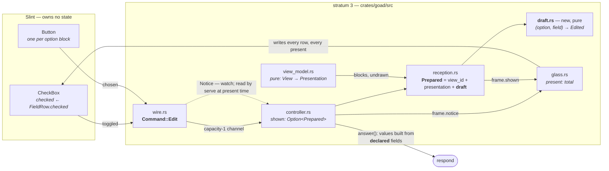
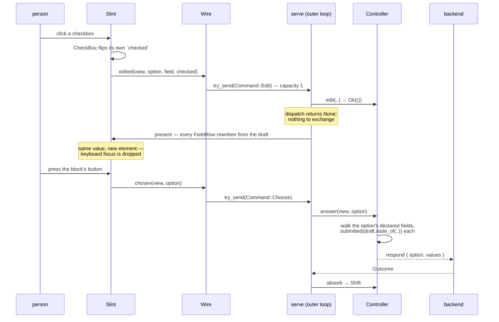

# Design — Slice 007: the renderer grows a form

<!-- The *current* design, not its history. Revision chronology, review
     findings, and dispositions live in `design-log.md`.
     Reference forms: canon by id (`SPEC-003 §4`, `ADR-007`, `POL-002`);
     doc-local refs bare — OQ-1 (§6), D1 (§7), R1 (§8). Ids are immutable. -->

## 1. Design problem

Three changes, and only the first is what the slice is named for.

**The renderer draws a form.** An option may carry fields (SPEC-001/R-15) and
`boolean` is a kind (R-16); this renderer draws neither, pushing every option's
fields into `Undrawn::OptionFields` (`view_model.rs:145-148`) and answering with
an empty map (`controller.rs:216`). R-55 names that a *renderer subset* that must
not narrow the protocol, and slice 002 recorded it as a standing hazard. 007
discharges it for `boolean`: a view with one option and fourteen checkboxes
becomes answerable in one exchange instead of fourteen.

**The host states what a submitted value is.** Drawing a widget makes the host
the only thing that can author a value, and SPEC-001 never said what JSON type
one has — one illustrative `"minutes": 20` in §6.1 and no rule (research F2). Two
new requirements: type-by-kind for all five kinds, and
completeness — a value for every field drawn, nothing for a field not drawn.

**The look is not one of them, and neither is the schedule.** Both were
candidates during design; both are out, for reasons §7 records as D12 and D13.

**The boundary**, stated because each edge is a decision and not an oversight:

| in | out, and where it goes |
|---|---|
| `boolean` drawn | `text`, `number`, `choice`, `datetime` — reported undrawn; a later slice, with F-8's channel cadence and `number`'s presentation as its content |
| grouping by the `group` hint | typography, spacing, window sizing, the idle surface — **008** |
| `material` as the default style | every other look question — **008** |
| — | **a scheduled firing can still discard a half-filled form.** Answered during design and withdrawn on scope (D13); the mechanism is preserved in `design-log.md` |
| — | an **ingested event** likewise supersedes a dirty form; SPEC-003/R-12's refusal-at-arrival is the shape it would take |
| SPEC-001 R-57 and R-58 | `field.value` / prefill and per-field errors — SPEC-001/OQ-2, its own slice |

The design does not assume a form is one option's. R-8 is *one option, one flat
map*; the renderer draws a block per option and a button per block, and AC-4
holds by construction rather than by a check.

## 2. Current state

Cited from `research.md` rather than restated; every line below was re-opened at
its site.

**The renderer has no concept of a field.** `present()`
(`view_model.rs:107-165`) is the only constructor of `Presentation`; it maps a
`View` to a title, a body and a flat `Vec<PresentationOption>` of `{ id, label }`.
Any option carrying fields pushes `Undrawn::OptionFields { option, count }`
(`:145-148`) and the fields are then gone — `Presentation` has nowhere to put
them.

**`Undrawn` is consumed in exactly three places**, and only one matches the
variant: `body_is_degraded` deliberately excludes it (`view_model.rs:29-41`),
`undrawn_line` renders it (`diagnostics.rs:191-199`), and `reception.rs:64-74`
passes the slice generically. Exactly **one test** asserts on it —
`mapper.rs:156-194` — and no test asserts the diagnostic wording at all.

**The retained state is `Prepared { view_id, presentation }`**
(`reception.rs:25-28`), built only by `receive`, held as `Controller::shown` and
documented as "the complete retained state" holding no Slint types
(`controller.rs:108-124`). `absorb` is its only writer, across three `Shift` arms
(`:160-186`).

**`Glass::present` is total by contract and wholesale in practice.** It writes
every window property and *replaces the entire options model* — `set_vec`, then
re-hands the `ModelRc` (`glass.rs:87-90`) — rebuilding every `OptionRow` from
`prepared` each call (`:138-149`). `serve` calls it at the top of every loop
iteration (`controller.rs:611`). **This is AC-5's whole mechanism**: any state
living only in a widget is overwritten on the next present, even when nothing
changed.

**`answer` is `&self` and sends nothing.** Two refusals — `SupersededView`,
`UnknownOption` — then `values: BTreeMap::new()` at `controller.rs:216`, the only
`UserResponse` constructed anywhere in `crates/goad/src`.

**The window draws a flat list of buttons.** `OptionRow { id, label, view }` in a
`ScrollView`, one `Button` each, `clicked => root.chosen(option.view, option.id)`
(`app.slint:44-52`). One callback, installed once (`install.rs:20-27`).

**The command channel holds one.** `mpsc::channel::<Command>(1)`
(`main.rs:86`); `Wire::send` is `try_send` and a `Full` send is **dropped** with
`BUSY_NOTICE` written to the window (`wire.rs:125-134`) — which `Glass::present`
then clears unconditionally, the defect §5.4 repairs; `serve` drains it only
in the outer `select!` (`controller.rs:611-617`) — the inner exchange loop does
not read commands.

**Nothing in `crates/goad-semantics/` needs to change.**
`Field::{id,kind,label,hints}`, `FieldKind`'s public variants, `Fields::as_slice`,
`Hints::as_map` are all `pub`; `FieldId` is `Ord + Clone`; id constructors are
`pub(super)`, so the renderer can clone an id and cannot mint one
(`canonical.rs:52-137, 220-255, 380-402`). **`OptionId` is `Clone + Eq` and
deliberately not `Ord`** (`canonical.rs:55-57`) — the crate orders an id exactly
where the protocol keys a serialized map by it, and nothing keys one by an
option. §5.2's draft is shaped to that fact rather than asking the crate to
change; adding the derive is the one edit this slice could have made to stratum 1
and does not.

**The style is unset**, so the compiler default applies: `fluent`
(`typeloader.rs:937`).

## 3. Forces & constraints

### What the protocol requires

**A renderer may draw less than the protocol admits; the wire contract may not
say less.** R-55 says a renderer that cannot draw something reports it and
carries on, and that this "MUST NOT be treated as, or produce the effect of, a
narrowing of the protocol". Drawing only `boolean` is therefore fine. Writing a
type rule that covers only `boolean` is not — it would make the protocol's shape
depend on today's renderer, which is the failure this project exists to avoid. So
R-57 types all five.

**Two options can use the same field id.** R-52 requires field ids to be unique
*within an option*, not across the view — because `values` is one flat map
belonging to one option (R-8). A view with a `morning` option and an `evening`
option can legitimately give both a field called `done`. If the draft is keyed by
field id alone, those two collide and each overwrites the other. **The draft is
keyed by (option id, field id).**

**The host writes values but never reads them.** R-9 forbids *interpreting* a
submitted value, and §7's verification row is explicit that this means host code
never *reads* one. Authoring `true` from a ticked box is not reading, so the host
may do it. What the host may never do is inspect a value's content to make a
decision — so "has this field changed in a way that matters" is not a question
the host is allowed to ask.

**A form is submitted exactly as it stands.** R-35 puts validation in the
backend. A half-filled form, or one with every box unticked, goes out unchanged.
The host never holds an answer back on its own judgement, and never fills a gap
on the person's behalf.

**`group` is readable in one file.** R-18 makes hints an open map that *only the
renderer* may branch on — nothing that normalizes, schedules or transports may
look at one. So `group` is read in `view_model.rs` and nowhere else.

### What the host's own design requires

**The field model is rewritten on every present, so the draft cannot live in the
widget.** `Glass::present` is contracted as total and idempotent — write every
property, every time — because a display server can fail partway through an
update. In practice it replaces the whole options model each call
(`glass.rs:87-90`), and `serve` calls it at the top of every loop iteration
(`controller.rs:611`). A box ticked in Slint and stored only in Slint is
therefore overwritten the next time anything at all happens. The draft lives in
the controller, and `present` writes the boxes *from* it every time, exactly as
it already does for the option rows. No exception is carved in the totality rule.

**The command channel holds exactly one command, and drops the rest.** A Slint
callback is synchronous on the UI thread, so it cannot wait for a full channel;
`Wire::send` uses `try_send` and, when the channel is full, throws the command
away and writes "busy" to the window (`wire.rs:125-134`). `serve` takes commands
only in its outer `select!` (`controller.rs:611-617`) — the inner loop that waits
on a backend call does not read them at all. So two commands sent before the loop
next comes round means the second is lost.

This is the constraint that decided the drawn set. A checkbox sends one command
per click, and nobody clicks faster than the loop turns. A text field's `edited`
callback fires on **every keystroke**, which overruns a one-slot channel
immediately. Drawing `text` therefore means redesigning the channel or the commit
timing, which is a different slice's problem. **It must not be relaxed later to
sneak a second kind in.**

**`view_model.rs` is pure, and nothing enforces that.** ADR-001 puts it in
stratum 3's pure half — no clock, no filesystem, no socket, no widget handle.
Research F6 established that none of the four ADR-001 instruments reaches stratum
3: not the crate-edge rule, not the manifest allowlist, not the purity scan, not
the own-features build. Only review holds it. The design states the rule
explicitly for that reason: **the draft never enters `Presentation`.**

### What the tools cannot do

**Only the checkbox can be operated by a test.** The headless tier drives widgets
through their accessibility surface. `CheckBox` exposes `accessible-checked` and
a default action that toggles it, so a test can both set and read it. `ComboBox`
exposes only "expand"; `TextEdit` has no set-value action in any of the five
styles; `RadioButton` declares no accessible properties at all. A test can *see*
those widgets and cannot *use* them. Every kind 007 draws is one whose submitted
value a test can drive end to end — which is the same reason, from the other
side, that the drawn set is `boolean`.

**The `[FieldRow]`-inside-a-struct binding is settled, and not by this
workspace.** What no tool here could tell us was read out of the pinned compiler
instead: `generate_struct` types every member by `rust_primitive_type`, which
maps an array to `sp::ModelRc<#inner>` wherever it appears
(`i-slint-compiler-1.17.1/generator/rust.rs:706-737`, `:110-113`), so the member
generates as `ModelRc<FieldBlock>`. §5.5/A-1 carries the chain. §8 R-1 keeps the
two-flat-models fallback named but unneeded, and phase 1 **pins** this against a
future Slint rather than discovering it.

### What the gate will not catch

**Three things pass `just check` and are still wrong**, so review is where they
are held:

- A host type named `Grouping`, or a module `grouping.rs`. The vocabulary scan
  checks seven words — `habit`, `streak`, `journal`, `site`, `goal`, `reminder`,
  `compliance` — and `group` is not among them and never will be. AC-9 says the
  scan passing is *necessary and not sufficient*; this is what it means.
- Anything in the stratum-3 manifest. ADR-003 states it outright: a stratum-3
  manifest is checked by nothing but review.
- The style change. It alters how every existing widget looks and **no headless
  test observes any of it** — §8 carries it as a risk, not as a verification.

One thing does fail the gate rather than review, and it is easy to trip: **no new
identifier in `crates/goad/src` may contain the word `resolve`** — no
`resolve_field`, no `resolve_draft`. `structure.rs:308-318` matches by word over
production lines.

### The scar

`docs/memory/` records four green tests in slice 004 that each asserted something
the regression they guarded would have survived. Every criterion here is written
against an observable that the regression would actually break — **the submitted
`values`, read off the wire**, not a draft inspected in-process.

## 4. Guiding principles

Three rules. Every argument below is settled by one of them, and where two seem
to conflict the earlier one wins.

**P-1 — The contract is typed for the protocol. The renderer draws a kind only
when nothing about this host stands in the way of drawing it well.**

These are two different decisions and the design keeps them apart. What a `text`
field submits is a fact about the protocol, true whether or not anything draws
one, so R-57 states it. What this renderer draws is a fact about this renderer.
Conflating them is how a wire contract starts tracking a renderer — §3, and the
third invariant in `CLAUDE.md`.

The renderer's half is stated as the design actually applied it, because three
different obstacles did the deciding and testability is only one of them:

| kind | what stands in the way | kind of obstacle |
|---|---|---|
| `text` | `edited` would fire per keystroke into a one-slot channel (§3) | transport |
| `number` | `SpinBox` is `int` against an `f64` protocol bound, and invents `maximum: 100` (D4) | fidelity |
| `choice` | `ComboBox` has no set-value action, so no test can drive it (D4) | testability |
| `datetime` | the stock offering is two separate modal popups — `DatePickerPopup` and `TimePickerPopup`, both `inherits PopupWindow` (`i-slint-compiler-1.17.1/widgets/fluent/{datepicker,time-picker}.slint:13`) — with no combined control, so drawing one field means composing two popups, a display and an unset state (D3) | presentation |

Any one of them is sufficient. The distinction matters because R-3's mitigation
rests on the transport argument, not the testability one: a later slice that finds
a drivable text control has **not** discharged the objection to `text`.

*Settles:* why R-57 types all five kinds and the renderer draws one; why `text`,
`number`, `choice` and `datetime` are reported undrawn rather than omitted from
canon.

**P-2 — The screen is a function of retained state.**

Nothing the person does is stored only in a widget. An edit travels to the
controller, the controller holds it, and `present` writes the screen from it —
every property, every time, unchanged from today's contract. The test of this
principle is that `present` needs no exception: if some state has to be protected
from a present, it is in the wrong place.

*Settles:* the draft's home, why `answer()` reads retained state rather than the
widgets, and AC-5. It is also why the draft sits inside `Prepared` — a draft and
the view it answers are then one value, and `shown = None` cannot leave one
stranded.

**P-3 — The host transcribes. It does not decide, reorder, withhold, or read.**

It submits a value for every field it drew and none for a field it did not. It
draws fields in the order the backend declared them and never moves one. It sends
a form exactly as it stands, however empty. It writes values and never reads one
back.

Every temptation this slice offers is a violation of this rule: inventing a
tri-state so an unticked box means "not yet"; omitting untouched fields to
manufacture one; coercing `{"group": 7}` into a heading the backend did not
author; collecting scattered fields under a shared heading. Each is the host
supplying meaning it does not hold — and *both* readings of an unticked box are
the backend's, which is precisely why the host cannot pick one.

*Settles:* R-58's completeness clause; the grouping rule; the non-string-`group`
rule; and the whole of §*What the workaround costs* in the slice card.

## 5. Proposed design

### 5.1 System model

Nothing new crosses a crate edge. The slice adds one pure module, widens one
retained value, and adds two paths from the window back to the loop: the edit
itself, over the existing command channel, and a `Notice` signal carrying
back-pressure. `Controller` gains no field; the `Notice` value is retained at the
edge instead. §5.3 holds the state inventory and owns that claim — this section
does not restate it.



**Who owns what.**

| thing | owner | written by | lifetime |
|---|---|---|---|
| the fields a view declares, grouped into blocks | `Presentation` | `present()`, once, purely | replaced wholesale on a new view |
| what the person has ticked | `Draft`, inside `Prepared` | `Controller`, on `Command::Edit` | dies with the view it answers |
| the checkbox on screen | Slint | `SlintGlass::present`, every call, from the draft | one present |
| the submitted map | nobody — built at `answer()` and moved out | — | one `respond` |

**The one structural idea worth stating on its own.** `answer()` builds `values`
by walking the **presentation's declared fields** and looking each one up in the
draft — not by walking the draft. Three properties follow without a check
anywhere:

- A value is submitted for **every** drawn field of the answered option, ticked
  or not (R-58, first half) — the walk is over what was drawn, and over that
  option's blocks only.
- **No** value is submitted for a field that was not drawn (R-58, second half) —
  an undrawn field never enters a block, so the walk never reaches it.
- A draft key that somehow outlived its view can never reach the wire, because
  nothing reads the draft's keys.

Combined with the `SupersededView` refusal that `answer()` already makes
(`controller.rs:200-220`), every submitted key provably came from a field that
the currently-retained view declared.

**`Draft` is a new module rather than a map in `reception.rs`** because it has
rules of its own — absent means as-drawn, keys are (option, field) pairs, and it
is the one place a widget's state becomes a submitted value — and because it is
pure, has no Slint types, and its whole behaviour is unit-testable without a
platform. It is the one new file.

**`Frame` gains exactly one field, and becomes *more* total for it.** The draft
needs nothing: `Frame` already borrows `shown: Option<&Prepared>`
(`controller.rs:94-102`), so the glass reaches it through the value it already
receives. What changes is `notice: bool`, for the reason §5.4 gives. Today
`Frame`'s own doc-comment carries the exception — *"Total: every property but
`notice` is written from this, every time"* (`controller.rs:92-93`) — and that
carve-out is the defect, not a convenience. With the field present the sentence
loses its "but": every window property is written from the frame, every time.

### 5.2 Interfaces & contracts

#### The wire — SPEC-001, as `canon-delta.md` will state it

CD-1 splits into two requirements (research F2/F4: one falsifiable claim per row,
R-52/R-53 the precedent for splitting rules that travel together).

> **R-57.** A submitted field value's JSON type is determined by the field's
> `kind` and by nothing else: `boolean` submits a JSON boolean, `text` a JSON
> string, `number` a JSON number, and `choice` the chosen alternative's id as a
> JSON string, and `datetime` an RFC 3339 `date-time` string carrying an
> offset.

> **R-58.** A `respond` carries values for exactly the fields the host drew of
> the option being answered: a host MUST submit a value for each of them, and
> MUST NOT submit a value for any other field — neither a field it did not
> draw, nor a field of an option it is not answering. A field a renderer cannot
> draw is reported undrawn under R-55, and the response is silent about it
> rather than carrying a default. A backend that needs *unanswered* to be
> distinguishable from *false* MUST NOT send the field — the additive mechanism
> for that is OQ-2.

Two corrections to CD-1 as scoped, both from research F1: the `respond` example
lives in **§6.1**, not §6.2, and it is §6.1 that gains a second value while §6.2
gains the type table beside *Field forms*. The extended example:

```json
{ "protocol": 1, "type": "respond", "now": "2026-08-23T04:14:31Z",
  "view_id": "2026-08-23T04:12:00Z#3",
  "response": { "option": "done",
                "values": { "stretched": true, "read": false, "minutes": 20 } } }
```

R-9 gains nothing. Research F3 confirmed its opacity reaches *reading* only, and
§7's own verification row says so; R-57 is what covers the write direction, which
is the gap.

#### The window — `crates/goad/ui/app.slint`

```slint
export struct FieldRow  { option: string, id: string, label: string, checked: bool }
export struct FieldBlock { heading: string, fields: [FieldRow] }
export struct OptionRow { id: string, label: string, view: string, blocks: [FieldBlock] }

callback edited(string, string, string, bool);   // view, option, field, checked
```

`OptionRow` grows one member and keeps the three it has, so the existing option
tests keep every assertion they make. `heading: ""` is an **untitled block**, not
a missing one — that distinction is what stops an ungrouped field being drawn
under a heading that does not claim it. A `CheckBox` binds `checked: field.checked`
and `toggled => root.edited(option.view, option.id, field.id, self.checked)`.

**A field's identity in the tree is scoped, not composite.** The `CheckBox`
carries `accessible-description: field.id`, and the **per-option container**
carries `accessible-description: option.id`, so a field is addressed by a query
scoped to its option. `ElementQuery` has no accessible-description matcher —
its builders are `match_descendants`, `match_id`, `match_type_name`,
`match_inherits`, `match_accessible_role` and `match_predicate`
(`i-slint-backend-testing-1.17.1/search_api.rs:232-287`) — so the description is
read through `ElementHandle::accessible_description` (`:701`) inside a predicate,
which is the shape the renderer tests already use (`tree.rs:42-49`): a
`match_predicate` carrying an owned `option.id`, then `match_descendants()`
(`:239`), then a `match_predicate` carrying an owned `field.id`, then
`find_first()`. The existing `element_described` helper is this query without its
middle two steps, and the scoped form belongs beside it rather than inlined at
each call site. The unscoped form an option
button uses (`app.slint:49`) does **not** carry over: an option id is unique
within a view (R-14), but a field id is unique only within an option (R-52), and
`R-52-the-same-field-id-in-different-options` is a fixture asserting two options
may share one. An unscoped `find_first` would take whichever came first and report
no ambiguity — which is precisely the case AC-4 exists to prove.

Joining the two ids into one description (`option.id + "/" + field.id`) was
rejected: ids are backend-supplied strings whose *characters* no requirement
constrains, so any separator can appear inside an id and the join becomes
ambiguous — P-B, on data the host does not control.

**The container declares `accessible-role: groupbox`**, and it has no choice
about declaring *some* role: the compiler admits an accessibility property only
on an element whose role is bound, erroring with "can only be set in combination
to `accessible-role`" otherwise
(`i-slint-compiler-1.17.1/passes/lower_accessibility.rs:41-59`, and the
accepted/rejected contrast at
`tests/syntax/accessibility/accessible_properties.slint:32-41`). So
`accessible-description: option.id` — the identity the scoped query depends on —
makes a role mandatory here. `groupbox` is a labelled group of controls, which is
what a per-option field container is. It also carries
`accessible-label: option.label`, so the group is not announced anonymously;
that label is **not** an identity and no test selects on it (D10, R-14).

*Left open deliberately:* whether the container should further declare
`accessible-role: list` with `accessible-item-count`, as the options container
does (`app.slint:42-44`), so a reader announces a field's position within its
option. That is a question about what a screen reader announces, not about what a
test can reach, and nothing here should settle it by what a test happens to need.
The options container is a list of selectable buttons; a block of fields is not
the same thing, which is why `groupbox` is the resting place and not a stand-in
for a decision deferred.

The button's text remains `option.label`; the host authors no label, for a form
or otherwise (D14).

An option with no fields has `blocks: []`, so the `for` produces nothing: no
container, no separator, no stray control — AC-6, structurally.

#### The mapper — `crates/goad/src/view_model.rs`

```rust
pub struct PresentationOption { pub id: OptionId, pub label: String, pub blocks: Vec<FieldBlock> }
pub struct FieldBlock         { pub heading: Option<String>, pub fields: Vec<PresentationField> }
pub struct PresentationField  { pub id: FieldId, pub label: String }

pub enum Undrawn {
  MarkdownUnsupported { detail: String },
  ContentForm { form: ContentForm },
  FieldForm  { option: OptionId, field: FieldId, form: FieldForm },  // replaces OptionFields
  GroupHint  { option: OptionId, field: FieldId },
}

pub enum FieldForm { Text, DateTime, Number, Choice }   // the four this renderer does not draw
```

`FieldForm` takes its name from SPEC-001 §6.2's own heading, *Field forms*, and
mirrors the existing `Undrawn::ContentForm { form: ContentForm }` exactly — same
shape, same `Display`-driven diagnostic line. `Undrawn::OptionFields` is
**removed**: it said "this option has fields" and could not say which, and the
two new variants name the field and the reason. Both are excluded from
`body_is_degraded`, as `OptionFields` already is (`view_model.rs:29-41`).

Only drawn fields reach a block. **A block containing no drawn field is not
emitted**, so a group whose every member is a `text` field produces a heading
nowhere. Runs are computed over the drawn fields in declared order — two
`Morning` fields separated only by an undrawn one are adjacent among the drawn,
and form one block; nothing moved, so P-3 holds.

#### The draft — `crates/goad/src/draft.rs`, new

```rust
/// The draft's value type, and the one place a widget's state becomes a
/// submitted value.
pub enum Edited { Checked(bool) }
// later:        Checked(bool), Counted(f64), Chosen(String), …

/// Keyed by (option, field): R-52 makes a field id unique only *within* an
/// option, and two options sharing one is legal and fixtured
/// (`R-52-the-same-field-id-in-different-options`), so the option half is what
/// keeps two ticks apart. Not a `BTreeMap`, because `OptionId` is deliberately
/// not `Ord`: in `canonical.rs` an id is ordered exactly when the protocol keys
/// a serialized map by it — `FieldId` is and says so, `OptionId` and
/// `AlternativeId` are not — and a host's storage is no reason to spend that
/// distinction. A view's options and a form's fields are both handfuls; the
/// scan is free.
///
/// No `PartialEq`: over a `Vec` it would be insertion-order sensitive, and a
/// draft's behaviour is `state_of`, not its representation. Tests assert
/// through the accessor.
#[derive(Debug, Default, Clone)]
pub struct Draft(Vec<(OptionId, FieldId, Edited)>);

impl Draft {
  pub fn state_of(&self, option: &OptionId, field: &FieldId) -> Edited;  // absent ⇒ as drawn
  pub fn record(&mut self, option: OptionId, field: FieldId, value: Edited);
}

/// SPEC-001/R-57, in one total match: one site turns a widget's state into a
/// submitted value, so the mapping cannot drift apart across the codebase.
///
/// It is **not** the compiler's guard against the *protocol* growing a kind.
/// `Edited` is host-local; a sixth `FieldKind` leaves this match exhaustive. The
/// site that breaks is the mapper arm in `present()`, which matches the canonical
/// `FieldKind` and must sort the new kind into drawn or `Undrawn::FieldForm`.
/// What this match guards is the *host* growing a drawn kind without deciding
/// what it submits.
fn submitted(edited: &Edited) -> serde_json::Value {
  match edited { Edited::Checked(value) => Value::Bool(*value) }
}
```

Two methods, no iteration, and deliberately **no way to enumerate what the draft
holds** — that is what makes "the walk is over declared fields, never over the
draft" a property of the type rather than a convention someone must keep. The
representation is private and carries none of that weight: a `Vec` behind these
two methods exposes no more than a map would. Absent means as-drawn; with no
`field.value` in the protocol, as-drawn for a checkbox is unticked.

`wire.rs` depends on `draft.rs` and not the reverse: a value's meaning belongs
with what stores it, not with what carries it.

**What the seam does not promise.** That `text` arrives through this door. F-8 is
the reason — `LineEdit`'s `edited` fires per keystroke into the one-slot channel
— so a text field likely needs a commit event or a different channel, not another
`Edited` variant. The seam fixes the shape of a *value*, not the transport that
carries it.

#### The retained value — `crates/goad/src/reception.rs`

```rust
pub struct Prepared {
  pub view_id: ViewId,
  pub presentation: Presentation,
  pub draft: Draft,          // Default::default() in `receive`
}
```

`receive` stays the only constructor, so a `Prepared` cannot exist without a
draft, and `absorb`'s existing three `Shift` arms need no change at all:
`Replaced` installs a fresh `Prepared` with an empty draft, `Retained` leaves it,
`Closed` drops it. A draft and the view it answers are one value, so
`shown = None` cannot strand one.

#### The controller — `crates/goad/src/controller.rs`

```rust
pub fn edit(&mut self, view: &str, option: &str, field: &str, value: Edited) -> Result<(), Refused>;
pub fn answer(&self, view: &str, option: &str) -> Result<(ViewId, UserResponse), Refused>;  // unchanged signature
```

`edit` makes the same two refusals `answer` already does — `SupersededView` when
`view` is not the retained token, `UnknownOption` — plus `UnknownField` when the
option's blocks do not declare it. `answer` stays `&self`; only `edit` needs
`&mut self`, so the change is smaller than the slice card anticipated.

`answer` fills `values` at `controller.rs:216` by walking the answered option's
blocks and calling `submitted(draft.state_of(..))` for each declared field — the
single site where R-57 is applied.

#### The command — `crates/goad/src/wire.rs`, `install.rs`

```rust
Command::Edit { view: String, option: String, field: String, value: Edited }
```

Three opaque selectors and a value, following `Command::Choose`'s shape exactly;
`Eq` survives the derive. `install` grows a seventh installation with its own
`Wire` clone, named `editing`, matching the file's existing
one-clone-per-callback convention.

`dispatch` gains an arm returning `None` on success — there is nothing to
exchange, so the loop continues to the top and presents — and `Some(Err(refused))`
on refusal, which routes to the single existing refusal site
(`controller.rs:676-684`). No new reporting path.

#### The diagnostic lines — `crates/goad/src/diagnostics.rs`

```
not drawn: option {option} field {field} is a {form} field; this renderer draws boolean fields only
not grouped: option {option} field {field} carries a group hint that is not a string
```

Replacing the `OptionFields` arm (`:193-199`). No test asserts the current
wording, so these are stated here to be reviewed once rather than discovered in a
diff (research delta 7).

`Refused` gains a fourth variant for the same reason and in the same place —
`Refused` lives in `diagnostics.rs` rather than beside the controller because
every user-visible string in this renderer is in one file, and
`Diagnostics::refused` is an exhaustive match, so a variant without a line is a
compile error rather than an omission:

```
no action taken: the host could not match that control to a field of the option it names
```

Parallel to `UnknownOption`'s line, and distinguishable from it: it says which
of the two selectors failed. Unlike the two above, this one **is** asserted by a
test — `reception.rs`'s `every_refused_variant_renders_one_line_with_the_failure_prefix`
asserts each variant's exact string, and a fourth variant is within the claim its
name makes.

#### The build — `crates/goad/build.rs`

```rust
let style = std::env::var("SLINT_STYLE").unwrap_or_else(|_| "material".into());
slint_build::compile_with_config(
  "ui/app.slint",
  slint_build::CompilerConfiguration::new().with_debug_info(true).with_style(style),
)?;
```

The read is explicit because `with_style` overwrites the value
`CompilerConfiguration::new()` already took from the environment
(`i-slint-compiler-1.17.1/lib.rs:264`); without the `var` call, adding the line
would silently remove an override that works today.

**Nothing in `crates/goad-semantics/` changes.** Verified accessor by accessor
(research, *canonical field types*): every reader this design needs is already
`pub`, and id constructors are `pub(super)` so the renderer clones ids and cannot
mint one. Verified trait by trait as well, which is the half an accessor audit
misses: `OptionId` carries no ordering, and `Draft` is keyed accordingly (§5.2).

### 5.3 Data, state & ownership

**The complete state retained by `Controller`**, extending the list
`controller.rs:103-121` already documents. One field changes shape; **nothing
new is added to `Controller`**. The heading is scoped deliberately: `notice`
below *is* retained, and is retained somewhere else.

| held | where | written by | on what |
|---|---|---|---|
| `shown: Option<Prepared>` | `Controller` | `absorb` | a folded exchange — *unchanged* |
| ↳ `view_id`, `presentation` | `Prepared` | `receive`, once | construction only |
| ↳ **`draft: Draft`** | `Prepared` | `Controller::edit` | one `Command::Edit` |
| `diagnostics` | `Controller` | `absorb`, `refuse` | a folded exchange, or a refusal the renderer made itself |
| `next_check` | `Controller` | `absorb` | a folded exchange |
| `focus` | `Controller` | `absorb` on `Shift::Replaced` only, `open_diagnostics`, `close_diagnostics` | a replaced view, or the diagnostics pane opening and closing |
| `engaged` | `Controller` | `engage` sets, `absorb` clears | an exchange starting and ending |
**`notice` is not in that table, and the reason is *where* it is retained, not
whether.** It is a window property today, written by `Wire::send` and cleared by
`Glass::present`, owned by neither — the absence §5.4 shows to be a defect. The
repair gives it an owner at the **edge** rather than in `Controller`, and its
retention there is load-bearing rather than incidental: `true` has to survive
from the `Full` callback through the next present, and through further presents,
until a successful send writes `false`. A `watch` channel is the right vehicle
precisely because it retains its last sent value
(`tokio-1.53.1/src/sync/watch.rs:3-20`, `:296-304`). P-2 therefore holds for
`notice` exactly as for everything else — the screen is a function of retained
state — and what changes is which side of the edge retains it:

| the value | authored by | carried by | written to the window by |
|---|---|---|---|
| `notice: bool` | `Wire::send` — `true` on `Full`, `false` on `Ok` | a `Notice` signal, read by `serve` at present time and passed to `frame(notice)` | `Glass::present`, from the frame, like every other property |

**The route is `Cancel`'s, exactly.** `Cancel` is a `watch` channel constructed
in `main`, handed to `Wire` for synchronous setting from a Slint callback, and
handed to `serve` for the loop to read (`wire.rs:146-171`; `main.rs:85-119`;
`serve`'s signature, `controller.rs:576-584`). `Notice` follows it edge for edge.
That keeps the concurrency primitive at the edge where the others already live
and out of `Controller`, which is "One value, no Slint
types, so it is testable without a platform" (`controller.rs:103-108`) and stays
so.

**What changes, precisely:** `Frame` gains `notice: bool`; `Controller::frame`
gains one parameter and stays `&self` and non-mutating; `Controller` gains no
field; `main` constructs the signal and clones it into `Wire`; `serve` takes it
alongside `cancel`. A test asserts the notice by calling `frame(true)` — no
channel, no window, no platform.

**The draft's whole lifetime is `absorb`'s existing three arms**, and none of
them needed a line of new code:

| `Shift` | what happens to the draft | why that is right |
|---|---|---|
| `Replaced` | discarded with the `Prepared` that held it | a returned view takes a fresh `view_id` and the old interaction is stale (SPEC-001/R-33). Answering a new view with an old view's ticks would be inventing an answer. |
| `Retained` | untouched | "same question, nothing further to show" — the half-filled form survives, which is **AC-5** |
| `Closed` | dropped with `shown` | there is nothing left to answer |

The draft sits *inside* `Prepared` precisely so this table needs no fourth row. A
draft held beside `shown` would have a state — draft present, view absent — that
the type would admit and the fold would have to rule out by hand.

**What is derived, and therefore disposable.** Everything the window shows is
recomputed on every present from state retained either by `Controller` or, for
`notice` alone, at the edge; nothing is cached, and nothing has an invalidation
rule to get wrong.

- `Vec<OptionRow>`, including every `FieldBlock` and `FieldRow` — rebuilt by
  `option_rows` each call (`glass.rs:138-149`), as today.
- `FieldRow.checked` — from `draft.state_of(option, field)`, a lookup, never
  stored in the row model as truth.
- The submitted `values` map — built at `answer()` and moved straight out; it
  exists for the length of one `respond`.
- `body_is_degraded`, the diagnostic lines, the tray icon and tooltip —
  unchanged, all already derived.

**What is deliberately not stored**, each because storing it would create a
second thing `present` has to protect:

- **No selection state.** A block per option means a button reaches only its own
  fields (§5.1), so there is no "which option is active" to keep.
- **No focus per field** — retained, that is. `Focus` stays what it is today, set
  on `Shift::Replaced`. This is a decision with a cost, not an absence of one:
  because nothing retains which field had focus, the rebuild every present
  performs drops it (§5.4). Owned in `slice-007.md` Follow-ups.
- **No dirty flag.** The hold is deferred (D13), so nothing needs to know whether
  the person has begun. When that slice comes, the flag should be *derived* per
  loop iteration rather than retained — it is in `design-log.md`, not in this
  design.
- **No per-field error state.** SPEC-001/OQ-2, and out of scope.

**The one ownership rule that no instrument enforces.** `Presentation` is the
pure mapper's output and holds what the *backend* declared. `Draft` holds what
the *person* did. They are separate types in separate files and the draft never
enters `Presentation` — not as a field, not as a mutable `checked` on
`PresentationField`. Research F6 established that nothing in the gate reaches
stratum 3's purity: not the crate-edge rule, not the manifest allowlist, not the
purity scan, not the own-features build. Review is the only thing holding this,
so it is stated here as a rule with a name rather than left to be inferred from
the file layout.

A concrete temptation it forecloses: putting `checked: bool` on
`PresentationField` would remove the (option, field) key and the lookup, and it
would be smaller. It would also make `present()` — a function documented as pure,
total and panic-free — produce a value that something else then mutates, and it
would put the person's state inside the value that gets replaced wholesale on
every new view.

### 5.4 Lifecycle & dynamics



**An edit is a round trip, and the screen is corrected by it rather than by it
succeeding.** The widget flips itself on click, so feedback is immediate; the
next present rewrites every row from the draft. When the command arrived, that
write is the same *value* — but it is not the same *element*, and one thing does
move.

**The rebuild is what makes A-2 hold, and it costs keyboard focus.** `set_vec`
resets the model, and a reset clears the repeater's instances rather than
updating them, so every element under `options` is destroyed and a new one
constructed (`i-slint-core-1.17.1/model/repeater.rs:506-509`, `:361-381`). That
is precisely why the declarative `checked` binding comes back after a click has
assigned it imperatively. The window holds its focused item weakly
(`window.rs:519`, upgraded at `:1241-1242`), so the same rebuild drops focus: a
person filling the form from the keyboard loses the ring on every tick and tabs
from the top again. Present runs at the top of every loop iteration
(`controller.rs:611`) and an edit returns `None` from `dispatch`, so this is once
per tick, not once per exchange.

> **Do not repair this by switching to `set_row_data`.** That path —
> `row_changed` → `comp.update` on the *surviving* element
> (`model/repeater.rs:427-441`) — keeps focus and silently breaks the
> checkbox↔draft link, because an element that assigned its own `checked` never
> follows the model again. The two properties are held by opposite mechanisms and
> there is no third with stock widgets. A real repair needs a focus identity that
> survives a rebuild, which is a design surface of its own: `slice-007.md`
> Follow-ups owns it.

Today the same reset already happens on every present, but a present during a
prompt follows a fold or a refusal, and a click ends the interaction — so nothing
was there to lose. Drawing a form is what turns it into a per-interaction cost.

**When it did not arrive, the correction is the feedback — and the explanation
must outlive the correction.** The channel holds one and `Wire::send` drops a
full send (`wire.rs:125-134`). The draft never saw the edit, so the next present
writes the box back to where it was: the tick visibly undoes itself. That is not
a special path — it is the totality rule doing its job — and it is the one
behaviour that would be *impossible* to get right if the draft lived in the
widget.

The notice has to survive that same present, and today it cannot. `Wire::send`
writes `BUSY_NOTICE` to the window and `Glass::present` writes `notice = ""`
unconditionally (`glass.rs:104-108`), whose doc-comment states the rule outright:
*"`notice` is written `""` here and set from nowhere else in this trait"*
(`glass.rs:23`). A full channel already holds a command, so the present that
consumes it is the present that clears the notice — and, once fields are drawn,
the same present that reverts the tick. The correction and the deletion of its
explanation arrive together; at most the notice flashes first. The rule was
harmless while a present following a fold or a refusal had nothing to undo.

So `notice` becomes frame-carried (§5.3): `Wire::send` sets the signal on `Full`
and clears it on `Ok`, `serve` reads it and passes it to `frame(notice)`, and `present`
writes it like every other property. The existing back-pressure test asserts the
clearing behaviour — *"the next present must clear notice"*
(`wiring.rs:346-385`) — and **inverts**: it must assert the notice survives the
next present, and that the person's next successful send clears it. That test
passing today is not evidence the behaviour is right; it asserts the mechanism
that causes the defect, which is `docs/memory/a-green-test-can-assert-a-proxy.md`
a second time.

**No edit can race an exchange.** `enabled: !root.busy` already disables option
buttons during a call (`app.slint:47`); the checkboxes carry the same binding. So
the window is inert exactly while `serve`'s outer loop is not reading commands
(`controller.rs:735-760`), and the one-slot channel is never asked to hold two
edits at once. SPEC-002/R-9 — at most one exchange — is untouched.

**A stale edit is refused on the path that already exists.** `Controller::edit`
makes the same `SupersededView` check `answer` does, so an edit arriving just
after a new view landed is refused rather than applied to the wrong draft;
`dispatch` returns `Some(Err(..))` and the single refusal site
(`controller.rs:676-684`) reports it. No new reporting path, and
`refusal_re_arms` is `false` for it by construction, exactly as for `Choose`.

**Nothing about startup, cancellation, or the schedule changes.** No new timer,
no new deadline writer, no new arm in either `select!`.

#### The mechanism this section rests on, and why its fallback was not one

`set_vec` on each present re-establishes `FieldRow.checked` from the draft: a
`CheckBox` that assigned its own `checked` on click does not stay detached from
the model. **Settled from the pinned sources, not assumed.** The chain, each link
citable in `i-slint-core-1.17.1`:

`VecModel::set_vec` replaces the vector and calls `notify.reset()`
(`model.rs:404-407`) → `ModelNotify::reset` forwards to every peer
(`model/model_peer.rs:87-97`) → the repeater's peer clears its instances
(`model/repeater.rs:506-509`) → `ensure_updated` finds none and runs
`(self.init)()`, a fresh `ItemTree` (`:361-381`). A new element evaluates its own
bindings, so `checked: field.checked` is live again. The premise is real — every
stock `CheckBox` assigns the property in its default action
(`widgets/material/checkbox.slint:24-29`, and identically in the other four
styles) — and the contrast path confirms the mechanism rather than a coincidence:
`row_changed` → `comp.update` on the *surviving* instance (`:427-441`) is the
shape that would leave it detached.

AC-5 still tests this, but as a **regression pin rather than an experiment**: it
is not phase 1's job to discover it.

**The fallback this section used to name would not have worked**, and is recorded
here so nobody reaches for it:

```slint
toggled => { self.checked = field.checked; root.edited(..) }   // NOT a mitigation
```

`self.checked = field.checked` is itself an imperative assignment to the property
in question. Under the branch it was written to rescue, it would have left the
property detached *and* pinned to a stale value — the tick would revert and then
never follow the draft again. The real mitigation is the destroy-and-re-create
above, which is already in force; §8/R-2 is discharged on that basis and not on
this line's.

### 5.5 Invariants, assumptions & edge cases

#### Invariants

**I-1 — `present()` stays pure, total and panic-free.** It now reads a hint
(`group`), which R-18 permits the renderer and only the renderer to do. It still
names no clock, no file, no socket and no widget handle. Nothing in the gate
checks this (§3); review does.

**I-2 — Everything the protocol carried and this renderer did not draw is
reported.** Unchanged in force, narrowed in precision: where `OptionFields` said
"this option has fields", `FieldForm` names the option, the field and the kind,
and `GroupHint` names a hint that could not be honoured. `receive` remains the
only path to a `Presentation`, and it cannot produce one without handing
`undrawn` to `Diagnostics::of` (`reception.rs:64-74`).

**I-3 — A response carries exactly the drawn fields of exactly the answered
option.** Held structurally: `answer()` walks the presentation's blocks for that
option, `Draft` exposes no way to enumerate its keys, and undrawn fields never
enter a block. R-58 in both directions, with no check to forget.

**I-4 — The draft never enters `Presentation`.** §5.3's named rule. Separate
types, separate files, one direction.

**I-5 — `Glass::present` remains total.** Every property, every call, including
every `FieldRow`. No write-only-on-change path and no exception for the field
model. The invariant is *what present writes when it runs*, and it is what makes
A-2 hold; it says nothing about the cost of running — the rebuild drops keyboard
focus, which §5.4 states and Follow-ups owns. Weakening I-5 is not the repair for
that, and would break A-2.

**I-6 — No field is ever reordered.** Screen order is declared order; a heading
is drawn where the `group` value changes. The host chooses positions for nothing.

#### Assumptions

**A-1 — An array-typed struct member survives Rust codegen. Discharged**, from
the pinned compiler: a struct member of array type generates as
`ModelRc<FieldBlock>` (`i-slint-compiler-1.17.1/generator/rust.rs:706-737`,
`:110-113`), with `PartialEq` by pointer. *Fallback, now unneeded:* two flat
models — `options` and `fields`, the latter carrying an `option` discriminator —
and a filtered inner `for`. §8/R-1.

**A-2 — A model reset re-establishes `FieldRow.checked`. Discharged**, from the
pinned Slint sources; §5.4 carries the chain. Kept in this list because AC-5 pins
it against a future Slint, not because it is open.

**A-3 — Debug info stays on**, or the element query returns empty and every
renderer test passes vacuously (`build.rs:2-3`). The style line must not disturb
it — `with_debug_info(true)` and `with_style(..)` both applied to the same
builder.

**A-4 — A person cannot click faster than the loop turns.** One command per
click, a one-slot channel, and controls disabled while an exchange is in flight
(§5.4). Should it ever prove false, the failure is visible and self-correcting —
the tick undoes itself and the notice, which now survives the present that undoes
it, says why — not silent divergence. Disabling the controls does **not** cover
this: `Full` happens before the queued command is dispatched and before `busy` is
set, so the disabled state is not yet in force when the drop occurs.

#### Edge cases

| case | behaviour | why |
|---|---|---|
| option with **no** fields | a bare button, exactly as today; `blocks: []` draws nothing | AC-6 |
| option whose fields are **all** undrawn | bare button, still answerable; each field reported; `values` is `{}` | R-55 forbids refusing the view; R-58 forbids inventing values |
| the same field id in **two** options | two distinct draft keys, two independent boxes | R-52 scopes field ids to the option; the spec has a fixture for this exact case being *legal* |
| `"group": 7` | ungrouped, drawn in place, reported `GroupHint` | P-3 — coercing invents a heading the backend did not author |
| `"group": ""` | untitled block, **not** reported | the backend sent a string; there is nothing to say but that it was empty |
| two runs with the same heading | both drawn, both titled | P-3 — merging them would move a field |
| a group whose every field is undrawn | no block, no heading, each field reported | a heading over nothing is the host inventing structure |
| grouped fields separated only by an **undrawn** field | one block | they are adjacent among the drawn fields; nothing moved |
| empty field label | drawn empty | the host does not substitute an id for a label it was given |
| `choice` field with twelve alternatives | one `FieldForm { form: Choice }` report | the field is what is undrawn, not each alternative |
| markdown body **and** undrawn fields | both reported; `body_is_degraded` reflects only the body | the field variants are excluded from it, as `OptionFields` already is |
| edit naming a field the option does not declare | `Refused::UnknownField`, reported | only reachable from a stale or malformed callback; the same posture as `UnknownOption` |
| fourteen fields in one option | the existing `ScrollView` scrolls | unchanged; sizing is 008's |
| a view mixing options with and without fields | each block independent: a bare button answers immediately, a form's button answers with its values | the zero-field case is the same mechanism, not a second one |
| ticks under one option, then a different option's button pressed | `{}` submitted under the pressed option; the ticks discarded without a prompt | R-8 — they qualified an answer that was not given; warning would be the host reading meaning into them |

## 6. Open questions

All six carried from `slice-007.md` are closed by a recorded user decision
(`design-log.md`, all 2026-09-14). None remains open at design acceptance.

| id | question | resolution |
|---|---|---|
| OQ-1 | where does a half-filled answer live? | **the controller** — settled at scoping; this design places it inside `Prepared` (§5.3) |
| OQ-2 | which field kinds does 007 draw? | **`boolean` only.** Research inverted the card's four-kind recommendation: `SpinBox` is `int`-only against a `f64` protocol bound, and `ComboBox` has no set-value action, so `choice`'s submitted value has no automated test |
| OQ-3 | a firing lands while the form is half filled | **deferred**, after being answered and then withdrawn. See below |
| OQ-4 | what does a non-string `group` mean? | **ungrouped and reported**; `""` ungrouped and unreported; grouping is by **runs**, which amends AC-2 |
| OQ-5 | is the style selection part of this slice? | **yes**, as a default — `material`, with `SLINT_STYLE` still overriding |
| OQ-6 | several options each carrying fields | **a block per option**, each with its own button |

**Raised here and deferred by explicit decision:**

- **The hold (SPEC-002/OQ-4).** Answered during design — a scheduled firing held
  while a dirty draft is outstanding — then withdrawn on scope: five lines of
  code, but a second spec amendment plus an ADR inside a slice already amending
  SPEC-001 twice, and a scheduling change in a rendering diff. The mechanism, the
  ADR-004 interaction and the ingress boundary are preserved in `design-log.md`
  so the follow-up re-derives nothing. **A scheduled firing can still discard a
  half-filled form.**
- **Ingress against a dirty form.** Ruled out of scope before the hold itself
  was; SPEC-003/R-12's refusal-at-arrival is the shape it would take.
- **`text`, `number` and `choice`.** Not open questions so much as a named next
  slice: F-8's channel cadence and `number`'s presentation are its content, and
  §5.2's `Edited` seam is the door they come through. **`choice` is the strongest
  candidate**, ahead of the card's assumption of `text` and `number`: a trinary
  checklist item — yes / no / ask later — is a `choice` *field*, not an option
  (options are the view's mutually exclusive answers, R-8), so it needs no
  protocol change and no option-grouping mechanism, and it dissolves the
  unanswered-versus-false cost the slice card records. Its price is that
  `ComboBox` exposes only `accessible-action-expand`, so its value rests on a
  human run unless a drivable control is found.

Two assumptions are *not* listed here because they are not questions for the
user, and neither is open any longer: A-2 (a model reset re-establishing
`checked`) and A-1 (array-typed struct members in Rust codegen) are both
**settled from the pinned sources** — §5.4 carries A-2's chain, §5.5 A-1's. Phase
1 pins them as regressions rather than spending a session discovering them.

## 7. Decisions, rationale & alternatives

Each of these is a place a later reader could plausibly do the other thing
without noticing it was decided. Every one is recorded in `design-log.md` with
the conversation that produced it.

| id | chosen | rejected | why it must not be reversed by accident |
|---|---|---|---|
| **D1** | R-57 types all five kinds | a row per kind this renderer draws | A contract that covers only what is drawn makes the protocol track the renderer — `CLAUDE.md`'s third invariant, and the failure the project exists to avoid. The trinary-checklist view in `design-log.md` is the concrete case: conformant today, and it would have needed a spec amendment to draw. |
| **D2** | two requirements — R-57 *type*, R-58 *completeness* | one requirement carrying both | §4's style is one falsifiable claim per row; R-52/R-53 are the precedent for splitting rules that travel together. Type is a claim about one value; completeness is a claim about the map's shape (research F2/F4). |
| **D3** | `datetime` submits an **RFC 3339 `date-time` string with an offset** | leave the form undefined; or forbid submitting one at all | Both alternatives were written and both failed. Leaving it undefined put an unconstrained value beside R-58's MUST — a contract two backends could disagree about (F-5). Forbidding it made a conforming renderer that draws `datetime` impossible, which is the protocol taking the shape of this slice's renderer (F-21, a blocker) and borrowed R-55's undrawn report to carry a prohibition R-55 exists to prevent. The format is chosen on no demand, which is the real cost; the alternative constrains harder on equally no demand. Where a constraint must be picked blind, pick the one that admits more. SPEC-001/OQ-4 keeps the residue — whether a date without a time wants its own kind. |
| **D4** | draw `boolean` only | the card's four kinds | `SpinBox` is `int` against an `f64` protocol bound and invents `maximum: 100`; `ComboBox` has no set-value action, so `choice`'s value has no automated test. Every kind drawn is one a test drives end to end — the slice-004 scar. |
| **D5** | the draft lives in `Prepared`, inside `Controller` | Slint owns it; or the click carries the values | Keeps `Glass::present` total with no exception to carve, puts the draft in a pure reducer the headless tier can test, and makes a draft and the view it answers one value — so `shown = None` cannot strand one. Settled at scoping (OQ-1); AC-5 is what proves it. |
| **D6** | `answer()` walks the presentation's **declared fields** | walk the draft's keys | R-58 holds in both directions with no check to forget, and a draft key that outlived its view cannot reach the wire. `Draft` exposes no key enumeration so this is a property of the type, not a convention. |
| **D7** | a block per option, each with its own button | reveal the selected option's fields | AC-4 becomes structural — a button reaches only its own block — and no selection state is introduced, so `present` has one new thing to write back rather than two. |
| **D8** | grouping by **runs** | merge by first appearance | Merging moves a field past another on the strength of a presentation hint. Runs make "the host never reorders" absolute rather than nearly. **This amends AC-2**, whose original wording described merge. |
| **D9** | non-string `group` → ungrouped **and reported**; `""` → ungrouped, silent | coerce to a display string | Coercion invents a heading the backend did not author (P-3). Only the key the renderer actually branches on is reported — an unhonoured hint nothing reads is not a finding. |
| **D10** | `Undrawn::OptionFields` → `FieldForm` + `GroupHint` | keep the count-only variant | It could say "this option has fields" and not which, so a backend could not act on it. Exactly one test and one match arm change (research delta 7); no test asserts the current wording. |
| **D11** | land the `Edited` seam now, one variant | `checked: bool` until a second kind arrives | R-57 gets a single enforcement site, and the host cannot grow a drawn kind without deciding what it submits — `submitted`'s match is over `Edited`, so that is the drift it guards. (It does **not** catch the protocol growing a kind: `FieldKind` is canonical and unrelated to `Edited`; that break lands in `present()`'s mapper arm.) The load-bearing reason is the second one: without the seam, adding a kind reshapes `Command`, `Draft`, `install.rs` and every test that builds a command. |
| **D12** | `material` as a **default**; `SLINT_STYLE` still overrides | hard-code `with_style("material")` | `CompilerConfiguration::new()` already reads the variable, and `with_style` overwrites it — so the one-line form silently removes an override that works today, immediately before the slice that needs to compare styles. |
| **D13** | the hold is **deferred**; a firing can still discard a form | answer SPEC-002/OQ-4 here | Five lines of code, but a second spec amendment plus an ADR in a slice already amending SPEC-001 twice, and a scheduling regression would look like a protocol regression in one diff — the same argument that split the look into 008. Mechanism preserved in the log. |
| **D14** | the button's text stays `option.label` | a host-authored "Submit" | The host would be putting words in the answer surface and deciding when a backend's label is inadequate for a form. In prompt mode the only host-authored string on screen stays the "shown as plain text" marker. |

## 8. Risks & mitigations

| id | risk | likelihood / impact | mitigation | the signal it is happening |
|---|---|---|---|---|
| **R-1** | An array-typed struct member (`blocks: [FieldBlock]`) does not survive Rust codegen. | **discharged** — was low / medium | None needed: `generate_struct` types an array member as `ModelRc<FieldBlock>` (`i-slint-compiler-1.17.1/generator/rust.rs:706-737`, `:110-113`), so it compiles (§5.5/A-1). The fallback this row used to name — two flat models, `options` and `fields` with an `option` discriminator, and a filtered inner `for` — is kept named but unneeded. | `build.rs` failing in phase 1, now a regression pin against a future Slint rather than phase 1's experiment. |
| **R-2** | A `CheckBox` that assigned its own `checked` detaches from the model, so `present` stops writing the draft back. | **discharged** — was medium / high | None needed: `set_vec` destroys and re-creates the element, so the binding is re-established (§5.4, cited to `i-slint-core-1.17.1`). The one-line revert this row used to name was **not** a mitigation — it is another imperative assignment to the same property. | AC-5, now a regression pin against a future Slint rather than phase 1's experiment. |
| **R-3** | Someone relaxes the drawn set to admit `text` without addressing the channel. | medium / high | §3 states F-8 *with its mechanism*, and §5.2 says outright that the `Edited` seam fixes the shape of a value and **not** the transport that carries it. | An `Edited` variant for text appearing with no change to the channel or the commit event. |
| **R-4** | The draft creeps into `Presentation` — most likely as `checked: bool` on `PresentationField`, which is *smaller* code. | medium / medium | I-4 names it, and §5.3 names the specific shortcut and why it is wrong, so review has something to match against rather than a principle to apply. | Any mutable member on a `view_model.rs` type; `present()` producing a value something else then writes. |
| **R-5** | Tests assert proxies — a draft inspected in-process rather than the behaviour a regression would break. | medium / high | §9 binds every criterion to an observable, and AC-1's is `response.values` **read off the wire** via `logging_scripted` (`scheduling.rs:95-125`), not controller state. | A field test that never reads an invocation log. The slice-004 precedent in `docs/memory/`. |
| **R-6** | `group` becomes a host concept — a `Grouping` type, a `grouping.rs` — and passes the vocabulary scan, which checks seven words and not this one. | low / medium | §3 and AC-9 both say the scan is necessary and not sufficient. `FieldBlock` and `heading` are the names this design uses, and neither is a concept. | Any host type or module named for grouping rather than for layout. |
| **R-7** | The style change breaks something no test observes. | low / low–medium | Verified that `material`'s `Button` and `CheckBox` carry the same accessible surface as `fluent`'s (`widgets/material/{button,checkbox}.slint`), so the headless tier should be unaffected. It is a **default**, not a fixture — `SLINT_STYLE=fluent` reverts it. AC-7 and AC-10 are the real observations, and 008 owns the outcome either way. | `cargo test -p goad` red immediately after the `build.rs` change; or the demo run looking worse rather than better. |
| **R-8** | A person loses a half-filled form to a scheduled firing, in the window before the deferred slice lands. | low / medium | Accepted by explicit decision (D13). Bounded in practice: clobbering needs a firing **and** a backend returning a new view — `view: null` folds to `Shift::Retained` and leaves the draft alone. | The first time it happens. That event *is* the evidence the deferred slice should be cut from. |

Two risks the slice card raised that this design retires rather than mitigates:
the 300-line design cap (tier 2 has none) and `number`'s presentation (not drawn,
so not decided).

## 9. Validation

Every criterion below names the thing a regression would actually break. Where an
in-process assertion is cheaper, it appears **in addition to** the observable
one, never instead of it — R-5, and the slice-004 precedent.

| AC | the observable | where, and its precedent |
|---|---|---|
| **AC-1** | `response.values` **read off the wire**: exactly N keys, each a JSON boolean matching what the checkbox showed | new `tests/renderer/fields.rs`, driving boxes with `invoke_accessible_default_action` (`tree.rs:125`) and reading the request via `logging_scripted` + a `request["response"]["values"]` read (`scheduling.rs:95-125`). Boxes are found by the option-scoped query (§5.2), not by `element_described`, whose `find_first` is unambiguous only for option ids (`tree.rs:42-49`) |
| **AC-2** | a heading is drawn where the `group` value changes, and the drawn order equals the declared order | the rule as a pure `present()` test (`mapper.rs`); **and** the order as it reaches the screen, by collecting the option's field descriptions with `find_all()` — which returns matches in **tree order**, depth-first pre-order over children (`i-slint-core-1.17.1/item_tree.rs:926-948`) — and comparing the sequence to the declared one. Not `accessible-item-index`: §5.2's markup declares none, and an index asserts a number the markup supplied rather than the order the tree is in |
| **AC-3** | the **`Undrawn` value** carries option, field and kind; the view is still shown; the option still answers, carrying only its boolean keys | `mapper.rs` asserts the value — not the rendered line, whose wording §5.2 states is held by review and which no test in this project asserts (`diagnostics.rs:191-207`). Asserting the mapper's output rather than a string is both the stronger test and the one the row's own first-named vehicle reaches. Plus `reception.rs`'s precedent for the diagnostics, and one wire test that a view with a `text` field still submits |
| **AC-4** | two options each carrying fields, **sharing a field id**: the request names one option id and carries only that option's keys | `fields.rs`, same wire vehicle as AC-1, driving the box through the option-scoped query (§5.2). The shared id is the point: with an unscoped selector the test would tick the first option's box and assert on the wire, and would be green both where the design is right and where the draft key's `option` half is ignored |
| **AC-5** | tick a box, take a `Shift::Retained` fold (an `evaluate` answering `view: null`), then submit — the box is **still ticked on screen** *and* the value is still `true` on the wire | `fields.rs`, **both assertions required**. The regression AC-5 names is a present clobbering the form, and the wire value is built from the draft, which no present writes — so the wire assertion stays green while the screen is wrong. Here the *widget* assertion is load-bearing and the wire one guards a different defect (the draft dropped on `Retained`). Neither implies the other |
| **AC-6** | the existing option tests pass with **no change to what they assert**, and a zero-field option adds no element to the tree | `tree.rs`, `table.rs`, `wiring.rs`. The diff is *not* empty and cannot be: `OptionRow` is a generated struct and `tree.rs:28-38` builds it with an exhaustive literal, so a fourth member is `E0063` there and at `glass.rs:138-149`. What must not change is the assertions — a mechanical `blocks: ModelRc::default()` in the builder, and nothing else. `table.rs` and `wiring.rs` never name `OptionRow` and are genuinely untouched |
| **AC-7** | a person runs `just demo`, fills a multi-field form, submits once, and the record shows every answer | **outside the jail** (no display in it). Needs a demo backend that records `values` — the current `examples/shell/backend.sh` discards them (research F13). **Its form carries at least one field of a kind this renderer does not draw**, so what a backend author copies is a protocol-shaped form rather than this renderer's subset, and the undrawn report is visible doing its job — R-55's "or produce the effect of" clause, which no other artefact in this slice discharges. That also gives AC-3's human half a vehicle. Recorded in `audit.md` under Evidence |
| **AC-8** | R-57 and R-58 in SPEC-001 with a §7 row each; R-57's `boolean` clause asserted at the kind→JSON site, R-58 asserted over a **two-option** view | `draft.rs::submitted` for R-57 and `answer()` for R-58, both stratum 3 — `canonical.rs` is stratum 1 and a submitted value reaches it as a bare `Value` with no kind, so a test there asserts `serde_json`'s behaviour and not the host's. R-57's `text`, `number`, `choice` and `datetime` clauses are **review, not a test** until a renderer draws them (§7's existing convention, as for R-9, R-18, R-20); the total match in `submitted` is what carries them forward |
| **AC-9** | `just check` exits 0; the vocabulary scan and the four ADR-001 instruments pass | unchanged. Necessary and not sufficient — R-4 and R-6 are review's |
| **AC-10** | the person's own statement that the form is legible — which fields belong to which option, and which heading covers which fields, both apparent without reading the protocol | the slice's final phase. **The bound is what drawing fields *forces***, `slice-007.md`'s own formulation, because "legibility" and "spacing" are one complaint seen from two sides and cannot be told apart at the moment someone says "I can't see where the second group starts". Two surfaces may move: the block container and its separator, and the heading's own treatment. Everything else — typography, window sizing, the idle surface, and the look of the controls themselves — is 008's, and feedback about it is recorded **verbatim and not actioned**, becoming 008's brief. Recorded in `audit.md` under Evidence beside AC-7 |

**Unit tests that carry no AC but hold the design's structure:**

- `draft.rs` — absent means unticked; the same field id in two options is two
  independent keys; `record` overwrites.
- `submitted` — a total match today, and the test that fails to compile when
  `Edited` grows a variant. That compile failure *is* the test.
- `present()` — a block with no drawn field is not emitted; two `Morning` runs
  separated by an `Evening` produce two blocks; grouped fields separated only by
  an undrawn field produce one.

**Settled from the pinned sources, not left to phase 1:** both A-1 (the codegen,
§5.5) and A-2 (the model reset, §5.4). Phase 1 pins each as a regression against a
future Slint; neither is an experiment, and neither may be carried to a later
phase as an open question.

**What must not be asserted in place of the above.** A test that reads the draft
through `Controller` and never reads an invocation log is a proxy: it would pass
with `answer()` walking the draft's keys instead of the declared fields, which is
D6 — the defect most worth catching. Every field test either reads the wire or
asserts something about the screen — **except AC-5, which needs both**: its two
assertions catch different defects and neither implies the other (a present that
stops writing `checked` from the draft leaves the wire correct; `answer()` walking
the draft's keys leaves the screen correct). A disjunction is the right rule for
every other row and the wrong one for that one.

## 10. Canon impact

Each row is a debt reconciliation must settle, and the two amendments need
explicit endorsement before anything is written into `docs/`.

| document | impact | settled by |
|---|---|---|
| **SPEC-001 §4** | **Two new requirements.** R-57 (type by kind, all five kinds) and R-58 (completeness, both directions). Ids appended, never renumbered. | AC-8, at audit |
| **SPEC-001 §6.1** | The `respond` example carries more than one value, and a boolean among them. | AC-8 |
| **SPEC-001 §6.2** | A type table beside *Field forms*, restating R-57 in the section that already names the field object's keys. | AC-8 |
| **SPEC-001 §7** | One verification row per new requirement, at the sites that can hold them: R-57's `boolean` clause at `draft.rs::submitted`, R-58 at `answer()` over a two-option view. `canonical.rs` cannot hold either — `UserResponse.values` is `BTreeMap<FieldId, Value>` (`:499-503`) and its `a_respond_serializes_to_the_spec_s_wire_form` builds the value it asserts (`:755`), so it stays green under a wrong kind→JSON mapping. R-57's four undrawn kinds are **review, not a test**, the convention §7 already uses where no host test can observe a claim. | AC-8 |
| **SPEC-001 §8** | **OQ-2 unchanged, trigger sharpened.** Prefill and per-field errors stay open; this slice makes their absence more expensive (fourteen re-ticks rather than one). The trinary-checklist shape in `design-log.md` is a second sharpening. Harvest, not an amendment. **One new question, OQ-4** — whether a date without a time wants its own kind, which is what remains once R-57 types `datetime` as an RFC 3339 `date-time`. SPEC-001's own numbering; not SPEC-002's OQ-4 two rows down. | notes.md Harvest; AC-8 |
| **SPEC-002 §8 / OQ-4** | **Not amended. Still open.** It was answered during design and the answer was withdrawn (D13). Reconciliation must not read the slice's history as having settled it. | design-log.md; §6 |
| **SPEC-003** | Untouched. This slice adds no stimulus, no envelope, no listener change — checked, not applicable. | research, Thread 1 |
| **ADR-001, ADR-003** | Bind; unamended. Nothing new crosses a crate edge, and `crates/goad-semantics/` is unchanged. `view_model.rs` stays stratum 3's pure half, which **no instrument reaches** — I-4 and R-4 are how that is held. | review |
| **ADR-004** | Not applicable to the diff. Named in Harvest rather than filed under "not applicable", because the deferred hold interacts with its spacing rule and a future reader needs the connection (research delta 11). | notes.md Harvest |
| **POL-001** | Unchanged. `just check` is the gate and its command block is untouched. | AC-9 |

**No ADR.** Considered for D1 — the decision that the wire contract types kinds
this renderer does not draw — and found unnecessary, because **SPEC-001 §1
already states that rationale as the spec's own purpose**:

> "A host with a renderer in front of it drifts toward accepting whatever that
> renderer can draw, and a protocol that grows by accretion ends up describing
> one implementation rather than a contract."

D1 is that sentence applied to a specific case. Writing an ADR would restate the
spec's intent section as a decision, which is the duplication `docs/AGENTS.md`
warns about. D5 (the draft's home) is recorded in `slice-007.md` OQ-1 and this
design; D11 (the `Edited` seam) is enforced by the compiler. Neither is
reversible by accident in the way an ADR exists to prevent.

**D3 is the harder case, and it is answered without an ADR.** Its reversal risk
changed shape under F-21 but did not go away. It used to present as an
*omission* — R-57 typing four kinds and closing the fifth, where both available
"repairs" read as tidying. Now it presents as a *derivation*: a later reader
meets `datetime` typed as RFC 3339 and assumes some evidence chose that format,
when nothing did. The reversal that costs something is no longer deletion but
unexamined confidence — treating a blind pick as settled and building on it
without noticing that the question of what a `datetime` should carry was never
answered by a backend that wanted one.

D1's argument still does not transfer: SPEC-001 §1 says nothing about why a
format was chosen on no demand, and the reasoning lived only in
`canon-delta.md`, which is consumed at promotion. The same two records carry it,
with their content updated: **SPEC-001/OQ-4** holds the residue as canon — a
date without a time (§5.2) — and `docs/roadmap.md` §Open decisions holds the
decision itself, beside OQ-1 and OQ-2, now stating the rule that produced it
(*where a constraint must be picked blind, pick the one that admits more*)
rather than a warning against tidying. That is the document a slice-planner
reads, which an ADR would not be. User decision, 2026-09-15; `slice-007.md`
Follow-ups carries the pointer.
