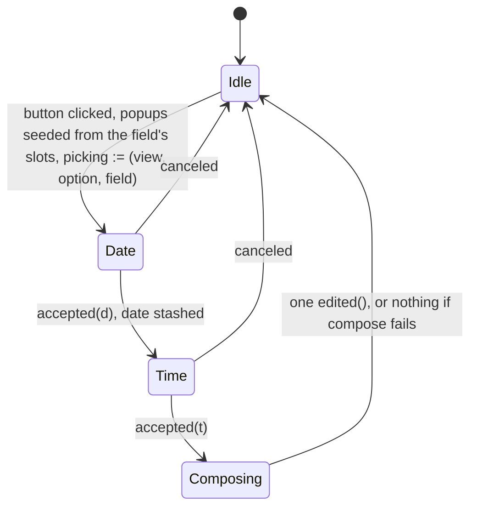

# Design — Slice 009: the form grows the rest of its field kinds

<!-- The *current* design, not its history. Revision chronology, review
     findings, and dispositions live in `design-log.md`.
     Reference forms: canon by id (`SPEC-003 §4`, `ADR-007`, `POL-002`);
     doc-local refs bare — OQ-1 (§6), D1 (§7), R1 (§8). Ids are immutable. -->

## 1. Design problem

`SPEC-001/R-16` admits five field kinds and `R-57` types what each submits.
This renderer draws one. The other four — `text`, `number`, `choice`,
`datetime` — are reported through `Undrawn::FieldForm`, which is correct under
`R-55` and has stood for two slices.

This design draws them. **It adds no protocol**: every kind is already admitted
and already typed, so the work discharges a renderer subset rather than
widening a contract. What it does add is the first host state a person can
change *continuously* — a caret in a text field, a grab on a slider — and that
collides with how a present works today. `SlintGlass::present` ends in
`set_vec`, which destroys and rebuilds every row; with only a checkbox drawn
that was invisible and, worse, load-bearing, because a rebuild is what
re-establishes the binding a click destroys. Typed input makes it visible: a
keystroke would eat the caret.

The boundary: how the four kinds draw, what each submits, what an untouched one
submits, and when a present may write in place. Outside it: `field.value`
prefill and per-field errors (`SPEC-001/OQ-2`), a `step` hint on a `number`, a
date without a time (`SPEC-001/OQ-4`), and a scheduled firing superseding a
view mid-answer (`SPEC-002/OQ-4`).

## 2. Current state

`research.md` Thread 2 is the code map and Thread 3 the measurements; neither is
restated here.

The shape that matters: a `Presentation` is built once at `reception.rs:75` and
never mutated — `controller.edit` writes only `prepared.draft`
(`controller.rs:277`). A `Draft` is keyed by (option, field) and answers
`Edited::Checked(false)` for anything absent (`draft.rs:53`).
`glass.rs::option_rows` folds the two together, building each `FieldRow` from
the draft, so a present writes the whole form back from the model — which is
what corrects a click the host dropped (`app.slint:279`), and which is why
values already survive a present. What does not survive is *interaction* state,
and only for `text` and `number`.

`ViewId` is host-minted, `{RFC 3339}#{seq}`, with the sequence incremented for
every view (`goad-shell/src/state.rs:76`).

## 3. Forces & constraints

**Canon.** `R-16` (the five kinds and their keys), `R-17` (finite, ordered
bounds, already enforced in normalization), `R-18` (only the renderer may branch
on a hint), `R-35` (the host may constrain what is *entered*, never refuse what
*was*), `R-52` / `R-53` (alternative ids are a namespace of their own), `R-55`
(a subset must not narrow the protocol), `R-57` (the JSON type of each kind's
submission), `R-58` (a value for exactly the drawn fields of the answered
option). `ADR-001` / `POL-001`: all of this is stratum 3; nothing reaches
`goad-semantics`.

**Measured limits** (`research.md` Thread 3). A `PopupWindow` cannot be repeated
or conditional, so both pickers are root singletons and a `datetime` field has
no inline control. It is also constructed fresh on every show and dropped on
close, so nothing survives between two opens of one, and its properties cannot be
assigned from an enclosing component's handler — they can only be bound at its
own declaration site. A click on a `CheckBox` destroys the use-site binding
permanently. `changed` handlers fire nowhere under `init_no_event_loop`.
`LineEdit` exposes no readable cursor offset, so a destroyed text field cannot
have its caret restored — and no tier can assert the caret at all.

**Type limits at the markup boundary.** Slint's `float` is `f32` and its `int`
is `i32` (`slint-1.17.1/type-mappings.md:13-16`). `NumberRange` holds `f64` and
`R-17` admits any finite one, and the picker structs carry `int` where jiff
wants `i16`/`i8`. Both are narrowings the protocol does not permit a renderer to
make. So a value crossing that boundary is carried as text, or converted with a
check, or — in the one case where neither applies, a `Slider`'s own value — sent
as a `float` only because the control it came from was admitted on the condition
that its whole range is `f32`-exact (§5.2, I-G, R7).

**Manifest.** `jiff` is `default-features = false` workspace-wide and no member
adds anything back, so it resolves with **no features**. `TimeZone::try_system`
is then an unconditional `Err` and `TimeZone::system` falls back to
`Etc/Unknown`, silently. Reading the system zone at all is a manifest change to
a dependency stratum 1 shares — `POL-001`'s named residue, argued in §10.

**Purity.** `draft.rs` declares no clock, no file, no socket. Anything needing
the system time zone must resolve it before the value reaches the draft.

**Prior commitment.** `design-log.md` D-4: a per-backend configurable text
debounce, 150 ms for now, the configuration surface deferred. D-14 widens it
from text to every continuously-edited control, for the reason D-4 gave; the
value and the deferral are untouched.

## 4. Guiding principles

**P-1 — Structure and state are two channels, all the way to the widget.**
`view_model.rs` holds what the backend said and `draft.rs` holds what the person
did; the markup boundary is the one place they were being folded back together,
and this design stops doing that.

**P-2 — A widget is corrected, never rebuilt.** Convergence is a guarded
imperative write triggered by an epoch. The rebuild is reserved for a new view,
where there is nothing to preserve.

**P-3 — As-drawn is what the widget shows.** Where a kind has no neutral to
show, the host says *not set* and submits a value nobody would pick, rather than
inventing a plausible answer.

## 5. Proposed design

### 5.1 System model

```
  goad-semantics (untouched)          crates/goad — stratum 3
  ┌──────────────┐   present()   ┌────────────────────────────────────────┐
  │ canonical    │──────────────►│ view_model.rs                          │
  │  FieldKind   │               │   PresentationField { id, label, kind } │
  │  (5 kinds)   │               │   DrawnKind — the five drawn, host-local│
  └──────────────┘               │   FieldForm — now uninhabited           │
                                 │   as_drawn / interpret — kind-directed  │
                                 └───────────────┬────────────────────────┘
                                                 │ structure
  ┌──────────────┐  record()   ┌─────────────┐   │
  │ controller.rs│────────────►│ draft.rs    │   │  glass.rs builds both
  │  edit()      │             │  Edited (5) │───┼─►in one pass; slot = index
  │  answer()    │◄────────────│  submitted()│   │       value
  └──────────────┘  state_of() └─────────────┘   ▼
         ▲                                 ┌──────────────────┐
         │ Command::Edit, Command::Choose  │ app.slint        │
  ┌──────┴───────┐   drain    ┌──────────┐ │  values[]   ← rewritten always
  │ install.rs   │◄───────────│ pending.rs│ │  options[]  ← rebuilt on new view
  │  callbacks   │───────────►│ a Reported│ │  epoch      ← bumped always
  └──────────────┘   write    │ + its view│ └──────────────────┘
                              │ per field │  written in that order — §5.5 I-F
                              └─────┬─────┘
                                    │ overlay — an entry made on the view being
    one edit on the timer, which    │ shown wins over the draft (§5.5, I-H)
    re-arms while the map is not    └──────────────────────► glass.rs
    empty; every entry inside a Choose
```

Two new modules, a new host-local enum, and one existing type that loses its
variants. Three small types come with them and are stated where they are used:
`Finite`, which is what makes I-G a property rather than a habit; `Reported`,
which is the most a widget's callback can say before the retained presentation
interprets it; and `PendingEdit`, which is what `Command::Choose` carries (§5.2).

`FieldForm` currently names the kinds this renderer does not draw. Once all
five are drawn it has no variants left, so it becomes an empty enum and
`Undrawn::FieldForm` can no longer be constructed. That is fine for AC-7,
because the mechanism AC-7 cares about is not `FieldForm` itself but
`undrawn_form`'s exhaustive match over the canonical `FieldKind`. That match
still fails to compile if the protocol grows a sixth kind, and whoever adds it
then has to decide: draw it, or give `FieldForm` a variant back.

**What that costs is an enumeration, not a rename**, and it is written out here
because every entry is a live site that will not compile or will silently lie:

| site | what assumes the variant is constructible |
|---|---|
| `diagnostics.rs:202-215` | the undrawn line, whose text — *"this renderer draws boolean fields only"* — becomes unreachable **and** false. The arm stays, because a sixth kind would give `FieldForm` a variant back; its wording must stop naming a subset that no longer exists |
| `draft.rs:82` | `submitted`'s doc sends a sixth `FieldKind` to `Undrawn::FieldForm`. True today, and after this slice that destination has to be re-created before it can be reached |
| `view_model.rs:31` | `body_is_degraded`'s doc excludes `Undrawn::FieldForm` by name, from a set the enum can no longer contribute to |
| `tests/renderer/mapper.rs:195-203` | asserts each variant's `Display` |
| `tests/renderer/mapper.rs:290-327, 375-399` | constructs and reads back reported `FieldForm`s |
| `tests/renderer/wiring.rs:1245` | `edit(…, "noted", …)` expects `Refused::UnknownField` **because `noted` is undrawn**; `noted` becomes a drawn `text` field and the edit is accepted |
| `tests/renderer/wiring.rs:1304` | expects the submitted keys of `TWO_FORMS`'s `morning` to be `["read", "stretched"]`; `noted` joins them |
| `tests/renderer/wiring.rs:1340` | the `R-58` MUST NOT case. It opens with a guard assertion that the fixture really does carry an undrawn field, and that guard becomes unsatisfiable |
| `tests/renderer/fields.rs:67-71, 597-632` | `A_DRAWN_AND_AN_UNDRAWN_FIELD` and the case built on it — which `SPEC-001` §Verification names **by id** in its `R-58` row |

There is no substitute construction: a `group`-hint field is still *drawn*, and
the surviving `Undrawn` variants are body-level.

That costs more than a rewrite of the suite, and the design says so rather than
letting it be discovered. `R-58`'s MUST NOT prohibits two things — submitting a
value for a field the host did not draw, and submitting a field of an option it
is not answering. After this slice the first is **unobservable**: no view can
carry an undrawn field, so no case can watch its value stay off the wire. The
second is untouched and still asserted by the same fixture's two options sharing
the field id `read`. `canon-delta.md` CD-2 records that as a permanent reduction
in what the suite asserts about a normative rule, alongside the `R-55` row's
statement that option fields go undrawn, which also stops being true. §9 carries
the obligation to rewrite each site above.

One of those sites, `wiring.rs:1245`, reaches `Refused::UnknownField` through
`noted` being undrawn. After this slice that refusal is reachable only from a
field id no view declared — the posture §5.2 already gives an out-of-range
`ComboBox` index — so the refusal itself stays asserted, from a fabricated id
rather than from a real field's kind.

`DrawnKind` is the new type and holds the per-kind data the renderer needs to
draw a field — the bounds of a `number`, the alternatives of a `choice` and the
first of them beside the list, for the reason §5.2 gives under as-drawn. It
could have been the canonical `FieldKind` cloned, which would avoid a second
enum, but then a sixth protocol kind would be representable in a drawn field
and would silently fall through the markup's `if` chain drawing nothing. A
host-local enum means the sixth kind has to be added here too, which is another
place the compiler stops you.

`pending.rs` holds the debounce. It is a map of pending edits **keyed by
(option, field)**, one `slint::Timer`, and nothing else. Keyed, not singular,
because a person who types into one field and moves to another inside the window
would otherwise lose the first field's last keystrokes — D-8 forbids flushing on
the switch, so the only place left to hold them is here. The map does not branch
on kind: an entry is a `Reported` and the map neither reads it nor cares which
control produced it. Which controls route through the map is §5.2's table —
`text` and both `number` controls, because those are the ones a person changes
continuously; `boolean`, `choice` and `datetime` raise one discrete edit and it
is sent where it is raised. `install.rs` clones a handle into the `edited`
closure and one into `chosen`, and otherwise stays what it is now, which is
wiring.

**Every entry carries the `view` it was made on**, because an entry outlives the
view that produced it and the map is keyed by strings a replacement view can
reuse. The `edited` callback already receives that view as its first argument,
so this costs a struct field and no new plumbing — and it is the only available
source for the `view` a deferred `Command::Edit` has to carry. The rule it buys
is one sentence applied at three sites, and §5.5 states it as I-H: **an entry is
used only against the view it was made on.** It is *shown* only while that view
is the one being presented; it is *sent* by the timer in a command carrying that
view, so the controller's existing identity check refuses a stale one; and it is
*drained* into a `Choose` carrying that view alongside, so the controller refuses
a stale one there too. Clearing the map when the row model is rebuilt was
rejected: it gets the same effect by a less direct route — the renderer would
have to notice a new view separately from the `set_vec` it already does — and it
still leaves the timer with no `view` to send.

The two ways an edit leaves `pending.rs` are not symmetrical, and the asymmetry
is forced. When the timer fires, **one** `Command::Edit` goes down the channel,
and the timer re-arms while the map is still not empty. When the person answers,
**the pending edits travel inside `Command::Choose`** rather than as sends before
it. The command channel holds one (`main.rs:86`) and `serve` shares the UI thread
through `spawn_local`, so a Slint callback — which is synchronous and has no
await — cannot let `serve` drain between two sends: the second `try_send` of any
flush does not merely risk `Full`, it always gets it. Carrying the edits makes
the flush one send, which is what lets D-8's *"the debounce flushes when the draft
becomes an answer"* hold by construction rather than by a queue ordering that was
never available (§5.2, §5.4).

One entry per tick is therefore the most the timer can deliver, and that is a
consequence of the capacity-one channel rather than a choice made here. It costs
nothing in correctness: the answer drains whatever is left in one command, so
nothing waits on the timer to be *right*, only to be *early*. A `slint::Timer`
may be re-armed from inside its own callback — `start_or_restart_timer` preserves
the timer's `being_activated` flag and replaces the callback, and
`maybe_activate_timers` puts the old callback back only where the callback did
not restart its own timer, which it says in as many words
(`i-slint-core-1.17.1/timers.rs:348-372`, `:330-334`). Read from the locked source
rather than assumed, because the whole re-arm rests on it — and then measured
under a real loop rather than only read: two entries made in one window both
arrive down the capacity-one channel, the second reachable only through the
re-arm, and removing the re-arm delivers one and the case fails.

An entry leaves the map when the send that carries it is **enqueued**, not when
it is accepted: a refusal has already been reported and the guard corrects the
widget, whereas a `Full` send has delivered nothing and the entry must stand.
That is why `Wire::send` reports its outcome (§5.2).

`instant.rs` turns a picked date and time into an instant and an offset, and
answers what a picker should open on for a field nobody has picked yet. It exists
to keep two impure **kinds** of read out of `draft.rs`, which declares itself
pure — the clock, and the system time zone — performed at **three** sites: the
clock in `today_local`, and the system zone in both `compose` and `today_local`.
`today_local` cannot answer a *local* date from the clock alone, so it reads the
zone as well; the module whose reason to exist is holding the impurity should not
undercount where it performs it.

`glass.rs` does not get bigger, but `option_rows` splits into two functions, one
per channel, run in a single pass so that a field's slot is its index into
`values` without anything having to keep them in step. The value function also
reads `pending.rs`: a field's displayed value is the draft's **overlaid with the
pending entry** for that field, where there is one made on the view being shown
(§5.3). That is what keeps a present inside the debounce window from writing a
stale draft value back over someone mid-type.

### 5.2 Interfaces & contracts

**Slint.** One struct per channel, with a kind discriminant selecting which slot
is meaningful. The spike measured that this compiles and that a struct literal
may name a subset of fields.

```slint
export enum Kind { boolean, text, number, choice, datetime }

// structure — written only when the view changes
export struct FieldRow {
    id: string, label: string, kind: Kind, slot: int,
    slider: bool,                                 // the control, decided by the host
    minimum: float, maximum: float, step: float,  // read only where `slider`
    alternatives: [string],                       // labels, in declared order
}
// state — rewritten every present; nothing repeats over it
export struct FieldValue {
    checked: bool,
    text: string,   // what every control displays: the text as typed, the
                    // formatted number, the composed datetime, or `not set`
    number: float,  // the Slider's value, and the Slider's guard comparand
    index: int,
    date: Date, time: Time,   // what this field's picker opens on
}
// one edit, typed: the callback maps it straight to a `Reported` (below), so
// the boundary does no parsing it cannot undo
export struct FieldEdit {
    kind: Kind, checked: bool, text: string, number: float, index: int,
    date: Date, time: Time,
    slider: bool,   // which control raised this, not which the row declares
}

in property <[FieldValue]> values;
in property <int> epoch;
callback edited(string, string, string, FieldEdit);   // view, option, field, edit
```

**A number at the markup boundary.** Slint's `float` is `f32` and its `int` is
`i32` (`slint-1.17.1/type-mappings.md:13-16`), while `NumberRange` holds `f64`
and `R-17` admits any finite one. Running the protocol's numbers through a
32-bit channel would narrow the contract — a legal bound of `1e100` arrives as
infinity — and it would narrow it by a type rather than by a decision, which is
`CLAUDE.md`'s third invariant failing in the quietest available way. The
boundary is therefore crossed differently in each direction, and the rules are
stated together because they are one account of one boundary rather than four
separate precautions.

*Out of the host.* Bounds and the displayed number cross as `float`, and neither
reaches the wire. `FieldValue.text` carries what every control displays,
formatted host-side from the `f64`; `FieldValue.number` and `FieldRow`'s
`minimum` / `maximum` / `step` exist for the `Slider` alone.

*Into the host.* The two `LineEdit` controls send their edit as **text**, which
is lossless for every finite `f64`; the host records that text and parses it.
The `Slider` sends
`FieldEdit.number`, a `float`, because it has nothing else to send: its `value`
*is* an `f32`, and making the markup format that into a string would mean
comparing the guard against a value parsed back out of a string whose form Slint
does not specify to round-trip — a difference manufactured by the round trip
itself, written back over a person mid-drag. That is R4, and it is not worth
buying with a repair aimed at a narrowing that does not occur here: the `Slider`
is drawn only over a range that is exactly representable in `f32` (below), any
`number` outside that draws the lossless text control, and `as_drawn` is computed
host-side in `f64` and never crosses. What a slider can *produce* is granular —
that is true of any slider, pixels included — and granularity of a control is not
a narrowing of the contract, which still admits and still answers every legal
message.

**Parsing the text is `f64::from_str`, and the host repairs nothing** (D-33). A
numeric `LineEdit` is `input-type: decimal`, which validates each typed
insertion through Slint's `string_to_float`. That function branches on the
global context's decimal separator: where it is `.`, it is `parse::<f32>()` on
the text as it stands; where it is anything else, it rejects any text containing
a `.` and parses what is left after replacing the separator with one
(`i-slint-core/string.rs:398-412`; `items/text.rs:2202-2229`). In every process
this workspace builds the separator is `.` (below), so the branch taken is
always the first, and Rust's float grammar is the same for `f32` and `f64`.
`f64::from_str` on the raw text therefore admits exactly what typing admits,
minus the control's two-byte escape trio — `-`, `.` and `-.` — which no parse
accepts on either side. **Empty text is not zero.** `"".parse::<f64>()` is an
`Err` like any other unaccepted text, so a cleared field takes `interpret`'s
`.or_else(|| held_number(held))` fallback and **keeps the number it already
held** (`view_model.rs:793-802`); `0` results only where the field was drawn at
zero — no `min`, or `min: 0`. The other reading, that an empty field is zero
because Slint's own `to-float` takes it that way, belonged to D-16, and D-33
reversed it when the host stopped parsing through the control. It justified the
numeric guard's one exception, which PHASE-08/EX-7 then measured out.

**The separator is `.`, and that is a fact about the configuration rather than
about the code.** `SlintContext::locale_decimal_separator` is a plain
`Property<char>` initialised to `'.'` with no binding
(`i-slint-core/context.rs:122-125`), and four sites write it: `set_locale`,
documented *testing only* and reached from `i-slint-backend-testing` alone
(`context.rs:302-309`); two arms of `select_bundled_translation`, which need
`with_bundled_translations` at compile time and an explicit call
(`translations.rs:436-444`), while `crates/goad/build.rs` bundles none and
nothing in the crate calls either; and one arm of `mark_all_translations_dirty`,
which does read the system locale but is compiled out behind `gettext-rs`
(`translations.rs:304-310`) — a feature `slint` does not default to, and whose
crate is absent from `Cargo.lock`. So the hazard is not unreachable in
principle, it is one manifest feature away on unix, and a host-side mechanism
for it would be one no build this workspace produces can reach. §8 R11 records
the configuration that would arm it, and what it would cost.

**One rule covers every text the control admits: the host records the text, and
the last representable number stands.** The text is recorded verbatim, always.
The number is replaced only where the parse yields a finite `f64`; otherwise the
field keeps the number it had — for a field nobody has touched, the number it was
drawn showing. So `-`, `.` and `inf` all leave the number alone: each of them
reaches the host and no *finite* parse accepts any of them (below). `1e400`,
which `input-type: decimal` admits because Slint validates through an `f32`
parse where it is an infinity, stays on screen as `1e400` while
the host keeps `1e40` as the number it would submit — measured, with an injection
pass (`guard_text.rs`, case `verbatim-overflow`).

That is one rule holding two properties no choice of comparand could hold on its
own: nothing non-finite reaches the wire, because `Finite` refuses it, and
nothing is written back over a person mid-entry (F-30, F-34).

**The class the control admits is every string.** `input-type: decimal` gates
typing and nothing else. `TextInput::insert` — the paste path — performs no
validation at all and never consults `input_type` (`items/text.rs:1783-1827`;
`StandardShortcut::Paste` is dispatched at `:1034`, ahead of both
`accept_text_input` call sites at `:1067` and `:1117`). Neither does
`set_accessible_value`, which assigns `text` and calls `edited` from inside the
markup (`widgets/fluent/lineedit.slint:16`) — and that is §9's principal driver,
so every numeric case the plan writes drives the unvalidated path by default. An
`input-type` is a typing aid, never a class the host may reason from.

That is the other half of why the parse repairs nothing. A rule that replaced a
single foreign character with `.` and parsed again would read a pasted `12/25`
as `12.25`, `3:30` as `3.30` and `$5` as `0.5` — a number the screen never
showed. That is `CLAUDE.md`'s *an ambiguous message fails rather than being
guessed at*, and D-6's own rule against holding a value nobody gave as though
someone gave it. The one rule above is total over every string on its own, so
declining to guess deletes a case rather than adding one.

One property of the admitted class is still worth stating: **a parse can accept
a text non-finitely.** `string_to_float` is `parse::<f32>`, which takes `inf`,
`infinity` and `nan` case-insensitively as well as reading `1e400` as an
infinity. Typing `inf` fails at the first `i`, because a one-byte candidate must
be `-` or `.`, but pasting it succeeds. Either way a non-finite parse is not a
finite one, so the text is recorded and the last representable number stands —
no code, and nothing for `Finite` to refuse that it does not already refuse.

All of it is host-side, testable without a locale fixture, and numeric formatting
rather than anything domain-shaped (D-33). Sending Slint's own parsed float
alongside the text was rejected: it reintroduces as a fallback the `f32` path this
section exists to keep off the wire.

**Formatting a number is the inverse of that rule, and the spelling is
load-bearing** (D-32). `Edited::Adjusted` carries a text beside the number, so
every site that produces one without a person having typed has to choose a
format — `as_drawn`, and a `Slider`'s `AdjustedValue` — and that format is what
the widget is drawn showing and what the guard compares. The rule: format with
`f64`'s `Display`, which is the shortest decimal that reads back as itself and
never uses scientific notation, and where that spelling exceeds **24
characters**, use `{:e}` instead.

The trigger is length because the defect is length. `min: f64::MAX` is a legal
`R-17` bound and its `Display` is **309 characters** in a `LineEdit`; the
smallest normal is 326. Both measured. 24 leaves alone every number a person
would type — an `f64` round-trips in at most 17 significant digits, so 17
digits, a sign and a point is 19 — and catches exactly the spellings that are
long only because the exponent is. Switching on magnitude instead, the
spreadsheet rule, needs two constants and sends `1e16` to scientific when its
plain spelling is 17 characters.

Both spellings re-parse under the parse rule above, which is what the guard's
comparand needs, and neither costs the plan an obligation: `f64::from_str` takes
`1e5` and `1.7976931348623157e308` natively, so there is no numeric grammar for
anyone to pin against the formatter (D-33).

**The control is the host's decision, not the markup's inference.** `slider` is
a decision the row carries, not a fact about the field the markup reasons from.
One site decides it:

```rust
/// The bounds a `Slider` may be drawn over, or `None` for the numeric text
/// control. The only place a `number`'s control is chosen.
fn slider_bounds(range: &NumberRange) -> Option<(f32, f32)>;
```

Today it answers `Some` when **all** of the following hold, and `None`
otherwise. Every one of them is evaluated in `f32`, because `f32` is what Slint
will be doing the arithmetic in:

- both bounds are present, and each round-trips `f64` → `f32` → `f64` unchanged;
- the span `maximum - minimum` is finite and strictly positive;
- the step, `(maximum - minimum) / 100`, **moves the value**: `minimum + step`
  is greater than `minimum`, and `maximum - step` is less than `maximum`.

An exact endpoint round-trip on its own is not enough, because Slint's slider
arithmetic is what has to work afterwards. It places the thumb by dividing by
`maximum - minimum` (`fluent/slider.slint:75-76`), so equal bounds such as
`[1, 1]` divide by zero, and `[-f32::MAX, f32::MAX]` has an infinite span even
though both endpoints are exact. That is what the span clause is for, and it is
also what makes the division safe to perform at all.

The third clause states operability directly rather than approximating it with a
sign test, and it is the one that took three attempts. A step that is finite and
strictly positive can still be too small to do anything: `increment()` is exactly
`root.set-value(root.value + root.step)`
(`common/slider-base.slint:126-128`), and `set-value` returns immediately when
the result equals the value it already holds (`:117-124`). At
`minimum = 2^100` the `f32` ulp is `2^77`, so bounds of `[2^100, 2^100 + 2^77]`
round-trip exactly, have a finite positive span, and give a step of about
`2^70.3` — below half an ulp at that magnitude, so `minimum + step` rounds back
to `minimum` and the slider is frozen. Requiring the step to move the value
catches that, and **subsumes** the positivity test it replaces: a step that
underflows to zero fails it, and so does a non-finite one. A zero step is
separately fatal — `SliderBase` rejects every key when `step <= 0`
(`common/slider-base.slint:79`) — but it no longer needs its own clause.

None of what the predicate rejects is a loss: each takes the text control, which
is where a range a slider cannot operate belongs anyway — a slider over a single
value offers nothing.

So the text control is the one that always works and the `Slider` is the one with
an admissibility condition, which is the opposite of how a bounds-driven reading
makes it look. A later slice that wants the choice to read a hint (`R-18`
permits the renderer, and only the renderer, to branch on one), or a
configuration, or nothing at all, changes this function's body and nothing else:
not the markup, not the wire, not `Edited`.

**The five kinds and their controls.**

| kind | control | shown from | edit raised on |
|---|---|---|---|
| `boolean` | `CheckBox` | `checked` | `toggled` |
| `text` | `LineEdit` | `text` | `edited`, debounced |
| `number`, slider admissible | `Slider` over `minimum`/`maximum` | `number` | `changed`, debounced. Sends `number`, `slider: true` |
| `number`, otherwise | `LineEdit`, `input-type: decimal` | `text` | `edited`, debounced. Sends `text`, `slider: false` |
| `choice` | `ComboBox` over the labels | `index` | `selected` |
| `datetime` | `Button` showing the value, or *not set* | `text` | the time picker's `accepted` |

A `Slider` binds `changed`, and nothing else. Slint raises `released` from
the pointer and keyboard paths, but its accessibility `set-value`, `increment`
and `decrement` actions all route through `set-value`, which raises `changed`
and nothing else (`widgets/common/slider-base.slint:114-131`,
`widgets/fluent/slider.slint:30-36`). A `released`-only binding is therefore
deaf to an assistive technology, and — §9 — cannot be operated by any test tier
either. `changed` fires continuously through a drag, so it takes the same
debounce the text controls take.

`released` is not bound as a flush either (D-34). It has no interface to travel
on: the markup declares one host-ward callback for a field, `FieldEdit` carries
no *send this now* discriminant, and the pending map lives behind an `Rc` that
only `install.rs`'s closures reach — so a `released` binding could do nothing
but call `edited` again, which restarts the timer rather than flushing it. The
same fact that rules out a `released`-only binding also means no tier can raise
it, so a flush could not be measured either. What it would buy is the last
150 ms of a drag, which the timer delivers one tick later and which the answer
path flushes in full. The two ways an edit leaves `pending.rs` (§5.1) stay two.

A `Slider`'s `step` is `(maximum - minimum) / 100`. Slint defaults it to `1` and
rejects every key when it is `0` (`slider-base.slint:8`, `:79`), so leaving it
alone gives a field declared `min: 0, max: 1` a keyboard that crosses the whole
range in one press, and zeroing it removes the keyboard entirely. Slint's own
rule for `accessible-value-step` is `min(root.step, (maximum - minimum) / 100)`
(`fluent/slider.slint:29`), which **caps** the step it reports at a hundredth of
the span — an upper bound, not a floor. Under this design's `step`, which is
exactly that hundredth, the cap binds at equality, so the increment an assistive
technology is told about is the one the keyboard gives. This is presentation,
which `R-18` leaves to the renderer; the `step` `slice-009.md` excludes is the
**protocol** one.

All six controls carry `accessible-description: field.id`; the test harness
finds fields by description (`tests/renderer/harness.rs::described`), so one
without it would be invisible to every renderer test.

**The guard.** Each control carries
`property <int> tick: root.epoch; changed tick => { … }`, comparing itself
against `root.values[field.slot]` and writing itself back where they differ:

| control | compares | and converges unless |
|---|---|---|
| `CheckBox` | `self.checked` against `checked` | they are equal |
| `LineEdit`, text | `self.text` against `text` | they are equal |
| `LineEdit`, number | `self.text` against `text` | they are equal, **or** the widget is empty and the held number is zero |
| `ComboBox` | `self.current-index` against `index` | they are equal |
| `Slider` | `self.value` against `number` | they are equal |

The `datetime` `Button` is absent from that table and needs no guard: it never
assigns its own text, so its binding to `values[field.slot].text` is never
destroyed and a present corrects it by writing the slot. The other five all
self-assign — that is what a click, a keystroke, a drag or a selection does to a
widget — which is the whole reason a guard exists.

The numeric `LineEdit` is the one worth explaining, and what makes it hard is not
the choice of comparand. It was the only control whose held value was not the
thing it displays. `f64` → text is not injective, so **no** comparison between the
widget's text and a re-format of the host's number can be an identity: typing
`1.05` yields `105`, because after `1.` the host holds `1`, formats `"1"`, and the
guard overwrites the dot; typing `-3` yields `3`, because `-` alone does not
parse, nothing is recorded, and the guard replaces the sign with `"0"` before the
digit arrives. Both measured (`guard_text.rs`). Comparing `self.text.to-float()`
against the held number instead fails at the protocol's extremes rather than in
the middle: `to-float` parses to `f32` (`i-slint-core/string.rs:399-412`), so
`1e100` and `1e101` both become infinity and compare equal while the strings
differ.

So the host holds the text a person typed, beside the number it means (above), and
the guard compares string against string — which is what the *text* `LineEdit`
already does, and why its guard has never been in trouble. The comparison is then
an identity, and it is quiet through `1.05`, `-3`, trailing zeros and `1e400`
alike. What the guard exists for still converges: AC-6 is the case where the host
does *not* hold the edit, so the value channel and the widget differ and the
widget is corrected on the very next present, in one step.

**What the guard compares itself against is the overlaid channel, not the draft**
(§5.5, I-H), and that is what makes *the host did not record this* and *the host
has not recorded this yet* two different things. They were one thing to the guard,
and the debounce is what created the second: a present landing inside the 150 ms
window would otherwise write the draft's older value back over someone mid-type.
Nothing about the guard itself changes — it is the channel that now tells the
truth. So the guard converges exactly where the host holds neither a draft value
nor a pending entry for the field: a dropped or refused edit has left
`pending.rs` and never reached the draft, and converges as before; an edit still
waiting on the timer is displayed, and stands.

The exception is the measured cleared-field case and nothing wider: a person who
clears a field the host holds as `0` leaves `""` in the widget before their own
debounce has recorded it, and a bare string comparison writes `"0"` back over them
mid-edit (`numeric_guard.rs`, negative-controlled — and the case survives the
change of comparand). So: converge unless the strings match, or unless the widget
is empty and the held number is zero.

**That exception is probably now dead, and it stays until a case says so.** The
overlay appears to subsume it: a cleared field is a pending `AdjustedText("")`,
`interpret` reads that as the text `""` beside a number of zero, the channel
carries `""`, and the strings agree on their own. But this comparand has been
wrong three times in this review, twice on reasoning, so the exception is carried
into the implementation and removed only after `numeric_guard.rs`'s case has been
re-run against the overlay and shown not to need it. §9 carries that as an
obligation rather than leaving it in prose.

**Converging on recency was the third candidate and is not taken.** A per-slot
revision the host bumps deletes the comparand rather than correcting it, and is
the better shape in the abstract. It was measured available rather than estimated:
a present that changes no revision fires nothing, and one bump converges one slot
while its neighbour stays mid-edit (`revision.rs`). What rules it out is its own
behaviour. `-` and `1e400` are edits the host cannot record **as numbers**, which
is exactly when a revision guard converges, so it writes over them unless the host
holds the text anyway — and once the host holds the text there is no comparand
left to get wrong. The revision then buys only the deletion of the one exception.
It stays available if that exception ever grows.

The `Slider`'s comparand is `f32` on both sides, which is sound rather than a
residue of the boundary above: a `Slider` is drawn only over an `f32`-exact
range, and `FieldValue.number` is computed host-side from the same `f64` every
present. The guard detects divergence; it never supplies a value to the wire.

**`draft.rs`.**

```rust
/// A finite `f64`. Private field, fallible constructor: the only way to hold
/// one is to have checked it.
pub struct Finite(f64);
impl Finite {
  pub const ZERO: Self = Self(0.0);
  pub fn new(value: f64) -> Option<Self>;          // `None` for NaN and both infinities
  pub fn get(self) -> f64;
}

/// What the draft holds, and the only thing `submitted` maps.
pub enum Edited {
  Checked(bool),                                  // R-57: JSON boolean
  Typed(String),                                  // R-57: JSON string
  Adjusted { number: Finite, text: String },      // R-57: JSON number, from
                                                  // `number`; `text` is what
                                                  // was typed, and never
                                                  // reaches the wire
  Chosen(AlternativeId),                          // R-57: the alternative's id, as a string
  Picked { instant: Timestamp, offset: Offset },  // R-57: RFC 3339, with an offset
}

pub fn state_of(&self, option: &OptionId, field: &FieldId) -> Option<Edited>;
pub fn as_drawn(kind: &DrawnKind) -> Edited;      // view_model.rs — the wire's
                                                  // answer for an untouched field
```

`Adjusted` holds a `Finite` rather than a bare `f64` so that I-G is a property of
the type and not a habit. It holds the text beside it because that is what the
widget displays and what the guard compares (above); `submitted` reads the number
and never the text. `Controller::edit` is public and takes any `Edited`;
`f64` admits `NaN` and both infinities; `serde_json::Value::from(f64)` turns each
of those into JSON `null`, which `R-57` does not admit. With the field private
and the constructor fallible, a non-finite submitted number is not merely
unwritten, it is unrepresentable.

`state_of` returns an `Option` now. It used to answer `Checked(false)` for an
absent key, which worked while a boolean was the only kind; it cannot answer for
the other four because the right answer depends on the kind and the draft does
not know the kind.

**The callers do not treat that `Option` alike, and that is the point.**
`glass.rs` reads it directly when building a value: `None` means *untouched*, and
for a `datetime` that is what the button renders as *not set*. There are two
sites that apply `as_drawn`, and only one of them is in `controller.rs`:
`answer`, because `R-58` forbids omitting a value for a drawn field; and
`interpret` (below), to supply the number a numeric text falls back to. Keeping
`glass.rs` out of that is what makes D-6's epoch a fact about the wire rather
than a fact about the screen, which is what D-6 chose it to be — a button reading
`1970-01-01T00:00:00+00:00` would be the host showing a person an answer nobody
gave. For the other four kinds the two coincide by construction (P-3), so
`datetime` is the only kind whose display can tell *untouched* from *picked*.

`Chosen` carries an `AlternativeId` rather than a string. `AlternativeId::new`
is `pub(super)` in `goad-semantics`, so this crate cannot mint one; it can only
clone one off a view it drew. That is how AC-8 and `R-52` get held. The
consequence is that the ComboBox reports its index, and `controller.edit`
interprets the index against the drawn field's alternatives — on the same walk it
already does to check the field id is real. That is what `Reported` below is for.
An index out of range is a renderer bug and gets the existing
`Refused::UnknownField` treatment: reported, nothing recorded.

**What a widget reported is not yet what the draft holds.** Two of the five
values can only be formed where the retained presentation is, and a Slint callback
is not there:

```rust
/// What a widget reported, in the widget's own terms — the most a callback can
/// know. `draft.rs`, beside `Edited`; `Command::Edit` and `PendingEdit` carry it.
pub enum Reported {
  Checked(bool),           // CheckBox
  Typed(String),           // text LineEdit
  AdjustedText(String),    // numeric LineEdit — the text as typed
  AdjustedValue(f32),      // Slider — its own value, an `f32` by nature (D16)
  Chosen(u32),             // ComboBox — `current-index`
  Picked { instant: Timestamp, offset: Offset },   // composed in the callback
}

/// view_model.rs, beside `as_drawn`: what the draft should hold, given what the
/// widget reported and what the host holds for that field now — `None` where
/// the field is untouched. `None` out is a renderer bug.
pub fn interpret(reported: &Reported, held: Option<&Edited>, kind: &DrawnKind)
  -> Option<Edited>;
```

`Chosen` is the first of the two: an `AlternativeId` can only be cloned off a
drawn view, so the index travels and is interpreted against the drawn field's
alternatives (D12). `AdjustedText` is the second: a text that does not parse
finitely keeps the number the field already holds, and only the draft — or, for an
untouched field, the declared minimum it was drawn showing — knows what that is.
A `Slider`'s `AdjustedValue` is interpreted as an `Adjusted` whose text is the
host's format of the number, since nothing displays it.

**The two `number` variants are told apart by `FieldEdit.slider`, and by nothing
else** (D-38). They are the one pair of `Reported` variants that share a kind,
so `kind` alone cannot select between them, and no slot value can either: an
empty `text` is the measured cleared-field case (§5.2's comparand table, §8 R4)
and must reach the draft as `AdjustedText("")`, so *empty means the `Slider` was
at rest* would silently eat a real edit. Guessing between them is the second
invariant failing — an ambiguous message must fail rather than be guessed at —
so the markup says which control it is.

**Each control writes the literal, not the row.** A `Slider`'s handler sends
`slider: true` and the numeric `LineEdit`'s sends `slider: false`, the same way
the `CheckBox` sends `kind: Kind.boolean` rather than `field.kind`. Writing
`slider: field.slider` would make the report agree with the row by construction
and cost the host its only witness that the control drawn is the control that
reported. `FieldRow.slider` remains what it was — *the control, decided by the
host* — and `FieldEdit.slider` is the control's own account of itself; the two
agreeing is a fact about a correct renderer rather than a tautology.

`D-12` is untouched by this. It welds `FieldEdit.kind` to the **protocol** kind
so the markup never infers a field's kind from a fact about its bounds, and
`slider` is a second field rather than a sixth `Kind` value precisely so that
weld holds: `kind` still says `number` for both controls.

**`held` is an `Option`, and `interpret` applies `as_drawn` itself.** The
alternative was for every caller to write
`state_of(…).unwrap_or_else(|| as_drawn(kind))`, which puts the fallback in each
caller and puts `as_drawn` — a `view_model.rs` function — inside `controller.rs`
and `glass.rs` both. `interpret` already has the kind, so it can consult
`as_drawn` on its own, and every caller then passes `state_of(…)` through. There
are two callers: `controller::edit`, on the walk it already makes, and
`glass.rs`, building the overlaid value channel (§5.3).

**The `None` surface is all three of its cases**, stated in full for the same
reason `compose`'s four fallible steps are: a case left off this list becomes an
`unwrap` in the implementation.

1. a `Chosen` index no alternative of the drawn field has;
2. an `AdjustedValue` that is not finite;
3. a report whose variant does not match the drawn kind (D-31).

All three are renderer bugs and take the `Refused::UnknownField` posture:
reported, nothing recorded.

The third is there because the signature admits every pair — six reports against
five kinds is thirty, of which six are in-kind — and the first two do not cover
the other twenty-four. Two of them look covered and are not. A mismatched
`Chosen` falls into case 1 only if the implementation happens to answer *no
alternatives* for the four kinds that have none, which is a coincidence of
spelling rather than a rule. And a mismatched `AdjustedText` is not an exception
to *the text is recorded verbatim, always*: that rule is about an in-kind
`AdjustedText`, where there is a number to keep beside the text, and on a
mismatch there is no in-kind rule left to honour. Recording a value in answer to
a renderer bug is what D-6 refuses in its own words — a value nobody gave, held
as though someone gave it.

Giving `AdjustedValue` a `Finite` payload instead was rejected — `Finite::new`
would then run inside a Slint closure, which has nothing to report a refusal to
and no draft to leave alone. The refusal belongs where the other renderer-bug
refusals already are. Narrowing the signature so the thirty pairs cannot be
formed was also rejected: it reshapes `Reported` to answer a question one
sentence answers.

**The name is `interpret`, and no production line in this crate may be called
`resolve`** (D-30). `crates/goad-boundary`'s
`structure::no_production_line_in_the_renderer_names_the_identifier_resolve`
(`structure.rs:308`) asserts that no production line under `crates/goad/src`
names the identifier `resolve` at all. Its subject is
`goad_semantics::schedule::resolve`, and it is deliberately an identifier-word
match rather than a path grep, because a brace-grouped
`use goad_semantics::schedule::{resolve, wait_for};` would defeat a grep and not
this (F-3). `scan::mentions` splits a line on every non-alphanumeric byte and
then on camel boundaries, matching each segment singular-or-plural
(`scan.rs:225-234`), so `resolve`, `resolves`, `resolve_index` and `Resolve` all
trip it; and `code_of` keeps string literals, so a diagnostic message carrying
the word trips it too. Comments are cut before the match, so the ordinary
English word is still available in prose.

That binds the whole renderer permanently rather than just this function, which
is why it is stated here and not left to the plan. It needs no new obligation in
§9: `just check` runs `cargo test --workspace`, so the instrument is already in
the gate. `interpret` was checked against the boundary suite's other needles —
the domain-vocabulary list and `structure.rs`'s three call-form greps — and is
clear of all of them.

**`Reported` puts a float inside `Command`, which costs the `Eq` derive.**
`Command`, and `Edited` with it, carry `PartialEq` and drop `Eq`
(`wire.rs:21`, `draft.rs:26`) — `Body` already has that shape for the same
family of reason (`view_model.rs:81`). Nothing here needs `Eq`; the tests that
compare commands need `PartialEq`. It is written down because the alternative is
an implementer meeting a derive error and reaching for a hand-written `Eq`, which
over `AdjustedValue(NaN)` would claim a reflexivity the type does not have.

**`Finite` carries no `Eq` either**, and that is the same trap reached through
its other door. `impl Eq for Finite {}` is *sound* — the newtype excludes `NaN`,
the one `f64` that stops `PartialEq` being an equivalence — and on its own it
restores the derives on `Edited` and `Command` above it, under `-D warnings`,
with nothing to warn anybody. It was written and it compiled before it was
measured and deleted. So the rule is stated at the leaf: `Finite` derives
`PartialEq` and `PartialOrd` and nothing else. The only thing an `Eq` there
could buy is an `Eq` on `Edited`, which is exactly what this paragraph removes,
and an impl asserting a subtle property nothing consumes is a claim nobody
checks.

Six variants for five kinds, because a `number` has two controls and which one is
drawn is already a first-class decision (D16, D17). Keeping the two types apart
costs one enum and buys three things: `Edited` is exactly what the draft holds and
`submitted` maps; `Reported` cannot express an id nobody declared, so I-D is held
a step earlier than before; and the parse rule above lives in one pure function
instead of in a Slint closure. What it does **not** buy is I-G:
`AdjustedValue(f32)` admits `NaN` and both infinities like any other `f32`, so a
non-finite number is stopped by `interpret` at the boundary and by `Finite` at the
wire, and not by the shape of `Reported` (§5.5 I-G).

**As-drawn values**, following §4's P-3:

- `boolean` → `Checked(false)`, as today.
- `text` → `Typed("")`.
- `number` → `Adjusted` of the declared minimum where one was given, otherwise
  of zero, **beside that number's spelling under the format rule above**. The
  widget is drawn showing both, so the screen and the wire agree and the guard
  has a comparand. `R-17` already guarantees a declared bound is finite, so
  `Finite::new` cannot refuse one; it is still the constructor that is called,
  falling back to `Finite::ZERO`, because a total expression is cheaper than an
  argument about why an `expect` is unreachable.
- `choice` → `Chosen` of the first alternative's id, **which `DrawnKind::Choice`
  carries beside the list**. One always exists, because `Alternatives::new`
  rejects an empty list (`canonical.rs:362`) — but that is a fact about the
  protocol and is invisible to the compiler: `.first()` is an `Option`,
  `unwrap_used` / `expect_used` / `indexing_slicing` are `deny` crate-wide, and
  `AlternativeId::new` is `pub(super)` so there is no fallback id to construct.
  Cloning the id once where the kind is built makes `as_drawn` and every display
  site total with no lint exception anywhere. The two other ways out are not
  live: an `#[expect(clippy::expect_used)]` contradicts this section's own
  preference for a total expression over an argument about why an `expect` is
  unreachable, and reporting an alternative-less `choice` as `Undrawn` is dead
  because `Alternatives::new` rejects the empty list before the renderer sees
  it.
- `datetime` → `Picked { UNIX_EPOCH, Offset::UTC }`, which renders
  `1970-01-01T00:00:00+00:00` — on the wire only. The button reads *not set*.

A range carrying only a `max` is legal (`R-17`,
`canonical.rs::a_range_with_one_bound_or_none_is_accepted`), so the `number`
rule can submit `0` for a field whose declared maximum is below it. That is not
a defect: `R-35` puts the judgement of whether an answer is acceptable in the
backend, and `R-58` requires *some* value. It is a consequence a backend author
cannot discover from `R-58` as it stands, so `canon-delta.md` CD-1 states it.

On the epoch's spelling: `+00:00` rather than `Z` because it falls out of the
same `display_with_offset` call as every other datetime, and a second code path
for the untouched case seemed worse than the spelling. jiff reads `Z` as "the
offset is unknown", which is closer to the truth about a value nobody picked, so
this is a reasonable thing to reverse later. Either way the sentinel a backend
would recognise is the 1970, not the offset. `canon-delta.md` CD-1 is the debt
this creates against `SPEC-001`.

**`instant.rs`.** Three functions, two of which read the world:

```rust
/// A completed pick, in the zone the person picked in.
pub fn compose(date: Date, time: Time) -> Option<(Timestamp, Offset)>;
/// What this field's pickers open on, for a field already picked.
pub fn decompose(instant: Timestamp, offset: Offset) -> (Date, Time);
/// What they open on for a field nobody has picked. Reads the clock and
/// the system zone.
pub fn today_local() -> (Date, Time);
```

**`compose` is checked at every step, and uses none of the convenience
constructors.** Slint's `Date` and `Time` carry `int` fields, which is `i32`,
while jiff wants `(i16, i8, i8)` for a date and `(i8, i8, i8, i32)` for a time —
so the conversion is `i16::try_from` / `i8::try_from`, never a cast, because a
cast truncates rather than refuses and that is the same defect as an `f32`
channel. `civil::date` and `Date::at` are **not** used: both panic when their
arguments are out of range (`jiff-0.2.35/src/civil/mod.rs:218-246`,
`src/civil/date.rs:1178-1224`).

**The `None` surface is all four fallible steps.** Each is named, because a step
left off this list is a step that becomes an `unwrap` in the implementation:

1. the integer conversions into `Date`'s fields;
2. the integer conversions into `Time`'s fields;
3. `Date::new` and `Time::new`, which return a `Result` where the convenience
   constructors panic;
4. `DateTime::to_zoned`, which also returns a `Result`. It fails near the
   minimum and maximum of a `DateTime` — boundaries `Date::new` itself accepts,
   because whether a civil datetime fits the timestamp range depends on the
   offset it is resolved in (`src/civil/datetime.rs:1466-1476`).

`TimeZone::system()` cannot itself fail — it falls back
(`tz/timezone.rs:325-338`). **What it falls back to depends on the manifest**,
and by default in this workspace it always falls back: §10 carries that argument
and the change that answers it.

What `to_zoned` does **not** do is fail on an ambiguous or nonexistent civil
time. jiff resolves those under `Disambiguation::Compatible`
(`src/civil/datetime.rs:1327-1336`, `src/tz/ambiguous.rs:33-49`): a DST fold
takes the earlier occurrence and a gap shifts forward, both **succeeding**. So
`2024-03-10 02:30` in New York composes to `03:30-04:00`. Accepted rather than
refused (D-13): the button then shows the composed value, so a person sees the
shift rather than being deceived by it, and the instant reaches the backend
carrying the offset it was resolved in. Refusing instead would leave someone
inside a fold unable to express `01:30` at all, with nothing but an unchanged
button to explain why.

Where `compose` does answer `None`, nothing is recorded and the button still
shows its previous value, so the person can see that the pick did not take.

`decompose` is the inverse and is pure: it is how `glass.rs` fills a
`datetime` field's `date` and `time` slots for a field that has been picked
(§5.4). `today_local` answers the same question for a field that has not, and is
where the clock is read. Those two reads — the system zone, in `compose`, and
the clock, here — are the whole of what this module does that `draft.rs` may
not, and are why it is a module rather than two functions in `draft.rs`.

**`wire.rs` — `Choose` carries the flush, and `send` reports.**

```rust
pub struct PendingEdit {
  pub view: String, pub option: String, pub field: String, pub value: Reported,
}

pub enum Command {
  // …
  Choose { view: String, option: String, edits: Vec<PendingEdit> },
  Edit { view: String, option: String, field: String, value: Reported },
  // …
}

impl Wire {
  /// `true` when the command was enqueued. The caller that must not lose it
  /// keeps its state until it sees that.
  pub fn send(&self, command: Command) -> bool;
}
```

`Command::Edit` keeps the shape it has, because the timer path still sends one
edit on its own; the `view` it carries is the entry's own, which is the only
thing the entry could honestly claim (§5.1). What changes is the answer path:
`chosen` drains `pending.rs` into `edits` and sends **one** command. The reason
is stated in §5.1 and is not a preference — the channel holds one and the
callback cannot yield, so a flush made of separate sends loses everything after
the first.

`Wire::send` reporting its outcome is a return type rather than a new mechanism.
`TrySendError::Full(command)` already hands the whole command back at
`wire.rs:127-133`, and that site discards it deliberately (D8) one line before
the caller that needs it. The two callers this slice writes — the timer and
`chosen` — clear `pending.rs` only on an enqueued send. Every existing caller is
unaffected: the result is advisory, and the back-pressure notice is raised and
lowered exactly where it is today.

**Every carried edit names its own view, option and field**, and the controller
checks all three. Identity of the *command* is checked once, first, as it is
today: a `Choose` whose `view` is not the retained token refuses the whole thing
and records nothing. Past that check, each carried edit is applied through the
walk `edit` already uses, and there are two ways one can fail:

- **its `view` is not the retained one.** The person typed into a view that has
  since been replaced, and then answered the replacement. `Refused::SupersededView`,
  reported — the typing really was discarded, which is what §5.5's edge row
  already promises and what `R-33` makes true. The **answer still goes**: it is
  about the view that is retained, and nothing about it is incomplete.
- **its option or field is not one the retained view declares.** The markup and
  the retained presentation disagree, which is a renderer bug rather than a race,
  and it takes the same posture as an out-of-range `ComboBox` index: reported
  through the existing refusal site, nothing recorded, and **no answer sent**,
  because an answer the host knows was built from an incomplete draft is worse
  than a refusal a person can see.

**Reported means for the life of the exchange, and no longer.** `Controller`
writes one line into the retained `Diagnostics` (`controller.rs:203-205`), and
`absorb` replaces that wholesale when the exchange folds (`controller.rs:194`). Nothing in the host today can promise longer,
and this design does not add anything that would: a durable notice needs a
second diagnostics channel, or a class of refusal `absorb` does not replace —
host functionality, and the first invariant's question applies to it. It is not
worth it against what is actually lost. The refusal names the last burst of
typing; the field itself was cleared when the view was replaced, and everything
typed into it went with the draft (§8 R5). A notice that survived the fold would
be a durable report of the smaller half. The question of whether the view should
have been replaced at all is `SPEC-002/OQ-4`, open, and named a non-goal in
`slice-009.md`.

Two consequences, both measured rather than reasoned (`prototype-notes.md`
P-14). The line a person reads is `Refused::SupersededView`'s existing one —
*"no action taken: that answer belongs to a question that has since been
replaced"* — which is written about an **answer**, while here it is about
discarded typing on an answer that did go. And a `Choose` carrying two stale
edits reports **once**, not twice, because `Diagnostics::refused` replaces
rather than accumulates (`controller.rs:204`).

`PendingEdit` names its own option because the map is keyed by (option, field)
and a person can type into one option's field and then answer another; that edit
is recorded and simply is not submitted, because `answer` walks the answered
option's drawn fields. **No order is promised over the carried edits.** The keys
are distinct by construction, so any order produces the same draft — which is
what made the earlier promise of declared-field order safe, and is also why it
was not worth making. It could not have been kept where it was assigned: the
callback holds only `(option, field) -> entry` and cannot derive a declaration
order, and `answer`'s own walk covers one option and is `&self`, so it is neither
where nor when the edits are applied.

### 5.3 Data, state & ownership

| state | owner | lifetime | written by |
|---|---|---|---|
| `Presentation` | `Prepared` | one view, immutable | `reception::receive`, once |
| `Draft` | `Prepared` | one view | `controller::edit` only |
| last presented `ViewId` | `SlintGlass` | process | `present`, at its end |
| `epoch` | the window | process | `present`, every call |
| pending edits — a `Reported` and the view it was made on, keyed by (option, field) | `pending.rs`, behind an `Rc` | until the send that carries the entry is enqueued: the timer's, one per tick, or the `Choose` `chosen` drains them all into | the `edited` callback writes; the timer and the `chosen` callback take; `present` reads |
| `picking`, the two picker seeds, and the accepted date | the window root | written on each button click; `picking` and the date live until the pick ends | the `datetime` button and the date picker |

`SlintGlass` gains two fields: an `Option<ViewId>`, and a clone of the same
`Rc` the callbacks hold for `pending.rs`. It does not retain any model handles
for the value channel: the values vector is built fresh on each present and
handed over whole. The spike measured that this costs no element constructions,
which is why it is worth doing rather than retaining the nested tree.

**It has to be the same `Rc`**, and that is worth stating because getting it
wrong is silent. `main.rs` already builds the callback table at step 6 and the
glass at step 7 (`main.rs:85-101`), so the `Rc` is created once before both and
cloned into `install` and `SlintGlass::new` — no reordering, and nothing new
about the construction. A test that gives the two halves separate `Pending`
values gets an overlay that never overlays anything, every case still green and
nothing measured; §8 R10 carries that.

Building that vector reads the clock, once per present, for the `date` and
`time` slots of any `datetime` field nobody has picked (§5.4). That is a new
kind of call inside `present` and is worth naming: `glass.rs` calls
`instant::today_local()`, not a clock of its own. Threading the instant through
`Frame` instead was rejected — `Frame` is built at the loop top, where a clock
read has a failure path a present has no way to report, and what a picker opens
on is a presentational default rather than a fact the controller retains.

**This changes `Glass::present`'s contract, and the change is stated rather than
absorbed.** The trait's doc says it writes every property the frame carries a
value for, on every call, and names one deliberate exception — `Tray::shown` —
with its reason (`glass.rs:20-35`). The structural model becomes a second, and
the argument for it is not the first one's:

> The row model is **retained state whose only writer is `present`**, written on
> exactly the frames that can change it — a new `view_id`, or nothing shown. A
> display server that fails partway cannot leave it stale, because the only
> frame that would need to correct it is the frame that rebuilds it outright.

Totality's purpose is that no property can be left holding a value no frame
chose; that still holds, and it now holds for two different reasons rather than
one. The trait's doc is code and is amended in the phase that lands this; the
design says so here so it is not discovered as a diff nobody argued for.

**The value channel has a second source now, and the sentence about caching has
to say so rather than be quietly false.** Everything in the two models is still
derived and thrown away each present — the rows, the values, and the slot
numbering — but the value channel is derived from three things rather than one:
`Prepared`, the clock for an unpicked `datetime` field's picker seed, and
`pending.rs`. What `option_rows` has today is that there is no cache and
therefore no invalidation rule. That property survives, because `pending.rs` is
not a cache: it is live state with one writer and a stated lifetime, read at the
instant it is needed and never copied anywhere that could go stale. There is
still nothing to invalidate.

**A field's value is the draft's, overlaid.** For each field, the host takes what
the draft holds — `state_of`, an `Option<Edited>` — and, where `pending.rs` holds
an entry for that (option, field) **made on the view being presented**, prefers
`interpret` of that entry over it. Where `interpret` refuses the entry — which
means a renderer bug (§5.2) — the draft's value stands and the refusal is
reported by the command that carries the entry, not by the present. The overlay
goes through `interpret` rather than through a second mapping, and that is the
point of routing it that way: `pending.rs` holds `Reported`, the display is
written from `Edited`, and a `Reported` → `FieldValue` mapping written beside
the existing `Edited` → `FieldValue` one is exactly the duplication this design
has been avoiding everywhere else.

**Nothing re-enters.** `pending.rs` sits behind an `Rc` with interior mutability
and four participants, and they do not nest: the `edited` callback writes; the
timer callback and `chosen` take; `present` reads. `present` runs inside
`serve`'s own task and never from inside a widget callback, and neither the timer
nor `chosen` presents — both only enqueue. So no borrow is held across another.

### 5.4 Lifecycle & dynamics

**A keystroke.** The case AC-4 is about, and the one the old `set_vec` broke.

```mermaid
sequenceDiagram
    participant P as person
    participant W as LineEdit
    participant Pd as pending.rs
    participant C as controller
    participant G as glass
    P->>W: types a character
    W->>W: self-assigns text (binding now gone)
    W->>Pd: edited(view, option, field, text)
    Note over Pd: entry written, timer restarted, 150 ms
    Note over C: any other command is handled inside the window
    C->>G: present(frame)
    G->>Pd: is there an entry for this (option, field) on this view?
    G->>G: values[slot] from the entry, not the draft; epoch bumped
    G->>W: changed tick
    W->>W: guard: text == values[slot].text → writes nothing
    Note over Pd: 150 ms later
    Pd->>C: Command::Edit, carrying the entry's view
    Note over Pd: entry dropped — the send was enqueued
    C->>C: draft.record(...)
    Note over C: Edit returns None; loop continues to the top
    C->>G: present(frame)
    G->>G: same view_id → values rewritten from the draft, epoch bumped
    G->>W: changed tick
    W->>W: guard: text == values[slot].text → writes nothing
```

No element is destroyed, so the caret is never asked to be restored — which
matters because `LineEdit` could not restore it anyway.

**The present in the middle is the case that made the overlay necessary, and it
is not exotic.** `serve` presents at the top of every iteration
(`controller.rs:738-739`), so *any* command handled inside the debounce window
produces one — a tray check, a diagnostics toggle, an evaluation finishing.
Without the overlay that present writes the draft's older value into the slot,
the guard sees a difference, and the widget is corrected to a value the person
replaced 40 ms ago.

**The timer delivers one entry and re-arms while the map is not empty.** Two
fields edited inside one window therefore take two ticks to reach the draft, and
the field that is still waiting is not reverted in the meantime, because the
overlay is showing it. That is the whole of the delivery rule: the answer path
takes whatever is left in one command, so nothing waits on the timer for
correctness (§5.1).

**An edit the host never recorded.** AC-6, and what A-2 has always been for. The
widget self-assigns, the command is lost or refused, and the draft still says
what it said before. The next present rewrites `values` with the unchanged draft
and bumps the epoch; this time the guard finds a difference and writes the
widget back. The element survives that too — the spike measured both halves.

**An answer.** The `chosen` callback drains **every** pending edit `pending.rs`
is holding into the `Choose` it sends, in no promised order — the keys are
distinct, so any order yields the same draft (§5.2). One command, one `try_send`.
The controller applies the carried edits to the draft and then answers from a
draft that includes them, so D-8's *"the debounce flushes when the draft becomes
an answer"* is held by the shape of the command rather than by an ordering of
sends.

It has to be one send. The channel holds one (`main.rs:86`) and `serve` shares
the UI thread through `spawn_local`; a Slint callback is synchronous and has no
await, so `serve` cannot run between two sends made inside one callback. A flush
of *N* edits followed by a `Choose` needs *N+1* slots and has one — the second
`try_send` is not at risk of `Full`, it is certain of it. This is not a cost of
keying the pending map: even a single held edit plus `Choose` is two sends.

If that single `try_send` comes back `Full` the notice goes up and the command is
lost entire — the edits with it. Nothing is cleared from `pending.rs` until
`Wire::send` reports the command enqueued (§5.2), so a second click answers
correctly with the same edits still attached, and the widgets meanwhile still
show them, because the entries are still there to be overlaid.

**A new view.** `absorb` installs a fresh `Prepared`. The next present sees a
`view_id` it has not shown, rebuilds the row model with `set_vec`, renumbers the
slots, and writes `values` as usual. Every binding is fresh, which is what a new
view wants — there is no interaction state to preserve. `frame.shown == None` is
the same path with both models empty and the retained id cleared.

Entries from the replaced view may still be sitting in `pending.rs`, and this is
the third place I-H's rule is applied. **They are not overlaid**, because the new
view is not the view they were made on — and the ids they are keyed by are
strings the new view is free to reuse, so without the check a stale entry could
be written into a new view's widget. Nothing else is needed to clear them: the
timer sends each one carrying its own view, the controller refuses it
`SupersededView`, and the entry leaves the map because the send was enqueued. The
map cleans itself, one tick at a time, and the person is told.

**The order of the three writes is part of the design, not an implementation
detail.** `values` first; then the rows, where they are written at all; then the
epoch.

`values` before the rows because `set_vec` instantiates them, and a row
evaluates `root.values[field.slot]` **while** it is being instantiated. With the
rows written first, a new view's rows would index the *previous* view's shorter
array — which Slint answers with a default-initialised `FieldValue` rather than
an error, a zero that looks like a value. Writing the new view's values while
the old rows still index them costs nothing, because the next statement destroys
those rows.

The epoch last because the guard reads `root.values[field.slot]` when the epoch
changes; bumping it first runs every guard against the previous present's
values. §5.5 I-F states the whole order where an implementer will look for it.

**Picking a datetime.**



Exactly one `edited` per completed pick, so the draft never holds half a
datetime. Both `DatePickerPopup` and `TimePickerPopup` have an explicit
`canceled` callback and `close-policy: no-auto-close`, so abandoning is a real
event rather than an inferred one.

**Each popup is seeded on open**, because both are root singletons shared by
every `datetime` field in the form — that is Thread 3's measured constraint, not
a choice. What makes the seed necessary is the field that *has* been picked: it
must reopen on its own pick rather than on the widget's default of today. It is
not needed to keep one field's pick out of the next field's picker, which is what
the first draft said and is not a thing that happens (below).

**The seed is the host's, and the markup only copies it.** `FieldValue` carries
`date` and `time` slots beside the text, written by `glass.rs` on every present:
`instant::decompose` of the draft's `Picked` where this field has been picked,
and `instant::today_local()` — today's date at 00:00 local — where it has not.

**The last hop into the popup is a binding, not an assignment**, and that is
forced rather than chosen. A `PopupWindow`'s properties cannot be assigned from
an enclosing component's handler: *"Cannot access property or callback
'picker.date' inside of a Window from enclosing component"* is a compile error,
measured. So the window root carries one `Date` and one `Time` seed property,
each popup **binds** to one at its own declaration site, and the button's handler
writes the two root properties from `values[field.slot].date` / `.time` and then
calls `show()`, which is permitted from outside. The handler parses nothing,
calls nothing impure, and needs no callback running host-ward.

That is worth stating as an interface rule rather than as a detail, because the
alternative was three inventions at once: a reverse callback so the markup could
ask the host for a typed value, extra value slots decided by whoever wrote the
handler, or markup-side parsing of a formatted datetime — and a decision about
where a second clock read lives. Seeding from `as_drawn` was also rejected: it
opens an untouched field's picker at 1970, which is D-6's sentinel leaking into
the one place D-6 chose the sentinel to keep it out of.

**A popup does not live between opens.** `show-popup` compiles to a fresh
`::new()` on every show (`i-slint-compiler/generator/rust.rs:3736-3763`) and the
closed instance is dropped from `active_popups`
(`i-slint-core/window.rs:1955-1990`); both measured. Three things follow. A
rewritten seed is picked up by a **fresh binding**, not by the `changed date` /
`changed time` handler inside the widget. An in-popup selection, which destroys
that binding, cannot survive to be seen again. And no pick can leak into the next
field's picker, which is why the seed is justified above by the picked field
rather than by leakage. What it does not settle is which tier can drive a
re-seeded picker — that is a driver question, and §9 answers driver questions by
naming the call.

### 5.5 Invariants, assumptions & edge cases

**Invariants.**

- **I-A.** Two presents showing the same `view_id` are showing the same
  structure. **This is a precondition on `present`'s caller, not a property of
  the glass's types**, and saying otherwise was the first draft's error. What
  holds it in production is `State::issue` minting a fresh id per view
  (`goad-shell/src/state.rs:64-81`) together with `Presentation` never being
  mutated after `reception.rs:75`. But `State` lives in `goad-shell` and
  `SlintGlass` in `crates/goad`; `Prepared`'s fields are public and
  `tests/renderer/` already builds `Prepared` values by hand, so nothing in the
  glass's own types prevents one id from carrying two structures. The trait's
  doc states the precondition where a caller will read it, and the rule stays
  what D-9 decided — it is the argument for why it is safe that was wrong, not
  the key.
- **I-B.** A field's slot is its index into `values`. Held by building both
  models in one pass rather than by keeping two numberings in step.
- **I-C.** A submitted value's JSON type is decided in one place,
  `draft.rs::submitted`. Unchanged from today; four arms added.
- **I-D.** Every id on the wire came off a view the backend sent.
  `OptionId::new`, `FieldId::new` and `AlternativeId::new` are all `pub(super)`
  in `goad-semantics`, so this crate cannot mint one.
- **I-E.** A field that can be edited is exactly a field that will be submitted.
  Unchanged: `controller.edit` walks the same drawn-field list `answer` submits
  from.
- **I-F.** A present writes `values`, then the rows — where it writes them at
  all — then the epoch. A row reads `root.values[field.slot]` while it is being
  instantiated, so writing the rows first indexes a fresh row into the previous
  view's shorter array, which Slint answers with a default-initialised struct
  rather than an error. The guard reads the same slot when the epoch changes, so
  bumping the epoch before `values` runs every guard against the previous
  present's values.
- **I-G.** A submitted `number` is finite — held by the type, not by the call
  sites. `serde_json::Value::from(f64)` turns a non-finite into JSON `null`,
  which `R-57` does not admit, so `Edited::Adjusted` holds a `Finite`: private
  field, fallible constructor, no other way in. Text that parses to `inf` or
  `NaN` never becomes a number at all — the text is recorded and the last
  representable number stands (§5.2). It is **not** held by the shape of
  `Reported`: `AdjustedValue(f32)` admits `NaN` and both infinities like any
  other `f32`. A number reaches the draft only through `interpret`, which refuses
  a non-finite one as a renderer bug, so the invariant is held at two places — by
  `interpret` at the boundary and by `Finite` at the wire — and neither of them is
  the boundary type.
- **I-H.** A pending entry is used only against the view it was made on, and
  while it exists it is what the screen shows. Three sites, one rule: it is
  **shown** only where its view is the one being presented, **sent** by the timer
  in a command carrying that view, and **drained** into a `Choose` carrying that
  view alongside — the last two refused as `SupersededView` when the view has
  been replaced. Three clauses follow, and each of them is checkable: a drained
  entry has reached the draft; a kept entry is still displayed and still travels
  in the next `Choose`; a stale entry does neither.

  What this does **not** claim is that the screen and the wire agree everywhere.
  They agree per kind, and §5.2 is where each divergence is stated and argued: an
  untouched `datetime` shows *not set* and submits the epoch (D-6, and
  `canon-delta.md` CD-1); a numeric text no finite parse accepts is displayed
  while the last representable number is submitted; a cleared numeric field shows
  `""` and submits **the number it already held**, which for a field the backend
  bounded is its `min` and not `0`; and a `datetime` picked at a sub-minute zone
  offset submits an instant up to 30 s from the one the host retains, because
  RFC 3339 has no room for the seconds and `R-57` requires RFC 3339 (F-P1). The
  last three have their own edges rows below. That is
  deliberately **not** offered as a closed list — the attempt to close one is
  what made this invariant wrong, and an invariant an implementer turns into an
  assertion and watches fail is worse than no invariant at all (F-21 and F-42
  were the same shape, one round apart).

**Assumptions**, in descending order of how much rests on them:

| # | assumption | status |
|---|---|---|
| A-1 | `root.values[field.slot]` tracks, and replacing `values` wholesale destroys no element | **measured**, negative-controlled (`split.rs`) |
| A-2 | A numeric guard does not fight a person who clears the field to retype | **measured**, negative-controlled (`numeric_guard.rs`), and then **re-measured against the overlay, which removed the exception**. The original measurement found the defect — a bare string comparison writes `"0"` back over an empty widget — and licensed one exception, empty widget against held zero. This row asked whether the exception survived the overlay and said the argument was that it did not. PHASE-08/EX-7 ran it four ways and answered: it does not, and carrying it is not merely redundant but **wrong**, because it suppresses exactly the convergence AC-6 requires (`plan-log.md`, *the exception was not dead, it was wrong*). The guard is now a bare string comparison at all five sites; `tests/event_loop_numeric_guard/`'s second reading fails if anybody restores the exception (`app.slint:677-679`) |
| A-3 | `changed` fires under a real loop and not under `init_no_event_loop` | **measured** (Thread 3). It covers a `changed <property>` handler of ours and one inside a widget alike. The pickers' re-seed was taken for the second kind and is not one: a popup is rebuilt on every show, so a seed arrives through a binding (§5.4) |
| A-4 | The four fallible steps §5.2 lists are the whole of `compose`'s failure surface | not measured; being wrong costs a visible no-op, because every one of them returns `None`. The first draft priced it that way while using `civil::date` and `Date::at`, which **panic**, and while omitting `to_zoned`, which returns a `Result`; the checked constructors and the fourth step are what make the price true |
| A-5 | A `ComboBox`'s `current-index` survives a `values` rewrite like the others | not separately measured; same guard shape. §9 carries a *`choice` re-asserting* row in the loop tier, with its own driver, rather than leaving this to the phrase "the loop test covers it" |
| A-6 | Disabling a widget while an exchange is in flight does not destroy it | not measured; being wrong costs focus, not data — a person's observation under AC-10 |

**Edges.**

| situation | what happens |
|---|---|
| numeric field cleared to `""` | records the empty text, and **keeps the number it already held** — `"".parse::<f64>()` is an `Err` and `interpret` falls through to `held_number` (§5.2). So a bounded field shows an empty box and submits its `min`; only a field drawn at zero submits `0`. The clear survives either way, and by the same mechanism in both windows: once recorded, the draft's text is `""` and the strings agree; until it is recorded the overlay carries the pending `""` (D26) and they agree then too. The guard needs no exception for it, which is what PHASE-08/EX-7 measured |
| numeric text that is not a number — no parse accepts it (`-`, `.` or `-.`: the control's own two-byte escape), a parse accepts it non-finitely (`1e999`, and `inf` or `nan` by pasting), or the control never validated it at all (`12/25`, by pasting or through `set_accessible_value`) | the text is recorded and the last representable number stands (§5.2). I-G is held at the wire: `Finite` refuses the infinity, so no `null` can reach it. The guard is quiet because the strings agree, so the person keeps what they typed and the host keeps the number it can defend |
| a picked datetime inside a DST fold or gap | resolved under jiff's `Compatible` — the fold takes the earlier occurrence, the gap shifts forward — and **succeeds**. The button shows the composed value, so the person sees the shift (D-13, §5.2) |
| a `number` whose only bound is a `max` | as-drawn submits `0`, which may exceed that `max`. Legal: `R-35` leaves the judgement to the backend and `R-58` requires a value. `canon-delta.md` CD-1 states it so a backend author can discover it |
| a `number` with both bounds but a range no slider can operate — equal bounds, an `f32` span of infinity, a step that underflows to zero | `slider_bounds` answers `None` and the text control is drawn (§5.2). Every legal `R-17` range is still drawable and still answerable |
| two text fields edited inside one debounce window | both are held, keyed by (option, field). Both flush on answer in one command; without an answer the timer delivers one per tick and re-arms, and the one still waiting is displayed from `pending.rs` rather than reverted (I-H) |
| a present lands inside the debounce window | the value channel is the draft overlaid with `pending.rs`, so the slot carries what the person typed, the strings agree and the guard writes nothing. This is any present at all — `serve` presents before every command it handles |
| the timer's `Command::Edit` finds the channel `Full` | `Wire::send` reports it, the entry stays, the notice is raised, and the timer re-arms. The widget still shows the entry |
| a pending entry outlives the view it was made on | not overlaid onto the replacement (I-H). The timer sends it under its own view, the controller refuses `SupersededView`, and the entry leaves the map because the send was enqueued |
| a stale pending entry is drained into a `Choose` | that edit is refused `SupersededView` and reported; **the answer still goes**, because it is about the retained view and nothing about it is incomplete |
| either picker cancelled | nothing recorded; the button still shows what it showed |
| `compose` returns `None` | same — nothing recorded, and the unchanged button is the person's signal |
| pending edit lands after its view was replaced | `Refused::SupersededView`, reported for the life of the exchange and no longer (§5.2). The typing really was discarded, and the field it was typed into was cleared when the view was replaced — §8 R5 |
| channel full when a person answers | the one `Choose` is dropped with its carried edits, notice raised, nothing cleared from `pending.rs`; a second click sends the same command and answers |
| a carried edit names a field the retained view does not declare | `Refused::UnknownField` posture, and no answer is sent. The markup and the retained presentation disagree, which is a renderer bug, not a race — identity was checked first (§5.2) |
| `ComboBox` index out of range, a `Slider` reporting a non-finite value, or a report whose variant is not the drawn field's kind | `interpret` answers `None`: the `Refused::UnknownField` posture — a renderer bug, reported, nothing recorded, and the draft's value is what stays on screen |
| option with no fields, or no view shown | `values` is empty and no slot is ever read |
| a field id equal to an option id in the same view | legal under `R-52`, and both the field widget and the option `Button` then answer to the same accessible description. Existing tests filter by element type; new ones must too |
| an exchange in flight | every field control carries `enabled: !root.busy`. A focused `LineEdit` may lose focus for the duration — see A-6 |

## 6. Open questions

All five carried from `slice-009.md` are closed. Each was a user decision; the
argument is in `design-log.md` and is not repeated here.

| | question | closed by |
|---|---|---|
| OQ-1 | what each kind submits untouched | D-6 — as-drawn is what the widget shows; `datetime` is the epoch |
| OQ-2 | what a conforming `datetime` composes into | D-7 — picked local offset, chained pickers, cancel abandons |
| OQ-3 | where the text debounce flushes | D-8 — on answer, and nowhere else |
| OQ-4 | which tier tests the re-assert | D-10, widened at D-14 — the real-loop cases take as many one-arrangement targets as their rows need, the count settled by the plan; the caret is a person's |
| OQ-5 | when a present may write in place | D-9 — same `view_id`; two channels rather than a retained tree |

One question is open and deliberately deferred: **whether the `datetime` epoch
is stated normatively or descriptively in `SPEC-001`** (`canon-delta.md` CD-1).
Deferred to promotion at audit by explicit user decision, on the ground that it
is a question about how canon should read rather than about what the code does,
and the code is the same either way.

## 7. Decisions, rationale & alternatives

| | decision | rejected, and why |
|---|---|---|
| D1 | As-drawn is what the widget shows before anyone touches it (D-6) | Picking each kind's default separately. Four of five then have no criterion, and nothing stops the wire contradicting the screen |
| D2 | An untouched `datetime` submits the epoch (D-6) | The instant the view arrived. It looks like a deliberate answer, and needs `Prepared` to start carrying a timestamp it does not carry |
| D3 | `+00:00` rather than `Z` for the epoch | `Z`, which jiff reads as "offset unknown" and is arguably truer. Rejected only to keep one `display_with_offset` call rather than two paths; reversible, and the recognisable part is the 1970 |
| D4 | A pick submits the offset the person picked in (D-7) | Always UTC. Conforming, but a backend echoing the value shows a person a time they did not choose, and `R-57` says "carrying an offset" rather than "an instant" |
| D5 | Cancel at either picker abandons the whole edit (D-7) | Cancel on the time picker committing local midnight. That is the date-only affordance wearing a disguise, and it makes "cancel" mean two things |
| D6 | The debounce flushes on answer only (D-8) | `accepted` and focus loss as well. Both guess how a person leaves a field, neither is guaranteed to precede the click, and neither closes a hole the answer flush leaves |
| D7 | A `Slider` binds `changed`, debounced, and nothing else (D-8, corrected at D-14, the flush removed at D-34) | `released` alone, which the first draft took: it is raised by the pointer and keyboard paths but **not** by Slint's accessibility `set-value`, `increment` or `decrement`, which raise `changed` only — so the widget would be deaf to an assistive technology, and to every test tier. And `released` as a flush, which the same fact leaves unmeasurable, and which has no interface to travel on: one host-ward callback with no *send this now* discriminant, over a map behind an `Rc` only `install.rs` reaches (§5.2) |
| D8 | A present writes in place exactly when the `view_id` is unchanged (D-9) | Comparing rows and skipping the write (Thread 4) — blind to the only divergence that matters. And "rebuild when a command was refused", on two grounds, neither of them the identity of the refused command: `TrySendError::Full(T)` hands the whole `Command::Edit` back, so the field **is** available and `wire.rs:127-133` discards it deliberately. First, the alternative rests on a completed enumeration of the ways an edit can be lost, which `docs/memory/enumerate-the-class-not-the-instances.md` warns about and which Thread 4 never finished; the measured guard needs no such enumeration. Second, even with the field in hand, the only correction available without the epoch is a targeted row rebuild (Thread 4, *not taken but available*) — and the field being rebuilt is the field the person was typing in, because that is where edits come from. Narrower than a whole-form rebuild, and fatal the same way |
| D9 | Structure and value on two channels (D-9) | Retaining the nested model tree so values can be written in place. A cache with an invalidation rule, in a file whose current doc is that it has neither |
| D10 | `DrawnKind`, a host-local enum | Carrying the canonical `FieldKind` on `PresentationField`. It avoids a second enum but lets a sixth protocol kind reach a drawn field and fall silently through the markup's `if` chain |
| D11 | `FieldForm` becomes uninhabited, not deleted | Deleting it. `undrawn_form`'s exhaustive match is what AC-7 protects, and an empty enum keeps `Undrawn::FieldForm` as the place a sixth kind goes |
| D12 | `Chosen(AlternativeId)`, interpreted from an index in `controller.edit` | The markup handing back the alternative id as a string. The host cannot mint an `AlternativeId`, so interpreting against the presentation is what makes AC-8 a fact about the types |
| D13 | The host holds the text a person typed beside the number it means, so the numeric `LineEdit`'s guard compares string against string — an identity, and **with no exception**. The decision as taken carried one, an empty widget against a held zero (D-18); PHASE-08/EX-7 re-measured it against the overlay and removed it, because a cleared field is a pending `""` and the strings agree on their own, while the exception suppresses the convergence AC-6 requires (§9 A-2) | Comparing `to-float()`, which the first draft took: it parses to `f32`, so two legal `f64`s can compare equal while the strings differ, and the case the guard exists for is the one where the host never recorded the edit. Comparing the widget's text against a re-format of the held `f64`, which the second draft took: **measured** corrupting ordinary typing, `1.05` → `105` and `-3` → `3`, because `f64` → text is not injective. And converging on a per-slot **revision** instead, which deletes the comparand rather than correcting it and is the better shape in the abstract — measured available, and ruled out by its own cases, since `-` and `1e400` are edits the host cannot record as numbers and that is exactly when a revision converges. A bare string comparison without the exception was measured writing `"0"` over a person clearing a field to retype |
| D14 | The loop tier takes whatever targets its rows need, one arrangement each (D-10, widened at D-14); everything a `changed <property>` handler or a timer does not produce stays in `tests/renderer/` | Writing the guard's cases in `tests/renderer/`, where they would be green and measure nothing. And D-10's own "one binary, one test fn", which §9 outgrew: five claims need discriminating and one injection pass cannot separate them inside a single `#[test]`. Also rejected, after it was briefly believed: moving the `choice` and `datetime` cases to the loop tier on the ground that the no-loop tier cannot reach inside a popup. It can — the testing backend's own `test_popups` does it, and absence of a case in this repository was mistaken for absence of a capability |
| D15 | Instrument counters live in production markup (D-10) | A test-only copy of the field markup — a parallel implementation of the thing under test |
| D16 | A number typed into a `LineEdit` crosses the markup boundary as a string; a `Slider`'s crosses as a `float`, which is what it already is (D-12) | Routing every numeric edit through Slint's `float`: it is `f32` while `NumberRange` is `f64`, so a legal `1e100` bound arrives as infinity — the protocol narrowed by a type rather than by a decision. And, equally, routing every numeric edit through text: a `Slider`'s value is an `f32` that Slint does not specify to survive a format-and-reparse, so the guard would fight a manufactured difference mid-drag (R4) |
| D17 | The row carries `slider: bool`, decided by one named function; the markup obeys it (D-12) | `bounded: bool`, with the markup inferring the control from a fact about the field. That welds the control to the field type and leaves nowhere for a hint, a configuration or an admissibility check to go |
| D18 | `jiff` gains `tz-system` and `tzdb-zoneinfo` on the entry `crates/goad` inherits (D-11) | Always-UTC, which is the lie D-7 refused; resolving the offset outside jiff, a second time implementation beside the one already depended on; deferring `datetime`, which leaves `R-55`'s subset undischarged |
| D19 | A DST fold or gap resolves under `Compatible` and the button shows the result (D-13) | Refusing an ambiguous pick. A person inside a fold could then not express `01:30` at all, with nothing but an unchanged button to say why |
| D20 | `pending.rs` is keyed by (option, field) and kind-agnostic, and it has a delivery rule: an entry leaves on the **enqueue** of the send that carries it, the timer delivers one per tick and re-arms while the map is not empty (D-14, F-39, F-41) | One pending edit. It loses field A's last keystrokes when a person moves to field B, and D-8 forbids flushing on the switch. And a map with no delivery rule, which was the first repair: one timer sending one edit records one of two fields and strands the other until the answer |
| D21 | The picker is seeded on open, from typed `date` and `time` slots the host writes into `FieldValue` — from the draft, or from today at 00:00 local. The seed reaches each popup as a **binding** to a root property the button's handler writes, because an assignment into a popup from an enclosing handler does not compile | Leaving it, which opens an already-picked field on today instead of on its pick; seeding from `as_drawn`, which opens an untouched field at 1970; and giving the Slint handler the job of obtaining the seed itself, which needs a reverse callback, extra slots, or markup-side parsing of a formatted datetime, and a second decision about where a clock read lives. The reason this decision first gave — that field B would otherwise open on field A's pick — was wrong: no popup state survives a close (§5.4) |
| D22 | `Command::Choose` carries the pending edits, in no promised order (D-15, F-43) | Sending each edit and then `Choose`. The channel holds one and a Slint callback cannot yield, so the second `try_send` of a flush always fails — not sometimes. And raising the channel's capacity, which is a decision about a different subsystem taken for this one's convenience: capacity 1 is what produces the back-pressure notice. And promising declared-field order over the carried edits, which the callback cannot derive — it holds `(option, field)` keys and no declaration — and which `answer`'s own walk is the wrong place for: it covers one option and is `&self`. The promise was safe only because it was empty |
| D23 | The host parses a numeric text with `f64::from_str`, and repairs nothing (D-16, reversed at D-33) | Substituting the locale's decimal separator, which is what D-16 took. The separator is `.` for every process this workspace builds — four write sites, none of them reached from here (§5.2) — so the substitution has no typed text it is the answer to, and the only texts it could fire on are texts the control never validated: it reads a pasted `12/25` as `12.25`. Also rejected: sending Slint's parsed float alongside the text, which brings back as a fallback exactly the `f32` path this section keeps a typed number off |
| D24 | `Edited::Adjusted` holds a checked finite value, not a bare `f64` | A convention that every construction site checks first. `Controller::edit` is public, and a non-finite serialises as JSON `null`, which `R-57` does not admit — so the rule has to be a property of the type |
| D25 | What a widget reported and what the draft holds are two types, joined by one kind-directed `interpret` (F-37, D-22) | One `Edited` with partial payloads — an `Option<Finite>` number, an unresolved index — normalized by `controller::edit`. `submitted` then needs arms for states the draft is promised never to hold, which is the `expect`-is-unreachable argument this design declines elsewhere. And interpreting at submit time in `answer`, where the presentation is already in hand but the last representable number is not: `1e400` would reparse to an infinity and fall back to as-drawn, losing the number the host held |
| D26 | The value channel is the draft **overlaid with what `pending.rs` holds**, so a present inside the debounce window writes back what the person typed (D-23, F-40) | A per-field suppression flag in `FieldValue`. Same information spelled as *do not converge* rather than as *this is the value*, which leaves the channel and the widget disagreeing on purpose and puts a second suppression mechanism beside the one exception. And dropping the debounce, which deletes the class rather than answering it — D-4 is a standing user commitment, not this review's to spend. The overlay routes through `interpret` rather than a second `Reported` → `FieldValue` mapping, for the reason §5.3 gives |
| D27 | A pending entry carries the view it was made on, and is shown, sent and drained only against it (F-38) | Clearing the map when the row model is rebuilt. Same effect by a less direct route — the renderer would have to notice a new view separately from the `set_vec` it already does — and it leaves the timer with no `view` to put in the command it defers |

## 8. Risks & mitigations

| | risk | mitigation | the signal it is happening |
|---|---|---|---|
| R1 | A case for the re-assert gets written in the tier where `changed` never fires, and is green while measuring nothing | The loop tier, and a negative control compiled and run before the red is believed | a new case in `tests/renderer/` asserting anything a `changed` handler does |
| R2 | The two channels drift — a slot that is not its index | Both built in one pass; I-B | a field showing another field's value |
| R3 | With `FieldForm` uninhabited, `R-55`'s field-kind path has no live test | `Undrawn::GroupHint` and the two content forms keep `R-55` asserted; CD-2 makes the Verification row say so | someone deleting `FieldForm` because it is empty, which also deletes the sixth-kind compile error |
| R4 | The guard fights a person in some case not yet found. The cleared-number field was one, and it was found by measuring rather than reasoning | Per-kind comparison stated in §5.2, and the human run under AC-10 | a value snapping back while it is being edited |
| R5 | A superseded view takes **the whole field**, not the pending tail. `Command::Edit` never reaches the backend — it mutates the retained draft (`controller.rs:661-675`), which dies with the view it belonged to — so a person mid-form sees the field clear under the caret and loses everything typed into it. The debounce widens the window in which this is reachable; it is not the cause, and the `SupersededView` line names only the last burst | Accepted, and the durable answer is **not this slice's**: `SPEC-002/OQ-4` asks whether a host should suppress or defer a firing while a presentation is outstanding, and `slice-009.md` §Non-goals declines it. What this slice changes is the premise, not the answer — OQ-4 stays open partly because judging a view worth protecting is *"domain meaning it does not hold"*, and after this slice *typed into and not yet answered* is interaction state the host retains. A later slice reconsidering OQ-4 has a signal it did not have | a field blanking mid-sentence, with one `SupersededView` line in the pane naming the last burst |
| R6 | `datetime`'s cost was underestimated at scoping and could be again | The two constraints that drive it — popups cannot repeat, and there is no inline control — are measured, not assumed | needing a second picker instance, or a partial datetime in the draft |
| R7 | A second 64-to-32-bit narrowing is introduced somewhere the review did not reach. Two were found in one round — the `number` channel and the picker's `int` fields — which is the shape of a class, not of two accidents | Every host↔markup conversion is checked rather than cast, and §5.2 names the rule; I-G asserts the one that reaches the wire | a value arriving as infinity, a zero, or a truncation, for an input the protocol admits |
| R8 | A later stratum 1 source comes to depend on a capability this feature switched on in a dependency stratum 1 shares | **Review, and nothing else.** No gate command rejects this — `POL-001` says so in as many words, which is why it requires the decision to be argued instead. §10 carries the argument | a `goad-semantics` source whose behaviour changes with a feature its own manifest does not ask for |
| R9 | AC-8 needs a pointer event inside a popup, and no case in this repository has yet had a popup laid out under `init_no_event_loop`. `mock_single_click` dispatches at the element's `absolute_center()`, so a popup with no geometry is clicked nowhere near | The injection pass, run and read before the row is believed. If the click cannot be made to land, the row moves to the loop tier, where the other `choice` row already sits — same driver, same assertion — and nothing else in the design changes | an injection that cannot make AC-8 go red |
| R10 | The overlay is wired to two different `Pending` values — one in `install`, one in `SlintGlass` — and every case stays green while measuring nothing. Silent, and the natural shape for a test that constructs the two halves separately | One `Rc`, created before both and cloned into each; `main.rs` already has that order (§5.3). §9's two-field row and AC-6 are both written so that a split handle makes them fail rather than pass | a case asserting the overlay that passes without `install` having been called |
| R11 | The decimal separator stops being `.`. `slint`'s `gettext` feature arms it from the system locale on unix (`translations.rs:304-310`), and bundled translations arm it anywhere. What that costs is the control's, not the host's: a field drawn showing a non-integral number cannot then be typed into a character at a time, because the control refuses every candidate longer than two bytes that contains the `.` the host's own formatter writes (`items/text.rs:2208-2229`, `string.rs:398-412`). Deletion and select-all-retype still work | Accepted rather than mitigated, and it is why the locale account was retired rather than completed (D-33): no host parse rule repairs a control that refuses the text. A slice that takes the feature owns this | `gettext` in a manifest, `gettextrs` in `Cargo.lock`, or `with_bundled_translations` in `build.rs` |

## 9. Validation

What the plan must produce. Every new case gets an injection pass — the defect
it exists for is introduced, the case is run, the message is read, the injection
reverted and the revert confirmed by `git diff`.
`docs/memory/a-green-test-can-assert-a-proxy.md` is why that is a requirement
and not a nicety; the one phase of slice 005 without it produced all three weak
cases.

**A tier is not an assignment until the driver is named**, and naming a driver
means naming the call, not the outcome. So the table below carries a **driver**
column, and a row whose driver does not exist in its tier moves rather than
being written where it would be green and measure nothing. That check is what R1
is about.

**What the no-loop tier reaches**, which is more than the cases already in this
repository use — and absence of a case is not absence of a capability. The
testing backend's own `test_popups` runs under `init_no_event_loop`, and
`ElementQuery`'s `find_first` / `find_all` walk `active_popups`
(`search_api.rs:291-312`), so a query from the window root reaches inside a
`PopupWindow`; `mock_single_click` exists for exactly this tier
(`search_api.rs:968-974`). Control by control:

| control | opened by | operated by | raises |
|---|---|---|---|
| `CheckBox` | — | `invoke_accessible_default_action` | `toggled` |
| `LineEdit`, either | — | `set_accessible_value(text)` — `accessible-action-set-value` assigns `text` and calls `edited` (`fluent/lineedit.slint:16`) | `edited` |
| `Slider` | — | `set_accessible_value(v)`, or `invoke_accessible_increment_action` / `_decrement` (`fluent/slider.slint:30-36`) | `changed` |
| `ComboBox` | `invoke_accessible_expand_action` → `show-popup` (`fluent/combobox.slint:33`) | `mock_single_click` on the `ListItem` whose `accessible-label` is the alternative's label (`fluent/components.slint:49-53`) | `selected` |
| `datetime` `Button` | `invoke_accessible_default_action` → the date popup | `invoke_accessible_default_action` throughout: a calendar day cell is `accessible-role: button` with the day number as its label and a default action (`common/datepicker_base.slint:59-63`), and the dialog's `OK` is a `StandardButton` labelled `OK` (`common/standardbutton.slint:17-31`, `fluent/button.slint:29-34`) | `accepted(date)`, then the same again on the time popup |

**One control in that table needs a pointer, and it is the `ComboBox`.** A
`ListItem` carries an accessible role, label, index and selected state but no
default action (`fluent/components.slint:49-53`), so the only way to select one
is `mock_single_click` — which dispatches a press and release at the element's
absolute centre and therefore depends on the popup having been laid out. The
date-picker chain needs no pointer and so depends on no layout; that was measured
rather than reasoned (`spike-fields/tests/picker_seed.rs`). No case in this
repository has yet needed a popup laid out under `init_no_event_loop`, so AC-8's
row is the one carrying that risk and §8 R9 names it — the other `choice` row runs
under a real loop, where layout is not in question. The injection pass is what
proves a row can go red rather than passing vacuously.

**What still needs a real loop** is one thing stated two ways: anything produced
by a `changed <property>` handler or a `slint::Timer`, neither of which runs
under `init_no_event_loop` (A-3). That is the guard's `reasserts` counter and the
debounce timer. Everything else belongs in `tests/renderer/`.

An element's `init` handler is **not** among them, and the rule above was
carrying it as though it were. `init` runs under `init_no_event_loop` —
measured: the counter is non-zero on a window presented there, it moves when the
view is replaced, and it does not move when the same view is presented again.
`init` is a construction hook the repeater fires when it instantiates a row,
while `changed` is driven by the property evaluator the loop runs, so the two do
not share a tier. That puts A-1's property — *replacing `values` wholesale
destroys no element* — and the half of AC-4 that asserts it in
`tests/renderer/`, rather than in the tier that costs a `[[test]]` target and a
once-per-process initialiser.

A picker picking up a **re**-written seed was a third until it was measured. A
popup is constructed fresh on every show, so the seed arrives through a binding
and no `changed` handler is involved (§5.4) — the argument that put the case in
this tier does not apply to it. That does not by itself move it: what is still
unproven is whether `init_no_event_loop` will show a popup and let the day cell
and `OK` be found on it, and the measurement of that chain was taken under a real
loop (`spike-fields/tests/picker_seed.rs`). So it takes a row in the table below,
with its driver named as a call and `tests/renderer/` as its tier on round 2's
verified fact that `find_all` walks `active_popups` there
(`search_api.rs:291-312`); if the popup cannot be found, the row moves. Leaving
it in this paragraph is what F-11 was about, and leaving it here a second time
would be F-44.

| obligation | tier | driver | what it asserts |
|---|---|---|---|
| AC-1 | `tests/renderer/fields.rs` | element queries only; nothing is operated | a view with all five kinds draws all five, in declared order, and a `number` outside `slider_bounds` draws the text control |
| AC-2, untouched | `tests/renderer/fields.rs`, which reads the child process's own request log | the option control's `invoke_accessible_default_action` alone — no control operated, so no popup, no pointer, no layout and no fallback | the five as-drawn values arrive with the JSON type `R-57` names per kind, including the `datetime` epoch's exact spelling. This is the only case that asserts what `canon-delta.md` CD-1 promotes to canon |
| AC-2, operated | `tests/renderer/fields.rs`, the same log | the driver above for each control, then the option control's `invoke_accessible_default_action` | the same per-kind typing for values a person produced. It inherits two fallbacks and states them rather than citing them: if `mock_single_click` cannot be landed on a laid-out popup (R9), or the picker chain cannot be found under `init_no_event_loop`, this row moves to the loop target with the rows it depends on |
| AC-3 | `tests/renderer/wiring.rs`, existing cases extended | `Controller::edit` and `answer` directly | `R-58` over a form of five kinds |
| AC-4 | `tests/renderer/fields.rs`, both halves — `init` runs there, so the element half needs no loop | `set_accessible_value` on each of two text fields, then the option control's default action — the answer flush makes the typed path synchronous | the draft holds what was typed; **two text fields edited inside one window both survive**; `inits` is unchanged, so the element was not destroyed while it was |
| AC-5 | the loop target | two `present` calls carrying the same frame | `reasserts` unchanged, `inits` unchanged |
| AC-6 | the loop target, negative-controlled | `set_accessible_value` on a `LineEdit` whose `Wire` reaches no controller, then **let the loop run past the debounce** so the entry is sent and leaves `pending.rs`, then a present. Both halves are needed: while the entry is still held the host *does* hold the value and the widget correctly stands — it is the enqueued-but-never-handled send that makes this the dropped-edit case | `reasserts` increments, the widget holds the draft's value again, `inits` unchanged |
| AC-7 | `view_model.rs` unit | — | `undrawn_form` still matches `FieldKind` exhaustively; `Undrawn` still reports a `group` hint it cannot read |
| AC-8 | `tests/renderer/fields.rs` | `invoke_accessible_expand_action`, then `mock_single_click` on the named `ListItem` | a `choice` submits an **alternative** id, and a view whose field id equals an option id still answers correctly |
| AC-9 | `tests/renderer/fields.rs` | `set_accessible_value` on the numeric `LineEdit` | an unbounded `number` draws the text control and submits a number; no range appears that the backend did not send |
| a `number` whose spelling is long | `tests/renderer/fields.rs`, over a `view_model.rs` unit for the formatter itself | the formatter directly, on `f64::MAX` and on a number that spells inside the bound; then an element query on a `number` field declaring `f64::MAX` as its `min` | the spelling is `{:e}` beyond 24 characters and `Display` at or below it, each re-parses under the host's parse rule to the `f64` it came from, and the drawn `LineEdit` carries the short form rather than 309 characters (D-32) |
| a numeric text the parse refuses | `tests/renderer/fields.rs` | `set_accessible_value("12/25")` on a numeric `LineEdit` — a driver that bypasses `input-type` exactly as a paste does (§5.2) | the field displays `12/25` and the draft's number is the one it already held. The case a substitution rule would have gone red on, and the case that keeps its absence honest |
| the debounce timer | the loop target | `set_accessible_value` on a text `LineEdit`, then let the loop run past 150 ms **without** answering | exactly one `Command::Edit` reaches the controller, and the draft holds the text — the timer is the only thing that could have delivered it |
| two fields, one window, no answer | the loop target | `set_accessible_value` on two text `LineEdit`s inside 150 ms, then let the loop run past **two** ticks without answering | both values reach the draft, and **neither widget is reverted at any point** — `reasserts` stays at zero across both ticks. The existing rows exercise one timed field, and two fields only on the synchronous answer path, so neither can see a map with a delivery rule get it wrong |
| the numeric guard's exception, against the overlay | the loop target, negative-controlled | `set_accessible_value("")` on a numeric `LineEdit` the host holds as `0`, then a present **inside** the window | the widget stays empty. Run with the exception removed: if it still passes, the overlay subsumes it and the exception goes; if it fails, A-2 keeps it and the design says why. This is the measurement §5.2 and A-2 defer to, and it is the third time this comparand has been decided by running something rather than arguing |
| a picked field's picker re-seed | `tests/renderer/fields.rs` | the `datetime` button's `invoke_accessible_default_action` to open, the day cell's and the `OK` `StandardButton`'s default actions to pick and accept, then **the same button again** and a query of the popup's `date` | a field that has been picked, reopened, opens its fresh popup on **that field's** retained date and time rather than on today. No pointer, so no layout dependency. If the popup cannot be found under `init_no_event_loop` the row moves to the loop target — R9's shape, not a new rule |
| a `choice` re-asserting | the loop target | `invoke_accessible_expand_action` + `mock_single_click` with no `Wire` installed, then a present | `reasserts` increments and `current-index` returns to the draft's — the only measurement of A-5 |
| AC-10 | a person | — | `just check` green, and a form of all five kinds answered by hand — including the caret mid-word, both pickers, and a slider drag across a present |

Three obligations have no widget and so no row. **Every consumer of `FieldForm`**
(§5.1's table) is rewritten, and `SPEC-001` §Verification's `R-58` and `R-55`
rows are reconciled through `canon-delta.md` CD-2 — the `R-58` row is the one
that costs something, because half of what that rule prohibits stops being
observable at all, and CD-2 says so rather than quietly renaming a case. And
**every case that builds a `Command::Choose`** is rewritten for its new shape;
at least one of them carries a pending edit, so the single-send flush is
asserted rather than assumed. And **every case that builds a `Command::Edit` or
an `Edited`** is rewritten for the `Reported` split (§5.2): twelve in
`tests/renderer/wiring.rs`, ten in `draft.rs`'s own tests, and the one closure in
`install.rs` they exercise.

Two signatures widen and every caller has to be visited, which is small but is
the kind of thing that is discovered as a compile error rather than planned for:
`install` takes the pending handle (`main.rs:90`, `tests/renderer/fields.rs:287`,
`tests/event_loop/closing.rs:57`, `tests/event_loop_schedule/scheduling.rs:84`)
and `SlintGlass::new` takes a clone of the same one (`main.rs:97`,
`tests/renderer/harness.rs:60`, `closing.rs:59`, `scheduling.rs:86`). The four
pairs must each be given **one** value, not two — R10.

**On the number of loop targets.** The constraint is unchanged and is not
negotiable: one event-loop *arrangement*, one `[[test]]` target
(`docs/memory/slint-testing-backend-initialises-once-per-process.md`,
`tests/event_loop/main.rs:5`). D-10 assumed one would carry everything; the rows
above no longer fit in one `#[test]` fn, and an injection pass cannot
discriminate four claims inside one. How many targets that means is the plan's
to settle, inside the rule and not around it.

AC-10's human half is not a fallback. Three of the things this design turns on —
the caret, the picker chain, a drag surviving a present — have no instrument in
any tier, and `docs/memory/getting-eyes-on-the-running-host.md` has the launch
and screenshot mechanics for the rest.

## 10. Canon impact

No protocol change: `R-16` already admits five kinds, `R-57` already types all
five, and `R-55` names the gap this slice closes as a subset. Nothing here
amends a rule.

Two debts, both in `canon-delta.md`, both settled at audit with explicit
endorsement:

- **CD-1** — `SPEC-001` §7 gains a statement of what an untouched field submits
  per kind, including the `datetime` epoch and the `max`-only consequence. One
  question inside it is open by design (§6).
- **CD-2** — `SPEC-001` §Verification, the `R-57`, `R-58` and `R-55` rows. The
  `R-57` row currently says four of its clauses are "review, not a test"
  *because no renderer draws those kinds*; this slice falsifies that. The `R-58`
  row names **two** cases whose premise — a view carrying an undrawn **field** —
  becomes unconstructible, which makes half of that rule's MUST NOT permanently
  unobservable rather than tested somewhere else. The `R-55` row's statement
  about option fields going undrawn stops being true.

### The `jiff` feature, and why it is here rather than in `canon-delta.md`

`POL-001` §Verification names **the residue**: a feature switched on in a
dependency shared with stratum 1 unifies into stratum 1's build under
`--workspace`, no command in the gate rejects it, and *"adding a feature to a
dependency shared with stratum 1 is therefore a design decision, and is argued
in the slice that takes it."* This slice takes one, so the argument is owed
here. It amends no canon — it discharges an obligation canon already places.

**What is added, and why it is not optional.** `jiff` is declared
`{ version = "0.2", default-features = false }` in `[workspace.dependencies]`
and every member takes it unchanged, so it resolves with **no features at all**.
In that configuration `TimeZone::try_system` compiles to an unconditional `Err`
and `TimeZone::system` swallows it into `Etc/Unknown`, which behaves as UTC; the
`warn!` on that path is suppressed too, `logging` being off. D-7 decided that a
pick submits the offset the person picked in. Without the feature, the host
would submit `+00:00` for every pick, everywhere, silently — the lie D-7
refused, arrived at by a manifest rather than by a decision. So
`crates/goad/Cargo.toml` takes
`jiff = { workspace = true, features = ["tz-system", "tzdb-zoneinfo"] }`:
`tz-system` to detect the zone, `tzdb-zoneinfo` to resolve it against the
system database.

**What the feature does not gate**, measured rather than predicted. Under
today's featureless `jiff`, reached from `crates/goad` as it stands,
`jiff::tz::Offset`, `Offset::UTC`, `Offset::constant`, `Timestamp::UNIX_EPOCH`
and `Timestamp::display_with_offset` all compile and run. So `Edited::Picked`,
`Reported::Picked` and `submitted`'s `R-57` datetime arm land with no manifest
change at all, and the epoch's spelling is asserted rather than predicted:
`1970-01-01T00:00:00+00:00`, and `1969-12-31T19:00:00-05:00` for the same
instant at `-05:00`. The argument in this section therefore gates exactly two
functions — `compose`, which reads the system zone, and `today_local`, which
reads it and the clock — and nothing else in this slice. One consequence is
worth carrying forward: `canon-delta.md` CD-1's open question about the epoch
can be settled against a green test, and before this residue argument is had.

**What it costs.** `tz-system = ["std", "dep:windows-link"]` and
`tzdb-zoneinfo = ["std"]`, and `std` pulls `alloc`. Under `--workspace`,
`goad-semantics` therefore links a `jiff` built with `std` and `alloc` on,
which it does not ask for.

**What it reaches, in three parts**, because one of them is a decision a prior
slice took and wrote down. `goad-shell/src/clock.rs` does not call
`jiff::Timestamp::now()`; it reads `SystemTime` and rebuilds a `Timestamp` from
nanoseconds, and its doc comment says why — `now()` needs `std`, features unify
across the workspace build, and stratum 1 carries `jiff` with
`default-features = false` for exactly that reason (`clock.rs:47-53`; the `D25`
that comment cites is slice 005's, not §7's). This slice enables `std` from
`crates/goad`, so:

- Under `cargo build --workspace` and `cargo test --workspace`, stratum 1 links
  a `jiff` built with `std` whatever `clock.rs` does. That much of the comment's
  rationale expires here.
- `clock.rs`'s workaround still binds in every build that excludes
  `crates/goad`: `-p goad-shell`, `-p goad-emit` — which takes stratum 2 without
  the renderer (`crates/goad-emit/Cargo.toml`) — and any future member of that
  shape. It is not dead code kept for an expired reason; its reach is narrower
  than its own comment claims.
- `cargo test -p goad-semantics` builds neither stratum above it, so it resolves
  `jiff` with stratum 1's own features either way. The paragraph below says that
  command rejects nothing here; what is worth adding is that this residue is
  invisible to it for a structural reason rather than an incidental one.

What that leaves is one reconciliation, and it is the comment itself, which
after this slice reads as current and is not. It is amended **inside this
slice** rather than deferred to audit, which is where a divergence *discovered*
at audit belongs and not one this slice creates knowingly: `slice-009.md`
§Scope carries `crates/goad-shell/src/clock.rs` for one doc-comment amendment
and no code change, landing in the phase that lands the manifest line — the same
way §5.3 handles `Glass::present`'s doc (D-35).

**Why that is acceptable, in the terms `ADR-001` uses.** The direction rule is
about what stratum 1 may **name** and what it may **do**, not about what a
dependency it shares is compiled to be capable of. `POL-001`'s own table says
as much twice: the purity scan's stated blind spot is *"I/O performed on
stratum 1's behalf by a permitted dependency"*, and the manifest allowlist
explicitly does not reach *"versions, features, and what a permitted dependency
does"*. Nothing in `goad-semantics` gains a call site, an import, or a
capability it can reach; `jiff` is already an allowed entry there and stays one.

**And what is not being claimed.** No gate command rejects this, and that is the
whole reason `POL-001` requires it to be argued instead of checked. In
particular `cargo test -p goad-semantics` does not catch it: the policy says
that command *"rejects nothing, and is not a purity check"*, and the premise it
would rest on is false anyway — `goad-semantics` already uses `std`
(`error.rs:12`, `protocol/canonical.rs:19`), so there is no `std` reach for it
to notice. What that command does hold is narrower and is still worth having:
stratum 1 continues to build and pass with **its own** feature set, so the three
instruments beside it keep checking a configuration that stands alone.

The residue is therefore stated rather than dissolved. A future stratum 1 source
could come to depend on a capability a feature this slice switched on, the
workspace build would stay green, and only review would catch it. §8 R8 carries
that as a standing risk with review named as its only mitigation.

**What is deliberately not done.** The feature is not added to
`[workspace.dependencies]`, where it would apply to every member including the
two that have no use for it. It goes on the one member that calls
`TimeZone::system`.

Not canon, but owed at close: `docs/roadmap.md` §Open decisions names this slice
as the answerer for `SPEC-001/OQ-4`, a date without a time. **OQ-4 stays shut.**
A date-only field can be expressed — a `datetime` at 00:00 local — so the
trigger `slice-009.md` set for reopening it was not met. The evidence it asked
for is the affordance: a backend wanting only a date makes the person walk a
time picker to get there, and D5 declined the shortcut that would have hidden
it.
