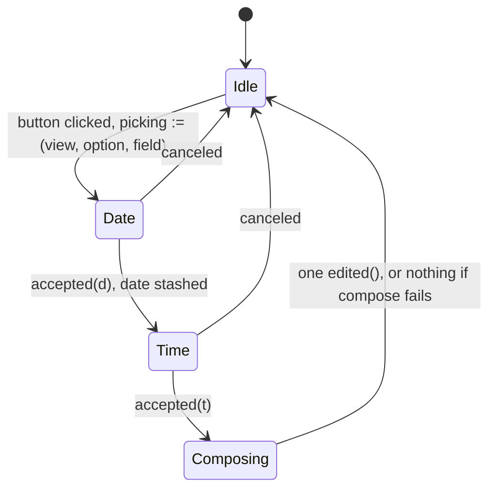

# Design — Slice 009: the form grows the rest of its field kinds

<!-- The *current* design, not its history. Revision chronology, review
     findings, and dispositions live in `design-log.md`.
     Reference forms: canon by id (`SPEC-003 §4`, `ADR-007`, `POL-002`);
     doc-local refs bare — OQ-1 (§6), D1 (§7), R1 (§8). Ids are immutable. -->

## 1. Design problem

`SPEC-001/R-16` admits five field kinds and `R-57` types what each submits.
This renderer draws one. The other four — `text`, `number`, `choice`,
`datetime` — are reported through `Undrawn::FieldForm`, which is correct under
`R-55` and has stood for two slices.

This design draws them. **It adds no protocol**: every kind is already admitted
and already typed, so the work discharges a renderer subset rather than
widening a contract. What it does add is the first host state a person can
change *continuously* — a caret in a text field, a grab on a slider — and that
collides with how a present works today. `SlintGlass::present` ends in
`set_vec`, which destroys and rebuilds every row; with only a checkbox drawn
that was invisible and, worse, load-bearing, because a rebuild is what
re-establishes the binding a click destroys. Typed input makes it visible: a
keystroke would eat the caret.

The boundary: how the four kinds draw, what each submits, what an untouched one
submits, and when a present may write in place. Outside it: `field.value`
prefill and per-field errors (`SPEC-001/OQ-2`), a `step` hint on a `number`, a
date without a time (`SPEC-001/OQ-4`), and a scheduled firing superseding a
view mid-answer (`SPEC-002/OQ-4`).

## 2. Current state

`research.md` Thread 2 is the code map and Thread 3 the measurements; neither is
restated here.

The shape that matters: a `Presentation` is built once at `reception.rs:75` and
never mutated — `controller.edit` writes only `prepared.draft`
(`controller.rs:277`). A `Draft` is keyed by (option, field) and answers
`Edited::Checked(false)` for anything absent (`draft.rs:53`).
`glass.rs::option_rows` folds the two together, building each `FieldRow` from
the draft, so a present writes the whole form back from the model — which is
what corrects a click the host dropped (`app.slint:279`), and which is why
values already survive a present. What does not survive is *interaction* state,
and only for `text` and `number`.

`ViewId` is host-minted, `{RFC 3339}#{seq}`, with the sequence incremented for
every view (`goad-shell/src/state.rs:76`).

## 3. Forces & constraints

**Canon.** `R-16` (the five kinds and their keys), `R-17` (finite, ordered
bounds, already enforced in normalization), `R-18` (only the renderer may branch
on a hint), `R-35` (the host may constrain what is *entered*, never refuse what
*was*), `R-52` / `R-53` (alternative ids are a namespace of their own), `R-55`
(a subset must not narrow the protocol), `R-57` (the JSON type of each kind's
submission), `R-58` (a value for exactly the drawn fields of the answered
option). `ADR-001` / `POL-001`: all of this is stratum 3; nothing reaches
`goad-semantics`.

**Measured limits** (`research.md` Thread 3). A `PopupWindow` cannot be repeated
or conditional, so both pickers are root singletons and a `datetime` field has
no inline control. A click on a `CheckBox` destroys the use-site binding
permanently. `changed` handlers fire nowhere under `init_no_event_loop`.
`LineEdit` exposes no readable cursor offset, so a destroyed text field cannot
have its caret restored — and no tier can assert the caret at all.

**Purity.** `draft.rs` declares no clock, no file, no socket. Anything needing
the system time zone must resolve it before the value reaches the draft.

**Prior commitment.** `design-log.md` D-4: a per-backend configurable text
debounce, 150 ms for now, the configuration surface deferred.

## 4. Guiding principles

**P-1 — Structure and state are two channels, all the way to the widget.**
`view_model.rs` holds what the backend said and `draft.rs` holds what the person
did; the markup boundary is the one place they were being folded back together,
and this design stops doing that.

**P-2 — A widget is corrected, never rebuilt.** Convergence is a guarded
imperative write triggered by an epoch. The rebuild is reserved for a new view,
where there is nothing to preserve.

**P-3 — As-drawn is what the widget shows.** Where a kind has no neutral to
show, the host says *not set* and submits a value nobody would pick, rather than
inventing a plausible answer.

## 5. Proposed design

### 5.1 System model

```
  goad-semantics (untouched)          crates/goad — stratum 3
  ┌──────────────┐   present()   ┌────────────────────────────────────────┐
  │ canonical    │──────────────►│ view_model.rs                          │
  │  FieldKind   │               │   PresentationField { id, label, kind } │
  │  (5 kinds)   │               │   DrawnKind — the five drawn, host-local│
  └──────────────┘               │   FieldForm — now uninhabited           │
                                 └───────────────┬────────────────────────┘
                                                 │ structure
  ┌──────────────┐  record()   ┌─────────────┐   │
  │ controller.rs│────────────►│ draft.rs    │   │  glass.rs builds both
  │  edit()      │             │  Edited (5) │───┼─►in one pass; slot = index
  │  answer()    │◄────────────│  submitted()│   │       value
  └──────────────┘  state_of() └─────────────┘   ▼
         ▲                                ┌──────────────────┐
         │ Command::Edit                  │ app.slint        │
  ┌──────┴───────┐   flush    ┌──────────┐│  options[]  ← rebuilt on new view
  │ install.rs   │◄───────────│ pending.rs││  values[]   ← rewritten always
  │  callbacks   │            │ debounce ││  epoch      ← bumped always
  └──────────────┘            └──────────┘└──────────────────┘
```

Two new modules, one new type, and one existing type that loses its variants.

`FieldForm` currently names the kinds this renderer does not draw. Once all
five are drawn it has no variants left, so it becomes an empty enum and
`Undrawn::FieldForm` can no longer be constructed. That is fine for AC-7,
because the mechanism AC-7 cares about is not `FieldForm` itself but
`undrawn_form`'s exhaustive match over the canonical `FieldKind`. That match
still fails to compile if the protocol grows a sixth kind, and whoever adds it
then has to decide: draw it, or give `FieldForm` a variant back.

`DrawnKind` is the new type and holds the per-kind data the renderer needs to
draw a field — the bounds of a `number`, the alternatives of a `choice`. It
could have been the canonical `FieldKind` cloned, which would avoid a second
enum, but then a sixth protocol kind would be representable in a drawn field
and would silently fall through the markup's `if` chain drawing nothing. A
host-local enum means the sixth kind has to be added here too, which is another
place the compiler stops you.

`pending.rs` holds the text debounce: a pending `Command::Edit` and a
`slint::Timer`. `install.rs` clones one handle into the `edited` closure and one
into `chosen`, and otherwise stays what it is now, which is wiring.

`instant.rs` turns a picked date and time into an instant and an offset. It
exists mainly to keep `TimeZone::system()` — the one impure call — out of
`draft.rs`, which declares itself pure.

`glass.rs` does not get bigger, but `option_rows` splits into two functions, one
per channel, run in a single pass so that a field's slot is its index into
`values` without anything having to keep them in step.

### 5.2 Interfaces & contracts

**Slint.** One struct per channel, with a kind discriminant selecting which slot
is meaningful. The spike measured that this compiles and that a struct literal
may name a subset of fields.

```slint
export enum Kind { boolean, text, number, choice, datetime }

// structure — written only when the view changes
export struct FieldRow {
    id: string, label: string, kind: Kind, slot: int,
    minimum: float, maximum: float, bounded: bool,   // bounded = draw a Slider
    alternatives: [string],                          // labels, in declared order
}
// state — rewritten every present; nothing repeats over it
export struct FieldValue { checked: bool, text: string, number: float, index: int }
// one edit, typed, so the boundary does no parsing
export struct FieldEdit {
    kind: Kind, checked: bool, text: string, number: float, index: int,
    date: Date, time: Time,
}

in property <[FieldValue]> values;
in property <int> epoch;
callback edited(string, string, string, FieldEdit);   // view, option, field, edit
```

**The five widgets.**

| kind | widget | value binding | edit raised on |
|---|---|---|---|
| `boolean` | `CheckBox` | `checked` | `toggled` |
| `text` | `LineEdit` | `text` | `edited`, debounced |
| `number`, both bounds | `Slider` with `minimum`/`maximum` | `value` | `released` only |
| `number`, one bound or none | `LineEdit`, `input-type: decimal` | `text` | `edited`, debounced |
| `choice` | `ComboBox` over the labels | `current-index` | `selected` |
| `datetime` | `Button` showing the value, or *not set* | `text` | the time picker's `accepted` |

A `Slider` needs both bounds, so it is only drawn when both are present. A
`number` with one bound or none gets the numeric `LineEdit` instead, which is
how AC-9 is met without the host picking a range the backend never gave. All
five widgets carry `accessible-description: field.id`; the test harness finds
fields by description (`tests/renderer/harness.rs::described`), so one without
it would be invisible to every renderer test.

**The guard.** Each widget carries
`property <int> tick: root.epoch; changed tick => { … }` comparing itself
against `root.values[field.slot]`. For the numeric `LineEdit` the comparison is
on `self.text.to-float()`, not on the text. This was measured, because the
obvious string version is wrong: a person who clears the field to retype leaves
`""` in the widget while the host holds `0`, and a string comparison writes
`"0"` back over them mid-edit (`research.md` Thread 3).

**`draft.rs`.**

```rust
pub enum Edited {
  Checked(bool),                                  // R-57: JSON boolean
  Typed(String),                                  // R-57: JSON string
  Adjusted(f64),                                  // R-57: JSON number
  Chosen(AlternativeId),                          // R-57: the alternative's id, as a string
  Picked { instant: Timestamp, offset: Offset },  // R-57: RFC 3339, with an offset
}

pub fn state_of(&self, option: &OptionId, field: &FieldId) -> Option<Edited>;
pub fn as_drawn(kind: &DrawnKind) -> Edited;      // view_model.rs — the one site
```

`state_of` returns an `Option` now. It used to answer `Checked(false)` for an
absent key, which worked while a boolean was the only kind; it cannot answer for
the other four because the right answer depends on the kind and the draft does
not know the kind. Both callers that need a value — `glass.rs` building a row,
`controller::answer` building a response — already hold the `DrawnKind`, so both
go through `as_drawn`.

`Chosen` carries an `AlternativeId` rather than a string. `AlternativeId::new`
is `pub(super)` in `goad-semantics`, so this crate cannot mint one; it can only
clone one off a view it drew. That is how AC-8 and `R-52` get held. The
consequence is that the ComboBox reports its index, and `controller.edit`
resolves the index against the drawn field's alternatives — on the same walk it
already does to check the field id is real. An index out of range is a renderer
bug and gets the existing `Refused::UnknownField` treatment: reported, nothing
recorded.

**As-drawn values**, following P-3:

- `boolean` → `Checked(false)`, as today.
- `text` → `Typed("")`.
- `number` → `Adjusted(minimum)` if a minimum was given, otherwise
  `Adjusted(0.0)`. The widget is drawn showing that number, so the screen and
  the wire agree.
- `choice` → `Chosen(first alternative's id)`. Always defined:
  `Alternatives::new` rejects an empty list (`canonical.rs:362`).
- `datetime` → `Picked { UNIX_EPOCH, Offset::UTC }`, which renders
  `1970-01-01T00:00:00+00:00`.

On that last one: `+00:00` rather than `Z` because it falls out of the same
`display_with_offset` call as every other datetime, and a second code path for
the untouched case seemed worse than the spelling. jiff reads `Z` as "the
offset is unknown", which is closer to the truth about a value nobody picked, so
this is a reasonable thing to reverse later. Either way the sentinel a backend
would recognise is the 1970, not the offset. `canon-delta.md` CD-1 is the debt
this creates against `SPEC-001`.

**`instant.rs`.**

```rust
pub fn compose(date: Date, time: Time) -> Option<(Timestamp, Offset)>;
```

`civil::date(y,m,d).at(h,mi,s,0).to_zoned(TimeZone::system())`, then take the
instant and the offset off the result. `TimeZone::system()` cannot fail — it
falls back to UTC (`tz/timezone.rs:325`). `to_zoned` returns a `Result`, which
is the `None` here. It should be unreachable from a picker, whose date range is
bounded by its own UI; if it does happen, nothing is recorded and the button
still shows its previous value, so the person can see that the pick did not
take.

### 5.3 Data, state & ownership

| state | owner | lifetime | written by |
|---|---|---|---|
| `Presentation` | `Prepared` | one view, immutable | `reception::receive`, once |
| `Draft` | `Prepared` | one view | `controller::edit` only |
| last presented `ViewId` | `SlintGlass` | process | `present`, at its end |
| `epoch` | the window | process | `present`, every call |
| pending text edit | `pending.rs`, behind an `Rc` | until it fires or is flushed | the `edited` and `chosen` callbacks |
| `picking` + the accepted date | the window root | between the two pickers | the `datetime` button and the date picker |

`SlintGlass` gains one field, `Option<ViewId>`. It does not retain any model
handles for the value channel: the values vector is built fresh on each present
and handed over whole. The spike measured that this costs no element
constructions, which is why it is worth doing rather than retaining the nested
tree.

Everything in the two models is derived from `Prepared` and thrown away each
present — the rows, the values, and the slot numbering. That keeps the property
`option_rows` has today, which is that there is no cache and therefore no
invalidation rule, and extends it to both channels.

### 5.4 Lifecycle & dynamics

**A keystroke.** The case AC-4 is about, and the one the old `set_vec` broke.

```mermaid
sequenceDiagram
    participant P as person
    participant W as LineEdit
    participant Pd as pending.rs
    participant C as controller
    participant G as glass
    P->>W: types a character
    W->>W: self-assigns text (binding now gone)
    W->>Pd: edited(text)
    Note over Pd: timer restarted, 150 ms
    Pd->>C: Command::Edit
    C->>C: draft.record(...)
    Note over C: Edit returns None; loop continues to the top
    C->>G: present(frame)
    G->>G: same view_id → values rewritten, epoch bumped
    G->>W: changed tick
    W->>W: guard: text == values[slot].text → writes nothing
```

No element is destroyed, so the caret is never asked to be restored — which
matters because `LineEdit` could not restore it anyway.

**An edit the host never recorded.** AC-6, and what A-2 has always been for. The
widget self-assigns, the command is lost or refused, and the draft still says
what it said before. The next present rewrites `values` with the unchanged draft
and bumps the epoch; this time the guard finds a difference and writes the
widget back. The element survives that too — the spike measured both halves.

**An answer.** The `chosen` callback takes whatever `pending.rs` is holding and
sends it before sending `Choose`. The channel is FIFO, so the controller records
the text and then answers from a draft that includes it. If the second
`try_send` comes back `Full` the `Choose` is dropped and the back-pressure
notice goes up; the text is recorded by then, so clicking again answers
correctly.

**A new view.** `absorb` installs a fresh `Prepared`. The next present sees a
`view_id` it has not shown, rebuilds the row model with `set_vec`, renumbers the
slots, and writes `values` as usual. Every binding is fresh, which is what a new
view wants — there is no interaction state to preserve. `frame.shown == None` is
the same path with both models empty and the retained id cleared.

**Picking a datetime.**



Exactly one `edited` per completed pick, so the draft never holds half a
datetime. Both `DatePickerPopup` and `TimePickerPopup` have an explicit
`canceled` callback and `close-policy: no-auto-close`, so abandoning is a real
event rather than an inferred one.

### 5.5 Invariants, assumptions & edge cases

**Invariants.**

- **I-A.** Two presents showing the same `view_id` are showing the same
  structure. Held by `State::issue` minting a fresh id per view
  (`goad-shell/src/state.rs:76`) and `Presentation` never being mutated after
  `reception.rs:75`.
- **I-B.** A field's slot is its index into `values`. Held by building both
  models in one pass rather than by keeping two numberings in step.
- **I-C.** A submitted value's JSON type is decided in one place,
  `draft.rs::submitted`. Unchanged from today; four arms added.
- **I-D.** Every id on the wire came off a view the backend sent.
  `OptionId::new`, `FieldId::new` and `AlternativeId::new` are all `pub(super)`
  in `goad-semantics`, so this crate cannot mint one.
- **I-E.** A field that can be edited is exactly a field that will be submitted.
  Unchanged: `controller.edit` walks the same drawn-field list `answer` submits
  from.

**Assumptions**, in descending order of how much rests on them:

| # | assumption | status |
|---|---|---|
| A-1 | `root.values[field.slot]` tracks, and replacing `values` wholesale destroys no element | **measured**, negative-controlled (`split.rs`) |
| A-2 | A numeric guard on `to-float()` does not fight a cleared field | **measured**, negative-controlled (`numeric_guard.rs`) |
| A-3 | `changed` fires under a real loop and not under `init_no_event_loop` | **measured** (Thread 3) |
| A-4 | `DateTime::to_zoned` cannot fail for a date a picker can produce | not measured; being wrong costs a visible no-op, not a wrong value |
| A-5 | A `ComboBox`'s `current-index` survives a `values` rewrite like the others | not separately measured; same guard shape, and the loop test covers it |
| A-6 | Disabling a widget while an exchange is in flight does not destroy it | not measured; being wrong costs focus, not data — a person's observation under AC-10 |

**Edges.**

| situation | what happens |
|---|---|
| numeric field cleared to `""` | records `0`, which is what `to-float` reads, so the guard stays quiet and the clear survives |
| either picker cancelled | nothing recorded; the button still shows what it showed |
| `compose` returns `None` | same — nothing recorded, and the unchanged button is the person's signal |
| pending edit lands after its view was replaced | `Refused::SupersededView`, reported. The typing really was discarded, so saying so is right |
| channel full when flushing on answer | `Choose` dropped, notice raised, text already recorded; a second click answers |
| `ComboBox` index out of range | `Refused::UnknownField` posture — a renderer bug, reported, nothing recorded |
| option with no fields, or no view shown | `values` is empty and no slot is ever read |
| a field id equal to an option id in the same view | legal under `R-52`, and both the field widget and the option `Button` then answer to the same accessible description. Existing tests filter by element type; new ones must too |
| an exchange in flight | all five widgets `enabled: !root.busy`. A focused `LineEdit` may lose focus for the duration — see A-6 |

## 6. Open questions

All five carried from `slice-009.md` are closed. Each was a user decision; the
argument is in `design-log.md` and is not repeated here.

| | question | closed by |
|---|---|---|
| OQ-1 | what each kind submits untouched | D-6 — as-drawn is what the widget shows; `datetime` is the epoch |
| OQ-2 | what a conforming `datetime` composes into | D-7 — picked local offset, chained pickers, cancel abandons |
| OQ-3 | where the text debounce flushes | D-8 — on answer, and nowhere else |
| OQ-4 | which tier tests the re-assert | D-10 — one new event-loop binary; the caret is a person's |
| OQ-5 | when a present may write in place | D-9 — same `view_id`; two channels rather than a retained tree |

One question is open and deliberately deferred: **whether the `datetime` epoch
is stated normatively or descriptively in `SPEC-001`** (`canon-delta.md` CD-1).
Deferred to promotion at audit by explicit user decision, on the ground that it
is a question about how canon should read rather than about what the code does,
and the code is the same either way.

## 7. Decisions, rationale & alternatives

| | decision | rejected, and why |
|---|---|---|
| D1 | As-drawn is what the widget shows before anyone touches it (D-6) | Picking each kind's default separately. Four of five then have no criterion, and nothing stops the wire contradicting the screen |
| D2 | An untouched `datetime` submits the epoch (D-6) | The instant the view arrived. It looks like a deliberate answer, and needs `Prepared` to start carrying a timestamp it does not carry |
| D3 | `+00:00` rather than `Z` for the epoch | `Z`, which jiff reads as "offset unknown" and is arguably truer. Rejected only to keep one `display_with_offset` call rather than two paths; reversible, and the recognisable part is the 1970 |
| D4 | A pick submits the offset the person picked in (D-7) | Always UTC. Conforming, but a backend echoing the value shows a person a time they did not choose, and `R-57` says "carrying an offset" rather than "an instant" |
| D5 | Cancel at either picker abandons the whole edit (D-7) | Cancel on the time picker committing local midnight. That is the date-only affordance wearing a disguise, and it makes "cancel" mean two things |
| D6 | The debounce flushes on answer only (D-8) | `accepted` and focus loss as well. Both guess how a person leaves a field, neither is guaranteed to precede the click, and neither closes a hole the answer flush leaves |
| D7 | `number` binds `released`, with no debounce (D-8) | A debounce on `changed`. `released` always fires at the end of a drag, so this is not Thread 4's commit-only binding, whose failure was `accepted` firing on Enter only |
| D8 | A present writes in place exactly when the `view_id` is unchanged (D-9) | Comparing rows and skipping the write (Thread 4) — blind to the only divergence that matters. And "rebuild when a command was refused", whose premise `wire.rs:128-132` falsifies |
| D9 | Structure and value on two channels (D-9) | Retaining the nested model tree so values can be written in place. A cache with an invalidation rule, in a file whose current doc is that it has neither |
| D10 | `DrawnKind`, a host-local enum | Carrying the canonical `FieldKind` on `PresentationField`. It avoids a second enum but lets a sixth protocol kind reach a drawn field and fall silently through the markup's `if` chain |
| D11 | `FieldForm` becomes uninhabited, not deleted | Deleting it. `undrawn_form`'s exhaustive match is what AC-7 protects, and an empty enum keeps `Undrawn::FieldForm` as the place a sixth kind goes |
| D12 | `Chosen(AlternativeId)`, resolved from an index in `controller.edit` | The markup handing back the alternative id as a string. The host cannot mint an `AlternativeId`, so resolving from the presentation is what makes AC-8 a fact about the types |
| D13 | The numeric `LineEdit`'s guard compares `to-float()` | String comparison. Measured: it writes `"0"` over a person clearing the field to retype |
| D14 | One new event-loop binary, one test fn (D-10) | Writing the cases in `tests/renderer/`, where they would be green and measure nothing |
| D15 | Instrument counters live in production markup (D-10) | A test-only copy of the field markup — a parallel implementation of the thing under test |

## 8. Risks & mitigations

| | risk | mitigation | the signal it is happening |
|---|---|---|---|
| R1 | A case for the re-assert gets written in the tier where `changed` never fires, and is green while measuring nothing | The loop binary, and a negative control compiled and run before the red is believed | a new case in `tests/renderer/` asserting anything a `changed` handler does |
| R2 | The two channels drift — a slot that is not its index | Both built in one pass; I-B | a field showing another field's value |
| R3 | With `FieldForm` uninhabited, `R-55`'s field-kind path has no live test | `Undrawn::GroupHint` and the two content forms keep `R-55` asserted; CD-2 makes the Verification row say so | someone deleting `FieldForm` because it is empty, which also deletes the sixth-kind compile error |
| R4 | The guard fights a person in some case not yet found. The cleared-number field was one, and it was found by measuring rather than reasoning | Per-kind comparison stated in §5.2, and the human run under AC-10 | a value snapping back while it is being edited |
| R5 | The debounce widens the window in which a superseded view eats someone's typing, filling the diagnostic pane | Accepted rather than mitigated: the typing really was discarded, and saying so is right | repeated `SupersededView` lines in the pane during ordinary use |
| R6 | `datetime`'s cost was underestimated at scoping and could be again | The two constraints that drive it — popups cannot repeat, and there is no inline control — are measured, not assumed | needing a second picker instance, or a partial datetime in the draft |

## 9. Validation

What the plan must produce. Every new case gets an injection pass — the defect
it exists for is introduced, the case is run, the message is read, the injection
reverted and the revert confirmed by `git diff`.
`docs/memory/a-green-test-can-assert-a-proxy.md` is why that is a requirement
and not a nicety; the one phase of slice 005 without it produced all three weak
cases.

| AC | where | what it asserts |
|---|---|---|
| AC-1 | `tests/renderer/fields.rs` | a view with all five kinds draws all five, in declared order |
| AC-2 | `tests/renderer/wiring.rs` + `draft.rs` unit | the `respond` carries the JSON type `R-57` names, per kind, both directions |
| AC-3 | existing `wiring.rs` cases, extended | `R-58` over a form of five kinds |
| AC-4 | `tests/renderer/` via the answer flush, and the loop binary for the element | the draft holds what was typed; the element was not destroyed while it was |
| AC-5 | the loop binary | a present that changes nothing writes nothing — `reasserts` unchanged, `inits` unchanged |
| AC-6 | the loop binary, negative-controlled | a widget whose edit was never recorded converges on the next present, element preserved |
| AC-7 | `view_model.rs` unit | `undrawn_form` still matches `FieldKind` exhaustively; `Undrawn` still reports a `group` hint it cannot read |
| AC-8 | `tests/renderer/fields.rs` | a `choice` submits an alternative id, and a view whose field id equals an option id still answers correctly |
| AC-9 | `tests/renderer/fields.rs` | an unbounded `number` draws a numeric `LineEdit` and submits a number; no range appears that the backend did not send |
| AC-10 | a person | `just check` green, and a form of all five kinds answered by hand — including the caret mid-word, both pickers, and a slider drag across a present |

AC-10's human half is not a fallback. Three of the things this design turns on —
the caret, the picker chain, a drag surviving a present — have no instrument in
any tier, and `docs/memory/getting-eyes-on-the-running-host.md` has the launch
and screenshot mechanics for the rest.

## 10. Canon impact

No protocol change: `R-16` already admits five kinds, `R-57` already types all
five, and `R-55` names the gap this slice closes as a subset. Nothing here
amends a rule.

Two debts, both in `canon-delta.md`, both settled at audit with explicit
endorsement:

- **CD-1** — `SPEC-001` §7 gains a statement of what an untouched field submits
  per kind, including the `datetime` epoch. One question inside it is open by
  design (§6).
- **CD-2** — `SPEC-001` §Verification, the `R-57` row, currently says four of
  its clauses are "review, not a test" *because no renderer draws those kinds*.
  This slice falsifies that.

Not canon, but owed at close: `docs/roadmap.md` §Open decisions names this slice
as the answerer for `SPEC-001/OQ-4`, a date without a time. **OQ-4 stays shut.**
A date-only field can be expressed — a `datetime` at 00:00 local — so the
trigger `slice-009.md` set for reopening it was not met. The evidence it asked
for is the affordance: a backend wanting only a date makes the person walk a
time picker to get there, and D5 declined the shortcut that would have hidden
it.
