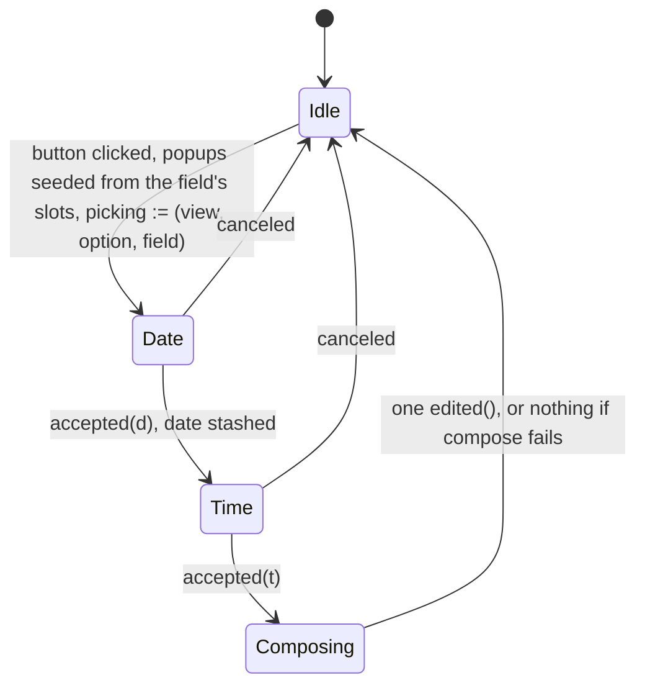

# Design — Slice 009: the form grows the rest of its field kinds

<!-- The *current* design, not its history. Revision chronology, review
     findings, and dispositions live in `design-log.md`.
     Reference forms: canon by id (`SPEC-003 §4`, `ADR-007`, `POL-002`);
     doc-local refs bare — OQ-1 (§6), D1 (§7), R1 (§8). Ids are immutable. -->

## 1. Design problem

`SPEC-001/R-16` admits five field kinds and `R-57` types what each submits.
This renderer draws one. The other four — `text`, `number`, `choice`,
`datetime` — are reported through `Undrawn::FieldForm`, which is correct under
`R-55` and has stood for two slices.

This design draws them. **It adds no protocol**: every kind is already admitted
and already typed, so the work discharges a renderer subset rather than
widening a contract. What it does add is the first host state a person can
change *continuously* — a caret in a text field, a grab on a slider — and that
collides with how a present works today. `SlintGlass::present` ends in
`set_vec`, which destroys and rebuilds every row; with only a checkbox drawn
that was invisible and, worse, load-bearing, because a rebuild is what
re-establishes the binding a click destroys. Typed input makes it visible: a
keystroke would eat the caret.

The boundary: how the four kinds draw, what each submits, what an untouched one
submits, and when a present may write in place. Outside it: `field.value`
prefill and per-field errors (`SPEC-001/OQ-2`), a `step` hint on a `number`, a
date without a time (`SPEC-001/OQ-4`), and a scheduled firing superseding a
view mid-answer (`SPEC-002/OQ-4`).

## 2. Current state

`research.md` Thread 2 is the code map and Thread 3 the measurements; neither is
restated here.

The shape that matters: a `Presentation` is built once at `reception.rs:75` and
never mutated — `controller.edit` writes only `prepared.draft`
(`controller.rs:277`). A `Draft` is keyed by (option, field) and answers
`Edited::Checked(false)` for anything absent (`draft.rs:53`).
`glass.rs::option_rows` folds the two together, building each `FieldRow` from
the draft, so a present writes the whole form back from the model — which is
what corrects a click the host dropped (`app.slint:279`), and which is why
values already survive a present. What does not survive is *interaction* state,
and only for `text` and `number`.

`ViewId` is host-minted, `{RFC 3339}#{seq}`, with the sequence incremented for
every view (`goad-shell/src/state.rs:76`).

## 3. Forces & constraints

**Canon.** `R-16` (the five kinds and their keys), `R-17` (finite, ordered
bounds, already enforced in normalization), `R-18` (only the renderer may branch
on a hint), `R-35` (the host may constrain what is *entered*, never refuse what
*was*), `R-52` / `R-53` (alternative ids are a namespace of their own), `R-55`
(a subset must not narrow the protocol), `R-57` (the JSON type of each kind's
submission), `R-58` (a value for exactly the drawn fields of the answered
option). `ADR-001` / `POL-001`: all of this is stratum 3; nothing reaches
`goad-semantics`.

**Measured limits** (`research.md` Thread 3). A `PopupWindow` cannot be repeated
or conditional, so both pickers are root singletons and a `datetime` field has
no inline control. A click on a `CheckBox` destroys the use-site binding
permanently. `changed` handlers fire nowhere under `init_no_event_loop`.
`LineEdit` exposes no readable cursor offset, so a destroyed text field cannot
have its caret restored — and no tier can assert the caret at all.

**Type limits at the markup boundary.** Slint's `float` is `f32` and its `int`
is `i32` (`slint-1.17.1/type-mappings.md:13-16`). `NumberRange` holds `f64` and
`R-17` admits any finite one, and the picker structs carry `int` where jiff
wants `i16`/`i8`. Both are narrowings the protocol does not permit a renderer to
make. So a value crossing that boundary is carried as text, or converted with a
check, or — in the one case where neither applies, a `Slider`'s own value — sent
as a `float` only because the control it came from was admitted on the condition
that its whole range is `f32`-exact (§5.2, I-G, R7).

**Manifest.** `jiff` is `default-features = false` workspace-wide and no member
adds anything back, so it resolves with **no features**. `TimeZone::try_system`
is then an unconditional `Err` and `TimeZone::system` falls back to
`Etc/Unknown`, silently. Reading the system zone at all is a manifest change to
a dependency stratum 1 shares — `POL-001`'s named residue, argued in §10.

**Purity.** `draft.rs` declares no clock, no file, no socket. Anything needing
the system time zone must resolve it before the value reaches the draft.

**Prior commitment.** `design-log.md` D-4: a per-backend configurable text
debounce, 150 ms for now, the configuration surface deferred. D-14 widens it
from text to every continuously-edited control, for the reason D-4 gave; the
value and the deferral are untouched.

## 4. Guiding principles

**P-1 — Structure and state are two channels, all the way to the widget.**
`view_model.rs` holds what the backend said and `draft.rs` holds what the person
did; the markup boundary is the one place they were being folded back together,
and this design stops doing that.

**P-2 — A widget is corrected, never rebuilt.** Convergence is a guarded
imperative write triggered by an epoch. The rebuild is reserved for a new view,
where there is nothing to preserve.

**P-3 — As-drawn is what the widget shows.** Where a kind has no neutral to
show, the host says *not set* and submits a value nobody would pick, rather than
inventing a plausible answer.

## 5. Proposed design

### 5.1 System model

```
  goad-semantics (untouched)          crates/goad — stratum 3
  ┌──────────────┐   present()   ┌────────────────────────────────────────┐
  │ canonical    │──────────────►│ view_model.rs                          │
  │  FieldKind   │               │   PresentationField { id, label, kind } │
  │  (5 kinds)   │               │   DrawnKind — the five drawn, host-local│
  └──────────────┘               │   FieldForm — now uninhabited           │
                                 └───────────────┬────────────────────────┘
                                                 │ structure
  ┌──────────────┐  record()   ┌─────────────┐   │
  │ controller.rs│────────────►│ draft.rs    │   │  glass.rs builds both
  │  edit()      │             │  Edited (5) │───┼─►in one pass; slot = index
  │  answer()    │◄────────────│  submitted()│   │       value
  └──────────────┘  state_of() └─────────────┘   ▼
         ▲                                ┌──────────────────┐
         │ Command::Edit, Command::Choose │ app.slint        │
  ┌──────┴───────┐   drain    ┌──────────┐│  values[]   ← rewritten always
  │ install.rs   │◄───────────│ pending.rs││  options[]  ← rebuilt on new view
  │  callbacks   │            │ per field ││  epoch      ← bumped always
  └──────────────┘            └──────────┘└──────────────────┘
       one edit on the timer;                written in that order — §5.5 I-F
       every pending edit inside a Choose
```

Two new modules, a new host-local enum, and one existing type that loses its
variants. Two small types come with them and are stated where they are used:
`Finite`, which is what makes I-G a property rather than a habit, and
`PendingEdit`, which is what `Command::Choose` carries (§5.2).

`FieldForm` currently names the kinds this renderer does not draw. Once all
five are drawn it has no variants left, so it becomes an empty enum and
`Undrawn::FieldForm` can no longer be constructed. That is fine for AC-7,
because the mechanism AC-7 cares about is not `FieldForm` itself but
`undrawn_form`'s exhaustive match over the canonical `FieldKind`. That match
still fails to compile if the protocol grows a sixth kind, and whoever adds it
then has to decide: draw it, or give `FieldForm` a variant back.

**What that costs is an enumeration, not a rename**, and it is written out here
because every entry is a live site that will not compile or will silently lie:

| site | what assumes the variant is constructible |
|---|---|
| `diagnostics.rs:202-215` | the undrawn line, whose text — *"this renderer draws boolean fields only"* — becomes unreachable **and** false. The arm stays, because a sixth kind would give `FieldForm` a variant back; its wording must stop naming a subset that no longer exists |
| `draft.rs:82` | `submitted`'s doc sends a sixth `FieldKind` to `Undrawn::FieldForm`. True today, and after this slice that destination has to be re-created before it can be reached |
| `view_model.rs:31` | `body_is_degraded`'s doc excludes `Undrawn::FieldForm` by name, from a set the enum can no longer contribute to |
| `tests/renderer/mapper.rs:195-203` | asserts each variant's `Display` |
| `tests/renderer/mapper.rs:290-327, 375-399` | constructs and reads back reported `FieldForm`s |
| `tests/renderer/wiring.rs:1245` | `edit(…, "noted", …)` expects `Refused::UnknownField` **because `noted` is undrawn**; `noted` becomes a drawn `text` field and the edit is accepted |
| `tests/renderer/wiring.rs:1304` | expects the submitted keys of `TWO_FORMS`'s `morning` to be `["read", "stretched"]`; `noted` joins them |
| `tests/renderer/wiring.rs:1340` | the `R-58` MUST NOT case. It opens with a guard assertion that the fixture really does carry an undrawn field, and that guard becomes unsatisfiable |
| `tests/renderer/fields.rs:67-71, 597-632` | `A_DRAWN_AND_AN_UNDRAWN_FIELD` and the case built on it — which `SPEC-001` §Verification names **by id** in its `R-58` row |

There is no substitute construction: a `group`-hint field is still *drawn*, and
the surviving `Undrawn` variants are body-level.

That costs more than a rewrite of the suite, and the design says so rather than
letting it be discovered. `R-58`'s MUST NOT prohibits two things — submitting a
value for a field the host did not draw, and submitting a field of an option it
is not answering. After this slice the first is **unobservable**: no view can
carry an undrawn field, so no case can watch its value stay off the wire. The
second is untouched and still asserted by the same fixture's two options sharing
the field id `read`. `canon-delta.md` CD-2 records that as a permanent reduction
in what the suite asserts about a normative rule, alongside the `R-55` row's
statement that option fields go undrawn, which also stops being true. §9 carries
the obligation to rewrite each site above.

One of those sites, `wiring.rs:1245`, reaches `Refused::UnknownField` through
`noted` being undrawn. After this slice that refusal is reachable only from a
field id no view declared — the posture §5.2 already gives an out-of-range
`ComboBox` index — so the refusal itself stays asserted, from a fabricated id
rather than from a real field's kind.

`DrawnKind` is the new type and holds the per-kind data the renderer needs to
draw a field — the bounds of a `number`, the alternatives of a `choice`. It
could have been the canonical `FieldKind` cloned, which would avoid a second
enum, but then a sixth protocol kind would be representable in a drawn field
and would silently fall through the markup's `if` chain drawing nothing. A
host-local enum means the sixth kind has to be added here too, which is another
place the compiler stops you.

`pending.rs` holds the debounce: pending edits **keyed by (option, field)**, and
one `slint::Timer`. Keyed, not singular, because a person who types into one
field and moves to another inside the window would otherwise lose the first
field's last keystrokes — D-8 forbids flushing on the switch, so the only place
left to hold them is here. Kind-agnostic for the same reason the `Slider` needs
it (§5.2): `changed` fires continuously through a drag, so the number controls
take the same mechanism the text ones do. `install.rs` clones a handle into the
`edited` closure and one into `chosen`, and otherwise stays what it is now,
which is wiring.

The two ways an edit leaves `pending.rs` are not symmetrical, and the asymmetry
is forced. When the timer fires, one `Command::Edit` goes down the channel, as
today. When the person answers, **the pending edits travel inside
`Command::Choose`** rather than as sends before it. The command channel holds
one (`main.rs:86`) and `serve` shares the UI thread through `spawn_local`, so a
Slint callback — which is synchronous and has no await — cannot let `serve`
drain between two sends: the second `try_send` of any flush does not merely risk
`Full`, it always gets it. Carrying the edits makes the flush one send, which is
what lets D-8's *"the debounce flushes when the draft becomes an answer"* hold by
construction rather than by a queue ordering that was never available (§5.2,
§5.4).

`instant.rs` turns a picked date and time into an instant and an offset, and
answers what a picker should open on for a field nobody has picked yet. It
exists to keep two impure reads — the system time zone, and the clock — out of
`draft.rs`, which declares itself pure.

`glass.rs` does not get bigger, but `option_rows` splits into two functions, one
per channel, run in a single pass so that a field's slot is its index into
`values` without anything having to keep them in step.

### 5.2 Interfaces & contracts

**Slint.** One struct per channel, with a kind discriminant selecting which slot
is meaningful. The spike measured that this compiles and that a struct literal
may name a subset of fields.

```slint
export enum Kind { boolean, text, number, choice, datetime }

// structure — written only when the view changes
export struct FieldRow {
    id: string, label: string, kind: Kind, slot: int,
    slider: bool,                                 // the control, decided by the host
    minimum: float, maximum: float, step: float,  // read only where `slider`
    alternatives: [string],                       // labels, in declared order
}
// state — rewritten every present; nothing repeats over it
export struct FieldValue {
    checked: bool,
    text: string,   // what every control displays: the text, the number, the
                    // composed datetime, or `not set`
    number: float,  // the Slider's value, and the Slider's guard comparand
    index: int,
    date: Date, time: Time,   // what this field's picker opens on
}
// one edit, typed, so the boundary does no parsing it cannot undo
export struct FieldEdit {
    kind: Kind, checked: bool, text: string, number: float, index: int,
    date: Date, time: Time,
}

in property <[FieldValue]> values;
in property <int> epoch;
callback edited(string, string, string, FieldEdit);   // view, option, field, edit
```

**A number at the markup boundary.** Slint's `float` is `f32` and its `int` is
`i32` (`slint-1.17.1/type-mappings.md:13-16`), while `NumberRange` holds `f64`
and `R-17` admits any finite one. Running the protocol's numbers through a
32-bit channel would narrow the contract — a legal bound of `1e100` arrives as
infinity — and it would narrow it by a type rather than by a decision, which is
`CLAUDE.md`'s third invariant failing in the quietest available way. The
boundary is therefore crossed differently in each direction, and the rules are
stated together because they are one account of one boundary rather than four
separate precautions.

*Out of the host.* Bounds and the displayed number cross as `float`, and neither
reaches the wire. `FieldValue.text` carries what every control displays,
formatted host-side from the `f64`; `FieldValue.number` and `FieldRow`'s
`minimum` / `maximum` / `step` exist for the `Slider` alone.

*Into the host.* The two `LineEdit` controls send their edit as **text**, which
is lossless for every finite `f64`, and the host parses it. The `Slider` sends
`FieldEdit.number`, a `float`, because it has nothing else to send: its `value`
*is* an `f32`, and making the markup format that into a string would mean
comparing the guard against a value parsed back out of a string whose form Slint
does not specify to round-trip — a difference manufactured by the round trip
itself, written back over a person mid-drag. That is R4, and it is not worth
buying with a repair aimed at a narrowing that does not occur here: the `Slider`
is drawn only over a range that is exactly representable in `f32` (below), any
`number` outside that draws the lossless text control, and `as_drawn` is computed
host-side in `f64` and never crosses. What a slider can *produce* is granular —
that is true of any slider, pixels included — and granularity of a control is not
a narrowing of the contract, which still admits and still answers every legal
message.

**Parsing the text is done under the rule the control validated it with.** A
numeric `LineEdit` is `input-type: decimal`, which validates each insertion
through Slint's `string_to_float` — and that function is **locale-aware**: it
substitutes the locale's decimal separator before parsing, and rejects a `.`
outright where the separator is something else (`i-slint-core/string.rs:399-412`,
`items/text.rs:2202-2229`). A host that called `f64::from_str` on the raw text
would refuse `1,5` in a comma-decimal locale — text the control had just
approved — record nothing, and let the next guard write over the person. So the
host parses with the same rule: empty text is zero, which is what Slint's own
`to-float` reads an empty field as; otherwise, where the text carries no `.` and
exactly one `,`, the comma is the decimal separator; then `f64::from_str`. The
empty case is not a nicety — it is what makes the guard's one exception (below)
correspond to a value the host actually holds. All of it is host-side, testable
without a locale fixture, and numeric formatting rather than anything
domain-shaped (D-16). Sending Slint's own parsed float alongside the text was
rejected: it reintroduces as a fallback the `f32` path this section exists to
keep off the wire.

**The control is the host's decision, not the markup's inference.** `slider` is
a decision the row carries, not a fact about the field the markup reasons from.
One site decides it:

```rust
/// The bounds a `Slider` may be drawn over, or `None` for the numeric text
/// control. The only place a `number`'s control is chosen.
fn slider_bounds(range: &NumberRange) -> Option<(f32, f32)>;
```

Today it answers `Some` when **all** of the following hold, and `None`
otherwise:

- both bounds are present, and each round-trips `f64` → `f32` → `f64` unchanged;
- the `f32` span `maximum - minimum` is finite and strictly positive;
- the step, `(maximum - minimum) / 100`, is finite and strictly positive.

An exact endpoint round-trip on its own is not enough, because Slint's slider
arithmetic is what has to work afterwards. It places the thumb by dividing by
`maximum - minimum` (`fluent/slider.slint:75-76`), so equal bounds such as
`[1, 1]` divide by zero; `[-f32::MAX, f32::MAX]` has an infinite span even
though both endpoints are exact; and a span small enough makes the step underflow
to zero, which `SliderBase` answers by rejecting every key
(`common/slider-base.slint:79-80`). None of those is a loss: each takes the text
control, which is where a range a slider cannot operate belongs anyway — a slider
over a single value offers nothing.

So the text control is the one that always works and the `Slider` is the one with
an admissibility condition, which is the opposite of how a bounds-driven reading
makes it look. A later slice that wants the choice to read a hint (`R-18`
permits the renderer, and only the renderer, to branch on one), or a
configuration, or nothing at all, changes this function's body and nothing else:
not the markup, not the wire, not `Edited`.

**The five kinds and their controls.**

| kind | control | shown from | edit raised on |
|---|---|---|---|
| `boolean` | `CheckBox` | `checked` | `toggled` |
| `text` | `LineEdit` | `text` | `edited`, debounced |
| `number`, slider admissible | `Slider` over `minimum`/`maximum` | `number` | `changed`, debounced; `released` flushes. Sends `number` |
| `number`, otherwise | `LineEdit`, `input-type: decimal` | `text` | `edited`, debounced. Sends `text` |
| `choice` | `ComboBox` over the labels | `index` | `selected` |
| `datetime` | `Button` showing the value, or *not set* | `text` | the time picker's `accepted` |

A `Slider` binds `changed` as well as `released`. Slint raises `released` from
the pointer and keyboard paths, but its accessibility `set-value`, `increment`
and `decrement` actions all route through `set-value`, which raises `changed`
and nothing else (`widgets/common/slider-base.slint:114-131`,
`widgets/fluent/slider.slint:30-36`). A `released`-only binding is therefore
deaf to an assistive technology, and — §9 — cannot be operated by any test tier
either. `changed` fires continuously through a drag, so it takes the same
debounce the text controls take, and `released` flushes it so a drag's final
value does not wait on a timer.

A `Slider`'s `step` is `(maximum - minimum) / 100`. Slint defaults it to `1` and
rejects every key when it is `0` (`slider-base.slint:8`, `:76-80`), so leaving it
alone gives a field declared `min: 0, max: 1` a keyboard that crosses the whole
range in one press, and zeroing it removes the keyboard entirely. The value is
Slint's own for `accessible-value-step` (`fluent/slider.slint:29`). This is
presentation, which `R-18` leaves to the renderer; the `step` `slice-009.md`
excludes is the **protocol** one.

All six controls carry `accessible-description: field.id`; the test harness
finds fields by description (`tests/renderer/harness.rs::described`), so one
without it would be invisible to every renderer test.

**The guard.** Each control carries
`property <int> tick: root.epoch; changed tick => { … }`, comparing itself
against `root.values[field.slot]` and writing itself back where they differ:

| control | compares | and converges unless |
|---|---|---|
| `CheckBox` | `self.checked` against `checked` | they are equal |
| `LineEdit`, text | `self.text` against `text` | they are equal |
| `LineEdit`, number | `self.text` against `text` | they are equal, **or** the widget is empty and the held number is zero |
| `ComboBox` | `self.current-index` against `index` | they are equal |
| `Slider` | `self.value` against `number` | they are equal |

The `datetime` `Button` is absent from that table and needs no guard: it never
assigns its own text, so its binding to `values[field.slot].text` is never
destroyed and a present corrects it by writing the slot. The other five all
self-assign — that is what a click, a keystroke, a drag or a selection does to a
widget — which is the whole reason a guard exists.

The numeric `LineEdit` is the one with an exception and the one worth explaining.
Comparing `self.text.to-float()` against the held number instead would lose at
the protocol's extremes: `to-float` parses to `f32`
(`i-slint-core/string.rs:399-412`), so `1e100` and `1e101` both become infinity
and compare equal while the strings differ — and the case the guard exists for,
AC-6, is exactly the one where the host did *not* record the edit, so "the value
came from this same widget" is not an argument available to it. Text is lossless
and is what it compares.

The exception is the measured cleared-field case and nothing wider: a person who
clears the field to retype leaves `""` in the widget while the host still holds
`0`, and a bare string comparison writes `"0"` back over them mid-edit
(`numeric_guard.rs`, negative-controlled). So: converge unless the strings match,
or unless the widget is empty and the held number is zero.

The `Slider`'s comparand is `f32` on both sides, which is sound rather than a
residue of the boundary above: a `Slider` is drawn only over an `f32`-exact
range, and `FieldValue.number` is computed host-side from the same `f64` every
present. The guard detects divergence; it never supplies a value to the wire.

**`draft.rs`.**

```rust
/// A finite `f64`. Private field, fallible constructor: the only way to hold
/// one is to have checked it.
pub struct Finite(f64);
impl Finite {
  pub const ZERO: Self = Self(0.0);
  pub fn new(value: f64) -> Option<Self>;          // `None` for NaN and both infinities
  pub fn get(self) -> f64;
}

pub enum Edited {
  Checked(bool),                                  // R-57: JSON boolean
  Typed(String),                                  // R-57: JSON string
  Adjusted(Finite),                               // R-57: JSON number
  Chosen(AlternativeId),                          // R-57: the alternative's id, as a string
  Picked { instant: Timestamp, offset: Offset },  // R-57: RFC 3339, with an offset
}

pub fn state_of(&self, option: &OptionId, field: &FieldId) -> Option<Edited>;
pub fn as_drawn(kind: &DrawnKind) -> Edited;      // view_model.rs — the wire's
                                                  // answer for an untouched field
```

`Adjusted` holds a `Finite` rather than a bare `f64` so that I-G is a property of
the type and not a habit. `Controller::edit` is public and takes any `Edited`;
`f64` admits `NaN` and both infinities; `serde_json::Value::from(f64)` turns each
of those into JSON `null`, which `R-57` does not admit. With the field private
and the constructor fallible, a non-finite submitted number is not merely
unwritten, it is unrepresentable.

`state_of` returns an `Option` now. It used to answer `Checked(false)` for an
absent key, which worked while a boolean was the only kind; it cannot answer for
the other four because the right answer depends on the kind and the draft does
not know the kind.

**The two callers do not treat that `Option` alike, and that is the point.**
`glass.rs` reads it directly when building a value: `None` means *untouched*,
and for a `datetime` that is what the button renders as *not set*.
`controller::answer` is the only site that applies `as_drawn`, because `R-58`
forbids omitting a value for a drawn field. Keeping them apart is what makes
D-6's epoch a fact about the wire rather than a fact about the screen, which is
what D-6 chose it to be — a button reading `1970-01-01T00:00:00+00:00` would be
the host showing a person an answer nobody gave. For the other four kinds the
two coincide by construction (P-3), so `datetime` is the only kind whose display
can tell *untouched* from *picked*.

`Chosen` carries an `AlternativeId` rather than a string. `AlternativeId::new`
is `pub(super)` in `goad-semantics`, so this crate cannot mint one; it can only
clone one off a view it drew. That is how AC-8 and `R-52` get held. The
consequence is that the ComboBox reports its index, and `controller.edit`
resolves the index against the drawn field's alternatives — on the same walk it
already does to check the field id is real. An index out of range is a renderer
bug and gets the existing `Refused::UnknownField` treatment: reported, nothing
recorded.

**As-drawn values**, following P-3:

- `boolean` → `Checked(false)`, as today.
- `text` → `Typed("")`.
- `number` → `Adjusted` of the declared minimum where one was given, otherwise
  of zero. The widget is drawn showing that number, so the screen and the wire
  agree. `R-17` already guarantees a declared bound is finite, so `Finite::new`
  cannot refuse one; it is still the constructor that is called, falling back to
  `Finite::ZERO`, because a total expression is cheaper than an argument about
  why an `expect` is unreachable.
- `choice` → `Chosen(first alternative's id)`. Always defined:
  `Alternatives::new` rejects an empty list (`canonical.rs:362`).
- `datetime` → `Picked { UNIX_EPOCH, Offset::UTC }`, which renders
  `1970-01-01T00:00:00+00:00` — on the wire only. The button reads *not set*.

A range carrying only a `max` is legal (`R-17`,
`canonical.rs::a_range_with_one_bound_or_none_is_accepted`), so the `number`
rule can submit `0` for a field whose declared maximum is below it. That is not
a defect: `R-35` puts the judgement of whether an answer is acceptable in the
backend, and `R-58` requires *some* value. It is a consequence a backend author
cannot discover from `R-58` as it stands, so `canon-delta.md` CD-1 states it.

On the epoch's spelling: `+00:00` rather than `Z` because it falls out of the
same `display_with_offset` call as every other datetime, and a second code path
for the untouched case seemed worse than the spelling. jiff reads `Z` as "the
offset is unknown", which is closer to the truth about a value nobody picked, so
this is a reasonable thing to reverse later. Either way the sentinel a backend
would recognise is the 1970, not the offset. `canon-delta.md` CD-1 is the debt
this creates against `SPEC-001`.

**`instant.rs`.** Three functions, two of which read the world:

```rust
/// A completed pick, in the zone the person picked in.
pub fn compose(date: Date, time: Time) -> Option<(Timestamp, Offset)>;
/// What this field's pickers open on, for a field already picked.
pub fn decompose(instant: Timestamp, offset: Offset) -> (Date, Time);
/// What they open on for a field nobody has picked. Reads the clock and
/// the system zone.
pub fn today_local() -> (Date, Time);
```

**`compose` is checked at every step, and uses none of the convenience
constructors.** Slint's `Date` and `Time` carry `int` fields, which is `i32`,
while jiff wants `(i16, i8, i8)` for a date and `(i8, i8, i8, i32)` for a time —
so the conversion is `i16::try_from` / `i8::try_from`, never a cast, because a
cast truncates rather than refuses and that is the same defect as an `f32`
channel. `civil::date` and `Date::at` are **not** used: both panic when their
arguments are out of range (`jiff-0.2.35/src/civil/mod.rs:218-246`,
`src/civil/date.rs:1178-1224`).

**The `None` surface is all four fallible steps.** Each is named, because a step
left off this list is a step that becomes an `unwrap` in the implementation:

1. the integer conversions into `Date`'s fields;
2. the integer conversions into `Time`'s fields;
3. `Date::new` and `Time::new`, which return a `Result` where the convenience
   constructors panic;
4. `DateTime::to_zoned`, which also returns a `Result`. It fails near the
   minimum and maximum of a `DateTime` — boundaries `Date::new` itself accepts,
   because whether a civil datetime fits the timestamp range depends on the
   offset it is resolved in (`src/civil/datetime.rs:1466-1476`).

`TimeZone::system()` cannot itself fail — it falls back
(`tz/timezone.rs:325-338`). **What it falls back to depends on the manifest**,
and by default in this workspace it always falls back: §10 carries that argument
and the change that answers it.

What `to_zoned` does **not** do is fail on an ambiguous or nonexistent civil
time. jiff resolves those under `Disambiguation::Compatible`
(`src/civil/datetime.rs:1327-1336`, `src/tz/ambiguous.rs:33-49`): a DST fold
takes the earlier occurrence and a gap shifts forward, both **succeeding**. So
`2024-03-10 02:30` in New York composes to `03:30-04:00`. Accepted rather than
refused (D-13): the button then shows the composed value, so a person sees the
shift rather than being deceived by it, and the instant reaches the backend
carrying the offset it was resolved in. Refusing instead would leave someone
inside a fold unable to express `01:30` at all, with nothing but an unchanged
button to explain why.

Where `compose` does answer `None`, nothing is recorded and the button still
shows its previous value, so the person can see that the pick did not take.

`decompose` is the inverse and is pure: it is how `glass.rs` fills a
`datetime` field's `date` and `time` slots for a field that has been picked
(§5.4). `today_local` answers the same question for a field that has not, and is
where the clock is read. Those two reads — the system zone, in `compose`, and
the clock, here — are the whole of what this module does that `draft.rs` may
not, and are why it is a module rather than two functions in `draft.rs`.

**`wire.rs` — `Choose` carries the flush.**

```rust
pub struct PendingEdit { pub option: String, pub field: String, pub value: Edited }

pub enum Command {
  // …
  Choose { view: String, option: String, edits: Vec<PendingEdit> },
  Edit { view: String, option: String, field: String, value: Edited },
  // …
}
```

`Command::Edit` keeps the shape it has, because the timer path still sends one
edit on its own. What changes is the answer path: `chosen` drains `pending.rs`
into `edits` and sends **one** command. The reason is stated in §5.1 and is not
a preference — the channel holds one and the callback cannot yield, so a flush
made of separate sends loses everything after the first.

`PendingEdit` names its own option because the map is keyed by (option, field)
and a person can type into one option's field and then answer another. The
controller applies each carried edit through the walk `edit` already uses, then
answers. Identity is checked once, first, as it is today: a `view` that is not
the retained token refuses the whole command and records nothing. Past that
check, a carried edit naming an option or field the retained view does not
declare means the markup and the retained presentation disagree — a renderer bug
— and takes the same posture as an out-of-range `ComboBox` index: reported
through the existing refusal site, nothing recorded, and **no answer sent**,
because an answer the host knows was built from an incomplete draft is worse
than a refusal a person can see.

### 5.3 Data, state & ownership

| state | owner | lifetime | written by |
|---|---|---|---|
| `Presentation` | `Prepared` | one view, immutable | `reception::receive`, once |
| `Draft` | `Prepared` | one view | `controller::edit` only |
| last presented `ViewId` | `SlintGlass` | process | `present`, at its end |
| `epoch` | the window | process | `present`, every call |
| pending edits, keyed by (option, field) | `pending.rs`, behind an `Rc` | until the timer sends one, or `chosen` drains them all into a `Choose` | the `edited` callback writes; the timer and the `chosen` callback take |
| `picking` + the accepted date | the window root | between the two pickers | the `datetime` button and the date picker |

`SlintGlass` gains one field, `Option<ViewId>`. It does not retain any model
handles for the value channel: the values vector is built fresh on each present
and handed over whole. The spike measured that this costs no element
constructions, which is why it is worth doing rather than retaining the nested
tree.

Building that vector reads the clock, once per present, for the `date` and
`time` slots of any `datetime` field nobody has picked (§5.4). That is a new
kind of call inside `present` and is worth naming: `glass.rs` calls
`instant::today_local()`, not a clock of its own. Threading the instant through
`Frame` instead was rejected — `Frame` is built at the loop top, where a clock
read has a failure path a present has no way to report, and what a picker opens
on is a presentational default rather than a fact the controller retains.

**This changes `Glass::present`'s contract, and the change is stated rather than
absorbed.** The trait's doc says it writes every property the frame carries a
value for, on every call, and names one deliberate exception — `Tray::shown` —
with its reason (`glass.rs:20-35`). The structural model becomes a second, and
the argument for it is not the first one's:

> The row model is **retained state whose only writer is `present`**, written on
> exactly the frames that can change it — a new `view_id`, or nothing shown. A
> display server that fails partway cannot leave it stale, because the only
> frame that would need to correct it is the frame that rebuilds it outright.

Totality's purpose is that no property can be left holding a value no frame
chose; that still holds, and it now holds for two different reasons rather than
one. The trait's doc is code and is amended in the phase that lands this; the
design says so here so it is not discovered as a diff nobody argued for.

Everything in the two models is derived and thrown away each present — the rows,
the values, and the slot numbering — from `Prepared`, and in the one case of an
unpicked `datetime` field's picker seed, from the clock. That keeps the property
`option_rows` has today, which is that there is no cache and therefore no
invalidation rule, and extends it to both channels.

### 5.4 Lifecycle & dynamics

**A keystroke.** The case AC-4 is about, and the one the old `set_vec` broke.

```mermaid
sequenceDiagram
    participant P as person
    participant W as LineEdit
    participant Pd as pending.rs
    participant C as controller
    participant G as glass
    P->>W: types a character
    W->>W: self-assigns text (binding now gone)
    W->>Pd: edited(text)
    Note over Pd: timer restarted, 150 ms
    Pd->>C: Command::Edit
    C->>C: draft.record(...)
    Note over C: Edit returns None; loop continues to the top
    C->>G: present(frame)
    G->>G: same view_id → values rewritten, epoch bumped
    G->>W: changed tick
    W->>W: guard: text == values[slot].text → writes nothing
```

No element is destroyed, so the caret is never asked to be restored — which
matters because `LineEdit` could not restore it anyway.

**An edit the host never recorded.** AC-6, and what A-2 has always been for. The
widget self-assigns, the command is lost or refused, and the draft still says
what it said before. The next present rewrites `values` with the unchanged draft
and bumps the epoch; this time the guard finds a difference and writes the
widget back. The element survives that too — the spike measured both halves.

**An answer.** The `chosen` callback drains **every** pending edit `pending.rs`
is holding, in declared field order, into the `Choose` it sends. One command,
one `try_send`. The controller applies the carried edits to the draft and then
answers from a draft that includes them, so D-8's *"the debounce flushes when
the draft becomes an answer"* is held by the shape of the command rather than by
an ordering of sends.

It has to be one send. The channel holds one (`main.rs:86`) and `serve` shares
the UI thread through `spawn_local`; a Slint callback is synchronous and has no
await, so `serve` cannot run between two sends made inside one callback. A flush
of *N* edits followed by a `Choose` needs *N+1* slots and has one — the second
`try_send` is not at risk of `Full`, it is certain of it. This is not a cost of
keying the pending map: even a single held edit plus `Choose` is two sends.

If that single `try_send` comes back `Full` the notice goes up and the command is
lost entire — the edits with it. Nothing is cleared from `pending.rs` until the
send succeeds, so a second click answers correctly, with the same edits still
attached.

**A new view.** `absorb` installs a fresh `Prepared`. The next present sees a
`view_id` it has not shown, rebuilds the row model with `set_vec`, renumbers the
slots, and writes `values` as usual. Every binding is fresh, which is what a new
view wants — there is no interaction state to preserve. `frame.shown == None` is
the same path with both models empty and the retained id cleared.

**The order of the three writes is part of the design, not an implementation
detail.** `values` first; then the rows, where they are written at all; then the
epoch.

`values` before the rows because `set_vec` instantiates them, and a row
evaluates `root.values[field.slot]` **while** it is being instantiated. With the
rows written first, a new view's rows would index the *previous* view's shorter
array — which Slint answers with a default-initialised `FieldValue` rather than
an error, a zero that looks like a value. Writing the new view's values while
the old rows still index them costs nothing, because the next statement destroys
those rows.

The epoch last because the guard reads `root.values[field.slot]` when the epoch
changes; bumping it first runs every guard against the previous present's
values. §5.5 I-F states the whole order where an implementer will look for it.

**Picking a datetime.**



Exactly one `edited` per completed pick, so the draft never holds half a
datetime. Both `DatePickerPopup` and `TimePickerPopup` have an explicit
`canceled` callback and `close-policy: no-auto-close`, so abandoning is a real
event rather than an inferred one.

**Each popup is seeded on open**, because both are root singletons shared by
every `datetime` field in the form — that is Thread 3's measured constraint, not
a choice — and `DatePickerPopup`'s `date` is an `in` property that survives a
close. Without an explicit write, field B's picker would open on field A's last
pick.

**The seed is the host's, and the markup only copies it.** `FieldValue` carries
`date` and `time` slots beside the text, written by `glass.rs` on every present:
`instant::decompose` of the draft's `Picked` where this field has been picked,
and `instant::today_local()` — today's date at 00:00 local — where it has not.
The button's handler assigns those two slots to the two popups and then shows
the first. It parses nothing, calls nothing impure, and needs no callback
running host-ward.

That is worth stating as an interface rule rather than as a detail, because the
alternative was three inventions at once: a reverse callback so the markup could
ask the host for a typed value, extra value slots decided by whoever wrote the
handler, or markup-side parsing of a formatted datetime — and a decision about
where a second clock read lives. Seeding from `as_drawn` was also rejected: it
opens an untouched field's picker at 1970, which is D-6's sentinel leaking into
the one place D-6 chose the sentinel to keep it out of.

One consequence for §9 rather than for production: both pickers pick up a
rewritten seed through a `changed date` / `changed time` handler of their own
(`common/datepicker_base.slint:444-447`,
`common/time-picker-base.slint:515-517`), and a `changed` handler does not run
under `init_no_event_loop` (A-3). A case that asserts what a **re-seeded** picker
opens on therefore belongs in the loop tier; a case that opens one picker and
accepts it does not.

### 5.5 Invariants, assumptions & edge cases

**Invariants.**

- **I-A.** Two presents showing the same `view_id` are showing the same
  structure. **This is a precondition on `present`'s caller, not a property of
  the glass's types**, and saying otherwise was the first draft's error. What
  holds it in production is `State::issue` minting a fresh id per view
  (`goad-shell/src/state.rs:64-81`) together with `Presentation` never being
  mutated after `reception.rs:75`. But `State` lives in `goad-shell` and
  `SlintGlass` in `crates/goad`; `Prepared`'s fields are public and
  `tests/renderer/` already builds `Prepared` values by hand, so nothing in the
  glass's own types prevents one id from carrying two structures. The trait's
  doc states the precondition where a caller will read it, and the rule stays
  what D-9 decided — it is the argument for why it is safe that was wrong, not
  the key.
- **I-B.** A field's slot is its index into `values`. Held by building both
  models in one pass rather than by keeping two numberings in step.
- **I-C.** A submitted value's JSON type is decided in one place,
  `draft.rs::submitted`. Unchanged from today; four arms added.
- **I-D.** Every id on the wire came off a view the backend sent.
  `OptionId::new`, `FieldId::new` and `AlternativeId::new` are all `pub(super)`
  in `goad-semantics`, so this crate cannot mint one.
- **I-E.** A field that can be edited is exactly a field that will be submitted.
  Unchanged: `controller.edit` walks the same drawn-field list `answer` submits
  from.
- **I-F.** A present writes `values`, then the rows — where it writes them at
  all — then the epoch. A row reads `root.values[field.slot]` while it is being
  instantiated, so writing the rows first indexes a fresh row into the previous
  view's shorter array, which Slint answers with a default-initialised struct
  rather than an error. The guard reads the same slot when the epoch changes, so
  bumping the epoch before `values` runs every guard against the previous
  present's values.
- **I-G.** A submitted `number` is finite — held by the type, not by the call
  sites. `serde_json::Value::from(f64)` turns a non-finite into JSON `null`,
  which `R-57` does not admit, so `Edited::Adjusted` holds a `Finite`: private
  field, fallible constructor, no other way in. Text that parses to `inf` or
  `NaN` has no `Edited` to become.

**Assumptions**, in descending order of how much rests on them:

| # | assumption | status |
|---|---|---|
| A-1 | `root.values[field.slot]` tracks, and replacing `values` wholesale destroys no element | **measured**, negative-controlled (`split.rs`) |
| A-2 | A numeric guard does not fight a person who clears the field to retype | **measured**, negative-controlled (`numeric_guard.rs`). What was measured is the defect: a bare string comparison writes `"0"` back over an empty widget. The guard's one exception (§5.2) is that measurement's consequence, and is the whole of what the measurement licenses |
| A-3 | `changed` fires under a real loop and not under `init_no_event_loop` | **measured** (Thread 3). It covers both a `changed <property>` handler of ours and one inside a widget — the pickers' re-seed (§5.4) is the second kind |
| A-4 | The four fallible steps §5.2 lists are the whole of `compose`'s failure surface | not measured; being wrong costs a visible no-op, because every one of them returns `None`. The first draft priced it that way while using `civil::date` and `Date::at`, which **panic**, and while omitting `to_zoned`, which returns a `Result`; the checked constructors and the fourth step are what make the price true |
| A-5 | A `ComboBox`'s `current-index` survives a `values` rewrite like the others | not separately measured; same guard shape. §9 carries a *`choice` re-asserting* row in the loop tier, with its own driver, rather than leaving this to the phrase "the loop test covers it" |
| A-6 | Disabling a widget while an exchange is in flight does not destroy it | not measured; being wrong costs focus, not data — a person's observation under AC-10 |

**Edges.**

| situation | what happens |
|---|---|
| numeric field cleared to `""` | records `0`, which is how the control's own reader takes an empty field (§5.2). The guard's one exception — empty widget, held number zero — then keeps it quiet, and the clear survives |
| numeric text the host cannot record — it does not parse (`--`), or it parses to `inf` or `NaN` (`1e999`) | nothing recorded. The second is I-G: `Finite::new` refuses it, so no `null` can reach the wire. Either way the next present's guard writes the held value back, and the person sees the entry refused rather than guessed at |
| a picked datetime inside a DST fold or gap | resolved under jiff's `Compatible` — the fold takes the earlier occurrence, the gap shifts forward — and **succeeds**. The button shows the composed value, so the person sees the shift (D-13, §5.2) |
| a `number` whose only bound is a `max` | as-drawn submits `0`, which may exceed that `max`. Legal: `R-35` leaves the judgement to the backend and `R-58` requires a value. `canon-delta.md` CD-1 states it so a backend author can discover it |
| a `number` with both bounds but a range no slider can operate — equal bounds, an `f32` span of infinity, a step that underflows to zero | `slider_bounds` answers `None` and the text control is drawn (§5.2). Every legal `R-17` range is still drawable and still answerable |
| two text fields edited inside one debounce window | both are held, keyed by (option, field), and both flush on answer — a single pending slot would have lost the first |
| either picker cancelled | nothing recorded; the button still shows what it showed |
| `compose` returns `None` | same — nothing recorded, and the unchanged button is the person's signal |
| pending edit lands after its view was replaced | `Refused::SupersededView`, reported. The typing really was discarded, so saying so is right |
| channel full when a person answers | the one `Choose` is dropped with its carried edits, notice raised, nothing cleared from `pending.rs`; a second click sends the same command and answers |
| a carried edit names a field the retained view does not declare | `Refused::UnknownField` posture, and no answer is sent. The markup and the retained presentation disagree, which is a renderer bug, not a race — identity was checked first (§5.2) |
| `ComboBox` index out of range | `Refused::UnknownField` posture — a renderer bug, reported, nothing recorded |
| option with no fields, or no view shown | `values` is empty and no slot is ever read |
| a field id equal to an option id in the same view | legal under `R-52`, and both the field widget and the option `Button` then answer to the same accessible description. Existing tests filter by element type; new ones must too |
| an exchange in flight | every field control carries `enabled: !root.busy`. A focused `LineEdit` may lose focus for the duration — see A-6 |

## 6. Open questions

All five carried from `slice-009.md` are closed. Each was a user decision; the
argument is in `design-log.md` and is not repeated here.

| | question | closed by |
|---|---|---|
| OQ-1 | what each kind submits untouched | D-6 — as-drawn is what the widget shows; `datetime` is the epoch |
| OQ-2 | what a conforming `datetime` composes into | D-7 — picked local offset, chained pickers, cancel abandons |
| OQ-3 | where the text debounce flushes | D-8 — on answer, and nowhere else |
| OQ-4 | which tier tests the re-assert | D-10, widened at D-14 — the real-loop cases take as many one-arrangement targets as their rows need, the count settled by the plan; the caret is a person's |
| OQ-5 | when a present may write in place | D-9 — same `view_id`; two channels rather than a retained tree |

One question is open and deliberately deferred: **whether the `datetime` epoch
is stated normatively or descriptively in `SPEC-001`** (`canon-delta.md` CD-1).
Deferred to promotion at audit by explicit user decision, on the ground that it
is a question about how canon should read rather than about what the code does,
and the code is the same either way.

## 7. Decisions, rationale & alternatives

| | decision | rejected, and why |
|---|---|---|
| D1 | As-drawn is what the widget shows before anyone touches it (D-6) | Picking each kind's default separately. Four of five then have no criterion, and nothing stops the wire contradicting the screen |
| D2 | An untouched `datetime` submits the epoch (D-6) | The instant the view arrived. It looks like a deliberate answer, and needs `Prepared` to start carrying a timestamp it does not carry |
| D3 | `+00:00` rather than `Z` for the epoch | `Z`, which jiff reads as "offset unknown" and is arguably truer. Rejected only to keep one `display_with_offset` call rather than two paths; reversible, and the recognisable part is the 1970 |
| D4 | A pick submits the offset the person picked in (D-7) | Always UTC. Conforming, but a backend echoing the value shows a person a time they did not choose, and `R-57` says "carrying an offset" rather than "an instant" |
| D5 | Cancel at either picker abandons the whole edit (D-7) | Cancel on the time picker committing local midnight. That is the date-only affordance wearing a disguise, and it makes "cancel" mean two things |
| D6 | The debounce flushes on answer only (D-8) | `accepted` and focus loss as well. Both guess how a person leaves a field, neither is guaranteed to precede the click, and neither closes a hole the answer flush leaves |
| D7 | A `Slider` binds `changed`, debounced, and flushes on `released` (D-8, corrected at D-14) | `released` alone, which the first draft took. `released` is raised by the pointer and keyboard paths but **not** by Slint's accessibility `set-value`, `increment` or `decrement`, which raise `changed` only — so the widget would be deaf to an assistive technology, and to every test tier. `released` earns its place as the flush, not as the binding |
| D8 | A present writes in place exactly when the `view_id` is unchanged (D-9) | Comparing rows and skipping the write (Thread 4) — blind to the only divergence that matters. And "rebuild when a command was refused", on two grounds, neither of them the identity of the refused command: `TrySendError::Full(T)` hands the whole `Command::Edit` back, so the field **is** available and `wire.rs:127-133` discards it deliberately. First, the alternative rests on a completed enumeration of the ways an edit can be lost, which `docs/memory/enumerate-the-class-not-the-instances.md` warns about and which Thread 4 never finished; the measured guard needs no such enumeration. Second, even with the field in hand, the only correction available without the epoch is a targeted row rebuild (Thread 4, *not taken but available*) — and the field being rebuilt is the field the person was typing in, because that is where edits come from. Narrower than a whole-form rebuild, and fatal the same way |
| D9 | Structure and value on two channels (D-9) | Retaining the nested model tree so values can be written in place. A cache with an invalidation rule, in a file whose current doc is that it has neither |
| D10 | `DrawnKind`, a host-local enum | Carrying the canonical `FieldKind` on `PresentationField`. It avoids a second enum but lets a sixth protocol kind reach a drawn field and fall silently through the markup's `if` chain |
| D11 | `FieldForm` becomes uninhabited, not deleted | Deleting it. `undrawn_form`'s exhaustive match is what AC-7 protects, and an empty enum keeps `Undrawn::FieldForm` as the place a sixth kind goes |
| D12 | `Chosen(AlternativeId)`, resolved from an index in `controller.edit` | The markup handing back the alternative id as a string. The host cannot mint an `AlternativeId`, so resolving from the presentation is what makes AC-8 a fact about the types |
| D13 | The numeric `LineEdit`'s guard compares text, with one exception: an empty widget against a held zero | A bare string comparison, which was measured writing `"0"` over a person clearing the field to retype — the exception is that measurement's whole content. And comparing `to-float()`, which the first draft took: it parses to `f32`, so two legal `f64`s can compare equal while the strings differ, and the case the guard exists for is the one where the host never recorded the edit |
| D14 | The loop tier takes whatever targets its rows need, one arrangement each (D-10, widened at D-14); everything a `changed <property>` handler or a timer does not produce stays in `tests/renderer/` | Writing the guard's cases in `tests/renderer/`, where they would be green and measure nothing. And D-10's own "one binary, one test fn", which §9 outgrew: five claims need discriminating and one injection pass cannot separate them inside a single `#[test]`. Also rejected, after it was briefly believed: moving the `choice` and `datetime` cases to the loop tier on the ground that the no-loop tier cannot reach inside a popup. It can — the testing backend's own `test_popups` does it, and absence of a case in this repository was mistaken for absence of a capability |
| D15 | Instrument counters live in production markup (D-10) | A test-only copy of the field markup — a parallel implementation of the thing under test |
| D16 | A number typed into a `LineEdit` crosses the markup boundary as a string; a `Slider`'s crosses as a `float`, which is what it already is (D-12) | Routing every numeric edit through Slint's `float`: it is `f32` while `NumberRange` is `f64`, so a legal `1e100` bound arrives as infinity — the protocol narrowed by a type rather than by a decision. And, equally, routing every numeric edit through text: a `Slider`'s value is an `f32` that Slint does not specify to survive a format-and-reparse, so the guard would fight a manufactured difference mid-drag (R4) |
| D17 | The row carries `slider: bool`, decided by one named function; the markup obeys it (D-12) | `bounded: bool`, with the markup inferring the control from a fact about the field. That welds the control to the field type and leaves nowhere for a hint, a configuration or an admissibility check to go |
| D18 | `jiff` gains `tz-system` and `tzdb-zoneinfo` on the entry `crates/goad` inherits (D-11) | Always-UTC, which is the lie D-7 refused; resolving the offset outside jiff, a second time implementation beside the one already depended on; deferring `datetime`, which leaves `R-55`'s subset undischarged |
| D19 | A DST fold or gap resolves under `Compatible` and the button shows the result (D-13) | Refusing an ambiguous pick. A person inside a fold could then not express `01:30` at all, with nothing but an unchanged button to say why |
| D20 | `pending.rs` is keyed by (option, field) and kind-agnostic (D-14) | One pending edit. It loses field A's last keystrokes when a person moves to field B, and D-8 forbids flushing on the switch |
| D21 | The picker is seeded on open, from typed `date` and `time` slots the host writes into `FieldValue` — from the draft, or from today at 00:00 local | Leaving it, which opens field B on field A's pick; seeding from `as_drawn`, which opens an untouched field at 1970; and giving the Slint handler the job of obtaining the seed itself, which needs a reverse callback, extra slots, or markup-side parsing of a formatted datetime, and a second decision about where a clock read lives |
| D22 | `Command::Choose` carries the pending edits (D-15) | Sending each edit and then `Choose`. The channel holds one and a Slint callback cannot yield, so the second `try_send` of a flush always fails — not sometimes. And raising the channel's capacity, which is a decision about a different subsystem taken for this one's convenience: capacity 1 is what produces the back-pressure notice |
| D23 | The host parses a number under the rule the control validated it with (D-16) | `f64::from_str` on the raw text. `input-type: decimal` validates through Slint's locale-aware reader, so in a comma-decimal locale the control approves `1,5` and the host refuses it, records nothing, and the guard writes over the person. Also rejected: sending Slint's parsed float alongside the text, which brings back as a fallback exactly the `f32` path D16 keeps a typed number off |
| D24 | `Edited::Adjusted` holds a checked finite value, not a bare `f64` | A convention that every construction site checks first. `Controller::edit` is public and takes any `Edited`, and a non-finite serialises as JSON `null`, which `R-57` does not admit — so the rule has to be a property of the type |

## 8. Risks & mitigations

| | risk | mitigation | the signal it is happening |
|---|---|---|---|
| R1 | A case for the re-assert gets written in the tier where `changed` never fires, and is green while measuring nothing | The loop tier, and a negative control compiled and run before the red is believed | a new case in `tests/renderer/` asserting anything a `changed` handler does |
| R2 | The two channels drift — a slot that is not its index | Both built in one pass; I-B | a field showing another field's value |
| R3 | With `FieldForm` uninhabited, `R-55`'s field-kind path has no live test | `Undrawn::GroupHint` and the two content forms keep `R-55` asserted; CD-2 makes the Verification row say so | someone deleting `FieldForm` because it is empty, which also deletes the sixth-kind compile error |
| R4 | The guard fights a person in some case not yet found. The cleared-number field was one, and it was found by measuring rather than reasoning | Per-kind comparison stated in §5.2, and the human run under AC-10 | a value snapping back while it is being edited |
| R5 | The debounce widens the window in which a superseded view eats someone's typing, filling the diagnostic pane | Accepted rather than mitigated: the typing really was discarded, and saying so is right | repeated `SupersededView` lines in the pane during ordinary use |
| R6 | `datetime`'s cost was underestimated at scoping and could be again | The two constraints that drive it — popups cannot repeat, and there is no inline control — are measured, not assumed | needing a second picker instance, or a partial datetime in the draft |
| R7 | A second 64-to-32-bit narrowing is introduced somewhere the review did not reach. Two were found in one round — the `number` channel and the picker's `int` fields — which is the shape of a class, not of two accidents | Every host↔markup conversion is checked rather than cast, and §5.2 names the rule; I-G asserts the one that reaches the wire | a value arriving as infinity, a zero, or a truncation, for an input the protocol admits |
| R8 | A later stratum 1 source comes to depend on a capability this feature switched on in a dependency stratum 1 shares | **Review, and nothing else.** No gate command rejects this — `POL-001` says so in as many words, which is why it requires the decision to be argued instead. §10 carries the argument | a `goad-semantics` source whose behaviour changes with a feature its own manifest does not ask for |

## 9. Validation

What the plan must produce. Every new case gets an injection pass — the defect
it exists for is introduced, the case is run, the message is read, the injection
reverted and the revert confirmed by `git diff`.
`docs/memory/a-green-test-can-assert-a-proxy.md` is why that is a requirement
and not a nicety; the one phase of slice 005 without it produced all three weak
cases.

**A tier is not an assignment until the driver is named**, and naming a driver
means naming the call, not the outcome. So the table below carries a **driver**
column, and a row whose driver does not exist in its tier moves rather than
being written where it would be green and measure nothing. That check is what R1
is about.

**What the no-loop tier reaches**, which is more than the cases already in this
repository use — and absence of a case is not absence of a capability. The
testing backend's own `test_popups` runs under `init_no_event_loop`, and
`ElementQuery`'s `find_first` / `find_all` walk `active_popups`
(`search_api.rs:291-312`), so a query from the window root reaches inside a
`PopupWindow`; `mock_single_click` exists for exactly this tier
(`search_api.rs:968-974`). Control by control:

| control | opened by | operated by | raises |
|---|---|---|---|
| `CheckBox` | — | `invoke_accessible_default_action` | `toggled` |
| `LineEdit`, either | — | `set_accessible_value(text)` — `accessible-action-set-value` assigns `text` and calls `edited` (`fluent/lineedit.slint:16`) | `edited` |
| `Slider` | — | `set_accessible_value(v)`, or `invoke_accessible_increment_action` / `_decrement` (`fluent/slider.slint:30-36`) | `changed` |
| `ComboBox` | `invoke_accessible_expand_action` → `show-popup` (`fluent/combobox.slint:33`) | `mock_single_click` on the `ListItem` whose `accessible-label` is the alternative's label (`fluent/components.slint:49-53`) | `selected` |
| `datetime` `Button` | `invoke_accessible_default_action` → the date popup | `invoke_accessible_default_action` on the popup's `OK`, found by `accessible-label` (`common/standardbutton.slint:17-31`, `fluent/button.slint:29-34`) | `accepted(date)`, then the same again on the time popup |

`mock_single_click` dispatches a pointer press and release at the element's
absolute centre, so it depends on the popup having been laid out; the injection
pass is what proves the row can go red rather than passing vacuously.

**What still needs a real loop** is one thing stated three ways: anything
produced by a `changed <property>` handler or a `slint::Timer`, neither of which
runs under `init_no_event_loop` (A-3). That is the guard's `reasserts` counter,
the debounce timer, and a picker picking up a **re**-written seed (§5.4).
Everything else belongs in `tests/renderer/`.

| obligation | tier | driver | what it asserts |
|---|---|---|---|
| AC-1 | `tests/renderer/fields.rs` | element queries only; nothing is operated | a view with all five kinds draws all five, in declared order, and a `number` outside `slider_bounds` draws the text control |
| AC-2 | `tests/renderer/fields.rs`, which reads the child process's own request log | the driver above for each control, then the option control's `invoke_accessible_default_action` | the `respond` carries the JSON type `R-57` names, per kind |
| AC-3 | `tests/renderer/wiring.rs`, existing cases extended | `Controller::edit` and `answer` directly | `R-58` over a form of five kinds |
| AC-4 | `tests/renderer/fields.rs` for the draft; the loop target for the element | `set_accessible_value` on each of two text fields, then the option control's default action — the answer flush makes the typed path synchronous | the draft holds what was typed; **two text fields edited inside one window both survive**; the element was not destroyed while it was |
| AC-5 | the loop target | two `present` calls carrying the same frame | `reasserts` unchanged, `inits` unchanged |
| AC-6 | the loop target, negative-controlled | `set_accessible_value` on a `LineEdit` whose callback reaches no `Wire`, so nothing is recorded — the dropped-edit case exactly — then a present | `reasserts` increments, the widget holds the draft's value again, `inits` unchanged |
| AC-7 | `view_model.rs` unit | — | `undrawn_form` still matches `FieldKind` exhaustively; `Undrawn` still reports a `group` hint it cannot read |
| AC-8 | `tests/renderer/fields.rs` | `invoke_accessible_expand_action`, then `mock_single_click` on the named `ListItem` | a `choice` submits an **alternative** id, and a view whose field id equals an option id still answers correctly |
| AC-9 | `tests/renderer/fields.rs` | `set_accessible_value` on the numeric `LineEdit` | an unbounded `number` draws the text control and submits a number; no range appears that the backend did not send |
| the debounce timer | the loop target | `set_accessible_value` on a text `LineEdit`, then let the loop run past 150 ms **without** answering | exactly one `Command::Edit` reaches the controller, and the draft holds the text — the timer is the only thing that could have delivered it |
| a `choice` re-asserting | the loop target | `invoke_accessible_expand_action` + `mock_single_click` with no `Wire` installed, then a present | `reasserts` increments and `current-index` returns to the draft's — the only measurement of A-5 |
| AC-10 | a person | — | `just check` green, and a form of all five kinds answered by hand — including the caret mid-word, both pickers, and a slider drag across a present |

Two obligations have no widget and so no row. **Every consumer of `FieldForm`**
(§5.1's table) is rewritten, and `SPEC-001` §Verification's `R-58` and `R-55`
rows are reconciled through `canon-delta.md` CD-2 — the `R-58` row is the one
that costs something, because half of what that rule prohibits stops being
observable at all, and CD-2 says so rather than quietly renaming a case. And
**every case that builds a `Command::Choose`** is rewritten for its new shape;
at least one of them carries a pending edit, so the single-send flush is
asserted rather than assumed.

**On the number of loop targets.** The constraint is unchanged and is not
negotiable: one event-loop *arrangement*, one `[[test]]` target
(`docs/memory/slint-testing-backend-initialises-once-per-process.md`,
`tests/event_loop/main.rs:5`). D-10 assumed one would carry everything; the rows
above no longer fit in one `#[test]` fn, and an injection pass cannot
discriminate four claims inside one. How many targets that means is the plan's
to settle, inside the rule and not around it.

AC-10's human half is not a fallback. Three of the things this design turns on —
the caret, the picker chain, a drag surviving a present — have no instrument in
any tier, and `docs/memory/getting-eyes-on-the-running-host.md` has the launch
and screenshot mechanics for the rest.

## 10. Canon impact

No protocol change: `R-16` already admits five kinds, `R-57` already types all
five, and `R-55` names the gap this slice closes as a subset. Nothing here
amends a rule.

Two debts, both in `canon-delta.md`, both settled at audit with explicit
endorsement:

- **CD-1** — `SPEC-001` §7 gains a statement of what an untouched field submits
  per kind, including the `datetime` epoch and the `max`-only consequence. One
  question inside it is open by design (§6).
- **CD-2** — `SPEC-001` §Verification, the `R-57`, `R-58` and `R-55` rows. The
  `R-57` row currently says four of its clauses are "review, not a test"
  *because no renderer draws those kinds*; this slice falsifies that. The `R-58`
  row names **two** cases whose premise — a view carrying an undrawn **field** —
  becomes unconstructible, which makes half of that rule's MUST NOT permanently
  unobservable rather than tested somewhere else. The `R-55` row's statement
  about option fields going undrawn stops being true.

### The `jiff` feature, and why it is here rather than in `canon-delta.md`

`POL-001` §Verification names **the residue**: a feature switched on in a
dependency shared with stratum 1 unifies into stratum 1's build under
`--workspace`, no command in the gate rejects it, and *"adding a feature to a
dependency shared with stratum 1 is therefore a design decision, and is argued
in the slice that takes it."* This slice takes one, so the argument is owed
here. It amends no canon — it discharges an obligation canon already places.

**What is added, and why it is not optional.** `jiff` is declared
`{ version = "0.2", default-features = false }` in `[workspace.dependencies]`
and every member takes it unchanged, so it resolves with **no features at all**.
In that configuration `TimeZone::try_system` compiles to an unconditional `Err`
and `TimeZone::system` swallows it into `Etc/Unknown`, which behaves as UTC; the
`warn!` on that path is suppressed too, `logging` being off. D-7 decided that a
pick submits the offset the person picked in. Without the feature, the host
would submit `+00:00` for every pick, everywhere, silently — the lie D-7
refused, arrived at by a manifest rather than by a decision. So
`crates/goad/Cargo.toml` takes
`jiff = { workspace = true, features = ["tz-system", "tzdb-zoneinfo"] }`:
`tz-system` to detect the zone, `tzdb-zoneinfo` to resolve it against the
system database.

**What it costs.** `tz-system = ["std", "dep:windows-link"]` and
`tzdb-zoneinfo = ["std"]`, and `std` pulls `alloc`. Under `--workspace`,
`goad-semantics` therefore links a `jiff` built with `std` and `alloc` on,
which it does not ask for.

**Why that is acceptable, in the terms `ADR-001` uses.** The direction rule is
about what stratum 1 may **name** and what it may **do**, not about what a
dependency it shares is compiled to be capable of. `POL-001`'s own table says
as much twice: the purity scan's stated blind spot is *"I/O performed on
stratum 1's behalf by a permitted dependency"*, and the manifest allowlist
explicitly does not reach *"versions, features, and what a permitted dependency
does"*. Nothing in `goad-semantics` gains a call site, an import, or a
capability it can reach; `jiff` is already an allowed entry there and stays one.

**And what is not being claimed.** No gate command rejects this, and that is the
whole reason `POL-001` requires it to be argued instead of checked. In
particular `cargo test -p goad-semantics` does not catch it: the policy says
that command *"rejects nothing, and is not a purity check"*, and the premise it
would rest on is false anyway — `goad-semantics` already uses `std`
(`error.rs:12`, `protocol/canonical.rs:19`), so there is no `std` reach for it
to notice. What that command does hold is narrower and is still worth having:
stratum 1 continues to build and pass with **its own** feature set, so the three
instruments beside it keep checking a configuration that stands alone.

The residue is therefore stated rather than dissolved. A future stratum 1 source
could come to depend on a capability a feature this slice switched on, the
workspace build would stay green, and only review would catch it. §8 R8 carries
that as a standing risk with review named as its only mitigation.

**What is deliberately not done.** The feature is not added to
`[workspace.dependencies]`, where it would apply to every member including the
two that have no use for it. It goes on the one member that calls
`TimeZone::system`.

Not canon, but owed at close: `docs/roadmap.md` §Open decisions names this slice
as the answerer for `SPEC-001/OQ-4`, a date without a time. **OQ-4 stays shut.**
A date-only field can be expressed — a `datetime` at 00:00 local — so the
trigger `slice-009.md` set for reopening it was not met. The evidence it asked
for is the affordance: a backend wanting only a date makes the person walk a
time picker to get there, and D5 declined the shortcut that would have hidden
it.
