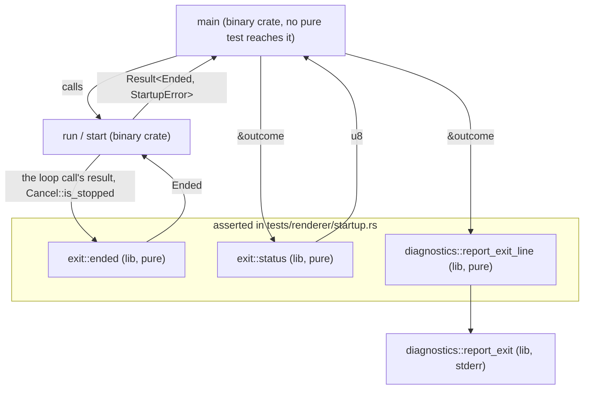
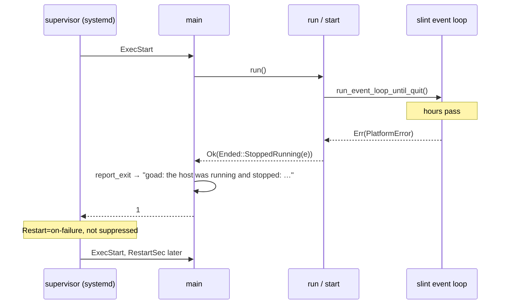

# Design — Slice 010: the exit-code taxonomy

<!-- The *current* design, not its history. Revision chronology, review
     findings, and dispositions live in `design-log.md`.
     Reference forms: canon by id (`SPEC-003 §4`, `ADR-007`, `POL-002`);
     doc-local refs bare — OQ-1 (§6), D1 (§7), R1 (§8). Ids are immutable. -->

**Authority.** `draft-spec.md` in this folder is this slice's working canon for
everything about the exit status, and is cited below as *the draft spec*. It is
not numbered and nothing outside `docs/slices/010/` may cite it (`docs/AGENTS.md`
§Canon that does not exist yet). `canon-delta.md` carries the changes to
SPEC-003: §7's R-4 and R-3 cells, and §9 References.

## 1. Design problem

`main` chooses the host's exit status with one `match` over `run()`'s `Result`,
and that `Result` cannot express the difference the status needs to carry. The
`Err` channel is `StartupError`, whose own doc claims it is *every way `run` can
fail to reach the event loop* — but `start` ends with
`run_event_loop_until_quit().map_err(StartupError::Platform)`, so the loop's
**ending** travels in the same channel as the failures before it, and both
arrive at `ExitCode::from(2)`.

The consequence is measured, not hypothetical (`research.md` §Thread 3): six
exits in two days, every one of them the loop ending after hours of running,
every one reported as 2, and `RestartPreventExitStatus = 2` suppressing the
restart in all six. Two left the host down for around two hours with the
compositor still up the whole time, where a restart two seconds later would have
worked.

This design puts the phase the process ended in into the status. Its boundary:
the value `run` answers, the pure function that turns that value into a number,
the line that accompanies it, and the reasoning in `nix/module.nix`. It does not
change what the host does while running, does not recover from anything
in-process, and does not change a restart directive.

## 2. Current state

`research.md` §Thread 2 is the code map and is not restated here. The three
facts this design load-bears on were re-verified at the symbol while it was
written:

- **`StartupError::Platform` is raised in `start` from `PromptWindow::new`,
  `slint::set_xdg_app_id`, `Tray::new` and `run_event_loop_until_quit`.** The
  first three are *never started*; the last is *stopped running*. One variant,
  two phases. ✓
- **`slint::PlatformError` is `#[non_exhaustive]` and implements
  `From<String>`** (`i-slint-core-1.17.1/api.rs`, a vendored citation and so
  pinned). The `From` produces its `Other(String)` arm, which is the arm the
  observed failure actually carries. So a pure test can construct the real error
  value, and the two phases cannot be told apart by inspecting it — the cut has
  to be structural, at the call site. ✓
- **`nix/module.nix`'s `Service` block** sets `Restart = "on-failure"`,
  `RestartPreventExitStatus = 2`, `RestartSec = 2`, and
  `Install.WantedBy = graphical-session.target`. Exit 1 is restarted by the
  directives exactly as they stand. ✓

One thing `research.md` does not record, found while writing this design and
load-bearing on naming: **`Ending` is already taken.** `controller::Ending`
(`crates/goad/src/controller.rs`) says why the *serve* loop stopped — `Stopped`
or `Closed` — and is a different thing from how the *process* ended. So is
`goad_shell::host::Outcome`, an exchange's product. §5.2 names around both.

## 3. Forces & constraints

- **The draft spec** is the contract this design implements: its R-1…R-7, and
  §7's demand that a clause no cooperating test can reach says so in terms and
  says what review holds instead.
- **SPEC-003/R-4's verification cell** mentions the exit and is stale in one
  sentence and wrong in another; `canon-delta.md` carries the repair, and with
  it the narrowing of R-3's cell, whose *"same position"* analogy the repair
  falsifies. No requirement of SPEC-003 changes.
- **ADR-001 (one-way strata).** The exit decision is stratum 3's and names
  Slint types. Nothing here reaches `src/semantics/` or `goad-shell`.
- **POL-001 (the phase gate).** No new command, and no new instrument in
  POL-001's own sense: its §Verification enumerates the four ADR-001
  instruments and the domain-vocabulary scan, and
  `crates/goad-boundary/tests/checks/structure.rs`'s cases are none of them, so
  the one case this slice adds there amends no canon. No command the gate names
  provides a display, so nothing in the gate can run an event loop that fails —
  which is the constraint §5.5 and the draft spec's §7 are both shaped by.
- **AC-5 is a hard constraint, not a preference.** Every case in
  `crates/goad/tests/binary/exit_codes.rs` passes **unmodified**: 2 keeps its
  meaning and its consumers. This rules out renumbering.
- **`lib.rs` denies `clippy::wildcard_enum_match_arm`** for the whole crate, and
  `main.rs` repeats the deny because a crate root is not a crate. Every match
  this design adds is written without a wildcard over an enum.
- **The domain-vocabulary scan reads `crates/**/*.rs` outside `tests/`**
  (`crates/goad-boundary/tests/checks/vocabulary.rs`), and *journal* is one of
  the forbidden words. The evidence behind this slice lives in the systemd
  journal, and **that word may not appear in code or string literals this
  slice writes** — `exit.rs`, and the new stderr sentences in
  `diagnostics.rs`. The scan cuts comments off
  before matching (`goad_boundary::scan::mentions`, via `code_of`), so a comment
  is not a breach. It is fine in `docs/` and in `nix/module.nix`, neither of
  which the scan reads.

## 4. Guiding principles

**1. The type says which phase, so no reader has to work it out.** The defect is
a value of the wrong type reaching the right place. The repair is a channel per
phase, named for the phase, so that a future edit that files the loop's ending
as a startup failure has to write something that reads as false.

**2. Every branch of the exit decision is in a pure function one tier down.**
The binary tier spawns the process and reads the status it answers; nothing
reaches inside `main` to assert a branch of it. So the design's job is to leave
no branch in `main` at all, and after this slice there is none.

**3. What no test can reach is declared, not passed over.** The single call site
that hands the loop's end to the classifier needs a display. The design says
so, says what review holds and what it does not, and sends the rest to a person
on the running host at audit — SPEC-003/R-3's own position. Not R-4's:
R-4's exit is reachable headlessly and, after `canon-delta.md` Change 1, held
by a binary-tier case, so the two must not be cited as one thing.

## 5. Proposed design

### 5.1 System model



One value leaves `run`, and two pure functions read it — one answers the
machine, one answers the person — and `main` does nothing but pass it to both.
Where the loop call is what ended the process, `exit::ended` builds that value;
otherwise `run` and `start` build it directly. The two
consumers are deliberately separate functions over the same value rather than
one function answering a pair: the number is a contract a supervisor branches on
and the line is prose a person reads, they change for different reasons, and
coupling them would make every wording change a change to the thing systemd
depends on.

**A new library module, `crates/goad/src/exit.rs`.** It owns how the process
ends: the value, and the number. It cannot live in `startup.rs` — that module's
stated job is the three things `run` needs *before* the loop, and putting the
loop's ending there would re-commit at module level exactly the category error
this slice repairs at type level. It cannot live in `diagnostics.rs` either,
which is *everything a person reads*; an exit status is read by a supervisor.
`slice-010.md` §Scope names this file, endorsed 2026-09-23 (`design-log.md`).

**`Cancel` gains a synchronous read, and the loop call's result stops being
read as whether anyone asked — in either direction.** Both directions are false
at the pinned versions (`i-slint-backend-winit-1.17.1/event_loop.rs`, vendored):

- **`Err` for a stop that was asked for.** `about_to_wait` latches `loop_error`
  from `create_inactive_windows` and, unlike `window_event`, does not exit the
  loop, so a latched error followed by a requested quit returns `Err`.
  Classifying that as *stopped running* would exit 1 for an end R-1 requires 0
  for.
- **`Ok` for a stop nobody asked for** (`review-design.md` F-53). Every
  `window_event` arm *assigns* `loop_error` — `window.draw().err()` and its
  siblings — and the arm's foot calls `event_loop.exit()` when one is set.
  winit 0.30.13's Wayland loop checks for an exit only between iterations, so
  a failing event followed by a succeeding one in the same iteration clears the
  error and leaves the exit latched with code 0: the call answers `Ok`, and no
  stop was requested. Classifying that as *as asked* would exit 0, with no line
  and no restart, for a failure.

The host already holds the fact. `Cancel` (`crates/goad/src/wire.rs`) wraps a
`watch::Sender<bool>` and keeps its own receiver, so *a stop was asked for* is
existing state, not new state to thread: `Cancel::stop` trips it and
`Cancel::stopped` awaits it. It gains `Cancel::is_stopped`, a synchronous
`bool` read of the same value — the name `stopped` is taken by the future, and
the two must not be confused at a call site. `Notice::raised` is the same read
on the sibling signal and is the precedent for both the function and its case.

**What trips it is a request, not a person.** `Cancel::stop` is reached, through
`Wire::stop`, from `install`'s `on_close_requested` and `tray.on_quit` callbacks
and nowhere else.
The tray's is the host's own quit control. The window's is a close request
delivered to it, and in the pinned winit (0.30.13) every route to one is a
message received: the Wayland compositor's `xdg_toplevel` close
(`WinitState::request_close`), a click on a client-side decoration's close
button (`FrameAction::Close`), or the X11 window manager's `WM_DELETE_WINDOW`. A
broken display connection delivers no message, so it cannot trip `Cancel`; a
compositor that closes its clients as it goes does, and the host cannot tell
that from a click. So the draft spec says the host was **asked** to stop, and
names the two routes, rather than saying a person asked (A5).

**The decision is a pure function, and `start` only feeds it.** `exit.rs`
gains `exit::ended`, which decides on whether a stop had been requested and
reads the loop call's result only for the error `Ended::StoppedRunning`
carries (§5.2). `start` keeps a clone of `cancel`
before the rest moves into `serve`, exactly as it already keeps `pending` for
the glass (`start` hands `Rc::clone(&pending)` to `SlintGlass::new`), binds the
call's result, and only then reads `is_stopped`: every route that trips
`Cancel` is a callback the loop runs, so once the call has returned the value is
final. `exit::status` stays pure over `Ended` and AC-4 is untouched.

**What this buys and what it does not.** It removes two falsehoods — the
status no longer reports *nobody asked* for an end that was requested, nor *as
asked* for one that was not — and replaces both with a fact the process
observed. It does **not** make the loop's
`Err` mean the loop began: that residue is F-12's, it is unaffected, and §5 of
the draft spec still declares it. Both combinations that motivate this (a latched
error then a quit; a failed event then a succeeding one) need a display and are
not reachable by any cooperating test. What is held one tier down is
`Cancel::is_stopped`'s own behaviour and `exit::ended`'s answer for each of the
call's results, with and without a request; what stays review is that
`start` hands `exit::ended` the call's own result and the read taken after it.

### 5.2 Interfaces & contracts

**`crates/goad/src/exit.rs`** (new; stratum 3, names Slint types):

```rust
/// How the process ended when it did not fail to start. The `Ok` channel of
/// what `run` answers, and so either an invocation that was a question and has
/// been answered — before the event-loop call is reached — or a host that
/// reached that call. `Err` is the *never started* phase whole; `Ok` is not a
/// phase, and this type is what says which end inside it happened.
///
/// **Reaching the call is what the process observes; that the loop began is
/// not.** The call can fail without the loop ever starting, so
/// `StoppedRunning` is not evidence that any work was done. The spec states
/// this cost at the seam rather than leaving it to a reader.
///
/// Not to be confused with `controller::Ending`, which says why the *serve*
/// loop stopped. This says how the *process* ended, which is a bigger thing
/// and a different one.
#[derive(Debug)]
pub enum Ended {
  /// The process did what it was asked: a question answered, or a running
  /// host asked to stop. Both ends are this one, and neither is a failure.
  AsAsked,
  /// The event-loop call ended and **no stop had been requested**, carrying
  /// the call's error when it answered one.
  ///
  /// `None` is not *no failure*: the platform backend can end the loop and
  /// answer `Ok` having cleared the error that ended it. The host reports what
  /// it was given and invents no error the platform did not raise.
  StoppedRunning(Option<slint::PlatformError>),
}

/// Which end the event-loop call was, given whether a stop had been requested
/// by the time it returned.
///
/// Decided on the request alone. The call's result says nothing about it in
/// either direction — it can answer `Err` for a requested stop and `Ok` for an
/// unrequested one — so it is read only for the error the variant carries, and
/// a call site that classifies on the result is wrong even though it compiles.
#[must_use]
pub fn ended(call: Result<(), slint::PlatformError>, stop_requested: bool) -> Ended {
  if stop_requested {
    Ended::AsAsked
  } else {
    Ended::StoppedRunning(call.err())
  }
}

/// The number, over the whole of what `run` can answer.
///
/// `u8` and not `ExitCode`: `ExitCode` carries no `PartialEq`, so a function
/// answering one could not be asserted by any test, and the constant would go
/// back to living in `main` where nothing reads it. `main` widens — the same
/// pure/impure cut `report_exit_line` and `report_exit` make.
#[must_use]
pub fn status(outcome: &Result<Ended, StartupError>) -> u8 {
  match outcome {
    Ok(Ended::AsAsked) => 0,
    Ok(Ended::StoppedRunning(_)) => 1,
    Err(_) => 2,
  }
}
```

The `Err` arm reads **no** `StartupError` variant, and that is the requirement
(draft spec R-3) rather than an economy: a variant cannot be filed under a
different number without someone editing this arm and writing a per-cause
judgement down where a reviewer sees it.

**`crates/goad/src/main.rs`:**

```rust
fn main() -> ExitCode {
  let outcome = run();
  diagnostics::report_exit(&outcome);
  ExitCode::from(exit::status(&outcome))
}

fn run() -> Result<Ended, StartupError> { … }   // Help / Version arms: Ok(Ended::AsAsked)
fn start(path: &Path) -> Result<Ended, StartupError> { … }
```

`start`'s last statement stops mapping the loop's error into the startup channel
and becomes the seam. The clone is taken in step 6, before `cancel` moves into
`serve`. The call is bound in a statement of its own, so the read in the next
one comes after it on the page and not by argument-evaluation order:

```rust
  let stop_signal = cancel.clone();   // step 6, before `cancel` moves
  …
  let call = slint::run_event_loop_until_quit();
  Ok(exit::ended(call, stop_signal.is_stopped()))
```

The call's line ends at the call — nothing is applied to its result there —
which is the shape `structure::the_loop_s_ending_is_never_a_startup_failure`
holds (below).

A failure travelling in the `Ok` channel is the point and not an accident: `Err`
means *never started* and `Ok` means *did not fail to start*, so the channel is
the boundary of that one class and not a three-way phase seam. `--help` answers
`Ok(Ended::AsAsked)` with the loop never having begun, and `Ended` is what tells
that end from a loop that ran. Every `?` in `start` keeps working, and every
`StartupError` in the crate keeps meaning what its type says.

**`crates/goad/src/diagnostics.rs`:**

```rust
/// The line a non-zero exit is accompanied by, and `None` for the status that
/// has nothing to report. The pure half, so every arm is a test with no sink
/// to fake (F-7).
#[must_use]
pub fn report_exit_line(outcome: &Result<Ended, StartupError>) -> Option<String> {
  match outcome {
    Ok(Ended::AsAsked) => None,
    Ok(Ended::StoppedRunning(Some(error))) => {
      Some(format!("goad: the host was running and stopped: {error}"))
    }
    Ok(Ended::StoppedRunning(None)) => {
      Some("goad: the host was running and stopped, and no error was reported".to_owned())
    }
    Err(error) => Some(report_startup_line(error)),
  }
}

/// stderr, once, last.
pub fn report_exit(outcome: &Result<Ended, StartupError>) { … }
```

`report_startup_line` keeps its name, its signature and its text — **its doc
comment is a fourth thing and does not keep**: it opens *"The exact string
`report_startup` writes"*, naming the function this slice removes, so it is
re-anchored to the outlet that survives (`review-design.md` F-34). The text the
function answers is unchanged — the binary
tier names it and AC-5 forbids touching those cases. `report_startup`, the
outlet, had exactly one caller (`main`) and `report_exit` replaces it: it is
removed rather than left as a second door onto the same stream. The module's own
`//!` doc names `report_startup` among the outlets PHASE-08 added, and goes
false with it: that sentence names `report_exit` instead.

**The stderr sentences, and why they are distinct.** After this slice each is
true of exactly one situation, which is what draft spec R-6 asks for:

| line | said by |
|---|---|
| `goad: the display could not be opened: {error}` | a host that **never started** — `StartupError::Platform`, now only from `PromptWindow::new`, `slint::set_xdg_app_id` and `Tray::new` |
| `goad: the host was running and stopped: {error}` | a host that **stopped running**, the call having answered an error |
| `goad: the host was running and stopped, and no error was reported` | a host that **stopped running**, the call having answered `Ok` with no stop requested |
| `goad: the window could not be drawn: {detail}` | a host that is **still running** and could not draw — `report_platform`, untouched by this slice |

Both new sentences name the phase and not the cause. It would be tempting to say
*the display connection was lost*, which is what the measured failures were, but
`run_event_loop_until_quit` can fail for whatever the platform backend decides,
and the host does not know which. The cause is in `{error}`, where it belongs.

**`crates/goad/src/startup.rs`** — no signature changes; doc-comment repairs,
each of which is a claim the type currently falsifies:

- `StartupError`'s own doc: *every way `run` can fail to reach the event loop*
  becomes true, and gains a sentence saying where the loop's ending went.
- The sentence *Every variant is exit 2: `main` has one `match` over `run`'s
  `Result`…* is replaced: the number is `exit::status`'s single `Err` arm, and
  what it means is the spec's.
- `Platform`'s variant doc names `set_xdg_app_id`, `PromptWindow::new` and
  `Tray::new`, and no longer names `run_event_loop_until_quit`.

**`nix/module.nix`** — the directives stand; the argument changes. The exception
paragraph goes entirely (AC-7), and the remaining comment stops claiming that
the causes behind 2 *do not succeed on a retry*, which is false of
`Runtime(io::Error)` and of an ingress socket held by a host that is about to
exit. What it says instead is the phase rule: 2 is a host that never started, so
restarting it changes nothing a person has not changed first; 1 is a host that
had started and stopped, which `Restart = "on-failure"` brings back after
`RestartSec`.

**`crates/goad-boundary/tests/checks/structure.rs`** — one case,
`the_loop_s_ending_is_never_a_startup_failure`, guarding §8 R2. It holds one
rule about the call's line rather than a list of the spellings a re-filing could
wear: **exactly one production line of `crates/goad/src` names
`run_event_loop_until_quit`, and that line ends at the call** — its
`code_of`-stripped text, trimmed, ends `run_event_loop_until_quit();`, so
nothing is applied to the call's result on the line that makes it.

A shape rather than needles, because the needles kept leaking. Each round found
a spelling the last one missed — `?` directly on the call, `map_err(Into::into)`,
an imported variant, an alias — and every one of them is something applied to
the result on the call's own line. Wrapping the call or chaining onto it puts
tokens between its `()` and the `;`, however the wrapper is spelled, so the
shape reds all of them without naming any; a chain moved onto the next line
leaves the call's line ending without the `;`, so it reds that too. The count
half holds the call's uniqueness, which nothing in the gate held before. No
rule is made about `StartupError`'s conversions: the case constrains the one
line it guards and no type. What it does forbid, beyond a second call, is any
other mention of the function in production code — an import of it included,
since `use slint::run_event_loop_until_quit;` is a second line naming it. The
call is written by its path.

It is written the way the file's existing cases are: `occurrences_where` over
`code_of`-stripped production lines, so a doc comment naming the function is not
a breach. The shape is a named predicate, `ends_at_the_loop_call`, beside
`calls_resolve`, and it is controlled in `counting_itself` the way that module
controls the file's other matchers — string literals of a line that must pass
(`    let call = slint::run_event_loop_until_quit();`) and of lines that must not
(the call followed by `.map_err(StartupError::Platform)?`, and by `?` alone).
Those controls prove the predicate reads a line as intended; they are strings,
and prove nothing about the tree. What proves the case holds the tree is §9's
mutation list, run against real source — and a mutation is only evidence once
the mutated build is seen to compile and the case to red.

**What the case does not reach**, derived from the matcher: its count half reads
every production line naming the function, and its shape half reads the call's
own line and nothing else, so a re-filing written **anywhere off that line** that
does not name the function is
invisible to it — of the call's binding (`call?`), or of the `Ended` that
`exit::ended` answers, in `start`, `run` or `main` (`review-design.md` F-55).
That no code downstream of `exit::ended` turns an `Ended` into an `Err` is
review. The case's doc comment says so, the way the vocabulary scan's does.

`slice-010.md` §Scope names this target and the case. It amends no canon — POL-001 §Verification enumerates the four ADR-001
instruments and the domain-vocabulary scan, and this file's cases are none of
them (§3).

**The two-tier cut moves, and both module docs say so.** Today
`crates/goad/tests/renderer/startup.rs`'s own doc says *"No test here runs the
binary or asserts an exit code"*, and `crates/goad/tests/binary/exit_codes.rs`'s
says the renderer tier *"cannot see the constant each arm names, because no pure
test runs a process"*. Both were true while the numerals lived in `main`. After
this slice they are a pure function's answers, so the renderer tier holds **the
numbers** and the binary tier holds that the **process** answers them to a
caller — which is the half no pure test can ever reach, and so still the reason
that target exists. Each doc states the new cut; neither is left asserting the
old one. `exit_codes.rs`'s doc is AC-5's one permitted edit, and
`renderer/startup.rs`'s is a surface this design adds to §Scope.

### 5.3 Data, state & ownership

Nothing is stored and nothing is derived twice.

- **`run` owns the outcome value** and hands it to `main`, which owns it for the
  remainder of the process and lends it to two readers. Neither reader mutates
  it and neither retains it.
- **`exit.rs` owns the numbers.** They appear nowhere else in production code.
  `nix/module.nix` and `crates/goad/tests/binary/exit_codes.rs` each hold a copy
  by value, deliberately: a consumer and a test, which is what makes a change to
  a number fail something (draft spec P-C).
- **`diagnostics.rs` owns every string a person reads**, including the two new
  *stopped running* sentences, unchanged from the rule the module already states.
- **`StartupError` stops owning the loop's ending.** That is the whole of the
  ownership change, and it is what makes the type's own doc true again (AC-3).

### 5.4 Lifecycle & dynamics



The same sequence with `Err(StartupError::…)` at the second step ends at 2, is
suppressed by `RestartPreventExitStatus`, and is unchanged from today — which is
the half AC-5 protects.

**What changes on the running host.** Before: the loop ends, the status is 2,
the restart is suppressed, and the host is down until the session target
happens to cycle — 9 to 20 seconds in the lucky cases, around two hours in the
two that did the damage. After: the status is 1, the restart is not suppressed,
and the host is back after `RestartSec`. In the shape where the compositor
really did go away, the restart at +2 s finds no display, fails in
`PromptWindow::new`, exits 2 and is suppressed — after which the session target
recovers it exactly as it does today (`research.md` §Thread 3). The design is
better in the harmful shape and neutral in the other.

### 5.5 Invariants, assumptions & edge cases

**Invariants.**

- `main` contains no branch. Every decision it used to make is in `exit::status`
  or `report_exit_line`, both pure, both asserted.
- `exit::status` returns 0 for `Ended::AsAsked` and for nothing else, 1 for
  `Ended::StoppedRunning` and for nothing else, 2 for every `Err`.
- `Ended::StoppedRunning` is constructed at exactly one site in
  `crates/goad/src`: `exit::ended`'s arm for no stop requested, fed by that
  directory's only `run_event_loop_until_quit` call. The call's
  uniqueness is held by `structure::the_loop_s_ending_is_never_a_startup_failure`,
  which scans that directory and not the workspace — the `event_loop_*` targets
  each have a call of their own. That no other site constructs the variant, and
  that nothing downstream of `exit::ended` turns an `Ended` into an `Err`, is
  review.
- The process writes at most one line to standard error *after* `run` returns,
  and nothing runs after it.

**Assumptions — each one a place this design can break.**

- **A1. The loop call's result is not the volition signal, in either
  direction.** `Ok` does not mean a stop was asked for: `quit_event_loop` is
  not the only route to it, since at the pinned versions the backend can end
  the loop `Ok` having cleared the error that ended it (§5.1,
  `review-design.md` F-53). So `exit::ended` decides every end on
  the request and reads the call only for the error it carries. What A1 now
  assumes is only what `exit::ended` reads: **that a stop was requested is
  exactly `Cancel` having been tripped** — A5's converse.

  `serve`'s other return, `Ending::Closed` (every `Command` sender dropped),
  follows from this without a residue. It ends the loop through
  `quit_event_loop` with no request, so it is `Ended::StoppedRunning` —
  carrying `None`, unless the backend had latched an error before the quit
  (A5), when it carries that — and exits 1 — a host that stopped without being asked, which is what 1 means.
  006/F-R9's argument that no production path reaches it still stands, and is
  no longer load-bearing on any status.
- **A2. A lost display ends the loop call, and not an earlier step.**
  Held by observation on the running host at audit (AC-9) and by nothing else.
  This is the assumption the whole slice rests on, and it is why AC-9 exists.
- **A3. `slint::PlatformError`'s `From<String>` keeps producing the arm the real
  failure carries.** It is `#[non_exhaustive]`, so slint may add variants; the
  classification does not read the variant, so a new one changes nothing here.
- **A4. The loop's `Err` does not mean the loop began.** The call can fail on
  entry — `EventLoopState::run` answers `PlatformError::from("Nested event loops
  are not supported")` before `run_app_on_demand` is reached
  (`i-slint-backend-winit-1.17.1/event_loop.rs:689-717`), `run_app_on_demand`
  can itself fail at entry, and `with_platform` can fail to select a platform at
  all. The design classifies all of them as `Ended::StoppedRunning`, because the
  fact it can observe is that it **reached the call**, never that the loop
  began. `start` calls the function once, so the nested-loop arm is not a
  production path today — an argument about this code, not about the value the
  classifier reads, which is why the draft spec states the cost at the seam (§5,
  *What the seam costs*) rather than leaving the stronger reading to a consumer.
- **A5. The loop's `Err` does not mean nobody asked — and the design no longer
  reads it that way.** `about_to_wait` latches `loop_error` from
  `create_inactive_windows` and, unlike `window_event`, does not exit the loop
  (`i-slint-backend-winit-1.17.1/event_loop.rs`), and `EventLoopState::run`
  checks `loop_error` *after* `run_app_on_demand` returns normally. So a latched
  error followed by a requested quit answers `Err` for an end the host was
  asked for. `exit::ended` therefore reads the request (§5.1) rather than
  treating the channel as the volition signal. **This is an assumption about
  slint's behaviour, not about ours**: if a future version exits the loop when
  it latches, the check becomes redundant rather than wrong.

  **The converse matters as much: nothing but a request may trip `Cancel`**,
  since `exit::ended` answers 0 for whatever has. Its two sources are the tray's
  quit and a close request delivered to the window, and in the pinned winit
  every close request is a message received — a compositor's `xdg_toplevel`
  close, a client-side decoration's close button, an X11 `WM_DELETE_WINDOW`
  (§5.1). A lost connection delivers none, so the slice's target failure cannot
  reach 0 through this arm. A compositor that sends its clients a close as it
  shuts down does trip it, and the host exits 0 — as it does today by the `Ok`
  route, since the request is indistinguishable from a click. That is why the
  draft spec says *asked*, not *a person asked*. **Held by reading winit
  0.30.13 and by nothing else**; AC-9's observation is the check, and a 0 there
  is §8 R1's signal.

**Edges.**

| edge | behaviour |
|---|---|
| `--help` / `--version` | `Ok(Ended::AsAsked)`, status 0, nothing on standard error — unchanged, and `help_prints_the_usage_block_on_stdout_and_exits_0` still asserts it |
| a startup failure of any cause | `Err(StartupError::…)`, status 2, one line, unchanged |
| a stop is asked for, and the loop call then answers `Err` | `Ok(Ended::AsAsked)`, status 0, nothing on standard error — `exit::ended`'s requested-stop arm (A5) |
| the loop call answers `Ok` and no stop was asked for | `Ok(Ended::StoppedRunning(None))`, status 1, the no-error line — the backend's cleared error (A1, F-53) |
| a platform failure **during** the run that does not end the process | `report_platform` as today; not an exit, not this design's |
| a panic | 101 by the runtime, outside the set the draft spec defines and named there as such |
| `serve` returns `Ending::Closed` | `Ok(Ended::StoppedRunning(_))`, status 1, the line for whichever result the call answered — production-unreachable (A1) |

## 6. Open questions

**OQ-1 — the shape of the outcome value. Answered: `Result<Ended,
StartupError>`, with `Ended` carrying the two the loop can produce.** The
alternative, one flat enum over every class, puts them all in one exhaustive
match and reads 1:1 against the spec's own statuses — a real attraction. It
loses on two counts. It takes `?` away from `start`, which is fallible at nearly
every step, so either each one grows a `match … return` or a wrapper converts, and
the wrapper has to live in `main`, which no pure test reaches.
And the flat enum is wider than any channel can produce: `run` could never
answer `Ok(Outcome::NeverStarted(..))`, yet the type admits it. The `Result`
shape admits no value in the wrong channel either — though it buys less than it
first appears, because `Ok` is *did not fail to start* and not *started*:
`Ended::AsAsked` is produced both before the loop and after it, and only
`Ended`'s own doc says so. That is a doc obligation, not a second channel. It
leaves `main` with nothing to test. See D1.

**OQ-2 — the stderr line for *stopped running*. Answered: its own wording,
`goad: the host was running and stopped: {error}`.** Reusing
`report_platform_line`'s *the window could not be drawn* would make the line a
host writes as it dies identical to the one a **running** host writes when a
draw fails, which is the one distinction a person reading the stream most needs.
Both *stopped running* sentences name the phase, not the cause. See §5.2 and D2.

**OQ-3 — what the spec requires of the line's content. Answered: a property,
never a wording.** The draft spec requires that a non-zero exit is accompanied
by a line (R-4), that it says who spoke (R-4), and that *stopped running*'s line
says the host had been running and is not the line a host that never started
writes (R-6). It pins no string. Prose fixed in a normative document goes stale
in the document rather than in the code, which is the failure
`canon-delta.md` is repairing in SPEC-003 as this slice runs. The exact strings
live in `tests/renderer/startup.rs`, where changing one is visible.

**OQ-5 — how `goad-emit` appears. Answered: a named boundary, no table.** The
draft spec's §2 says it is nominally owned and not yet governed, says why its
classes are not the host's, and stops. A non-normative table of what emit does
today would be a fact about code sitting inside a normative document with
nothing re-reading it — the precise shape of the defect `canon-delta.md` is
fixing, and it would read as a rule however it were labelled. The gap is tracked
as a follow-up at close, with its own kill condition: the row's text is drafted
in `slice-010.md` §Follow-ups, so the gap is recorded rather than left for a
reader to notice (`design-log.md`, 2026-09-23).

**OQ-4 — should a startup platform failure also be restartable? User gate.
Designed against "no"; the argument is in §7 D4, and §10 names what changes if
the answer is yes.**

**OQ-6 — does the spec bind a supervisor? Designed against "no — define the
statuses, leave policy to the consumer"** (`design-log.md`, 2026-09-23).
Nothing in the draft spec is addressed to a supervisor, and its §3 P-A and §6
are worded so that every mention of a consumer is a statement about what the
*status* carries rather than an instruction about what to do with it — that
distinction is the whole of the decision, so it is held in the wording and not
only in the absence of a MUST. The draft spec has no
requirement addressed to a supervisor.

**This was breached once and restored** (`review-design.md` F-25): a repair
wrote *"a consumer MUST NOT read 1 as evidence that the host did any work"* into
§5, which is an instruction to a consumer wearing a MUST NOT, carrying no
requirement id and no §7 row — the exact shape D5 refused. §5 now says *1 is not
evidence that the host did any work*, a statement about what the number carries.
The residue was worth stating; the form it was first stated in was the one this
decision excludes. What it does instead is put the limits of
inference into the *definition* of each status (§6: *never started* does not
mean a retry would fail; *stopped running* does not mean one would succeed),
which is inside what the document owns and gives a reviewer of `nix/module.nix`
something to cite. See §7 D5 for the residue this leaves.

## 7. Decisions, rationale & alternatives

**D1 — `run` answers `Result<Ended, StartupError>`; `main` has no branch.**
Rejected: a flat three-variant enum (OQ-1's reasons); and a single pure function
answering both the number and the line, which couples a supervisor's contract to
a person's prose. Consequence: the classes are split across two type levels, and the
split is **not** one class per channel. `Err` is *never started* whole; `Ok`
holds the other two and `Ended` tells them apart. A reader checking the code
against the spec reads the `Result` for one boundary and `Ended` for the other.
§5.2's doc comment is what says so, and it is load-bearing for exactly that
reason: a version of it claiming `Ok` means the host started would be false of
`--help`.

**D2 — the *stopped running* line is its own sentence.** Rejected: reusing
`report_platform_line`'s vocabulary (OQ-2). Consequence: `diagnostics.rs` gains
a stderr sentence of its own, beside the ones it already renders.

**D3 — a new module, `crates/goad/src/exit.rs`.** Rejected: `startup.rs`, whose
name and stated job are the phase this value is not from; `diagnostics.rs`,
which is what a person reads. Consequence: the file `slice-010.md` §Scope
names, and one `pub mod` line in `lib.rs`. The tests go into the
**existing** `tests/renderer/startup.rs`, which `exit_codes.rs` already names as
the home of the arms, so no test file is added.

**D4 — a startup platform failure is not restartable (OQ-4's recommendation,
user gate).** For "yes": the race is real — the compositor cycles, the restart
lands at +2 s, finds no display, exits 2, and is suppressed. Against, and why
the recommendation is no: (a) it is the transient/permanent split inside *never
started* by another name, and that was settled as a non-goal with its reasons
(`design-log.md`, 2026-09-23); (b) it would make `exit::status`'s `Err` arm read
a `StartupError` variant, putting the per-cause judgement the phase axis exists
to avoid back into the classifier, where a misfiled future variant fails
silently in both directions; (c) the journal shows that shape already
self-recovering in 9–20 s via the session target, so the harm it addresses is
bounded and small, while the harm it would introduce — a host with genuinely no
display restarting until systemd's limiter gives up — is not; (d) the axis would
become *phase, except here*, which is how the current defect arose. The
consequence of "no" is written into the draft spec's §6 as a stated consequence
rather than left for a reader to rediscover.

**D5 — the spec defines the statuses and binds no supervisor (OQ-6's
recommendation, user gate).** For binding: `nix/module.nix` lives in this
repository, and a requirement would stop a future comment there re-arguing from
retryability — which is exactly what this slice is repairing. Against, and why
the recommendation is not to bind: a supervisor is not a binary this document
owns, and a MUST addressed to one would be a requirement §7 could not verify
past this repository's own single consumer — a row naming no test, in a document
whose §7 exists to forbid exactly that. **Residue:** with no requirement,
nothing in canon stops `nix/module.nix`'s comment drifting back. The mitigation
is §6's explicit non-inferences, which a reviewer can cite, and AC-7, which a
person checks once. Named here so that a future slice finding the drift knows it
was foreseen and priced.

**D6 — code and packaging comments carry no spec number until promotion.** The
draft is not canon and nothing outside this slice folder may cite it
(`docs/AGENTS.md`), so `nix/module.nix`, `exit.rs` and `StartupError`'s doc state
the **rule** and cite nothing numbered while the slice runs. Adding
`SPEC-NNN §…` to those three sites is an explicit obligation of promotion, and
§10 records it as a reconciliation row rather than leaving it to be noticed.
Rejected: citing `docs/slices/010/draft-spec.md` from production code, which
would rot at the moment of promotion.

## 8. Risks & mitigations

**R1 — the one call site no test can reach.** The loop call returning with no
stop requested is where a real failure enters the new class, and nothing in the
gate can produce one. *Likelihood of a defect there: low; impact:
total — the slice's whole purpose passes through it.* Mitigation: the draft
spec's §7 R-2 cell declares it in terms, naming what review holds and what it
does not; AC-9 puts a person on the running host. Signal that it is wrong: the
status is 2 after a lost display, or the line is the *never started* one — or
the status is **0** with no line, which would mean the display's loss tripped
`Cancel` and `exit::ended` read it as a request (A5).

**R2 — a future edit re-files the loop's ending as a startup failure.**
`map_err(StartupError::Platform)` back on that call still compiles and leaves
every existing test green. *Likelihood: low; impact: the defect returns in
full.* Mitigated by a case in the gate:
`structure::the_loop_s_ending_is_never_a_startup_failure` (§5.2) holds that the
call has one production line and that the line ends at the call, so nothing —
under any spelling — is applied to its result there. Naming carries the rest:
the variant's doc names its call sites, and `Ended`'s doc says what the `Ok`
channel means. **What is left is the scan's own limit rather than the whole
risk**, and it is stated rather than mitigated away: the scan's shape half reads
the call's line and nothing else, so a re-filing written anywhere off it that
does not name the function — of the call's
binding, or of the `Ended` that `exit::ended` answers — is invisible to it, and
is review (§5.2).

**R3 — exit 1 now restarts, so a flapping compositor can loop.** A host that
opens a window, loses the loop, restarts, opens a window and loses it again will
restart repeatedly. *Likelihood: low — it needs the display to keep coming back
just long enough; impact: bounded.* Mitigation: systemd's start limiter, which
this slice does not change, stops it and says so in the unit's status. Signal:
`goad.service: Start request repeated too quickly`.

**R4 — the draft is not promoted and the slice cannot close.** `docs/AGENTS.md`
is explicit: a slice does not close holding an unpromoted draft. *Likelihood:
low; impact: the slice stalls at audit.* Mitigation: §10's reconciliation rows
name every promotion obligation, including D6's three citation sites.

**R5 — `exit::Ended` and `controller::Ending` are one letter apart** and mean
different things in the same crate. *Likelihood of confusion: moderate; impact:
low but persistent.* Mitigation: each type's doc names the other and says which
loop it is about. Rejected alternatives were all worse: `Outcome` collides with
`goad_shell::host::Outcome`, and `Exit` in a module named `exit` stutters.

## 9. Validation

What the plan must produce. The draft spec's §7 is the normative version of this
table; this is the implementation view.

| what | where |
|---|---|
| `exit::status` answers 0 for `Ended::AsAsked` | `exit_status::as_asked_is_0`, `crates/goad/tests/renderer/startup.rs` |
| `exit::status` answers 1 for `Ended::StoppedRunning` carrying a **real** `slint::PlatformError` built through `From<String>` | `exit_status::stopped_running_is_1`, same file |
| …and for `Ended::StoppedRunning(None)`, the end F-53 moved from 0 to 1 | `exit_status::stopped_running_with_no_error_is_1`, same file |
| `exit::status` answers 2 for a startup failure, named variants rather than counted | `exit_status::every_startup_failure_is_2`, same file |
| status 0 writes no line | `stderr_outlets::report_exit_line_says_nothing_when_the_end_was_as_asked`, same file |
| a startup failure's line is exactly `report_startup_line`'s, so the binary tier's cases stay true | `stderr_outlets::report_exit_line_for_a_startup_failure_is_the_startup_line`, same file |
| the *stopped running* line says the host had been running | `stderr_outlets::a_host_that_stopped_running_says_it_had_been_running`, same file |
| …and says so when the call reported no error | `stderr_outlets::a_host_that_stopped_running_with_no_error_says_it_had_been_running`, same file |
| …and neither *stopped running* line is the line a host that never started writes — the pair that makes the two above claims rather than snapshots | `stderr_outlets::the_stopped_line_is_not_the_line_a_host_that_never_started_writes`, same file |
| every existing binary-tier case passes **unmodified** | `crates/goad/tests/binary/exit_codes.rs`, untouched but for its module doc |
| exactly one production line of `crates/goad/src` names `run_event_loop_until_quit`, and it ends at the call — nothing applied to the result on that line (§5.2) | `structure::the_loop_s_ending_is_never_a_startup_failure`, `crates/goad-boundary/tests/checks/structure.rs` |
| the shape predicate passes the sanctioned line and fails the call with anything applied to it — `.map_err(StartupError::Platform)?`, and `?` alone | `counting_itself::the_bare_loop_call_ends_at_the_call` and `counting_itself::a_loop_call_with_its_result_re_filed_does_not`, same file |
| `Cancel::is_stopped` answers false before `stop` and true after it, and stays true | `tests::is_stopped_is_false_until_stop_and_stays_true`, `crates/goad/src/wire.rs` (the module's own `#[cfg(test)] mod tests`, beside `a_raised_notice_stays_raised_until_it_is_lowered`) |
| a loop `Err` is *stopped running*, carrying that error, when no stop was requested, and *as asked* when one was — both over **one** error value built through `From<String>` | `ended::a_loop_error_with_no_stop_requested_is_stopped_running` and `ended::a_loop_error_after_a_requested_stop_is_as_asked`, `crates/goad/tests/renderer/startup.rs` |
| a loop that returned `Ok` is *stopped running*, carrying no error, when no stop was requested, and *as asked* when one was | `ended::a_loop_that_returned_ok_with_no_stop_requested_is_stopped_running` and `ended::a_loop_that_returned_ok_after_a_requested_stop_is_as_asked`, same file |
| a configured ingress path the host cannot bind exits 2, read from the process by a caller | `exit_codes::an_unbindable_ingress_path_exits_2`, `crates/goad/tests/binary/exit_codes.rs` (F-26) |
| a lost display on the running host exits 1 and the unit comes back within `RestartSec` | `audit.md` §Evidence, AC-9 |

**Mutations the plan should confirm are caught**, so the coverage claim is
measured rather than asserted.

- **The classifier.** Changing `Ok(Ended::StoppedRunning(_)) => 1` to `=> 2`
  must red `stopped_running_is_1` and `stopped_running_with_no_error_is_1`.
  Splitting the arm so that `Ok(Ended::StoppedRunning(None))` answers 0 —
  F-53's exit 0 moved one function downstream — must red
  `stopped_running_with_no_error_is_1`. Changing `Err(_) => 2` to `=> 1` must red
  both `every_startup_failure_is_2` and every failing case in `exit_codes.rs`.
- **The line.** Making `report_exit_line`'s `StoppedRunning(Some(_))` arm
  answer `report_startup_line`'s sentence over `StartupError::Platform` must
  red `the_stopped_line_is_not_the_line_a_host_that_never_started_writes` and
  `a_host_that_stopped_running_says_it_had_been_running`; making its
  `StoppedRunning(None)` arm answer a never-started line must red the same
  distinctness case and
  `a_host_that_stopped_running_with_no_error_says_it_had_been_running`.
- **The scan.** Restoring `.map_err(StartupError::Platform)?` on the call's line
  must red `the_loop_s_ending_is_never_a_startup_failure`; so must the same
  re-filing through an imported variant (`use
  goad::startup::StartupError::Platform;` then `.map_err(Platform)?`), which is
  the spelling a needle naming the type could not see; and so must a second
  production call. The two re-filings must be spelled so the mutated build
  compiles: `let call = slint::run_event_loop_until_quit().map_err(…)?;` leaves
  `call` a `()` and does not type-check against `exit::ended`, while `let call =
  Ok(slint::run_event_loop_until_quit().map_err(…)?);` does (checked with
  `rustc` over stand-in types). Each scan mutation reds **nothing else**, which
  is why the case exists.
- **The decision.** Making `exit::ended` answer `AsAsked` for every `Ok` — the
  shape F-53 found wrong — must red
  `a_loop_that_returned_ok_with_no_stop_requested_is_stopped_running`. Making it
  answer `StoppedRunning` whatever was requested must red both
  `…_after_a_requested_stop_is_as_asked` cases. Making it answer `AsAsked`
  whatever was requested must red both `…_with_no_stop_requested_is_stopped_running`
  cases. Carrying `None` for an `Err` must red
  `a_loop_error_with_no_stop_requested_is_stopped_running`.
- **The new binary case.** Pointing `exit_codes.rs`'s new case at a bindable
  path must red `an_unbindable_ingress_path_exits_2`.

**What no mutation here can measure**: `start` passing `exit::ended` a constant
`false`, or a read taken before the call, is green everywhere — the wiring is in
the binary crate (§4, second principle), and it is review, as the draft spec's
R-1 and R-2 cells say.

**Test names are commitments.** The draft spec's §7 cites them, and the draft is
kept current as the shape of the work changes (`docs/AGENTS.md`): a phase that
names a case differently updates the draft in the same commit.

## 10. Canon impact

| document | change | settled by |
|---|---|---|
| **new spec** (`draft-spec.md`, numbered at promotion) | the whole document: the host's exit statuses, what may and may not be inferred, the line beside a failure. §Owns is the wider boundary; §4 is the host alone | AC-1, AC-2; promoted with user endorsement at audit |
| **SPEC-003 §7, R-4's cell** | one sentence replaced, carrying two defects: the stale *no test target links the binary*, and the clause recording the conflation as a fact. No requirement changes | `canon-delta.md` Change 1; AC-8 |
| **SPEC-003 §7, R-3's cell** | one phrase replaced: the `LivenessUnknown` arm stops claiming R-4's exit's position, which R-4's repaired cell no longer holds. Lands with the row above and is not separable from it | `canon-delta.md` Change 3; AC-8 |
| **SPEC-003 §9 References** | a line for the new spec, since R-4's cell now defers to it. Separable from both rows above and marked as such | `canon-delta.md` |
| **`docs/follow-ups.md` FU-1** | struck at close with what killed it, carrying three factual corrections | AC-10 |

**Obligations promotion must discharge, beyond moving the file** (D6): add the
assigned `SPEC-NNN` citation to `nix/module.nix`'s comment, to `exit.rs`'s
module doc, and to `StartupError`'s type doc; substitute the number for
`SPEC-00N` everywhere `canon-delta.md` carries the placeholder; **remove §7's
`DRAFT-ONLY` comment, having checked that every case its rows name resolves in
the tree**; and record each in `audit.md`'s Reconciliation table. The draft-only
comment is a promotion obligation and not a sentence canon keeps —
`docs/AGENTS.md` §Documentation says canon states what is true now, and a
promoted spec that still explained its own draft status would be a revision
history (`review-design.md` F-31).

**Beyond `slice-010.md` §Scope**, and flagged rather than assumed. The list is
short by design: `exit.rs`, `crates/goad/tests/renderer/startup.rs` and
`crates/goad-boundary/tests/checks/structure.rs` were each endorsed and moved
**into** §Scope (`design-log.md`, 2026-09-23), so they are no longer here. What
remains outside it is one thing, and it is the thing this list exists to put in
front of the user:

- **`lib.rs`'s header comment, not only its `pub mod` line.** That comment keeps
  a running count of modules — *"ten at PHASE-08, nine after 005 … ten again
  with `draft` … Slice 009 adds two more"* — and `exit.rs` makes it stale. It is
  replaced by the rule it was counting, not incremented: one `pub mod` line per
  module, no number. Incrementing a count that nothing re-reads is the rot
  `CLAUDE.md` §Working here names, and this slice would be adding to it in the
  file it is already editing.

`exit.rs`'s own `pub mod` line, `crates/goad/tests/renderer/startup.rs`'s
module doc and `structure.rs`'s case are consequences of surfaces §Scope already
names, and are specified in §5.1 and §5.2 rather than listed here.
