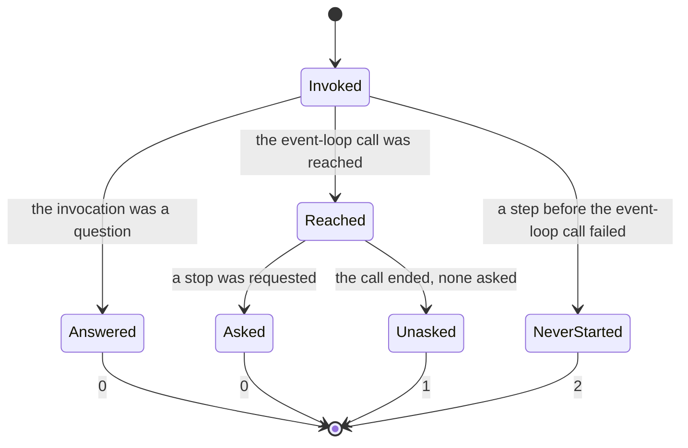

# SPEC-NNN: process exit status

**Status:** draft — slice 010's working authority. **Not canon.** It is numbered
and moved to `docs/specs/` at promotion (`docs/AGENTS.md` §Canon that does not
exist yet), and until then nothing outside `docs/slices/010/` may cite it.
Suggested slug at promotion: `004-process-exit-status.md`.

**Kind:** technical

**Owns:** the exit status of this project's binaries — what each status means,
what a reader may infer from it and what it may not, and the line on standard
error that accompanies a failure.

<!-- A spec is evergreen and normative: it describes what is true now, not how
     it came to be true. No changelog, no revision history, no "we used to".
     Amending it requires explicit user endorsement.
     Requirement ids (R-N) are immutable — append, never renumber. Cite from
     elsewhere as SPEC-NNN/R-N once this document is numbered. -->

## 1. Intent

A process that ends says one thing to whatever started it: a number. Everything
else it wrote — the line on standard error, whatever reached a person's screen —
is prose, and a supervisor cannot branch on prose. The number is therefore the
whole of the machine-readable contract, and it is worth stating deliberately
rather than leaving to whichever `ExitCode::from` happened to be in hand.

The host's number today says less than it appears to. Every failure exits 2,
whether the host could not read its configuration before it opened anything or
ran for hours and then lost its display. A supervisor told 2 is told *a person
must change something first*, and so does nothing; which is right for the
configuration and wrong for the display, where the host would have come back on
the next try. This document is the repair: the status names **the phase the
process ended in**, which is a fact the process observes, rather than a judgement
about whether trying again would work.

Once this exists, a supervisor — `nix/module.nix`'s systemd unit is the one this
repository ships, and it is not the only one possible — can build a restart
policy out of facts rather than out of a reading of source. A person reading a
line on standard error can tell a host that never started from one that had been
running. And a second implementation of this host can be held to the same
numbers.

## 2. Scope

**In scope:** the process exit status of this project's binaries; for the host,
what each status means and what may and may not be inferred from it; the rule
that a non-zero status is accompanied by a line on standard error; and the rule
that the classes are told apart by the status and not only by the line.

**Out of scope:** restart, retry and backoff **policy**, which belongs to
whatever supervises the process and is never asserted here (§3 P-D); in-process
recovery from anything, of which there is none; what a **backend** exits with,
which is SPEC-001/R-40 and R-44 and is about a process this project does not
ship; the host's own diagnostics surface, which SPEC-003/R-15 governs and which
a running host writes to without ending; and the content of standard output,
which is an answer to an invocation rather than a report of how the process
ended.

**Boundaries.**

- **`goad-emit` is nominally owned and not yet governed.** §Owns is stated at
  the wider boundary deliberately, so that admitting the second binary later is
  an append to §4 and a column in §6 rather than a restructure. Until that
  happens, **§4 writes requirements for the host alone** and says so at its own
  head: this document's silence about `goad-emit` is silence, and a reader must
  not take it for a rule. What `goad-emit` does today is in its own source and
  is not restated here, because a non-normative table of current behaviour in a
  normative document is a claim nothing re-reads.
- **`goad-emit`'s classes are not the host's classes**, which is why admitting
  it is an amendment and not an observation. It reports a refusal *as an
  answer* — the host it wrote to considered the envelope and said no — and a
  host that never started has no answer to give. The two binaries share §3's
  principles and not §4's cut.
- **SPEC-001 §2** puts the `goad emit` command line out of its own scope, which
  is why that binary's statuses have no owner today and why this document
  claims the boundary.
- **SPEC-003** owns refusals *inside* a running host. A refusal is an answer to
  a writer and never an exit status; a host that refuses an envelope has not
  ended.

The criterion **SPEC-003 P-D** states for absolute clauses binds this document
too: a clause here that says a mechanism always holds or never fails names its
exception and bounds it, or it is not ready to be written down. That is a rule
about the **clause**, and it is met in §4 wherever a clause has an exception to
carry: R-7's is the status it does not choose, R-4's is that same end writing no
line, R-6's is the seam §5 names, and each sits in the sentence it qualifies
rather than in a later section.

It is not §7's rule, with which it is easily confused. §7 governs a clause **no
cooperating test reaches**, and asks that clause's row to say what review holds
and what it does not; R-1's, R-2's and R-4's rows are each where that one is
met. A clause
may need both, one, or neither, and a document that discharges the first in the
second has met neither.

## 3. Principles

These hold of every binary this project ships, including the one §4 does not yet
govern.

**P-A — A status names a class, never a cause.** The number says which of a
small closed set of outcomes happened. It does not encode which variant, which
file, which errno or which call failed: those are in the line on standard error,
where a person reads them. The number is therefore the whole of what a consumer
can branch on; the prose is not, and a status that leaves a consumer no choice
but to parse prose has failed to do its job.

**P-B — Nothing ends badly in silence.** Every non-zero status is accompanied by
a line on standard error naming the binary that wrote it and what happened. A
process that exits non-zero having written nothing has told nobody anything, and
this document treats that as a defect rather than as terseness.

**P-C — The numbers are this repository's contract.** A consumer may depend on a
number by value. `nix/module.nix` does. What holds it is the binary tier of
each binary this document owns — `crates/goad/tests/binary/exit_codes.rs` for
the host, and `crates/goad-emit/tests/binary/exchange.rs`, which already reads
`goad-emit`'s numbers as a caller sees them even though §4 writes no requirement
for that binary yet. Changing what a number means, or introducing a new one, is an
amendment to this document before it is a change to code — and something in the
gate fails first.

**P-D — A status says what happened, never what to do about it.** Whether to
restart, retry, alert or give up is the consumer's policy, decided with
knowledge this process does not have: how it was deployed, what else depends on
it, how often this has already happened. This document states what each status
*means* and stops there. A status that carried a recommendation would be making
a judgement on the consumer's behalf, and the judgement would be wrong for some
consumer that never got a say.

## 4. Requirements

**Every requirement in this section is about the host — the `goad` binary.**
`goad-emit` is nominally owned (§2) and not yet governed; no requirement below
is a statement about it, and none may be read as one.

| id | requirement | verified by |
|----|-------------|-------------|
| R-1 | The host MUST exit **0** if, and only if, it ended doing what it was asked: an invocation that was a question, answered; or a running host that was asked to stop. *Asked* is a request the host received — its own quit control, or a close request delivered to its window — and not a claim about who sent it. A host that ended for any other reason MUST NOT exit 0. **For a host that reached the call that runs its event loop, whether a stop was asked for decides between 0 and 1, however that call reports its end**: a host MUST decide this on whether a stop was requested, which it observes, and MUST NOT read the call's result as evidence either way. | §7 |
| R-2 | The host MUST exit **1** when it reached the call that runs its event loop and that call ended **and no stop had been requested**. The seam is the call, not the loop: a host cannot observe whether the loop itself began, and §5 names what that costs. | §7 |
| R-3 | The host MUST exit **2** when it never started: every failure before it reached the call that runs its event loop, whatever its cause. The host MUST NOT distinguish among those causes by status. They are distinguished in the line R-4 requires, and nowhere else. | §7 |
| R-4 | Every non-zero exit **this document assigns** MUST be accompanied by a line on standard error naming the binary that wrote it and what happened, and it MUST be the last line the process writes there. The exception is the end this document does not assign — a signal, or a panic in the host's own runtime — which carries no such line; §5 bounds it. A running host may write to standard error without ending (SPEC-003 and the host's own during-the-run platform report), so this requirement is about the **final** line and claims no exclusivity over the stream. | §7 |
| R-5 | The classes MUST be distinguishable by status alone: the number, read on its own, MUST be enough to tell *never started* from *stopped running*. No two classes may share a number, and the line MUST NOT be the only carrier of the distinction. | §7 |
| R-6 | The line accompanying *stopped running* MUST say that the host had been running, and MUST NOT be the line a host that never started writes. Its exception is the seam §5 names: where the event-loop call fails on entry the line still says the host had been running, because the host has nothing by which to know otherwise. A person reading standard error MUST be able to tell the two apart without the number, exactly as a consumer reading the number can tell them apart without the line. | §7 |
| R-7 | The host MUST NOT exit with a status this document does not define, save for an end it does not choose — a signal, or a panic in its own runtime — whose number the runtime picks and §5 accounts for rather than this section. Admitting a new status — subdividing a class, or adding one — is an amendment here first. | §7 |

## 5. Behaviour

**The cut is phase, not retryability.** Which phase the process ended in is
very nearly a fact it observes: it is read off how far the process got, not off
a judgement about the cause. Whether trying again would work is a judgement, it
varies per cause, and a status carrying it would be wrong the moment a new cause
arrived and was filed under the wrong half — silently, in both directions: a
restart loop that never settles, or a host that stays down. The phase axis has
**one** imprecision, it is at the seam named below, it is declared, and it does
not grow when a new cause arrives. That is the whole of the argument for it: not
that it cannot be wrong, but that where it is wrong is knowable and fixed.

**Both edges that reach 0 are the same class.** An invocation that is a
question answers on standard output and has nothing further to do; a running
host that is asked to stop ends because it was. Both did what was asked. The
distinction between them is not one a consumer has any use for, and inventing a
number for it would make the set larger and no reader wiser.

**The failure that does not end the process is not an exit.** A running host
that cannot draw its window reports it on standard error and keeps running; a
host that refuses an envelope answers the writer and keeps running (SPEC-003).
Neither is a status. A status is written once, at the end, and only then.

**What the seam costs.** *Volition* is not part of this cost: the event-loop
call can report an error for a stop that was asked for, and success for one
that was not, and a host resolves both from the request it observed rather than
from the call's result (R-1). What
remains is *phase*. The host cuts the two classes at **the call that runs its
event loop**, because reaching that call is the last thing it can observe
without asking the loop about itself. The call can fail on entry — the windowing
system can refuse to start the loop at the moment it is asked, which is the
shape with a live route once a window already exists — and then the loop never
begins, but the failure arrives on the same channel as a display
lost after hours. The host reports *stopped running*, and the line R-4 requires
says the host had been running. For that shape it is wrong, and the host cannot
know it. This is stated rather than repaired: a status that guessed which of the
two it was would be a phase inferred from a cause, which is the conflation this
document exists to end, reintroduced one layer down. **So 1 is not evidence that
the host did any work** — it is what this document assigns to an end the host
reached the loop call for, and no more. That is a statement about what the
number carries, not an instruction to whoever reads it; policy is the
consumer's (§3 P-D).

**An end this document does not assign a status to.** A process killed by a
signal, or ended by a panic in its own runtime, carries neither a status this
document defines nor the line R-4 requires. A consumer reading a number outside
§6's set is reading an abnormal end — that it is outside the set is the
information, and this document assigns it no meaning beyond that.

## 6. Interfaces & contracts

The host's statuses, and the whole of what may be inferred from each.

| status | class | what happened | what a reader may infer |
|---|---|---|---|
| 0 | **as asked** | The process did what it was asked and ended: it answered a question put to it on the command line, or a running host was asked to stop. | Nothing is wrong. This end was intended by whoever caused it. |
| 1 | **stopped running** | The process reached the display, built its window and its tray, and reached the call that runs its event loop; that call then ended, and no stop had been asked for. | The host reached the point of running and is now gone. Whether it ever served anything is not in the number. Whatever ended it may or may not still be true; the process cannot say which, because it is no longer there to look. |
| 2 | **never started** | The process did not reach the point of being able to do its work. Every failure before it reached the call that runs its event loop is here, whatever its cause and however many causes there come to be. An argument it cannot use, a configuration it cannot find, read or parse, a socket its configuration named that it cannot bind, a display it cannot open: instances of the rule, named as instances and not as the set. | The host has not begun and did not begin this time. Why is in the line R-4 requires, and not in the number. |

**What may not be inferred, stated because the opposite reading is the
tempting one.** *never started* does **not** mean that trying again would fail:
a socket a live host holds is released when that host exits, and a display that
was not there at one moment may be there at the next. *stopped running* does
**not** mean that trying again would succeed. Neither number is a prediction.
Whether to try again is policy, and policy is the consumer's (§3 P-D).

**A stated consequence of *never started* being one class.** A host that could
not open a display at startup is not distinguishable, by status, from one given
a configuration it cannot parse. A consumer that suppresses restarts on 2
suppresses both. This is deliberate and not an oversight: subdividing the class
means deciding, per cause, whether a retry could succeed — which is the
retryability axis §5 rejects, reintroduced inside one class where it would be
harder to see. The distinction becomes available by amending this document
and gaining a number for it; it does not become available by reading the line.

**The line beside a failure.** Its wording is not fixed here; what is fixed is
that it exists (R-4), that it says who spoke, and that *stopped running*'s line
says the host had been running (R-6). Prose pinned in a normative document is
prose that goes stale in the document rather than in the code. The exact strings
are held by the tests §7 names, which is where a change to them is visible.

## 7. Verification

Each row names the kind of verification and what discharges it, so the claim is
checkable rather than asserted. Paths are relative to the repository root.

<!-- DRAFT-ONLY, removed at promotion. While this document is a draft, the rows
     below are written in the present indicative and some of the cases they name
     do not exist yet: they are what the slice writing this document commits to.
     A citation that does not resolve is an unfinished promotion, exactly as a
     surviving `SPEC-00N` placeholder is, and `design.md` §10 carries removing
     this comment and checking every citation as promotion obligations. Once
     promoted, every row is a statement about the tree and nothing else. --> Where
a clause cannot be reached by a cooperating test, the row says so in terms, says
what review holds **and what it does not**, rather than passing over it —
SPEC-003/R-3's `LivenessUnknown` cell is the form.

| requirement | verified by |
|---|---|
| R-1 | binary tier and renderer tier, and one clause that is review plus evidence. `exit_codes::help_prints_the_usage_block_on_stdout_and_exits_0` (`crates/goad/tests/binary/exit_codes.rs`) — the *question answered* edge, on the built binary, with the number a caller actually reads. `exit_status::as_asked_is_0` (`crates/goad/tests/renderer/startup.rs`) — the classifier's own arm. The **only if** half is held one tier down and not by inspection of `main`: `exit::status` (`crates/goad/src/exit.rs`) answers 0 for `Ended::AsAsked` and for nothing else, and the cases in `exit_status` — `as_asked_is_0`, `stopped_running_is_1`, `stopped_running_with_no_error_is_1` and `every_startup_failure_is_2` — are the whole of the **shapes** it can see — not of the values, since its `Err` arm ranges over every `StartupError` variant, and R-3's row is where that half is held. **That the end is decided on the request, however the call reports it, is renderer tier**, over the pure function that decides it: `exit::ended` (`crates/goad/src/exit.rs`) takes the call's result and whether a stop was requested, and its cases take each of the call's results with and without a request — `ended::a_loop_error_after_a_requested_stop_is_as_asked` and `ended::a_loop_error_with_no_stop_requested_is_stopped_running` over **one** error value, `ended::a_loop_that_returned_ok_after_a_requested_stop_is_as_asked` and `ended::a_loop_that_returned_ok_with_no_stop_requested_is_stopped_running` (all `crates/goad/tests/renderer/startup.rs`) — so no case can pass by reading the call's result. The observation it is fed, `Cancel::is_stopped`, is `tests::is_stopped_is_false_until_stop_and_stays_true` (`crates/goad/src/wire.rs`). **The other edge into 0 — a running host asked to stop — is review plus audit evidence, not a test**: it needs a compositor, and no command `docs/policy/001-the-phase-gate.md` names provides a display. What **review** holds: that the stop signal is tripped by the two routes this requirement defines as *asked* — the host's quit control and its window's close request, both wired in `install` (`crates/goad/src/install.rs`) — and by nothing else; and that `start` hands `exit::ended` the call's own result and an `is_stopped` read taken after the call has returned — `start` is in the binary crate, and no test reaches inside it. A person exercising a quit on the running host at audit is the evidence for the edge itself (`docs/AGENTS.md` §Tiers) |
| R-2 | renderer tier for the classification, review plus evidence for the call site. `exit_status::stopped_running_is_1` (`crates/goad/tests/renderer/startup.rs`) constructs a **real** `slint::PlatformError` through its `From<String>` — the arm the failure observed on a running host actually produces — puts it in `Ended::StoppedRunning`, and asserts `exit::status` answers 1, and `exit_status::stopped_running_with_no_error_is_1` asserts the same for `Ended::StoppedRunning(None)`; `ended::a_loop_error_with_no_stop_requested_is_stopped_running` and `ended::a_loop_that_returned_ok_with_no_stop_requested_is_stopped_running` hold that the call's end, with no stop requested, is that variant whichever result the call answered, and R-1's row holds the cases where one was. So the classification is a test and not a claim. **What no test and no review holds is that the loop began**: the call can fail on entry, the host cannot tell that from a loop that ran and stopped, and §5's *What the seam costs* is where that is declared rather than left to a consumer to discover. **The seam is a test too**: `structure::the_loop_s_ending_is_never_a_startup_failure` (`crates/goad-boundary/tests/checks/structure.rs`) holds that exactly one production line of `crates/goad/src` names `run_event_loop_until_quit`, and that the line ends at the call — so nothing, under any spelling, is applied to the call's result on the line that makes it, which is where the re-filing this document repairs was written. **What that scan does not reach**, derived from the matcher because a line scan's limit is the whole of what it costs: its count half reads every production line naming the function and its shape half reads the call's own line and nothing else, so a re-filing written anywhere off that line that does not name the function — of the call's binding, or of the `Ended` that `exit::ended` answers, in `start`, `run` or `main` — is invisible to it. **The call site that hands the loop's end to that variant is review, not a test**, the same position as SPEC-003/R-3's `LivenessUnknown` — a clause no cooperating test **can** reach, as distinct from one no case has yet been written for: no cooperating test in this workspace runs an event loop that can fail, because none has a display to lose. What review holds: that the call's one site — its uniqueness is the scan above's, over `crates/goad/src` and not the workspace, where the `event_loop_*` targets have their own — is in `start` (`crates/goad/src/main.rs`), which hands its result to `exit::ended` with the stop read R-1's row names; that no site in `crates/goad/src` other than `exit::ended` constructs `Ended::StoppedRunning`; and that nothing downstream of `exit::ended` turns an `Ended` into an `Err`. **What review does not hold**: that a real lost display reaches that arm rather than some earlier one. That is held by observation on the running host at audit — the display connection is lost, the unit's status is 1, and the supervisor brings the host back — and by nothing else |
| R-3 | binary tier, every case it can reach headlessly. All but one are unchanged by this document's arrival: `exit_codes::too_many_arguments_exits_2_and_says_who_spoke`, `no_argument_and_no_configuration_home_exits_2`, `an_unreadable_configuration_exits_2_and_says_only_what_its_own_arm_says`, `an_unparseable_configuration_exits_2_and_says_only_what_its_own_arm_says`, and the case this slice adds, `an_unbindable_ingress_path_exits_2` (all `crates/goad/tests/binary/exit_codes.rs`). The causes those cases do **not** reach are of two kinds, and the difference matters because only one of them is permanent. `Clock`, `Runtime`, `Platform`, `EventLoop` and `Enqueue` are headless-unreachable or not controllable from a test at all. `Ingress` is neither: `startup::listener` runs before the first Slint call, so most of its faults — a regular file, an unwritable directory or a symbolic link at the configured path — settle headlessly, and `exit_codes::an_unbindable_ingress_path_exits_2` reaches one of them. So the *whatever its cause* clause is held structurally rather than by that enumeration: `exit::status` answers 2 from a single arm over `Err(_)` that reads no `StartupError` variant, so a variant cannot be filed elsewhere without that arm being edited. `exit_status::every_startup_failure_is_2` names representative variants rather than counting them and asserts the number for each |
| R-4 | binary tier, where the cases R-3 names do **not** all hold the same thing, so this row takes them one at a time rather than as a set. `too_many_arguments_exits_2_and_says_who_spoke` holds the whole claim: the entire stream on **standard error** equals the exact line — which pins the `goad: ` prefix R-4 asks for on a real process — and standard output is empty. `no_argument_and_no_configuration_home_exits_2` holds the entire stream and the exact line, and says nothing about standard output. `an_unreadable_configuration_exits_2_and_says_only_what_its_own_arm_says` and `an_unparseable_configuration_exits_2_and_says_only_what_its_own_arm_says` hold a **prefix** of standard error and no more — deliberately, since the text past it is the operating system's and `toml`'s, as their own doc comments say — so neither holds the exact line, the whole stream, or standard output. `help_prints_the_usage_block_on_stdout_and_exits_0` holds the converse for the answered question: standard output carries the block, and standard error is empty. `an_unbindable_ingress_path_exits_2` holds a **prefix** of standard error, as the two configuration cases do and for the same reason: `goad: ` and the socket path the configuration named, which only `StartupError::Ingress`'s line begins with — the configuration arms name the configuration's own path, and a host that got past the socket and failed at the display writes the display's line with the same status. That prefix is what makes the case about the socket rather than about *some* startup failure. It holds neither the exact line, the whole stream, nor standard output; the whole line is held one tier down, by `stderr_outlets::report_startup_line_renders_ingress_like_its_siblings` (`crates/goad/tests/renderer/startup.rs`). The pure half is `diagnostics::report_exit_line`, whose arms are asserted in `stderr_outlets` (`crates/goad/tests/renderer/startup.rs`): `report_exit_line_says_nothing_when_the_end_was_as_asked` for the arm that answers **no line**, and `report_exit_line_for_a_startup_failure_is_the_startup_line` for the arm that keeps the binary tier's own assertions true by answering exactly `report_startup_line`. *last line the process writes* is held by the two cases above that read the entire stream, and by no other headless case; for *stopped running* it is review — the report is written by `main` after `run` has returned, and nothing runs after it |
| R-5 | `exit_status`'s cases answer 0, 1 and 2 for the shapes `exit::status` can see — `stopped_running_is_1` and `stopped_running_with_no_error_is_1` each shape of *stopped running* — which is the requirement's own falsifier: two classes sharing a number would collapse a pair of those assertions onto one value. Nothing else is needed, and in particular no case asserts *inequality of numbers*, which would be a weaker restatement of the assertions already there. **The numbers are asserted at the renderer tier because they are a pure function's answers**; what the binary tier holds, and the only thing it can, is that the process answers them to a caller. That is the cut between the two tiers, and the module doc at the head of each names it |
| R-6 | renderer tier, as a **pair**, because either half alone is vacuous. `stderr_outlets::a_host_that_stopped_running_says_it_had_been_running` and `stderr_outlets::a_host_that_stopped_running_with_no_error_says_it_had_been_running` pin the sentence for each shape of *stopped running* — an end the call reported an error for, and one it did not — and `stderr_outlets::the_stopped_line_is_not_the_line_a_host_that_never_started_writes` asserts that each differs from `report_startup_line` over `StartupError::Platform`, which is the one line either could plausibly have been made identical to. The difference is what makes each pinned sentence a claim about distinguishability rather than a snapshot of a string |
| R-7 | the compiler and review. `exit::status` is total over its argument and its arms answer literals, so a fourth number cannot appear without a new arm and a new variant to hang it on; `crates/goad/tests/binary/` reads the numbers a caller sees for the classes it can reach. What neither holds is a panic or a signal, which §5 names as ends this document assigns no status to — the process does not choose those numbers |

## 8. Open questions

- **OQ-1.** Whether *never started* should ever be subdivided — a cause that may
  clear told apart from one that will not. Not today (§6's stated consequence):
  the candidate causes either want suppression or are indifferent to it, and
  subdividing reintroduces the per-cause judgement §5 rejects. Reopening it means
  a measured case where the undivided class does harm.
- **OQ-2.** Whether `goad-emit`'s statuses should be admitted to §4. They are
  nominally owned and ungoverned today (§2). Admitting them is an append: a
  column in §6 and requirements of their own, with §3 unchanged.
- **OQ-3.** Whether the host should report *why* it stopped running in a form a
  machine can read, rather than only in the line. Nothing consumes such a thing
  today and inventing the channel before the consumer exists is how a contract
  acquires a field nobody reads.

## 9. References

- **SPEC-001** (the host/backend interaction protocol) — R-40 and R-44, a
  **backend's** exit status, which this document does not own; §2, which puts
  the `goad emit` command line out of SPEC-001's scope and so leaves the
  boundary this document claims.
- **SPEC-003** (host event ingress) — R-15, the host's own diagnostics surface,
  which a running host writes to without ending; P-D, whose criterion for
  absolute clauses this document adopts in §2; R-3's `LivenessUnknown` cell, whose form
  §7 follows for the clauses no cooperating test reaches; and R-4's cell, which
  defers the *meaning* of the non-zero exit it holds to this document.
- **ADR-001** (one-way strata) — the exit decision is stratum 3's and names
  Slint types; nothing about it reaches `src/semantics/`.
- **POL-001** (the phase gate) — the commands the gate is. None of them
  provides a display, which is why §7 answers with review and audit evidence,
  rather than with a test, for each clause that needs one.
- `docs/brief.md` §13 (failure and diagnostic semantics) — cited for the
  boundary it draws rather than for a rule it gives: its *non-zero process
  exit* is a **backend's**, among the failures a host must survive. The brief
  says nothing about the host's own exit status, which is the gap this
  document fills.
