# Design — Slice 011: the refused arrival's present

<!-- The *current* design, not its history. Revision chronology, review
     findings, and dispositions live in `design-log.md`.
     Reference forms: canon by id (`SPEC-003 §4`, `ADR-007`, `POL-002`);
     doc-local refs bare — OQ-1 (§6), D1 (§7), R1 (§8). Ids are immutable. -->

## 1. Design problem

An envelope `serve` refuses while idle costs one full present, at a rate the
writer sets. On the running host that present is ~99 % of the refusal's
UI-thread cost; one local writer pins the UI thread and delays a tray activation
by up to 8 s (`research.md` Thread 3).

The repair is decided (`design-log.md`, OQ-1, OQ-2): **coalesce the presents
refused envelopes cause, on both edges, at 1 s.** The first refusal after a
quiet interval presents at once. Refusals inside an interval do not present.
When the interval ends, one present shows the latest. SPEC-003/R-15 is amended
to state the rule (`canon-delta.md`).

This design settles where the deadline lives, which refusals it covers, what
"quiet" means, and how the change is verified. It changes the outer loop's
refused-arrival path and nothing else. The inner loop, every other present,
both anchors, and what the diagnostics slot keeps (FU-3) are all unchanged.

## 2. Current state

- `serve`'s outer loop: drain → `glass.present` (unconditional) → the `biased`
  `select!` in this order: `cancel.stopped()`, `commands.recv()`, the schedule's
  `sleep`, `ingress.arrival()`.
- `Fired::Ingested` → `ingest`. On a refusal (step 1 shape, step 3 `too_soon`,
  step 4 clock unreadable), `ingest` answers the writer, folds the refusal
  through `refuse_arrival` / `Controller::refuse`, and returns `None`. Then
  `let Some(attempted) = attempted else { continue; }` returns to the top, and
  the top presents. **This `continue` is the path this slice changes.**
- Other paths to the top present: the first iteration; the end of an exchange;
  `dispatch` returning `None` (a diagnostics command, a successful
  `Edit`); the refusal site (a refused command or scheduled firing); the outer
  ingress-stopped fold (`controller.refuse(&ingress_stopped()); continue;`).
- The inner loop presents nothing for `refuse_during_exchange`. It presents the
  ingress-stopped fold itself.
- A present writes every property, the tray's image and tooltip included, from
  `Frame`. `Frame` borrows the retained `Diagnostics`, so **every present shows
  the latest fold** (`Glass::present`, `SlintGlass::present`).
- Renderer tests (`crates/goad/tests/renderer/ingress.rs`) run in real time.
  They use a real socket, writers on the blocking pool, `within`/`until` polling
  on `std::time::Instant`, and a current-thread runtime, so `bind`'s accept task
  shares `serve`'s thread. `CountingGlass` counts presents.

## 3. Forces & constraints

- **SPEC-002/R-4, R-12; ADR-004.** `floor_until` has one write site (the
  schedule's `sleep` arm), and `event_floor_until` has one (`ingest`). A
  presentation deadline must write neither and must never produce an
  evaluation.
- **SPEC-003/R-12.** Envelopes are never queued, delayed or coalesced. This
  design holds back **presents**. It never holds back a reply or a refusal.
- **`biased` starvation.** The first ready arm always wins. Under a flood the
  ingress arm can be ready on every poll, so anything that must fire during a
  flood has to sit above it.
- **ADR-001.** Stratum 3 only (`crates/goad`).
- **Non-goals** (`slice-011.md`): FU-3 retention, splitting `option_models`, a
  cheaper present in general, any change to the inner loop, deferral to the
  next present.

## 4. Guiding principles

1. **The top present stays unconditional.** A refused arrival goes back to
   waiting instead of passing through the top. Every other path to the top is
   then unchanged by construction, not by a flag each path must remember.
2. **One deadline arm handles both edges.** The leading edge is that same
   deadline, already past.
3. **Reuse the loop's own idiom.** The deadline is a pinned `Sleep` inside the
   `select!`, the same way `sleep` works. No second timer facility, and no
   second copy of the deadline.

## 5. Proposed design

### 5.1 System model

`serve`'s outer wait becomes a loop, labelled `'idle`, around the `select!` and
the `Fired → attempted` step. The drained path skips it, exactly as it skips the
`select!` today. A refused arrival marks a present as owed and `continue 'idle`s:
it resumes waiting without drain or present. The exchange's inner loop already
does this for `refuse_during_exchange`. A new arm fires when an owed present's
interval allows it and `continue 'serving`s to the unchanged top, which presents.

```mermaid
stateDiagram-v2
  direction LR
  [*] --> Top: loop start / exchange ended / command / refusal site / ingress stopped
  Top --> Waiting: drain, present (unconditional); refusal_owed starts false
  Waiting --> Waiting: arrival refused → refusal_owed = true
  Waiting --> Top: refusal arm (owed and interval elapsed) → next interval armed
  Waiting --> Top: command with no exchange, refusal-site refusal, ingress stopped
  Waiting --> Exchange: pending → engage, present (carries any owed refusal)
  Exchange --> Top: absorb
  Waiting --> [*]: stopped / closed (an owed present is dropped)
```

### 5.2 Interfaces & contracts

No public surface changes. Private to `controller.rs`:

- `const REFUSAL_PRESENT_INTERVAL: Duration = Duration::from_secs(1);` Its doc
  says what it bounds: presents caused by refused arrivals, not firings. It
  also says why it is not `MINIMUM_SPACING`: it is a different bound, set by
  OQ-2. `MINIMUM_SPACING`'s "no second constant" is about spacing firings, and
  this constant does not space firings.
- In `serve`:
  - **`next_refusal_present: Pin<Box<Sleep>>`.** A serve-level variable,
    initialised to `sleep_until(started)`, which is already elapsed, the same
    way `event_floor_until` starts. **One write site:** the new arm resets it
    to `now + REFUSAL_PRESENT_INTERVAL`, using the checked idiom `ingest`
    uses for its anchor.
  - **`refusal_owed: bool`.** Local to the `'idle` loop and `false` on entry
    to it. **One write site:** the `Fired::Ingested` branch, when `ingest`
    answers `None`.
  - **The new arm.** `() = &mut next_refusal_present, if refusal_owed => {
    reset; continue 'serving; }`. It sits **after `sleep` and immediately
    above `ingress.arrival()`**. It builds no `Fired`, so `refusal_re_arms`,
    `floor_until` and `event_floor_until` are never reached.
- **Labels.** Every `continue` and `break` inside the wrapped region is
  labelled explicitly. The ingress-stopped fold's `continue` becomes
  `continue 'serving`, the new refused-arrival path is `continue 'idle`, and
  the `break Ending::…` arms become `break 'serving …`. A bare `continue`
  there would silently start targeting `'idle` (R3).
- **Doc comments that go stale** and must be rewritten with the change:
  - `refuse_arrival` ("the outer arm `continue`s to the top of the loop and
    presents");
  - `ingest` ("which is why the loop `continue`s on it");
  - the comment on `let Some(attempted) = attempted else { continue; }` (a
    refused arrival no longer reaches it);
  - the inner arm's comment that cites F-15's measured cost.

### 5.3 Data, state & ownership

| state | lives | written by | meaning |
|---|---|---|---|
| `next_refusal_present` | `serve`, for the loop's lifetime | the new arm only | earliest instant the next refusal-caused present may happen |
| `refusal_owed` | one pass of `'idle` | the refused-arrival branch only | the retained `Diagnostics` hold a refused arrival that no present has shown |

`refusal_owed` needs no code to clear it. Every exit from `'idle` either
presents (the top, or the engage present), or ends the loop. So a pass of
`'idle` always starts with nothing owed (D7).

### 5.4 Lifecycle & dynamics

Let `I = REFUSAL_PRESENT_INTERVAL` and `F = next_refusal_present`'s deadline.

- **Refusal after quiet.** `F` is in the past, so the new arm is ready on the
  next `select!` pass. The top presents in the same loop turn, with no await
  that parks, and `F` becomes `now + I`. **"Quiet" means at least `I` since the
  last refusal-caused present.** It does not mean "since the last refusal", and
  it does not mean "since any present" (D5).
- **Refusal inside an interval.** `refusal_owed = true`. The arm fires at `F`,
  and that present shows whatever the retained `Diagnostics` hold, which is the
  latest fold. Under a sustained flood the presents come at `t0`, then about
  `t0+I`, `t0+2I`, …, until one interval after the last refusal.
- **Bound.** A refusal decided at `r` is presented by `max(r, F)`. `F` is at
  most the last refusal-caused present plus `I`, and that present happened
  before `r`, so the refusal is on screen by `r + I`. Consecutive
  refusal-caused presents are at least `I` apart, because each one moves `F`
  to its own `now + I`.
- **OQ-5 cases.** While a present is owed:
  - a command, a refusal-site refusal or the ingress-stopped fold goes to the
    top, which presents the owed refusal with it;
  - an exchange starting (command, schedule, or accepted arrival) goes through
    the engage present, which carries it;
  - a stop or a closed channel drops it, because the host is ending. R-15
    states that exception (`canon-delta.md`).
- **Tray (OQ-4).** One present writes the window and the tray, so the tray
  follows the same bound. Updating the tray on its own would need a partial
  present (D9).

### 5.5 Invariants, assumptions & edge cases

- **I-1.** Presents caused only by refused arrivals are at least `I` apart.
- **I-2.** A refused arrival decided while idle reaches the window (and the
  tray) within `I`, unless the loop ends first.
- **I-3.** Only these change: the `Fired::Ingested`/`None` path, and the one
  new way back to the top (the new arm). Every other present path and its
  timing is unchanged.
- **I-4.** `floor_until`, `event_floor_until` and the schedule's `sleep` each
  keep their one write site. The new arm writes none of them.
- **A-1.** A tokio `Sleep` whose deadline has passed is ready on its next poll,
  even if it fired while unpolled. Checked against tokio 1.53.1: the timer
  entry's `STATE_DEREGISTERED` stays `Ready`, and a past deadline fires when
  it is registered. Memory `tokio-time-runs-under-slints-executor` measured
  2.1 µs for that case.
- **A-2.** An unknown fifth key is refused with a detail that names the key
  (`envelope.rs`, `unknown key `{key}``). The numbered-envelope cases below
  depend on this.
- **Edge — clock overflow on the reset.** The checked add falls back to `now`,
  which means one present per refusal (today's behaviour). Unreachable in
  practice.

## 6. Open questions

- ~~OQ-3~~ **Where the deadline lives.** A second pinned `Sleep` with its own
  arm, just above ingress, inside a new `'idle` loop (D1, D2, D4).
- ~~OQ-4~~ **The tray.** It follows the same bound (D9).
- ~~OQ-5~~ **An owed present when the loop leaves idle.** Any other present
  carries it; a loop that ends drops it (§5.4, D8).

Nothing is left open.

## 7. Decisions, rationale & alternatives

Every decision here is the design agent's own, taken under the autonomy grant
(`design-log.md`). None of them touches canon.

| id | decision | rejected, and why |
|---|---|---|
| D1 | A second pinned `Sleep` with its own `select!` arm. | Folding it into the schedule's `sleep` would give that `Sleep` two deadlines, and `floor_until` would stop being the only thing that sets it (SPEC-002/R-4). It would also mix a presentation deadline into the one that begins evaluations. |
| D2 | A refused arrival `continue 'idle`s. The top present stays unconditional. | *A flag that skips the top present* (the shape of `research.md`'s `control.patch`). Every other present path would have to clear it, and the drain would need a second flag for "applied a command". Forgetting either one silently suppresses a present a person is owed. |
| D3 | The leading and trailing edges share one arm. A refusal only sets `refusal_owed`, and a deadline already past is the leading edge. | A separate "present now" branch at the refusal site: two routes to one rule. |
| D4 | The arm sits after `sleep`, immediately above `ingress.arrival()`. | Below ingress: a writer that keeps arrivals ready would starve the trailing present. Above `commands` or `sleep`: pointless, because both of those present anyway. And the arm cannot starve them: it is enabled only while a present is owed, and firing it clears that. |
| D5 | Throttle, not debounce. The interval runs from the last refusal-caused present. | *Debounce* (restart the interval on each refusal): it never presents while a flood lasts. *Run from any present*: a person's own action would then hold back the next refusal. |
| D6 | Coalesced: every refusal `ingest` answers `None` for, which is shape (step 1), `too_soon` (step 3) and clock unreadable (step 4). One site, one rule. Step 4 is already spaced by the event anchor, so coalescing it costs at most `I`. | *Coalescing the ingress-stopped fold.* It happens at most once per process and no writer paces it. It is also the only report of that condition. And coalescing it would blind `a_dead_accept_task_is_folded_once_parks_the_arm_and_leaves_the_host_evaluating`: its anti-spin check counts presents, so a closed channel spinning without being parked would show only one present per `I`. *Coalescing refusal-site refusals*: a person or the schedule paces those, not a writer. |
| D7 | `refusal_owed` is local to one pass of `'idle`. | A serve-level flag cleared at each present: extra write sites, and a way to get it wrong. |
| D8 | An owed present that is still pending when the loop ends is dropped. | A final present on the stop path: new stop-path behaviour, for a window that is about to close. |
| D9 | The tray follows the same bound. | Updating the tray at once would need a partial present, which is a non-goal (`slice-011.md`). |
| D10 | No separate pure decision function. The rule is the `Sleep` deadline plus the `if refusal_owed` precondition. | A pure `fn(now, last, owed) → Due`, unit-tested: a second representation of the deadline. And the behaviour at the exact boundary does not matter here. That is unlike `spacing_elapsed`, whose `>=` R-14's rounding forces. |
| D11 | `REFUSAL_PRESENT_INTERVAL` is private and not configurable. Tests mirror it the way they mirror `MINIMUM_SPACING` (D-5's reason: a test must not buy time by moving a bound). | Reusing `MINIMUM_SPACING` (3 s): OQ-2 chose 1 s, and the two bound different things. |
| D12 | Renderer cases run in real time, following this file's precedent. | Paused tokio time: the real sockets, the blocking-pool writers and `within`'s `std::time::Instant` deadline do not work with it. |
| D13 | The flat-out case (VT-5) keeps only its R-12 half and is renamed. The presentation claim moves to a new case under R-15. | Rewriting assertion 3 in place: it would mix R-12 and R-15 in one case, and VT-5's 500 ms window is shorter than `I`, so it cannot show anything per interval. |

## 8. Risks & mitigations

- **R1 — Timed assertions under load.** Load only ever delays a present, so
  it can make "within `I` + slack" and "at once" fail. It cannot make them
  pass wrongly. Slack is `I/2`, which still catches an interval of 1.5 s or
  more. *Mitigation:* the plan measures the margins at the bound under
  oversubscription (memory `timed-test-margins-are-measured-at-the-bound`).
  *Signal:* those cases flaking on a loaded gate.
- **R2 — Where the flood's timing sits against the spacing (T3).** Both of
  T3's refusals must land inside the event spacing, after an accepted
  envelope. *Mitigation:* a `const _: () = assert!` ties T3's gap to
  `MINIMUM_SPACING`, the same way VT-5 and VT-7 do.
- **R3 — A bare `continue` changes target** once the `'idle` loop wraps it.
  *Mitigation:* label everything (§5.2). `a_dead_accept_task_…` goes red if the
  ingress-stopped `continue` ends up targeting `'idle`, because that fold
  would then never be presented.
- **R4 — Starvation is not testable here.** In the renderer tier the accept
  task shares `serve`'s thread, so arrivals are never ready on every poll.
  And once presents are coalesced, `serve` turns an arrival around faster
  than the accept loop does. D4 is held by review and the arm's own comment,
  and the R-15 row says so.
- **R5 — FU-3 is still open.** A flood still replaces the diagnostics slot at
  the writer's rate, so a backend failure stays buried. The window now shows
  the *latest* refusal within `I`, but what it shows is still the slot's. This
  is out of scope, and FU-3's text is corrected at close.

## 9. Validation

All the cases are in `crates/goad/tests/renderer/ingress.rs`. Each is
negative-controlled by the mutation named here, and each control must compile
and must be seen to fail (memory `a-negative-control-that-does-not-compile`).

| id | case | holds | mutation that must turn it red |
|---|---|---|---|
| T1 | `a_flat_out_writer_raises_no_evaluation_rate` (VT-5, renamed; its `CountingGlass` and assertion 3 are removed) | AC-4, SPEC-003/R-12 and SPEC-002/R-12: one evaluation, and every excess reply is `too_soon` | *(unchanged; this is the case's existing control)* |
| T2 | `a_flood_of_refusals_updates_the_window_once_per_interval_with_the_latest` (new) | AC-2 bound, AC-3 during and after a flood | M1: the refused arrival `continue 'serving`s (every refusal presents), so (a) goes red. M2: leading edge only. The refused branch sets `refusal_owed` only when `next_refusal_present.deadline()` has already passed, so a refusal inside an interval is never shown, and (b) and (c) go red. M3: the reset moves to the refusal branch (a debounce), so (b) goes red. M4: `I` = 3 s, so (b) goes red. |
| T3 | `a_too_soon_refusal_decided_while_idle_reaches_the_window_at_once` (VT-4 positive, renamed and rewritten) | AC-2 leading edge, AC-3, R-15 positive | M5: `next_refusal_present` starts at `started + I` (no leading edge), so it goes red. M6: the arm resets to `now + 2 s`, a longer interval than the gap before the second refusal, so the edge has not re-armed and the second refusal goes red. |
| T4 | `a_command_during_a_coalesced_interval_presents_at_once_and_carries_the_refusal` (new) | AC-4, OQ-5 | M7: `dispatch`'s `None` for a diagnostics command `continue 'idle`s instead of going to the top, so it goes red. |

- **T2.** First a primed `Command::Evaluate` with `next_check` pinned a minute
  out (EX-11 style), so no scheduled firing lands inside the flood. Then
  `FLOOD_WINDOW` (2.5 s, more than 2·`I`). The envelopes are **numbered**: a
  fifth key `n{k}`, so every refusal is distinct and the latest can be
  identified (A-2). While the flood runs, the test polls the window's
  diagnostic line and records when each distinct line first appears.
  - **(a)** The flood's presents, counted from just before the flood until
    (c) is observed, are at most `1 + ceil(span / I)`, where `span` is the
    time from the writer's first reply to its last. The refusal count must
    exceed that bound.
  - **(b)** Before the flood ends, the line changes at least twice, and no gap
    between changes exceeds `I + I/2`.
  - **(c)** Within `LIVENESS_BOUND` of the flood ending, the window names the
    last envelope's key.
- **T3.** An accepted envelope, then a `too_soon` refusal. It must be on the
  window within `I/2` of its reply. Then, after more than `I` of quiet, still
  inside the spacing, a second one, also within `I/2`. The two lines differ
  (`… ms remain`). It reads the **window**, not `Served.controller`, because
  the retained model is the proxy FU-2 names.
- **T4.** Numbered refusal A, shown at once. Then refusal B straight away,
  which is owed. Then `Command::OpenDiagnostics`. Within `I/2` of the send, and
  before A's present plus `I`, the window must be in `WindowMode::Diagnostic`
  with B's line.
- **Test support.** `flat_out` becomes a wrapper over one flooding helper. That
  helper takes an envelope-per-index function and returns the blocking
  `JoinHandle`, so T2 can poll while the flood runs. There is still one
  implementation of the flood, and existing call sites are unchanged. A
  `diagnostic_lines(&window)` reader is added for the new cases. The
  negative case's inline copy of that reader is left as it is, to keep AC-4
  literal.
- **Unchanged and must stay green (AC-4):**
  - every other case in `ingress.rs`, including the negative R-15 case, VT-7,
    and the ingress-stopped case in the inner loop;
  - `wiring.rs`, `scheduling.rs`, and the `event_loop*` targets;
  - `controller.rs`'s unit tests;
  - the gate: `just check`.
- **Review, not a test.** D4's position against starvation (R4), and D8's
  drop at loop end.
- **AC-6 (human).** Flood `shape` refusals at the running host with the form
  up:
  1. type into a field;
  2. activate the tray's *Diagnostics*;
  3. watch the pane and the tooltip follow the latest refusal about once a
     second.

  Optionally, re-run `research.md`'s probe for UI-thread CPU and the latency
  from a tray click to the new window title.

## 10. Canon impact

Drafted in `canon-delta.md`, for endorsement at audit:

- **SPEC-003/R-15** — the requirement adds the bound and the coalescing rule.
- **SPEC-003 §7** — the R-15 row, and the R-12 row (the one-per-refusal claim
  and the measured figure are dropped, and the renamed case is cited).
- **SPEC-002 §7** — the R-12 row, where only the renamed case's citation
  changes. This is the one entry outside SPEC-003, and the claim it states is
  unchanged.

Checked, and needing no change:

- SPEC-003 §5 and §6.3. "Reaches" in §6.3 now carries R-15's bound, and every
  statement there still holds.
- P-C: nothing an envelope gets is delayed.
- P-D: R-15's new absolute names its exception, the loop ending.

**No ADR.** R-15 states the rule, and T2's M3 guards the one reversal that
could happen by accident (throttle becoming debounce).
