# Design — Slice 011: the refused arrival's present

<!-- The *current* design, not its history. Revision chronology, review
     findings, and dispositions live in `design-log.md`.
     Reference forms: canon by id (`SPEC-003 §4`, `ADR-007`, `POL-002`);
     doc-local refs bare — OQ-1 (§6), D1 (§7), R1 (§8). Ids are immutable. -->

## 1. Design problem

When `serve` refuses an envelope while idle, it pays for one full present, and
the writer sets how often that happens. On the running host that present is
about 99 % of the refusal's cost on the UI thread. One local writer can pin the
UI thread and delay a tray activation by up to 8 s (`research.md` Thread 3).

The repair is already decided (`design-log.md`, OQ-1, OQ-2): **coalesce the
presents that refused envelopes cause, on both edges, with a 1 s interval.**

- The first refusal after a quiet interval presents at once.
- Further refusals inside the interval do not present.
- When the interval ends, one present shows whatever the diagnostics then hold.

What is promised is an **update of the surface**, not a particular refusal. A
refusal that something overwrites before that update is never shown
(`design-log.md`, F-1/F-2). What the surface retains is FU-3's question, and
this slice does not take it on. SPEC-003/R-15 is amended to state the rule
(`canon-delta.md`).

Only the outer loop's refused-arrival path changes. The inner loop, every
other present, both anchors, and what the diagnostics keep are unchanged.

## 2. Current state

- **The outer loop.** `serve` drains queued commands, then calls
  `glass.present` unconditionally, then enters a `biased` `select!`. The arms,
  in order: `cancel.stopped()`, `commands.recv()`, the schedule's `sleep`,
  `ingress.arrival()`.
- **A refused arrival.** For a shape refusal, `too_soon`, or an unreadable
  clock, `ingest` answers the writer, folds the refusal
  (`refuse_arrival` → `Controller::refuse`) and returns `None`. The loop then
  `continue`s to the top, and the top presents. **This is the path that
  changes.**
- **`Controller::refuse` replaces the whole retained `Diagnostics`.** Any
  refusal overwrites whatever was there before it.
- **Every other path to the top present:**
  - the first iteration;
  - the end of an exchange;
  - a diagnostics command or a successful `Edit`;
  - the refusal site, after `Controller::refuse`;
  - the outer ingress-stopped fold, after `Controller::refuse`.
- **Every present shows the latest diagnostics.** A present writes every
  property, including the tray, from a `Frame` that borrows the retained
  `Diagnostics`.
- **Ingress hands `serve` one arrival at a time.** `bind` creates an
  `mpsc::channel(1)`. `accept_loop` waits for each arrival's answer and writes
  the reply before it accepts the next connection (SPEC-003 §6.4). So once
  `serve` has answered, there is no next arrival until the accept task has
  replied, accepted, read and normalized again. On its next poll the ingress
  arm is `Pending`, and `serve` yields to the event loop **once per arrival**.
  The UI thread was lost to the ~330 µs present, not to starvation (F-9).
- **The renderer test tier.** Cases run in real time on a current-thread
  runtime, and the accept task shares that thread. `CountingGlass` counts
  presents.

## 3. Forces & constraints

- **SPEC-002/R-4, R-12; ADR-004.** `floor_until` and `event_floor_until` each
  keep their single write site. A presentation deadline never begins an
  evaluation.
- **SPEC-003/R-12.** No envelope is queued, delayed or coalesced. This design
  holds back surface updates only.
- **ADR-001.** Stratum 3 only.
- **Non-goals** (`slice-011.md`):
  - FU-3 retention;
  - splitting `option_models`;
  - a cheaper present;
  - changes to the inner loop;
  - deferring the update to the next present.

## 4. Guiding principles

1. **The top present stays unconditional.** A refused arrival returns to
   waiting instead of going to the top, so every other path to the top is
   unchanged by construction.
2. **One deadline, one arm, both edges.** The leading edge is simply the same
   deadline, already past.
3. **Use the loop's own idiom.** A pinned `Sleep` in the `select!`, exactly
   like `sleep`.

## 5. Proposed design

### 5.1 System model

The outer wait becomes a loop, `'idle: loop`, wrapping the `select!` and the
`Fired → attempted` step. The drained path skips it, as it skips the `select!`
today.

- **A refused arrival** marks the surface stale and `continue 'idle`s. That is
  a return to waiting, the same way the inner loop handles
  `refuse_during_exchange`.
- **A new arm** fires once the interval allows it and `continue 'serving`s to
  the unchanged top, which presents.

```mermaid
stateDiagram-v2
  direction LR
  [*] --> Top: start / exchange ended / command / refusal site / ingress stopped
  Top --> Waiting: drain, present; surface_stale declared false
  Waiting --> Waiting: arrival refused → surface_stale = true
  Waiting --> Top: refusal arm (stale, deadline passed) → deadline = now + I
  Waiting --> Top: command, refusal site, ingress stopped (present shows what the diagnostics now hold)
  Waiting --> Exchange: engage, present
  Exchange --> Top: absorb
  Waiting --> [*]: stopped / closed (a stale surface stays stale)
```

### 5.2 Interfaces & contracts

No public surface changes. Everything below is private to `controller.rs`.

- **`const REFUSAL_PRESENT_INTERVAL: Duration = Duration::from_secs(1);`**
  Its doc comment says three things:
  - it bounds presents caused by refused arrivals, not firings;
  - it is not `MINIMUM_SPACING`, because that constant's "no second constant"
    rule is about spacing firings;
  - the number was set by OQ-2.
- **`next_refusal_present: Pin<Box<Sleep>>`.** Declared at `serve` level and
  initialised to `sleep_until(started)`, which is already past, as
  `event_floor_until` is.
  - **One write site:** the new arm, which resets it to
    `now.checked_add(I).unwrap_or(now)`. That is `ingest`'s idiom.
- **`surface_stale: bool`.** Declared with `let mut surface_stale = false;`
  **immediately before `'idle: loop`, outside its body.** So it is reset once
  per entry into the idle wait, and it survives that wait's iterations (F-11).
  - **One write site:** the `Fired::Ingested` branch, where `ingest` answers
    `None`.
- **The new arm:**
  `() = &mut next_refusal_present, if surface_stale => { reset; continue 'serving; }`
  - It sits **after `sleep`, immediately above `ingress.arrival()`** (D4).
  - It builds no `Fired`.
- **Labels.** Every `continue` and `break` in the wrapped region carries a
  label.
  - The ingress-stopped `continue` becomes `continue 'serving`.
  - The `break Ending::…` arms become `break 'serving …`. Leaving them bare
    would not compile, because `'idle` yields a tuple.
- **Stale doc comments to rewrite:**
  - `refuse_arrival`;
  - `ingest` ("the loop `continue`s on it");
  - the comment on `let Some(attempted) = attempted else { continue; }`;
  - the inner arm's F-15 remark.

### 5.3 Data, state & ownership

| state | lives | written by | meaning |
|---|---|---|---|
| `next_refusal_present` | `serve`, for the life of the loop | the new arm only | the earliest instant the next refusal-caused present may happen |
| `surface_stale` | one entry into `'idle` | the refused-arrival branch only | the retained `Diagnostics` hold a fold that no present has shown |

`surface_stale` never needs to be cleared. Every exit from `'idle` either
presents (at the top, or at the engage present) or ends the loop.

### 5.4 Lifecycle & dynamics

Two names are used below:

- `I` is `REFUSAL_PRESENT_INTERVAL`.
- `F` is `next_refusal_present`'s deadline.

**Refusal after a quiet interval.** `F` has passed, so the arm is ready no
later than the timer driver's next turn (~1 ms; A-1). The top presents, and
`F` becomes `now + I`.

**What "quiet" means.** At least `I` since the arm last fired. It does not mean
"since the last refusal" (a debounce). It does not mean "since any present"
either: a person's own action would then hold back the next refusal's update
(D5).

**Refusal inside the interval.** `surface_stale = true`, and the arm fires at
`F`. Under a sustained flood the arm fires at `t0`, about `t0+I`, about
`t0+2I`, and so on, up to one interval after the last refusal.

**The bound.** A refusal decided at time `r` is followed by an update at
`max(r, F)`, and that is at most `r + I`. The update shows **whatever the
diagnostics hold then**. That is the latest refusal decided by then, unless
the surface was overwritten.

**While the surface is stale** (OQ-5):

- **A diagnostics command or `Edit`**, or the start of an exchange: the
  present it causes shows the stale fold.
- **A refusal-site refusal, or the ingress-stopped fold:** `Controller::refuse`
  overwrites the stale fold first. The present shows the newer refusal, and
  the stale one is never shown. That is R-15's overwrite exception, and
  retention is FU-3's question (F-1).
- **Stop, or a closed command channel:** the surface stays stale, and the
  update due is not made (D8).

**The tray** is written by the same present, so it follows the same bound (D9).

### 5.5 Invariants, assumptions & edge cases

- **I-1. Arm firings are at least `I` apart.** Each present follows its firing
  after the drain, so presents caused by refusals are at least `I` minus one
  drain apart.
- **I-2. The surface is updated within `I` of a refusal decided while idle,**
  unless the loop ends first. The update shows what the diagnostics then hold.
- **I-3. Two changes only:** the `Fired::Ingested`/`None` path, and the new
  arm.
- **I-4.** `floor_until`, `event_floor_until` and `sleep` each keep one write
  site. The new arm writes none of them.
- **A-1. Assumption about tokio 1.53.1's timer.** A `Sleep` whose deadline has
  passed is `Ready` on every poll once the timer has fired (`STATE_DEREGISTERED`
  persists).
  - A deadline registered in the past fires when it is inserted **once the
    driver has advanced past it** (`Wheel::insert` compares against the
    wheel's processed time). So the first leading-edge present may wait one
    driver turn (F-13).
- **A-2.** An unknown fifth key is refused with a detail naming that key
  (`EnvelopeFault::Unknown`).
- **Edge: clock overflow on the reset.** The checked add falls back to `now`,
  so every refusal then updates the surface. R-15 names this as an exception.

## 6. Open questions

- ~~OQ-3~~ Resolved by a pinned `Sleep` and an arm above ingress, inside
  `'idle` (D1–D4).
- ~~OQ-4~~ The tray follows the same bound (D9).
- ~~OQ-5~~ The owed state is "the surface is stale". Any present shows what
  the diagnostics then hold, an overwrite drops the stale fold unshown, and
  the end of the loop drops the pending update (§5.4, D8).

Nothing is left open.

## 7. Decisions, rationale & alternatives

These are the agent's own decisions under the autonomy grant, except where a
row cites the user. None of them touches canon.

| id | decision | rejected, and why |
|---|---|---|
| D1 | A second pinned `Sleep` with its own arm. | Folding it into the schedule's `sleep` would give `sleep` two deadlines and break SPEC-002/R-4's single write site. It would also put a presentation deadline beside evaluations. |
| D2 | A refused arrival does `continue 'idle`, and the top present stays unconditional. | A flag that skips the top present (research's `control.patch`). Every other path to the top, and the drain, would need to clear it, and forgetting one would suppress an owed present. |
| D3 | One arm handles both edges. A deadline that has already passed is the leading edge. | A separate "present now" branch: two routes to one rule. |
| D4 | The arm sits immediately above `ingress.arrival()`. This rests on ordering alone. When both are ready, the update the interval owes goes first, so I-2 depends on the timer alone and not on goad-shell's channel shape (§2). | Placing it below ingress. That is harmless today, because ingress is never ready twice in a row. But I-2 would then quietly depend on another crate's `channel(1)` and sequential accept. |
| D5 | Throttle: `F` moves only when the arm fires. | A debounce, which shows nothing for as long as a flood lasts. Or moving `F` on any present, which would let a person's own action hold back the next update. |
| D6 | Every refusal for which `ingest` returns `None` is coalesced: shape, `too_soon`, clock unreadable. One site, one rule. | Coalescing the ingress-stopped fold: it happens once per process, it is the only report of its condition, and coalescing it would weaken VT-7's anti-spin check. Coalescing refusal-site refusals: a person or the schedule paces those, not a writer. |
| D7 | `surface_stale` is declared once per entry into `'idle` (§5.2). | A flag at `serve` level, cleared at each present: more write sites. |
| D8 | An update still due when the loop ends is not made. | A last present on the stop path, for a window that is closing anyway. |
| D9 | The tray follows the same bound. | Updating the tray at once, which would need a partial present (a non-goal). |
| D10 | No pure decision function. The rule is the `Sleep` plus the `if surface_stale` precondition. | A pure `fn(now, last, stale)`: a second representation of the deadline, and the exact boundary is immaterial here. |
| D11 | `REFUSAL_PRESENT_INTERVAL` is private, and tests mirror its value. | Reusing `MINIMUM_SPACING`: it bounds something different, and OQ-2 chose 1 s. |
| D12 | Tests run in real time, and time is measured **inside `serve`**. A `RecordingGlass` logs `(Instant, Surface, lines)` at each present, and timed claims are read from that log. There is no poller, and the writer's clock serves only as a stated upper-bound origin. | Paused time: it does not work with real sockets, the blocking pool, or `within`'s std clock. Polling: it adds scheduling lag to every bound (F-8). |
| D13 | The flat-out case keeps its R-12 half and is renamed. The claim about presents moves to R-15's cases. | Rewriting its assertion 3 in place: that mixes two requirements, and its 500 ms window is shorter than `I`. |

## 8. Risks & mitigations

**R1. Load against the timed bounds.** The user runs cargo builds while the
gate runs. For every timed assertion, the design states which way load moves
it (§9, "load →"):

- **Lower bounds** (I-1) are safe: load only lengthens gaps.
- **Upper bounds** move toward red under load. Each has a margin of at least
  `I/2`, against an expected cost of milliseconds; the memory note records the
  worst loaded `until` at 185 ms. The plan measures each margin at the bound,
  under oversubscription (memory `timed-test-margins-are-measured-at-the-bound`).

**R2. A bare `continue` retargets `'idle`.** Mitigation: every one is labelled
(§5.2). VT-7 gains an assertion that turns red deterministically if the
ingress-stopped `continue` ends up there (§9).

**R3. Nothing tests the yield per arrival** (§2). It is what gives the UI thread
back, and it rests on goad-shell's `channel(1)` and sequential accept. The only
witness is AC-6's human run. The R-15 row records this as review.

**R4. FU-3.** A flood now shows fewer of its refusals, and a refusal-site
refusal can overwrite a stale fold. The slot's retention is FU-3's question;
that row gains this slice's citation at close.

## 9. Validation

All cases are in `crates/goad/tests/renderer/ingress.rs`. Each control must
compile, and must be seen to fail (memory `a-negative-control-that-does-not-compile`).

**Test support**

- **`CountingGlass` becomes `RecordingGlass`.** It appends
  `Presented { at, surface, lines }` inside `present`, before it delegates. A
  count is the log's length. Its one existing user, VT-7, switches to the log
  mechanically.
- **`flat_out` takes an envelope-per-index function.** Its existing callers
  are unchanged.
- **The writer records the instant before it connects (`sent`)** and the
  instant each reply arrives.
- **"Flood presents"** means presents whose lines carry a flood key.

**The cases**

| id | case | assertions | load → | controls |
|---|---|---|---|---|
| T1 | `a_flat_out_writer_raises_no_evaluation_rate`: VT-5 renamed, with its presentation assertion removed | unchanged R-12 half | — | its existing one |
| T2 | `a_flood_of_refusals_updates_the_window_once_per_interval_with_the_latest` (new). A primed `Command::Evaluate` pins `next_check` to a minute, then a numbered shape flood runs for 2.5 s. | (a) consecutive flood presents are ≥ `I − 50 ms` apart; (b) consecutive flood presents are ≤ `2I` apart, and at least two land before the last reply; (c) the last present names the last key, and `at − last reply ≤ 2I` | (a) safe; (b), (c) toward red, margin `I` | M1 every refusal presents → (a). M2 leading edge only (stale set only if `F` has passed) → (c) only (F-4). M3 debounce (reset on each refusal) → (b). M4 `I` = 3 s → (b) |
| T3 | `a_too_soon_refusal_decided_while_idle_reaches_the_window_at_once` (VT-4 positive, rewritten). An accepted envelope, then a `too_soon` refusal R1. Then, at R1's present + `1.25·I`, `Command::OpenDiagnostics`, followed at once by a numbered shape refusal R2. | R1's present: `at − sent ≤ I/2`. R2's present, in `Diagnostic`: `at − sent ≤ I/2` | toward red, margin ≈ `I/2` | M5 trailing edge only (reset `F = now + I` when stale is first set) → R1. M6 reset to `now + 3I` → R2 (`F` still ~1.75 s off). M8 (D5) `F` also reset at every top present → R2 (the command's present moved `F`) |
| T4 | `a_command_during_a_coalesced_interval_presents_at_once_and_carries_the_refusal` (new). Numbered refusal A, then B at once, then `Command::OpenDiagnostics`. | Precondition, read from the log when the command is sent: the last present shows A, not B, and `sent − A.at < I/2`. Then the first present after `sent` is `Diagnostic`, shows B, and lands at `at − sent ≤ I/2` | toward red, margin ≈ `I/2` (the precondition fails only after a stall of more than `I/2` between A's present and the send) | M7: `dispatch`'s `None` does `continue 'idle` → the next present is the trailing one, about `I` after A |
| VT-7 | `a_dead_accept_task_…`: switches to the log, and gains one assertion | the first present showing "ingress has stopped" is < `MINIMUM_SPACING/2` after `serve` is spawned | toward red, margin 1.5 s | R2's mutation (the fold `continue 'idle`s) → shown only by the engage present at `MINIMUM_SPACING` (F-10) |

The negative R-15 case, the inner-loop ingress-stopped case and every other
case keep their assertions. So do `wiring.rs`, `scheduling.rs`, the
`event_loop*` targets and the unit tests. The gate is `just check`. AC-4 is
restated to allow VT-7's mechanical switch and its one added assertion.

**Review, not a test**

- The per-arrival yield (§2, R3).
- D4's ordering.
- D8's drop at the end of the loop.

**AC-6 (human)**

1. With the form up, flood shape refusals.
2. Type into a field.
3. Activate the tray's *Diagnostics*.
4. Watch the pane and tooltip update about once a second.
5. Optionally, rerun `research.md`'s probe.

## 10. Canon impact

Everything below is drafted in `canon-delta.md`, for endorsement at audit.

**SPEC-003**

- **R-15.** The update guarantee, the rule, and three named exceptions:
  overwrite, loop end, and clock overflow.
- **§6.3.** The two statements that become false. The counts in §6.3 are
  replaced.
- **§7.** R-15's row. R-12's row, with its count removed.

**SPEC-002**

- **§7.** R-12's row: a citation only.

**Unchanged**

- §6.4: the interval is not visible to a writer.
- P-C.
- ADR-004.

**No ADR.** The rule lives in R-15, and M3 and M8 guard the reversals most
likely to happen by accident.

**FU-2 at close.** Its *Dead when* ("a refused arrival no longer costs a
present") is not literally met, since a lone refusal after quiet still costs
one. The strike restates the condition: refused arrivals cost at most one
present per interval, and R-15 states the update guarantee (F-14).
