# Design — Slice 011: the refused arrival's present

<!-- The *current* design, not its history. Revision chronology, review
     findings, and dispositions live in `design-log.md`.
     Reference forms: canon by id (`SPEC-003 §4`, `ADR-007`, `POL-002`);
     doc-local refs bare — OQ-1 (§6), D1 (§7), R1 (§8). Ids are immutable. -->

## 1. Design problem

Every envelope that `serve` refuses while idle costs one full present, and the
writer decides how often that happens. On the running host the present is
about 99 % of a refusal's UI-thread cost: roughly 318 µs of present against
3.6 µs for everything else. A single local writer pins the UI thread, and a
tray activation during a flood took 6.8–8.8 s to land (`research.md`).

The repair was decided in `design-log.md` (OQ-1, OQ-2): **coalesce the presents
that refused envelopes cause, on both edges, with a 1 s interval.** The first
refusal after a quiet interval presents without waiting; refusals inside an
interval cause one present when it ends, showing whatever the diagnostics then
hold. The promise is an **update of the surface**, not the display of a
particular refusal: one overwritten before the update is never shown, and
retention is FU-3's. R-15 is amended to say so (`canon-delta.md`). Only the
outer loop's refused-arrival path changes.

## 2. Current state

- **The outer loop.** It drains queued commands, then calls `glass.present`
  unconditionally, then waits in a `biased` `select!`. The arms, in priority
  order: `cancel.stopped()`, `commands.recv()`, the schedule's `sleep`, then
  `ingress.arrival()`.
- **The path that changes.** For a shape refusal, `too_soon`, or an unreadable
  clock, `ingest` answers the writer and folds the refusal
  (`refuse_arrival` → `Controller::refuse`). It then returns `None`, and the
  loop `continue`s to the top, which presents.
- **What `Controller::refuse` does.** It replaces the whole retained
  `Diagnostics`, so any refusal overwrites whatever the diagnostics held.
- **The other paths to the top present:**
  - the first iteration;
  - the end of an exchange;
  - a diagnostics command, or a successful `Edit`;
  - the refusal site, after `Controller::refuse`;
  - the outer ingress-stopped fold, after `Controller::refuse`.
- **What a present shows.** Every present writes the window and the tray from a
  `Frame` that borrows the retained `Diagnostics`, so it shows the latest fold.
- **Ingress delivers one arrival at a time.** `bind`'s `mpsc::channel(1)` and
  the sequential `accept_loop` see to that (SPEC-003 §6.4). Once `serve` has
  answered an arrival, the ingress arm is `Pending` again, so `serve` yields to
  the event loop once per arrival. The UI thread is being lost to the cost of
  the present, not to starvation.
- **The renderer tier.** Tests run in real time on a current-thread runtime,
  and the accept task runs on that same thread.

## 3. Forces & constraints

- **SPEC-002/R-4, R-12; ADR-004.** `floor_until` and `event_floor_until` each
  keep their one write site. A presentation deadline never starts an
  evaluation.
- **SPEC-003/R-12.** No envelope is queued, delayed or coalesced. Only surface
  updates are held back.
- **ADR-001.** The change is confined to stratum 3.
- **Non-goals** (`slice-011.md`): retention (FU-3), splitting `option_models`,
  a cheaper present, the inner loop, deferral to the next present.

## 4. Guiding principles

1. **The top present stays unconditional.** A refused arrival goes back to
   waiting instead of returning to the top. Every other path to the top is
   therefore unchanged by construction.
2. **One deadline arm serves both edges.** The leading edge is that same
   deadline when it has already passed.
3. **Reuse the loop's own idiom.** The deadline is a pinned `Sleep` in the
   `select!`, the same way `sleep` works.

## 5. Proposed design

### 5.1 System model

The outer wait becomes `'idle: loop`, which wraps the `select!` and the
`Fired → attempted` step. The drained path skips it, just as it skips the
`select!` today.

- A refused arrival marks the surface stale and `continue 'idle`s. That is the
  same move the inner loop makes for `refuse_during_exchange`.
- A new arm fires once the interval allows it, and `continue 'serving`s to the
  top, which presents.

```mermaid
stateDiagram-v2
  direction LR
  [*] --> Top: start / exchange ended / command / refusal site / ingress stopped
  Top --> Waiting: drain, present; surface_stale declared false
  Waiting --> Waiting: arrival refused → surface_stale = true
  Waiting --> Top: refusal arm (stale, deadline passed) → deadline = now + I
  Waiting --> Top: command, refusal site, ingress stopped
  Waiting --> Exchange: engage, present
  Exchange --> Top: absorb
  Waiting --> [*]: stopped / closed (the due update is not made)
```

### 5.2 Interfaces & contracts

There are no public changes. Everything below is private to `controller.rs`.

- **`const REFUSAL_PRESENT_INTERVAL: Duration = Duration::from_secs(1);`** Its
  doc says it bounds presents caused by refused arrivals, not firings (so
  `MINIMUM_SPACING`'s "no second constant" does not reach it), and that OQ-2 set
  the value.
- **`next_refusal_present: Pin<Box<Sleep>>`**, at `serve` level, initialised
  to `sleep_until(started)` (already elapsed, as `event_floor_until` starts).
  One write site: the new arm resets it to `now.checked_add(I).unwrap_or(now)`
  (`ingest`'s idiom).
- **`let mut surface_stale = false;`**, declared immediately before
  `'idle: loop`, outside its body: fresh on each entry to the idle wait,
  surviving its iterations. One write site: the `Fired::Ingested` branch when
  `ingest` answers `None`.
- **The new arm:**
  `() = &mut next_refusal_present, if surface_stale => { reset; continue 'serving; }`.
  - It sits after `sleep` and immediately above `ingress.arrival()` (D4).
  - It builds no `Fired`.
- **Labels.** Every `continue` and `break` in the wrapped region is labelled:
  the ingress-stopped fold `continue 'serving`s; the `Ending` arms
  `break 'serving …` (bare, they would not compile, as `'idle` yields a tuple).
- **Stale doc comments to rewrite:** `refuse_arrival`, `ingest`, the comment on
  `let Some(attempted) … else { continue; }`, the inner arm's F-15 remark.

### 5.3 Data, state & ownership

| state | lives | written by | meaning |
|---|---|---|---|
| `next_refusal_present` | `serve`, for the loop's life | the new arm only | earliest instant for the next refusal-caused present |
| `surface_stale` | one entry into `'idle` | the refused-arrival branch only | the retained `Diagnostics` hold a fold that no present has shown |

`surface_stale` is never cleared, because nothing needs to clear it. Every exit
from `'idle` either presents (at the top, or at the engage present) or ends the
loop.

### 5.4 Lifecycle & dynamics

`I` is `REFUSAL_PRESENT_INTERVAL`, and `F` is the deadline of
`next_refusal_present`.

- **After a quiet interval.** `F` has already passed, so the arm is ready no
  later than the timer driver's next turn (A-1). The top presents, and `F`
  becomes `now + I`.
- **What "quiet" means.** At least `I` has passed since the arm last fired.
  "Quiet" is not measured from the last refusal: that would make it a
  debounce. It is not measured from any present either: a person's own action
  would then hold back the next update (D5).
- **Inside an interval.** `surface_stale` is set, and the arm fires at `F`.
  Under a sustained flood it fires at `t0`, then about `t0+I`, about `t0+2I`,
  and so on.
- **The bound.** After a refusal decided at `r`, the surface is updated by
  `max(r, F) ≤ r + I`. That update shows what the diagnostics hold at that
  moment.
- **While stale (OQ-5).**
  - A diagnostics command, an `Edit`, or the start of an exchange presents, and
    that present shows the stale fold.
  - A refusal-site refusal, or the ingress-stopped fold, overwrites the stale
    fold first. It is then never shown. This is R-15's overwrite exception.
  - Stopping, or a closed command channel, leaves the due update unmade (D8).
- **The tray.** The same present writes it, so the same bound applies (D9).

### 5.5 Invariants, assumptions & edge cases

- **I-1.** Consecutive arm firings are at least `I` apart. The present each
  firing causes follows after the drain.
- **I-2.** After a refusal decided while idle, the surface is updated within
  `I`, unless the loop ends first. The update shows what the diagnostics hold
  at that moment.
- **I-3.** Only the `Fired::Ingested`/`None` path and the new arm change.
- **I-4.** `floor_until`, `event_floor_until` and `sleep` each keep their one
  write site. The new arm writes none of them.
- **A-1.** tokio 1.53.1 timers.
  - An elapsed `Sleep` stays `Ready` on every poll, because
    `STATE_DEREGISTERED` persists.
  - A deadline registered in the past fires once the driver has advanced past
    it (`Wheel::insert`). The leading edge may therefore wait one driver turn.
- **A-2.** An unknown fifth key is refused with a detail that names the key
  (`EnvelopeFault::Unknown`).
- **Edge: clock overflow on the reset.** The checked add falls back to `now`,
  so every refusal then updates the surface. R-15 names this exception.

## 6. Open questions

~~OQ-3~~ D1–D4. ~~OQ-4~~ D9. ~~OQ-5~~ §5.4, D8. None remain open.

## 7. Decisions, rationale & alternatives

These decisions are the agent's own, under the autonomy grant; none of them
touches canon.

| id | decision | rejected, and why |
|---|---|---|
| D1 | A second pinned `Sleep` with its own arm. | **Folding it into `sleep`.** That gives the schedule's timer two deadlines, breaks R-4's single write site, and puts a presentation deadline next to evaluations. |
| D2 | A refused arrival `continue 'idle`s, and the top present stays unconditional. | **A skip-the-present flag.** Every other path to the top, and the drain, would have to clear it, and a missed one suppresses a present that is owed. |
| D3 | One arm serves both edges; a deadline that has already passed is the leading edge. | **A separate "present now" branch.** That is two routes for one rule. |
| D4 | The arm sits immediately above `ingress.arrival()`, justified by ordering alone. When both arms are ready, the due update goes first, so I-2 rests on the timer and not on goad-shell's channel shape. | **Placing it below ingress.** Harmless today, because ingress is never ready twice in a row, but I-2 would then depend on another crate's `channel(1)` and on its sequential accept. |
| D5 | Throttle: `F` moves only when the arm fires. | **A debounce.** It shows nothing while a flood lasts. **Moving `F` on any present.** A person's own action would then hold back the next update. |
| D6 | Everything `ingest` answers `None` for is coalesced: shape, `too_soon`, and an unreadable clock. | **Coalescing the ingress-stopped fold.** It happens once per process and is the only report of its condition, and coalescing it would blind VT-7's anti-spin check. **Coalescing refusal-site refusals.** Those are paced by a person or the schedule, not by a writer. |
| D7 | `surface_stale` is declared once per entry into `'idle` (§5.2). | **A `serve`-level flag cleared at each present.** That means more write sites. |
| D8 | An update still due when the loop ends is not made. | **A last present on the stop path**, for a window that is closing anyway. |
| D9 | The tray follows the same bound. | **An immediate tray update.** That needs a partial present, which is a non-goal. |
| D10 | No pure decision function: the rule is the `Sleep` plus the `if surface_stale` precondition. | **A pure `fn(now, last, stale)`.** That is a second representation of the deadline, and the exact behaviour at the boundary does not matter here. |
| D11 | `REFUSAL_PRESENT_INTERVAL` is private, and the tests mirror its value. | **Reusing `MINIMUM_SPACING`.** It bounds something different, and OQ-2 chose 1 s. |
| D12 | Tests run in real time and read **the window** at each present, from inside `serve`. A `RecordingGlass` delegates first and then logs `(at, mode, lines)`: the instant and the window's own `get_mode()` and `get_diagnostic_lines()`. Timed claims are read from that log. | **Paused time.** It does not work with the real sockets, the blocking pool, or `within`'s std clock. **A poller.** Its lag counts against every bound. **Recording the `Frame`.** That is the retained model, so a regression in the window write would stay green. |
| D13 | The flat-out case keeps its R-12 half and is renamed. The presentation claim moves to R-15's cases. | **Rewriting its assertion in place.** That mixes two requirements, and the case's 500 ms window is shorter than `I`. |

## 8. Risks & mitigations

- **R1. Load pushes on the timed bounds.** The user runs cargo builds alongside
  the gate. Every timed assertion in §9 states which way load moves it, and
  every one has a margin of at least `I/4` against an expected cost of
  milliseconds. The worst loaded `until` recorded is 185 ms (memory). The plan
  measures each margin at its bound under oversubscription (memory
  `timed-test-margins-are-measured-at-the-bound`).
- **R2. A bare `continue` retargets `'idle`.** Everything is labelled (§5.2);
  VT-7's added assertion catches the ingress-stopped case.
- **R3. The yield per arrival (§2) is untested.** It gives the UI thread back
  and rests on goad-shell's `channel(1)` and sequential accept; AC-6 is its only
  witness, and the R-15 row says so.
- **R4. FU-3.** A flood shows fewer of its refusals, and a refusal-site refusal
  can overwrite a stale fold; FU-3's row gains this slice's citation at close.

## 9. Validation

All cases live in `crates/goad/tests/renderer/ingress.rs`. Every control must
compile and must be seen to fail (memory `a-negative-control-that-does-not-compile`).

**Test support.**

- **`CountingGlass` becomes `RecordingGlass` (D12).** It holds the window it
  wraps. Each present delegates to `SlintGlass::present` first, then records
  `Presented { at, mode, lines }` from the window. A count is simply the log's
  length. VT-7 moves onto it mechanically.
- **`flat_out` takes an envelope-per-index function.** Existing callers are
  unchanged.
- **The writer records `sent`, before connecting, and the instant of each
  reply.**
- **"Flood presents"** are the presents whose lines carry a flood key.

**Read-the-window control.** M0: delete the `write_if_changed(&self.diagnostics, lines)`
call in `SlintGlass::present`, so the diagnostics model is never written. T2, T3 and T4 must then all go red, which proves the log
reads what was written rather than the model.

| id | case | asserts | load → | controls |
|---|---|---|---|---|
| T1 | `a_flat_out_writer_raises_no_evaluation_rate`: VT-5, renamed, with its presentation assertion dropped | its unchanged R-12 half | — | its existing control |
| T2 | `a_flood_of_refusals_updates_the_window_once_per_interval_with_the_latest` (new). A `Command::Evaluate` first pins `next_check` a minute out; then a numbered shape flood runs for 2.5 s. | **(a)** the count of flood presents is at most `1 + ceil((last.at − first.at + ε) / I)`, with `ε = I/2` covering one present's lag behind its arm firing. A stall only moves a present; it never adds one (I-1). **(b)** consecutive flood presents are at most `2I` apart, and at least two of them precede the last reply. **(c)** the last present names the last key, and `at − last reply ≤ 2I`. | **(a)** toward red only if the *first* flood present lags its firing by more than `ε`, which shortens the span; a lag elsewhere lengthens it; margin `I/2`. **(b), (c)** toward red; margin `I`. | **M1**: every refusal presents → (a), by orders of magnitude. **M9**: `I` = 600 ms → (a). The pairwise gap check is dropped, because the count holds every mutation it held. **M2**: stale set only once `F` has passed (leading edge only) → (c). **M3**: `F` reset on each refusal (debounce) → (b). **M4**: `I` = 3 s → (b). |
| T3 | `a_too_soon_refusal_decided_while_idle_reaches_the_window_at_once` (VT-4 positive, rewritten). An accepted envelope, then a `too_soon` refusal R1. At R1's present + 1.25·`I`, send `Command::OpenDiagnostics`, then at once a numbered shape refusal R2. | R1's present: `at − sent ≤ I/2`. R2's present: in `Diagnostic` mode, `at − sent ≤ I/2`. | toward red; margin about `I/2` | **M5**: trailing edge only (`F = now + I` when stale is first set) → R1. **M6**: reset to `now + 3I` → R2. **M8**: `F` also reset at every top present (against D5) → R2. |
| T4 | `a_command_during_a_coalesced_interval_presents_at_once_and_carries_the_refusal` (new). Numbered refusal A, then B at once, then `Command::OpenDiagnostics`. | **Precondition**, read from the log at the send: the last present shows A and not B, and `sent − A.at < I/4`. **Then** the first present after `sent` is in `Diagnostic` mode, shows B, and has `at − sent ≤ I/2`. | toward red. The precondition fails only after a stall longer than `I/4`. Under M7, `at − sent ≥ 3I/4`, which leaves a red margin of at least `I/4`. | **M7**: `dispatch`'s `None` `continue 'idle`s → the next present is the trailing one. |
| VT-7 | `a_dead_accept_task_…`, moved onto the log, plus one assertion | the first present that shows "ingress has stopped" comes less than `MINIMUM_SPACING/2` after spawn | toward red; margin 1.5 s | R2's mutation (the fold `continue 'idle`s) → it is shown only at `MINIMUM_SPACING`, by the engage present. |

**Unchanged.** Every other case keeps its assertions: the negative R-15 case,
the inner ingress-stopped case, `wiring.rs`, `scheduling.rs`, `event_loop*`,
and the unit tests. `just check` is the gate.

**Held by review, not by a test.** The yield per arrival (R3), D4's ordering,
and D8.

**AC-6 (human).** With the form up and a shape flood running: type into a
field, activate *Diagnostics* from the tray, and watch the pane and tooltip
update about once a second. Optionally re-run `research.md`'s probe.

## 10. Canon impact

Everything here is drafted in `canon-delta.md` for endorsement at audit.

- **SPEC-003/R-15** — the update guarantee and the rule, naming the overwrite,
  loop-end and clock-overflow exceptions. **§6.3** — the statements it would
  falsify, and its counts. **§7** — the R-15 and R-12 rows.
- **SPEC-002 §7** — the R-12 row, citation only.

§6.4, P-C and ADR-004 are unchanged. No new ADR is needed: R-15 states the rule,
and M3 and M8 guard against the likely accidental reversals.

**FU-2 at close.** FU-2 is dead only when "a refused arrival no longer costs a
present", and that is not literally met. The strike restates the condition as
"at most one present per interval, with R-15 stating the update guarantee".
