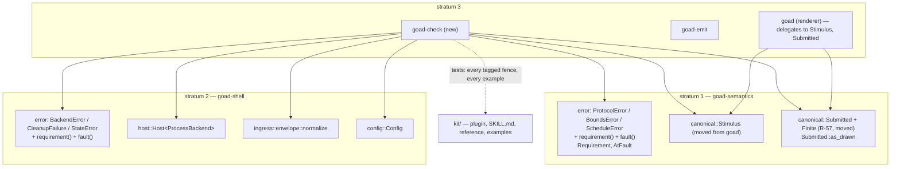

# Design — Slice 012: the backend author's kit

<!-- The *current* design, not its history. Revision chronology, review
     findings, and dispositions live in `design-log.md`.
     Reference forms: canon by id (`SPEC-003 §4`, `ADR-007`, `POL-002`);
     doc-local refs bare — OQ-1 (§6), D1 (§7), R1 (§8). Ids are immutable. -->

**Status:** draft, for section-by-section presentation. Every decision cites
its `design-log.md` entry by date and question id. Where the design
conversation did not settle at drafting is in §6 with its options; all of it
is now settled (`design-log.md`, 2026-09-29). Design review round 1's
dispositions are applied (`design-log.md`, 2026-09-30, *design review round 1:
dispositions*; cited below as U1..U8, with the finding ids of
`review-design.md`), and so are round 2's (*design review round 2:
dispositions*; cited by finding id). Round 2's F-22 is open.

## 1. Design problem

A goad backend is written against SPEC-001..003. Today the only way to learn
that contract is to read this repository. The next backend author is a coding
agent working in someone else's repository, and nothing is packaged for it.

This slice builds four things:

1. **A checker**, `goad-check`. It is a headless binary that drives a backend
   command through the host's own `Host`. It reports each refusal — each
   failure, discarded instruction and cleanup failure the host reports
   (SPEC-001/R-59) — with the side at fault and the SPEC-001 requirement R-59
   assigns its kind, and exits with a status SPEC-004 governs.
2. **The data the checker reports.** Each error taxonomy gets `requirement()`
   and `fault()`, in the stratum that owns it. The checker only prints what
   the host already knows.
3. **A kit**, `kit/`. It is a plugin for Claude Code and Codex over one skill,
   containing a backend-facing reference, three new examples, and the
   examples' event files and watchers. Every JSON or TOML example the reference
   ships is checked by the gate.
4. **A walk.** A fresh agent in an oubliette capsule sees only the kit and the
   exported binaries, and writes a backend from one fixed prompt. The walk is
   measured, and its friction is dispositioned.

**Boundary.** The wire contract does not move (slice §Non-goals). The kit
documents the process transport only. The current `examples/` stay as host
exercisers under a new name.

## 2. Current state

Cited from `research.md`. Rows marked ✓ there, or re-verified for this draft,
are the only ones this design relies on.

- **No refusal carries a requirement id or a side at fault** (R-a). Both exist
  only as prose in doc comments. Requirement ids appear in code only in the
  fixture envelopes' `requirement` arrays. Verified again for this draft
  against `goad_semantics::error` and `goad_shell::error`, and by tabulating
  every error fixture with `jq`. The tabulation is the basis of §5.2.3.
- **`Host<B: Backend>` is the whole headless exchange** (R-b): transport,
  `read_response`, schedule resolution, and interaction state. Its `Outcome`
  has three reporting channels: `failure: Option<Failure>` (`Backend` or
  `State`), `discarded: Vec<Discarded>`, and `cleanup:
  Option<CleanupFailure>`. It needs a tokio runtime and has no renderer
  dependency.
- **Two encodings the checker needs are in `goad`**, which links Slint:
  - the host kind names: `wire.rs::Stimulus`, with `kind` and `event`;
  - R-57's value mapping, `draft.rs::submitted`, which is `pub(crate)`,
    together with its `Finite` leaf and the untouched-value policy
    `view_model::as_drawn` (R-b; re-verified).
- **No request reader exists.** Requests are outbound only (R-c, R-g).
  `OptionId::new` and `FieldId::new` are `pub(super)`, so a test cannot mint a
  response's ids from strings. `ViewId::new` is `pub`.
- **Forwarded events enter through `goad_shell::ingress::envelope::normalize`**
  in stratum 2 (ADR-005). Its rejections are `EnvelopeFault`, which is SPEC-003's
  taxonomy.
- **Configuration.** `Config::load` / `Config::parse` require
  `backend.timeout` and `schedule.default_poll` and have no defaults.
  `config::default_path` is the host's discovery rule. `ConfigError` is a
  separate type about the user's file, not about a backend.
- **`goad-emit`'s statuses** are 0 (the host accepted), 1 (the host refused
  and said why), and 2 (no usable answer). SPEC-004 owns them but does not
  govern them (§2, OQ-2).
- **The exercisers**: `examples/shell/backend.sh` and
  `examples/typescript/backend.ts`. They are run by `just demo`, `harness.rs`
  and `round_trip.rs`, and the gate typechecks the second. Research R-f lists
  every referencing site.
- **The jail library** (`pub` flake, `jailed-agents.nix`) was the walk's
  first venue. `persist-home` is fixed per *profile*, with no per-invocation
  home parameter. The walk now runs in an oubliette capsule (§5.2.8), and
  nothing in this design depends on the library.
- **Oubliette** (`~/dev/oubliette`): firecracker microVM capsules, each
  holding a clone of one target repository and its exported tool set, a
  fresh volume for `$HOME`, credentials pushed from the host, and egress
  through an allowlisting proxy. The user drives doctrine slices this way.

## 3. Forces & constraints

- **ADR-001 / ADR-003.** Stratum 1 is pure. The checker is an entry point, so
  it goes in stratum 3 as its own member, like `goad-emit`. The vocabulary
  scan reads the checker's `src/`. `kit/` is outside `crates/` and is not
  scanned.
- **SPEC-001 §7, R-57 row: "a mapping stated in two places is a mapping that
  can drift."** This binds the checker's own `respond`, whose values must obey
  R-57/R-58. Otherwise the checker blames a backend that rightly refused a
  mistyped value.
- **P-B (SPEC-001).** The checker judges ambiguity no differently from the
  host, because the host's code does the judging.
- **SPEC-004 §3 P-A..P-D bind every binary**, governed or not: a status names
  a class; a non-zero status comes with a line on stderr; the numbers are a
  contract; a status gives no advice.
- **POL-001.** The gate is a fixed command block. No new command is added
  (`design-log.md` 2026-09-27, OQ-9). Only the `deno check` paths change.
- **Side effects are real** (SPEC-001/R-49). The checker spawns the author's
  command with the inherited environment.
- **CLAUDE.md: name, never count; cite by symbol.** This applies to the kit's
  prose as well as to canon.
- **The walk sees only what a consumer sees** (`design-log.md` 2026-09-26,
  OQ-3 isolation).

## 4. Guiding principles

1. **The checker adds choice and reporting, nothing else.** Every judgement is
   the host's code: normalizer, taxonomy, interaction identity, R-57 values.
   If the checker has to decide what something *means*, that meaning belongs
   in stratum 1 or 2, or it is a second encoding.
2. **One encoding, one witness.** Each fact (requirement id, side, kind name,
   R-57 type) is stated in exactly one place. A second, independent artefact
   witnesses it: the fixture corpus, or the reference's tagged examples.
3. **The kit is checked the way it is read.** What the reference shows as
   accepted, refused or sent, the gate runs through the same door.

## 5. Proposed design

### 5.1 System model



**Who owns what.**

| thing | owner | notes |
|---|---|---|
| requirement id and side, per variant | the taxonomy's own stratum | `goad-check` prints them and never maps them |
| which requests are sent, and the report | `goad-check` | report format is not canon (`design-log.md` 2026-09-26, OQ-2) |
| host kind names | stratum 1, `Stimulus` | `goad` and `goad-check` both name it |
| R-57's value per kind | stratum 1, `Submitted` | `goad` and `goad-check` both build one |
| all kit checks | `goad-check`'s test target | under `cargo test --workspace` (`design-log.md` 2026-09-27, OQ-9) |

### 5.2 Interfaces & contracts

#### 5.2.1 `goad-check` — command line

(`design-log.md` 2026-09-26, OQ-5, which settled the crate, the config-file
form and `-- <argv>`; 2026-09-26, OQ-4, which settled the request set and
author-supplied events.)

```
goad-check [--config PATH] [--event FILE]...
goad-check [--timeout SPAN] [--event FILE]... -- PROGRAM [ARG]...
goad-check -h | --help
goad-check --version
```

- **Config form.** `--config PATH` loads the author's goad configuration with
  `Config::load`. With neither `--config` nor `--`, the path is
  `config::default_path`, the host's own rule. The checker runs exactly the
  command and timeout the host will run, and spawns it as the host does:
  neither resolves anything relative to the config file, so a relative
  program or argument is resolved against the directory the process was
  started in (F-36). A relative `command` the checker accepts from one
  directory is therefore one a host started elsewhere cannot spawn;
  `checking.md` says so. It ignores `[ingress]`: it opens no socket.
- **Argv form.** Everything after `--` is the command, built with
  `config::Command::from_argv`, made public for this (F-33). So an empty argv,
  or an empty program, is refused by the same rule the host applies at load
  (R-36): a usage error, status 2. `Command::new` accepts any program and is
  not used.
  - *Opportunity, for the plan:* `config::Command`'s doc says the empty
    command "is not representable past this boundary". Two public routes
    contradict it: `Command::new`, whose callers are tests and `from_argv`,
    and the public `program` and `arguments` fields, which a struct literal
    fills directly (F-40). The doc is true only once both are closed.
  - `--timeout SPAN` is judged by the host's own rule for a usable
    timeout: `config.rs`' private `unsigned`, made public as
    `config::positive_duration` for this (`design-log.md` 2026-10-01, G2). It
    parses with `schedule::parse_span`, refuses zero and negative spans, which
    `parse_span` alone accepts, and converts to `std::time::Duration`. Called
    with the key `"--timeout"`, its `ConfigError::Duration` or `NonPositive`
    is a usage error, status 2. The default is `5s`, the value
    `exercisers/demo.toml` uses.
  - `schedule.default_poll` is the fixed value `30m`. It only affects how the
    report shows a resolved next check when none was sent.
  - `--timeout` is accepted only in the argv form. With `--config`, or with
    neither `--config` nor `--`, it is a usage error, status 2: a file
    supplies the timeout, whether named or defaulted (`design-log.md`
    2026-10-01, *`goad-check`'s flag exclusions, stated whole*).
- **`--config` and `--` exclude each other.** Together they name two
  configuration sources, and an ambiguous request fails rather than being
  guessed at: a usage error, status 2 (the same entry).
- **`--event FILE`**, repeatable, in order. Each file holds one SPEC-003
  envelope, the bytes a watcher would write to the socket. Each is read
  through `envelope::normalize`, so a `source: "host"` envelope is refused
  there (SPEC-003/R-13). The checker never guesses a forwarded event
  (`design-log.md` 2026-09-26, OQ-4).
- Arguments are parsed in the pure style of `goad-emit`'s `args.rs`: one
  `Invocation` value; `main` alone reads the environment, files and the
  clock.

#### 5.2.2 `goad-check` — run sequence

```mermaid
sequenceDiagram
  participant C as goad-check
  participant H as Host (goad-shell)
  participant B as backend process
  C->>C: parse args, load Config, normalize each --event file
  Note over C: any failure here → status 2, no verdict
  loop for each request in the plan
    C->>H: evaluate(now, event)
    H->>B: spawn, write request, read response
    H-->>C: Outcome {view, discarded, failure, cleanup, stderr}
    C->>C: report the exchange
    opt Outcome carries a view
      C->>C: choose the first option; values = Submitted::as_drawn per field
      C->>H: respond(now, view_id, UserResponse)
      H->>B: spawn, write respond, read response
      H-->>C: Outcome — report; answer again while a view comes back, bounded
    end
  end
  C->>C: write the report's last line → a verdict, status 0 or 1
  Note over C: a clock, a report write or Failure::State failing anywhere → status 2, no verdict
```

**The request plan**, in order (`design-log.md` 2026-09-26, OQ-4):

1. `evaluate`, `Stimulus::Startup`
2. `evaluate`, `Stimulus::Requested`
3. `evaluate`, `Stimulus::Scheduled`
4. `evaluate`, `source: "host"`, kind `goad-check-unrecognised`: the R-56
   probe. R-56 allows a host to originate a kind outside the three, and
   requires a backend to tolerate it. The probe kind is a `goad-check`
   constant. A test asserts it is none of `Stimulus`'s kinds.
5. `evaluate` with each `--event` envelope, in the order given.

`event.timestamp` and `now` are the wall clock (`clock::wall_clock`) at each
step, and `data` is `null`, as `Stimulus::event` builds it. There is no
`--now` (U3, F-7): a backend that speaks only at some hours is checked at an
hour it speaks, and the report says when no exchange returned a view. A clock
that cannot be read at any step ends the run with no verdict (§5.2.5).

**Answering.**
- After any `Outcome` that carries a view, the checker answers it through
  `Host::respond`, using the minted `view_id`. The host therefore enforces
  interaction identity (R-32) itself.
- The answer is **one option**, the first, through the total `Options::first`
  (§5.2.4), with a value for exactly that option's fields (R-58), each built
  as `Submitted` (R-57).
- A backend may chain views: a respond that returns a new view. The checker
  keeps answering until a respond returns `view: null` or a failure, up to a
  **chain bound of 8** per request. Hitting the bound is reported as a
  checker observation, not as a protocol refusal, and does not change the
  status (U2).

**What is judged.** Every channel of every `Outcome`. What the host reports
on the failure, discarded and cleanup channels is a **refusal** in
SPEC-001/R-59's sense, and names what R-59 assigns its kind:

| channel | what the checker reports | requirement and side from |
|---|---|---|
| `failure: Failure::Backend(e)` | a failure | `e.requirement()`, `e.fault()`; for `Protocol(p)` this delegates to `p` |
| `failure: Failure::State(e)` | the checker's own defect: it cannot arise unless the checker named a `view_id` wrongly. The run ends with no verdict, status 2, and the line says so (U2). | `e.requirement()`, `e.fault()`, shown in the line |
| `discarded: Discarded::Schedule{reason, ..}` | a discarded instruction | `reason.requirement()`, `reason.fault()` |
| `cleanup: Some(c)` | a cleanup failure | `c.requirement()`, `c.fault()` |
| a failure on the R-56 probe's `evaluate` | the failure as above. **Only** when its `fault()` is backend **and** at least one of the three known-kind `evaluate`s made no failure, the report adds "SPEC-001/R-56: a backend MUST tolerate a kind it does not recognise", side backend (F-3). The condition counts `evaluate` outcomes only, the probe's and the three known kinds': a `respond` chained from any of them is judged as any other exchange, and neither makes nor clears the condition (`design-log.md` 2026-10-01, *`Options::first`; R-56's condition counts `evaluate` outcomes*). A backend that fails alike on every kind, or a failure on another side, is not charged with R-56. | the probe, its condition and the claim's text are the checker's; the claim's id is `Requirement::R56`, from stratum 1 (§5.2.3), printed through `Requirement`'s `Display` like every other line's; the failure is the host's |
| `stderr` | shown verbatim under the exchange, truncation flagged | — |

#### 5.2.3 `requirement()` and `fault()`

(`design-log.md` 2026-09-26, OQ-8.) In `goad_semantics::error`:

```rust
/// A SPEC-001 requirement id. Displays as `R-44`; a report prefixes the spec.
/// Built only from its associated constants (below).
#[derive(Debug, Clone, Copy, PartialEq, Eq)]
pub struct Requirement(u16);

impl Requirement {
  pub const R44: Requirement = Requirement(44);
  // … one per id, listed below
}

/// The side a refusal's cause lies on (SPEC-001/R-59). Displays as the word a
/// report prints: `backend`, `host`, `configuration`, `environment`.
#[derive(Debug, Clone, Copy, PartialEq, Eq)]
pub enum AtFault { Backend, Host, Configuration, Environment }
```

**The ids are named constants** (`design-log.md` 2026-10-01, *`Requirement`
is built from named constants*). `Requirement`'s field stays private and it
has no constructor: no crate mints an id. Stratum 1 declares one associated
constant per id, `Requirement::R44` for R-44, beside the type:

- one for each id a row of the table below answers: `R3`, `R10`, `R12`,
  `R13`, `R14`, `R16`, `R17`, `R18`, `R21`, `R22`, `R23`, `R25`, `R32`,
  `R40`, `R41`, `R43`, `R44`, `R45`, `R48`, `R50`, `R52`, `R53`;
- and `R56`, for the checker's R-56 claim (§5.2.2), which is its only use.

The `requirement()` arms of both strata name these constants, and so does the
checker's claim. What holds the list, and what does not:

- **A constant a row needs and the list lacks** fails to compile at the arm
  that names it.
- **A constant's value** is held by the tables of §9 *Stratum 1* and
  *Stratum 2* (`plan.md` PHASE-01/VT-1, VT-2). Each writes its expected id
  as this table spells it, `"R-44"`, and compares `Requirement`'s `Display`
  with it, so `R44` holding 45 reds them. `R56`'s value is held by the binary
  case that asserts the report's `SPEC-001/R-56` (§9,
  `a_backend_that_fails_on_an_unrecognised_host_kind_is_reported_against_r56`).
- **A surplus constant** — one no row answers and the claim does not use — is
  held by nothing: a `pub` item is never dead code. Review of the list
  against the table holds it (`plan.md` PHASE-01/VA-1).

Both types print themselves through `Display`, and `AtFault`'s is a total
`match` with no `_` arm (`design-log.md` 2026-10-01, *plan review round 1:
design-touching dispositions*). So the checker prints a side and never maps
one: a second spelling of the side names in `goad-check` would be the
mapping §5.1 forbids, and I-1 holds it out.

Each taxonomy enum gets `pub fn requirement(&self) -> Requirement` and `pub fn
fault(&self) -> AtFault`, each a total `match` with no `_` arm. So a new
variant fails to compile until both are decided.

The type is named `AtFault` and not `Fault`. In this workspace `…Fault` names a
*reason*: `SpanFault`, `SendFault`, `StartupFault`, `EnvelopeFault`. Here the
method `fault()` answers *who*.

**Meaning of the id** (U1; F-1, F-4, F-6; round 2: F-34, F-35, F-39; round
3: the reframe, `design-log.md` 2026-09-30, *R-59 reframed; PipeMissing;
F-22; round 2's unbriefed repairs*). R-59 fixes what each refusal names by
its kind, never by the instance. Most of SPEC-001's transport and failure
rows are host obligations a backend cannot break (R-40, R-41, R-43, R-44), so
the id is never read as "the rule broken". It is one of three:

- **(i) the requirement stating the rule the kind enforces** — the default,
  and most rows.
- **(ii) R-44**, where the kind cannot tell which more specific rule an
  instance broke (`Json`, `Shape`, `DuplicateKey`), or where R-44's list is
  the only requirement that names the refusal (`Spawn`, and `DuplicateKey`
  again).
- **(iii) R-45**, for a failure of an exchange that no requirement names
  (`Io`, `PipeMissing`): R-45 governs what the host does with it — reports
  it and stays able to invoke the backend again. R-45 is reworded to cover
  such a failure whichever side caused it (`canon-delta.md` SPEC-001 Change
  7); by its current letter, "backend failure", it covers neither.

The rest of R-59:

- **Scope is closed, by channel.** What the host reports on the channels of
  an exchange or of an answer — a failure, a discarded instruction, a cleanup
  failure, a refused answer — and nothing else. R-59 names these once as a
  **refusal**, and where this design speaks of what R-59 governs it uses the
  word in that sense.
- **Sides** are where the cause lies: **backend**, in what the backend sent or
  did; **configuration**, in the user's configuration, which named something
  the host could not use; **host**, on the host's side of the seam — its own
  code, or whoever answered through it; **environment**, in the operating
  system, which failed the host.
- **One kind, one side, one id.** A kind whose cause can lie on another side
  keeps its one side — the declared imprecision — and its refusal carries what
  lets a reader see the other: `Timeout` its configured window, `ExitStatus {
  code: None }` that the backend was signalled, `Spawn` the operating
  system's error, `CleanupFailure::TimedOut` the limit disposal was given.
  The one exception to one id per kind is R-53's (below).

**The table.** Variants are verified against the enums at 7388b5c. The
fixture column lists each error fixture's `requirement` array as it stands.

| taxonomy | variant | id | side | fixture witness (current lists) |
|---|---|---|---|---|
| `ProtocolError` | `Json` | R-44 | backend | `protocol-text/R-17-a-nan-literal-for-a-bound` [R-17], `R-17-an-infinite-literal-for-a-bound` [R-17]. **Corrected to [R-17, R-44]**: see below |
| | `Shape` | R-44 | backend | every `Shape` fixture already lists R-44 |
| | `DuplicateKey` | R-44 | backend | [R-44], [R-52, R-44] |
| | `NestedHints` | R-18 | backend | [R-18, R-47] |
| | `UnsupportedProtocolVersion` | R-3 | backend | [R-3] |
| | `UnsupportedPrimitive` | R-12 | backend | each lists R-12 |
| | `InapplicableKey` | R-53 when `key` is `"fields"`, otherwise R-50 | backend | R-50 ×3 [R-50]; `R-53-an-alternative-carrying-fields` [R-53] |
| | `MissingField` | R-10 | backend | [R-10] |
| | `EmptyOptions` | R-13 | backend | [R-13] ×2 |
| | `DuplicateOptionId` | R-14 | backend | [R-14, R-52] |
| | `DuplicateFieldId` | R-52 | backend | [R-52] |
| | `DuplicateAlternativeId` | R-52 | backend | [R-52, R-53] |
| | `EmptyAlternatives` | R-16 | backend | [R-52, R-53]. **Corrected to [R-52, R-53, R-16]**: see below; OQ-6 |
| | `Bounds(b)` | `b.requirement()` | `b.fault()` | — |
| | `Schedule(s)` | `s.requirement()` | `s.fault()` | never an `Err`; witnessed through `Discarded` |
| `BoundsError` | `NotFinite` | R-17 | backend | unreachable from JSON (its own doc) |
| | `Inverted` | R-17 | backend | `R-17-inverted-bounds` [R-17] |
| `ScheduleError` | `NotAString` | R-25 | backend | `schedule/R-25-not-a-string` [R-21, R-25]; `protocol/R-25-next-check-of-the-wrong-type` [R-25, R-51] |
| | `MissingOffset` | R-22 | backend | [R-22, R-25] ×2 |
| | `TimeOfDay` | R-21 | backend | [R-21, R-25] ×5 |
| | `CalendarUnit` | R-23 | backend | [R-23, R-25] ×2 |
| | `OutOfRange` | R-25 | backend | [R-25] |
| | `Unparseable` | R-25 | backend | [R-25] ×4 |
| `BackendError` | `Spawn` | R-44 | configuration | not fixtured (transport) |
| | `Timeout` | R-41 | backend | — |
| | `ExitStatus` | R-40 | backend | — |
| | `OutputTooLarge` | R-43 | backend | — |
| | `PipeMissing` | R-45 *(OQ-1)* | host | — |
| | `Io` | R-45 *(OQ-1)* | environment | — |
| | `Protocol(p)` | `p.requirement()` | `p.fault()` | — |
| `CleanupFailure` | `TimedOut` | R-48 | backend | — |
| | `Io` | R-48 | environment | — |
| `StateError` | `NoOutstandingView` | R-32 | host | — |
| | `StaleViewId` | R-32 | host | — |

Rationale for the rows that are not obvious:

- **`Json` → R-44**, clause (ii). R-44 names *malformed JSON*, "bytes that
  are not one JSON document", as its own class. The kind cannot tell which
  more specific rule an instance broke (F-35): R-38's empty stdout and
  trailing content, and R-17's non-finite literals, all arrive as `Json`
  through `From<serde_json::Error>`, beside every other malformed document.
- **`Shape` → R-44**, clause (ii), for the same reason. serde's category is coarse by
  construction (`research.md` R-a): a `Shape` fixture may pair R-44 with R-3,
  R-11, R-13, R-15, R-19 or R-52, and the kind cannot say which.
  - **The two R-17 `Json` fixtures' lists become [R-17, R-44].** R-17 stays
    because those fixtures do verify R-17: a non-finite bound cannot even be
    written as JSON.
- **`DuplicateKey` → R-44**, clause (ii) on both halves. No requirement
  but R-44's list names a key repeated within one object; where the key is
  an id, R-52's rule is broken too
  (`protocol-text/R-52-a-duplicate-key-inside-an-option`), and the kind cannot
  tell.
- **`EmptyAlternatives` → R-16** (F-38, reversing U8). R-16 gains "at least
  one" in this slice's canon delta (SPEC-001 Change 6), so it states the rule
  the kind enforces, clause (i); R-52 is about uniqueness, and R-44's shape items do
  not include an empty array. `R-52-a-choice-field-with-no-alternatives`' list
  becomes [R-52, R-53, R-16]; R-52 and R-53 stay, as the fixture's own
  claims. Nothing else in the corpus changes.
- **`InapplicableKey` splits on `key`.** R-53 *requires* `fields` on an
  alternative to be refused "with the same error as any other protocol key
  used where its position gives it no meaning". So a separate variant would
  break R-53, and one variant must answer two ids.
  - `normalize_alternative` is the only site that raises it with `fields`
    (verified: `inapplicable("fields", "choice", …)` is the only `fields`
    call).
  - The witness test holds the split.
- **`Spawn` → R-44, configuration** (U1), clause (ii): R-44's list ("command
  not spawnable") is the only requirement that names it. No rule says a
  command must be spawnable: R-36 governs how a command is formed, and a
  non-empty argv naming a missing program breaks no clause of it. The
  reference's R-44 entry points to R-36 for how a command is formed (no shell
  interposed). The side
  was decided as configuration (`design-log.md` 2026-09-26, OQ-8); a spawn
  refused for want of resources is the declared imprecision, visible in the
  operating system's error the refusal carries.
- **`Timeout` → backend.** R-41 states the rule the kind enforces. A timeout
  set too short is a configuration fault, and a loaded machine an
  environment one, but the host cannot tell either from a slow backend. That
  is R-59's declared imprecision: the kind keeps backend, and the report
  prints the configured timeout, so an author can see the alternative. The
  same holds of `ExitStatus { code: None }`, whose line says the backend was
  signalled.
- **`MissingField` → R-10.** `view` is its only raise site. If another site
  appears, it will need a fixture, and the witness will then catch a wrong id.
- **`StateError` → host** (F-2). Only the caller of `Host::respond` names a
  `view_id`, and that caller is on the host's side of the seam: the host's own
  renderer (a person's delayed click on a view R-33 has replaced) or the
  checker. The host side means the cause lies there, not that host code is
  defective. A backend cannot cause one.
- **`CleanupFailure::TimedOut` → R-48, backend** (F-34). R-48 states the rule
  the kind enforces: a bounded wait to observe disposal. The backend was not
  seen reaped with its stderr drained within the cleanup limit. The usual
  cause is the backend's own process tree — a child left holding a pipe — so
  the side is backend. Naming the side a cause usually lies on asserts no
  process state, so R-54 is not engaged; the line still names none. A
  loaded machine that did not finish disposal in time is R-59's declared
  imprecision, and the line carries the limit disposal was given.
- **`CleanupFailure::Io` → R-48, environment** (confirmed at round 3; F-43),
  clause (i). R-48 obliges every returning path to initiate termination of
  the backend and to wait to observe it reaped. `CleanupFailure::Io` is
  `start_kill` or `wait` failing outright: that obligation failing through
  the operating system, which is the environment side's whole definition.
  It is not R-48's "failure to observe cleanup within that interval": that
  clause is a bound elapsing, which is `TimedOut`.
- **`PipeMissing` → R-45, host** (F-39; round 3), clause (iii). The host asked
  for all three pipes, so only a host defect removes one. No requirement names
  the failure: R-37 governs the request the stdin pipe carries, not the
  presence of the pipe, and the variant is raised for any of the three
  handles. Round 2's R-37 was reversed at round 3.
- **`Io` → R-45, environment** (U1; F-5), clause (iii). No requirement names
  it. No transport id is claimed, since `Io` merges write, wait and read
  failures, each an operating-system call that failed.
- **`ConfigError`, `EnvelopeFault` and `SpanFault` get neither method.** What
  the host reports when it rejects the configuration file at load, or a
  forwarded envelope, is on no channel of an exchange, and R-59 puts it
  outside its scope in terms (F-6). In the checker they end the run
  with no verdict (§5.4, status 2), and their `Display` is the line.
  `EnvelopeFault` ids belong to SPEC-003, which is out of this slice
  (`notes.md` §Open candidate).

**The witness** (principle 2) is one test over both protocol corpora, in
`goad-semantics`' `tests/protocol/normalize.rs`, beside
`every_reachable_error_in_the_taxonomy_is_named_by_a_fixture`: *every error
fixture's produced error names a requirement in that fixture's own list*. A
companion does the same over the schedule corpus and the `Discarded`
fixtures: *every discard fixture's reason names a requirement in its list*.

**Its reach** (U7; F-23). It catches an answer outside the fixture's own list,
and nothing else. It does not catch a flip to another id the same list holds:
every schedule error fixture lists R-25, `R-14-duplicate-option-ids` lists
[R-14, R-52], and `R-52-a-choice-field-with-no-alternatives` lists R-52 and
R-53. The stratum-2 arms have no fixture at all. Review of the table holds
both. It is kept rather than made exact because the lists predate this slice:
an exact key per fixture would be written with the code it witnesses, and the
witness would stop being independent.

Today the witness fails on the two R-17 `Json` fixtures and on
`R-52-a-choice-field-with-no-alternatives`. That failure is the red step, and
the list corrections are the green one; they are the only lists edited to
agree with the code.

#### 5.2.4 Stratum-1 lifts, and how `goad` delegates

(`design-log.md` 2026-09-26, OQ-4.)

- **`Stimulus` moves** from `crates/goad/src/wire.rs` to
  `goad_semantics::protocol::canonical`, beside `Event`, with its `kind` and
  `event` methods unchanged. `goad` imports it from there, because clippy
  denies `pub_use`, so there is no re-export.
  - Its unit tests move with it (`a_scheduled_stimulus_names_itself_scheduled`,
    `a_scheduled_stimulus_s_event_carries_the_three_normative_fields`).
  - One `Stimulus::kind` remains "the one place the host names a kind", and
    SPEC-001 §7's R-56 row is re-pointed (canon-delta).
  - Moving the type rather than wrapping it keeps a single type. "Delegate" in
    `slice-012.md` is met by `goad` having no kind strings of its own.
- **`Submitted` and `Finite` move** to stratum 1:
  - `Submitted` is one variant per `FieldKind`: `Boolean(bool)`,
    `Text(String)`, `Number(Finite)`, `Choice(AlternativeId)`, and
    `DateTime { instant: Timestamp, offset: Offset }`.
  - `Submitted::to_json(&self) -> serde_json::Value` is the single R-57 site.
    It is today's `draft::submitted` body.
  - `Finite` moves unchanged, together with its doc on why it has no `Eq`.
  - In `goad`, `Edited` keeps its widget state (`Adjusted.text`) and gains
    `Edited::submitted(&self) -> Submitted`, a projection that decides no
    type. `draft::submitted` becomes `edited.submitted().to_json()`.
  - `draft.rs::tests::a_boolean_field_submits_a_json_boolean` and its siblings
    move to stratum 1 against `Submitted`. `goad` keeps one test that the
    projection is the identity on each variant.
- **`Submitted::as_drawn(&FieldKind) -> Submitted`**. This is
  what a field nobody touched submits: `false`, `""`, the minimum or `0`, the
  first alternative, and the epoch at `+00:00`. It is today's
  `view_model::as_drawn`.
  - `goad` delegates to it (`design-log.md` 2026-10-01, G1).
    `view_model::as_drawn` keeps its signature, `&DrawnKind -> Edited`,
    because `glass` draws the `Edited` it returns through
    `view_model::untouched`. It rebuilds the `FieldKind` from the `DrawnKind`,
    which carries the range and the alternatives, calls
    `Submitted::as_drawn`, and converts the result back through a private
    `as_edited(Submitted) -> Edited` in `view_model.rs`, beside `adjusted`
    (`design-log.md` 2026-10-01, *plan review round 1: design-touching
    dispositions*, superseding G1's placement in `draft.rs`). It spells a
    number through `adjusted`, and decides no value, so the untouched policy
    stays stated once, and `adjusted`'s doc — every site that produces an
    `Adjusted` without a person having typed comes through it — stays true.
    It is not a crate-wide `From` impl: `draft.rs` does not import
    `view_model`, and `as_drawn` is its only caller.
  - `view_model.rs`' tests hold the round trip `Submitted` → `Edited` →
    `Submitted`, beside `as_edited`, since it is private there:
    `as_edited_projects_back_to_the_submitted_it_was_given_on_each_kind`. The
    other direction is not an identity: a typed spelling such as `2.50` is
    not kept.
  - The `choice` arm is `alternatives.first().id().clone()`, over the total
    `Alternatives::first` that already exists in `canonical.rs` (F-25);
    `view_model::drawn_form` already calls it. Nothing new is built for it.
    `DrawnKind::Choice.first` then has no job left, and its removal is a
    refactor-step candidate; its doc, which says `.first()` is an `Option`,
    is already stale.
- **`Options::first(&self) -> &Opt`**, in stratum 1, beside `Options::new`:
  the first option, which always exists, since `Options::new` refuses the
  empty list (`EmptyOptions`). It mirrors `Alternatives::first`, its doc's
  argument and its `expect`, so the checker's answer (§5.2.2) re-derives
  no non-emptiness and writes no arm that nothing can reach (`design-log.md`
  2026-10-01, *`Options::first`; R-56's condition counts `evaluate`
  outcomes*). Its caller is `goad-check`'s answer. Held by a unit test in
  `canonical.rs`, `the_first_option_is_the_one_listed_first`, over two
  options.
- **`NumberRange::drawn(&self) -> Finite`**, in stratum 1, beside
  `NumberRange::min`. This is the number an untouched `number` field is drawn
  showing: its declared minimum, or zero where none was declared. It is the
  one statement of that rule (`design-log.md` 2026-10-01, *the drawn number
  has one home: `NumberRange::drawn`*).
  - It has two callers: `Submitted::as_drawn`'s number arm, and
    `view_model::interpret`'s fallback for a text that does not parse on a
    field nobody has touched. `view_model::drawn_number` is deleted.
  - Its doc moves with the rule from `drawn_number`: a range carrying only a
    `max` is legal, so `max: -10` and no `min` is drawn showing, and submits,
    `0` (§5.5). That is not a defect — R-35 puts acceptability in the
    backend, and R-58 requires a value for every drawn field — and it is why
    slice 007's `canon-delta.md` CD-1 (the JSON type of a submitted field
    value) states it.
  - Held by a unit test in `canonical.rs`,
    `an_untouched_number_is_drawn_at_its_minimum_or_zero`, over a declared
    minimum, no bounds, and `max: -10` with no `min`; and, through
    `interpret`, by `view_model.rs`'
    `an_untouched_numeric_field_falls_back_to_what_it_was_drawn_showing`,
    unchanged.
- **Opportunity, not required:** the reserved source `"host"` is spelled in
  `Stimulus::event` and again in `envelope.rs`'s `ReservedSource` check. A
  `pub const HOST_SOURCE` beside `Stimulus` would make it one encoding. It is
  flagged for the plan, because it costs one line and touches a file this
  slice already edits.

#### 5.2.5 The report and exit status

The report goes to **stdout**, because it is the answer to the invocation. It
is written through `report::try_line_to`, never the best-effort `line_to`,
since a line that is the answer must fail when it is not written. Its format
is free. What canon fixes is that **every refusal line names the side at fault
and the requirement** (SPEC-004/R-12; F-16), and what each refusal names
(SPEC-001/R-59). For example:

```
evaluate startup ............ view: "Still on: writing?" (3 options)
  respond continue .......... view: null · next check 2026-09-27T10:40:00+10:00
evaluate goad-check-unrecognised
  REFUSED  backend  SPEC-001/R-40  backend exited with status 1 (body discarded)
           backend  SPEC-001/R-56  a backend MUST tolerate a kind it does not recognise
  stderr:  KeyError: 'goad-check-unrecognised'
verdict: 1 exchange refused
```

When no exchange returned a view, the report's last line before the verdict
says so, and that respond was not exercised (U3; F-7). A backend that is
silent at the hour it is checked is accepted, and the report is what shows it
was not seen to ask anything.

**Exit status** (canon-delta, SPEC-004 R-11..R-13; U2, F-8, F-9). The cut is
whether a **verdict** was delivered: every exchange the plan calls for made
(answering views up to the chain bound) and the whole report written. It is
still a phase in SPEC-004 §5's sense — how far the process got — not a cause:

| status | class | when |
|---|---|---|
| 0 | **accepted** | a verdict was delivered, and the host reported nothing on any channel. Also `--help` and `--version`, answered. |
| 1 | **refused** | a verdict was delivered, and the host reported at least one refusal — a failure, a discarded instruction or a cleanup failure — whichever side. This includes `Spawn` and the R-56 probe. |
| 2 | **not judged** | no verdict was delivered, whatever the cause and whenever it arose: a usage error, a configuration it cannot find or parse, an event file it cannot read or that `envelope::normalize` refuses, a clock unreadable before or during the run, no runtime, a report or an answer stdout refused, or `Failure::State`, the checker's own defect. |

- A cleanup-only report counts as 1.
- Hitting the chain bound is a report observation and does not change the
  status.
- Every cause of status 2 reaches `main`'s one `ExitCode::from(2)`, which
  reads no cause (SPEC-004/R-13's row holds *whatever its cause* by this).
- Status 2 always has a `goad-check: …` line on stderr (SPEC-004 P-B), last.
  Status 1 ends with a one-line `goad-check: …` summary on stderr, last.

**`goad-emit`'s unwritten answer** (U6; F-10). `goad-emit`'s `--help` and
`--version` today write through the best-effort `line_to` and exit 0 whatever
happened. They move to `report::try_line_to`; an answer not written exits 2
with a `goad-emit: …` line on stderr, as the host does for
`StartupError::AnswerUnwritten`. That makes SPEC-004/R-8's *only if* true of
`goad-emit`, and keeps one rule for the edge across all three binaries.

#### 5.2.6 The kit tree

(`design-log.md` 2026-09-27, OQ-6.)

```
.claude-plugin/marketplace.json        name "goad"; plugins [{name "goad", source "./kit"}]
.agents/plugins/marketplace.json       Codex marketplace; source {source "local", path "./kit"}
kit/
  .claude-plugin/plugin.json           name, description, version, author, license
  .codex-plugin/plugin.json            the same, plus "skills": "./skills/" and an interface block
  skills/goad-backend/
    SKILL.md
    reference/
      protocol.md       requests, responses, views, fields, content, R-57 values, interaction identity
      scheduling.md     next_check forms and how the host resolves them (SPEC-001 R-21..R-29, SPEC-002)
      events.md         forwarded events: the envelope, goad-emit, the socket, the reserved source (SPEC-003)
      running.md        the process transport, the goad config file, stdout/stderr, timeout, exit
      checking.md       goad-check: forms, what it sends, reading its report, sides, statuses
    examples/
      focus-check/        backend.py, config.toml, README.md
      downloads-triage/   backend.sh, watch.sh, config.toml, events/file-arrived.json, README.md
      breadcrumbs/        backend.ts, chpwd.zsh, config.toml, events/changed-directory.json, README.md
```

The plugin is the `kit/` subdirectory, so a consumer's plugin cache never
receives the repository (research R-d). The versions in both manifests are
`workspace.package.version`. A phase exit check (not a gate step) confirms
they match, and runs `claude plugin validate kit/`.

**SKILL.md's job.** SKILL.md is the entry point. It is short, and it
routes rather than teaches:

- when to use the skill (writing or fixing a goad backend);
- the loop: write → `goad-check` → fix → write the config → a person runs
  goad;
- how to get the binaries: flake packages, or `cargo install --git … goad-check
  goad-emit`;
- a pointer to each reference file by the question it answers;
- the examples, each described in one line by what it demonstrates.

SKILL.md contains no wire examples of its own: those live in the reference,
where the gate checks them.

**The reference's structure.** It is a backend-facing view, not a second
spec:

- It is organised by what an author does (answer a request, ask a question,
  schedule, forward events, run, check), not by spec section.
- Each rule it states cites the SPEC-001/002/003 id it restates, in the form a
  `goad-check` report prints (`SPEC-001/R-13`). A report line then leads
  straight to its explanation.
- It says that the specs are not shipped, and that every id a report prints is
  explained in the reference itself, each at an anchor of its own (F-32), so a
  citation never sends a reader looking outside the kit.
- `checking.md` explains the four sides in R-59's terms, and for each kind
  whose cause can lie elsewhere (the declared imprecision) says where else to
  look: a timeout, at the configured window; a signalled backend, at what
  else sends signals; a timed-out disposal, at the backend's own child
  processes, since the host names no process state (R-54).
- It states only what an author must do or may rely on. Host-internal rules
  are left out: bounds, cleanup, renderer subsets. Where they matter, one line
  says what the author observes.
- **Coverage test**: *every requirement id any taxonomy variant can answer
  appears in the reference* (F-22), and so does the checker's R-56 claim,
  read as `Requirement::R56` (§5.2.3) through `goad-semantics`, an ordinary
  dependency of `goad-check`.
  - `goad-check`'s tests build their own instance of each variant. The
    `every_protocol_error` helper in `goad-semantics`' `error.rs` is private
    to its crate's tests, so it cannot be reused. Each builder sits beside an
    exhaustive `match` over its enum with no `_` arm.
  - **Its limit**, stated as SPEC-003 §7's R-14 row states the same pattern's
    (F-22; `design-log.md` 2026-09-30, *R-59 reframed; PipeMissing; F-22;
    round 2's unbriefed repairs*). A new variant fails to **compile** only
    where a match forces an arm; whether its author then adds an instance
    beside the arm — two for `InapplicableKey`, one per id it answers — is
    review, not an assertion. Stable Rust cannot force it without a
    variant-enumerating derive, which the user declined for now
    (`notes.md` §Open). The added direction is compile gate plus review.
  - An id matches only when followed by a non-digit or the end, so
    `SPEC-001/R-3` is not found inside `SPEC-001/R-32`.

**The tagged-fence convention** (`design-log.md` 2026-09-27, OQ-9). Every
` ```json ` and ` ```toml ` block in `kit/**/*.md` carries a `goad:` role in
its info string. The extractor **fails the test on an untagged or unknown-role
json/toml block**, so the checked set cannot silently shrink. A block counts
as json/toml when its first info word, lowercased, begins `json` or `toml`
(`jsonc`, `json5`, `JSON`), and such a block fails unless that word is exactly
`json` or `toml` with a `goad:` role (F-24).

| info string | checked by | passes when |
|---|---|---|
| `json goad:response` | `read_response` | accepted with an empty `discarded` |
| `json goad:response refused R-N` | `read_response` | `Err(e)` with `e.requirement()` = R-N |
| `json goad:response discarded R-N` | `read_response` | accepted, with exactly one discard whose `reason.requirement()` = R-N |
| `json goad:request` (evaluate) | build `Request::Evaluate` from the block's `now` and `event`, serialize, compare as `serde_json::Value`. This holds the **framing** keys only; `source` and `kind` are the block's own, so nothing about them is checked (F-21) | equal |
| `json goad:request` (respond) | the framing as above. Option and field ids come from the **nearest preceding view-carrying `goad:response` block in the same file**, normalized. The values are held by a **type oracle** (U5; F-21): over exactly that option's fields, each value's JSON type equals that of `Submitted::as_drawn(kind).to_json()`, and a `choice` value is one of the field's alternative ids. No reader of `Submitted` is written. It does not hold the RFC 3339 spelling of a `datetime` value | framing equal; R-58's field set, and R-57's types, hold |
| `json goad:envelope` | `envelope::normalize` | accepted |
| `toml goad:config` | `Config::parse` | accepted |

- Fences in other languages (`python`, `sh`, `ts`, `text`) are not checked. A
  JSON fragment, such as a lone `"body"` line, cannot be shown as `json`, by
  design. The reference shows fragments inside a whole document, or as
  `text`.
- The extractor is a small CommonMark fence scanner: backtick or tilde
  fences, info string split on whitespace. It needs no Markdown dependency.
  **Indented** code blocks are not seen, and are not checked (I-3 says so).
- **It is shared, not second** (`design-log.md` 2026-10-01, *plan review
  round 1: design-touching dispositions*). It lives at the workspace root in
  `tests/support/`, included through `#[path]` by `goad-check`'s `kit` target
  and by `goad-shell`'s `integration` target, whose `round_trip.rs`
  `fenced_block` it replaces — the pattern
  `docs/memory/shared-test-helper-lives-at-workspace-root-via-path.md`
  records. Every symbol in the file is used by both includers, or `dead_code`
  fails the gate at the includer that leaves one unused; the file holds the
  scanner and nothing else.
- `goad-check`'s binary tier includes the existing `tests/support/` files
  where every symbol in them is one it uses. A helper it needs from a file it
  cannot include whole is copied, and each copy is named by symbol in FU-5's
  extension at close (`notes.md` §Open).

**The kit stands alone** (I-5; `design-log.md` 2026-10-01, *plan review
round 1: design-touching dispositions* and *plan review round 2: I-5 reads
the tracked tree*).
`nothing_in_the_kit_names_a_path_outside_it` reads every file under `kit/`,
refusing an empty set, and fails on either of:

- **an escaping relative path**: a path containing `../` that, resolved
  lexically from the directory of the file that holds it, leaves `kit/`;
- **a mention of a tracked path outside the kit**: `<name>/<segment>`, where
  `<segment>` is the whole next path component and that prefix is the start
  of a path git tracks outside `kit/`, and where the character before
  `<name>` is not one a path continues through (a letter, a digit, `.`, `_`,
  `-` or `/`) — so `kit/.claude-plugin/` is not a mention of the root's
  `.claude-plugin`.

The tracked paths are read when the test runs, by `git ls-files` at the
repository root, not listed, so a path added to the repository later is
covered without an edit, and the result is a property of the tracked tree:
an untracked or ignored entry of the checkout (`target/`, a local `.claude/`)
refuses nothing. A missing `git` or `.git` fails the test; it never skips. The
test refuses a tracked list that holds nothing under `kit/` or under
`crates/`, the sign it read the wrong root. A mention that names nothing in
this repository — a consumer's `.claude/skills/`, a backticked
`` `.claude-plugin/plugin.json` `` — is not refused. A negative control,
`a_path_outside_the_kit_is_refused`, holds each half over inline strings
against the tracked list: an escaping relative path and a tracked path such
as `crates/goad-shell/src` are refused, and `.claude/skills/` and
`` `.claude-plugin/plugin.json` `` are accepted.

**The examples** (`design-log.md` 2026-09-26, "which behaviours" and
"example languages"). Each example:

- is silent (`view: null`) unless it has a reason to speak;
- treats any unrecognised host kind as `scheduled` (R-56);
- keeps its state under `$XDG_STATE_HOME/<example>/`, defaulting to
  `~/.local/state`;
- writes diagnostics to stderr only;
- uses only the language's standard library, plus `jq` for the shell
  example.

Environment configuration uses standard names and no invented knobs
(`design-log.md` 2026-09-26, OQ-4). The gate sets `HOME` and `XDG_*` to a
temporary directory.

| example | trigger | behaviour | state and targets |
|---|---|---|---|
| focus check (Python) | `requested`; `scheduled` once the current block has ended | a choice titled with the current focus. *continue for 10 min* has a `text` field for a progress note; *switch focus to ___* has a `text` field; *take a quick break*. With no focus set, it asks for one. `next_check` is the block's end as an absolute instant with an offset. | `state.json`, `log.jsonl` |
| Downloads triage (shell + `jq`) | a forwarded `file-arrived` event. `watch.sh` runs `inotifywait -m` on `$XDG_DOWNLOAD_DIR` (default `~/Downloads`) and calls `goad-emit`. | "Where does *name* go?" *Move* has a `choice` field whose alternatives are the XDG user directories; *Leave it*. Arrivals are queued in state. Each respond handles the head of the queue and returns the next view while the queue is not empty, which shows view chaining and R-33. | `queue.json`; moves into `$XDG_DOCUMENTS_DIR` etc. (default `~/<Name>`) |
| breadcrumbs (TypeScript, deno) | a forwarded `changed-directory` event from `chpwd.zsh` (`{from, to}`) | asks "Where were you in *from*?" with a `text` note. On respond it stores the note, and if *to* has a note, returns a view showing it (*Thanks* / *Clear*). | `notes.json` keyed by directory |

- Each example has a `config.toml` and a README. The README says how to see
  the example in under a minute, from **Check now** or with `goad-emit` and
  the example's event file.
- **How a config names its backend** (F-27, F-36). `Config` resolves nothing
  relative to the file, and the checker and the host each spawn from their own
  working directory (§5.2.1). So each example's `command` is relative to
  **the example's directory**, and everything that runs it starts there:
  - the README's minute-long route is `goad-check --config config.toml`, and
    `goad config.toml` for the host, both run from the example's
    directory;
  - for a host started anywhere else — a desktop launcher, a service — the
    README says to copy the directory out and make `command` absolute;
  - the gate test copies the example to a temporary directory and starts the
    checker with that directory as its working directory.
- **How an event names its file.** The triage event carries a file **name**,
  which the backend resolves under `$XDG_DOWNLOAD_DIR`; `watch.sh` emits the
  basename. So the static event file works under the gate's temporary
  `XDG_DOWNLOAD_DIR`.
- The breadcrumbs example has no imports, so `deno check` and `deno run` need
  no network.

#### 5.2.7 The exerciser rename

(`design-log.md` 2026-09-26, "moved, or split by job".) `examples/` becomes
**`exercisers/`**. The TypeScript file stays an exerciser rather than being
retired, because `harness.rs` and `round_trip.rs` drive it. Both headers stop
presenting the files as the thing to copy, and point at the kit.

| site | change |
|---|---|
| `examples/` → `exercisers/` (`shell/backend.sh`, `typescript/{backend.ts,README.md}`, `demo.toml`) | `git mv`. Headers rewritten: "a host exerciser; to write a backend, see `kit/`". `backend.ts`'s "Copy this file" goes. |
| `exercisers/demo.toml` | `command = ["bash", "exercisers/shell/backend.sh"]` |
| `justfile` `typecheck` | one command: `deno check exercisers/typescript/backend.ts kit/skills/goad-backend/examples/breadcrumbs/backend.ts`. Its comment ("The example backend is documentation agents edit") is rewritten: one exerciser and one kit example, both typechecked because `deno run` does not |
| `exercisers/typescript/README.md` | its own `command` line (`./examples/typescript/backend.ts`), which `round_trip.rs::the_readme_s_own_config_loads_and_runs_the_example` parses |
| `justfile` `demo` | `run "exercisers/demo.toml"` |
| **POL-001 §Compliance** | the same `deno check` line (canon-delta) |
| `crates/goad-shell/tests/integration/harness.rs` | the deno argv path |
| `crates/goad-shell/tests/integration/round_trip.rs` | the `include_str!` path. The doc comment calling `backend.sh` "the file a person copies to write their own" is rewritten. |
| `README.md` | `just demo` paragraph; one line pointing backend authors to `kit/` and the plugin install |
| `.gitignore`, `flake.nix` | comments |
| `docs/roadmap.md` | the `just demo` line |
| `docs/memory/` (`a-backend-exchange-has-no-useful-duration`, `deno-run-does-not-typecheck`, `path-flake-ref-breaks-on-demo-socket`, `cite-requirements-not-finding-ids`) | path mentions |
| `docs/brief.md` | **unchanged**: it is the brief as given, and its tree is a sketch |
| closed slices' docs | unchanged: records |

Stale counts found while tracing, to be fixed where they are touched:

- `crates/goad-boundary/tests/checks/allowlist.rs`'s module doc says "Three of
  the workspace's five members" and names the stratum-3 members. `goad-check`
  joins them.
- ADR-003's "five since slice 005" (canon-delta).

#### 5.2.8 Flake

(`design-log.md` 2026-09-26, OQ-3 isolation; 2026-09-27, OQ-6, OQ-7; 2026-09-30;
2026-10-01, *D24 amended: the walk's goad pin is public; AC-1 is held by
detection* and *`goad-kit` is built with `lib.fileset.toSource`*.)

- **`packages.goad-check`**: `craneLib.buildPackage` with `cargoExtraArgs =
  "--locked -p goad-check --bin goad-check"`, sharing `cargoArtifacts`, with
  no wrapper and no `guiLibs`, as `goad-emit` has.
- **`packages.goad-kit`**: a marketplace root, not a plugin root:
  `lib.fileset.toSource`, `name = "goad-kit"`, over the `unions` of
  `.claude-plugin/marketplace.json`, `.agents/plugins/marketplace.json` and
  `./kit`, and nothing else. A listed path that is missing or untracked fails
  evaluation; `lib.cleanSourceWith`, measured, dropped
  `.claude-plugin/marketplace.json` silently (`design-log.md` 2026-10-01,
  *`goad-kit` is built with `lib.fileset.toSource`*). Codex
  installs only from a marketplace root, and copies only `kit/` into its
  cache; Claude loads the plugin root, `"$GOAD_KIT/kit"` (`research.md`
  §"Spike: R1 and R2").
- **The devshell** adds `python3` and `jq` to `projectPkgs` (endorsed
  2026-09-26; `inotify-tools` dropped 2026-09-30, A-4). `ruby` goes into the
  walk's tool set only.

**The walk's environment** (`design-log.md` 2026-09-30, walk venue). The walk
runs in an oubliette capsule, not a bwrap jail. Oubliette (`~/dev/oubliette`)
confines an agent in a firecracker microVM holding a git clone of one *target*
repository and that target's exported tool set, with a fresh volume for
`$HOME` and egress through an allowlisting proxy. The capsule clones its
target, so the target cannot be this repository:

```
~/dev/goad-walk/        its own git repo, a sibling; the capsule clones only this
  flake.nix             inputs.goad (github:davidlee/goad, public)
                        → packages.<system>.default: a tool set of
                        goad-check, goad-emit, goad, goad-kit, ruby, jq;
                        packages.<system>.goad-kit re-exported
  README.md             one paragraph: what this repo is for
```

- **`inputs.goad` is `github:davidlee/goad`**, so that consumers of
  `goad-walk` other than this host can evaluate it (`design-log.md`
  2026-10-01, *D24 amended: the walk's goad pin is public; AC-1 is held by
  detection*, superseding U4's host-local `git+file:` URL). Oubliette builds
  the tool set into the guest image on the host, so the pin moves where the
  host fetches from, not what the guest holds. But the guest receives
  `goad-walk`'s clone, `flake.nix` and `flake.lock` included, and they name a
  public repository the proxy can reach: `github.com` and
  `codeload.github.com` are on its allowlist, and an HTTPS proxy sees the
  host, not the path, so no rule can refuse goad's repository alone. **The
  route from the walk to goad's source is open.** AC-1 is held by detection:
  the transcript read fails a walk whose agent read goad's source by any
  route, and each walk record carries its fetch attempts and their witness.
  Nothing tells the walking agent to avoid goad's source; naming it would
  point the agent at it.
- **Registered with oubliette as a target**, per its target contract
  (`docs/contract-target.md` there: a git repo on the host exporting one tool
  package). The registration is oubliette-side configuration, not goad code.
- **`goad-kit` is in the tool set**, so it is in the guest's store. A
  `set-env` alone would not have put it there (spike).
- **No Rust toolchain, deno, Slint sources or `goadHeadless`** in the tool
  set. `goad` is there for `--help`; no window opens in a capsule (OQ-8), and
  no display is needed: `goad-check` and `goad-emit` are headless.
- **Credentials** go in as environment variables on the ssh command that
  starts each walk, as for doctrine slices. Nothing credential-bearing is in
  the tool set, whose store paths are world-readable.
- **Network**: the capsule proxy admits the model APIs and a short
  package-manager allowlist, and refuses everything else. D19 changes with
  it: a fetch *attempt* beyond the model API is friction, whether or not the
  proxy let it through.
- **A walk** is: a fresh capsule (fresh volume, fresh `$HOME`) provisioned at
  `goad-walk`'s `main`, whose `flake.lock` pins the goad revision the walk
  sees (F-37); the negative control; the plugin setup; the walk; then
  the agent's tree committed in the guest by the orchestrator and brought
  back by `capsule-collect`, quarantined. Transcripts are written outside the
  checkout, in `/work/walk-logs/`, and moved into the commit afterwards, so
  the agent never sees them.
- **Negative control**, over ssh in the same capsule before each walk. Each
  probe must find *nothing*:
  - goad's source (F-17), by any of three patterns: a store path named
    `*-goad-source` (the crane source derivation, which holds every
    `crates/**/*.rs` and no `docs/`); one holding
    `crates/goad-semantics/src/error.rs`; one holding `docs/specs/`;
  - a session under `~/.claude/projects` or `~/.codex/sessions` — a home
    that has held sessions.

  Each must *succeed*: `goad-check --version`, `ls "$KIT/kit/skills"`, and
  `ruby -e 'require "json"'`. A probe that cannot find anything proves
  nothing, so the script first runs the same probes on the host, against its
  store and a home that has held sessions, and asserts each finds something
  there — **each source pattern separately**, so the flake's whole-repo
  `-source` copy cannot stand in for `goad-source`.

#### 5.2.9 The walk

(`design-log.md` 2026-09-26, OQ-3 method; 2026-09-27, OQ-7.)

**The prompt**, fixed and shared by both agents. It uses no protocol words and
does not lead toward gems:

> On this machine there is a desktop tool called goad. It can pop up a small
> form, pass the answers to a program you write, and ask that program when to
> check in next. A skill for writing such programs is installed. Write me an
> end-of-day wrap-up in Ruby, using only Ruby's standard library — no gems and
> no bundler. It should stay quiet until 17:30 local time (make the time easy
> to change). Then it asks me how my energy was, from 1 to 5; whether I left
> anything open; and when I'll pick things up again. Save each answer to a
> local log file, and check in again the next day at the same time. Write the
> configuration goad needs to run it, and make sure it works before you
> finish. When you are done, write `ISSUES.md`: every point where you got
> stuck or had to guess — what you were trying to do, what you expected, what
> you hit, and what you did about it.

**Headless invocation** (research R-e):

`$KIT` is `goad-kit`'s store path, which the host-side walk script reads with
`nix eval` on `goad-walk#goad-kit` and passes on the ssh command line; every command runs in
`/work/goad-walk`.

- Claude:
  `claude -p "$PROMPT" --plugin-dir "$KIT/kit"
  --output-format stream-json --verbose --dangerously-skip-permissions >
  /work/walk-logs/transcript.jsonl`. The final line is the `result` object.
- Codex: setup runs in the fresh home first and is not measured:
  `codex plugin marketplace add "$KIT"; codex plugin add goad@goad`.
  Then `codex exec --json --skip-git-repo-check
  --dangerously-bypass-approvals-and-sandbox "$PROMPT" >
  /work/walk-logs/transcript.jsonl`.
  The script measures wall time around the call. Both agents install from a
  store path (spike, R1).

**What is recorded**, in `docs/slices/012/walks.md`, one row per walk:

- agent, walk (first or re-walk), and model;
- turns: Claude's `num_turns`, or Codex's count of `agent_message` and
  `command_execution` items;
- wall time: Claude's `duration_ms`, or the script's measurement;
- tokens: input (uncached), cache read, cache write, output, and
  thinking/reasoning. Claude's cache fields are disjoint from its input.
  Codex's raw fields are recorded as reported (F-20); its derived uncached
  input (`input_tokens − cached_input_tokens`) and cache-write columns wait
  until the first walk shows whether `cache_write_input_tokens` is also a
  subset of `input_tokens`, so no column double counts;
- cost (Claude only);
- fetch attempts: `server_tool_use` counts, plus any `curl`/`wget`/`nix
  run`/package fetch found in the transcript. The second witness is the
  capsule proxy's full request log, if oubliette keeps one; if it keeps only
  refused requests, an allowed fetch has the transcript as its only witness,
  and the row says so (F-20). An attempt counts whether or not the proxy let
  it through;
- the goad revision `goad-walk`'s lock pinned (F-37);
- the `goad-check` verdict on the agent's backend (F-19): the orchestrator
  runs `goad-check --config <the agent's config>` in the guest over ssh,
  unaltered, from `/work/goad-walk` — the directory the agent worked and
  checked from, so a relative `command` resolves as it did for the agent
  (F-36) — before collection, at an hour the backend speaks — after its
  configured time, or through the agent's own time setting, which the prompt
  asks for (U3). AC-1 needs status 0 **with at least one view answered**; a
  report saying no view was returned does not meet it;
- whether a person ran goad against it, and what they saw. The person runs it
  on the host against the collected tree, with `ruby` from `nix shell
  nixpkgs#ruby` (the devshell has none), and the config's `command` rewritten
  from `/work/goad-walk/…` to the collected path — every path in it made
  absolute, since the host is not started from the agent's directory
  (F-36). The diff to the config is
  recorded in `walks.md`, since it is no longer exactly the agent's.

Raw transcripts come back in the collected commit and stay in the quarantine
and `goad-walk`, outside this repository. Each
agent's `ISSUES.md` is copied to `docs/slices/012/walks/<agent>-<n>-ISSUES.md`.

**The transcript read.** A fresh agent reads each transcript and tags each
friction item as *retried*, *guessed*, *read outside the kit*, *network fetch*
or *checker confusion*, citing the event index. A walk whose agent read goad's
source — by any route — **fails AC-1** and is re-run (U4; F-18; the route
is open, §5.2.8); it is not
merely friction. Each item from either source
becomes a row in `walks.md` with a disposition:

- **kit fix** (an easy win: skill, reference, example or checker wording; no
  canon, no wire), or
- **follow-up**, with the reason.

**Re-walk rule.** After the kit fixes land on goad's `main`, `goad-walk`'s
`flake.lock` is updated to that revision and committed to its `main`; only
then does each agent get **one** fresh re-walk (F-37). A re-walk whose row
records the old revision measured the unfixed kit and does not count. The
re-walk has a new home and the same prompt. It must pass AC-1, and does not
regress in turns or total tokens by the person's judgement (figures are
indicative, AC-8). Friction from a re-walk is dispositioned the same way. A
second re-walk happens only by user decision.

### 5.3 Data, state & ownership

- **`goad-check` holds no state across runs.** Within a run, `Host` holds the
  outstanding interaction and the resolved next check. The checker holds only
  its request plan and the report under construction.
- **The backend's state is real** (R-49). A run against someone's live
  configuration mutates their state: the focus log grows, and a Downloads file
  moves. `checking.md` says so, and advises running with `XDG_STATE_HOME`
  (and, for the triage example, `XDG_DOWNLOAD_DIR`) pointed at a scratch
  directory. The checker never alters the environment it passes on.
- **Gate state**: each gate test gets a fresh temporary `HOME`/`XDG_*`,
  removed at the end.
- **Walk artefacts**: the capsule and its collected commits (outside this
  repository) are disposable. `walks.md` and the copied `ISSUES.md` files are the record.

### 5.4 Lifecycle & dynamics

**The checker's phases** map onto its statuses (U2). Argument parsing,
config load, event-file normalization, clock and runtime come before the
first `evaluate`. After it, every planned exchange runs to completion,
whatever an earlier exchange did: a backend that fails at startup is still
asked the rest, as the host would ask it again (P-C). The run delivers a
verdict when the last exchange is made and the report's last line is written.
Anything that stops it short — a failure before the first exchange, a clock
unreadable mid-run, a report line stdout refuses, `Failure::State` — is *not
judged*, status 2. What the host reports of an exchange, on any side, never
stops the run — save `Failure::State`, which is not a report about the
backend but the checker's own defect (§5.2.2).

**Timing.** Each exchange waits at most the timeout plus the cleanup limit
(R-41). The worst case is (plan length + chain responds) × that sum. There is
no checker-level deadline: SPEC-004 P-D, and `goad-emit`'s precedent of
"wrap it if you need one".

**Concurrency.** None. A current-thread tokio runtime; one exchange at a
time.

### 5.5 Invariants, assumptions & edge cases

**Invariants.**
- I-1: `goad-check` contains no requirement id or side literal except the R-56
  probe's, which is the checker's own claim about its own probe: its id,
  named as `Requirement::R56` from stratum 1 (§5.2.3) and in no other
  spelling, and the side its condition compares and its claim names. An id
  in any spelling — `R-56`, `R56`, `Requirement::R56` — counts.
- I-2: `goad-check` contains no kind→JSON-type mapping, in its source or its
  tests. Values come from `Submitted`, and the respond-fence check compares
  JSON types with `Submitted::as_drawn`'s rather than reading values back
  (U5).
- I-3: every json/toml fence under `kit/` is checked, or the gate fails. A
  json/toml fence is one whose first info word, lowercased, begins `json` or
  `toml`. Indented code blocks are not fences and are not checked.
- I-4: every shipped example passes `goad-check` in the gate with its own
  config and event files.
- I-5: nothing under `kit/` references a path in this repository outside
  `kit/`: no relative path escapes it, and no file mentions a path git tracks
  outside it, read from `git ls-files` at test time (§5.2.6, *The kit stands
  alone*).
- I-6: `goad-check` links no renderer. Held by its manifest, whose comment
  argues it as `goad-emit`'s does, and by review; no instrument bills a
  stratum-3 manifest (FU-7; F-26).

**Assumptions.**
- A-1: `normalize_alternative` remains the only raiser of
  `InapplicableKey { key: "fields" }`. If it is not, the witness fails.
- A-2: Claude Code loads a plugin from a read-only store path via
  `--plugin-dir`. Confirmed by the spike (`research.md` §"Spike: R1 and R2").
- A-3: a fresh capsule volume holds no agent sessions. Checked by the negative
  control.
- A-4: `inotifywait` is not needed by the gate. The event file stands in for
  the watcher, and `watch.sh` is exercised by a person at audit.

**Edges.**
- A backend that answers every respond with a new view hits the chain bound
  (§5.2.2).
- A view whose chosen option has no fields gets `values: {}`.
- An `--event` file with `source: "host"` gets status 2 through
  `EnvelopeFault::ReservedSource`.
- A backend that returns `view: null` to every request is accepted, status 0,
  and the report says no view was returned and respond was not exercised
  (U3).
- A `number` field declaring `max: -10` and no `min` is answered with `0`,
  outside its range. This is the as-drawn value the host itself submits. The
  report shows the values sent, so a backend that refuses it is not silently
  blamed (R-35 puts validation in the backend).

## 6. Open questions

Carried from `slice-012.md`: OQ-1..OQ-9 there are all settled. The ones below
were raised in drafting. **All nine are settled as recommended**
(`design-log.md`, 2026-09-29). Each changes a row or a clause above, and none
changes the slice's shape.

- **OQ-1 — `requirement()` for `BackendError::Io` and `PipeMissing`.** Nobody
  broke a rule in either case.
  - (a) Both cite R-45, the requirement governing what the host does with a
    failure of an exchange no requirement names — it reports it and carries
    on; `Io` side environment, `PipeMissing` side host.
  - (b) Cite R-37 or R-38 for `Io` by guess. The variant merges write, wait
    and read failures, so any single transport id is wrong for some of them.
  - (c) Split `Io` into write/wait/read variants. That is a taxonomy change
    outside the decided scope.
  - (d) `requirement()` returns `Option` and answers `None` for these two.
    Honest, but AC-7 asks every refusal to name one.

  **Settled (a)**, as amended at design review. Round 1 (U1; F-5) moved both
  to R-45; round 2 (F-39) moved `PipeMissing` to R-37, side host, because
  R-45 was about backend failures and a missing pipe is the host's own; round
  3 reversed that — R-37 governs the request, not the pipe — and returned it
  to R-45, side host, with R-45 reworded to cover a failure of an exchange
  whichever side caused it (`canon-delta.md` SPEC-001 Change 7;
  `design-log.md` 2026-09-30, *R-59 reframed; PipeMissing; F-22; round 2's
  unbriefed repairs*). R-59 states the R-45 reading, so it is not a
  convention held only in code.
- **OQ-2 — Where the checker's answer values come from.** OQ-4 settled "a pure
  R-57 value-per-kind in stratum 1". It did not say whether *which* value is
  also lifted.
  - (a) Lift `view_model::as_drawn` as `Submitted::as_drawn(&FieldKind)`.
    `goad` delegates, and the checker submits exactly what an untouched host
    form submits. One encoding. The cost is that renderer policy moves into
    stratum 1: the epoch sentinel, and min-or-zero.
  - (b) Lift only `Submitted` and `to_json`. The checker chooses its own
    values with a `match` on `FieldKind` building `Submitted` variants. The
    compiler holds the value types, but the kind→variant pairing is written
    twice (checker and `goad`).

  **Recommend (a)**: the checker's blame is then about what the real host
  sends.
- **OQ-3 — Which option the checker answers.**
  - (a) The first option only. The report names the options not exercised.
  - (b) Every option: re-issue the request that produced the view before each
    respond. That repeats side effects (a Downloads file cannot be moved
    twice) and turns a check into a script.
  - (c) (a) plus `--option ID` to choose.

  **Recommend (a)** now. (c) only if the walk asks for it.
- **OQ-4 — "Scripts" in the skill.** `slice-012.md` §Scope says the skill
  carries "scripts". No script with a job of its own has been identified: the
  watchers (`watch.sh`, `chpwd.zsh`) belong to their examples, and the checker
  is a binary. **Recommend no `scripts/` directory**, added later only if walk
  friction names one.
- **OQ-5 — A cleanup failure alone: status 0 or 1?** A timed-out disposal is
  backend-side (F-34), a failed disposal call environment-side, and the host
  reports both. It usually means the backend left a child holding stderr,
  which the author can fix. **Settled 1.** The class is "the
  host reported something", and the cause is in the report (SPEC-004 P-A).
- **OQ-6 — `EmptyAlternatives` has no requirement that states it.** R-16 says
  a `choice` field MUST carry its own `options`, but no requirement says they
  are non-empty. SPEC-001 §7 files the case under R-52's row. **Settled: add
  "at least one" to R-16 in this slice's canon delta, and cite R-16** (F-38,
  reversing U8's R-44, which superseded the earlier "cite R-52"). R-52 is
  about uniqueness, and R-44 does not state the rule either. A wording fix to
  canon, not a wire change: the behaviour already refuses.
- **OQ-7 — A fresh home per walk, given the jail library's fixed
  `persist-home`.** *Superseded 2026-09-30: the walk runs in an oubliette
  capsule, whose volume is fresh (§5.2.8). The spike showed (a) worked.*
  - (a) Bind a launcher-created directory over `$HOME` in the consumer jail's
    `extraOptions`: local to this flake, and checked by the negative control.
  - (b) Add a home-name parameter to `makeJailedAgent` upstream in
    `davidlee/nix-config`: cleaner, but outward-facing and outside this
    repository.
  - (c) Use the `offline` profile's separate home: shared across walks, and it
    has no network.

  **Recommend (a)**, with (b) as a follow-up.
- **OQ-8 — Is the `goad` binary in the walk capsule's tool set?** AC-1 says
  "the flake's exported goad packages". `goad` is wrapped with its GUI
  libraries, so `--help`/`--version` run headless, but no window can open in
  the capsule. **Settled: include it**: an agent will look for it, and its
  absence would itself be friction. The person runs the host outside the
  capsule (§5.2.9).
- **OQ-9 — ADR-003 in the canon delta.** ADR-003's Decision enumerates the
  workspace members. `goad-check` joining is an accumulating reference, which
  `docs/AGENTS.md` says keeps an ADR accurate without superseding it.
  **Recommend adding it** to `canon-delta.md` (done, marked for
  confirmation).

## 7. Decisions, rationale & alternatives

| id | decision | rejected | why | source |
|---|---|---|---|---|
| D1 | `crates/goad-check`, stratum 3, driving `Host<ProcessBackend>` | a `goad check` subcommand | links Slint; SPEC-004's `goad` classes describe an event loop | 2026-09-26 OQ-5 |
| D2 | requirement id and side as total methods beside each taxonomy | a mapping in the checker | a second encoding of SPEC-001 | 2026-09-26 OQ-8 |
| D3 | sides: backend, host, configuration, environment | "neither: observation" | the user's wording | 2026-09-26 OQ-8 |
| D4 | `AtFault` as the side's type name | `Fault`, `Side` | `…Fault` names a reason elsewhere in the workspace; `fault() -> AtFault` reads as "who" | this draft |
| D5 | `Json` → R-44; the R-17 text fixtures gain R-44 | `Json` → R-17 | R-17 is wrong for every other malformed document | this draft, from research R-a |
| D6 | `InapplicableKey` splits R-50/R-53 on `key` | a new variant | R-53 requires the same error | this draft |
| D7 | the request plan: three host kinds, one unrecognised kind, author events; respond per view | evaluate only | makes R-56's tolerance testable and exercises respond | 2026-09-26 OQ-4 |
| D8 | `Stimulus` moved, `Submitted`/`Finite` lifted to stratum 1 | depend on `goad`; restate in the checker | renderer in a headless binary; second encoding | 2026-09-26 OQ-4 |
| D9 | forwarded events as SPEC-003 envelope files through `envelope::normalize` | `--source/--kind/--data` flags | the file is what a watcher sends and what the example ships; one door | 2026-09-26 OQ-4 ("flag or file"), this draft |
| D10 | report format free; ids and sides canon | a parseable format | agents adapt; no second wire format | 2026-09-26 OQ-2 |
| D11 | statuses 0 accepted / 1 refused / 2 not judged, cut on whether a verdict was delivered | a status per side; a cut at the first exchange | SPEC-004 P-A: a class, never a cause; the first-exchange cut left mid-run ends unassigned | this draft; 2026-09-30 U2 |
| D12 | `kit/` as plugin source; marketplace manifests at the root | root as plugin source | would copy the repository into the plugin cache | 2026-09-27 OQ-6 |
| D13 | every kit check in `goad-check`'s tests; no new gate command | a new POL-001 command | `cargo test --workspace` already runs them | 2026-09-27 OQ-9 |
| D14 | tagged fences; untagged json/toml fails | checking only tagged blocks | otherwise the checked set can shrink silently | 2026-09-27 OQ-9 |
| D15 | one `deno check` command with two paths | a second `deno check` line | POL-001's block keeps its shape | this draft |
| D16 | `examples/` → `exercisers/`; the TS exerciser kept | retire it | the integration tier drives it | 2026-09-26 split; this draft |
| D17 | examples use `XDG_*` and `HOME` for state and targets | per-example variables | standard names; the gate points them at a temp directory | 2026-09-26 OQ-4 |
| D18 | walk in Ruby, stdlib only; end-of-day wrap-up; no protocol words | Go; `claude plugin eval` | per-spawn compile; no Codex equivalent, and a no-kit baseline must fetch the repo | 2026-09-27 OQ-7 |
| D19 | network through the capsule proxy; any fetch attempt beyond the model API is friction, allowed or refused | network off | cuts the model API too | 2026-09-26 OQ-3 method; 2026-09-30 |
| D20 | both binaries governed by SPEC-004 | the checker only | leaves the second binary ungoverned and the third governed | 2026-09-26 OQ-5 |
| D21 | walk in an oubliette capsule whose target is a sibling repo, `goad-walk` | bwrap consumer jails with a walk-home bind | a fresh home and credentials without a jail-library change; the capsule clones its target, so the target cannot be this repo | 2026-09-30 |
| D22 | R-59's scope is what the host reports on the channels of an exchange or answer; its id is the requirement stating the rule the kind enforces, R-44 where the kind cannot tell which more specific rule an instance broke or R-44's list alone names it, R-45 for a failure of an exchange no requirement names; sides by where the cause lies; one side per kind, imprecision declared | "broken" for backend/configuration and "left undischarged" for host/environment; the table as the only definition; a scope listing other requirements' items | the two readings fit almost no row; a table-only definition leaves AC-7 unfalsifiable; the listed scope missed kinds each required by their own requirement | 2026-09-30 U1; round 2 (F-34, F-35, F-39); round 3, *R-59 reframed* |
| D23 | no `--now`; the report says when no view was returned; AC-1 needs a view answered | a `--now` flag | new surface that strains R-7's "current instant", and reaches only backends that read `now` | 2026-09-30 U3 |
| D24 | `goad-walk`'s `goad` input is `github:davidlee/goad`; the route to goad's source is open; reading goad's source by any route fails AC-1, held by the transcript read and the fetch-attempt record | a host-local `git+file:` URL; the proxy refusing goad's repository | `git+file:` breaks `goad-walk` for non-local consumers, which the pin exists to serve; an HTTPS proxy sees the host, not the path, so it cannot tell goad from the tarballs `github.com` is admitted for | 2026-09-30 U4; 2026-10-01, *D24 amended: the walk's goad pin is public; AC-1 is held by detection* |
| D25 | respond fences held by a JSON-type oracle against `Submitted::as_drawn` | a stratum-1 `Submitted::from_json`; as-drawn-only examples | no reader nobody else uses; examples that teach real values | 2026-09-30 U5 |
| D26 | `goad-emit` exits 2 on an unwritten answer | weaken SPEC-004/R-8 for `goad-emit` | one rule for the edge across all three binaries | 2026-09-30 U6 |
| D27 | the corpus witness is membership, its reach stated | an exact id key per fixture | written with the code it witnesses, it stops being independent | 2026-09-30 U7 |
| D28 | R-16 gains "at least one" in this slice; `EmptyAlternatives` → R-16 | R-44 now and R-16 as a follow-up (U8) | R-44 does not state the rule, so R-59 would be false of the row until the follow-up landed | 2026-09-30 round 2 (F-38) |

## 8. Risks & mitigations

| id | risk | likelihood / impact | mitigation | signal |
|---|---|---|---|---|
| R1 | Codex cannot install a plugin from a read-only store path, or does not read skills from it — **install verified by the spike** (`research.md` §"Spike: R1 and R2"); the model reading the skill is not | medium / blocks the Codex walk | stand up the capsule and both plugin loads **first**, before any kit prose (memory: prototype before the next review round) | `codex plugin add` errors; the skill is not listed in the transcript |
| R2 | ~~the `$HOME` bind does not shadow `persist-home`~~ — retired: the walk moved to a capsule (2026-09-30); the spike showed the bind held | — | — | — |
| R3 | gate tests spawning python/deno/bash become timing-flaky under load | medium / red gate | example tests use a generous `--timeout` in their own config; nothing asserts durations (memory: margin direction) | intermittent `Timeout` in example tests |
| R4 | the reference drifts from canon in prose that no fence reaches | medium / wrong guidance | ids cited per rule; the coverage test over ids; audit reads the reference against SPEC-001 §4 | walk friction pointing at the reference |
| R5 | the lifts change `goad`'s behaviour (a submitted value's spelling) | low / renderer regression | the moved tests move verbatim; `fields.rs`' untouched/operated renderer tests stay in `goad` and must stay green | a renderer-tier failure |
| R6 | the checker blames a backend for the checker's own values | low / false blame | I-2; values printed in the report; OQ-2 (a) | a backend rejects an as-drawn value |
| R7 | registering `goad-walk` as an oubliette target, or bringing a walk's tree back, costs more than the walk | medium / delays AC-1 | `goad-walk` is the contract's floor and nothing more; stand up one capsule and run the negative control before any kit prose, as the spike did for R1 | the control cannot run, or `capsule-collect` returns nothing |
| R8 | the proxy refuses a fetch the agent needed, and the walk stalls rather than recording friction | low / an unfinished walk | the prompt already rules out gems; refusals are counted from the proxy log | a transcript that ends in retries against a refused host |
| R9 | a walk agent reads the network for the protocol | medium / AC-9 friction | the kit is self-sufficient; the transcript read flags it | a fetch in the transcript |
| R10 | stale counts in docs this slice touches | high / canon rot | the rename table lists each; canon-delta rewrites counts as names | grep for "five members", "six commands" |

## 9. Validation

Red/green per behaviour. Tests are named by behaviour.

**Stratum 1 (`goad-semantics`)**
- `error.rs`: `every_protocol_error_names_a_requirement_and_a_side`, and
  likewise for bounds and schedule. These are exhaustive-match tables beside
  the existing `must_name`, each expected id spelled as §5.2.3's table
  spells it and compared with `Requirement`'s `Display`, which holds each
  constant's value (§5.2.3). `every_side_displays_as_the_word_a_report_prints`,
  over each `AtFault` variant.
- `tests/protocol/normalize.rs`:
  `every_refusal_fixture_names_a_requirement_in_its_own_list` and
  `every_discard_fixture_names_a_requirement_in_its_own_list`. Red on the two
  R-17 `Json` fixtures and `R-52-a-choice-field-with-no-alternatives`, then
  green after the list corrections.
- `canonical.rs`: the moved `Stimulus` tests;
  `every_submitted_kind_writes_the_json_type_r57_names`; the moved `draft.rs`
  value tests; `an_as_drawn_choice_submits_the_first_alternative` and siblings
  *(OQ-2 a)*; `an_untouched_number_is_drawn_at_its_minimum_or_zero`, over
  `NumberRange::drawn` (§5.2.4); `the_first_option_is_the_one_listed_first`,
  over `Options::first` (§5.2.4).

**Stratum 2 (`goad-shell`)**
- `error.rs`: `every_backend_error_names_a_requirement_and_a_side`, and
  likewise for cleanup and state, their expected ids spelled the same way.

**Stratum 3 (`goad`)**
- `draft.rs`: `the_projection_to_submitted_is_the_identity_on_each_kind`.
- `view_model.rs`:
  `as_edited_projects_back_to_the_submitted_it_was_given_on_each_kind`, the
  round trip `Submitted` → `Edited` → `Submitted` through the private
  `as_edited` (§5.2.4);
  `an_untouched_numeric_field_falls_back_to_what_it_was_drawn_showing`,
  unchanged, now over `NumberRange::drawn`.
- The existing renderer-tier R-57/R-58 tests stay green unchanged.

**Shared test support** (§5.2.6)
- The fence scanner in `tests/support/`: `goad-shell`'s
  `round_trip.rs::the_readme_s_own_config_loads_and_runs_the_example` reads
  the README's config through it and stays green, and the kit tier's fence
  tests below read every kit file through it.

**`goad-emit`** (U6)
- Binary tier: `an_answer_that_cannot_be_written_exits_2`, modelled on the
  host's `exit_codes::an_answer_that_cannot_be_written_exits_2`: `--help` and
  `--version` with stdout on a device that refuses every write; asserts 2 and
  a `goad-emit: ` prefix on the last stderr line.

**`goad-check`**
- Unit, in `args.rs`: the invocation table (config form, argv form, `--event`
  order, `--timeout` with `--config` refused, `--timeout` with neither
  `--config` nor `--` refused, `--config` with `--` refused, help, version).
- Binary tier (`tests/binary/`, `CARGO_BIN_EXE_goad-check`):
  - `a_conforming_backend_is_accepted_and_exits_0`;
  - `a_backend_that_fails_on_an_unrecognised_host_kind_is_reported_against_r56`;
  - `a_refused_view_is_reported_with_its_requirement_and_the_backend_side`;
  - `a_discarded_next_check_is_reported_and_exits_1`;
  - `an_unspawnable_command_is_reported_against_the_configuration`;
  - `a_backend_failing_identically_on_every_kind_is_not_charged_with_r56`
    (F-3);
  - `a_failure_in_the_probe_s_chain_is_not_charged_with_r56` and `a_known_kind_s_chain_failure_does_not_excuse_the_probe`, the R-56 condition's scope: only `evaluate` outcomes
    count (§5.2.2; `plan-log.md` 2026-10-01, *PHASE-12: R-56's scope gets cases; `UnixDatagram` in VA-3*);
  - `a_backend_that_returns_no_view_is_accepted_and_says_respond_was_not_exercised`
    (U3);
  - `an_unreadable_config_exits_2_and_says_who_spoke`;
  - `a_reserved_source_event_file_exits_2`;
  - `an_empty_argv_is_a_usage_error` (F-33);
  - `a_report_that_cannot_be_written_exits_2` (U2): the run, and `--help`,
    with stdout on a device that refuses every write;
  - `help_prints_the_usage_block_on_stdout_and_exits_0` and
    `version_prints_the_package_version_on_stdout_and_exits_0`, the names
    `goad` and `goad-emit` use (`plan-log.md` 2026-10-01, *PHASE-04 sheet
    questions*, Q4);
  - `a_chained_view_is_answered_until_null`;
  - `a_chain_past_its_bound_is_reported_and_does_not_change_the_status` (U2);
  - `a_view_answered_carries_exactly_its_options_fields`.

  The non-zero cases SPEC-004/R-14's row names assert a `goad-check: `
  prefix on the **last** stderr line.

  The backends here are small `bash` fixtures under `tests/`.
- Kit tier (`tests/kit/`):
  - `every_json_and_toml_fence_in_the_kit_is_tagged_and_checked`, with
    negative controls over inline strings: `an_untagged_json_fence_is_refused`
    and `a_jsonc_fence_is_refused` (F-24);
  - `a_respond_fence_with_a_value_of_the_wrong_json_type_is_refused` (U5);
  - `every_requirement_a_refusal_can_name_is_explained_in_the_reference`,
    with a negative control over an inline string where `SPEC-001/R-32`
    appears and `SPEC-001/R-3` does not (F-22);
  - `each_shipped_example_is_accepted_by_the_checker`: config form, the
    example's event files, temp `HOME`/`XDG_*`;
  - `downloads_triage_moves_the_file_it_was_asked_about`: side effect
    asserted;
  - `nothing_in_the_kit_names_a_path_outside_it` (I-5), with its negative
    control `a_path_outside_the_kit_is_refused` over inline strings: an
    escaping relative path and a tracked path (`crates/goad-shell/src`)
    refused; a consumer's `.claude/skills/` and a backticked
    `` `.claude-plugin/plugin.json` `` accepted. No `git` or `.git` fails
    the test, never skips it.
- `the_probe_kind_is_none_of_the_host_s_own`.

**Mutation checks** (memory: mutation-check the coverage claim), run once at
the execute phase and recorded in `notes.md`:
- flip `NestedHints`' `requirement()` arm from R-18 to R-3, outside its
  fixture's [R-18, R-47] → the witness fails (U7). A flip inside a list is
  not expected to red, and is not the check;
- untag one fence → the extractor fails;
- make an example exit 1 on the probe → its kit test fails.

**Outside the gate**
- `claude plugin validate kit/` passes.
- `nix build .#goad-check .#goad-kit` succeeds, and `goad-walk`'s tool set
  builds against this checkout's `main`.
- The negative control passes: each probe finds nothing in the capsule, and
  something on the host — each source pattern separately.

**Observed by a person** (AC-1, AC-6):
- the checker against the three examples and a broken backend;
- `just demo` on the renamed exerciser;
- each example seen running in goad;
- each walk's backend seen running in goad.

## 10. Canon impact

Drafted in `canon-delta.md`, applied at audit with endorsement:

- **SPEC-001**: R-16 gains "at least one" for a `choice` field's `options`,
  and its §7 row the fixture and unit that hold it (F-38). New R-59 (side and
  requirement on every refusal — what the host reports on the channels of an
  exchange or of an answer; the requirement by kind, one clause per case; the
  four sides by where the cause lies; one side per kind, its imprecision
  declared). R-45 reworded to cover a failure of an exchange whichever side
  caused it, and its §7 row, restated whole, names its witness's modes
  rather than counting them and states what the witness does not reach
  (F-41, F-42); P-C, checked, is narrower and not contradicted. R-59's §7 row,
  its witness's reach stated. R-56's row (tolerance now tested, on a stated
  condition; the kind site moved). R-57's row (single site moved; rewritten
  whole). §7's review-held paragraph rewritten to name its rows, not count
  them, R-59's review-held part among them.
- **SPEC-004**: `goad-emit` and `goad-check` governed. §Owns, §2 Scope and
  Boundaries, §3's opening and P-C, §4's head and new requirements, §6
  tables, §7 rows, OQ-2 closed, §9 References.
- **POL-001**: §Compliance's `deno check` line.
- **ADR-003**: the member list gains `crates/goad-check` *(OQ-9)*.
- **Checked, no change**: ADR-001 (no stratum rule moves; the lifts are
  downward), ADR-002 (superseded), ADR-004, ADR-005 (the checker uses the
  stratum-2 envelope door as ADR-005 places it), SPEC-002, SPEC-003.
