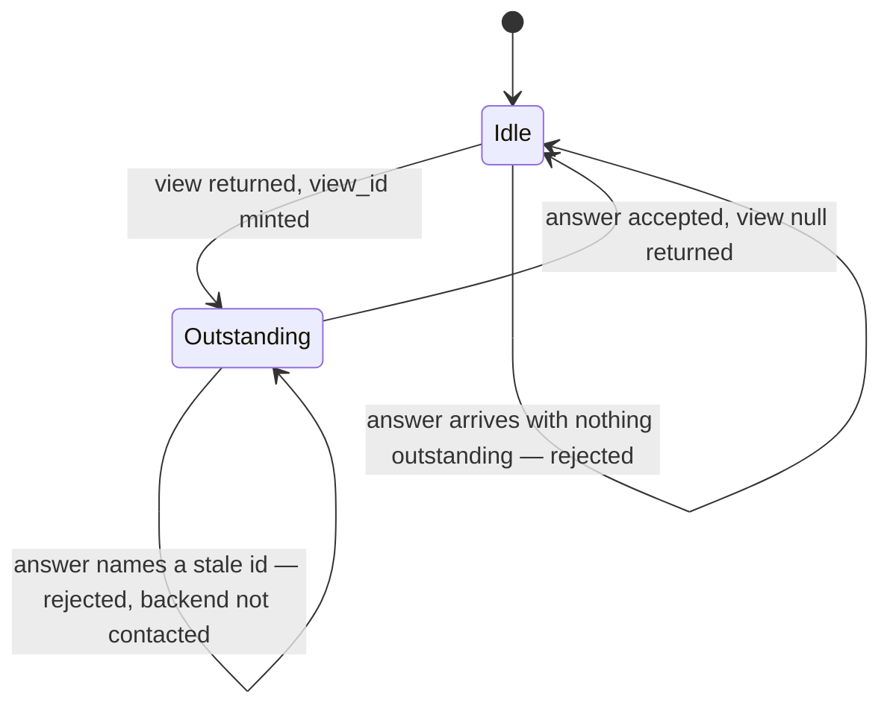

# SPEC-001: The host/backend interaction protocol

**Status:** active
**Kind:** technical
**Owns:** the wire contract between the goad host and a backend program, and the
host-side behaviour that contract implies.

<!-- A spec is evergreen and normative: it describes what is true now, not how
     it came to be true. No changelog, no revision history. Amending it requires
     explicit user endorsement. Requirement ids (R-N) are immutable — append,
     never renumber. Cite from elsewhere as SPEC-001/R-N. -->

## 1. Intent

goad's host owns interaction and nothing else. It renders prompts, accepts
answers, keeps time, and runs a program the user supplies. Every question of what
to ask, when to ask it, and what an answer means belongs to that program. This
spec is the seam: it says exactly what crosses it, in what shape, and what the
host does when what arrives is not that shape.

The problem it solves is that such a seam decays by default. A host with a
renderer in front of it drifts toward accepting whatever that renderer can draw,
and a protocol that grows by accretion ends up describing one implementation
rather than a contract. So the wire format is written down before the second
implementation exists, and the requirements below are stated as things that can
be falsified rather than as intentions.

Once this exists, a backend author can write a program in any language that can
read stdin and write stdout, run it against a published contract, and know from
the error they get back which side was wrong.

## 2. Scope

**In scope:** the request and response message formats; the protocol envelope and
its version; the interaction primitives the protocol admits; scheduling
instructions and how they resolve; the identity and lifetime of an outstanding
interaction; the process transport; and the failure taxonomy for every way an
exchange can go wrong.

**Out of scope:** how a view is drawn; the timer that decides when to evaluate;
persistence of anything across host restarts; the socket transport; the
`goad emit` command line; any means by which a backend learns what a host can
render. Drawing stays out of scope; what a renderer owes the protocol having
received a view does not (R-55).

**Boundaries:** the renderer abuts this spec at the canonical view — it consumes
one and produces a user response, and it may not see wire types. The timer abuts
it at the resolved next-check instant — it consumes one and calls `evaluate`.
The backend abuts it at the process boundary. A future socket transport replaces
§6.4 and nothing else. What the host does with a resolved instant once it holds
one — including the minimum spacing it places between its own scheduled
firings, which adjusts no stored instruction — is SPEC-002's.

## 3. Principles

**P-A — The host understands interaction, not intent.** No requirement here may
oblige the host to interpret a domain value. Where the host must read something
in order to decide what to do, that thing is protocol; everything else passes
through opaque, and the host may not branch on it.

**P-B — Liberal grammar, strict canonical semantics.** Input is accepted
permissively at the wire and is canonical immediately after normalization. An
ambiguous message MUST fail; it MUST NOT be guessed at. Permissiveness is about
fields the host does not model, never about the meaning of fields it does.

**P-C — An invalid value costs the sender its effect, never the host its
function.** A backend failure of any kind, including a malformed message, MUST
leave the host running and MUST leave it able to run the backend again.

## 4. Requirements

### Envelope and versioning

| id | requirement | verified by |
|----|-------------|-------------|
| R-1 | Every request the host emits MUST carry `"protocol": 1`. | §7 |
| R-2 | The host MUST accept a response that omits `protocol`. | §7 |
| R-3 | The host MUST reject, with a distinct error naming the version found, a response declaring a `protocol` value it does not implement. | §7 |
| R-4 | The host MUST ignore fields it does not model on any inbound message. | §7 |
| R-5 | The host MUST NOT reject a message solely because it carries an unmodelled field. | §7 |
| R-51 | For every modelled field, an explicit `null` means exactly what omitting the field means — **except** where this spec gives `null` a distinct meaning, which it does for `view` (R-11) and nowhere else. A `null` under this rule is not an invalid value: it MUST NOT be reported as a discard, because serializers in common backend languages emit `null` for an absent optional as ordinary output. A nulled `hints` key on a field (R-18) and a nulled `fields` key on an alternative (R-53) are omission under this rule like any other. A value of the wrong *type*, such as `"next_check": 45`, is a different case and R-25 governs it. | §7 |

### Requests

| id | requirement | verified by |
|----|-------------|-------------|
| R-6 | Requests are of exactly two kinds, `evaluate` and `respond`, discriminated by a `type` field. | §7 |
| R-7 | An `evaluate` request MUST carry the host's current instant and an event with a source, a kind, a timestamp and a data payload. | §7 |
| R-8 | A `respond` request MUST carry the `view_id` being answered, the host's current instant, the chosen option id, and a map of field id to submitted value. | §7 |
| R-9 | The host MUST NOT interpret an event's data payload or a submitted field value. It carries both verbatim. | §7 |
| R-56 | Every `evaluate` the host originates **on its own account** carries `event.source` of `"host"`, and an `event.kind` naming why the host is asking. The qualifier is load-bearing: a host may also *forward* an evaluation it did not originate — an event ingested from outside carries that writer's own `source` and `kind`, verbatim — and the host is still the only party that emits the request, so without it this requirement would be false of a conforming host the moment it forwards one. Three kinds are named by this requirement and mean what it says they mean: `"startup"`, once, when a host starts; `"requested"`, when a person asked; `"scheduled"`, when a resolved next check came due. A host MUST NOT reuse one of these three for anything else, and a backend MAY branch on them. The set is **open**: a host MAY originate an `evaluate` whose kind is none of the three, and a backend MUST tolerate a kind it does not recognise — treating it as an evaluation whose reason it does not know, never as a protocol error. **`"host"` is a reserved event source.** A host MUST NOT emit an `evaluate` carrying `source: "host"` for an event it did not itself originate. A backend MAY therefore read `source == "host"` as meaning the host is asking on its own account, and MAY read the three kinds above as meaning what this requirement says they mean **under that source only** — under any other source, `source` and `kind` are the writer's words and this requirement makes no claim about them. The matching obligation on what a host *accepts* — that an envelope claiming the reserved source is refused — is a rule about acceptance and is SPEC-003/R-13's, not this spec's; the trust this clause grants a backend rests on it. | §7 |
| R-57 | A submitted field value's JSON type is determined by the field's `kind` and by nothing else: `boolean` submits a JSON boolean, `text` a JSON string, `number` a JSON number, `choice` the chosen alternative's id as a JSON string, and `datetime` an RFC 3339 `date-time` string carrying an offset. R-9 is not in tension with this: opacity is about the host never *reading* a submitted value, and the host is nonetheless the only party that can *write* one, because it holds the widget. The kinds this rule types are R-16's five, all of them — what a `text` field submits is a fact about the protocol and not about any renderer's subset, and a rule written only to the kinds some renderer draws would make the contract track the renderer, which §1 names as the decay this document exists to prevent. | §7 |
| R-58 | A `respond` carries values for exactly the fields the host drew of the option being answered: a host MUST submit a value for each of them, and MUST NOT submit a value for any other field — neither a field it did not draw, nor a field of an option it is not answering. A field a renderer cannot draw is reported undrawn under R-55, and the response is silent about it rather than carrying a default. A backend that needs *unanswered* to be distinguishable from *false* MUST NOT send the field — the additive mechanism for that is OQ-2. R-8 fixes the response's *shape*, a map of field id to submitted value, and does not say the map is total over the drawn fields; R-35 forbids the host *refusing* an incomplete answer and says nothing about how it *produces* one. This is the rule that says both. | §7 |

### Responses: views

| id | requirement | verified by |
|----|-------------|-------------|
| R-10 | A response MUST carry a `view` field. Its absence is an error naming the missing field. | §7 |
| R-11 | `"view": null` means there is nothing to show. The host MUST treat it as a positive assertion by the backend, distinct from a failure to read a view. | §7 |
| R-12 | An unrecognised `kind` discriminant, at any depth, MUST produce a distinct error carrying both the offending string and the path at which it appeared, and MUST reject the whole message. | §7 |
| R-13 | A `choice` view MUST carry a title and at least one option, and MAY carry a body. A choice with zero options MUST be rejected. | §7 |
| R-14 | Option ids MUST be unique within a choice. Duplicates MUST be rejected. | §7 |
| R-15 | An option MAY carry fields. Each field MUST carry an id, a kind and a label. Any key on the field object that this spec does not name is a hint. | §7 |
| R-52 | Every identifier a response names MUST be unique within the scope that names it: option ids within a view, field ids within an option, and the alternative ids of one `choice` field. Duplicates MUST be rejected with an error naming the id and the path. The first two are keys — a response selects one option id and is a map keyed by field id (R-8), so a duplicate leaves one of the pair unaddressable. The third is a value: the answer to a `choice` field is an alternative id submitted under that field's key, so a duplicate makes the submitted answer ambiguous instead. Both are the same defect and the rule covers both. | §7 |
| R-53 | A `choice` field's options carry an id and a label only. That id is an **alternative** id and not an option id: an option id is what a response selects (R-8), while an alternative id is what a response submits as a field's value, so the two are separate namespaces and errors about them MUST name the right one. An option there carrying `fields` MUST be rejected with the same error as any other protocol key used where its position gives it no meaning — not ignored, since `fields` is a key this spec names. The response format addresses exactly one option and one flat map of field values (R-8), so a nested field could not be submitted, and a nested field id would share a namespace with every outer one. | §7 |
| R-16 | Field kinds are `text`, `boolean`, `datetime`, `number` and `choice`, named by the field's `kind` key. A `number` MAY carry `min` and `max`; a `choice` field MUST carry its own `options`, whose shape R-53 constrains; the other three carry no additional protocol keys. | §7 |
| R-17 | A `number` field's bounds MUST each be finite, and its minimum MUST NOT exceed its maximum. A violation rejects the message. | §7 |
| R-50 | A key this spec names for one field kind, appearing on a field of another kind, MUST be rejected with a distinct error naming the key and the kind. It MUST NOT be treated as a hint and MUST NOT be ignored. R-15's "any key this spec does not name is a hint" is about keys the spec does not name at all — `min` on a `text` field is a named key used where it has no meaning, which is the ambiguity P-B says must fail. | §7 |
| R-18 | Hints are an open map, carried flat as the field object's remaining keys. A key named `hints` whose value is an object is the other spelling of the same thing and MUST be rejected with a distinct error naming the path — not absorbed as a hint named `hints`, which would lose everything inside it silently (R-47); a `hints` key whose value is `null` is omission (R-51). Only the renderer MAY branch on a hint key; nothing that normalizes, schedules, transports, or manages interaction state may. Anything one of those must read is protocol, not a hint. | §7 |
| R-19 | Content forms are `text`, `markdown`, `html` and `uri`. A bare JSON string is `text`; any other form is an object naming its `kind` with its payload under `value`. A content block that is neither a string nor an object — an array, a number, a boolean — MUST be rejected as a protocol-invalid shape (R-44), never bound positionally and never read as text. The host MUST NOT dereference a `uri`. | §7 |
| R-20 | A view part that the host cannot read MUST NOT be silently dropped. A part may be discarded on its own only where the protocol itself specifies the behaviour in its absence. | §7 |

### Renderers

R-20 binds normalization: a view part the host cannot read is not dropped
there. It does not by itself reach the renderer, and the renderer is where the
pressure to drop something lives — a capability the protocol admits and a
particular renderer does not implement.

| id | requirement | verified by |
|----|-------------|-------------|
| R-55 | A renderer MUST NOT refuse a whole view because it cannot draw part of it. It draws what it can and reports what it did not draw. A capability the protocol admits and a renderer does not implement is a renderer subset, and MUST NOT be treated as, or produce the effect of, a narrowing of the protocol. | §7 |

### Responses: scheduling

| id | requirement | verified by |
|----|-------------|-------------|
| R-21 | A response MAY carry `next_check`: either an absolute instant or a relative span, expressed as a string. Surrounding whitespace is not part of the value and is ignored on both forms; every error about the value quotes it as sent. A bare **time of day** is neither form and MUST be rejected with a distinct error, never read as a span of that many hours. A value is a time of day when, trimmed, it has the shape of one — two or more colon-separated groups of ASCII digits, every group non-empty, with an optional `.` or `,` digit fraction after the last (`18:00`, `1:30:00`, `18:00:00.5`) — or when it carries a colon or a leading `T` and a clock-time grammar reads it (`T18:00:00`). A signed colon form (`-1:30:00`) is a span; a unitless integer (`18`) is unparseable, not a time of day; a span that contains a clock time (`1 day 18:00:00`) is a span. The span grammar is the host's one duration grammar: anything else in the host that reads a duration reads it with the same grammar and the same refusals. | §7 |
| R-22 | An absolute instant MUST carry an explicit UTC offset. One without an offset MUST be rejected with an error distinct from a general parse failure. | §7 |
| R-23 | A relative span in calendar units — months, years — MUST be rejected with a distinct error. Their length is not fixed without a calendar, and the host resolves instants without one. | §7 |
| R-24 | A relative span in days or weeks resolves as exactly 24 and 168 hours respectively. | §7 |
| R-25 | An invalid `next_check` MUST be discarded and reported, and the rest of the message MUST be accepted. The report names which way the value failed, each its own distinct error: not a string, naming the JSON type found; an instant without an offset (R-22); a time of day (R-21); a calendar unit (R-23); a span that leaves the representable range; or unparseable. | §7 |
| R-26 | The next check resolves to the latest **valid** instruction; failing that, to the previously resolved instant **if it is still ahead of the current instant**; failing that, to the current instant plus the configured default poll interval. A resolved instant at or before the current one has fired: it is consumed, not carried, so a backend that stops instructing the host is polled on the default cadence rather than at an instant that has already passed. | §7 |
| R-27 | The resolved next check is always a concrete instant. There is no unresolved state. | §7 |
| R-28 | A `next_check` in the past MUST be stored as given. The host MUST NOT adjust a backend's instruction to a value it prefers. | §7 |
| R-29 | A failed exchange MUST NOT accept a new instruction. It resolves the next check as if no instruction had arrived (R-26), and what it reports is what it retains: a previously resolved instant still ahead stands unchanged, and an elapsed one is consumed for the default poll from the instant of the failure. | §7 |

### Interaction identity

| id | requirement | verified by |
|----|-------------|-------------|
| R-30 | The host mints every `view_id`. The host MUST NOT read a `view_id` from a response; a backend that sends one has it ignored under R-4, like any other unmodelled field. | §7 |
| R-31 | At most one interaction is outstanding at a time. | §7 |
| R-32 | A `respond` naming a `view_id` that is not the outstanding one MUST be rejected, and the backend MUST NOT be contacted. | §7 |
| R-33 | A view returned while an interaction is outstanding replaces it. The replaced `view_id` becomes stale immediately. | §7 |
| R-34 | Rejecting a stale response MUST NOT clear the outstanding interaction. | §7 |
| R-35 | The host MUST NOT validate a submitted answer beyond its `view_id`. Whether an answer is acceptable is the backend's judgement. | §7 |

### Process transport

| id | requirement | verified by |
|----|-------------|-------------|
| R-36 | The backend command is an argument vector whose first element names the program. The host MUST NOT interpose a shell. An empty vector, or one whose program is the empty string, is refused when the command is loaded and never reaches the transport. | §7 |
| R-37 | One request is written to the backend's stdin per process invocation, and the host MUST close stdin after writing it. | §7 |
| R-38 | The host MUST read exactly one JSON document from stdout. Trailing content is an error. | §7 |
| R-39 | The host MUST drain stdout and stderr concurrently. | §7 |
| R-40 | A non-zero exit status MUST be reported as a failure and its stdout discarded, even if that stdout was valid. | §7 |
| R-41 | The configured timeout bounds the backend's opportunity to respond. Disposal — terminating the child, reaping it, and finishing the stderr drain — necessarily happens after that timeout has elapsed, and is bounded separately by a fixed cleanup limit. **A call therefore waits at most the configured timeout plus that cleanup limit**, and both MUST be stated rather than one hidden behind the other. | §7 |
| R-42 | The host MUST capture stderr and report it with **every** outcome, successful or not — including a zero exit whose stdout then fails to parse, and including a timeout. | §7 |
| R-43 | Every read from a backend MUST be bounded, and the two streams differ at the bound because their purposes do. Exceeding the **stdout** bound is a failure, and the host stops reading and closes the stream: it cannot act on a response it refused to finish, and leaving the pipe open only lets the flood continue. Exceeding the **stderr** bound is not a failure: the host retains the first bounded portion, flags the truncation, and MUST keep draining to EOF so a chatty backend cannot block on a full pipe. | §7 |
| R-48 | Every path that **returns** from an exchange MUST initiate termination of the backend and MUST wait, for a bounded interval, to observe it reaped and its stderr drained. Drop-time cleanup MUST NOT be the mechanism any returning path relies on. Failure to observe cleanup within that interval MUST be reported as a distinct outcome and MUST NOT be suppressed by any other failure the exchange is already reporting: what the backend did and whether the host disposed of it are independent facts, and the second outlives the call. Where the exchange is **dropped** rather than returned from — cancellation, a panic unwinding past it — no code of the host's runs, so drop-time cleanup is the only mechanism there is and the host relies on it explicitly; an exchange MUST NOT leave behind any task or handle that such a drop would fail to cancel. | §7 |
| R-54 | Cleanup failure and exchange failure are reported on separate channels. All four combinations are meaningful and each MUST be distinguishable: success with clean disposal; a failed backend the host disposed of; a good response the host could not fully dispose of; and both failing together. A cleanup failure MUST NOT be named in terms that assert a process state the host has not observed. | §7 |
| R-49 | A reported failure means the host took no action. It MUST NOT be read as a claim that the backend produced no side effects. | §7 |

### Failure

| id | requirement | verified by |
|----|-------------|-------------|
| R-44 | Each of these MUST map to its own distinct error: command not spawnable; timeout; non-zero exit; stdout past its bound; malformed JSON — bytes that are not one JSON document; a well-formed document of a shape the protocol refuses — a missing required key, a value of the wrong type, an array where an object is required; a key repeated within one object, at any depth; a nested `hints` object (R-18); an invalid scheduling value, in each of R-25's forms; an unsupported required primitive; an answer naming an unknown or stale interaction. Malformed and protocol-invalid are distinct because their fixes are: one is a serializer fault, the other a backend that misread this document. | §7 |
| R-45 | No backend failure may terminate the host, and none may leave it unable to invoke the backend again. | §7 |
| R-46 | The host MUST NOT panic on any value derived from a backend. | §7 |
| R-47 | Every refusal of a backend-supplied value MUST be reported. The host MUST NOT absorb an invalid value silently. This governs what the backend sent — the sender can act on that — and is silent about the host's own cleanup telemetry, which is reported on its own channel and never in competition with it (R-48, R-54): where an exchange fails *and* cleanup fails, both are reported, so there is no precedence question for this requirement to answer. | §7 |

## 5. Behaviour

**The normal exchange.** The host resolves that a check is due, or a user answers
a prompt. It serializes one request, invokes the backend, reads one response,
normalizes it, resolves the next check, and updates its interaction state.

What `view: null` does depends on which request it answered, and the two must not
be conflated (F-29). Answering an accepted `respond`, it closes the interaction:
the user's answer was taken and there is nothing further to show. Answering an
`evaluate` while an older interaction is still outstanding, it leaves that
interaction exactly as it was — the backend was asked whether it had anything new,
said no, and has not thereby withdrawn a question the user is still looking at.
A response carrying a view always leaves an interaction outstanding, replacing any
previous one.



**Partial failure.** Exactly one part of a response is discardable on its own:
`next_check`. Its absence is a state the protocol already defines a behaviour for
(R-26), which is what makes discarding it safe — the host lands somewhere the
contract chose, not somewhere it invented. Everything else fails the whole
message. In particular an unreadable body is not dropped: nothing specifies what
a renderer shows in place of a body that was sent, so dropping it would render a
view the backend did not author.

**Ambiguity is failure.** Zero options, duplicate option ids, duplicate field ids
within an option, an inverted numeric range, an unknown primitive, a bound on a
field that has no bounds, two JSON documents on stdout: each of these has more
than one defensible reading, and the host takes none of them.

**The host reports its own condition separately from the backend's.** An exchange
answers two questions — what the backend did, and whether the host disposed of
the process afterwards — and they are independent (R-54). A backend can fail
while the host cleans up perfectly, and a backend can answer correctly while
leaving a grandchild the host cannot wait out. Ranking these against each other
loses the one that outlives the call.

**Absent is not null — for `view`, and only for `view`.** A response that omits
`view` has said nothing about the view; a response with `"view": null` has said
there is nothing to show. The first is an error, the second is ordinary.
Collapsing them would have the host manufacture the backend's assertion.

Everywhere else the two *are* the same, deliberately (R-51). `null` is what an
ordinary serializer emits for an absent optional — `json.dumps({"next_check":
None})` is not a backend doing anything wrong — so treating it as an invalid
value would report a discard against most well-formed messages. `view` is the
exception because `null` there carries a meaning omission does not; no other
field has one to lose. A wrong *type* is a different matter: `"next_check": 45`
is a value the backend meant, in a shape the protocol cannot use, and R-25
discards and reports it.

**A broken backend is polled on its existing cadence.** A failure accepts no
instruction (R-29): the schedule resolves as if none had arrived, so a backend
that fails every invocation keeps being tried — at the instant it last asked for
while that is still ahead, and on the default cadence once it has passed. The
alternative — a failure clearing or extending the schedule — converts a broken
backend into a silent host, which is the failure mode the user notices last;
and reporting an already-elapsed instant would have the timer retry a backend
that failed at its scheduled check in a tight loop.

## 6. Interfaces & contracts

### 6.1 Request messages

```json
{ "protocol": 1, "type": "evaluate", "now": "2026-08-23T04:12:00Z",
  "event": { "source": "host", "kind": "scheduled",
             "timestamp": "2026-08-23T04:12:00Z", "data": {} } }
```

```json
{ "protocol": 1, "type": "respond", "now": "2026-08-23T04:14:31Z",
  "view_id": "2026-08-23T04:12:00Z#3",
  "response": { "option": "later",
                "values": { "minutes": 20, "notes": "back after coffee",
                            "done": false } } }
```

`now` and `event.timestamp` are RFC 3339 with an explicit offset. `event.data`
and `response.values` are opaque to the host (R-9) — the host never *reads* what
it carries there. It does nonetheless *write* `response.values`, because it holds
the widget, and R-57 fixes the JSON type of each entry while R-58 fixes which
entries are present. The example carries three because the map is over every
field the host drew of the option it names, which is rarely one: `done` is `false`
because the box was drawn and left unticked, not because it was omitted and
defaulted.

### 6.2 Response messages

```json
{ "view": { "kind": "choice", "title": "Take a break?",
            "body": { "kind": "markdown", "value": "You have been at it **2h**." },
            "options": [
              { "id": "yes", "label": "Now" },
              { "id": "later", "label": "In a bit",
                "fields": [ { "id": "minutes", "kind": "number", "label": "Minutes",
                              "min": 5, "max": 120, "units": "min" } ] }
            ] },
  "next_check": "45 minutes" }
```

```json
{ "view": null, "next_check": "2026-08-23T09:00:00+10:00" }
```

**Content forms.** A bare string is `text`; everything else is tagged. These four
are equivalent in status, and the first is the form brief §10.1 requires of v0:

```json
"body": "Optional context"
"body": { "kind": "text",     "value": "Optional context" }
"body": { "kind": "markdown", "value": "You have been at it **2h**." }
"body": { "kind": "html",     "value": "<p>Careful now</p>" }
"body": { "kind": "uri",      "value": "https://example.invalid/note" }
```

**Field forms.** The field object's own keys are `id`, `kind`, `label`, and —
where the kind calls for them — `min`, `max` and `options`. **Every other key is a
hint**, which is why `multiline` below sits flat rather than nested: that is how
brief §10.2 writes it, and a nested `hints` object would leave it unmodelled and
silently dropped.

"Where the kind calls for them" is load-bearing rather than descriptive. `min` and
`max` belong to `number` and `options` to `choice`; the same key on any other kind
is an error and not a hint (R-50). The two rules are one rule seen from either
side: a key the spec does not name is presentation, a key it does name is
contract, and a contract key in a position where the contract gives it no meaning
is neither.

```json
{ "id": "notes",  "kind": "text",     "label": "Anything notable?", "multiline": true }
{ "id": "done",   "kind": "boolean",  "label": "Finished?" }
{ "id": "when",   "kind": "datetime", "label": "When" }
{ "id": "energy", "kind": "number",   "label": "Energy", "min": 1, "max": 10, "units": "kJ" }
{ "id": "mood",   "kind": "choice",   "label": "Mood",
  "options": [ { "id": "up", "label": "Good" }, { "id": "down", "label": "Bad" } ] }
```

A `choice` field's options are id and label only (R-53). A view's options may
carry fields; a field's options may not, because the response addresses one
option and one flat map of field values and has no way to express a nested
answer. Field ids must be unique within an option for the same reason (R-52).

**What each kind submits.** The answer's JSON type is fixed by the field's `kind`
and by nothing else (R-57). This table is that requirement restated where a
backend author reading the field forms above will meet it; the requirement is
normative and this is not a second rule.

| kind | submitted value | example |
|---|---|---|
| `boolean` | JSON boolean | `false` |
| `text` | JSON string | `"back after coffee"` |
| `number` | JSON number | `20` |
| `choice` | the chosen alternative's id, as a JSON string | `"up"` |
| `datetime` | RFC 3339 `date-time` string carrying an offset | `"2026-08-23T09:00:00+10:00"` |

A `choice` submits an **alternative** id, never an option id — the two are
separate namespaces (R-53). `datetime` carries both a date and a time, by the
kind's own name; whether a date alone wants a kind of its own is OQ-4.

All five are typed here, and the contract was complete before any renderer was.
That ordering is deliberate and is worth keeping stated now that it has been
discharged: a renderer drawing a subset of the kinds is a renderer subset and
not a narrowing of the protocol (R-55), so the table above was written to all
five while the renderer in this repository drew one.

**What an untouched field submits.** R-58 requires a value for every drawn field
and OQ-2 — an inbound `field.value` — is unlanded, so a host must supply one for
a field nobody touched. This host supplies:

| kind | untouched value |
|---|---|
| `boolean` | `false` |
| `text` | `""` |
| `number` | its declared `min`, or `0` where none was declared |
| `choice` | its first alternative's id |
| `datetime` | the Unix epoch, `1970-01-01T00:00:00+00:00` |

**This is descriptive, not a sentinel.** A backend MAY NOT rely on the epoch, or
on any of the others, to mean *untouched*: it is what this host sends, not a
protocol guarantee. R-58's existing instruction stands as the way to make
*unanswered* distinguishable — **do not send the field** — and OQ-2 is the real
answer to the question a sentinel would half-answer.

Two consequences a backend author would otherwise read off the wire as host
defects, and can discover nowhere else:

- **A `number` range carrying only a `max` submits `0`, outside its own declared
  bound.** `{"kind":"number","max":-10}` with no `min` is legal (R-17), and `0`
  is what the untouched rule above yields. Nothing is breached — R-35 puts the
  judgement of whether an answer is acceptable in the backend, and R-58 requires
  a value — but the combination is surprising, and the host does not invent a
  bound it was not given.
- **A *cleared* bounded `number` submits its `min`, not `0`.** This is a
  different case from *untouched*: text that no parse accepts leaves the number
  alone, and an empty string is such a text, so clearing the box leaves whatever
  the field last held — which for an untouched bounded field is its `min`. So
  `{"kind":"number","min":2.5}`, cleared and then answered, shows an empty box
  and submits `2.5`. Only a field drawn at zero submits `0`.

A consequence worth stating rather than discovering: a misspelled **optional** key
becomes a hint (`minn` is not `min`), while a misspelled **required** key is still
an error. The spec accepts that asymmetry as the price of matching the brief's
examples; the alternative — accepting both a flat key and a nested `hints`
object — would give one thing two spellings, which P-B says must fail rather than
be guessed at.

### 6.3 What the host owns versus uses

The host owns: `view_id` minting and lifetime, the resolved next check, the
default poll interval, the timeout, and the read bounds. It uses, without
interpreting: event payloads, submitted values, hint keys and values, and URI
content.

### 6.4 Process transport

One process per exchange. Request on stdin, stdin then closed (R-37). Exactly one
JSON document on stdout (R-38). Stderr is diagnostic and is captured whatever the
outcome (R-42). The command is an argv vector (R-36). Nothing is inherited from a
previous exchange: there is no warm process, no connection reuse and no retry.

**Two budgets, both stated.** The configured timeout bounds how long the backend
has to answer. A separate, fixed cleanup limit bounds terminating it, reaping it
and finishing the stderr drain. A call waits at most their sum (R-41). The
cleanup budget exists because waiting for a child is not guaranteed to return —
a process wedged in an uninterruptible state does not die on signal — and a host
that blocks inside an exchange has been taken down by a backend, which P-C
forbids.

An exchange always completes: what can fail is the response, not the reporting of
it, so a failure and the stderr captured before it arrive together rather than as
alternatives. Every returning path kills and reaps the child before it returns
(R-48); the runtime's kill-on-drop behaviour is a backstop for the paths where no
host code runs at all, and the spec relies on it there and nowhere else.

A backend is a **trusted user program**, not a sandboxed plugin. Nothing in this
transport constitutes isolation, and no requirement here may be read as implying
any.

## 7. Verification

Every row names the tests that hold it, so a row can be checked by `grep` rather
than believed. Three conventions: a **fixture** is a data file under
`tests/fixtures/{protocol,protocol-text,schedule}/`, named for the
requirement it states, and every one of them is run by
`normalize.rs::every_protocol_fixture_states_what_a_wire_document_means`,
`normalize.rs::what_a_json_value_cannot_carry_is_refused_from_the_document_text`
— the `protocol-text` corpus, over raw document text rather than parsed values,
for what `serde_json` refuses before a value exists — or
`runner.rs::every_scheduling_fixture_states_what_the_protocol_does`; a **unit**
test is `module.rs::function` under `src/`; an **integration** test is
`tests/integration/file.rs::function` and drives a real backend process.

Five rows are held by **review** rather than by a test, and each says so and why.
That is not the same as unverified: the check exists and is stated, but its
subject is a property of the source or of the contract, not an observable
behaviour.

| requirements | verified by |
|---|---|
| R-1, R-2, R-3 | unit: `canonical.rs::an_evaluate_serializes_to_the_spec_s_wire_form`, `::a_respond_serializes_to_the_spec_s_wire_form` and `::every_request_kind_carries_the_version_and_a_discriminant` assert the emitted version on both request kinds. Fixtures `R-2-protocol-omitted`, `R-2-protocol-declared-as-the-version-the-host-implements` and `R-3-protocol-declared-as-a-version-the-host-does-not-implement` cover absent, known and unknown inbound; `R-3-protocol-declared-as-a-string` is a `protocol` of the wrong type, refused as a shape and not reported as a version. End to end: `failure_matrix.rs::a_protocol_version_the_host_does_not_implement_is_refused` |
| R-4, R-5 | fixtures `R-4-an-unmodelled-key-on-{the-envelope,a-view,an-option,a-field,an-alternative,a-content-block}` — one per inbound level, `Alternative` included |
| R-51 | fixtures `R-51-{next-check-null,next-check-omitted,protocol-null,a-nulled-body,a-nulled-modelled-key-on-a-field,a-nulled-fields-key-on-an-alternative,a-nulled-hints-key-on-a-field}`, asserting identical outcomes to their omitted forms **and an empty discard list** — the assertion is the silence, since a discard here would be the defect. Paired with `R-25-next-check-of-the-wrong-type`, which must still be discarded and reported, so the two cases are shown to be distinguished rather than merged. End to end: `failure_matrix.rs::an_explicit_null_next_check_discards_nothing` and `::an_explicit_null_protocol_discards_nothing` |
| R-6, R-7, R-8 | unit: the three `canonical.rs` serialization tests above, each against the literal JSON of §6.1 parsed to a `serde_json::Value`, so key order is not asserted and a missing `protocol` or `type` is |
| R-56 | unit, at the one place the host names a kind: `crates/goad/src/wire.rs::a_scheduled_stimulus_names_itself_scheduled` and `::a_scheduled_stimulus_s_event_carries_the_three_normative_fields`, the second asserting `source`, `kind`, `timestamp` and payload together, against `Stimulus::kind`, which returns exactly `"startup"`, `"requested"` and `"scheduled"` and nothing else. Over the wire a backend actually reads: `crates/goad/tests/renderer/scheduling.rs::a_short_default_poll_is_honoured_unfloored_for_the_first_scheduled_check` reads `event.kind` off the request a scripted backend logged and asserts `"scheduled"` on the firing that came due, and `::a_later_instruction_supersedes_and_the_earlier_deadline_does_not_fire` asserts `"requested"` on the one a person asked for — the two kinds discriminating each other rather than each being asserted alone. The **tolerance** clause is an obligation on backends, which no host test can observe, and is **review, not a test**, like this spec's other backend-side obligations. What the host emits for each kind is SPEC-002's subject once the kind is `"scheduled"` (SPEC-002/R-1). **The reserved-source clause** is held from the acceptance side, where the only way to breach it is: `crates/goad-shell/src/ingress/envelope.rs::tests::a_reserved_source_is_refused_with_every_other_field_valid` — an envelope claiming `source: "host"` is refused with every other field well formed, so the refusal is attributable to the source alone — and `crates/goad-shell/tests/integration/ingress.rs::the_three_shape_reasons_this_phase_owns_are_read_off_the_wire`, which reads `reserved_source` back as its own wire reason. The *emission* half — that no host code path constructs `source: "host"` for an event it did not originate — is **review, not a test**: `Stimulus::kind` is the one place the host names its own event, `crates/goad/src/wire.rs` the one place it is written, and an ingested event reaches that seam already carrying the writer's fields (SPEC-003/R-11). Asserting the absence of a second construction site would be asserting the absence of code |
| R-57 | unit, at the **single site** the host turns a widget's state into a submitted value: `crates/goad/src/draft.rs::submitted`, a total match over `Edited`, tested by `draft.rs::tests::a_boolean_field_submits_a_json_boolean` in both directions. One site is the requirement's own structure — a mapping stated in two places is a mapping that can drift — and the total match means the host cannot grow a drawn kind without deciding what it submits. All five clauses are asserted, from both directions, by a renderer that draws all five kinds: `crates/goad/tests/renderer/fields.rs::every_untouched_kind_leaves_the_host_with_the_json_type_r57_names` reads the submitted values off the child process's own request log for a form nobody touched, six keys each a different JSON type from its neighbour, and `::every_operated_kind_leaves_the_host_with_the_json_type_r57_names` does the same after every control has been operated. The per-kind cases stand beside them: `::an_untouched_datetime_reads_not_set_on_screen_and_submits_the_epoch`, `::choosing_an_alternative_submits_its_id_where_the_field_id_is_the_options_own`, `::an_unbounded_number_submits_what_was_typed_and_invents_no_range`. The `datetime` expected value is partly self-agreeing — it is computed by the production `instant::compose` — and the *format* is pinned by literals at `draft.rs`, which is where a drift in the RFC 3339 spelling would be caught. The site that must change when the *protocol* grows a sixth kind is not this match, which is over a host-local type and stays exhaustive, but the `FieldKind` arm in `view_model.rs::drawn_form`, which must sort the new kind into drawn or `Undrawn::FieldForm` |
| R-58 | integration, both halves separately, because either alone is satisfiable by a host that fails the other. The MUST: `crates/goad/tests/renderer/wiring.rs::editing::an_answer_carries_a_value_for_every_drawn_field_of_the_option_it_names`. The MUST NOT prohibits two things, and **only one of them is observable in a host that draws every kind the protocol admits**. The surviving half — a value for a field of an option the host is not answering — is `::an_answer_carries_no_value_for_another_options_field`, driven over two options that share the field id `read`. The other half — a value for a field the host did not draw — **has no construction left**: a `group`-hint field is still drawn, every surviving `Undrawn` variant is body-level, and there is therefore no view that carries an undrawn *field*. It is held instead by the shape of the walk, stated below, and this row says so rather than substituting a case that would assert something else. Over the wire a backend actually reads: `crates/goad/tests/renderer/fields.rs::a_field_id_shared_by_two_options_is_two_keys_and_only_the_answered_ones_are_sent`, a two-option view whose options share a field id — the case R-52 makes legal — asserting the request names one option and carries only its keys. Where this requirement meets R-55 is now the content forms, under that row. Structural, and the reason there is no check to forget: `controller.rs::answer` builds `values` by walking the *presentation's* drawn fields and looking each one up in the draft, never by walking the draft, and `draft.rs::Draft` exposes no way to enumerate what it holds — so a draft key that outlived its view is not expressible on the wire rather than being filtered off it |
| R-9, R-19 | **review, not a test** — the requirement is that host code never *reads* a payload, and a test can only observe code that does. The wire forms are fixtures `R-19-a-body-{tagged-as-text,tagged-as-markdown,tagged-as-html,tagged-as-uri,written-as-a-bare-string}`, and `R-19-a-body-written-as-an-array` is the form that is neither, refused as a shape; the payload-opacity half is a source check against P-A, re-run at every audit: no file under `src/` dereferences a `uri` or branches on `event.data` or `response.values`, all three of which are carried as `serde_json::Value` |
| R-18 | **review, not a test**, and the same reason: `hints` is read in `src/` at two sites and no others. `normalize.rs::normalize_field` collects the remaining keys and passes them through, reading none of them; `crates/goad/src/view_model.rs` reads exactly one key, `group`, to decide where a heading is drawn — at `Run::of`, reached from `present` through `sift`, and nowhere else in the crate. The second site is the renderer — the one component this requirement permits to branch on a hint — so it is the rule being exercised rather than breached. Nothing normalizing, scheduling, transporting or holding state reads a key from it (I7). What the renderer does with a `group` that is not a JSON string is R-55's and R-20's business, not this row's: it is drawn ungrouped in place and reported undrawn, never dropped. The wire half is fixtures: `R-18-brief-10-2-s-own-field-example` carries brief §10.2's `multiline` flat and asserts it becomes a hint; `R-18-a-nested-hints-object` asserts the nested spelling is refused with its path; `R-51-a-nulled-hints-key-on-a-field` (cited under R-51) that `null` there is omission |
| R-10, R-11 | fixtures `R-10-view-omitted` (error naming the field) and `R-11-view-null-is-nothing-to-show` (accepted), with `R-11-an-envelope-written-as-an-array` showing a response that is not an object is a shape error and not a missing `view`. Both meanings of `null` are integration tests, since the difference is a state transition rather than a parse: `host.rs::a_null_view_answering_an_evaluate_leaves_the_interaction_open` and `::a_null_view_answering_a_respond_closes_the_interaction` (F-29). End to end: `failure_matrix.rs::a_response_omitting_view_is_refused` |
| R-12 | fixtures `R-12-an-unknown-{view,field,content}-kind` and `R-12-a-misplaced-key-on-an-unknown-field-kind`, each asserting the reported path. End to end: `failure_matrix.rs::an_unknown_kind_nested_in_a_field_is_refused_with_its_path` |
| R-13, R-14, R-16 | fixtures `R-13-{a-choice-view,a-choice-with-no-options,a-choice-omitting-options-entirely,an-option-written-as-an-array}`, `R-44-a-title-that-is-not-a-string` (both of the last two shape errors, never bound positionally or coerced), `R-14-duplicate-option-ids`, and `R-16-a-{text,boolean,datetime,choice}-field` plus `R-16-a-number-field-with{,out}-bounds` — every kind in its wire form. Unit: `canonical.rs::an_empty_options_is_rejected_and_names_where` and `::duplicate_option_ids_are_rejected_naming_the_id_and_where`. End to end: `failure_matrix.rs::a_choice_with_no_options_is_refused` and `::two_options_sharing_an_id_are_refused` |
| R-52 | fixtures `R-52-{duplicate-field-ids-within-one-option,duplicate-alternative-ids,a-choice-field-with-no-alternatives,the-same-field-id-in-different-options}` — the last legal and accepted, which is what shows the scope is right — and `R-52-an-alternative-written-as-an-array`, a shape error. `protocol-text/R-52-a-duplicate-key-inside-an-option` is the same defect one level down: a key repeated inside one object is refused before any id is compared, so last-wins parsing cannot hide a duplicate. Unit: the four `canonical.rs` tests of the same names in prose, of which `::duplicate_alternative_ids_are_rejected_as_alternatives_never_as_options` and `::an_empty_alternatives_is_rejected_as_alternatives_never_as_options` are the ones that would fail if an alternative id were reported as an option id (F-61). End to end: `failure_matrix.rs::two_fields_in_one_option_sharing_an_id_are_refused` |
| R-53 | fixtures `R-53-an-alternative-carrying-fields` and `R-15-an-option-carrying-fields`: the first **rejected** with the key, the kind and the path the second accepted, since a *view's* option may carry fields. The flat answer shape is `round_trip.rs::the_deno_example_completes_a_round_trip`, which names one option and one map of field values |
| R-50 | fixtures `R-50-{min-on-a-text-field,options-on-a-number-field,min-on-a-choice-field}`, each asserting the error and the reported key, kind and path, plus the negative `R-50-a-misspelled-optional-key-becomes-a-hint`, so the two rules are shown not to collide. End to end: `failure_matrix.rs::a_text_field_carrying_min_is_refused` and `::a_number_field_carrying_options_is_refused` |
| R-17 | fixture `R-17-inverted-bounds` for the bounds error; `protocol-text/R-17-{a-nan-literal,an-infinite-literal}-for-a-bound` for the two literals JSON cannot express, run by `normalize.rs::what_a_json_value_cannot_carry_is_refused_from_the_document_text` — a second corpus over raw text, because `serde_json` refuses both at *envelope* parse and so they cannot be written as ordinary fixtures (F-36). Unit: `canonical.rs::an_inverted_number_range_is_rejected`, `::a_non_finite_bound_is_rejected_naming_which_bound`, `::a_range_with_one_bound_or_none_is_accepted`. End to end: `failure_matrix.rs::inverted_bounds_are_refused` |
| R-15 | fixtures `R-15-an-option-carrying-fields`, `R-15-an-option-with-no-fields` and `R-15-a-misspelled-required-key`; unit: `canonical.rs::an_option_with_no_fields_is_accepted` |
| R-20 | **review**, against the two-clause test in §5, plus one mechanical check that makes the review's premise falsifiable: `normalize.rs::a_schedule_failure_is_named_by_a_fixture_as_a_discard` asserts that the only thing any fixture reports as discarded is a schedule failure. A second discardable part would fail it and would have to argue for itself |
| R-55 | integration, in the first renderer: `crates/goad/tests/renderer/mapper.rs::rejected_markdown_degrades_to_plain_and_is_reported_undrawn` and `crates/goad/tests/renderer/reception.rs::a_view_with_rejected_markdown_yields_unclear_diagnostics_and_a_prepared_presentation` assert a legal view whose body this renderer cannot draw is still shown, degraded, with the degradation reported rather than the view refused. `Presentation::undrawn` (`crates/goad/src/view_model.rs`) is the general mechanism, and the content forms are what exercise it: **no option field is undrawn on account of its kind**, because this renderer draws all five. The path a sixth kind would take is held at compile time rather than by a case, and by **two** things, not one — `view_model.rs::drawn_form`'s exhaustive match over `FieldKind`, which fails to compile when the protocol grows a variant, and `clippy::wildcard_enum_match_arm` denied for the `goad` crate, without which a `_` arm absorbing the new kind compiles, lints clean and leaves the gate green. The match is the guard; the lint is what stops the guard being written away. A renderer that instead refuses such a view would fail these, not a future check |
| R-21, R-22, R-23, R-24, R-25 | the scheduling corpus, all run by `runner.rs::every_scheduling_fixture_states_what_the_protocol_does`, each fixture asserting its own variant. The two forms: `schedule/R-21-{absolute-with-offset,relative-span-in-minutes,relative-span-in-hours}`. The trim, on both forms and on the offsetless case: `R-21-absolute-with-trailing-whitespace` (accepted) and `R-22-absolute-without-offset-with-trailing-whitespace` (still `MissingOffset`, not a time of day). The time of day, every edge a fixture: `R-21-{bare-wall-clock-time,bare-wall-clock-time-unpadded,wall-clock-time-with-a-fraction,wall-clock-time-with-the-iso-designator,wall-clock-time-with-trailing-whitespace}` refused as a time of day, against `R-25-unitless-integer` (`18`, unparseable) and `R-25-colons-with-nothing-between-them` (`::`, unparseable), which pin what the shape excludes. The rest: `R-22-absolute-without-offset`, `R-23-calendar-unit-{months,years}`, `R-24-{relative-span-in-days,relative-span-in-weeks,compound-span-of-days-and-hours}` and `R-25-{not-a-string,unparseable-prose,span-beyond-the-grammar-s-unit-bound,span-leaving-the-representable-range}`. `protocol/R-21-next-check-as-a-relative-span` is the same instruction inside a whole response, so the schedule corpus is shown to be about the value and the protocol corpus about the message carrying it. End to end: `failure_matrix.rs::a_next_check_of_the_wrong_type_is_discarded_and_reported` and `::a_next_check_in_calendar_units_is_discarded_and_reported` |
| R-26, R-27 | unit: the seven `schedule.rs` resolution tests over the triple (retained, incoming, default) and `now` — `::a_valid_incoming_instruction_supersedes_the_retained_one`, `::a_valid_incoming_instruction_wins_even_when_it_is_earlier_than_the_retained_one`, `::with_no_incoming_instruction_the_retained_value_stands`, `::with_nothing_retained_and_nothing_incoming_the_default_poll_is_added_to_now`, `::an_instruction_discarded_upstream_arrives_as_none_and_preserves_the_retained_value`, `::an_elapsed_retained_check_is_consumed_and_the_default_poll_applies` and `::a_retained_check_equal_to_now_is_consumed_too`. Across two exchanges at the host: `host.rs::an_elapsed_check_is_consumed_and_the_default_poll_applies_from_now`, whose second exchange runs *at* the instant the first scheduled and must get `now + default_poll`, not the elapsed instant. R-27 is additionally structural: `State::resolved_check` is not an `Option` |
| R-28 | fixtures `R-28-{absolute-instant-already-past,negative-span}`, asserting the value is stored as given; unit: `schedule.rs::a_valid_incoming_instruction_wins_even_when_it_is_earlier_than_the_retained_one` |
| R-29 | integration, through the real transport: `failure_matrix.rs::a_backend_that_never_answers_reaches_the_caller_as_a_timeout`, `::a_non_zero_exit_reaches_the_caller_as_an_exit_status_with_the_body_discarded` and `::a_body_that_will_not_parse_reaches_the_caller_as_a_protocol_failure` each assert `next_check` is the instant the *previous* exchange set — still ahead of `now`, so it stands — and not the seeded default, which would be the same value and would assert nothing. Against the fake: `host.rs::no_failure_moves_the_schedule` with `::a_successful_exchange_does_move_the_schedule` as its control, and `::a_failure_at_an_elapsed_check_reports_the_default_poll_from_now` for the elapsed case: a failure *at* the resolved instant reports `now + default_poll`, and a later failure and a no-instruction success both report the instant that was retained, so what is reported and what is stored never differ |
| R-30 | **review**: no inbound wire type declares a `view_id` field. `view_id` appears in `src/semantics/protocol/` only on the outbound `Respond`, and the mint is `state.rs`, held by `::a_fixed_now_and_counter_produce_the_id_the_design_documents` and `::the_counter_separates_ids_minted_from_the_same_instant_and_now_separates_restarts` |
| R-31, R-33, R-34 | unit: `state.rs::a_minted_id_is_outstanding_and_verifies`, `::a_replaced_id_is_stale_and_the_replacement_is_named`, `::a_rejection_leaves_the_outstanding_interaction_intact`, `::closing_returns_the_host_to_idle_and_is_idempotent`. Integration: `host.rs::a_view_returned_by_a_respond_replaces_the_one_it_answered` and `::a_superseded_id_is_refused_and_the_outstanding_interaction_survives`. R-34 across a **backend** failure rather than a refusal is `host.rs::a_backend_failure_during_respond_leaves_the_interaction_answerable` — the view is answered again after the failed exchange — and `failure_matrix.rs::one_host_survives_every_misbehaving_backend_and_still_works`, which puts a view outstanding before nineteen failing exchanges and answers it after |
| R-32 | integration: `round_trip.rs::an_answer_no_view_asked_for_never_reaches_the_backend` and `::a_superseded_answer_never_reaches_the_backend`, both asserting no spawn by way of an invocation log the backend appends to — a config naming an unspawnable command is vacuous, since a host that spawns and then refuses still returns the refusal. Against the fake: `host.rs::an_answer_against_an_idle_host_is_refused_and_no_exchange_happens`; unit: `state.rs::nothing_outstanding_names_the_variant_that_says_so` |
| R-35 | integration: `round_trip.rs::an_answer_the_view_did_not_offer_reaches_the_backend_unchanged` |
| R-36 | integration: `round_trip.rs::the_bash_backend_completes_the_same_round_trip`, invoked as `["bash", <script>]` with no shebang. Unit: `config.rs::an_empty_command_is_rejected_because_there_is_nothing_to_spawn`, over `[]`, `[""]` and `["", …]` |
| R-37 | integration: `transport.rs::a_correct_backend_completes_an_exchange`, whose backend reads stdin to EOF and echoes what it read, so the assertion is the request arriving verbatim rather than merely something arriving. The converse — a backend that never reads — is `::a_backend_that_answers_without_reading_its_request_is_still_answered`: the host's write meets a closed pipe, tolerates it, and still takes the answer, with `::a_backend_that_floods_stdout_before_reading_its_request_is_still_answered` for the same with a full pipe |
| R-38 | integration: `host.rs::a_body_that_is_not_exactly_one_json_document_is_a_protocol_failure` (empty stdout, and two documents) with `::a_document_followed_by_whitespace_is_still_one_document` as the negative. Not fixtures: framing is the transport's business and a fixture corpus reads documents, not streams. **Scope:** invalid UTF-8 is rejected only where serde actually decodes it — a *skipped* value's bytes are never decoded, so a stray `\xff` inside an unmodelled field parses. The case that matters, a read value, is covered; this row does not claim the stronger property |
| R-39 | integration: `transport.rs::a_stderr_flood_is_truncated_and_the_exchange_still_succeeds`, which writes past one pipe buffer before its response and would deadlock under a sequential read |
| R-40 | integration: `transport.rs::a_non_zero_exit_discards_the_body_it_came_with`, asserting `ExitStatus { code: Some(1) }`, that the parsed body is **discarded** rather than delivered, and that the stderr is still carried; end to end, `failure_matrix.rs::a_non_zero_exit_reaches_the_caller_as_an_exit_status_with_the_body_discarded`. The exit status must be observed inside the exchange's own timed region: a host that reads stdout to EOF and stops has already committed to a response the exit code disclaims, and a host that waits only in its cleanup path has killed the child before the status exists (F-59) |
| R-41 | integration, as three measured cases rather than one: `transport.rs::a_grandchild_holding_stdout_too_fails_both_dimensions` pays the timeout *and* the cleanup bound and is asserted against their sum; `::a_grandchild_holding_stderr_costs_the_cleanup_budget_and_nothing_else` pays the cleanup bound alone; and `::a_correct_backend_completes_an_exchange` asserts a prompt success costs **less than** the cleanup budget, so neither bound is paid on the normal path. Measured at 902 ms, 303 ms and 2.5 ms against a 900 ms sum (F-63). `transport.rs::a_backend_that_never_answers_times_out_and_is_disposed_of` is the fourth: a timeout with nothing holding the pipes finishes inside the timeout alone, so a timeout does not imply a cleanup failure |
| R-42 | integration: `transport.rs::stderr_written_before_a_hang_survives_the_timeout` and `::a_zero_exit_with_an_unparseable_body_still_carries_its_stderr` — the second is the path that does not explain itself any other way (F-24). At the host: `host.rs::stderr_and_the_cleanup_verdict_survive_a_failed_exchange` |
| R-43 | integration: `transport.rs::a_stdout_flood_is_refused_and_the_backend_sees_the_stream_close` — the backend observing the broken pipe is the assertion that the host closed it — with `::a_stdout_flood_with_nothing_behind_it_is_disposed_of_cleanly` as the disposal half, and `::a_stderr_flood_is_truncated_and_the_exchange_still_succeeds` for the other bound, which **succeeds** with the truncation flag set and would deadlock if the stderr bound stopped that read. Unit, inside the transport: `process.rs::a_refused_read_takes_exactly_one_byte_past_the_bound`, against a reader that fills every buffer it is offered, so the bound is exact rather than eventual. Structural: `transport_shape.rs::the_capped_reader_owns_the_stdout_handle`, which fails if the reader borrows the handle and so drops it at the *return* rather than at the bound. End to end: `failure_matrix.rs::output_past_the_cap_reaches_the_caller_as_output_too_large` |
| R-48, R-54 | integration: `transport.rs::the_misbehaving_suite_leaves_no_child_behind` walks `/proc` after every misbehaving case, with `::a_backend_that_is_running_is_seen_as_a_child` as its vacuity control — a filter blind to a backend that `exec`s would otherwise pass by seeing nothing. The four combinations: `::a_correct_backend_completes_an_exchange` (clean/clean), `::a_backend_that_never_answers_times_out_and_is_disposed_of` (failed exchange, clean disposal), `::a_grandchild_holding_stderr_costs_the_cleanup_budget_and_nothing_else` (good response, failed disposal) and `::a_grandchild_holding_stdout_too_fails_both_dimensions` (both). Cancellation is `::a_cancelled_exchange_leaves_nothing_of_the_host_behind`, which asserts what the host holds and **not** that the child is gone: on that path no host code runs and `kill_on_drop` is best-effort, which R-48 concedes and AC-5 states (F-60). Structural: `transport_shape.rs::the_transport_shares_nothing_with_anything`, `::the_only_spawn_is_the_child` and `::nothing_returns_between_the_spawn_and_the_cleanup_budget` |
| R-49 | **review**, and a spec-level statement rather than a test: the requirement constrains what the host may *claim*, and no test can observe a backend's side effects |
| R-44 | integration: `failure_matrix.rs` maps each mode to the `Outcome` a caller receives — thirteen protocol modes, and `::a_command_that_cannot_be_spawned_reaches_the_caller_as_a_spawn_failure`, `::a_backend_that_never_answers_reaches_the_caller_as_a_timeout`, `::a_non_zero_exit_reaches_the_caller_as_an_exit_status_with_the_body_discarded`, `::a_body_that_will_not_parse_reaches_the_caller_as_a_protocol_failure` and `::output_past_the_cap_reaches_the_caller_as_output_too_large` for the transport ones — with `::the_same_backend_told_to_behave_is_accepted` as the control that the vehicle itself works. The two state modes are `round_trip.rs::an_answer_no_view_asked_for_never_reaches_the_backend` and `::a_superseded_answer_never_reaches_the_backend`. Malformed and protocol-invalid enter as different variants through one door: `error.rs::a_serde_failure_enters_the_taxonomy_by_category`, and the shape cases are fixtures at every level the protocol reads through its own type — `R-3-protocol-declared-as-a-string`, `R-11-an-envelope-written-as-an-array`, `R-13-an-option-written-as-an-array`, `R-52-an-alternative-written-as-an-array`, `R-44-a-title-that-is-not-a-string`, `R-19-a-body-written-as-an-array`. Duplicate keys are `protocol-text/R-44-a-duplicate-key-on-the-envelope` and `protocol-text/R-52-a-duplicate-key-inside-an-option`, over raw text because a parsed value has already lost the duplicate; the nested `hints` object is `R-18-a-nested-hints-object`. That every variant of the taxonomy is *named by a fixture* is asserted mechanically by `normalize.rs::every_reachable_error_in_the_taxonomy_is_named_by_a_fixture`; that every one carries what it says it carries, by the four `error.rs` display tests |
| R-45 | integration: `failure_matrix.rs::one_host_survives_every_misbehaving_backend_and_still_works` — one `Host`, nineteen consecutive exchanges against a single parameterized backend (thirteen protocol bodies and four transport failures), then a successful one. Reuse is witnessed by state the failures did not touch, not by the last exchange working: a suite that asserts only the last exchange passes against a `Host` rebuilt every iteration |
| R-46 | not a test: `Cargo.toml`'s `[lints.clippy]` denies `unwrap_used`, `expect_used` and `indexing_slicing` crate-wide under `allow_attributes_without_reason = "deny"`, and each module handling backend-derived data carries `#![deny(clippy::arithmetic_side_effects)]`. `clippy.toml` sets `allow-{unwrap,expect,panic,indexing-slicing}-in-tests`, because R-46 constrains host paths and a test that unwraps is asserting; `unwrap_in_result` is not carved out. Enforced by the gate's clippy line (`docs/policy/001-the-phase-gate.md`): `cargo clippy --workspace --all-targets -- -D warnings`, one column, because the workspace split retired the `shell` feature and the matrix with it (D53 as amended 2026-08-27; F-14, F-62; slice 002 CD-7) |
| R-47 | every fixture asserts a reported error or a reported discard, never a bare acceptance, and both corpora are walked by `normalize.rs::every_protocol_fixture_states_what_a_wire_document_means` and `runner.rs::every_scheduling_fixture_states_what_the_protocol_does`. `normalize.rs::every_reachable_error_in_the_taxonomy_is_named_by_a_fixture` is what keeps that claim true as the taxonomy grows: a new variant with no fixture fails it |

Nothing here is marked unverified. Five rows — R-9/R-19, R-18, R-20, R-30 and
R-49 — are held by review rather than by a test, each for a reason stated in the
row: the subject is a property of the source text or of the contract, not a
behaviour anything can execute. R-56 is a sixth only in part: what the host
emits is tested, and the clause requiring a *backend* to tolerate an unknown
kind is held by review for the same reason R-49 is — it constrains the other
side of the seam.

## 8. Open questions

- **OQ-1.** How a backend learns what the host can render. R-12 rejects an
  unsupported primitive clearly, which is enough for a person debugging but not
  enough for a backend that wants to degrade gracefully. A capability
  declaration would answer it; nothing here needs one yet.
- **OQ-2.** Validation feedback. R-35 puts validation in the backend, but a
  rejection the user can act on needs per-field errors and retained values on the
  re-presented view. Those are additive fields, and honouring them is a version
  or capability question — see OQ-1.
- **OQ-3.** Whether a stale `view_id` survives a host restart. R-32's rejection
  is scoped to one process lifetime while nothing persists.
- **OQ-4.** A date without a time. R-57 types `datetime` as an RFC 3339
  `date-time`, which carries both a date and a time with an offset. Whether a
  date-only field wants its own kind, or a hint on `datetime`, is open; no
  evidence asks for one yet, and deciding it is additive.

## 9. References

- `docs/brief.md` §3.3, §3.4, §5–§14, §22.3.
- ADR-001 (one-way strata), ADR-002 (single crate until triggered).
- SPEC-002 (the host's scheduling behaviour) — the other side of the timer seam
  §2 names: what the host does with a resolved instant once it holds one.
- SPEC-003 (host event ingress) — the ingress side of R-56's reserved source.
  R-56 grants a backend the right to read `source == "host"` as the host asking
  on its own account; that grant holds only because SPEC-003/R-13 refuses an
  envelope claiming the reserved source, and a rule about what a host *accepts*
  is not this spec's to state. SPEC-003/R-11 is where an ingested event's four
  fields cross into an `evaluate` unchanged.
- `docs/slices/001/design.md` — the design this spec was written alongside;
  §5.2 for the type-level expression of §6, §7 for the decisions behind the
  choices §4 states as requirements.
- `docs/slices/001/review-design.md` — every `F-N` in this document names a
  finding there; several are the reason a requirement is stated the way it is.
