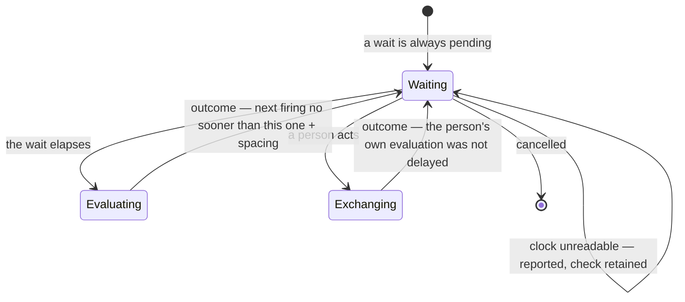

# SPEC-002: The host's scheduling behaviour

**Status:** active
**Kind:** technical
**Owns:** what the host does with a resolved next-check instant it already
holds — when it fires, how often it may fire, and what it does when the instant
has already passed.

<!-- A spec is evergreen and normative: it describes what is true now, not how
     it came to be true. No changelog, no revision history. Amending it requires
     explicit user endorsement. Requirement ids (R-N) are immutable — append,
     never renumber. Cite from elsewhere as SPEC-002/R-N. -->

## 1. Intent

SPEC-001 says how a next check is *resolved*: the latest valid instruction, else
a retained instant still ahead, else the configured default poll, always to a
concrete value (SPEC-001/R-26, R-27). It then stops, deliberately: its §2 puts
*"the timer that decides when to evaluate"* out of scope and names the seam —
*"[the timer] consumes [a resolved instant] and calls `evaluate`."*

That left one side of the seam written down and the other side not. The
consequences of the unwritten side are not small. A host that re-resolves a
schedule of its own accord fires at an instant it never told anyone about. A
host with no floor on its own evaluation rate can be driven into an exchange
loop by a backend that keeps asking to be checked in the past — which SPEC-001
requires it to store as given (R-28). A host that treats an elapsed instant as
an error rather than as a check that is due either underflows or falls silent.

This document is the other side of that seam. Once it exists, the rules that
keep a backend from turning a host into a busy loop are falsifiable rather than
implicit, and a second host implementation can be held to them.

## 2. Scope

**In scope:** when the host begins an evaluation of its own accord; the floor
on how often it may do so; what it does with a resolved instant at or before the
current one; and what a failure to read the clock does to a pending check.

**Out of scope:** how a next check is resolved (SPEC-001 §4, *Responses:
scheduling*); the wire format of the resulting request (SPEC-001 §6.1); retry of
a failed exchange; persistence of a schedule across host restarts; and any
notion of catching up on checks that were due while the host was not running.

**Boundaries:** this spec abuts SPEC-001 at exactly two points. It **consumes**
the resolved instant SPEC-001/R-26 produces, and it **produces** an `evaluate`
whose event kind SPEC-001/R-56 names. It reads no response and writes no
schedule.

## 3. Principles

**P-A — The host computes when to fire, never what to fire at.** The instant is
given. The host may compute how long until it, and nothing else. There is
exactly one place a next check is resolved, and the mechanism that waits is not
it.

**P-B — A floor bounds the host, not the backend.** What the host stores and
reports is what the backend sent, unadjusted (SPEC-001/R-28). What the host
spaces is its own firing. A rule that changes the stored instant is forbidden; a
rule that changes when the host acts on it is this document's subject.

**P-C — An elapsed instant is a check that is due.** It is not an error, not a
value to be clamped forward, and not a value to be skipped. It fires, and each
resolved instant fires at most once — but "once" is a statement about the
instant, not about the host. A backend free to instruct the past on every
response keeps producing new elapsed instants, and what bounds the host then is
P-D, not this principle.

**P-D — The host's own firing rate is bounded whatever the backend does.** A
minimum spacing separates one scheduled firing from the next, anchored to the
previous scheduled firing and cleared by nothing. It is the host's only defence
against a backend that keeps asking to be checked in the past, and it is stated
as a bound on firing so that it cannot be mistaken for an adjustment to a
stored instruction (P-B).

## 4. Requirements

| id | requirement | verified by |
|----|-------------|-------------|
| R-1 | The host MUST begin an `evaluate` when the resolved next check it holds comes due, without a person asking. | §7 |
| R-2 | The host MUST NOT resolve a next check anywhere but the one resolution SPEC-001/R-26 describes. In particular the mechanism that waits MUST NOT compute an instant of its own, and its whole input is the resolved instant the last exchange reported. | §7 |
| R-3 | A resolved next check at or before the current instant MUST fire as soon as R-4 permits, and MUST NOT fire repeatedly on account of having elapsed: each resolved instant fires at most once. Computing the wait to such an instant MUST NOT underflow. Whether the host then returns to its default cadence depends on what the backend next instructs, and R-4 is what bounds the host when it does not. | §7 |
| R-4 | The host MUST NOT begin a scheduled evaluation less than a fixed minimum spacing after the scheduled evaluation that preceded it, **whatever else the host did in between**. The spacing is **3 seconds**. It is not configurable, and nothing clears it. | §7 |
| R-5 | The minimum spacing applies to scheduled evaluations only — those the host begins of its own accord when a resolved next check comes due. It MUST NOT delay an evaluation a person asked for, and MUST NOT delay the host's startup evaluation. It says nothing about any other stimulus a host may acquire, and bounds none: **a host that adds a stimulus other than a due check MUST decide separately how that stimulus is bounded, and MUST NOT read this requirement as covering it.** | §7 |
| R-6 | The minimum spacing MUST NOT alter what the host stores or reports as its resolved next check. It bounds firing only. SPEC-001/R-28 is unaffected by it. | §7 |
| R-7 | Superseding a pending check MUST work in both directions: a newly resolved instant earlier than the pending one MUST shorten the wait, and a later one MUST lengthen it. | §7 |
| R-8 | A failure to read the clock MUST NOT discard a resolved next check, MUST be reported, and MUST NOT cause the host to evaluate in a loop. The host MUST remain able to fire once the clock can be read again. | §7 |
| R-9 | A scheduled evaluation MUST NOT begin while an exchange is in flight. At most one exchange runs at a time. | §7 |
| R-10 | Cancellation MUST take precedence over a due check, and a pending wait MUST NOT leave behind any task or handle that dropping the host's loop would fail to cancel (SPEC-001/R-48). | §7 |
| R-11 | The host MUST NOT evaluate once per interval that elapsed while it was not running. One check is due, and one evaluation discharges it. | §7 |

## 5. Behaviour

**The ordinary cadence.** An exchange completes and reports a resolved next
check. The host computes the wait as the difference between that instant and the
instant the request carried, floored at zero, and then defers the firing to no
earlier than the minimum spacing after the previous scheduled firing. When the
wait elapses, the host begins an `evaluate` with the `"scheduled"` kind.

**What a scheduled evaluation may replace.** A firing the host began of its own
accord is an evaluation like any other: if the backend answers it with a view,
that view replaces whatever presentation the host was retaining, and the
retained interaction identity is superseded (SPEC-001/R-33). A person looking
at a prompt when a check comes due may therefore find the answer they then give
refused as naming a superseded view — a refusal they did nothing to cause. R-4
bounds how often this can happen and nothing else does; R-5's *"MUST NOT delay
an evaluation a person asked for"* is about delay and says nothing about this.
OQ-4 carries the question of whether a host should suppress or defer such a
firing.
That exchange reports a new resolved next check and the cycle repeats.

**A backend asking for the past.** SPEC-001/R-28 stores the instruction as
given, so the host may hold an instant that has already passed. The wait to it
is zero, raised to the minimum spacing when one applies, and the host fires. The
instant does not fire again on account of having elapsed. What happens next
depends on the backend, and the two cases differ:

- **A one-off past instruction.** The following resolution finds no valid
  instruction and a retained value that no longer stands, so it applies the
  default poll (SPEC-001/R-26) and the host returns to its default cadence.
- **A past instruction on every response.** SPEC-001/R-26 returns the latest
  valid instruction verbatim, so the retained value is replaced rather than
  consumed, and the host never reaches the arm that would return it to cadence.
  It fires once immediately — the first firing of the process, before any
  scheduled firing has happened — and once per minimum spacing thereafter, for
  as long as the backend keeps doing it. **The minimum spacing is the only
  bound on this case**, and that is what it exists for.

**A broken backend.** A failed exchange accepts no instruction and resolves as
if none arrived (SPEC-001/R-29), so the host is left holding a correct instant
without the scheduling mechanism doing anything special. It fires again at that
instant. There is no retry and no back-off: the cadence is the retry, and the
host cannot know what a failed exchange already did.

**A broken clock.** The host cannot stamp a request without an instant, so it
does not begin one. It reports the refusal and retains the resolved next check.
A scheduled firing that is refused for want of a clock is still a scheduled
firing for the purposes of R-4, so the due check is retried no sooner than the
minimum spacing: an unreadable clock produces one report per spacing interval
rather than a loop, and the host recovers by itself when the clock recovers.
While it is broken, what the host reports as its next check is the instruction
it holds, which has by then passed; that is R-6 working, not a defect.

**Suspend and clock movement.** The host does not detect discontinuities. A wait
in progress is a wait in progress; nothing re-examines it against the wall clock,
and a host that wakes from suspend does not treat waking as an event. The
consequence is stated rather than hidden: a wait measured monotonically is not
consumed by time spent suspended, so a check due during a suspend arrives after
the host has been awake for the remainder of the wait.

## 6. Interfaces & contracts

The host owns: the pending wait, the minimum spacing, and the decision to fire.
It uses, without interpreting: the resolved next check SPEC-001/R-26 produces,
and the instant its own clock reports.

The scheduled evaluation's wire form is SPEC-001's, unchanged, with the event
kind SPEC-001/R-56 names for a firing that came due, `"scheduled"`. R-56 leaves
the set of kinds open; this spec adds no kind of its own and closes nothing.

The minimum spacing is a constant of the host, not a configured value, and not
a value a backend can read or influence. A configured default poll shorter than
it is accepted, and is honoured for the first scheduled firing of the process,
which no earlier scheduled firing precedes; every firing after that is spaced.

**What the host reports** as its resolved next check is the instruction it
holds (R-6), which is not always the instant it will fire on: the spacing, a
refused firing, and a suspend each move the firing later without moving the
instruction. A host that surfaces its next check to a person MUST NOT present
the instruction as a prediction of when it will fire.

## 7. Verification

Each row states the kind of verification, then names the test that discharges
it, by file and function, so the claim is checkable rather than asserted
(`docs/slices/003/plan.md` PHASE-06/EX-1). All paths are relative to the
repository root.

| requirement | verified by |
|---|---|
| R-1 | integration: a running host with a backend that supplies no `next_check` performs a second `evaluate` about one default poll after the first, evidenced by the backend's own invocation record — `crates/goad/tests/renderer/scheduling.rs::a_short_default_poll_is_honoured_unfloored_for_the_first_scheduled_check` |
| R-2 | structural: a scan asserting the resolution function has no call site outside the one the host reports from — `crates/goad-boundary/tests/checks/structure.rs::no_production_line_in_the_renderer_names_the_identifier_resolve` (absence, stratum 3) and `::schedule_resolve_is_called_only_from_host` (the call count, plus the assertion that the path is nowhere taken as a value, stratum 2) |
| R-3 | unit, on the pure wait computation: an instant at `now`, before `now`, and at the edge of representable time, at both floors — `crates/goad-semantics/src/schedule.rs::wait_for_an_instant_at_now_is_zero`, `::wait_for_a_past_instant_is_zero_not_an_underflow`, `::wait_for_is_total_at_the_past_edge_of_representable_time`, `::wait_for_is_total_at_the_future_edge_of_representable_time`, `::wait_for_a_future_instant_is_the_exact_difference`. Integration: a backend answering with a past instant every time is invoked a bounded number of times over an interval far shorter than the spacing — `crates/goad/tests/renderer/scheduling.rs::a_past_instant_on_every_response_fires_once_and_then_holds_at_the_floor` (repeated); the one-off successor case — `scheduling.rs::a_one_off_past_instruction_is_consumed_and_cadence_resumes` |
| R-4 | integration: a backend answering with a past instant every time yields a bounded invocation count over a window far shorter than the spacing — `crates/goad/tests/renderer/scheduling.rs::a_past_instant_on_every_response_fires_once_and_then_holds_at_the_floor`; a person acting in the middle of a scheduled cadence does not raise that count — `scheduling.rs::a_person_acting_mid_cadence_does_not_clear_the_floor`. The floor's *necessity* is **review, not a test**: it was established by zeroing the spacing and watching the anti-spin assertions fail, which is an experiment rather than a standing assertion, and the standing argument for it is §3 P-D and ADR-004 |
| R-5 | integration: the first scheduled evaluation of the process honours a default poll shorter than the spacing — `crates/goad/tests/renderer/scheduling.rs::a_short_default_poll_is_honoured_unfloored_for_the_first_scheduled_check`; an evaluation a person asks for is dispatched without waiting for it — `scheduling.rs::a_person_acting_mid_cadence_does_not_clear_the_floor` |
| R-6 | integration: what the host reports as its next check after a past instruction is the instruction, unchanged — the SPEC-001/R-28 assertion, re-read after this document exists — `crates/goad/tests/renderer/scheduling.rs::a_past_instant_on_every_response_fires_once_and_then_holds_at_the_floor`'s retained-`next_check` assertion |
| R-7 | integration: an instruction earlier than the pending check shortens the wait, observed as a firing inside a bound — `crates/goad/tests/renderer/scheduling.rs::an_earlier_instruction_supersedes_a_pending_far_deadline`; one later lengthens it, observed as no firing inside a window — `scheduling.rs::a_later_instruction_supersedes_and_the_earlier_deadline_does_not_fire` |
| R-8 | integration: a clock that fails produces the refusal and a bounded invocation count, and the retained check is unchanged — `crates/goad/tests/renderer/scheduling.rs::a_clock_that_fails_after_the_startup_exchange_refuses_and_holds`, with its vacuity control — `scheduling.rs::the_same_shape_with_a_working_clock_reaches_a_second_invocation` |
| R-9 | structural and by construction: the wait is one arm of a loop that runs one exchange at a time. No standing test asserts this directly; it is witnessed by six pre-existing `serve` tests continuing to pass with unchanged bodies once the timer arm was added — `crates/goad/tests/renderer/wiring.rs::a_click_naming_a_superseded_view_is_refused_with_no_backend_contact`, `::the_negative_control_with_no_intervening_evaluate_the_click_is_answered`, `::serve_drives_one_exchange_through_the_production_loop`, `::tripping_cancel_mid_exchange_ends_serve_well_under_the_timeout`, `::a_stop_tripped_before_the_first_poll_wins_over_a_ready_command`, `::on_stop_a_command_queued_behind_the_exchange_is_left_unread` |
| R-10 | integration: a stop request while a wait is pending ends the loop promptly — `crates/goad/tests/renderer/scheduling.rs::a_stop_issued_while_parked_on_the_timer_arm_ends_serve_well_inside_the_timeout`, alongside the three existing cancellation tests among R-9's six (`tripping_cancel_mid_exchange_ends_serve_well_under_the_timeout`, `a_stop_tripped_before_the_first_poll_wins_over_a_ready_command`, `on_stop_a_command_queued_behind_the_exchange_is_left_unread`) |
| R-11 | **review, not a test** — nothing persists, so there is no record of a missed interval to catch up from. The requirement records the intent for the slice that adds persistence. Named as such rather than left to look discharged (`docs/slices/003/plan.md` PHASE-06/EX-1) |

Nothing here is marked unverified. R-11, and R-4's necessity clause, are held
by **review** rather than by a test, each for the reason its row states: one has
no state a test could set up to falsify it, and the other is an argument for why
a bound exists rather than a behaviour anything can execute.

## 8. Open questions

- **OQ-1.** Whether a wait should be anchored to the wall clock rather than
  measured monotonically, so that a check due during a suspend fires on wake.
  Doing so means re-reading the clock while waiting, which is a clock failure
  path that does not exist today. Deferred until the limitation is observed to
  matter.
- **OQ-2.** Whether the minimum spacing should be reported to a backend that
  asked for something faster. Nothing in SPEC-001 carries host policy toward a
  backend, and inventing a channel for it here would be the wrong place.
- **OQ-3.** Whether a host should report *when it will fire* alongside the
  instruction it holds, for the three states in which they differ. Deferred:
  the firing instant is measured monotonically and has no wall-clock rendering
  without a second clock read, and the cheap repair — saying which of the two
  the reported value is — is already required by §6.
- **OQ-4.** Whether a host should suppress or defer a scheduled evaluation
  while a presentation is outstanding, so that a person's answer cannot be
  refused on account of a firing they did not cause. Suppression asks the host
  to judge that a view is worth protecting, which is domain meaning it does not
  hold; deferral needs a second pending state and a second writer of the
  deadline. Left open because the answer plausibly belongs to the backend —
  which knows what the view is for — rather than to the host.

## 9. References

- SPEC-001 §2, §4 (*Responses: scheduling*), §5, R-26 to R-29, R-45, R-48, R-56.
- ADR-001 (one-way strata) — the wait is I/O against real time and is not
  stratum 1's; the arithmetic behind it is.
- ADR-004 (the minimum spacing is anchored to the previous scheduled firing) —
  the decision behind R-4's anchor, and the record that its premise about
  non-scheduled stimuli is one a later slice will be tempted to reverse.
- `docs/slices/003/design.md` §5.4 — the loop shape this document describes in
  prose, and §7 D-2, D-3, D-8 for the decisions behind R-4, R-5 and the suspend
  behaviour. D-3 records why R-4 is anchored to the previous scheduled firing
  rather than to what the predecessor happened to be: the latter is equivalent
  only while every other stimulus is a person, which is a premise this
  project's own roadmap retires.
- `docs/brief.md` §9, §21 AC-3, AC-7, AC-8.
